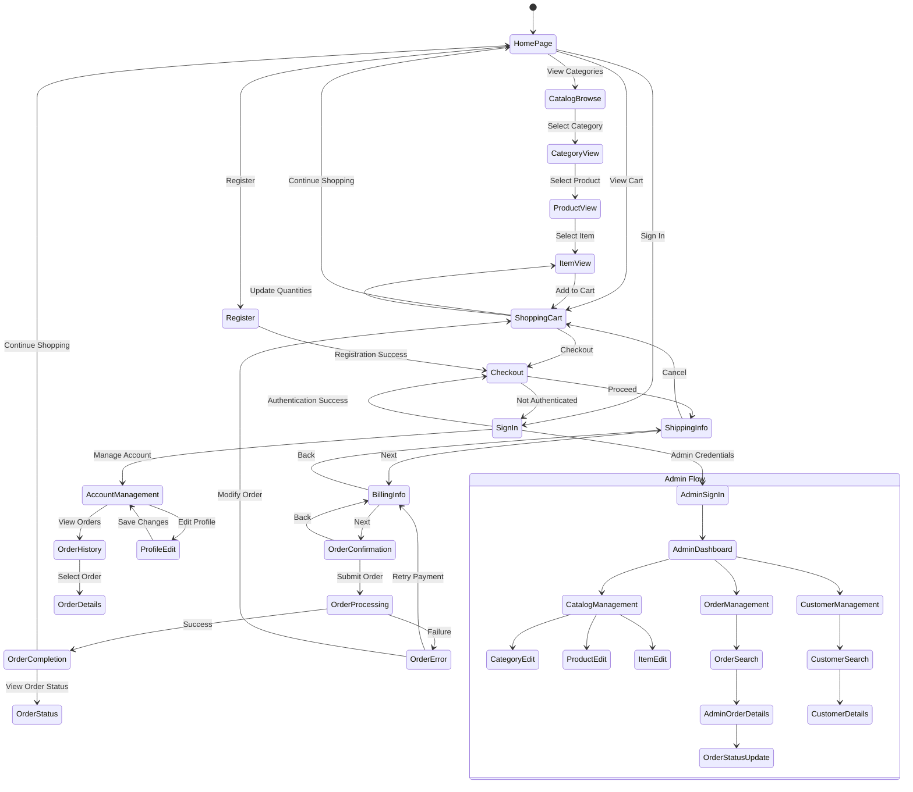

# Web Component Framework Analysis: Java Pet Store 1.3.2

## Introduction to the Web Application Framework

The Web Component Framework in Java Pet Store 1.3.2 serves as the foundational architecture for the application's web interface and interaction model. This framework, often referred to as WAF (Web Application Framework), implements a sophisticated Model-View-Controller (MVC) pattern specifically designed for enterprise Java applications. It provides a structured approach to handling HTTP requests, processing business logic, and rendering dynamic content to users. The framework abstracts the complexities of servlet-based web development by offering reusable components, standardized request processing flows, and template-based view management. As the backbone of the Pet Store's user interface, it enables developers to focus on business functionality rather than low-level web infrastructure concerns. The framework's design emphasizes separation of concerns, allowing for clear distinctions between presentation logic, business rules, and data access patterns, which aligns with J2EE best practices of the era. This modular approach facilitates maintenance, testing, and extension of the application's web components while providing a consistent user experience across the entire Pet Store application.

## Web Framework Architecture

The Web Framework Architecture diagram illustrates the comprehensive structure of the Java Pet Store's web component framework. At its core is a Front Controller Servlet that intercepts all incoming HTTP requests and delegates processing to specialized components. The Controller Framework contains the request processor that parses incoming requests, consults action mappings to determine appropriate handlers, and coordinates the execution of business logic through action handlers. The View Management subsystem handles template selection, resource loading, and final HTML rendering through a sophisticated template management system that supports internationalization via resource bundles. The Component Registry provides service location and dependency management capabilities, allowing for loose coupling between framework components. State Management components handle user session data, form processing, and input validation. This architecture demonstrates how the framework implements a complete MVC pattern while providing integration points with the business tier through EJB components and business services, creating a clean separation between presentation logic and business functionality.

## Controller Framework Implementation

The Controller Framework implementation in Java Pet Store 1.3.2 represents a sophisticated adaptation of the MVC pattern for enterprise web applications. At its heart lies a Front Controller servlet that intercepts all incoming HTTP requests, providing a centralized entry point for request processing. This controller delegates to a RequestProcessor component that determines which action should handle the request based on URL patterns defined in XML configuration files. The framework implements a command pattern through Action classes, each responsible for executing specific business logic and determining the next view to display. These Action implementations are decoupled from HTTP specifics, allowing them to focus purely on application logic while the framework handles request parameter extraction, type conversion, and form binding. The framework supports both synchronous and asynchronous processing models, with the ability to chain multiple actions together for complex workflows. Error handling is managed through a standardized exception framework that maps exceptions to appropriate error views while maintaining detailed logging. The controller framework also implements sophisticated flow control through a ScreenFlowManager that maintains navigation rules, allowing for conditional transitions between screens based on action outcomes. This approach enables developers to define complex user journeys through configuration rather than code, enhancing maintainability and flexibility. The framework's action mapping system supports wildcards and parameterized paths, providing flexibility in URL design while maintaining a clean separation between URLs exposed to users and internal implementation details.

## Template Management System

The Template Management System in Java Pet Store's Web Component Framework provides a sophisticated approach to maintaining consistent UI presentation across the application. It implements a composite view pattern where page layouts are defined as templates with placeholder regions that can be populated with dynamic content. This system separates the structural elements of the UI (headers, footers, navigation) from the content-specific elements, enabling consistent branding and navigation while allowing page-specific content to vary. Templates are defined using JSP files with custom tags that mark insertion points for dynamic content. The framework supports template inheritance, allowing specialized templates to extend base templates while overriding specific regions. This hierarchical approach reduces duplication and ensures visual consistency. Content fragments are managed as separate JSP components that can be dynamically included based on application state, user preferences, or request parameters. The template system integrates with the framework's internationalization support, allowing text elements within templates to be externalized in resource bundles for multi-language support. Template selection is handled dynamically at runtime based on factors such as the requested action, user preferences, device capabilities, and locale settings. This flexibility enables the framework to adapt the presentation layer without modifying business logic. Performance optimization is achieved through selective caching of template fragments and compiled JSPs, reducing rendering time for frequently accessed pages. The template system also provides mechanisms for including client-side resources like JavaScript and CSS, with dependency management to prevent duplicate inclusions and ensure proper loading order.

## Request Processing Flow

The Request Processing Flow diagram illustrates the comprehensive journey of an HTTP request through the Java Pet Store's Web Component Framework. When a request arrives, it is first intercepted by the Front Controller Servlet, which serves as the single entry point for all web interactions. The controller performs URL pattern matching against configured action mappings to determine the appropriate handler. If no match is found, the request is routed to a default handler or returns a 404 response.

For matched requests, the framework applies pre-processing filters that handle cross-cutting concerns such as character encoding, compression, or logging. Authentication checks ensure the user has appropriate permissions for the requested resource. If authentication fails, the user is redirected to a login page.

For form submissions, the framework automatically binds request parameters to form beans, performing type conversion as needed. Validation logic is then applied to ensure data integrity, with any validation errors resulting in a return to the input form with appropriate error messages.

When validation succeeds, the framework executes the appropriate Action class, which contains the business logic or delegates to service components. The action result determines which view should be displayed next, with different paths for success and failure scenarios.

View selection identifies the appropriate template, which is then populated with data from the model. The template system applies the selected layout, incorporating dynamic content into the page structure. Post-processing filters may apply final transformations before the completed HTTP response is sent to the browser.

This sophisticated flow demonstrates how the framework handles the complete request lifecycle while maintaining separation between presentation logic, business processing, and view rendering.

## Component Organization and Registry

The Component Organization and Registry system in the Java Pet Store's Web Component Framework implements a sophisticated service location and dependency management mechanism. Components are organized into logical categories based on their functionality, such as controllers, validators, service facades, and view helpers. Each component is registered with a central ComponentManager that acts as a service registry, providing runtime discovery and instantiation of components. This registry supports both singleton and prototype component lifecycles, allowing developers to specify whether components should be shared across requests or instantiated fresh for each use. Components are defined declaratively in XML configuration files, specifying implementation classes, initialization parameters, and dependency relationships. This approach enables loose coupling between framework elements, as components reference each other through interfaces rather than concrete implementations. The registry implements a hierarchical namespace that allows components to be organized by functional area, preventing naming collisions while maintaining logical grouping. Component lookup is optimized through caching mechanisms that reduce the overhead of repeated service location operations. The framework supports lazy initialization of components, instantiating them only when first requested, which improves startup performance. For testing purposes, the registry allows component implementations to be substituted at runtime, facilitating mock object injection without code changes. The component system also provides lifecycle management hooks, allowing components to perform initialization and cleanup operations when added to or removed from the registry. This comprehensive component organization approach enables the framework to maintain modularity and extensibility while providing a consistent mechanism for service discovery and integration across the application.

## State and Session Management

The Web Component Framework in Java Pet Store 1.3.2 implements a sophisticated state and session management system that addresses the stateless nature of HTTP while providing a seamless user experience. The framework maintains user state across multiple interactions through a multi-tiered approach that balances performance, scalability, and user convenience. At the core is a SessionManager component that abstracts the underlying J2EE HttpSession mechanism, providing a more structured API for storing and retrieving session attributes. This manager implements intelligent session scoping, allowing developers to define data as request-scoped, session-scoped, or application-scoped based on its lifecycle requirements. To optimize memory usage and support clustering, the framework implements a session partitioning strategy where only essential navigation and identification data is kept in the HTTP session, while larger data structures are persisted to the database or EJB tier when appropriate. The framework supports both explicit and implicit state management patterns. In the explicit pattern, developers manually store and retrieve session attributes through the SessionManager API. The implicit pattern leverages form beans and screen flow definitions to automatically maintain state between requests without explicit developer intervention. For multi-page workflows like checkout processes, the framework provides a WizardManager component that maintains the state of partially completed processes, allowing users to navigate forward and backward while preserving entered information. The session management system integrates with the security framework to store authentication and authorization information, ensuring that protected resources are only accessible to authenticated users with appropriate permissions. To address session timeout issues, the framework implements session timeout detection and graceful recovery mechanisms, preserving user work where possible and providing clear feedback when sessions expire. This comprehensive approach to state management enables the Pet Store application to maintain complex user interactions while addressing the technical constraints of web application development.

## Component Dependencies

The Component Dependencies diagram illustrates the intricate relationships between various components within the Java Pet Store's Web Component Framework and how they integrate with the application's business logic. At the core of the framework is the Front Controller, which delegates to the Request Processor for handling incoming requests. The Request Processor relies on the Action Mapper to determine which Action Handler should process a particular request, while the Component Registry manages the lifecycle and dependencies of all framework components.

The Controller Components section shows how Action Handlers interact with Form Binders for parameter mapping, Validators for input verification, and the Screen Flow Manager for navigation control. These components work together to process user input and determine the appropriate application response.

View Components handle the rendering process, with the View Resolver selecting the appropriate view based on action results, the Template Processor applying templates, and the Resource Manager providing access to localized resources. The Custom Tag Library extends JSP functionality with framework-specific tags.

State Management components maintain user data across requests, with the Session Manager handling session attributes, the Form Processor managing form submissions, and the Validation Engine verifying input data integrity.

The diagram also shows how Pet Store-specific actions extend the framework's Action Handler base classes and integrate with business components through facade interfaces. This layered architecture demonstrates how the framework provides a structured foundation that Pet Store application components can build upon, maintaining clear separation between web presentation logic and business functionality.

This dependency structure enables modularity and extensibility while providing a consistent approach to web request handling throughout the application.

## Form Processing and Validation

The Web Component Framework in Java Pet Store 1.3.2 implements a sophisticated form processing and validation system that streamlines the handling of user input while ensuring data integrity. The framework automatically maps HTTP request parameters to JavaBean properties through a FormBinder component that handles type conversion for primitive types, dates, and custom objects. This binding process supports nested object graphs, allowing complex form structures to be represented as hierarchical Java objects. The validation system operates at multiple levels, starting with client-side JavaScript validation for immediate feedback, followed by server-side validation for security and consistency. Validation rules are defined declaratively in XML configuration files, separating validation logic from both form display and business processing. The framework supports both field-level validations (required fields, data types, value ranges) and cross-field validations that enforce business rules spanning multiple inputs. When validation errors occur, the framework automatically populates error messages and returns to the input view, preserving user input to avoid data re-entry. These error messages are internationalized through resource bundles, ensuring appropriate feedback in the user's preferred language. The validation framework is extensible through a plugin architecture that allows custom validators to be registered for application-specific requirements. For multi-page forms, the framework maintains form state across requests, allowing users to navigate back and forth without losing entered data. The form processing system integrates with the framework's security features to prevent cross-site request forgery and parameter tampering attacks. Additionally, the framework implements automatic form token generation and verification to prevent duplicate form submissions, addressing a common usability issue in web applications. This comprehensive approach to form handling reduces boilerplate code while providing robust validation and security features.

## View Management and Rendering

The View Management and Rendering system in the Java Pet Store's Web Component Framework implements a sophisticated approach to generating the application's user interface. The framework separates view selection logic from view rendering, allowing actions to specify logical view names that are resolved to actual templates through a ViewResolver component. This indirection enables views to be reorganized or replaced without modifying controller logic. The rendering process follows a composite view pattern where page layouts are defined as templates with content regions that can be populated dynamically. This approach ensures visual consistency while allowing page-specific content to vary. The framework supports multiple view technologies, with primary support for JSP but extensible to include other rendering engines. View selection is context-aware, taking into account factors such as the requested action, user preferences, device capabilities, and internationalization settings. This allows the application to adapt its presentation based on runtime conditions. Data transfer between controllers and views is managed through a structured context object that provides type-safe access to model attributes. The framework implements lazy loading of view data, where expensive operations are deferred until their results are actually needed during rendering. For performance optimization, the view system supports partial page updates where only modified portions of a page are re-rendered, reducing bandwidth requirements for AJAX-style interactions. View components can be nested and reused across multiple pages, promoting consistency and reducing duplication. The framework also provides specialized view helpers for common UI patterns such as pagination, sorting, and filtering of data collections. These helpers encapsulate complex presentation logic, allowing view templates to remain focused on layout and formatting. The view rendering process integrates with the framework's internationalization system, automatically selecting appropriate resource bundles based on the user's locale and applying message formatting during template processing. This comprehensive view management approach enables the Pet Store application to maintain a consistent, adaptable user interface while clearly separating presentation concerns from business logic.

## Screen Flow Navigation

The Screen Flow Navigation diagram illustrates the comprehensive navigation paths and screen transitions supported by the Web Component Framework within the Java Pet Store application. This diagram represents the application's state machine, showing how users move between different screens based on their actions and the system's responses.

The main user flow begins at the HomePage, which serves as the central hub for navigation. From there, users can browse the product catalog through a hierarchical navigation path (CatalogBrowse → CategoryView → ProductView → ItemView), with each step revealing more detailed information about available products. The shopping experience continues with cart management and a multi-step checkout process that includes authentication (if needed), shipping information collection, billing details, order confirmation, and completion.

The framework manages these transitions through a ScreenFlowManager component that maintains navigation rules in configuration files rather than hardcoding them in application logic. This approach allows for flexible modification of user journeys without code changes. The diagram also shows how the framework handles conditional transitions, such as redirecting unauthenticated users to the SignIn page during checkout while remembering their intended destination.

The administrative flow (shown in the nested state) demonstrates how the framework supports role-based screen flows, with administrators accessing specialized screens for catalog, order, and customer management. These separate flows maintain appropriate access controls while leveraging the same underlying navigation framework.

The screen flow system integrates with the framework's form processing and validation components, automatically returning users to input screens when validation errors occur while preserving entered data. This comprehensive navigation management enables the Pet Store application to guide users through complex business processes while maintaining a consistent and intuitive user experience.

## Build Process and Deployment

The Web Component Framework's build process and deployment methodology in Java Pet Store 1.3.2 exemplifies the enterprise Java build practices of its era while providing a foundation for the application's web tier. The build system is primarily based on Apache Ant, as evidenced by the build.bat script that configures the necessary environment variables and classpath before invoking the Ant build tool. This approach ensures consistent builds across different development environments by explicitly setting paths to required dependencies like J2EE libraries. The build process is organized into distinct phases including compilation, JAR assembly, documentation generation, and deployment preparation. Source code is compiled against the J2EE 1.3 APIs, with the resulting classes organized into a structured directory hierarchy that separates framework components from application-specific code. The framework components are packaged into a dedicated WAF (Web Application Framework) JAR file that can be reused across multiple applications, demonstrating an early approach to creating shared libraries. Configuration files, including action mappings, validation rules, and resource bundles, are processed during the build to validate their syntax and ensure consistency. The deployment process integrates with the J2EE deployment model, packaging the framework components along with application-specific web resources into a WAR (Web Application Archive) file. This archive includes a web.xml deployment descriptor that configures the framework's Front Controller servlet and establishes URL mappings. For production deployment, the build system supports the creation of optimized packages with minified resources and precompiled JSPs to improve runtime performance. The framework also includes deployment-time configuration options that allow certain behaviors to be customized for different environments without code changes. This comprehensive build and deployment approach ensures that the Web Component Framework can be consistently built, tested, and deployed as part of the larger Java Pet Store application while maintaining clear separation between framework infrastructure and application-specific components.

[Generated by the Sage AI expert workbench: 2025-03-21 23:18:02  https://sage-tech.ai/workbench]: #