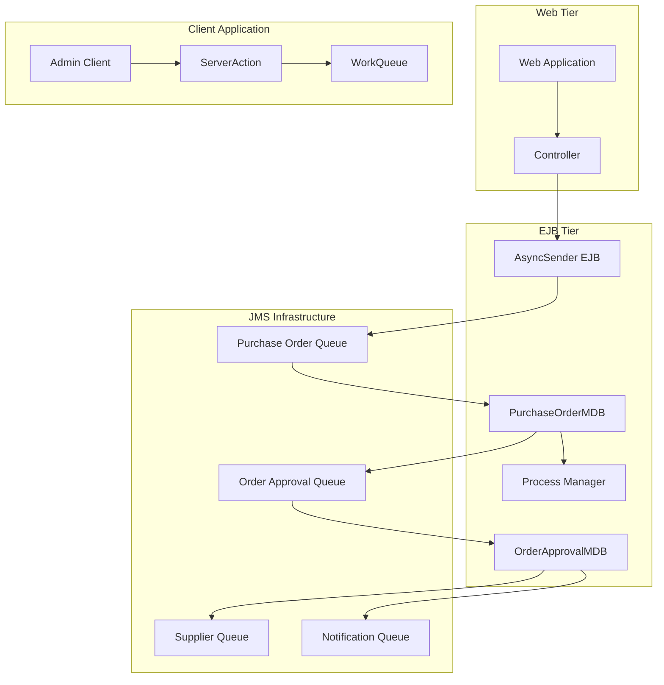
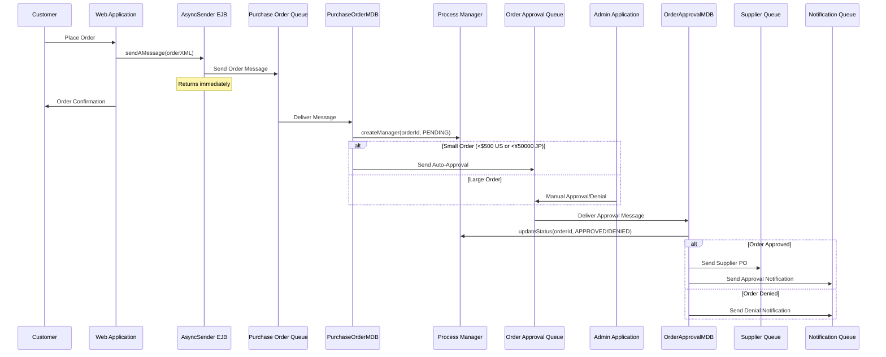
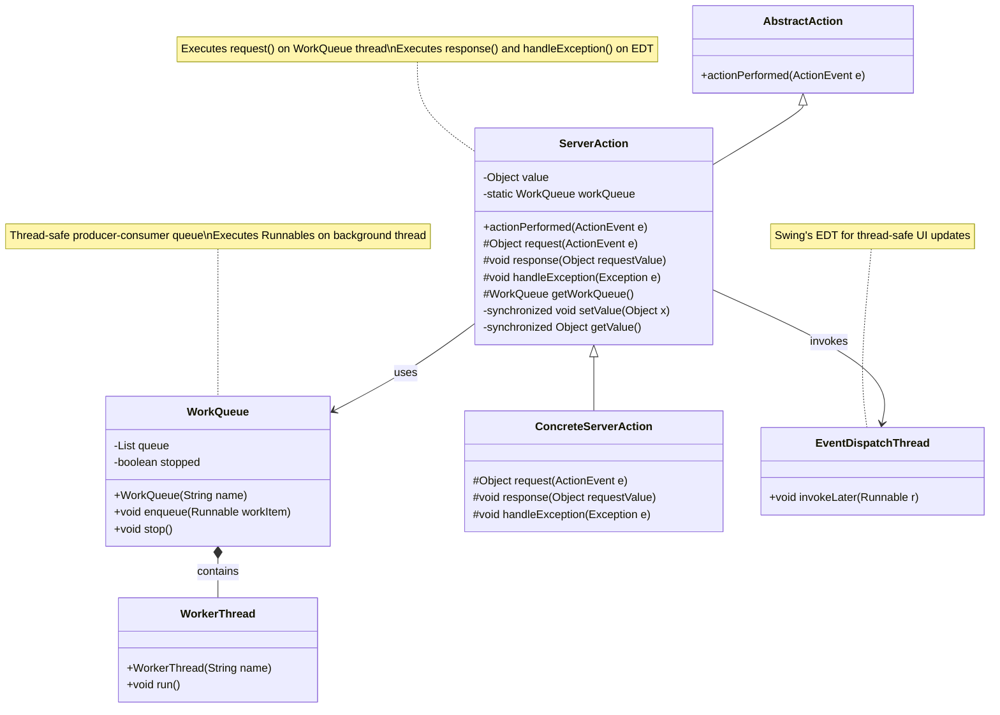
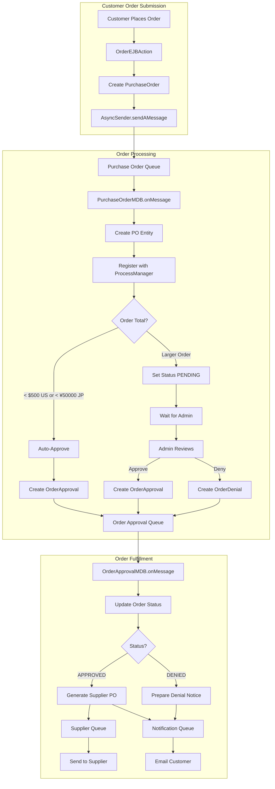

# Asynchronous Processing in Java Pet Store 1.3.2

## Introduction to Asynchronous Processing in Java Pet Store

Java Pet Store 1.3.2 implements a sophisticated asynchronous processing architecture to handle time-consuming operations without blocking user interactions. This approach is critical for maintaining application responsiveness and scalability in an e-commerce environment where operations like order processing, inventory updates, and customer notifications must occur reliably without impacting the user experience.

The asynchronous processing architecture in Java Pet Store leverages Java Message Service (JMS) for server-side operations and custom thread management for client-side processing. This separation of concerns allows the application to handle varying loads efficiently while maintaining transactional integrity across distributed components.

The core of this architecture is built around several key components:

1. The AsyncSender EJB, which provides a facade for sending messages asynchronously
2. Message-Driven Beans (MDBs) that consume messages and perform business operations
3. JMS queues that serve as reliable message channels between components
4. Transaction management to ensure data consistency across asynchronous boundaries
5. Client-side asynchronous processing patterns for UI responsiveness

This design allows Java Pet Store to handle complex workflows like order processing in a non-blocking manner, improving both scalability and user experience.

## Asynchronous Processing Architecture Overview



The diagram illustrates the asynchronous processing architecture of Java Pet Store 1.3.2. At its core, the system uses a message-driven approach to decouple components and enable non-blocking operations.

When a customer places an order through the web interface, the order is processed by the Controller, which uses the AsyncSender EJB to place the order message on a JMS queue. This operation returns immediately, allowing the customer to continue browsing without waiting for order processing to complete.

The PurchaseOrderMDB consumes messages from the queue and processes them asynchronously. For small orders (under $500 for US customers or ¥50,000 for Japanese customers), it automatically approves them and forwards them to the Order Approval queue. Larger orders are placed in a pending state for administrator review.

The OrderApprovalMDB processes approved orders by updating the order status in the database, generating supplier purchase orders, and preparing customer notifications. These operations are further delegated to other components through additional message queues.

The Admin Client application uses a client-side asynchronous processing pattern with WorkQueue and ServerAction classes to maintain UI responsiveness while performing potentially lengthy server operations.

This architecture demonstrates how Java Pet Store effectively separates concerns and implements asynchronous processing patterns to achieve scalability and responsiveness.

## The AsyncSender Component

The AsyncSender component is a critical piece of Java Pet Store's asynchronous processing architecture. Implemented as a stateless session EJB, it provides a clean facade that abstracts the complexities of JMS messaging from the rest of the application. This component enables a "fire-and-forget" pattern where application components can initiate asynchronous operations without waiting for their completion.

The AsyncSender interface is deliberately minimal, exposing only a single method:

```java
public void sendAMessage(String message);
```

This simplicity is by design - it allows any component to submit a message for asynchronous processing without needing to understand the underlying messaging infrastructure. The implementation handles all the details of JMS connection management, message creation, and delivery.

Under the hood, the AsyncSender EJB connects to a JMS QueueConnectionFactory and sends messages to a configured AsyncSenderQueue. The EJB deployment descriptor (ejb-jar.xml) specifies that the sendAMessage method requires a transaction, ensuring that message sending is part of the caller's transaction context. This is crucial for maintaining data consistency - if the caller's transaction rolls back, the message will not be sent.

The AsyncSender component serves as the entry point to the asynchronous processing pipeline. For example, when a customer submits an order, the OrderEJBAction creates a PurchaseOrder object, converts it to XML, and passes it to the AsyncSender:

```java
AsyncSender sender = home.create();
sender.sendAMessage(purchaseOrder.toXML());
```

This pattern appears throughout the application wherever operations need to be processed asynchronously. By centralizing the messaging logic in a single component, Java Pet Store achieves better maintainability and consistency in its asynchronous processing implementation.

## Message-Driven Beans for Asynchronous Processing

Java Pet Store 1.3.2 employs Message-Driven Beans (MDBs) as the primary mechanism for asynchronous processing on the server side. Two key MDBs in the system are PurchaseOrderMDB and OrderApprovalMDB, which together form the backbone of the order processing workflow.

PurchaseOrderMDB is the first step in the order fulfillment process. It receives XML purchase order messages from the AsyncSender component and performs several critical functions:

1. It creates PurchaseOrder EJB entities to persist order information
2. It initiates the workflow process by registering with the ProcessManager
3. It implements business logic for automatic approval of small orders
4. For approved orders, it creates and sends approval messages to the next stage

The automatic approval logic in PurchaseOrderMDB demonstrates a practical business rule implementation:

```java
private boolean canIApprove(PurchaseOrder purchaseOrder) {
    Locale locale = purchaseOrder.getLocale();
    if (locale.equals(Locale.US)) {
        if (purchaseOrder.getTotalPrice() < 500) return true;
    } else if (locale.equals(Locale.JAPAN)) {
        if (purchaseOrder.getTotalPrice() < 50000) return true;
    }
    return false;
}
```

OrderApprovalMDB handles the next stage in the process. It consumes approval messages (either from automatic approval or administrator action) and:

1. Updates the order status in the database via the ProcessManager
2. Generates supplier purchase orders for approved orders
3. Prepares notifications for customer relations

Both MDBs follow a similar pattern of implementation:
- The `onMessage()` method receives JMS messages and delegates to internal methods
- Business logic is encapsulated in a `doWork()` method
- Results are passed to the next stage via a `doTransition()` method that uses a TransitionDelegate

This separation of concerns makes the code more maintainable and testable. The MDBs focus on their specific business logic while delegating the mechanics of message sending to the TransitionDelegate implementations.

The asynchronous nature of MDBs provides several advantages:
- They can process messages at their own pace without blocking client threads
- They can be scaled independently by configuring multiple instances
- They automatically participate in container-managed transactions
- They provide reliable processing with built-in error handling and recovery

This architecture allows Java Pet Store to handle varying loads efficiently while maintaining the integrity of the order processing workflow.

## Order Processing Workflow



The diagram illustrates the asynchronous order processing workflow in Java Pet Store 1.3.2. This sequence shows how orders flow through the system from submission to fulfillment without blocking operations.

When a customer places an order, the web application converts it to XML and sends it via the AsyncSender EJB to the Purchase Order Queue. This operation completes quickly, allowing the web application to return an order confirmation to the customer immediately, without waiting for the entire order processing to complete.

The PurchaseOrderMDB consumes the message from the queue and creates a workflow entry in the Process Manager with an initial status of "PENDING". For small orders (under $500 for US customers or ¥50,000 for Japanese customers), the MDB automatically approves them and forwards them to the Order Approval Queue. Larger orders remain in the PENDING state until an administrator reviews them through the Admin Application.

Once an approval (either automatic or manual) reaches the Order Approval Queue, the OrderApprovalMDB processes it by updating the order status in the Process Manager. For approved orders, it generates supplier purchase orders and sends them to the Supplier Queue for fulfillment. It also prepares customer notifications and sends them to the Notification Queue.

This workflow demonstrates several key aspects of asynchronous processing:

1. Operations that don't need to complete immediately are offloaded to background processes
2. The system can handle varying loads by adjusting the rate of message consumption
3. Different stages of processing can be scaled independently
4. The workflow continues even if components are temporarily unavailable

The asynchronous nature of this workflow significantly improves the scalability and responsiveness of the Java Pet Store application.

## Transaction Management in Asynchronous Operations

Transaction management across asynchronous boundaries is one of the more complex aspects of Java Pet Store's architecture. The application must ensure data consistency while operations span multiple threads, components, and potentially different points in time.

Java Pet Store employs a combination of container-managed transactions (CMT) and carefully designed message flows to maintain transactional integrity. The key principle is that each asynchronous step is treated as a separate transaction, with messaging providing the reliable bridge between them.

The AsyncSender EJB's `sendAMessage` method is configured with a transaction attribute of "Required" in the ejb-jar.xml:

```xml
<container-transaction>
  <method>
    <ejb-name>AsyncSenderEJB</ejb-name>
    <method-intf>Local</method-intf>
    <method-name>sendAMessage</method-name>
    <method-params>
      <method-param>java.lang.String</method-param>
    </method-params>
  </method>
  <trans-attribute>Required</trans-attribute>
</container-transaction>
```

This ensures that when a component like OrderEJBAction calls AsyncSender, the message sending occurs within the same transaction as the business operation. If the transaction rolls back, the message is not sent, preventing inconsistent states.

On the receiving side, Message-Driven Beans like PurchaseOrderMDB and OrderApprovalMDB operate in their own transaction contexts. When a message is consumed, a new transaction begins, and all operations within the MDB's `onMessage` method are part of that transaction. If an exception occurs, the transaction rolls back, and the JMS infrastructure can redeliver the message according to configured policies.

This approach creates a chain of discrete transactions linked by reliable messaging:

1. Transaction 1: Business operation + message sending
2. JMS infrastructure reliably stores the message
3. Transaction 2: Message consumption + next business operation

The ProcessManager component plays a crucial role in maintaining state across these transaction boundaries. It provides a persistent record of each order's status, allowing the system to recover from failures and avoid duplicate processing.

For example, in OrderApprovalMDB, before processing an approval, it checks the current status:

```java
String curStatus = processManager.getStatus(co.getOrderId());
if(!curStatus.equals(OrderStatusNames.PENDING)) {
  continue;
}
```

This prevents reprocessing orders that have already moved beyond the pending state, which could happen if a message is delivered more than once.

This combination of transactional messaging, idempotent operations, and state management allows Java Pet Store to maintain data consistency while benefiting from the scalability advantages of asynchronous processing.

## Client-Side Asynchronous Processing

Java Pet Store 1.3.2 doesn't limit asynchronous processing to the server side. The Admin client application implements a sophisticated client-side asynchronous processing pattern to maintain UI responsiveness while performing potentially lengthy operations.

The client-side asynchronous architecture is built around two key classes: `WorkQueue` and `ServerAction`. These classes work together to execute operations on background threads while ensuring that UI updates occur on the Event Dispatch Thread (EDT), following Swing's threading model.

`WorkQueue` implements a producer-consumer pattern with a dedicated worker thread:

```java
public final void enqueue(Runnable workItem) {
    synchronized(queue) {
        queue.add(workItem);
        queue.notify();
    }
}
```

This allows the application to submit tasks for background execution without blocking the EDT. The worker thread runs at minimum priority to avoid competing with more important threads:

```java
WorkerThread(String name) {
    super(name);
    setPriority(Thread.MIN_PRIORITY);
}
```

`ServerAction` extends Swing's `AbstractAction` and provides a framework for executing requests asynchronously. It defines a template method pattern with three key methods that subclasses override:

1. `request(ActionEvent)` - Executed on the background thread to perform the actual work
2. `response(Object)` - Executed on the EDT to update the UI with the result
3. `handleException(Exception)` - Executed on the EDT to handle any errors

The `actionPerformed` method orchestrates this flow:

```java
public void actionPerformed(final ActionEvent actionEvent) {
    final Runnable doRequest = new Runnable() {
        public void run() {
            try {
                setValue(request(actionEvent));
            }
            catch (final Exception e) {
                // Schedule exception handling on EDT
                EventQueue.invokeLater(new Runnable() {
                    public void run() {
                        handleException(e);
                    }
                });
            }
            // Schedule response on EDT
            EventQueue.invokeLater(new Runnable() {
                public void run() {
                    response(getValue());
                }
            });
        }
    };

    getWorkQueue().enqueue(doRequest);
}
```

This pattern ensures that:
1. Long-running operations don't freeze the UI
2. UI updates occur on the EDT, preventing threading issues
3. Exceptions are properly handled and displayed to the user
4. The code remains maintainable by separating concerns

The Admin application uses this pattern extensively for operations like retrieving order lists, approving orders, and updating inventory. By implementing asynchronous processing on both client and server sides, Java Pet Store achieves a responsive and scalable architecture throughout the application stack.

## Client-Side Asynchronous Processing Pattern



The diagram illustrates the client-side asynchronous processing pattern implemented in the Java Pet Store Admin application. This pattern enables responsive UI interactions while performing potentially lengthy operations against the server.

At the core of this pattern is the relationship between `ServerAction`, `WorkQueue`, and the Swing Event Dispatch Thread (EDT). The pattern follows these key principles:

1. **Separation of threading concerns**: Long-running operations run on background threads, while UI updates occur on the EDT
2. **Thread-safe communication**: Synchronized methods ensure safe data transfer between threads
3. **Centralized worker thread management**: A single `WorkQueue` is shared across all `ServerAction` instances
4. **Template method pattern**: Concrete actions override specific methods rather than implementing threading logic

When a user triggers an action (like approving an order), the flow proceeds as follows:

1. The `actionPerformed` method is called on the EDT
2. It creates a `Runnable` that will execute the `request` method
3. This `Runnable` is enqueued on the `WorkQueue`
4. The `WorkQueue`'s `WorkerThread` executes the `request` method on a background thread
5. When `request` completes, another `Runnable` is scheduled on the EDT to execute the `response` method
6. If an exception occurs, a different `Runnable` is scheduled to execute the `handleException` method on the EDT

This pattern is particularly valuable for client applications that need to maintain UI responsiveness while performing network operations or other time-consuming tasks. The Admin application uses this pattern for all server interactions, ensuring that administrators can continue working even while operations are in progress.

The pattern also demonstrates good object-oriented design principles by:
- Encapsulating threading logic in reusable components
- Using inheritance to provide common functionality
- Employing composition to manage thread lifecycle
- Providing clear separation of concerns between UI and business logic

This client-side asynchronous processing pattern complements the server-side asynchronous architecture, creating a consistent approach to handling potentially lengthy operations throughout the Java Pet Store application.

## Transition Delegates for Asynchronous Workflow

The TransitionDelegate pattern is a key architectural element in Java Pet Store's asynchronous processing framework. This pattern abstracts the mechanics of sending messages between asynchronous components, allowing the business logic to focus on what needs to be communicated rather than how the communication occurs.

At its core, the TransitionDelegate pattern consists of:

1. A `TransitionDelegate` interface that defines the contract for sending messages
2. Concrete implementations that handle specific transition types
3. A factory for creating the appropriate delegate instances
4. Integration points in the Message-Driven Beans that use the delegates

The pattern is particularly evident in the OrderApprovalMDB, which uses a TransitionDelegate to forward messages to suppliers and customer relations:

```java
private void doTransition(Collection supplierPoList, String xmlMailOrderApprovals) throws TransitionException {
    TransitionInfo info = new TransitionInfo(xmlMailOrderApprovals, supplierPoList);
    transitionDelegate.doTransition(info);
}
```

This abstraction provides several benefits:

1. **Decoupling**: The MDB doesn't need to know the details of how messages are sent to the next stage
2. **Configurability**: Different transition implementations can be selected through configuration
3. **Testability**: Mock delegates can be used for testing business logic without messaging infrastructure
4. **Flexibility**: The transition mechanism can be changed without modifying the business logic

The TransitionDelegate is typically configured through JNDI properties, as seen in the OrderApprovalMDB initialization:

```java
String tdClassName = serviceLocator.getString(JNDINames.TRANSITION_DELEGATE_ORDER_APPROVAL);
TransitionDelegateFactory tdf = new TransitionDelegateFactory();
transitionDelegate = tdf.getTransitionDelegate(tdClassName);
transitionDelegate.setup();
```

This allows the application to be configured with different transition implementations for different environments (development, testing, production) or to accommodate changes in the messaging infrastructure.

The TransitionInfo class serves as a data transfer object that encapsulates all the information needed for the transition. This approach allows the delegate to have a simple interface while supporting complex transition scenarios.

The TransitionDelegate pattern is a sophisticated application of the Strategy pattern combined with Factory and Dependency Injection patterns. It demonstrates how Java Pet Store uses object-oriented design principles to create a flexible and maintainable asynchronous processing architecture.

## Error Handling in Asynchronous Operations

Error handling in asynchronous systems presents unique challenges, as errors occur in different threads, potentially at different times, from the operations that initiated them. Java Pet Store 1.3.2 implements several strategies to address these challenges and ensure robust error handling across its asynchronous architecture.

At the server level, Java Pet Store leverages the JMS infrastructure's built-in error handling capabilities. When an exception occurs in a Message-Driven Bean, the container rolls back the transaction, and the message can be redelivered according to configured policies. This provides a basic recovery mechanism for transient errors.

For more complex error scenarios, the application implements several patterns:

1. **Exception propagation to EJB container**: MDBs convert checked exceptions to EJBException, allowing the container to manage transaction rollback and potential message redelivery:

```java
catch(XMLDocumentException xde) {
  throw new EJBException(xde);
}
```

2. **State validation before processing**: MDBs check the current state before processing messages to prevent duplicate processing or processing messages in an incorrect order:

```java
String curStatus = processManager.getStatus(co.getOrderId());
if(!curStatus.equals(OrderStatusNames.PENDING)) {
  continue;
}
```

3. **Process Manager pattern**: The ProcessManager component maintains the state of each order, allowing the system to recover from failures by providing a consistent view of order status.

4. **Idempotent operations**: Operations are designed to be idempotent where possible, meaning they can be safely retried without causing inconsistencies.

On the client side, the ServerAction class provides a dedicated error handling mechanism through its handleException method:

```java
protected void handleException(Exception e) {
    // Subclasses override this to handle exceptions
}
```

This method is called on the Event Dispatch Thread when an exception occurs during asynchronous processing, allowing the UI to display appropriate error messages to the user.

For notification of errors that require human intervention, Java Pet Store uses the same messaging infrastructure to send alerts. For example, order processing errors can be routed to administrative queues for review.

The combination of container-managed transaction rollback, explicit state management, idempotent operations, and dedicated error handling pathways allows Java Pet Store to maintain data consistency and provide appropriate feedback even when errors occur during asynchronous processing.

## Asynchronous Message Flow for Order Fulfillment



This detailed flow diagram illustrates the complete asynchronous message flow for order fulfillment in Java Pet Store 1.3.2, highlighting how messages move through the system during the order processing lifecycle.

The process begins when a customer places an order through the web interface. The OrderEJBAction creates a PurchaseOrder object, converts it to XML, and uses the AsyncSender component to place it on the Purchase Order Queue. This operation returns immediately, allowing the customer to continue browsing.

The PurchaseOrderMDB consumes the message from the queue and begins processing it by creating a persistent PurchaseOrder entity and registering the order with the ProcessManager. It then evaluates the order total to determine if automatic approval is possible. For small orders (under $500 for US customers or ¥50,000 for Japanese customers), the MDB automatically approves them and creates an OrderApproval message. Larger orders are set to PENDING status and await administrator review.

When an administrator reviews pending orders through the Admin application, they can approve or deny them, which also generates OrderApproval or OrderDenial messages. All these messages are sent to the Order Approval Queue.

The OrderApprovalMDB consumes messages from the Order Approval Queue and updates the order status in the ProcessManager. For approved orders, it generates supplier purchase orders and sends them to the Supplier Queue for fulfillment. It also prepares customer notifications (for both approvals and denials) and sends them to the Notification Queue.

From there, the messages are processed by additional components that handle supplier communication and customer email notifications.

This asynchronous flow provides several key benefits:

1. **Scalability**: Each stage can be scaled independently based on processing needs
2. **Resilience**: If any component fails, messages remain in queues for later processing
3. **Responsiveness**: Customer interactions complete quickly, with processing continuing in the background
4. **Flexibility**: New processing steps can be added by introducing new message consumers

The automatic approval logic for small orders is particularly noteworthy as it demonstrates how business rules can be embedded in the asynchronous flow to optimize processing efficiency while maintaining appropriate controls for larger transactions.

## Benefits and Challenges of the Asynchronous Approach

Java Pet Store's asynchronous processing architecture offers significant benefits but also introduces challenges that require careful design and implementation. Understanding these trade-offs is essential for architects considering similar approaches in enterprise applications.

### Benefits

1. **Improved Scalability**: By decoupling operations and processing them asynchronously, Java Pet Store can handle higher transaction volumes without proportional resource increases. Each component can scale independently based on its specific workload.

2. **Enhanced Responsiveness**: Users receive immediate feedback while time-consuming operations continue in the background. This is particularly important for e-commerce applications where customer experience directly impacts conversion rates.

3. **Better Resource Utilization**: Asynchronous processing allows for more efficient use of system resources by smoothing out workload peaks and enabling batch processing where appropriate.

4. **Increased Resilience**: The message-based architecture provides natural failure isolation. If a component fails, messages remain in queues until the component recovers, preventing data loss.

5. **Flexible Deployment**: Components can be distributed across multiple servers or even data centers, enabling sophisticated deployment topologies that enhance availability and performance.

6. **Simplified Programming Model**: The AsyncSender facade and TransitionDelegate pattern abstract the complexities of asynchronous messaging, allowing developers to focus on business logic rather than infrastructure concerns.

### Challenges

1. **Increased Complexity**: Asynchronous systems are inherently more complex to design, implement, and debug. The flow of execution is less obvious, and timing-related issues can be difficult to reproduce.

2. **Transaction Management**: Maintaining data consistency across asynchronous boundaries requires careful design of transaction boundaries and idempotent operations.

3. **Error Handling**: When errors occur in asynchronous operations, they're disconnected from the original request, making it harder to provide meaningful feedback to users.

4. **Testing Challenges**: Testing asynchronous systems requires specialized approaches to verify that messages are correctly processed and that the system behaves correctly under various failure scenarios.

5. **Debugging Difficulty**: Tracing execution flow across asynchronous boundaries is more complex than in synchronous systems, making debugging more challenging.

6. **Ordering Guarantees**: Ensuring correct processing order when needed requires explicit design rather than relying on the natural sequence of synchronous calls.

Java Pet Store addresses these challenges through several strategies:

- Using the ProcessManager pattern to maintain explicit state for long-running processes
- Implementing idempotent operations to handle potential message redelivery
- Employing the TransitionDelegate pattern to abstract messaging complexities
- Leveraging container-managed transactions where appropriate
- Implementing client-side asynchronous patterns for responsive UIs

The asynchronous architecture in Java Pet Store demonstrates a sophisticated approach to building scalable enterprise applications. While it introduces complexity, the benefits in terms of scalability, responsiveness, and resilience make it a valuable pattern for systems that need to handle variable workloads efficiently while maintaining a responsive user experience.

[Generated by the Sage AI expert workbench: 2025-03-29 21:37:00  https://sage-tech.ai/workbench]: #