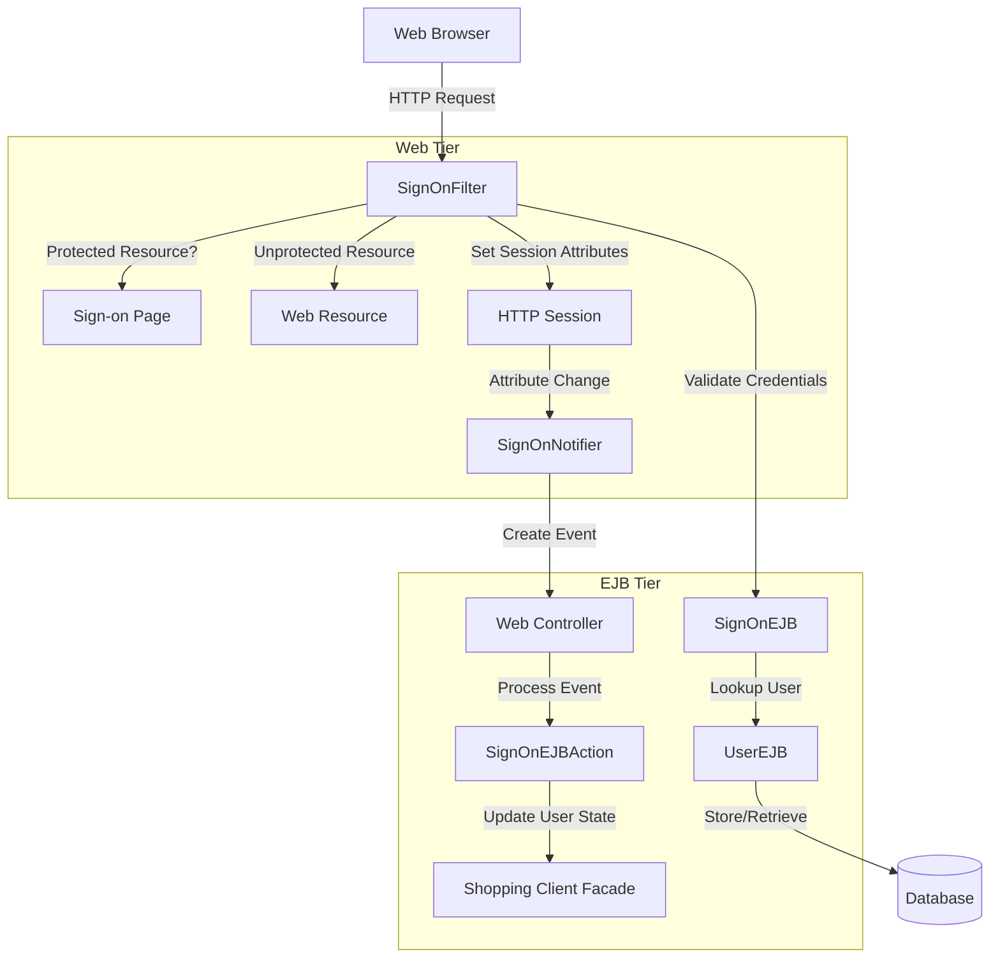
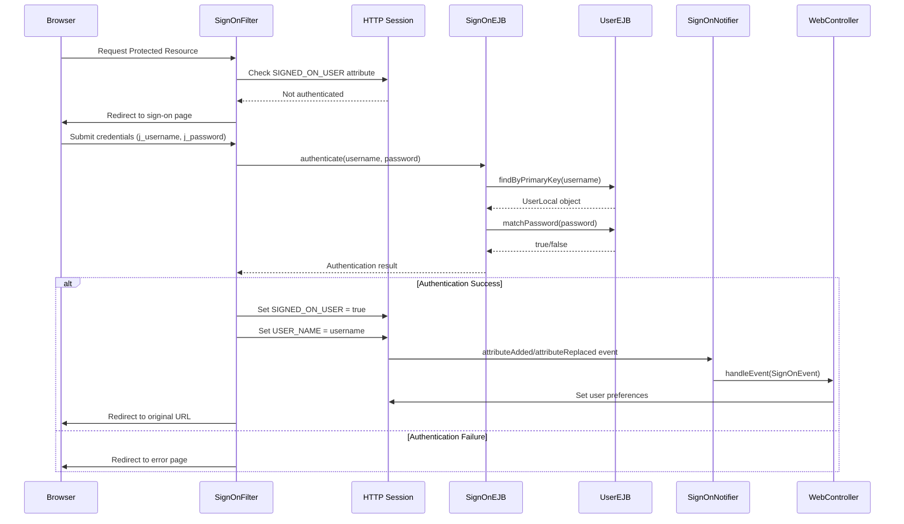
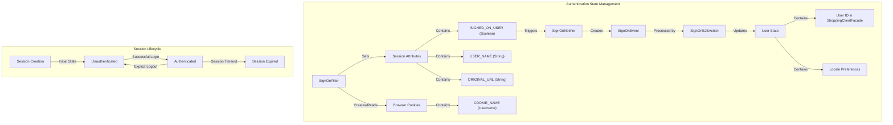
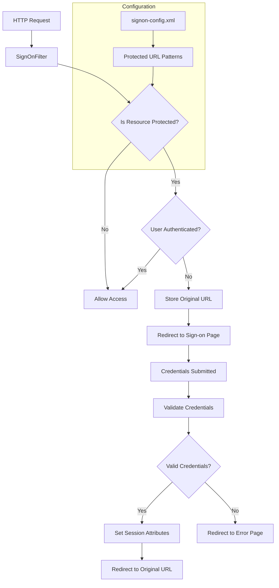

# Authentication Framework in Java Pet Store 1.3.2

## Overview of Java Pet Store Authentication Framework

The Java Pet Store 1.3.2 implements a comprehensive authentication framework using J2EE technologies to manage user sign-on, account creation, and session management across the application. This framework leverages a multi-tier architecture that separates presentation logic from business logic through the use of servlet filters, EJB components, and event-based notification mechanisms. The authentication system provides declarative security through XML configuration, enabling protection of specific resources without hardcoding security logic in application code. The framework handles user credential validation, persistent authentication through cookies, and integration with user preferences to provide a personalized experience after authentication.

## Authentication Framework Architecture

The architecture diagram illustrates the key components of the Java Pet Store authentication framework and their relationships. The framework follows a multi-tier design pattern where the SignOnFilter intercepts HTTP requests in the web tier, determining if authentication is required. For protected resources, unauthenticated users are redirected to the sign-on page. The SignOnEJB in the EJB tier provides the authentication business logic, working with the UserEJB entity to validate credentials against stored data. Upon successful authentication, session attributes are set, triggering the SignOnNotifier which creates events processed by the WebController and SignOnEJBAction to update the user's state in the application.

## EJB-Based Authentication Components

The framework's core consists of two EJBs: UserEJB (entity bean) stores username/password data, while SignOnEJB (stateless session bean) provides authentication services through local interfaces with container-managed transactions. The UserEJB is implemented as a container-managed persistence (CMP) entity bean with a String primary key representing the username, and includes fields for storing passwords. It provides methods for password matching and user creation. The SignOnEJB acts as a facade to the UserEJB, offering a simplified interface for authentication and user creation while handling exceptions appropriately. All methods are configured with Required transaction attributes, ensuring proper transaction management by the EJB container. The EJBs communicate through local interfaces, optimizing performance by avoiding remote method invocation overhead. This separation of concerns allows the authentication logic to be reused across different parts of the application.

## Web-Tier Authentication Processing

SignOnFilter intercepts HTTP requests to protected resources, redirecting unauthenticated users to a sign-on page and validating credentials against the SignOnEJB through JNDI lookup. This servlet filter serves as the entry point for the authentication framework, examining each incoming request to determine if it requires authentication. When a request targets a protected resource (as defined in signon-config.xml), the filter checks for the presence of a session attribute indicating the user is authenticated. If not present, the original URL is stored in the session and the user is redirected to the sign-on page. When credentials are submitted, the filter validates them by looking up the SignOnEJB via JNDI and calling its authenticate method. Upon successful authentication, the filter sets session attributes to mark the user as authenticated and stores the username, then redirects to the originally requested URL. The filter also manages persistent authentication through cookies, allowing returning users to have their username pre-populated in the sign-on form.

## Authentication Request Flow Sequence

This sequence diagram illustrates the flow of an authentication request through the Java Pet Store system. When a user attempts to access a protected resource, the SignOnFilter intercepts the request and checks if the user is already authenticated by examining session attributes. If not authenticated, the user is redirected to the sign-on page where credentials are entered. Upon submission, the filter passes these credentials to the SignOnEJB, which looks up the user in the UserEJB and validates the password. After successful authentication, the filter sets session attributes marking the user as authenticated, which triggers the SignOnNotifier through session attribute events. The notifier creates a SignOnEvent that is processed by the WebController, which sets user preferences based on their profile. Finally, the user is redirected to their originally requested URL. This event-driven approach enables loose coupling between authentication and application-specific behavior.

## Configuration-Driven Security

The framework uses XML configuration (signon-config.xml) to define protected resources, sign-on pages, and error pages, enabling declarative security without hardcoding protected URLs in application code. This configuration-driven approach provides several advantages: it centralizes security policy in a single location, allows for changes to protected resources without modifying code, and makes security policies more transparent and easier to audit. The signon-config.xml file defines the sign-on form login page and error page paths, along with security constraints that specify which URL patterns require authentication. Each constraint identifies a web resource collection with a descriptive name and corresponding URL pattern. The SignOnFilter loads this configuration at initialization time and uses it to determine which resources require protection. This approach follows the principle of separation of concerns, keeping security policy separate from both business logic and presentation code, and aligns with J2EE best practices for declarative security.

## Event-Based Authentication Notification

SignOnNotifier implements HttpSessionAttributeListener to detect successful sign-ons by monitoring session attributes, creating SignOnEvents to notify the application of authentication state changes. This event-based approach enables loose coupling between the authentication framework and application-specific behavior that needs to occur after successful authentication. When a user signs on, the SignOnFilter sets the SIGNED_ON_USER attribute in the session, which triggers the attributeAdded or attributeReplaced method in the SignOnNotifier. The notifier checks if this attribute indicates a successful sign-on, and if so, extracts the username from the session and creates a SignOnEvent. This event is then passed to the WebController, which routes it to the appropriate handler (SignOnEJBAction). The action sets the user ID in the shopping client facade and configures locale preferences based on the user's profile. This architecture allows the authentication component to remain independent of application-specific logic while still enabling the application to respond appropriately to authentication events.

## User Session Management

This diagram illustrates how user authentication state is maintained across the Java Pet Store application. The SignOnFilter manages session attributes that track authentication status, including SIGNED_ON_USER (a Boolean flag indicating authentication), USER_NAME (the authenticated username), and ORIGINAL_URL (the URL requested before authentication). The filter also handles browser cookies for persistent authentication, storing the username for future visits. When authentication occurs, the change in session attributes triggers the SignOnNotifier, which creates a SignOnEvent processed by the SignOnEJBAction. This action updates the user state in the application, setting the user ID in the ShoppingClientFacade and configuring locale preferences based on the user's profile. The session lifecycle shows the transitions between unauthenticated and authenticated states, including session expiration and explicit logout. This comprehensive approach ensures that authentication state is consistently maintained and properly synchronized across all application components.

## User Preference Management

Upon successful authentication, the framework loads user preferences from their profile, including locale settings, which are applied to the user's session for personalized experience. This integration between authentication and user preferences is a key feature of the Java Pet Store framework, enabling immediate personalization as soon as a user signs in. The SignOnEJBAction retrieves the user's preferred language from their ProfileLocal EJB and converts it to a Locale object using the I18nUtil helper class. This locale is then set as an attribute in the state machine, making it available throughout the application. Additionally, the shopping cart is notified of the locale change to ensure consistent localization across all components. The framework also handles the case where a user profile doesn't exist yet, such as during first-time registration, gracefully catching the FinderException that would occur in this scenario. This preference management mechanism demonstrates how the authentication framework extends beyond simple access control to enhance the overall user experience through personalization.

## Exception Handling for Authentication

The framework includes specialized exceptions like DuplicateAccountException to handle authentication-specific error conditions, providing clear error messages for account creation failures. This exception handling approach enables the application to respond appropriately to different types of authentication failures while maintaining a clean separation between the authentication framework and application-specific error handling. The DuplicateAccountException extends EventException and is thrown when a user attempts to create an account with a username that already exists in the system. It encapsulates an error message that can be displayed to the user, providing meaningful feedback about the nature of the failure. The SignOnEJB's createUser method may throw a CreateException when account creation fails, which is caught and potentially wrapped in a DuplicateAccountException by higher-level components. This structured exception hierarchy allows the application to distinguish between different types of authentication failures and handle each appropriately, whether by displaying specific error messages or taking corrective actions.

## Protected Resource Access Control

This diagram illustrates how the authentication framework determines which resources require authentication and the decision process for allowing or denying access. When an HTTP request arrives, the SignOnFilter first checks if the requested resource matches any protected URL patterns defined in the signon-config.xml configuration file. If the resource is not protected, access is immediately granted. For protected resources, the filter checks if the user is already authenticated by examining the SIGNED_ON_USER session attribute. Authenticated users are allowed access, while unauthenticated users have their original URL stored in the session and are redirected to the sign-on page. After submitting credentials, the framework validates them against the SignOnEJB. If valid, session attributes are set to mark the user as authenticated, and they are redirected to their originally requested URL. If invalid, the user is redirected to an error page. This configuration-driven approach allows for flexible security policies without modifying application code, as protected resources are defined declaratively in the XML configuration.

## Persistent Authentication with Cookies

The framework implements a cookie-based mechanism to remember usernames across sessions, with configurable expiration (one month default) and secure handling of persistent authentication data. This feature enhances user experience by eliminating the need to re-enter usernames on subsequent visits. When a user successfully authenticates and checks the "remember username" option, the SignOnFilter creates a cookie named "bp_signon" containing the username, with an expiration time of one month (2,678,400 seconds). On subsequent visits, the filter checks for this cookie and pre-populates the username field in the sign-on form. If a user authenticates without selecting the remember option, any existing cookies are removed by setting their expiration to zero. This approach balances convenience with security by only persisting the username, not the password or authentication state. The cookie expiration period is hardcoded but could be made configurable through additional parameters. This persistent authentication mechanism demonstrates the framework's attention to usability while maintaining appropriate security boundaries by not persisting sensitive authentication state.

[Generated by the Sage AI expert workbench: 2025-03-29 21:37:00  https://sage-tech.ai/workbench]: #