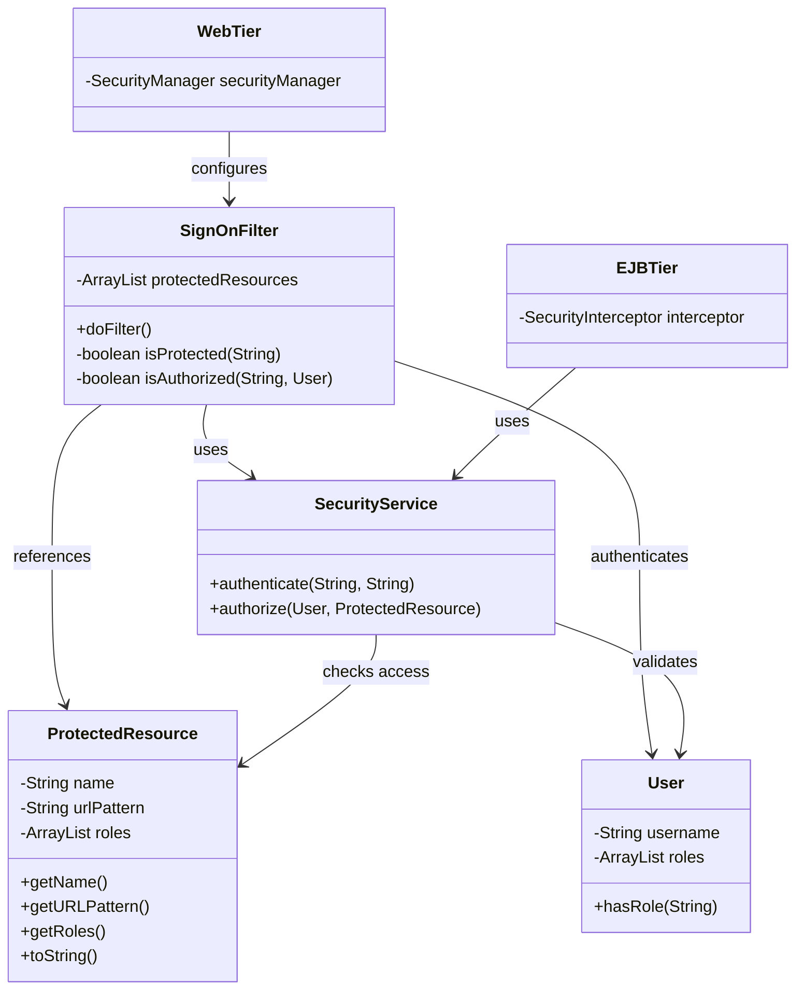
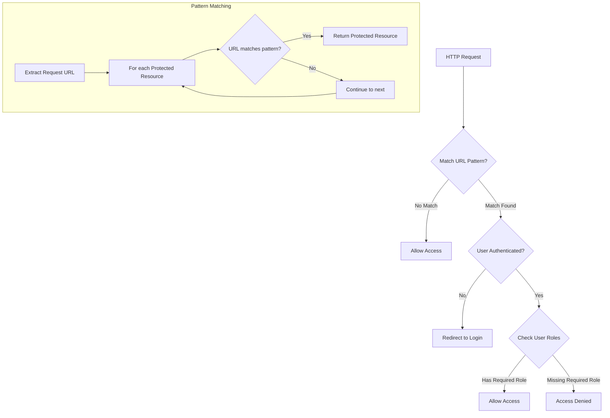
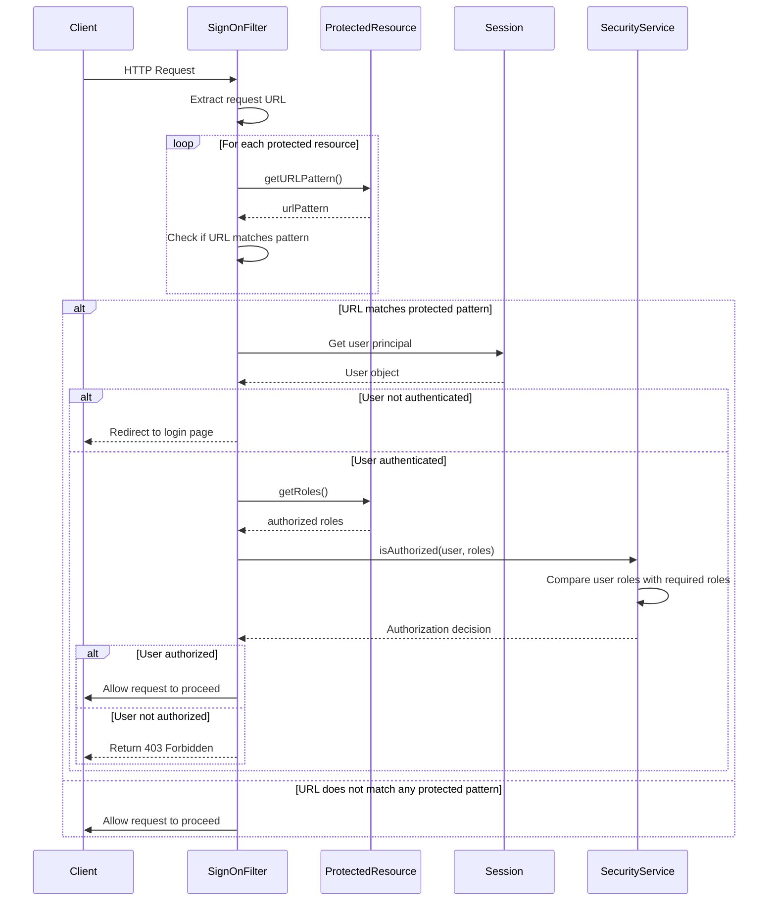
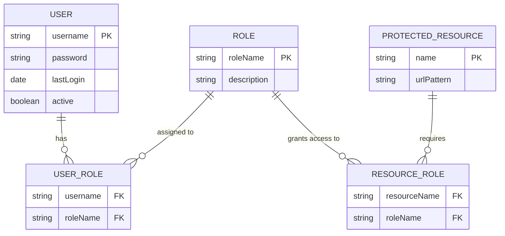

# Authorization Framework in Java Pet Store 1.3.2

## Overview of the Authorization Framework

The authorization framework in Java Pet Store 1.3.2 represents a pragmatic approach to securing application resources within the J2EE architecture of its era. Built as a complementary layer to the container-managed security provided by the J2EE platform, this framework implements a resource-centric authorization model where access control is defined through protected resources and their associated roles. The system is designed to enforce security boundaries around sensitive functionality and data, ensuring that only authenticated users with appropriate privileges can access protected areas of the application. Unlike modern authorization frameworks that might leverage OAuth, OIDC, or ABAC (Attribute-Based Access Control), Java Pet Store's approach is firmly rooted in the RBAC (Role-Based Access Control) paradigm that was predominant in enterprise applications of the early 2000s. This framework serves as both a demonstration of J2EE security best practices of its time and a practical implementation that balances security requirements with the architectural constraints of the platform.

## Core Components of the Authorization Model

The authorization model in Java Pet Store 1.3.2 is anchored by the `ProtectedResource` class, which encapsulates the fundamental access control logic. This class represents a protected resource through three key properties: a name identifier, a URL pattern for request matching, and an ArrayList of roles authorized to access the resource. The simplicity of this design reflects the straightforward RBAC approach common in J2EE applications of that era. The `ProtectedResource` class implements `java.io.Serializable`, enabling state persistence across HTTP sessions and supporting potential distribution in a clustered environment. 

This class functions as a data transfer object within the broader security context, working in conjunction with other components like authentication filters and security facades that are responsible for enforcing access control decisions. The model deliberately separates the definition of protected resources (what is protected and who can access it) from the enforcement mechanisms (how protection is implemented), creating a clean separation of concerns. While modern authorization frameworks might use more sophisticated approaches like policy engines or declarative annotations, this resource-centric model provides a clear and maintainable approach to defining security boundaries within the application.

## Authorization Framework Architecture

The architecture diagram illustrates the core components of Java Pet Store's authorization framework and their relationships. At the center is the `ProtectedResource` class, which defines what resources are protected and which roles can access them. The `SignOnFilter` serves as the primary enforcement point for web resources, intercepting HTTP requests and determining whether access should be granted based on the user's authenticated status and roles.

The framework implements a layered security approach where authorization decisions can be made at both the web tier (through filters) and the EJB tier (through security interceptors). This dual-layer protection ensures that security cannot be bypassed by direct access to business components. The `SecurityService` provides a centralized service for both authentication and authorization decisions, creating a single point of truth for security logic.

This architecture demonstrates a practical implementation of defense-in-depth principles within the constraints of the J2EE platform. While modern applications might leverage more sophisticated authorization servers or identity providers, this design effectively encapsulates security concerns and provides clear separation between security definition and enforcement.

## Role-Based Access Control Implementation

The Role-Based Access Control (RBAC) implementation in Java Pet Store 1.3.2 centers on the `roles` ArrayList within the `ProtectedResource` class. This collection stores String identifiers representing the roles permitted to access a particular resource. The simplicity of this approach is characteristic of early J2EE applications, where role-based security was primarily implemented through container-managed security with custom extensions.

The framework implements a straightforward role-matching algorithm: when a request attempts to access a protected resource, the system extracts the user's roles from their authenticated session and compares them against the roles defined for the resource. Access is granted if there is at least one matching role between the user and the resource. This implementation lacks the hierarchical role structures or permission-based granularity found in more sophisticated RBAC systems, but it provides a clean and maintainable approach for the application's security requirements.

A notable aspect of this implementation is its reliance on String-based role identifiers rather than more structured role objects. While this simplifies serialization and persistence, it creates potential fragility in the system where typos or inconsistent role naming could lead to security vulnerabilities. The absence of role hierarchies also means that privilege escalation and de-escalation must be managed explicitly through role assignments rather than through inheritance relationships between roles. Despite these limitations, the implementation provides a pragmatic balance between security requirements and implementation complexity for an application of its era.

## URL Pattern Matching Flow

The URL pattern matching mechanism is a crucial component of the authorization framework, determining whether an incoming request requires authorization and which roles can access it. The diagram illustrates the decision flow when processing an HTTP request.

When a request arrives, the system extracts the requested URL path and compares it against the URL patterns of all registered protected resources. This matching process typically uses Ant-style path patterns (similar to those used in web.xml servlet mappings), allowing for both exact matches and wildcard patterns like "/admin/*". If a match is found, the system identifies the corresponding protected resource and retrieves its associated roles.

The authorization decision then follows a sequential process: first checking if the user is authenticated, then verifying if the authenticated user possesses at least one of the required roles. This pattern matching approach provides flexibility in defining security boundaries at various granularity levels, from securing entire application sections to protecting individual resources.

A key consideration in this implementation is the performance impact of sequential pattern matching against potentially numerous protected resources. In high-traffic applications, this could become a bottleneck, suggesting that modern implementations might benefit from more optimized matching algorithms or caching strategies for authorization decisions.

## Resource Protection Mechanism

The resource protection mechanism in Java Pet Store 1.3.2 revolves around URL pattern matching to identify protected resources and enforce access control. This approach aligns with the J2EE web security model, where resources are typically protected at the URL path level. The `ProtectedResource` class stores URL patterns as strings, which are then used by security filters or interceptors to determine if an incoming request targets a protected resource.

The pattern matching implementation likely supports both exact matches and wildcard patterns (e.g., "/admin/*"), providing flexibility in defining security boundaries. When an incoming request is received, the system iterates through the collection of protected resources, comparing the request URL against each resource's URL pattern. If a match is found, the system retrieves the associated roles and verifies the user's authorization.

This URL-centric approach to resource protection is well-suited for web applications where resources are naturally organized hierarchically in URL paths. However, it has limitations when dealing with more complex authorization scenarios that might depend on request methods (GET, POST, etc.), request parameters, or the content of the request body. Modern authorization frameworks often provide more granular control through annotations or policy expressions that can consider multiple aspects of a request beyond just the URL path.

The implementation also lacks explicit support for resource hierarchies or inheritance of protection settings, which could lead to duplication of security configurations across similar resources. Despite these limitations, the mechanism provides a clear and maintainable approach to defining security boundaries within the application's URL space.

## Integration with J2EE Security

The Java Pet Store 1.3.2 authorization framework demonstrates a pragmatic integration with standard J2EE security mechanisms, creating a hybrid approach that leverages both container-managed security and custom authorization logic. The framework complements rather than replaces the underlying J2EE security infrastructure, allowing the application to benefit from container-provided features while extending them with application-specific requirements.

At the web tier, the framework likely integrates with the container's authentication mechanism through the J2EE security constraints defined in web.xml, potentially using form-based authentication or basic authentication. Once authentication is established, the container populates the security principal and roles, which the custom authorization framework can then access through the `HttpServletRequest.isUserInRole()` method or by retrieving the `Principal` object.

For EJB components, the framework may integrate with the container's declarative security model defined in ejb-jar.xml, while extending it with programmatic security checks using the custom `ProtectedResource` model. This allows for more fine-grained authorization decisions than what might be possible through container configuration alone.

A notable aspect of this integration is how it bridges the gap between URL-based web security and method-based EJB security. The custom framework provides a consistent authorization model across both tiers, ensuring that security policies are uniformly applied regardless of how a resource is accessed. This approach addresses a common challenge in J2EE applications where web and EJB security models can become disconnected or inconsistent.

The implementation predates more modern approaches like JAAS (Java Authentication and Authorization Service) custom login modules or JACC (Java Authorization Contract for Containers), which would later provide more standardized extension points for custom security logic. Despite this, the framework demonstrates an effective pattern for extending container security while maintaining compatibility with the J2EE security model.

## Authorization Decision Process

The sequence diagram illustrates the step-by-step process of making an authorization decision when a user attempts to access a protected resource in the Java Pet Store application. This process demonstrates the interaction between various components of the security framework and how they collaborate to enforce access control policies.

When a request arrives, the `SignOnFilter` (or similar security filter) intercepts it and begins the authorization process. The filter first determines if the requested URL matches any protected resource patterns by iterating through the collection of `ProtectedResource` objects. If a match is found, the system proceeds with authorization checks.

The authorization decision follows a logical sequence: first verifying if the user is authenticated by checking the session for a user principal. If the user is not authenticated, they are redirected to the login page. For authenticated users, the system retrieves the roles required for the matched protected resource and compares them against the user's assigned roles.

This comparison is typically implemented as an intersection check - if the user has at least one of the required roles, access is granted. Otherwise, the system returns a 403 Forbidden response. If the requested URL doesn't match any protected resource pattern, access is allowed without further checks.

The diagram highlights the separation between pattern matching (determining if a resource is protected) and authorization decision (determining if the user can access it). This separation allows for independent evolution of these concerns and makes the system more maintainable. The process also demonstrates how the framework integrates with the HTTP session for maintaining authentication state, a common approach in web applications of that era.

## Serialization for State Persistence

The `ProtectedResource` class implements `java.io.Serializable`, a design decision that enables state persistence across various boundaries in the Java Pet Store application. This serialization capability serves multiple purposes within the authorization framework. Primarily, it allows protected resource definitions to be stored in HTTP sessions, enabling the application to maintain authorization context across multiple requests without repeatedly reconstructing the security model. This is particularly valuable in clustered environments where session replication may occur.

Serialization also facilitates the potential distribution of protected resource definitions across application tiers. In a typical J2EE application of this era, security configurations might need to be shared between web components and EJB components, potentially running in different JVMs. The serializable nature of `ProtectedResource` objects enables them to be passed as parameters in remote method invocations or stored in distributed caches.

The implementation uses standard Java serialization rather than custom externalization, suggesting a straightforward approach to state persistence. The class maintains simple state with String fields and an ArrayList of roles, avoiding complex object graphs that could complicate serialization. This simplicity enhances reliability when deserializing these objects, particularly in distributed scenarios.

However, this approach has limitations worth noting. Standard Java serialization can be vulnerable to deserialization attacks if not properly secured, though this was less of a concern when Java Pet Store was developed. Additionally, serialization creates a tight coupling to the class implementation, making it challenging to evolve the class structure without breaking compatibility with serialized instances. Modern implementations might prefer more flexible serialization mechanisms like JSON or XML, or might use more sophisticated state management approaches altogether.

## Security Configuration and Management

The security configuration and management approach in Java Pet Store 1.3.2 likely combines declarative configuration through deployment descriptors with programmatic creation and management of protected resources. While the examined code doesn't explicitly show the configuration mechanism, the structure of the `ProtectedResource` class suggests a system where protected resources are defined either statically at application startup or dynamically through administrative interfaces.

The application probably initializes its security configuration by loading protected resource definitions from deployment descriptors (web.xml, ejb-jar.xml) or application-specific configuration files. These definitions would include resource names, URL patterns, and associated roles, which are then instantiated as `ProtectedResource` objects. The configuration might be loaded by a context listener or initialization servlet and stored in application scope for use by security filters and other components.

For runtime management, the application may provide administrative interfaces to view, create, modify, or delete protected resources. Given the serializable nature of the `ProtectedResource` class, changes to the security configuration could be persisted to a database or configuration store, allowing for dynamic updates without application redeployment. This would represent an advanced feature for applications of that era, as many J2EE applications relied solely on static security configurations defined in deployment descriptors.

The role management aspect is likely integrated with the J2EE container's role-based security model, where roles are defined in deployment descriptors and mapped to users or groups in the container's security realm. The `ProtectedResource` class would then reference these container-defined roles, creating a bridge between the custom authorization framework and the container's security infrastructure.

This hybrid approach to security configuration—combining container-managed role definitions with custom protected resource management—provides flexibility while leveraging the container's security infrastructure. However, it also introduces potential synchronization challenges between the container's security model and the application's custom authorization framework, particularly if roles can be modified at runtime.

## Authorization Data Model

The entity relationship diagram illustrates the data model underlying the authorization framework in Java Pet Store 1.3.2. This model represents the conceptual relationships between users, roles, and protected resources, though the actual implementation might vary in its persistence approach.

At the core of the model are three primary entities: USER, ROLE, and PROTECTED_RESOURCE. Users represent authenticated principals in the system, each with credentials and status information. Roles define security privileges or responsibilities that can be assigned to users. Protected resources represent secured components of the application, defined primarily by their URL patterns.

The relationships between these entities are managed through junction tables. The USER_ROLE table implements the many-to-many relationship between users and roles, allowing each user to have multiple roles and each role to be assigned to multiple users. Similarly, the RESOURCE_ROLE table establishes which roles are required to access specific protected resources.

This data model supports the role-based access control approach implemented in the application. When a user attempts to access a protected resource, the system can traverse these relationships to determine if the user has at least one of the roles required by the resource.

While the actual implementation might not use a relational database for all aspects of this model (some relationships might be defined in deployment descriptors or configuration files), this conceptual model represents the logical relationships that drive the authorization decisions. The simplicity of this model reflects the straightforward RBAC approach common in J2EE applications of that era, focusing on clear role assignments rather than more complex permission structures or attribute-based rules found in modern authorization frameworks.

## Best Practices and Limitations

The authorization framework in Java Pet Store 1.3.2 demonstrates several security best practices of its era while also exhibiting limitations that would be addressed in more modern implementations. From a historical perspective, the framework represents a pragmatic approach to extending J2EE container security with application-specific requirements.

**Strengths:**

1. **Clear Separation of Concerns**: The framework separates the definition of protected resources from the enforcement mechanisms, creating a maintainable security architecture.

2. **Integration with Container Security**: Rather than replacing container-managed security, the framework extends it, leveraging the container's authentication capabilities while adding custom authorization logic.

3. **Serializable Security Model**: The serializable nature of protected resources enables state persistence and distribution in clustered environments.

4. **URL-Based Protection**: The URL pattern matching provides a natural way to secure web resources that aligns with the hierarchical organization of web applications.

**Limitations:**

1. **String-Based Role Representation**: Using string identifiers for roles creates potential fragility where typos or inconsistent naming could lead to security vulnerabilities.

2. **Limited Granularity**: The URL-centric approach lacks support for more granular authorization based on HTTP methods, request parameters, or content.

3. **No Role Hierarchies**: The flat role structure requires explicit assignment of all applicable roles, potentially leading to role explosion in complex applications.

4. **Sequential Pattern Matching**: The likely implementation of sequential URL pattern matching could become a performance bottleneck in high-traffic applications.

5. **Serialization Vulnerabilities**: Standard Java serialization can introduce security vulnerabilities if not properly secured, particularly in distributed environments.

**Modern Alternatives:**

Contemporary applications would likely address these limitations through:

1. **Declarative Security**: Using annotations or aspect-oriented approaches to define security requirements directly on methods or controllers.

2. **Expression-Based Authorization**: Implementing more sophisticated authorization rules using expression languages that can consider multiple aspects of the request context.

3. **Policy Engines**: Leveraging dedicated policy engines like XACML for externalized, fine-grained authorization decisions.

4. **OAuth/OIDC Integration**: Integrating with standardized protocols for authentication and authorization, particularly for API security.

5. **Attribute-Based Access Control (ABAC)**: Moving beyond simple role checks to consider user attributes, resource attributes, and environmental conditions in authorization decisions.

Despite its limitations, the Java Pet Store authorization framework represents a well-structured approach to security within the constraints of its platform and era. Its clear separation of concerns and integration with container security demonstrate enduring principles of good security architecture that remain relevant in modern implementations.

[Generated by the Sage AI expert workbench: 2025-03-29 21:37:00  https://sage-tech.ai/workbench]: #