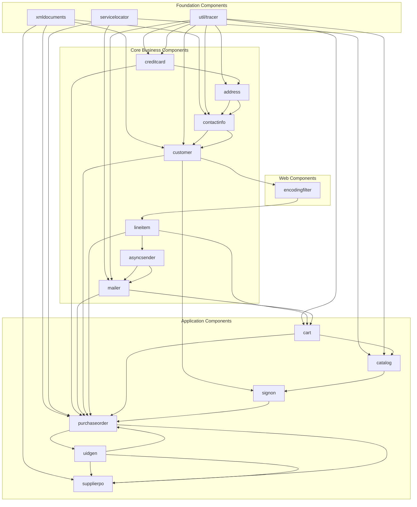
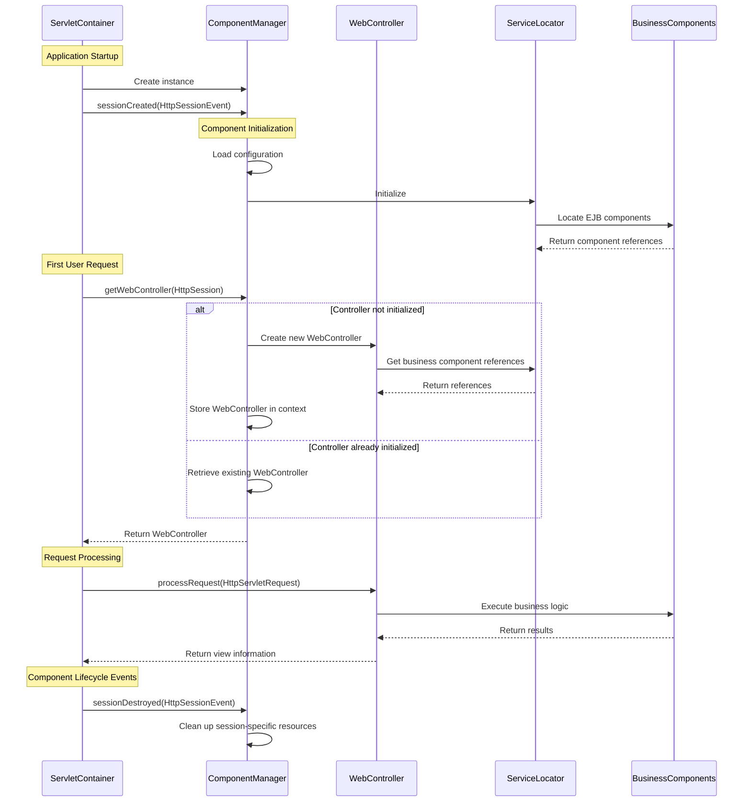
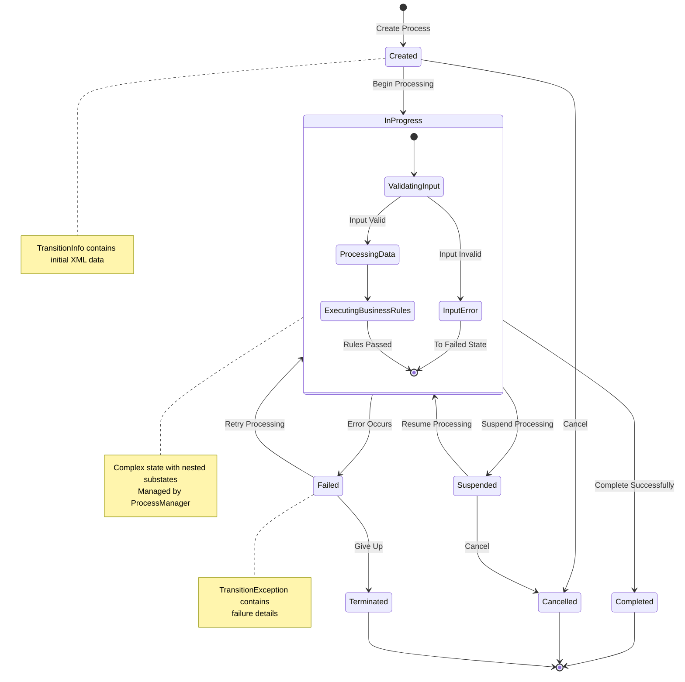
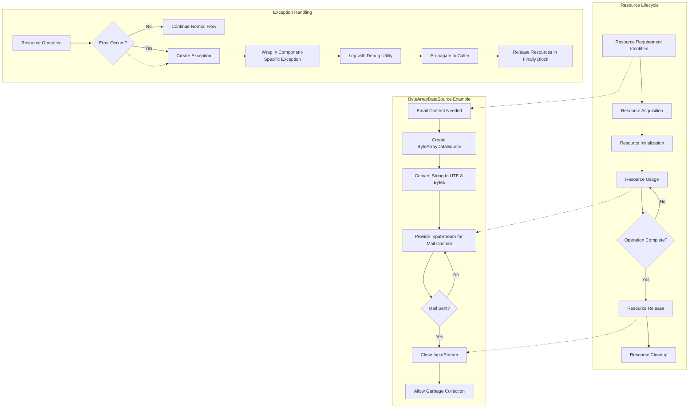

# Component Lifecycle Management in Java Pet Store 1.3.2

## Introduction to Component Lifecycle Management

The Java Pet Store 1.3.2 implements a sophisticated approach to component lifecycle management across its multi-tier architecture. This management system is crucial for ensuring proper initialization, operation, and termination of components throughout the application's execution. The architecture employs a combination of build-time dependency management, runtime initialization sequences, and state transition mechanisms to create a robust component ecosystem.

Component lifecycle management in Java Pet Store serves multiple critical functions: it ensures components are initialized in the correct order to satisfy dependencies, manages resource allocation and release, provides consistent state management across distributed components, and enables graceful error handling during transitions between component states. This approach reflects enterprise Java best practices of the J2EE 1.3 era, demonstrating how complex distributed applications can maintain reliability through careful management of component lifecycles.

The implementation spans from low-level build scripts that establish the foundation for component relationships to high-level controllers that orchestrate component interactions at runtime. This comprehensive approach to lifecycle management contributes significantly to the application's scalability and maintainability.

## Build-Time Component Lifecycle

Java Pet Store 1.3.2 employs a sophisticated build-time component lifecycle management system through its Ant build scripts. The system establishes a clear compilation order that respects component dependencies, ensuring that dependent components are built before the components that rely on them.

The main components build file (`/components/build.xml`) orchestrates the build process for all 17 components in a carefully sequenced order. This sequencing is critical as it reflects the dependency relationships between components. For example, utility components like `xmldocuments`, `servicelocator`, and `util/tracer` are built first since they provide foundational services used by other components.

Each individual component has its own build script that follows a consistent pattern of targets: `init` (setting up properties), `compile` (compiling Java sources), packaging (creating JAR files), and `clean` (removing build artifacts). These scripts create a predictable lifecycle for each component during the build phase.

The build system also separates client-facing interfaces from implementation classes. For instance, in the ProcessManager component, the `ejbclientjar` target specifically excludes implementation classes like `ProcessManagerEJB.class` from the client JAR, following EJB best practices for deployment. This separation is crucial for maintaining proper encapsulation and reducing client-side dependencies.

Environment configuration is another important aspect of the build-time lifecycle. Scripts like `lcp.bat` manage the classpath environment, ensuring that components have access to their required dependencies during compilation and execution. The build scripts also support developer-specific configurations through user-specific property files, allowing for customization without modifying the core build files.

This carefully designed build-time component lifecycle creates a solid foundation for the runtime behavior of the application, ensuring that components are properly compiled, packaged, and prepared for deployment.

## Component Build Dependency Flow

The diagram illustrates the build dependency flow between components in Java Pet Store 1.3.2. The arrows represent dependencies, showing which components must be built before others. The build process follows a carefully orchestrated sequence to ensure all dependencies are satisfied.

The foundation components (xmldocuments, servicelocator, and tracer) form the base of the dependency hierarchy as they provide core utilities used throughout the application. These are built first to ensure their availability to dependent components. Core business components like creditcard, address, and customer build upon this foundation, implementing essential business logic. Application components such as cart, catalog, and purchaseorder represent higher-level functionality that depends on both foundation and core business components.

This build sequence is critical for proper component initialization, as it ensures that when a component is initialized at runtime, all its dependencies have already been properly compiled and packaged. The build system enforces these dependencies through the explicit ordering in the main components build file, creating a reliable foundation for the runtime component lifecycle.

## Runtime Component Initialization

The runtime component initialization in Java Pet Store 1.3.2 follows a structured approach centered around the ComponentManager interface. This interface serves as the cornerstone of web tier component management, defining how components are initialized, accessed, and managed throughout their lifecycle.

The ComponentManager interface extends HttpSessionListener, which is a strategic design choice that ensures implementing classes are loaded at application startup. This allows the component manager to initialize critical services before any user interaction occurs. The interface declares a single method, `getWebController()`, which retrieves a WebController instance from an HttpSession. This controller is designed to be stateless and not tied to any specific user, making it a shared resource across sessions.

When the application starts, the servlet container creates an instance of the ComponentManager implementation and registers it as a session listener. During this initialization phase, the component manager loads configuration information, initializes shared resources, and prepares the web controllers that will handle user requests. This preparation includes setting up connections to business components through service locators and initializing any stateless services needed by the presentation tier.

As users interact with the application, components are initialized on demand. The first request to a particular component triggers its initialization through the component manager, which ensures that all dependencies are properly resolved. This lazy initialization approach improves startup performance by deferring component creation until actually needed.

The Debug utility class plays an important role in component initialization by providing conditional logging capabilities. With its static methods for printing debug messages, it allows developers to track the initialization sequence and diagnose any issues that might arise during component startup. The global `debuggingOn` flag provides a simple mechanism to enable or disable debug output across the entire application.

This runtime initialization approach creates a flexible and maintainable component architecture that balances performance considerations with proper dependency management.

## Component Initialization Sequence

The sequence diagram illustrates the initialization flow of components in Java Pet Store 1.3.2, from application startup through component creation and request processing.

When the application starts, the servlet container creates an instance of the ComponentManager and calls its sessionCreated method. During this initialization phase, the ComponentManager loads configuration information and initializes the ServiceLocator, which in turn locates and establishes connections to the business components (typically EJBs).

When the first user request arrives, the servlet container calls getWebController on the ComponentManager. If the controller hasn't been initialized yet, the ComponentManager creates a new WebController instance, which obtains references to business components through the ServiceLocator. The WebController is then stored in the application context for future use. For subsequent requests, the ComponentManager simply retrieves the existing WebController.

During request processing, the WebController receives the request, delegates to the appropriate business components, and returns view information to the servlet container. When a session is destroyed, the ComponentManager's sessionDestroyed method is called, allowing it to clean up any session-specific resources.

This initialization sequence ensures that components are created in the proper order, with dependencies satisfied, and that resources are properly managed throughout the component lifecycle.

## State Management in Components

Java Pet Store 1.3.2 implements a sophisticated approach to state management across its component hierarchy. This approach ensures consistency in component state throughout the application lifecycle, particularly in the user interface and business process components.

The ToggleActionPropertyChangeListener class exemplifies state management in UI components. This class implements the PropertyChangeListener interface to synchronize the state of toggle buttons and menu items that are created from the same AbstractItemAction. When the "selected" property of an action changes, the listener updates the corresponding button's selected state, ensuring visual consistency across multiple UI representations of the same action. This pattern is particularly important in the admin application, where the same action might be accessible from both a toolbar button and a menu item.

The design of ToggleActionPropertyChangeListener reveals an awareness of potential memory management issues. The class maintains a reference to the AbstractButton it monitors, and the code comments indicate that this reference should ideally be a WeakReference to prevent memory leaks when the button becomes unreachable. This consideration demonstrates the attention to lifecycle management even at the UI component level.

In the business tier, state management is more complex, involving transitions between different business states. The TransitionInfo class encapsulates parameters passed to transition delegates, providing a clean mechanism for transferring XML messages (either individual or batches) between components during state transitions. This approach decouples the state transition mechanism from the specific data being transferred, making the system more flexible and maintainable.

Exception handling is an integral part of state management, with classes like TransitionException providing mechanisms to wrap and chain exceptions. This allows components to maintain context information as exceptions propagate up the call stack, facilitating more effective error diagnosis and recovery.

The Debug utility class supports state management by providing conditional logging capabilities that can be used to track state changes during development and troubleshooting. With its simple boolean flag controlling output, developers can easily enable detailed state tracking when needed without modifying code.

This comprehensive approach to state management ensures that components maintain consistent and predictable behavior throughout their lifecycle, contributing to the overall reliability and maintainability of the application.

## Process Management and Transitions

The Java Pet Store 1.3.2 implements a sophisticated process management system centered around the ProcessManager component. This component orchestrates business processes through well-defined state transitions, providing a framework for managing complex workflows across the application.

At the core of the process management system is the concept of state transitions. Each business process moves through a series of states, with transitions between states triggered by specific events or conditions. The ProcessManager component is responsible for managing these transitions, ensuring that they occur in a valid sequence and that appropriate actions are taken during each transition.

The TransitionInfo class plays a crucial role in this system by encapsulating the parameters passed to transition delegates. It provides a flexible mechanism for transferring data during state transitions, supporting both individual XML messages and collections of messages (batches). This approach allows the process management system to handle various types of transitions with different data requirements.

Error handling is a critical aspect of process management, implemented through the TransitionException class. This class extends the standard Java Exception with the ability to wrap another exception, creating a chain that preserves the context of errors that occur during transitions. The getRootCause() method recursively unwraps nested exceptions to find the original cause, facilitating effective diagnosis and recovery from errors.

The build process for the ProcessManager component reflects its importance in the application architecture. The build script creates separate client and server JAR files, with the client JAR specifically excluding implementation classes like ProcessManagerEJB. This separation follows EJB best practices and ensures that clients only have access to the interfaces they need, not the implementation details.

The ProcessManager component also includes comprehensive documentation generation through its build script, highlighting the importance of clear documentation for understanding the complex state transitions in business processes.

This process management approach provides a robust framework for implementing business workflows, ensuring that processes move through their lifecycle in a controlled and predictable manner.

## Process State Transition Model

The state diagram illustrates how the ProcessManager handles transitions between different states in business processes within Java Pet Store 1.3.2. The diagram shows the main states a process can be in and the transitions between them.

A process begins in the Created state when it's initially instantiated. From there, it can transition to InProgress when processing begins or to Cancelled if the process is aborted before it starts. The InProgress state is complex, containing several substates that represent different phases of processing: ValidatingInput, ProcessingData, and ExecutingBusinessRules. These substates allow for fine-grained control over the processing workflow.

If an error occurs during processing, the process transitions to the Failed state. From Failed, it can either be retried (returning to InProgress) or abandoned (moving to Terminated). Similarly, a process can be temporarily Suspended and later resumed or cancelled.

The TransitionInfo class plays a crucial role in these transitions, carrying the XML data needed for each state change. When errors occur, TransitionException objects capture the details of the failure, potentially wrapping other exceptions to maintain the full context of the error.

This state transition model provides a robust framework for managing complex business processes, ensuring that processes move through their lifecycle in a controlled and predictable manner, with appropriate handling of both normal and exceptional conditions.

## Exception Handling in Component Lifecycle

Exception handling is a critical aspect of component lifecycle management in Java Pet Store 1.3.2, providing mechanisms for detecting, reporting, and recovering from errors that occur during component operations. The application implements a sophisticated exception handling strategy that contributes to the overall robustness of the component lifecycle.

The TransitionException class exemplifies the application's approach to exception handling in the process management component. This class extends the standard Java Exception with the ability to wrap another exception, creating a chain that preserves the context of errors. The class provides three constructors to accommodate different error reporting needs: one with a message and wrapped exception, one with just a message, and one with just a wrapped exception. This flexibility allows developers to provide appropriate context for each error condition.

A key feature of TransitionException is its getRootCause() method, which recursively unwraps nested exceptions to find the original cause of an error. This capability is particularly valuable in a multi-tier application where exceptions may be wrapped multiple times as they propagate through different layers. By exposing the root cause, the system facilitates more effective diagnosis and resolution of problems.

The MailerAppException class demonstrates a more specialized exception type used in the mailer component. This exception is thrown when there are failures during mail sending operations, providing a clear indication of the component and operation involved in the error. While simpler than TransitionException, it follows the same pattern of extending the standard Exception class and providing constructors with and without detail messages.

The Debug utility class complements the exception handling mechanism by providing conditional logging capabilities. Its methods for printing exception information, with or without context messages, allow developers to track and diagnose errors during development and troubleshooting. The global debuggingOn flag provides a simple mechanism to enable or disable debug output across the entire application.

This comprehensive approach to exception handling ensures that errors are properly detected, reported, and managed throughout the component lifecycle, contributing to the overall reliability and maintainability of the application.

## Resource Management in Components

Java Pet Store 1.3.2 implements a systematic approach to resource management within its components, ensuring proper acquisition, usage, and release of resources throughout their lifecycle. This approach is particularly evident in components that interact with external systems or manage potentially scarce resources.

The ByteArrayDataSource class in the mailer component exemplifies resource management for email content. This class implements the javax.activation.DataSource interface to provide data handling for email messages, storing byte array data and MIME type information. The class is designed with careful resource management in mind, converting string data to bytes with UTF-8 encoding and providing an input stream for the mail message content. Notably, the class implements defensive programming by checking for null data before creating an input stream, preventing potential null pointer exceptions.

The design of ByteArrayDataSource also shows awareness of resource constraints by deliberately throwing an exception when getOutputStream() is called, as it's designed for read-only access. This prevents misuse of the class in ways that could lead to resource leaks or inconsistent state.

Resource management extends to the build system as well. The build scripts for components like ProcessManager include targets for cleaning up build artifacts, ensuring that disk space is not unnecessarily consumed by temporary files. The main components build file orchestrates the cleaning of all component directories, providing a comprehensive cleanup mechanism.

The ComponentManager interface plays a crucial role in resource management at the web tier level. By extending HttpSessionListener, implementations can respond to session creation and destruction events, providing opportunities to allocate resources when sessions are created and release them when sessions are destroyed. This lifecycle-aware design ensures that session-specific resources are properly managed.

Exception handling is tightly integrated with resource management, with classes like TransitionException and MailerAppException providing mechanisms to report and recover from resource-related errors. The ability to wrap and chain exceptions helps maintain context information about resource operations, facilitating more effective diagnosis and recovery.

This comprehensive approach to resource management ensures that components use resources efficiently and reliably throughout their lifecycle, contributing to the overall stability and performance of the application.

## Component Resource Lifecycle

The flowchart illustrates the lifecycle of resources within components of Java Pet Store 1.3.2, with a specific focus on the ByteArrayDataSource used in the mailer component.

The general resource lifecycle begins with identifying a resource requirement, followed by acquisition and initialization of the resource. The resource is then used for operations, and when operations are complete, the resource is released and cleaned up. This pattern is fundamental to proper resource management in enterprise applications.

The ByteArrayDataSource example demonstrates this lifecycle in practice. When email content is needed, a ByteArrayDataSource is created, converting string data to UTF-8 bytes. The class provides an InputStream for the mail content, which is used during the mail sending operation. Once the mail is sent, the InputStream is closed, and the ByteArrayDataSource becomes eligible for garbage collection.

Exception handling is integrated throughout the resource lifecycle. When a resource operation is performed, errors are checked. If an error occurs, an exception is created, potentially wrapped in a component-specific exception like MailerAppException, logged using the Debug utility, and propagated to the caller. Regardless of whether an error occurs, resources are released in finally blocks to ensure proper cleanup.

This comprehensive approach to resource lifecycle management ensures that components use resources efficiently and reliably, preventing leaks and ensuring consistent behavior even in error conditions.

## Debugging and Lifecycle Monitoring

Java Pet Store 1.3.2 implements a straightforward yet effective approach to debugging and lifecycle monitoring through the Debug utility class. This class provides a centralized mechanism for conditional logging that can be used to track component lifecycle events throughout the application.

The Debug class is designed with simplicity and efficiency in mind. It centers around a single static boolean flag, `debuggingOn`, which controls whether debug messages are displayed. This design allows developers to enable or disable debug output across the entire application by changing a single value, without modifying code in multiple locations. By default, the flag is set to false, ensuring that debug output doesn't affect production performance.

The class provides several overloaded methods for printing debug information. The basic `print()` and `println()` methods output simple messages to standard error, while more specialized methods handle exceptions and throwables. These exception-handling methods can optionally include context messages, providing additional information about where and why an exception occurred. All output is conditionally displayed based on the `debuggingOn` flag, ensuring that debug statements don't impact performance when debugging is disabled.

This debugging facility is particularly valuable for monitoring component lifecycle events. Developers can insert debug statements at key points in a component's lifecycle—initialization, state transitions, resource acquisition and release, and termination—to track the flow of execution and identify potential issues. For example, in the ProcessManager component, debug statements could be used to log state transitions, helping developers understand the sequence of events during business process execution.

The integration of exception handling with debugging is another important aspect of lifecycle monitoring. The Debug class's methods for printing exception information allow developers to capture and log errors that occur during component operations, providing valuable diagnostic information without disrupting the application's error handling flow.

While simple compared to modern logging frameworks, the Debug utility provides an effective mechanism for monitoring component lifecycle events during development and troubleshooting, contributing to the overall maintainability of the application.

[Generated by the Sage AI expert workbench: 2025-03-29 21:37:00  https://sage-tech.ai/workbench]: #