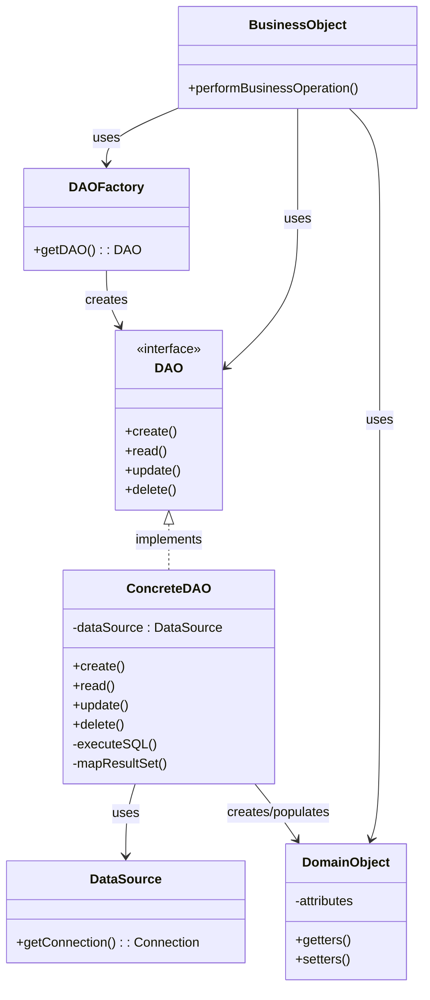
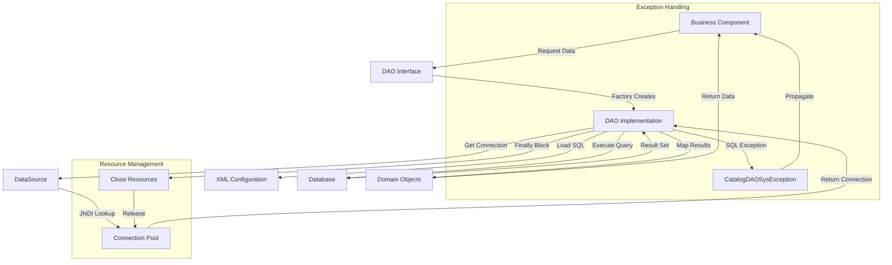
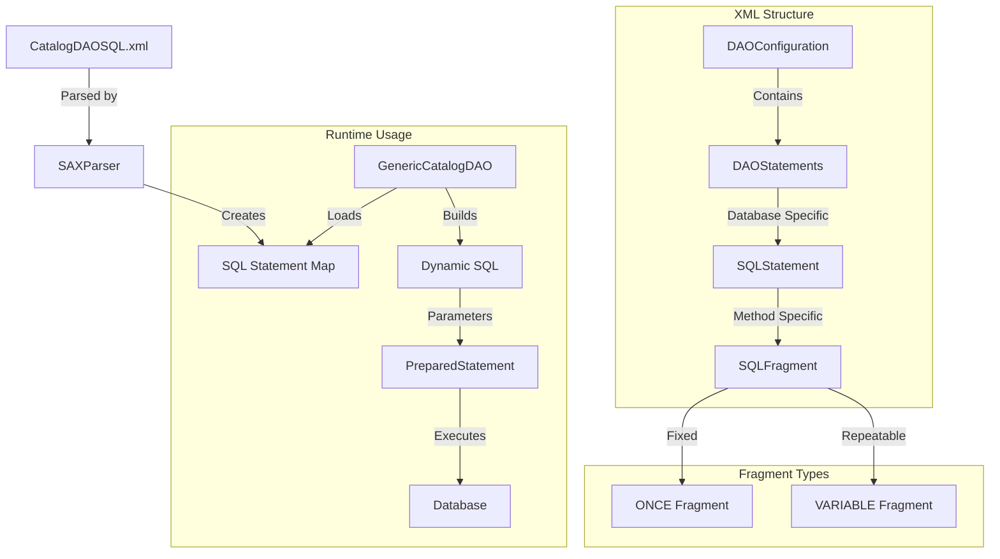
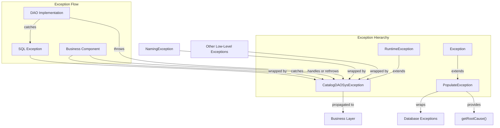

# Data Access Objects in Java Pet Store 1.3.2

## Introduction to Data Access Objects Pattern

The Data Access Object (DAO) pattern is a fundamental structural pattern implemented in Java Pet Store 1.3.2 that creates a clear separation between business logic and database access. This pattern encapsulates all data access operations behind a well-defined interface, allowing the application to interact with persistent storage without exposing the underlying data access mechanisms. In Java Pet Store 1.3.2, the DAO pattern serves multiple critical purposes:

First, it abstracts the complexity of JDBC operations, connection management, and SQL execution from the business components. This abstraction enables business logic to focus on domain-specific operations rather than database intricacies. Second, it provides a clean interface for data operations through well-defined contracts like `CatalogDAO`, establishing a consistent approach to data access across the application. Third, it enhances maintainability by centralizing database access code, making changes to data access logic more manageable. Finally, it improves testability by allowing mock implementations of DAOs for unit testing business components without requiring database connectivity.

The implementation in Java Pet Store 1.3.2 is particularly sophisticated, featuring database-agnostic interfaces with database-specific implementations, XML-based SQL configuration for enhanced portability, and support for internationalization through locale-specific database operations. This approach exemplifies enterprise-grade data access architecture that remains relevant in modern application design.

## DAO Pattern Architecture

The DAO pattern architecture in Java Pet Store 1.3.2 establishes a clear separation of concerns between business logic and data access. At the core of this architecture is the DAO interface (such as `CatalogDAO`), which defines the contract for data operations. Business objects interact with this interface rather than directly with database connections.

The architecture employs a Factory pattern through classes like `CatalogDAOFactory` to instantiate appropriate DAO implementations based on configuration. This factory approach enables runtime selection of database-specific implementations without modifying client code. The concrete DAO implementations (such as `GenericCatalogDAO` and `CloudscapeCatalogDAO`) encapsulate the details of database connectivity, SQL execution, and result mapping.

A key strength of this architecture is its use of domain objects (like `Category`, `Product`, and `Item`) that are completely decoupled from persistence concerns. These objects represent business entities and are populated by the DAO implementations but remain unaware of how they are persisted.

The architecture also incorporates connection management through DataSource objects obtained via JNDI, ensuring efficient use of database connections. Exception handling is standardized through custom exceptions like `CatalogDAOSysException`, which wrap lower-level database exceptions to provide more meaningful context to business layers.

This layered approach provides significant flexibility, allowing the application to support multiple database vendors while maintaining a consistent interface for business components.

## CatalogDAO Interface Design

The `CatalogDAO` interface in Java Pet Store 1.3.2 exemplifies a well-designed contract for catalog data access operations. This interface defines a comprehensive set of methods for retrieving catalog-related entities while maintaining a clean separation between the business logic and the underlying database implementation.

The interface is structured around three primary entity types: categories, products, and items. For each entity type, it provides methods to retrieve individual records by ID and collections with pagination support. All methods accept a `Locale` parameter, enabling internationalized content retrieval—a sophisticated feature that allows the application to serve content in multiple languages from locale-specific database tables.

Key methods include:
- `getCategory(String categoryID, Locale l)` - Retrieves a single category by ID
- `getCategories(int start, int count, Locale l)` - Retrieves a paginated list of categories
- `getProduct(String productID, Locale l)` - Retrieves a single product by ID
- `getProducts(String categoryID, int start, int count, Locale l)` - Retrieves products for a specific category
- `getItem(String itemID, Locale l)` - Retrieves a single item by ID
- `getItems(String productID, int start, int size, Locale l)` - Retrieves items for a specific product
- `searchItems(String query, int start, int size, Locale l)` - Searches for items matching a query string

The interface uses the `Page` class for pagination, which encapsulates a collection of entities along with metadata about the current page and whether more results exist. This approach provides an elegant solution for handling large result sets efficiently.

All methods throw `CatalogDAOSysException` for system-level errors, providing a consistent exception handling strategy. This runtime exception approach allows for unchecked exceptions that don't require explicit handling in business code, while still providing meaningful error information.

The `CatalogDAO` interface demonstrates thoughtful API design principles: it's cohesive (focused on catalog operations), provides clear method signatures with meaningful parameter names, and uses appropriate return types that encapsulate both data and metadata.

## DAO Implementation Strategy

Java Pet Store 1.3.2 employs a sophisticated DAO implementation strategy that balances flexibility, performance, and maintainability. The application provides two distinct implementations of the `CatalogDAO` interface: `GenericCatalogDAO` and `CloudscapeCatalogDAO`, each demonstrating different approaches to database connectivity and SQL execution.

`GenericCatalogDAO` represents a highly flexible implementation that loads SQL statements from an XML configuration file (`CatalogDAOSQL.xml`). This approach enables database portability by allowing different SQL dialects to be defined for various database vendors without changing Java code. The class uses a custom SAX parser to load and cache SQL statements at initialization time, and dynamically builds queries with parameter substitution at runtime. It employs a sophisticated fragment-based approach to SQL construction, supporting both fixed and variable SQL fragments that can be combined based on runtime conditions—particularly useful for complex search operations with variable numbers of search terms.

In contrast, `CloudscapeCatalogDAO` takes a more direct approach with hardcoded SQL statements specifically optimized for the Cloudscape database. While less flexible than the XML-based approach, this implementation offers potentially better performance by eliminating the overhead of dynamic SQL construction. Both implementations share common patterns for connection management, using a DataSource obtained through JNDI lookup, and properly closing resources in finally blocks to prevent connection leaks.

Both implementations meticulously map relational data to domain objects (`Category`, `Product`, and `Item`), performing the critical object-relational mapping function that shields the business layer from database schema details. They also implement pagination through the JDBC `ResultSet` API, using `absolute()` positioning to efficiently retrieve specific subsets of results.

The internationalization support is particularly noteworthy, with both implementations accepting locale parameters and using them to dynamically select appropriate database tables or append locale-specific suffixes to table names via the `DatabaseNames` utility class.

This dual implementation strategy demonstrates a pragmatic approach to the DAO pattern, allowing for both generic, configuration-driven implementations and database-specific optimized implementations to coexist within the same application architecture.

## Database Access Flow

The database access flow in Java Pet Store 1.3.2 represents a comprehensive approach to data retrieval and resource management. When a business component requires data, it initiates the flow by invoking a method on a DAO interface such as `CatalogDAO`. The appropriate implementation is obtained through a factory class (`CatalogDAOFactory`), which dynamically instantiates the configured implementation class.

Once the DAO implementation is active, it obtains a database connection from a DataSource, typically retrieved through JNDI lookup from the application server's connection pool. This approach ensures efficient connection management by reusing connections rather than creating new ones for each operation.

For implementations like `GenericCatalogDAO`, the next step involves loading the appropriate SQL statement from the XML configuration. The statement is then prepared with parameters supplied by the business component, such as IDs, locale information, or search terms. The DAO executes the query against the database and receives a ResultSet containing the raw data.

The DAO then performs the critical transformation from relational data to domain objects. For example, rows from the product table are mapped to `Product` objects with appropriate property values. For collection queries, results are encapsulated in a `Page` object that includes both the collection of domain objects and pagination metadata.

Throughout this process, proper resource management is enforced through finally blocks that ensure connections, statements, and result sets are closed regardless of whether operations succeed or fail. Exception handling is standardized by catching SQL exceptions and other database-related errors and wrapping them in `CatalogDAOSysException` instances, which provide more meaningful context to the business layer.

For internationalized content, the flow includes determining the appropriate table names based on the provided locale, either by selecting different tables or appending locale-specific suffixes to table names.

This well-structured flow ensures efficient, reliable data access while maintaining clean separation between business logic and database operations.

## Factory Pattern for DAO Creation

The `CatalogDAOFactory` class in Java Pet Store 1.3.2 exemplifies a textbook implementation of the Factory pattern for dynamic DAO instantiation. This class serves as a central point for creating appropriate `CatalogDAO` implementations, abstracting the instantiation details from client code and enabling runtime configuration of the concrete implementation class.

The factory's primary method, `getDAO()`, employs a sophisticated approach to DAO creation. Rather than hardcoding the implementation class, it retrieves the fully qualified class name from JNDI configuration using the key `JNDINames.CATALOG_DAO_CLASS`. This approach allows the application to switch DAO implementations by modifying deployment descriptors without changing or recompiling code—a powerful feature for enterprise applications that might need to support different database vendors in various deployment environments.

Once the class name is obtained, the factory uses Java reflection (`Class.forName().newInstance()`) to dynamically instantiate the implementation class. This reflection-based approach provides maximum flexibility, allowing any class that implements the `CatalogDAO` interface to be used without modifying the factory code. The instantiated object is then cast to the `CatalogDAO` interface type and returned to the caller, which interacts with it solely through the interface methods, remaining unaware of the concrete implementation class.

Error handling is comprehensive, with separate exception handling for JNDI lookup failures (`NamingException`) and instantiation failures. Both error types are wrapped in `CatalogDAOSysException` with contextual messages that aid in troubleshooting.

This factory pattern implementation demonstrates several enterprise-grade design principles: it adheres to the dependency inversion principle by depending on abstractions rather than concrete implementations; it supports the open/closed principle by allowing new DAO implementations to be added without modifying existing code; and it facilitates configuration over coding by externalizing implementation choices to deployment descriptors.

The `CatalogDAOFactory` represents a critical architectural component that enables the flexibility and maintainability of the data access layer in Java Pet Store 1.3.2.

## SQL Statement Management

Java Pet Store 1.3.2 implements a sophisticated approach to SQL statement management through XML configuration, specifically in the `CatalogDAOSQL.xml` file. This strategy represents an advanced implementation of the DAO pattern that separates SQL statements from Java code, enhancing maintainability and database portability.

The XML configuration file employs a structured format defined by a Document Type Definition (DTD) that specifies elements for DAO configuration, statements, and SQL fragments. Each SQL statement is associated with a specific method (like `GET_CATEGORY`, `SEARCH_ITEMS`) and contains SQL fragments with parameter counts and occurrence attributes. The configuration supports multiple database types, with separate `<DAOStatements>` sections for different databases (e.g., Cloudscape and Oracle), allowing database-specific SQL dialects to be defined without changing Java code.

The `GenericCatalogDAO` class parses this XML configuration during initialization using a SAX parser. It loads the appropriate SQL statements based on the configured database type, storing them in a map for runtime use. When executing queries, the DAO dynamically builds SQL statements from these fragments, handling parameter substitution and variable fragments that may appear multiple times (particularly useful for search queries with variable numbers of terms).

This approach offers several significant advantages:
1. **Database portability**: Supporting multiple database vendors becomes straightforward by adding new sections to the XML file rather than creating new DAO implementations.
2. **Centralized SQL management**: All SQL statements are maintained in a single file, making it easier to review, optimize, and ensure consistency.
3. **Runtime flexibility**: The fragment-based approach allows for dynamic SQL construction based on runtime conditions.
4. **Separation of concerns**: Database access logic remains in the DAO classes while SQL syntax is externalized, allowing database administrators to optimize queries without Java code changes.

The implementation includes performance optimizations such as caching parsed statements and using a custom SAX handler with a `ParsingDoneException` to terminate parsing once the relevant database section is processed. Error handling is comprehensive, with detailed logging of parsing issues and proper exception propagation.

This XML-based SQL management strategy demonstrates an enterprise-grade approach to data access that remains relevant in modern applications, balancing flexibility, maintainability, and performance.

## XML-Based SQL Configuration

The XML-based SQL configuration in Java Pet Store 1.3.2 represents a sophisticated approach to managing SQL statements outside of Java code. The system centers around the `CatalogDAOSQL.xml` file, which provides a structured repository for database-specific SQL statements.

The XML document follows a well-defined structure declared in its DTD. At the top level, the `<DAOConfiguration>` element contains multiple `<DAOStatements>` elements, each targeting a specific database type (like Cloudscape or Oracle). Within each database section, `<SQLStatement>` elements are organized by method name (such as `GET_CATEGORY` or `SEARCH_ITEMS`), containing one or more `<SQLFragment>` elements that compose the complete SQL statement.

Each SQL fragment includes attributes that define its behavior:
- `parameterNb`: Specifies how many parameters (?) the fragment contains
- `occurrence`: Indicates whether the fragment appears once (`ONCE`) or can be repeated (`VARIABLE`)

This structure enables particularly sophisticated handling of complex queries like search operations, where the number of conditions may vary based on the search terms provided at runtime.

During initialization, `GenericCatalogDAO` uses a SAX parser to process this XML file, extracting the SQL statements for the configured database type and storing them in a map keyed by method name. The parsing process is optimized with a custom handler that stops parsing once the relevant database section is processed.

At runtime, when a DAO method is called, the system retrieves the appropriate statement fragments from the map and dynamically constructs the complete SQL statement. For fragments marked as `VARIABLE`, the system can repeat them as needed based on runtime conditions (such as the number of search terms). Parameters are then bound to the prepared statement in the correct order before execution.

This approach provides remarkable flexibility, allowing the application to support multiple database vendors with optimized SQL for each, while maintaining a clean separation between data access logic and SQL syntax. It also facilitates maintenance by centralizing SQL statements in a single, well-structured file that can be reviewed and optimized independently of the Java code.

## Internationalization in DAOs

The Java Pet Store 1.3.2 application implements a sophisticated approach to internationalization (i18n) at the data access layer, enabling the delivery of localized content directly from the database. This strategy represents an advanced implementation of the DAO pattern that extends beyond simple data retrieval to support multilingual applications.

At the core of this implementation is the `DatabaseNames` utility class, which centralizes the naming conventions for database tables and provides locale-specific table name generation. Rather than hardcoding table names throughout the application, all DAOs reference constants defined in this class (`PRODUCT_TABLE`, `CATEGORY_TABLE`, and `ITEM_TABLE`). The class's `getTableName` method handles internationalization by appending locale-specific suffixes to table names based on the provided `Locale` parameter. For example, when the locale is set to Japanese (`Locale.JAPAN`), the method appends "_ja" to the table name, resulting in tables like "product_ja" for Japanese content.

This approach supports US (default), Japanese, and Chinese locales, with a flexible design that could easily be extended to additional languages. The implementation assumes a database schema where localized content is stored in separate tables for each supported language, rather than using a more complex schema with language codes as foreign keys.

In the DAO implementations, all data retrieval methods accept a `Locale` parameter that is passed through to SQL queries. The `GenericCatalogDAO` and `CloudscapeCatalogDAO` classes use this locale information in two ways:
1. To select the appropriate localized tables using the `DatabaseNames` utility
2. To filter results based on locale columns within tables

The XML-based SQL configuration further supports this internationalization strategy by including locale parameters in queries. For example, statements typically include a `WHERE locale = ?` clause, with the locale string as the first parameter.

This comprehensive approach to internationalization at the data access layer provides several benefits:
1. It enables efficient retrieval of localized content without additional processing
2. It maintains clean separation between business logic and internationalization concerns
3. It provides a consistent pattern for handling locale-specific data across the application
4. It allows for optimization of locale-specific queries at the database level

This implementation demonstrates enterprise-grade internationalization that integrates seamlessly with the DAO pattern, providing a robust foundation for multilingual applications.

## Fast Lane Reader Pattern

The `CatalogHelper` class in Java Pet Store 1.3.2 implements the Fast Lane Reader pattern, a performance optimization technique that provides direct database access for read-only operations, bypassing the EJB container's overhead. This pattern is particularly valuable in data-intensive applications where read performance is critical.

The Fast Lane Reader pattern recognizes that while EJBs provide valuable services like transaction management, security, and concurrency control, these services come with performance costs that may be unnecessary for simple read operations. By providing a direct path to the database for read-only queries, the pattern significantly improves performance for data retrieval operations.

In the `CatalogHelper` implementation, this pattern is realized through a dual-access strategy. The class provides methods that can retrieve catalog data either through the standard EJB path (using `CatalogLocal` EJB) or directly through the DAO layer (using `CatalogDAO`). A boolean flag `useFastLane` determines which path is used, with the direct DAO access being the default.

For each catalog operation (searching items, retrieving categories, products, or items), the class provides paired implementation methods. For example, `searchItemsFromEJB()` uses the EJB interface, while `searchItemsFromDAO()` directly instantiates a `CatalogDAO` implementation via the factory and calls its methods. This approach maintains the same business interface regardless of which data access path is used.

The implementation includes several sophisticated features:
1. **Bean-style state management**: The class maintains state through properties (searchQuery, categoryId, productId, etc.) that can be set before invoking operations, making it suitable for use in JSP pages.
2. **Transparent switching**: Client code can easily switch between EJB and direct access paths without changing its interaction pattern.
3. **Consistent exception handling**: Both access paths wrap their specific exceptions in a common `CatalogException` class, providing a unified error handling approach.
4. **Service location**: The class uses the Service Locator pattern to abstract away JNDI lookup complexity for EJB access.

The Fast Lane Reader pattern as implemented in `CatalogHelper` demonstrates a pragmatic approach to performance optimization that balances the benefits of the EJB container with the need for efficient data access. It provides a clean, consistent interface to business components while allowing for significant performance improvements in read-heavy scenarios.

## Exception Handling in DAOs

Java Pet Store 1.3.2 implements a comprehensive exception handling strategy in its DAO layer, designed to provide meaningful error information while maintaining a clean separation between persistence concerns and business logic. This strategy centers around two primary exception types: `CatalogDAOSysException` and `PopulateException`.

`CatalogDAOSysException` serves as the primary exception type for the catalog DAO implementations. As a subclass of `RuntimeException`, it represents unchecked exceptions that typically indicate irrecoverable system-level errors such as database connectivity issues or SQL syntax problems. This design choice allows business components to avoid cluttering their code with try-catch blocks for exceptions they cannot meaningfully recover from. The exception provides constructors for both simple message-based exceptions and default no-argument exceptions, offering flexibility in error reporting.

In the DAO implementations, low-level JDBC exceptions like `SQLException` and infrastructure exceptions like `NamingException` are caught and wrapped in `CatalogDAOSysException` instances with contextual messages that provide additional information about the operation that failed. This wrapping approach preserves the original exception chain while translating technical database errors into more business-relevant terms.

For database population operations, the application uses `PopulateException`, which implements a more sophisticated exception wrapping mechanism. This checked exception can wrap another exception and provides methods to both access the directly wrapped exception (`getException()`) and recursively unwrap nested exceptions to find the root cause (`getRootCause()`). This capability is particularly valuable during database setup and population, where multiple layers of operations might fail.

The exception handling strategy also includes proper resource management through `finally` blocks in all DAO methods, ensuring that database connections, statements, and result sets are properly closed regardless of whether operations succeed or fail. This approach prevents resource leaks that could otherwise degrade application performance over time.

This well-structured exception handling approach demonstrates enterprise-grade error management that balances the need for detailed technical information with clean, maintainable code in the business layer. It provides a consistent pattern for propagating and handling errors throughout the data access layer while ensuring proper resource cleanup.

## Database Population Utilities

Java Pet Store 1.3.2 includes a sophisticated set of database population utilities that leverage the DAO pattern to initialize and populate the database with sample data. These utilities demonstrate how the DAO pattern extends beyond runtime data access to support administrative operations like database setup and testing.

The core components of this population framework include:

1. **AccountPopulator**: This class creates Account entities in the database by working with related populators (ContactInfoPopulator and CreditCardPopulator) to build complete account records from XML data. It uses EJB local interfaces to create persistent Account objects linked to ContactInfo and CreditCard entities. The class employs a chained XML filter pattern to process nested XML elements through multiple populators, demonstrating an elegant approach to handling hierarchical data structures.

2. **PopulateUtils**: This utility class provides methods for executing SQL statements during database population operations. It implements functionality to execute parameterized queries, print SQL statements for debugging, and handle database operations like create, insert, drop, and check. The class uses PreparedStatement for secure database operations and handles parameter substitution from XML data handlers.

3. **PopulateException**: This exception class implements a custom exception that can wrap lower-level exceptions, providing layered error handling for database population tools. It includes methods to retrieve both the directly wrapped exception and the root cause through recursive unwrapping, maintaining the complete exception chain while providing specific error context.

4. **XMLDBHandler**: Though not directly shown in the provided files, this class (referenced in AccountPopulator) extends SAX's DefaultHandler to process XML data for database population, connecting XML parsing events to database operations.

These utilities follow several sophisticated patterns:
- They use XML as the data source format, providing a structured, human-readable way to define sample data
- They implement a pipeline approach to data processing, with chained handlers for different entity types
- They leverage the same DAO abstractions used by the runtime application, ensuring consistency between population and runtime data access
- They provide comprehensive error handling with detailed context information

The population framework demonstrates how the DAO pattern can be extended beyond simple CRUD operations to support the full application lifecycle, including initialization, testing, and data migration. This approach ensures that all database interactions follow consistent patterns and leverage the same abstractions, regardless of whether they occur during application runtime or administrative operations.

[Generated by the Sage AI expert workbench: 2025-03-29 21:37:00  https://sage-tech.ai/workbench]: #