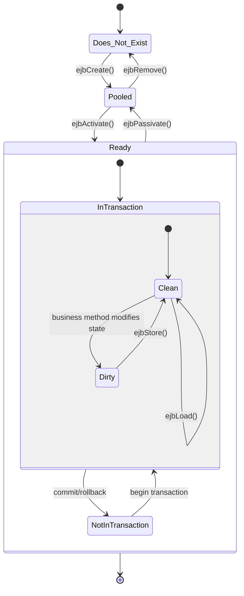
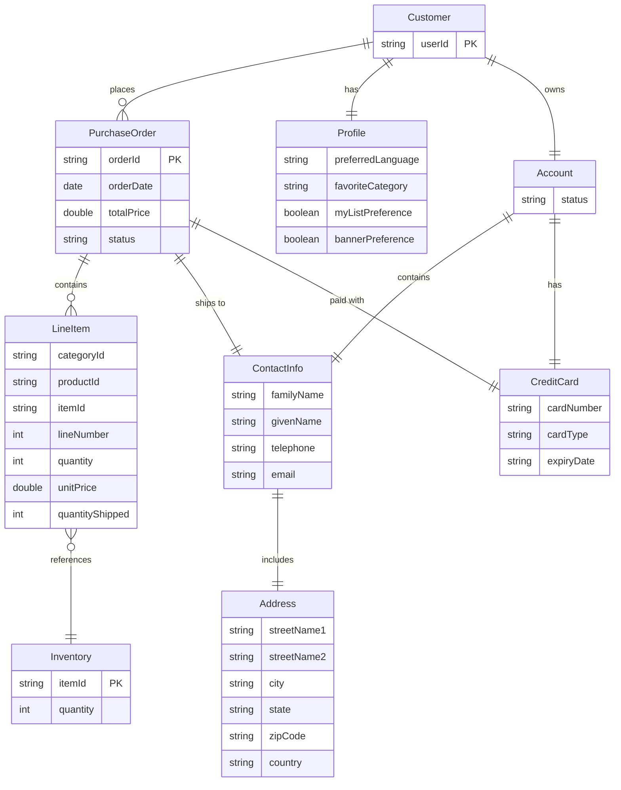
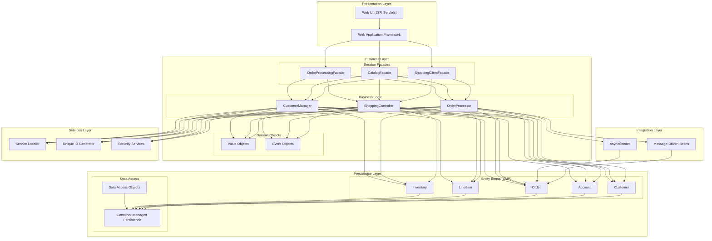

# EJB Container Management in Java Pet Store 1.3.2

## Introduction to EJB Container Management

Enterprise JavaBeans (EJB) container management is a foundational architectural element of the Java Pet Store 1.3.2 application, providing a robust infrastructure for managing enterprise beans and their lifecycle. The EJB container serves as a runtime environment that handles complex middleware services such as transaction management, security, persistence, resource pooling, and concurrency control, allowing developers to focus on business logic rather than infrastructure concerns. In Java Pet Store 1.3.2, the container management system orchestrates the interactions between various components, from customer management and shopping cart functionality to order processing and inventory control.

The container provides transparent services to EJBs through a contract-based approach defined in deployment descriptors (ejb-jar.xml files) and component interfaces. This contract specifies how the container should manage bean instances, including when to create, activate, passivate, and destroy them. The Pet Store application leverages this container management extensively across its modular architecture, with components like customer, catalog, cart, and order processing all implemented as container-managed EJBs. This approach enables the application to achieve scalability, maintainability, and separation of concerns while benefiting from container-provided services.

## Container-Managed Persistence (CMP)

Java Pet Store 1.3.2 makes extensive use of Container-Managed Persistence (CMP) for its entity beans, delegating the responsibility of database operations to the EJB container rather than implementing them directly in the application code. This abstraction layer significantly reduces the amount of data access code that developers need to write and maintain.

The application implements CMP through abstract getter and setter methods in entity beans, which the container implements at runtime. For example, in the `AddressEJB` class, we see:

```java
public abstract String getStreetName1();
public abstract void setStreetName1(String streetName1);

public abstract String getCity();
public abstract void setCity(String city);
```

The container generates the implementation of these methods, handling the mapping between Java objects and database tables. This approach is used consistently across entity beans like `CustomerEJB`, `LineItemEJB`, `CreditCardEJB`, and `InventoryEJB`.

The deployment descriptors (ejb-jar.xml files) define the persistence fields and their mapping to database columns. For instance, the `LineItemEJB` descriptor specifies fields like `categoryId`, `productId`, `itemId`, `lineNumber`, `quantity`, and `unitPrice`. The container uses this metadata to generate SQL statements for CRUD operations.

CMP in Java Pet Store also supports finder methods defined in the local home interfaces, such as `findByPrimaryKey()` in `UserLocalHome` or `findOrdersByStatus()` in `SupplierOrderLocalHome`. The container implements these methods based on EJB-QL queries defined in the deployment descriptors, translating them into database-specific SQL at runtime.

## Entity Bean Lifecycle



The entity bean lifecycle in Java Pet Store 1.3.2 follows the standard EJB 2.0 specification, with the container managing transitions between different states. As illustrated in the diagram, entity beans move through several states during their lifecycle:

1. **Does Not Exist**: The initial state before a bean instance is created.

2. **Pooled**: After creation via `ejbCreate()`, the bean enters a pool of available instances. In this state, the bean has no identity (no primary key association). The `ejbCreate()` method in entity beans like `CustomerEJB`, `AddressEJB`, and `LineItemEJB` initializes the bean's state but returns `null` instead of the primary key, as the container handles key generation.

3. **Ready**: When a client requests a specific entity, the container assigns an identity to a pooled instance through `ejbActivate()` and moves it to the ready state. In this state, the bean is associated with a specific database record and can service client requests.

4. **Transaction States**: Within the ready state, beans participate in transactions. The container calls `ejbLoad()` to synchronize the bean's state with the database at the beginning of a transaction and `ejbStore()` to persist changes at the end.

The Java Pet Store implementation follows this lifecycle pattern across all entity beans. For example, in `PurchaseOrderEJB`, we see implementations of `ejbCreate()`, `ejbPostCreate()`, `ejbLoad()`, `ejbStore()`, `ejbActivate()`, `ejbPassivate()`, and `ejbRemove()`. The container invokes these methods at appropriate times to manage the bean's state and persistence.

This lifecycle management allows the Pet Store application to efficiently handle database resources, as the container can pool and reuse bean instances, load data only when needed, and ensure proper synchronization between memory and database states.

## Container-Managed Relationships (CMR)

Container-Managed Relationships (CMR) in Java Pet Store 1.3.2 enable the EJB container to automatically manage relationships between entity beans, similar to how it manages persistence. This feature is extensively used to model complex business relationships between entities such as customers, orders, line items, and products.

The application implements one-to-one, one-to-many, and many-to-many relationships through CMR fields defined in entity beans. For example, in the `PurchaseOrderEJB` class, we see a one-to-many relationship with line items:

```java
// CMR fields
public abstract Collection getLineItems();
public abstract void setLineItems(Collection lineItems);
```

And a one-to-one relationship with contact information:

```java
public abstract ContactInfoLocal getContactInfo();
public abstract void setContactInfo(ContactInfoLocal contactInfo);
```

These relationships are defined in the deployment descriptors (ejb-jar.xml files) with elements like `<ejb-relation>`, `<ejb-relationship-role>`, and `<cmr-field>`. The container uses this metadata to generate the necessary code for maintaining referential integrity.

A key example of CMR usage is in the purchase order component, where a `PurchaseOrder` entity has relationships with `LineItem`, `ContactInfo`, and `CreditCard` entities. The `addLineItem()` method in `PurchaseOrderEJB` demonstrates how the application manipulates these relationships:

```java
public void addLineItem(LineItemLocal lineItem) {
    Collection items = getLineItems();
    items.add(lineItem);
}
```

The container automatically handles the underlying database operations to maintain this relationship.

CMR also supports cascade delete operations, as specified in the deployment descriptors. For instance, when a `PurchaseOrder` is deleted, all associated `LineItem` entities are automatically removed. This ensures data integrity without requiring explicit cleanup code in the application.

## Entity Relationship Model



The entity relationship model in Java Pet Store 1.3.2 illustrates the complex relationships between the various business entities managed by the EJB container. This model is implemented through Container-Managed Relationships (CMR) and Container-Managed Persistence (CMP).

The diagram shows the central entities in the application and their relationships:

1. **Customer** is the core entity representing a registered user, with relationships to:
   - **Profile** (one-to-one): Stores user preferences like preferred language and favorite category
   - **Account** (one-to-one): Contains account status and related information

2. **Account** has relationships to:
   - **ContactInfo** (one-to-one): Stores personal contact details
   - **CreditCard** (one-to-one): Contains payment information

3. **ContactInfo** has a one-to-one relationship with **Address** for shipping and billing locations

4. **PurchaseOrder** represents an order placed by a customer, with relationships to:
   - **Customer** (many-to-one): The customer who placed the order
   - **LineItem** (one-to-many): The individual items in the order
   - **ContactInfo** (one-to-one): Shipping information
   - **CreditCard** (one-to-one): Payment information

5. **LineItem** represents a product in an order, with a relationship to **Inventory** to track stock levels

These relationships are defined in the deployment descriptors and implemented through CMR fields in the entity beans. For example, in `PurchaseOrderEJB`, the relationship with line items is defined as a collection:

```java
public abstract Collection getLineItems();
public abstract void setLineItems(Collection lineItems);
```

The EJB container manages these relationships, ensuring referential integrity and handling the underlying database operations. This model enables the Pet Store application to represent complex business scenarios while maintaining clean separation of concerns.

## Transaction Management

Transaction management in Java Pet Store 1.3.2 is primarily handled through declarative transaction attributes defined in deployment descriptors (ejb-jar.xml files). This approach allows the EJB container to automatically manage transaction boundaries without requiring explicit transaction code in the business logic.

The application uses container-managed transactions (CMT) for most of its EJBs, with transaction attributes specified at the method level. For example, in the catalog component's ejb-jar.xml:

```xml
<container-transaction>
  <method>
    <ejb-name>CatalogEJB</ejb-name>
    <method-intf>Local</method-intf>
    <method-name>getItem</method-name>
    <method-params>
      <method-param>java.lang.String</method-param>
      <method-param>java.util.Locale</method-param>
    </method-params>
  </method>
  <trans-attribute>Required</trans-attribute>
</container-transaction>
```

This configuration specifies that the `getItem` method requires a transaction. If a transaction already exists when the method is called, it will participate in that transaction; otherwise, a new transaction will be started.

The most common transaction attribute used throughout the Pet Store is `Required`, ensuring that operations like creating customers, updating orders, and modifying inventory occur within transaction boundaries. This provides ACID properties (Atomicity, Consistency, Isolation, Durability) for these operations.

For entity beans with container-managed persistence (CMP), the container automatically begins transactions before calling `ejbLoad()` and commits them after `ejbStore()`, ensuring that database operations are properly transacted. For example, when updating a customer's profile or adding items to a shopping cart, the container manages the transaction boundaries.

In more complex scenarios involving multiple EJBs, the container propagates transaction context across bean invocations. For instance, when processing an order, the transaction spans multiple components including the shopping cart, customer, and order processing beans. If any part of this process fails, the entire transaction is rolled back, maintaining data consistency.

The Pet Store also uses the `Supports` transaction attribute for read-only operations that don't require transactions, optimizing performance for these operations.

## EJB Component Interfaces

Java Pet Store 1.3.2 employs a comprehensive interface-based design for its EJB components, following the standard EJB 2.0 component model. These interfaces define the contract between clients and EJB components, providing a clear separation between the component's public API and its implementation.

The application primarily uses local interfaces for components that interact within the same JVM, optimizing performance by avoiding the overhead of remote method invocation. For example, the catalog component defines:

```java
public interface CatalogLocal extends javax.ejb.EJBLocalObject {
    public Category getCategory(String categoryID, Locale l);
    public Page getCategories(int start, int count, Locale l);
    // Additional methods...
}
```

This local interface exposes business methods for accessing catalog data without the overhead of remote calls.

For each EJB, the application also defines a home interface that provides factory methods for creating or finding bean instances. For example:

```java
public interface CustomerLocalHome extends javax.ejb.EJBLocalHome {
    public CustomerLocal create(String userId) throws CreateException;
    public CustomerLocal findByPrimaryKey(String userId) throws FinderException;
    public Collection findAllCustomers() throws FinderException;
}
```

The home interface allows clients to create new customers or locate existing ones by their primary key.

For components that need to be accessed remotely, such as the OPC (Order Processing Center) admin facade, the application defines remote interfaces:

```java
public interface OPCAdminFacade extends javax.ejb.EJBObject {
    public Collection getOrdersByStatus(String status) throws RemoteException;
    // Additional methods...
}
```

Remote interfaces extend `javax.ejb.EJBObject` and declare that all methods can throw `RemoteException`, allowing clients to handle network-related failures.

The Pet Store follows a consistent pattern of separating the component interface from its implementation. For example, the `ShoppingCartLocalEJB` class implements the `ShoppingCartLocal` interface, with the container generating the necessary glue code to connect clients to the implementation.

This interface-based design enables loose coupling between components, making the system more maintainable and allowing for implementation changes without affecting clients.

## EJB Architecture Layers



The Java Pet Store 1.3.2 application employs a layered architecture with EJBs serving different roles across multiple layers. This architecture promotes separation of concerns, maintainability, and scalability.

At the top, the **Presentation Layer** consists of web components (JSPs and servlets) that interact with the Web Application Framework (WAF). The WAF handles HTTP requests, manages sessions, and delegates business operations to the appropriate EJBs.

The **Business Layer** contains several key components:

1. **Session Facades**: Stateless and stateful session beans that provide coarse-grained interfaces to business functionality, hiding the complexity of underlying components. Examples include `ShoppingClientFacadeEJB` and `CatalogEJB`. These facades reduce network traffic and simplify client code by aggregating multiple fine-grained operations.

2. **Business Logic**: Components that implement core business rules and workflows, such as `ShoppingControllerEJB` and various EJB actions like `CartEJBAction` and `CustomerEJBAction`. These components process events, coordinate activities across multiple components, and enforce business rules.

3. **Domain Objects**: Value objects and event objects that encapsulate business data and operations. These objects are passed between layers to transfer data without exposing implementation details.

The **Integration Layer** handles communication with external systems and asynchronous processing through message-driven beans (MDBs) like `PurchaseOrderMDB` and `InvoiceMDB`. The `AsyncSender` component enables asynchronous messaging within the application.

The **Persistence Layer** manages data storage and retrieval:

1. **Entity Beans**: Container-managed persistence (CMP) entity beans like `CustomerEJB`, `OrderEJB`, and `LineItemEJB` represent business entities and their relationships. These beans delegate persistence operations to the EJB container.

2. **Data Access**: Components that handle database interactions, including container-managed persistence mechanisms and data access objects (DAOs) for more complex queries.

The **Services Layer** provides cross-cutting functionality used by multiple components:

1. **Service Locator**: Centralizes and caches JNDI lookups for EJB references, reducing lookup overhead and decoupling clients from JNDI naming.

2. **Unique ID Generator**: Generates unique identifiers for entities like orders and customers.

3. **Security Services**: Handles authentication and authorization through the container's security mechanisms.

This layered architecture with clear separation of concerns allows the Pet Store application to be maintainable, extensible, and scalable, with each EJB playing a well-defined role within its respective layer.

## Deployment Descriptors

Deployment descriptors in Java Pet Store 1.3.2 are XML files that configure how the EJB container manages enterprise beans. The primary descriptor is ejb-jar.xml, which defines bean metadata, relationships, transaction attributes, and security settings. These descriptors are crucial for container management as they provide the container with the information needed to properly instantiate, manage, and destroy EJB instances.

The Pet Store application contains multiple ejb-jar.xml files, one for each component module (customer, catalog, cart, etc.). These descriptors follow a consistent structure defined by the EJB 2.0 DTD.

A typical ejb-jar.xml file in Pet Store includes:

1. **Enterprise Bean Definitions**: Each bean is defined with its name, class, interfaces, and persistence type. For example, from the customer component:

```xml
<entity>
  <display-name>CustomerEB</display-name>
  <ejb-name>CustomerEJB</ejb-name>
  <local-home>com.sun.j2ee.blueprints.customer.ejb.CustomerLocalHome</local-home>
  <local>com.sun.j2ee.blueprints.customer.ejb.CustomerLocal</local>
  <ejb-class>com.sun.j2ee.blueprints.customer.ejb.CustomerEJB</ejb-class>
  <persistence-type>Container</persistence-type>
  <prim-key-class>java.lang.String</prim-key-class>
  <reentrant>False</reentrant>
  <cmp-version>2.x</cmp-version>
  <abstract-schema-name>Customer</abstract-schema-name>
  <!-- CMP fields and CMR fields follow -->
</entity>
```

2. **Container-Managed Persistence (CMP) Fields**: For entity beans, the descriptor lists fields that the container should persist:

```xml
<cmp-field>
  <field-name>userId</field-name>
</cmp-field>
```

3. **Container-Managed Relationships (CMR)**: Relationships between entity beans are defined with roles and multiplicity:

```xml
<ejb-relation>
  <ejb-relation-name>Customer-Account</ejb-relation-name>
  <ejb-relationship-role>
    <ejb-relationship-role-name>Customer-has-Account</ejb-relationship-role-name>
    <multiplicity>One</multiplicity>
    <relationship-role-source>
      <ejb-name>CustomerEJB</ejb-name>
    </relationship-role-source>
    <cmr-field>
      <cmr-field-name>account</cmr-field-name>
    </cmr-field>
  </ejb-relationship-role>
  <!-- Second role follows -->
</ejb-relation>
```

4. **Environment Entries**: Configuration parameters that can be changed without modifying code:

```xml
<env-entry>
  <env-entry-name>SignOnAction</env-entry-name>
  <env-entry-type>java.lang.String</env-entry-type>
  <env-entry-value>com.sun.j2ee.blueprints.petstore.controller.web.actions.SignOnAction</env-entry-value>
</env-entry>
```

5. **EJB References**: Dependencies on other EJBs:

```xml
<ejb-local-ref>
  <ejb-ref-name>ejb/Catalog</ejb-ref-name>
  <ejb-ref-type>Session</ejb-ref-type>
  <local-home>com.sun.j2ee.blueprints.catalog.ejb.CatalogLocalHome</local-home>
  <local>com.sun.j2ee.blueprints.catalog.ejb.CatalogLocal</local>
  <ejb-link>CatalogEJB</ejb-link>
</ejb-local-ref>
```

6. **Resource References**: External resources like databases and JMS destinations:

```xml
<resource-ref>
  <res-ref-name>jdbc/CatalogDB</res-ref-name>
  <res-type>javax.sql.DataSource</res-type>
  <res-auth>Container</res-auth>
</resource-ref>
```

7. **Security Roles and Method Permissions**: Access control for bean methods:

```xml
<method-permission>
  <unchecked/>
  <method>
    <ejb-name>CustomerEJB</ejb-name>
    <method-name>*</method-name>
  </method>
</method-permission>
```

8. **Transaction Attributes**: How methods participate in transactions:

```xml
<container-transaction>
  <method>
    <ejb-name>ShoppingCartEJB</ejb-name>
    <method-name>addItem</method-name>
  </method>
  <trans-attribute>Required</trans-attribute>
</container-transaction>
```

These deployment descriptors provide a declarative way to configure EJB behavior without changing code, allowing the container to properly manage the lifecycle, persistence, relationships, transactions, and security of enterprise beans.

## Service Locator Pattern

The Service Locator pattern is extensively employed in Java Pet Store 1.3.2 to abstract and centralize the lookup of EJB components and other resources. This pattern addresses the complexity and overhead associated with JNDI lookups by providing a unified interface for obtaining references to distributed services.

The core implementation is in the `ServiceLocator` class, which caches lookup results to improve performance. The class provides methods for looking up both local and remote EJB home interfaces:

```java
public Object getLocalHome(String jndiName) throws ServiceLocatorException {
    Object home = null;
    try {
        if (cache.containsKey(jndiName)) {
            home = cache.get(jndiName);
        } else {
            home = ic.lookup(jndiName);
            cache.put(jndiName, home);
        }
    } catch (NamingException ne) {
        throw new ServiceLocatorException(ne);
    }
    return home;
}
```

Throughout the Pet Store application, components use the Service Locator to obtain references to EJBs rather than performing direct JNDI lookups. For example, in `ShoppingClientFacadeLocalEJB`:

```java
public ShoppingCartLocal getShoppingCart() {
    if (cart == null) {
        try {
            ServiceLocator sl = new ServiceLocator();
            ShoppingCartLocalHome home = (ShoppingCartLocalHome)sl.getLocalHome(JNDINames.SHOPPING_CART_EJBHOME);
            cart = home.create();
        } catch (javax.ejb.CreateException cx) {
            throw new GeneralFailureException("ShoppingClientFacade: failed to create cart: caught " + cx);
        } catch (ServiceLocatorException slx) {
            throw new GeneralFailureException("ShoppingClientFacade: failed to look up name of cart: caught " + slx);
        }
    }
    return cart;
}
```

The pattern offers several benefits:

1. **Reduced Complexity**: Clients don't need to deal with the complexities of JNDI lookups directly.

2. **Improved Performance**: Caching lookup results reduces the overhead of repeated lookups.

3. **Centralized Configuration**: JNDI names are defined in a central location (`JNDINames` class), making it easier to change them without modifying multiple code locations.

4. **Exception Handling**: The Service Locator wraps JNDI exceptions in application-specific exceptions, providing more meaningful error information.

5. **Decoupling**: Clients are decoupled from the specific lookup mechanism, allowing for changes in how services are located without affecting client code.

The Pet Store application consistently uses this pattern across components, demonstrating a best practice for managing dependencies in J2EE applications. The pattern is particularly valuable in the context of EJB container management, as it simplifies the process of obtaining references to container-managed components.

## EJB Container Services

```mermaid
flowchart TD
    subgraph "EJB Container"
        subgraph "Lifecycle Management"
            LM1["Instance Pooling"]
            LM2["Activation/Passivation"]
            LM3["State Management"]
        end
        
        subgraph "Transaction Services"
            TS1["Transaction Demarcation"]
            TS2["Two-Phase Commit"]
            TS3["Rollback Handling"]
        end
        
        subgraph "Security Services"
            SS1["Authentication"]
            SS2["Authorization"]
            SS3["Role Mapping"]
        end
        
        subgraph "Persistence Services"
            PS1["CMP Implementation"]
            PS2["Relationship Management"]
            PS3["Query Execution"]
        end
        
        subgraph "Resource Management"
            RM1["Connection Pooling"]
            RM2["Thread Management"]
            RM3["Instance Caching"]
        end
        
        subgraph "Messaging Services"
            MS1["JMS Integration"]
            MS2["MDB Activation"]
            MS3["Message Delivery"]
        end
    end
    
    subgraph "Enterprise JavaBeans"
        EB1["Entity Beans"]
        EB2["Session Beans"]
        EB3["Message-Driven Beans"]
    end
    
    LM1 & LM2 & LM3 --> EB1 & EB2
    TS1 & TS2 & TS3 --> EB1 & EB2 & EB3
    SS1 & SS2 & SS3 --> EB1 & EB2 & EB3
    PS1 & PS2 & PS3 --> EB1
    RM1 & RM2 & RM3 --> EB1 & EB2 & EB3
    MS1 & MS2 & MS3 --> EB3
```



The EJB container in Java Pet Store 1.3.2 provides a comprehensive set of services that manage the lifecycle, persistence, transactions, security, and resource access for enterprise beans. These services allow developers to focus on business logic while the container handles complex infrastructure concerns.

**Lifecycle Management** is a fundamental service that controls the creation, activation, passivation, and destruction of bean instances. For entity beans like `CustomerEJB` and `LineItemEJB`, the container maintains instance pools and manages the mapping between bean instances and database records. For session beans like `ShoppingControllerEJB`, the container creates instances when clients request them and manages their state between method invocations. The container invokes lifecycle methods such as `ejbCreate()`, `ejbActivate()`, `ejbPassivate()`, and `ejbRemove()` at appropriate times.

**Transaction Services** ensure data integrity by managing transaction boundaries and coordinating distributed transactions. The container starts, commits, or rolls back transactions based on the transaction attributes specified in deployment descriptors. For example, when a customer places an order, the container ensures that all operations (updating inventory, creating order records, etc.) either complete successfully or are rolled back entirely. The container also provides two-phase commit for transactions that span multiple resources.

**Security Services** enforce access control policies defined in deployment descriptors. The container authenticates users and authorizes access to bean methods based on security roles. In Pet Store, most methods use the `<unchecked/>` permission, allowing any authenticated user to access them, but the container infrastructure supports more fine-grained control when needed.

**Persistence Services** implement Container-Managed Persistence (CMP) for entity beans. The container generates database access code based on the abstract persistence schema defined in deployment descriptors, handling operations like creating, reading, updating, and deleting records. It also manages relationships between entities (CMR), ensuring referential integrity. For example, when a `PurchaseOrder` is created with `LineItem` entities, the container maintains the relationship in the database.

**Resource Management** optimizes the use of system resources through connection pooling, instance caching, and thread management. The container maintains pools of database connections and bean instances, reducing the overhead of creating these resources for each client request. It also manages concurrency, ensuring that multiple clients can access beans safely.

**Messaging Services** support asynchronous communication through Message-Driven Beans (MDBs). The container listens for messages on JMS destinations, activates MDB instances when messages arrive, and manages the delivery of messages to these instances. In Pet Store, components like `PurchaseOrderMDB` and `InvoiceMDB` rely on these services to process orders and invoices asynchronously.

These container services work together to provide a robust runtime environment for the Pet Store application, handling complex middleware concerns transparently and allowing the application code to focus on business functionality.

## Best Practices and Design Patterns

Java Pet Store 1.3.2 demonstrates several EJB design patterns and best practices that enhance maintainability, scalability, and performance. These patterns address common challenges in enterprise application development and leverage the capabilities of the EJB container.

**Session Facade Pattern** is extensively used to provide coarse-grained interfaces to business functionality. Components like `ShoppingClientFacadeEJB` and `CatalogEJB` encapsulate complex interactions between multiple fine-grained components, reducing network traffic and simplifying client code. For example, `ShoppingClientFacadeEJB` provides a unified interface for accessing shopping cart and customer components, hiding the complexity of these interactions from web-tier clients.

**Value Object Pattern** (also known as Data Transfer Object) is employed to transfer data between tiers efficiently. Entity beans like `CustomerEJB` and `AddressEJB` include `getData()` methods that create serializable value objects containing the entity's state. These objects can be passed across tier boundaries without the overhead of remote EJB calls. For example:

```java
public ContactInfo getData() {
    ContactInfo contactInfo = new ContactInfo();
    contactInfo.setGivenName(getGivenName());
    contactInfo.setFamilyName(getFamilyName());
    contactInfo.setPhone(getTelephone());
    contactInfo.setEmail(getEmail());
    contactInfo.setAddress(getAddress().getData());
    return contactInfo;
}
```

**Service Locator Pattern**, as discussed earlier, centralizes and optimizes the lookup of EJB components and other resources. This pattern reduces the complexity and overhead of JNDI lookups throughout the application.

**Business Delegate Pattern** is used in conjunction with the Session Facade to further decouple clients from the EJB tier. The web controllers in Pet Store act as business delegates, handling communication details and exception translation between the web tier and EJB tier.

**Composite Entity Pattern** is applied to model complex business entities with relationships. For example, a `Customer` entity is composed of `Account`, `Profile`, and other related entities, with the container managing these relationships through CMR.

**Message Facade Pattern** is implemented using Message-Driven Beans (MDBs) like `PurchaseOrderMDB` to provide asynchronous processing capabilities. This pattern decouples the sender from the receiver and allows for reliable, asynchronous communication between components.

**Data Access Object (DAO) Pattern** is used in the catalog component to abstract database access. The `CatalogDAO` interface and its implementations provide a clean separation between business logic and data access code.

**Optimistic Concurrency Control** is employed for entity beans, allowing multiple transactions to access the same data concurrently without locking. The container detects conflicts during transaction commit and handles them appropriately.

**Local Interfaces** are used extensively for components that interact within the same JVM, avoiding the overhead of remote method invocation. This practice significantly improves performance for intra-tier communication.

**Stateless Components** are preferred where possible to improve scalability. Most session beans in Pet Store, such as `CatalogEJB` and `ProcessManagerEJB`, are stateless, allowing the container to pool and reuse instances efficiently.

These patterns and practices demonstrate how to effectively leverage the EJB container's services while maintaining a clean, maintainable architecture. They address common challenges in enterprise application development and provide templates for solving recurring design problems.

[Generated by the Sage AI expert workbench: 2025-03-29 21:37:00  https://sage-tech.ai/workbench]: #