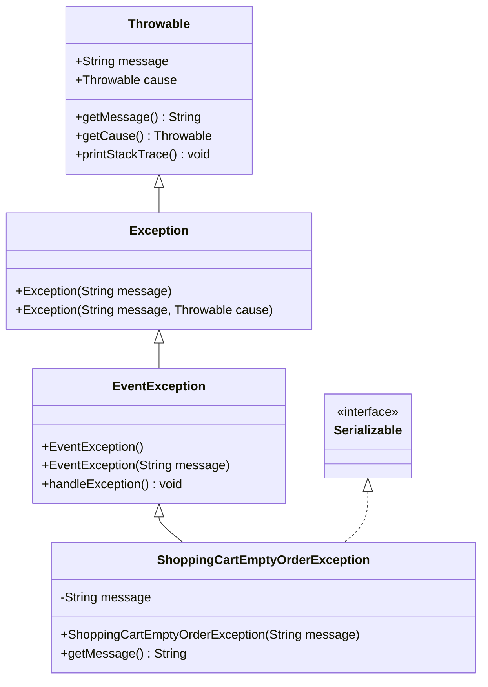
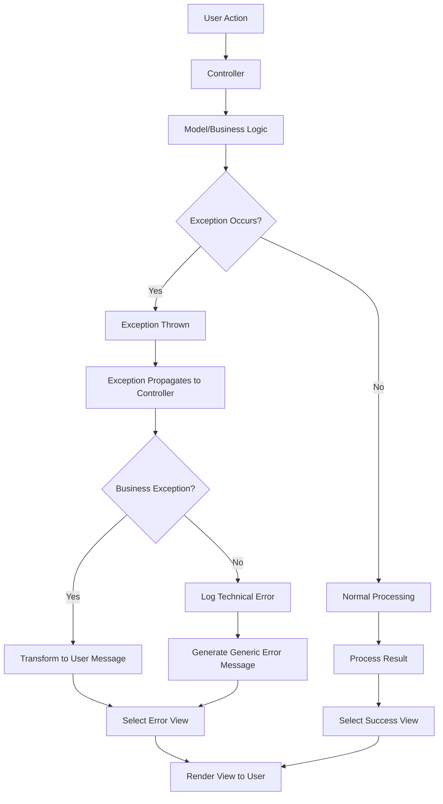
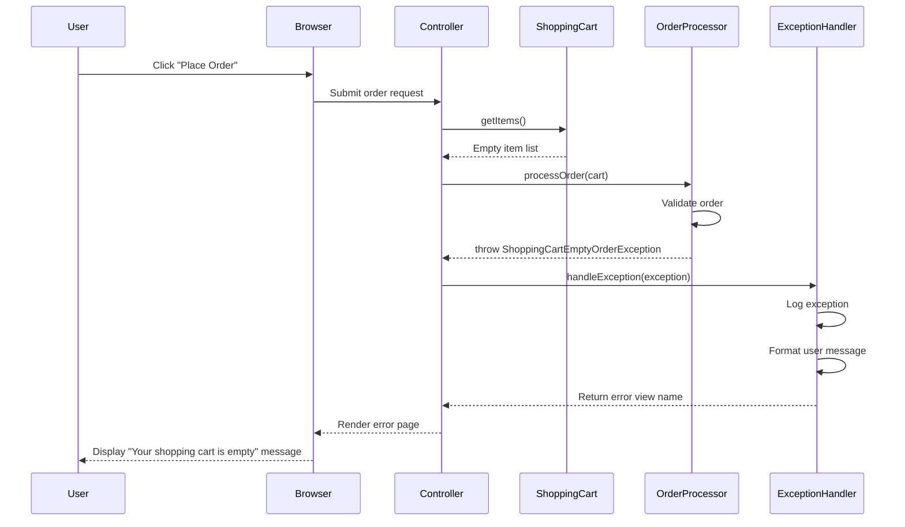

# Exception Handling in Java Pet Store 1.3.2

## Introduction to Exception Handling in Java Pet Store

Exception handling in Java Pet Store 1.3.2 represents a critical aspect of the application's architecture, designed to maintain system robustness while providing meaningful feedback to users. The implementation follows J2EE best practices of the era, integrating exception management with the application's event-driven architecture. Rather than merely using Java's standard exception hierarchy, Pet Store implements a custom exception framework that extends beyond simple error reporting to become an integral part of the application's control flow. This approach allows the application to gracefully handle both technical failures and business rule violations, maintaining system integrity while preserving user context. The exception handling strategy demonstrates a sophisticated understanding of enterprise application requirements, balancing the need for detailed error information for developers with appropriate messaging for end users.

## Exception Hierarchy and Architecture

The exception architecture in Java Pet Store 1.3.2 follows a carefully designed hierarchy that integrates with the application's event-driven framework. At the core of this design is the `EventException` class, which serves as the base for application-specific exceptions. This parent class extends Java's standard `Exception` class while adding functionality specific to the event processing system used throughout Pet Store. Custom exceptions like `ShoppingCartEmptyOrderException` extend from `EventException` and implement the `Serializable` interface, enabling them to be transmitted across the distributed components of the J2EE application.

This hierarchical approach allows for consistent exception handling throughout the application while providing the flexibility to create specialized exceptions for specific business scenarios. By implementing `Serializable`, these exceptions can be passed between different tiers of the application, including across remote EJB calls, maintaining their type information and custom properties. The architecture demonstrates a thoughtful balance between leveraging Java's built-in exception mechanisms and extending them to meet the specific needs of a complex enterprise application.

## Pet Store Exception Hierarchy

The diagram illustrates the exception hierarchy in Java Pet Store 1.3.2, showing how custom exceptions are integrated into both Java's standard exception framework and the application's event-driven architecture. At the root is Java's `Throwable` class, which provides fundamental exception functionality. The `Exception` class extends `Throwable` and serves as the base for checked exceptions in Java.

`EventException` extends `Exception` and acts as the foundation for Pet Store's custom exceptions, providing integration with the application's event processing system. `ShoppingCartEmptyOrderException` extends `EventException` and implements `Serializable`, allowing it to handle specific business rule violations while supporting distribution across the application's tiers. This architecture enables consistent exception handling throughout the application while providing specialized behavior for specific error scenarios.

## Business Logic Exceptions

Java Pet Store 1.3.2 implements a sophisticated approach to business logic exceptions, separating them from technical exceptions to provide more meaningful feedback to users and more actionable information for developers. The `ShoppingCartEmptyOrderException` exemplifies this approach, representing a business rule violation rather than a technical failure. This exception is thrown when a user attempts to place an order with an empty shopping cart, a scenario that commonly occurs when users navigate using the browser's back button after completing an order.

By creating specific exceptions for business rule violations, Pet Store achieves several benefits. First, it allows the application to provide precise feedback to users about what went wrong and how to correct it. Second, it enables different handling strategies for business exceptions versus technical failures. Third, it creates a clear separation between the application's business logic and its technical infrastructure, improving maintainability.

The implementation of `ShoppingCartEmptyOrderException` is particularly noteworthy for its simplicity and focus. It stores a message describing the exception and provides a `getMessage()` method to retrieve this information. This straightforward approach reflects the exception's purpose: to communicate a specific business rule violation clearly and concisely, without the complexity often associated with technical exceptions.

## Controller-Level Exception Handling

Exception management at the controller layer in Java Pet Store 1.3.2 demonstrates a sophisticated approach to error handling in a Model-View-Controller architecture. The controller acts as a central coordination point for exception handling, intercepting exceptions thrown by the model layer before they reach the view. This centralized approach allows for consistent error handling throughout the application while maintaining separation of concerns.

When an exception occurs in the business logic, it propagates to the controller, which determines the appropriate response. For business exceptions like `ShoppingCartEmptyOrderException`, the controller typically transforms the exception into a user-friendly message and directs the user to an appropriate view. For technical exceptions, the controller might log detailed information while presenting a more generic message to the user.

The controller also manages exception propagation across the application's distributed components. By implementing custom exceptions as `Serializable`, Pet Store ensures that exceptions can be transmitted between different tiers of the application while preserving their type information and properties. This capability is crucial in a J2EE environment where components may be distributed across multiple servers.

## Exception Flow in MVC Architecture

This flowchart illustrates the journey of exceptions through Java Pet Store's MVC architecture. When a user action triggers the controller, it delegates to the model/business logic layer. If an exception occurs during processing, it propagates back to the controller, which determines whether it's a business exception (like `ShoppingCartEmptyOrderException`) or a technical exception.

Business exceptions are transformed into user-friendly messages, while technical exceptions are logged with detailed information and translated into more generic user messages. The controller then selects an appropriate view to display the error message to the user. This centralized approach to exception handling ensures consistent error management throughout the application while maintaining the separation of concerns that is central to the MVC pattern.

The diagram highlights how Pet Store's exception handling strategy integrates with its overall architecture, using exceptions not just for error reporting but as part of the application's control flow. This approach allows the application to gracefully handle both expected business rule violations and unexpected technical failures.

## Exception Serialization and Distribution

The implementation of `Serializable` in Pet Store's exception classes, including `ShoppingCartEmptyOrderException`, is a critical design decision that enables robust exception handling in a distributed J2EE environment. Serialization allows exception objects to be converted to a byte stream that can be transmitted across network boundaries, then reconstructed on the receiving end with all their state intact. This capability is essential in Pet Store's multi-tiered architecture, where exceptions may need to propagate from EJBs running on an application server to servlets or JSPs that interact with the user.

Without serialization, exceptions thrown in remote components would lose their specific type information and custom properties when crossing tier boundaries, forcing the application to rely on generic exception types or string messages. By implementing `Serializable`, Pet Store ensures that rich exception information is preserved throughout the distributed system, enabling more precise error handling and better diagnostics.

The serialization approach also supports Pet Store's event-driven architecture, where events (including exceptions) may need to be queued or persisted before being processed. The combination of extending `EventException` and implementing `Serializable` creates a flexible foundation for exception handling that addresses both the immediate needs of error reporting and the broader requirements of the application's architecture.

## User Experience and Exception Handling

Java Pet Store 1.3.2 demonstrates a sophisticated understanding of how exception handling contributes to user experience. Rather than treating exceptions merely as technical errors to be logged, the application uses them as opportunities to provide meaningful guidance to users. The `ShoppingCartEmptyOrderException` exemplifies this approach, addressing a common user scenario—attempting to resubmit an order after using the browser's back button—with clear, actionable feedback.

When this exception occurs, instead of displaying a generic error message or, worse, allowing an invalid order to be processed, Pet Store informs the user specifically about what happened and why their action couldn't be completed. This targeted feedback helps users understand the system's behavior and adjust their actions accordingly, reducing frustration and support needs.

The application's approach to exception handling also preserves user context whenever possible. Rather than forcing users to start over after an error, Pet Store typically returns them to a relevant point in their workflow with their previous inputs intact. This context preservation is particularly important in e-commerce applications like Pet Store, where losing user input can lead to abandoned transactions.

## Exception Handling Sequence

This sequence diagram illustrates the lifecycle of a `ShoppingCartEmptyOrderException` from when it's thrown to when the user receives feedback. The sequence begins when a user attempts to place an order with an empty shopping cart, perhaps after completing a previous order and using the browser's back button.

The controller receives the request and retrieves the shopping cart items, finding an empty list. When it attempts to process the order, the order processor validates the cart and throws a `ShoppingCartEmptyOrderException` upon finding it empty. The controller catches this exception and delegates to an exception handler, which logs the exception, formats an appropriate user message, and determines which view to display.

The controller then renders the error page, which informs the user that their shopping cart is empty and provides guidance on how to proceed. This sequence demonstrates how Pet Store's exception handling integrates with its overall architecture to provide a seamless user experience even when errors occur.

## Logging and Monitoring Exceptions

Java Pet Store 1.3.2 implements a comprehensive approach to exception logging and monitoring, recognizing that effective error tracking is essential for both immediate troubleshooting and long-term system health. When exceptions occur, they are logged with contextual information that helps developers understand not just what went wrong but also why it happened and how to reproduce the issue.

For business exceptions like `ShoppingCartEmptyOrderException`, the logging is typically less verbose, focusing on tracking frequency and patterns rather than detailed diagnostics. These exceptions represent expected edge cases rather than system failures, so their logging serves primarily to monitor user behavior and identify potential improvements to the user interface or workflow.

For technical exceptions, the logging is more comprehensive, capturing stack traces, input parameters, system state, and other information needed for debugging. Pet Store uses different logging levels (debug, info, warning, error) to categorize exceptions based on their severity, allowing operations teams to filter logs and prioritize their response.

The application also implements exception aggregation and analysis, collecting exception data across multiple instances of the application to identify patterns and trends. This approach helps operations teams distinguish between isolated incidents and systemic issues, enabling more effective resource allocation for problem resolution.

## Best Practices in Pet Store's Exception Design

Java Pet Store 1.3.2's exception handling demonstrates several best practices that remain relevant in modern enterprise application development:

1. **Separation of Concerns**: By creating distinct exception types for different error categories, Pet Store maintains clear boundaries between business rule violations and technical failures. This separation simplifies error handling logic and improves code readability.

2. **Meaningful Messages**: Exceptions like `ShoppingCartEmptyOrderException` include descriptive messages that explain what went wrong in terms that are meaningful to both developers and end users. These messages facilitate troubleshooting and improve the user experience.

3. **Proper Exception Hierarchy**: Pet Store's exception classes extend from appropriate base classes (`EventException` extending from `Exception`), creating a logical hierarchy that supports consistent handling of related errors.

4. **Serialization Support**: By implementing `Serializable`, Pet Store's exceptions can be transmitted across network boundaries, essential in a distributed J2EE environment.

5. **Integration with Architecture**: Exceptions in Pet Store aren't just error reporting mechanisms; they're integrated into the application's event-driven architecture, contributing to its overall control flow.

6. **Centralized Handling**: The controller layer provides centralized exception handling, ensuring consistent error management throughout the application while maintaining separation of concerns.

7. **Context Preservation**: When exceptions occur, Pet Store preserves user context whenever possible, reducing frustration and improving the overall user experience.

8. **Comprehensive Logging**: Exceptions are logged with appropriate context and severity levels, supporting both immediate troubleshooting and long-term system health monitoring.

These practices demonstrate a sophisticated understanding of exception handling as not merely error reporting but as an integral part of application design that contributes to both system robustness and user satisfaction.

[Generated by the Sage AI expert workbench: 2025-03-29 21:37:00  https://sage-tech.ai/workbench]: #