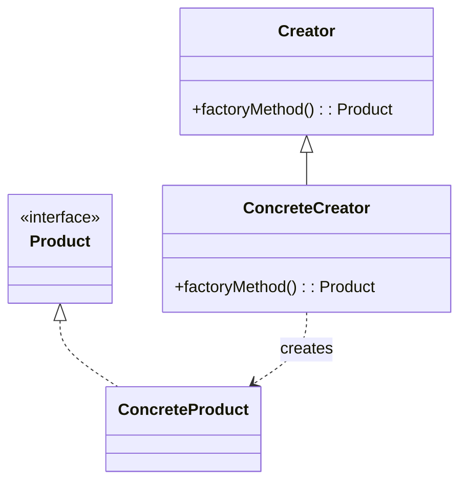
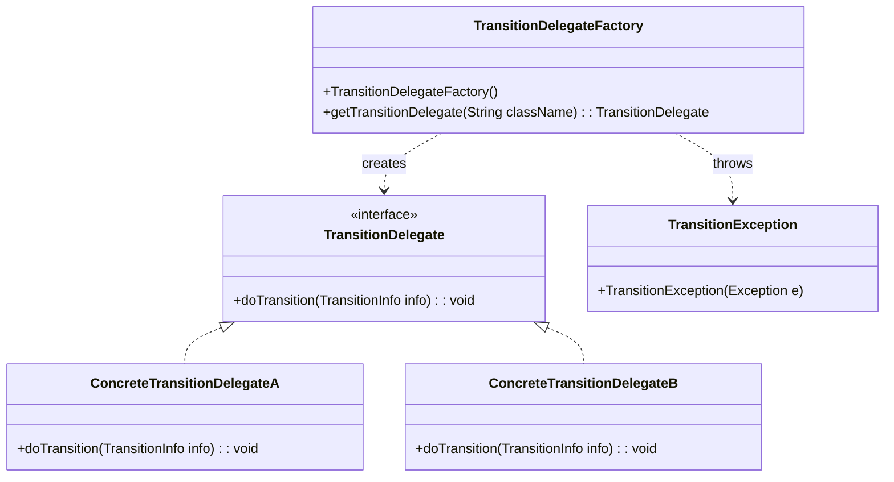
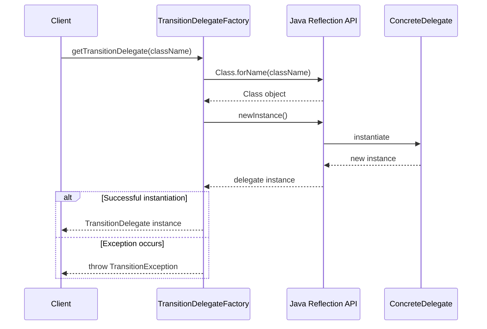
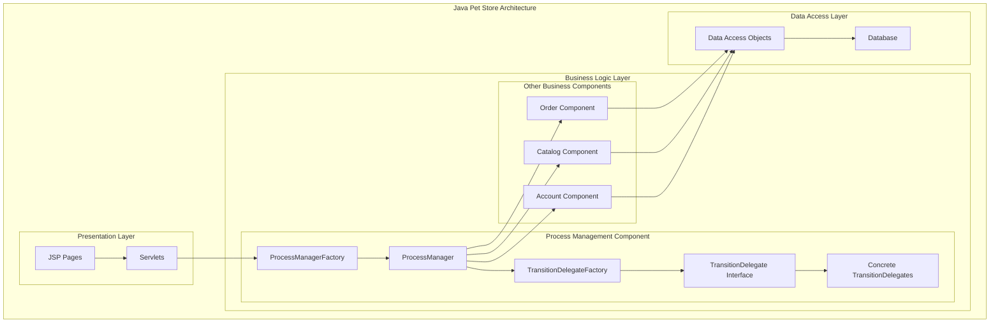

# Factory Pattern in Java Pet Store 1.3.2

## Introduction to the Factory Pattern

The Factory Pattern is a fundamental creational design pattern in object-oriented programming that provides an interface for creating objects without exposing the instantiation logic to client code. By encapsulating object creation within a dedicated factory class, this pattern promotes loose coupling between client code and concrete implementations. The pattern allows a system to remain agnostic about the specific classes it needs to instantiate while still maintaining control over the object creation process. This separation of concerns is particularly valuable in enterprise applications where implementation details may change over time, or where the concrete class to be instantiated might be determined at runtime based on configuration or other dynamic factors.

## Factory Pattern in Java Pet Store

In the Java Pet Store 1.3.2 application, the Factory Pattern is implemented within the process management component to facilitate the creation of transition delegates. The process management component is responsible for handling workflow transitions between different states in business processes, such as order processing or customer registration. The `TransitionDelegateFactory` class serves as a simple factory that dynamically instantiates concrete implementations of the `TransitionDelegate` interface based on class names provided at runtime. This approach allows the process management system to be extended with new transition types without modifying the core workflow engine, exemplifying the open-closed principle of object-oriented design.

## Basic Factory Pattern Structure

The diagram above illustrates the classic Factory Pattern structure. The Creator defines a factory method that returns a Product object. ConcreteCreator implements this method to produce instances of ConcreteProduct. This structure allows client code to work with the abstract Product interface without being aware of the concrete implementation classes. In the context of Java Pet Store, TransitionDelegateFactory serves as the ConcreteCreator, while TransitionDelegate is the Product interface with various concrete implementations.

## TransitionDelegateFactory Implementation

The `TransitionDelegateFactory` class in Java Pet Store 1.3.2 implements a straightforward version of the Factory Pattern. It provides a single method, `getTransitionDelegate(String className)`, which takes a fully qualified class name as input and returns an instance of the corresponding `TransitionDelegate` implementation. The factory uses Java reflection to dynamically instantiate the requested class, which must implement the `TransitionDelegate` interface. This approach offers significant flexibility, as new delegate types can be added to the system without modifying the factory code. The implementation is minimal yet effective, focusing solely on the object creation responsibility without additional caching or initialization logic.

## TransitionDelegateFactory Class Diagram

This class diagram shows the relationships between the `TransitionDelegateFactory` and the classes it interacts with. The factory creates instances of concrete classes that implement the `TransitionDelegate` interface. If instantiation fails, it throws a `TransitionException`. The concrete delegate implementations (represented by ConcreteTransitionDelegateA and ConcreteTransitionDelegateB) provide specific transition behavior for different workflow scenarios in the application.

## Dynamic Instantiation with Reflection

The `TransitionDelegateFactory` employs Java's reflection API to dynamically instantiate delegate classes at runtime. The key implementation line `td = (TransitionDelegate)Class.forName(className).newInstance();` demonstrates this approach. This technique offers significant flexibility by allowing the system to load and instantiate classes that may not be known at compile time. The use of reflection enables the process management component to be extended with new transition types without requiring changes to the factory code itself. This is particularly valuable in an enterprise application like Java Pet Store, where different deployment scenarios might require different transition implementations. However, this flexibility comes with trade-offs: reflection operations are slower than direct instantiation, type safety is checked at runtime rather than compile time, and the code depends on proper exception handling to manage instantiation failures.

## Exception Handling in the Factory

The `TransitionDelegateFactory` implements a straightforward but effective exception handling strategy. When attempting to instantiate a delegate class through reflection, multiple exceptions could occur: `ClassNotFoundException` if the specified class doesn't exist, `InstantiationException` if the class cannot be instantiated (e.g., it's abstract or lacks a no-arg constructor), or `IllegalAccessException` if the constructor isn't accessible. Rather than exposing these low-level reflection exceptions to client code, the factory catches all exceptions and wraps them in a domain-specific `TransitionException`. This approach follows the principle of abstraction by hiding implementation details and providing clients with exceptions that are meaningful within the domain context. The exception wrapping pattern used here maintains the original exception as the cause, preserving the full stack trace for debugging purposes while presenting a unified exception type to client code.

## Sequence Diagram of Factory Method Execution

This sequence diagram illustrates the flow of execution when the `getTransitionDelegate()` method is called. The client requests a delegate by providing a class name to the factory. The factory uses Java's Reflection API to locate and instantiate the class. If successful, the new delegate instance is returned to the client. If any exceptions occur during this process, they are caught, wrapped in a TransitionException, and thrown back to the client. This sequence demonstrates how the factory encapsulates the complexity of object creation, providing a clean interface to client code.

## Benefits of Factory Pattern in Process Management

The Factory Pattern, as implemented in the Java Pet Store's process management component, offers several significant benefits. First, it decouples the process workflow engine from specific transition implementations, allowing the system to be extended with new transition types without modifying existing code. This promotes the open-closed principle, where the system is open for extension but closed for modification. Second, the factory centralizes object creation logic, providing a single point of control for instantiating transition delegates. This simplifies maintenance and allows for future enhancements such as object pooling or caching. Third, by using reflection for dynamic instantiation, the system gains flexibility in determining which concrete classes to instantiate at runtime, potentially based on configuration or other runtime factors. Finally, the pattern provides a clean abstraction layer that shields client code from the complexities of object creation, including handling instantiation failures through domain-specific exceptions.

## Comparison with Other Creational Patterns

The Factory Pattern implementation in Java Pet Store's `TransitionDelegateFactory` represents a simple variant of the pattern, focused solely on object creation through reflection. Compared to other creational patterns, this implementation is more straightforward than an Abstract Factory, which would define interfaces for creating families of related objects. It's also less complex than a Builder pattern, which would separate the construction of complex objects from their representation. The implementation doesn't employ the Singleton pattern to ensure a single factory instance, suggesting that multiple factory instances might be created in different contexts. Unlike a Prototype pattern, it creates fresh instances rather than cloning existing ones. This simple factory approach is appropriate for the specific needs of the process management component, where the primary requirement is dynamic instantiation of transition delegates based on class names, without the additional complexity that other creational patterns might introduce.

## Factory Pattern in the Overall Architecture

This diagram illustrates where the Factory Pattern fits within the larger architecture of the Java Pet Store application. The `TransitionDelegateFactory` is a key component within the Process Management subsystem of the Business Logic Layer. It serves as a bridge between the ProcessManager, which orchestrates business processes, and the concrete TransitionDelegate implementations that perform specific transition actions. The factory pattern enables the Process Management component to dynamically instantiate appropriate delegates based on the current workflow requirements, providing flexibility and extensibility to the system's business process handling capabilities.

## Best Practices and Considerations

When implementing the Factory Pattern in enterprise applications like Java Pet Store, several best practices and considerations should be kept in mind. First, consider the trade-offs of using reflection for dynamic instantiation: while it provides flexibility, it introduces runtime overhead and potential for runtime errors. In performance-critical scenarios, alternative approaches like a type registry might be more appropriate. Second, robust exception handling is crucial; the factory should catch implementation-specific exceptions and translate them into domain-specific exceptions that are meaningful to clients. Third, consider caching frequently used objects to improve performance, especially if instantiation is expensive. Fourth, ensure thread safety if the factory will be accessed concurrently, which is common in enterprise applications. Fifth, consider implementing a more sophisticated factory that can handle initialization of created objects or manage their lifecycle. Finally, document the expected contract for classes that can be instantiated by the factory, such as requiring a no-argument constructor for reflection-based instantiation. These considerations help ensure that the Factory Pattern implementation is robust, maintainable, and performs well in an enterprise context.

[Generated by the Sage AI expert workbench: 2025-03-29 21:37:00  https://sage-tech.ai/workbench]: #