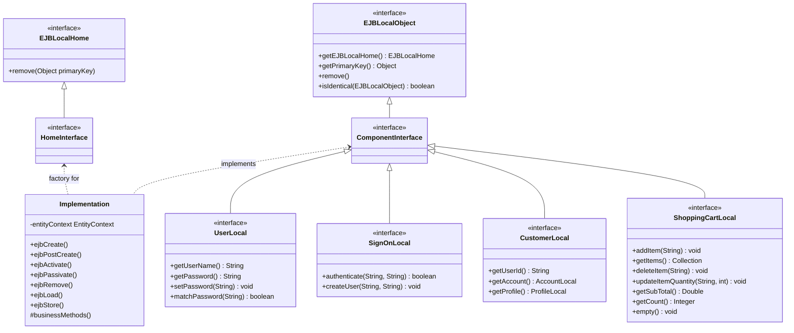
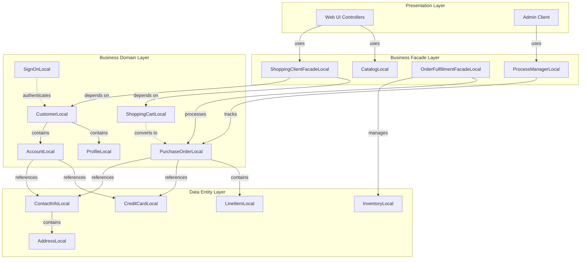
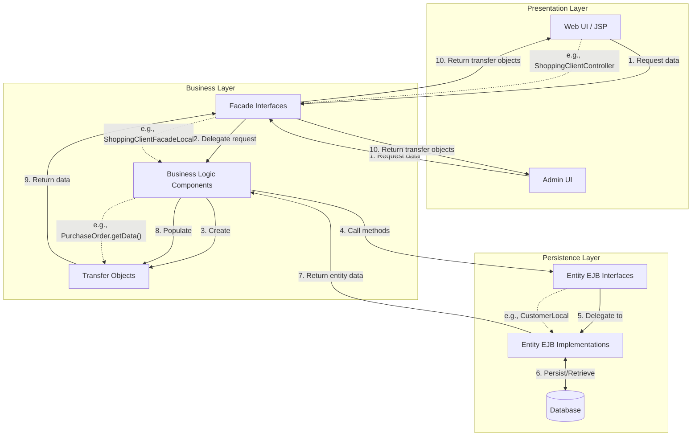
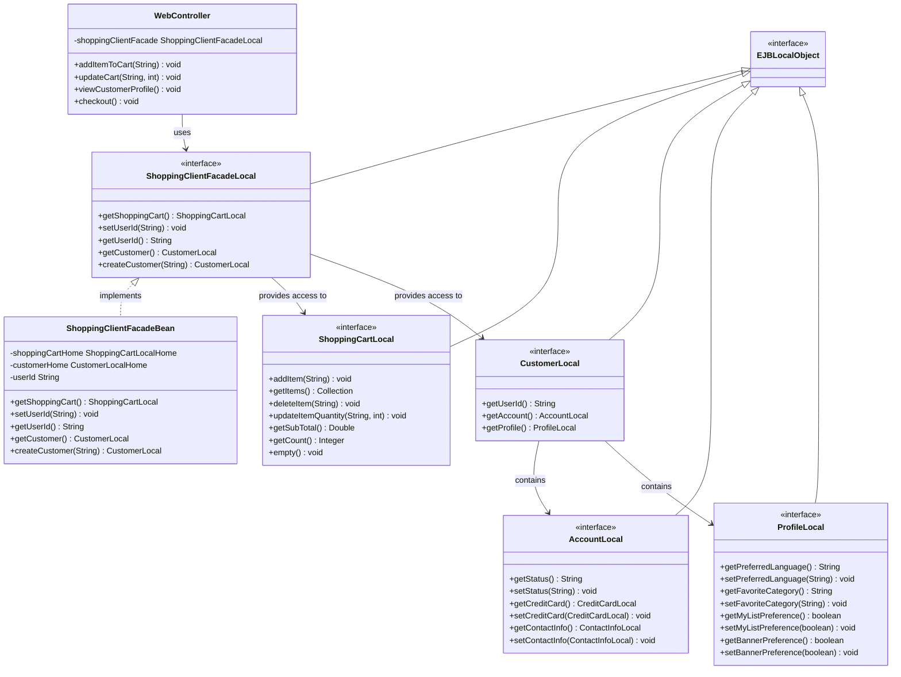

# Interface-Based Design in Java Pet Store 1.3.2

## Introduction to Interface-Based Design in Java Pet Store

Interface-based design stands as a cornerstone architectural pattern in Java Pet Store 1.3.2, embodying the fundamental principle of programming to interfaces rather than implementations. This approach creates a clear separation between component contracts and their concrete implementations, resulting in a loosely coupled, maintainable enterprise application architecture. In Java Pet Store, interfaces serve as the primary mechanism for defining component boundaries, establishing communication protocols between subsystems, and enabling flexibility through implementation hiding.

The application leverages interface-based design at multiple levels of abstraction - from EJB component interfaces that define business services to transfer objects that facilitate data exchange between tiers. This architectural choice reflects the J2EE best practice of creating modular, replaceable components that interact through well-defined contracts. By examining the source code, we can observe how Java Pet Store uses interfaces to create a robust enterprise application that can evolve over time while maintaining structural integrity.

## EJB Local Interfaces as Contracts

Java Pet Store 1.3.2 extensively employs local EJB interfaces to define clear contracts between components, promoting separation of concerns and implementation hiding. These interfaces, which extend `javax.ejb.EJBLocalObject`, establish the public API that client code can use to interact with EJB components without being coupled to their implementation details.

The application's architecture demonstrates a consistent pattern where each entity or session bean exposes its functionality through a local interface. For example, the `UserLocal` interface defines methods for user authentication operations:

```java
public interface UserLocal extends javax.ejb.EJBLocalObject {
    public static final int MAX_USERID_LENGTH = 25;
    public static final int MAX_PASSWD_LENGTH = 25;
    public String getUserName();
    public String getPassword();
    public void setPassword(String password);
    public boolean matchPassword(String password);
}
```

Similarly, the `SignOnLocal` interface provides authentication services:

```java
public interface SignOnLocal extends javax.ejb.EJBLocalObject {
    public boolean authenticate(String userName, String password);
    public void createUser(String userName, String password) throws CreateException;
}
```

These interfaces serve as contracts that:

1. Define the operations available to clients
2. Specify the exceptions that may be thrown
3. Hide implementation details such as persistence mechanisms
4. Enable container-managed services like transactions and security

By designing components around these interfaces, Java Pet Store achieves a clean separation between the component's public API and its internal implementation. This separation allows the implementation to evolve independently of client code, as long as the interface contract is maintained. It also enables the application server to provide services like pooling, lifecycle management, and transaction control through dynamic proxies that implement these interfaces.

## EJB Interface Hierarchy



The diagram illustrates the EJB interface hierarchy in Java Pet Store, showing how component interfaces extend the standard `EJBLocalObject` interface. This structure enables the container to provide services like lifecycle management and transaction control while allowing application-specific interfaces to define business functionality. The implementation classes implement these interfaces and contain the actual business logic, creating a clean separation between contract and implementation.

## Component Composition Through Interfaces

Java Pet Store 1.3.2 exemplifies sophisticated component composition through interfaces, particularly evident in its customer, order, and inventory management subsystems. This approach enables complex business processes to be assembled from smaller, focused components that interact through well-defined interfaces.

The customer management subsystem demonstrates this pattern through a hierarchical composition of interfaces. The `CustomerLocal` interface serves as an entry point that provides access to related components:

```java
public interface CustomerLocal extends javax.ejb.EJBLocalObject {
    public String getUserId();
    public AccountLocal getAccount();
    public ProfileLocal getProfile();
}
```

This interface allows clients to navigate to the customer's account information and profile preferences without being coupled to their implementations. The `AccountLocal` interface further extends this composition:

```java
public interface AccountLocal extends javax.ejb.EJBLocalObject {
    public String getStatus();
    public void setStatus(String status);
    public CreditCardLocal getCreditCard();
    public void setCreditCard(CreditCardLocal card);
    public ContactInfoLocal getContactInfo();
    public void setContactInfo(ContactInfoLocal contactInfo);
}
```

The order management system similarly uses interfaces to compose complex order processing functionality. The `PurchaseOrderLocal` interface demonstrates this approach:

```java
public interface PurchaseOrderLocal extends EJBLocalObject {
    // getters and setters for PO CMP fields
    public String getPoId();
    public String getPoUserId();
    // ...
    
    // getters and setters for accessing address info for this PO
    public ContactInfoLocal getContactInfo();
    public void setContactInfo(ContactInfoLocal addr);
    
    // getters and setters for accessing credit card info for this PO
    public CreditCardLocal getCreditCard();
    public void setCreditCard(CreditCardLocal ccinfo);
    
    // getters and setters for accessing line items for this PO
    public Collection getLineItems();
    public void addLineItem(LineItemLocal li);
    
    // other business methods
    public Collection getAllItems();
    public PurchaseOrder getData();
}
```

This composition approach provides several benefits:

1. **Modularity**: Each component focuses on a specific responsibility
2. **Reusability**: Components like `ContactInfoLocal` can be reused across different contexts
3. **Flexibility**: Implementations can be changed without affecting clients
4. **Testability**: Components can be tested in isolation using mock implementations

The inventory management system in the supplier application follows a similar pattern, with the `InventoryLocal` interface providing operations for managing inventory items:

```java
public interface InventoryLocal extends EJBLocalObject {
    //Setters and Getters
    public String getItemId();
    public int getQuantity();
    public void setQuantity(int quantity);

    //Business Methods
    public void reduceQuantity(int quantity);
}
```

Through these interface-based compositions, Java Pet Store achieves a modular architecture where complex business processes are built from smaller, focused components that interact through well-defined contracts.

## Component Relationship Model



This diagram illustrates how different components in Java Pet Store relate to each other through interfaces rather than direct implementation dependencies. The arrows represent dependencies where one component uses another through its interface. This design enables loose coupling between components, allowing them to evolve independently as long as their interface contracts remain stable.

## Local vs. Remote Interface Design

Java Pet Store 1.3.2 makes deliberate architectural choices regarding local and remote interface design patterns, optimizing for performance while maintaining flexibility. The application primarily uses local interfaces for intra-application communication, reserving remote interfaces for specific cross-application integration points.

### Local Interface Design

The majority of EJB components in Java Pet Store expose only local interfaces (extending `javax.ejb.EJBLocalObject`), as seen in components like `UserLocal`, `LineItemLocal`, and `ShoppingCartLocal`. This design decision offers significant performance benefits:

1. **Reduced Overhead**: Local interfaces avoid the serialization/deserialization and network protocol overhead of remote calls
2. **Pass-by-Reference Semantics**: Objects can be passed by reference rather than by value, eliminating unnecessary copying
3. **Efficient Resource Usage**: Local calls consume fewer system resources, improving scalability

For example, the `LineItemLocal` interface explicitly states its local-only nature:

```java
/**
 * This is the Public Local Interface for
 * the LineItemEJB. It does not have any Remote
 * interface.
 **/
public interface LineItemLocal extends EJBLocalObject {
    // methods...
}
```

### Remote Interface Design

Remote interfaces are selectively used for components that need to be accessed from external applications or separate JVM instances. The `OPCAdminFacade` interface demonstrates this approach:

```java
/**
 * The Remote interface for the Admin client from OPC
 */
public interface OPCAdminFacade extends EJBObject {
    public OrdersTO getOrdersByStatus(String status)
        throws RemoteException, OPCAdminFacadeException;
    
    public Map getChartInfo(String request, Date start, Date end, String requestedCategory)
        throws RemoteException, OPCAdminFacadeException;
}
```

Key characteristics of remote interfaces in Java Pet Store include:

1. **Transfer Objects**: Methods return serializable transfer objects rather than entity references
2. **Coarse-Grained Operations**: Interfaces provide coarse-grained operations to minimize network calls
3. **Exception Handling**: Methods declare `RemoteException` to handle network-related failures

### Appropriate Use Cases

Java Pet Store demonstrates appropriate use cases for each interface type:

- **Local Interfaces**: Used for fine-grained, high-frequency interactions between components within the same application (e.g., shopping cart operations, customer profile access)
- **Remote Interfaces**: Used for coarse-grained, lower-frequency interactions across application boundaries (e.g., admin operations, supplier integration)

This strategic combination of local and remote interfaces allows Java Pet Store to achieve both high performance for internal operations and flexibility for external integration, exemplifying best practices in J2EE architecture design.

## Transfer Objects and Interface-Based Communication

Java Pet Store 1.3.2 employs transfer objects (also known as Data Transfer Objects or DTOs) in conjunction with interfaces to facilitate efficient data exchange between application tiers while maintaining loose coupling. This pattern is essential for moving data across remote boundaries and for encapsulating related data into cohesive units.

Transfer objects in Java Pet Store are typically implemented as serializable classes that contain only data fields, getters, and setters. They work with interfaces in several key ways:

1. **Interface Methods Return Transfer Objects**: Component interfaces often include methods that return transfer objects containing aggregated data. For example, the `PurchaseOrderLocal` interface includes a `getData()` method that returns a `PurchaseOrder` transfer object:

```java
public interface PurchaseOrderLocal extends EJBLocalObject {
    // other methods...
    public PurchaseOrder getData();
}
```

2. **Transfer Objects as Parameters**: Interfaces accept transfer objects as parameters to update or create entities in a single operation:

```java
public interface ContactInfoLocalHome extends javax.ejb.EJBLocalHome {
    // other methods...
    public ContactInfoLocal create(ContactInfo contactInfo) throws CreateException;
}
```

3. **Transfer Object Interfaces**: Some transfer objects are defined as interfaces themselves, providing flexibility in implementation:

```java
public interface OrdersTO extends Serializable {
    public Iterator iterator();
    public int size();
    // other collection methods...
    
    static class MutableOrdersTO extends ArrayList implements OrdersTO {
    }
}
```

This approach offers several benefits:

- **Reduced Network Traffic**: By aggregating related data into a single object, the number of remote method calls is minimized
- **Decoupling**: Client code depends on the transfer object's interface rather than the entity's implementation
- **Versioning Support**: Transfer objects can evolve independently of the entities they represent
- **Performance Optimization**: Data can be pre-assembled on the server side, reducing client-side processing

The `LineItem` class exemplifies this pattern, serving as a transfer object that encapsulates line item data:

```java
public interface LineItemLocal extends EJBLocalObject {
    // other methods...
    public LineItem getData();
}
```

By combining interfaces with transfer objects, Java Pet Store achieves efficient communication between tiers while maintaining the separation of concerns that is central to interface-based design.

## Data Flow Through Interfaces



This diagram illustrates how data flows through the Java Pet Store application using interfaces and transfer objects. The process begins when a client (such as a web UI or admin interface) requests data through a facade interface. The request flows through business logic components that interact with entity EJB interfaces to access the database. Data retrieved from the database is encapsulated in transfer objects that flow back through the layers to the client.

Key aspects of this data flow include:

1. **Interface Boundaries**: Each layer exposes functionality through interfaces, creating clear boundaries between components
2. **Transfer Object Creation**: Business logic components create transfer objects to encapsulate data for return to clients
3. **Entity Access**: Business logic accesses entities through their local interfaces rather than direct implementation references
4. **Data Transformation**: As data moves up the layers, it's transformed from entity representations to client-friendly transfer objects

This architecture enables efficient data exchange while maintaining loose coupling between application tiers. The use of interfaces at each boundary allows components to evolve independently as long as they adhere to their interface contracts.

## Facade Pattern Implementation

Java Pet Store 1.3.2 masterfully implements the Facade pattern to simplify complex subsystems and provide unified interfaces to clients. This pattern is particularly evident in components that aggregate functionality from multiple underlying services into a cohesive, simplified API.

The Facade pattern in Java Pet Store serves several purposes:

1. **Simplifying Client Interactions**: Clients interact with a single facade interface rather than multiple component interfaces
2. **Reducing Coupling**: Clients are shielded from changes in the underlying implementation
3. **Centralizing Business Logic**: Common operations that span multiple components are centralized in the facade
4. **Providing Coarse-Grained Interfaces**: Facades offer higher-level operations that reduce the number of method calls

A prime example is the `ShoppingClientFacadeLocal` interface, which unifies access to shopping cart and customer components:

```java
public interface ShoppingClientFacadeLocal extends EJBLocalObject {
    public ShoppingCartLocal getShoppingCart();
    public void setUserId(String userId);
    public String getUserId();
    public CustomerLocal getCustomer() throws FinderException;
    public CustomerLocal createCustomer(String userId);
}
```

This facade provides a simplified API for shopping operations, hiding the complexity of managing shopping carts and customer information. Clients can perform common shopping tasks without understanding the relationships between these components.

Another example is the `OrderFulfillmentFacadeLocal` interface in the supplier application:

```java
public interface OrderFulfillmentFacadeLocal extends EJBLocalObject {
    public String processPO(String poXmlDoc)
        throws CreateException, XMLDocumentException;
    public Collection processPendingPO() throws FinderException;
}
```

This facade encapsulates the complex process of order fulfillment, which involves inventory management, purchase order processing, and potentially other operations. Clients need only call `processPO()` without understanding the underlying steps.

The implementation of these facades typically involves:

1. **Dependency Injection**: Facades are injected with references to the components they coordinate
2. **Transaction Management**: Facades often manage transactions that span multiple component operations
3. **Error Handling**: Facades provide unified error handling for operations that involve multiple components

By implementing the Facade pattern, Java Pet Store achieves a clean separation between its complex internal structure and the simplified interfaces it presents to clients. This approach enhances maintainability by localizing the impact of changes to underlying components and improves usability by providing intuitive, task-oriented interfaces.

## Facade Pattern in Shopping Client



This diagram illustrates how the ShoppingClientFacadeLocal interface simplifies access to shopping cart and customer components through a unified facade. The facade provides a cohesive API that web controllers can use without needing to understand the relationships between underlying components. This pattern reduces coupling between the presentation layer and business components while centralizing common shopping operations in a single interface.

## Exception Handling in Interface-Based Design

Java Pet Store 1.3.2 implements a sophisticated exception handling strategy that integrates seamlessly with its interface-based design. This approach ensures consistent error handling across component boundaries while maintaining the separation of concerns that is central to the application's architecture.

The exception handling strategy in Java Pet Store has several key characteristics:

1. **Exception Hierarchies**: The application defines custom exception classes that extend standard Java exceptions, creating hierarchies that reflect the component structure:

```java
public class CatalogException extends Exception implements java.io.Serializable {
    public CatalogException() {}
    public CatalogException(String str) { super(str); }
}
```

2. **Exception Declaration in Interfaces**: Component interfaces explicitly declare the exceptions they may throw, making error conditions part of the contract:

```java
public interface SignOnLocal extends javax.ejb.EJBLocalObject {
    public void createUser(String userName, String password) throws CreateException;
}
```

3. **Facade-Specific Exceptions**: Facade components define their own exceptions to encapsulate errors from underlying components:

```java
public class OPCAdminFacadeException extends Exception {
    public OPCAdminFacadeException(String str) { super(str); }
    public OPCAdminFacadeException() { super(); }
}
```

4. **Remote vs. Local Exception Handling**: The application distinguishes between exceptions in local and remote interfaces:

```java
// Remote interface with RemoteException
public interface OPCAdminFacade extends EJBObject {
    public OrdersTO getOrdersByStatus(String status)
        throws RemoteException, OPCAdminFacadeException;
}

// Local interface without RemoteException
public interface ProcessManagerLocal extends javax.ejb.EJBLocalObject {
    public void createManager(String orderId, String status) throws CreateException;
}
```

5. **Business vs. System Exceptions**: The application distinguishes between business exceptions (expected conditions) and system exceptions (unexpected failures):

```java
// Business exception for validation errors
public class AdminBDException extends Exception {
    public AdminBDException() { super(); }
    public AdminBDException(String s) { super(s); }
}

// System exception for XML processing errors
public String processPO(String poXmlDoc)
    throws CreateException, XMLDocumentException;
```

This exception handling strategy provides several benefits in the context of interface-based design:

- **Clear Error Contracts**: Interfaces explicitly define the error conditions clients must handle
- **Error Encapsulation**: Implementation details of errors are hidden behind facade exceptions
- **Consistent Error Handling**: Common error handling patterns are applied across components
- **Separation of Concerns**: Business logic and error handling are cleanly separated

By integrating exception handling with interface-based design, Java Pet Store achieves robust error management that enhances the reliability and maintainability of the application.

## Benefits and Challenges of Interface-Based Design

Java Pet Store 1.3.2's extensive use of interface-based design offers valuable insights into both the advantages and limitations of this architectural approach in enterprise applications.

### Benefits

1. **Loose Coupling**: The separation of interfaces from implementations creates loosely coupled components that can evolve independently. For example, the `CatalogLocal` interface allows the catalog implementation to change without affecting clients:

```java
public interface CatalogLocal extends EJBLocalObject {
    public Category getCategory(String categoryID, Locale l);
    public Page getCategories(int start, int count, Locale l);
    // Additional methods...
}
```

2. **Improved Testability**: Interfaces facilitate unit testing through mock implementations. Components like `ShoppingClientFacadeLocal` can be tested with mock implementations of `ShoppingCartLocal` and `CustomerLocal`.

3. **Enhanced Modularity**: The application is divided into cohesive components with clear responsibilities, such as `InventoryLocal` for inventory management and `ProcessManagerLocal` for order workflow.

4. **Flexibility and Extensibility**: New implementations can be introduced without changing client code. The application could replace the `CatalogLocal` implementation with one that uses a different data source without affecting dependent components.

5. **Clear Component Boundaries**: Interfaces define explicit contracts between components, making the system architecture more understandable. The `PurchaseOrderLocal` interface clearly defines the operations available on purchase orders.

6. **Container Services Integration**: Interfaces enable seamless integration with J2EE container services like transaction management and security. The container can create dynamic proxies that implement interfaces like `CustomerLocal` while adding these services.

### Challenges

1. **Interface Proliferation**: The application contains numerous interfaces, some with only slight variations, leading to maintenance overhead. For example, separate interfaces exist for `AddressLocal`, `ContactInfoLocal`, and related components.

2. **Indirection Complexity**: Multiple layers of interfaces can make code navigation and understanding more difficult. Tracing from a facade like `ShoppingClientFacadeLocal` to the actual implementation requires following several interface references.

3. **Performance Overhead**: While local interfaces reduce remote call overhead, the additional indirection layer still introduces some performance cost compared to direct method calls.

4. **Design Rigidity**: Once interfaces are published and used by clients, changing them becomes difficult without breaking compatibility. This can lead to interface versioning challenges.

5. **Implementation Binding**: Despite the use of interfaces, some implementation details inevitably leak into the interface design, particularly in entity relationships and exception handling.

6. **Learning Curve**: Developers must understand both the interfaces and their implementations to work effectively with the system, increasing the learning curve.

### Lessons for Modern Application Architecture

Java Pet Store's implementation of interface-based design offers valuable lessons for contemporary application architecture:

1. **Strategic Interface Granularity**: Define interfaces at the right level of abstraction to balance flexibility with complexity. Modern architectures might use fewer, more focused interfaces.

2. **Dependency Injection**: Modern frameworks provide more sophisticated dependency injection than was available in J2EE 1.3, making interface-based design more manageable.

3. **Functional Interfaces**: Modern Java's functional interfaces and lambda expressions can reduce the verbosity of interface-based designs while maintaining their benefits.

4. **Microservices Boundaries**: The clear component boundaries established by interfaces in Java Pet Store prefigure the service boundaries in modern microservices architectures.

5. **API-First Design**: The interface-first approach of Java Pet Store aligns with modern API-first design practices, where service contracts are defined before implementations.

By understanding both the benefits and challenges of interface-based design as implemented in Java Pet Store 1.3.2, architects can apply these lessons to create more maintainable, flexible, and robust modern applications while avoiding the pitfalls of excessive abstraction.

[Generated by the Sage AI expert workbench: 2025-03-29 21:37:00  https://sage-tech.ai/workbench]: #