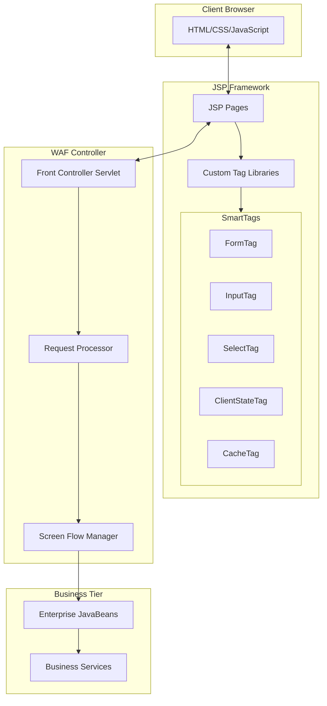
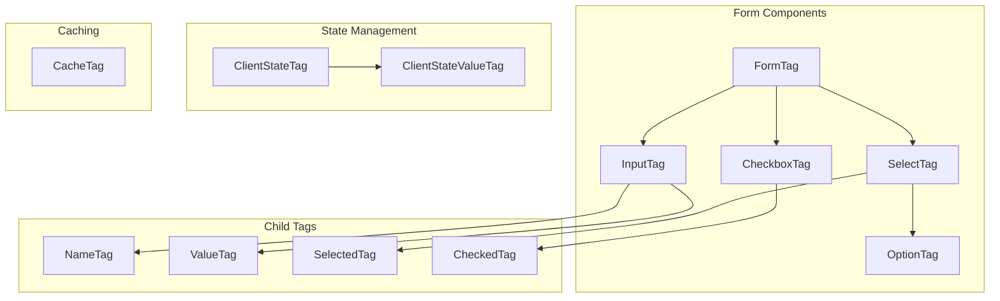
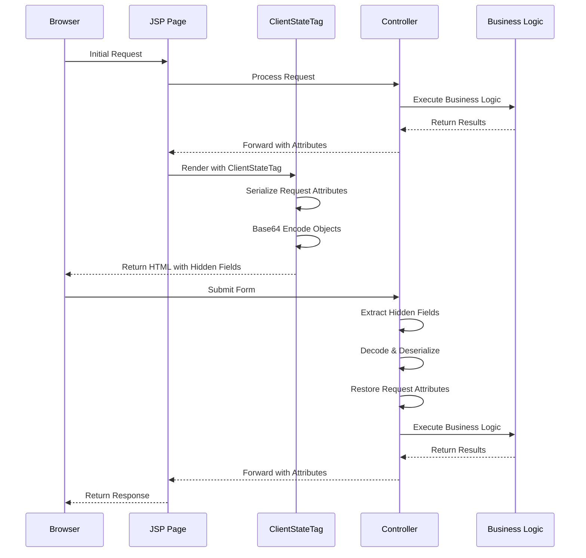
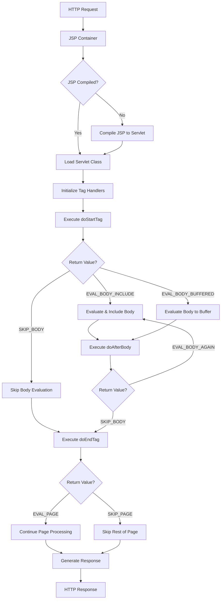

# JSP Framework in Java Pet Store 1.3.2

## Introduction to JSP Framework in Java Pet Store

The Java Pet Store 1.3.2 application leverages JavaServer Pages (JSP) as its primary presentation technology, implementing the View component of the Model-View-Controller (MVC) architecture. JSP serves as the bridge between the application's business logic and the user interface, allowing for dynamic content generation while maintaining a clean separation of concerns. In this implementation, JSP pages are responsible for rendering HTML content based on data provided by the controller layer, while custom tag libraries extend standard JSP functionality to create a more maintainable and reusable presentation layer.

The Pet Store's JSP framework is built upon the J2EE 1.3 platform specifications and incorporates several advanced features including custom tag libraries, client-side state management, form validation, content caching, and internationalization support. The framework demonstrates best practices for enterprise web application development by encapsulating complex UI logic within reusable components, reducing the amount of scriptlet code in JSP pages, and providing a consistent approach to common web presentation challenges.

## JSP Framework Architecture in Java Pet Store

The architecture diagram illustrates how the JSP Framework in Java Pet Store implements the MVC pattern. JSP pages serve as the View component, rendering HTML to the client browser. These pages utilize custom tag libraries that encapsulate complex presentation logic, reducing the need for embedded Java code. The WAF (Web Application Framework) Controller processes incoming requests, manages screen flow, and interacts with the Business Tier through EJBs. This architecture promotes separation of concerns, allowing presentation logic to be isolated from business logic and data access.

The custom tag libraries form a critical part of this architecture, providing reusable UI components that can be composed to create complex interfaces. These tags handle form generation, input validation, state management, and content caching, enabling JSP pages to focus on layout and presentation rather than implementation details.

## Custom Tag Libraries

The Java Pet Store 1.3.2 application features a sophisticated custom tag library collection called "smart taglib" that significantly extends JSP functionality. These custom tags encapsulate complex UI component generation and behavior, reducing the need for scriptlet code in JSP pages and promoting a more maintainable presentation layer. The smart taglib includes specialized tags for form handling (FormTag), input fields (InputTag), dropdown menus (SelectTag), checkboxes (CheckboxTag), and more advanced functionality like client state preservation (ClientStateTag) and content caching (CacheTag).

Each tag in the collection follows a consistent design pattern, extending the JSP BodyTagSupport class and implementing the appropriate tag lifecycle methods (doStartTag, doAfterBody, doEndTag). The tags are designed to work together in a hierarchical relationship, with parent tags like FormTag coordinating the behavior of child tags like InputTag. This hierarchical design allows for complex component composition while maintaining clean separation of concerns.

The smart taglib demonstrates best practices for JSP tag development, including proper state management (resetting tag attributes after use), efficient HTML generation (using StringBuffer for concatenation), and careful exception handling. The tags also implement validation logic that generates client-side JavaScript, reducing server round-trips for basic form validation while still supporting server-side validation when necessary.

## Custom Tag Hierarchy

The diagram illustrates the hierarchical relationships between custom tags in the Java Pet Store's JSP framework. This hierarchy is implemented through the JSP tag extension mechanism, where child tags locate their parent tags using the `findAncestorWithClass()` method. This parent-child relationship enables sophisticated component composition and information sharing between related tags.

For example, when a JSP page contains a `FormTag` with nested `InputTag` elements, the `InputTag` registers itself with the parent `FormTag` for validation purposes. Similarly, `OptionTag` elements register their values and display text with their parent `SelectTag`. This hierarchical design allows for clean separation of concerns while enabling complex component interactions.

The tag hierarchy also supports specialized child tags like `NameTag`, `ValueTag`, and `SelectedTag` that modify the behavior of their parent tags. These child tags extract content from their body and set corresponding attributes on their parent tags, providing a declarative way to configure component behavior. This approach reduces the need for scriptlet code in JSP pages and promotes a more maintainable presentation layer.

## Form Handling and Validation

The Java Pet Store's JSP framework implements a sophisticated form handling and validation system centered around the FormTag component. FormTag generates HTML forms with built-in client-side JavaScript validation, reducing server round-trips for basic validation while maintaining a clean separation between presentation and validation logic. The validation system works through a collaborative relationship between FormTag and its child InputTag components.

When an InputTag with a validation attribute is encountered within a FormTag, it registers itself with the parent FormTag using the putValidatedField() method. The FormTag collects these validation requirements and generates appropriate JavaScript validation code during its doEndTag() phase. This generated JavaScript checks for empty fields and displays appropriate error messages before form submission, preventing unnecessary server requests for incomplete forms.

The validation system supports different input types (text, password, hidden) and can be extended to support more complex validation rules. The framework's design ensures that validation logic is consistently applied across the application while remaining maintainable and extensible. By generating client-side validation code automatically, the framework reduces the burden on developers to write repetitive validation logic and ensures a consistent user experience.

FormTag also handles the generation of the form's HTML structure, including the form element itself, its attributes (name, action, method), and the submission mechanism. This encapsulation of form generation logic simplifies JSP pages and promotes consistency across the application. The tag's implementation carefully manages its internal state, resetting all attributes after rendering to prevent state leakage between requests.

## State Management in JSP

The Java Pet Store's JSP framework implements a sophisticated client-side state management approach through the ClientStateTag component. This tag addresses the stateless nature of HTTP by preserving application state across requests without relying solely on server-side session storage. ClientStateTag serializes Java objects from request attributes, encodes them using Base64 encoding, and embeds them as hidden form fields in the generated HTML. When the form is submitted, these serialized objects are transmitted back to the server, where they can be deserialized and restored to their original state.

This approach offers several advantages for state management in web applications. It reduces server memory usage by offloading some state storage to the client, improves scalability in clustered environments by reducing session replication requirements, and maintains state even when cookies are disabled or session tracking is problematic. The implementation carefully handles serialization constraints, checking if objects implement the Serializable interface before attempting to encode them.

ClientStateTag also preserves navigation context by automatically capturing referring URL and screen information. This integration with the Web Application Framework (WAF) controller enables proper back-button behavior and maintains the application's navigation flow. The tag supports both button and image-based submission mechanisms and allows additional parameters to be added through child ClientStateValueTag elements.

The implementation demonstrates advanced JSP tag development techniques, including proper state management, efficient HTML generation, and careful exception handling. By encapsulating this complex state preservation logic within a reusable tag, the framework simplifies JSP pages and promotes consistent state management practices across the application.

## State Management Flow

This sequence diagram illustrates the flow of state management in the Java Pet Store JSP framework. The process begins with an initial request from the browser to a JSP page. The controller processes this request, executes business logic, and forwards the results as request attributes to the JSP page.

When the JSP page renders with ClientStateTag, the tag serializes relevant request attributes, encodes them using Base64 encoding, and embeds them as hidden form fields in the HTML sent back to the browser. This effectively preserves the application state on the client side.

When the user submits the form, these hidden fields containing the serialized state are sent back to the controller. The controller extracts these fields, decodes and deserializes the data, and restores the original request attributes. This restoration allows the application to continue processing with the same state information that was present in the previous request, maintaining continuity in the user experience despite the stateless nature of HTTP.

This approach to state management is particularly valuable for multi-page workflows where maintaining state between requests is essential, such as shopping cart operations or multi-step registration processes. By encoding state in the page itself rather than relying solely on server-side session storage, the framework provides a robust mechanism for state preservation that works even in challenging environments where session tracking might be problematic.

## Content Caching

The Java Pet Store's JSP framework implements a sophisticated content caching mechanism through the CacheTag component. This tag enables caching of rendered content at various scopes (page, request, session, application/context) with configurable expiration times, significantly improving application performance by reducing redundant content generation. The caching system is particularly valuable for content that is expensive to generate but doesn't change frequently, such as product catalogs or static information.

CacheTag works by evaluating its body content only when no valid cached content exists. On first execution, it captures the rendered output, stores it in an Entry object along with creation timestamp and duration information, and places this Entry in the appropriate scope (determined by the scope attribute). On subsequent executions, if a valid cached entry exists, the tag simply outputs the cached content without re-evaluating its body, saving processing time and resources.

The implementation includes intelligent cache key generation that combines the request URL, query string, and a user-specified name attribute to create unique cache entries. This ensures that cached content is properly isolated between different pages and request parameters. The tag also implements proper cache expiration checking, comparing the current time against the cached entry's creation time and configured duration to determine if the cache should be refreshed.

CacheTag demonstrates advanced JSP tag development techniques, including proper scope-based attribute storage using the JSP pageContext object, efficient content capture and output, and careful state management. By encapsulating this complex caching logic within a reusable tag, the framework simplifies JSP pages and promotes consistent caching practices across the application.

## Internationalization Support

The Java Pet Store application demonstrates comprehensive internationalization (i18n) support within its JSP framework, enabling the application to serve content in multiple languages including English, Chinese, and Japanese. This internationalization support is implemented through a combination of localized resource files, character encoding management, and specialized JSP tags.

The framework handles character encoding challenges for languages with non-Latin scripts by explicitly setting the appropriate character encoding in JSP pages. For Chinese content, the application uses the gb2312 encoding as seen in the documentation files, while Japanese content uses euc-jp encoding. These encoding specifications ensure proper rendering of characters across different language environments.

Resource externalization is a key aspect of the internationalization strategy, with UI text stored in language-specific resource bundles rather than hardcoded in JSP pages. This approach allows the same JSP templates to render content in different languages based on the user's locale preference. The framework likely uses the standard Java ResourceBundle mechanism to load the appropriate language resources.

The application's documentation structure reflects this internationalization approach, with parallel directory structures for different languages (e.g., /docs/zh/ for Chinese, /docs/ja/ for Japanese). This organization facilitates maintenance of localized content and ensures that users receive documentation in their preferred language.

While not explicitly shown in the provided code samples, the JSP framework likely includes support for locale detection and selection, allowing users to choose their preferred language or automatically detecting it from browser settings. This comprehensive approach to internationalization makes the Java Pet Store application accessible to a global audience and demonstrates best practices for building multilingual web applications.

## JSP Processing Lifecycle

The diagram illustrates the JSP processing lifecycle in the Java Pet Store application, showing how JSP pages are transformed into dynamic content through the JSP container and custom tag processing.

When an HTTP request arrives for a JSP page, the JSP container first checks if the JSP has already been compiled into a servlet. If not, it compiles the JSP into a servlet class. Once the servlet class is loaded, the container initializes any tag handlers used in the page, including custom tags from the smart taglib collection.

The tag processing follows a well-defined lifecycle. First, the `doStartTag()` method is called on each tag. Depending on the return value, the container either evaluates the tag body (EVAL_BODY_INCLUDE or EVAL_BODY_BUFFERED) or skips it (SKIP_BODY). For tags that use buffering (like most in the smart taglib), the body content is captured for further processing.

After body evaluation, `doAfterBody()` is called, allowing tags to process the captured content. This method can indicate whether to re-evaluate the body (EVAL_BODY_AGAIN) or proceed to the end phase (SKIP_BODY). Finally, `doEndTag()` is called to complete tag processing, potentially generating output to the response.

This lifecycle is evident in the implementation of tags like FormTag, InputTag, and SelectTag, which carefully manage their processing phases to generate appropriate HTML and JavaScript. The framework leverages this lifecycle to implement features like form validation, state management, and content caching while maintaining clean separation between presentation logic and markup.

## Integration with WAF Controller

The JSP framework in Java Pet Store integrates seamlessly with the Web Application Framework (WAF) controller through a sophisticated request attribute and navigation parameter system. This integration enables a clean separation between the presentation layer (JSP) and the application control flow logic, while maintaining contextual information across requests.

The ClientStateTag component plays a crucial role in this integration by preserving navigation context across requests. It automatically captures and maintains important controller attributes like "referring_URL" and "referring_screen" as hidden form fields. These attributes allow the WAF controller to maintain proper navigation flow, enabling features like back-button support and breadcrumb navigation.

When processing a request, the WAF controller populates the request with attributes containing model data and view-specific information. These attributes are then accessible to JSP pages and custom tags for rendering. The controller determines which JSP view to display based on the application's screen flow configuration, forwarding the request to the appropriate JSP page.

The framework also supports passing parameters from JSP views back to the controller through form submissions and URL parameters. Custom tags like FormTag and ClientStateTag facilitate this by generating the appropriate HTML structures with the necessary parameters. This bidirectional communication ensures that user actions in the view layer can trigger appropriate controller actions.

This integration demonstrates the MVC architecture's effectiveness in separating concerns while maintaining cohesive application behavior. The JSP framework focuses on presentation concerns (how to display information), while the WAF controller manages application flow and business logic coordination. This separation improves maintainability and allows each layer to evolve independently while preserving their integration points.

[Generated by the Sage AI expert workbench: 2025-03-29 21:37:00  https://sage-tech.ai/workbench]: #