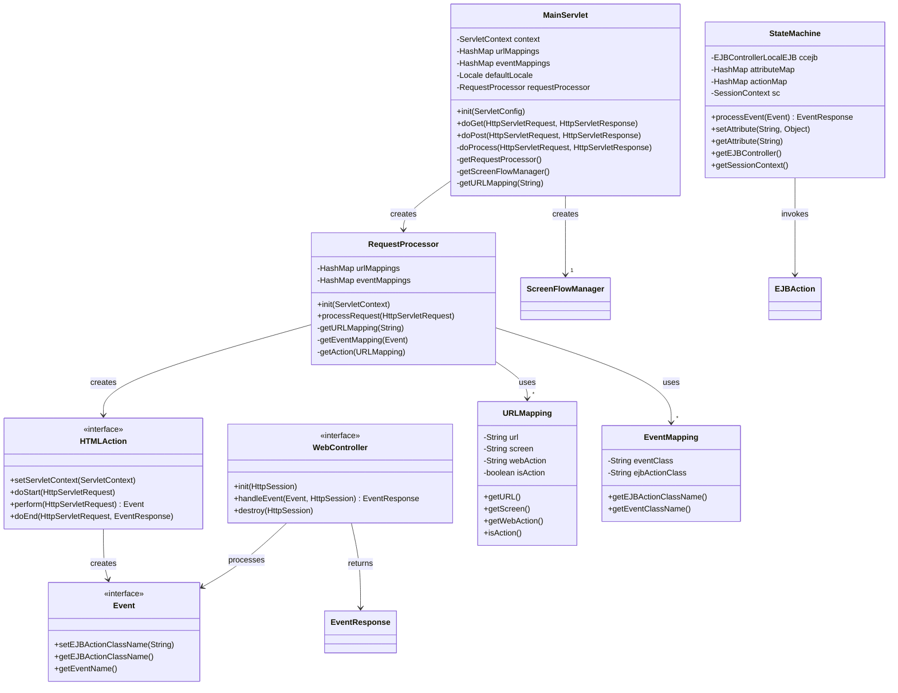
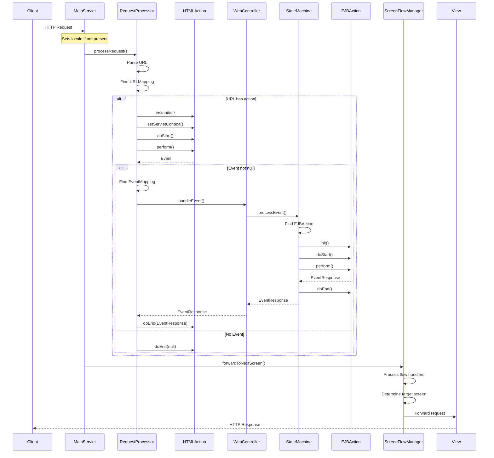
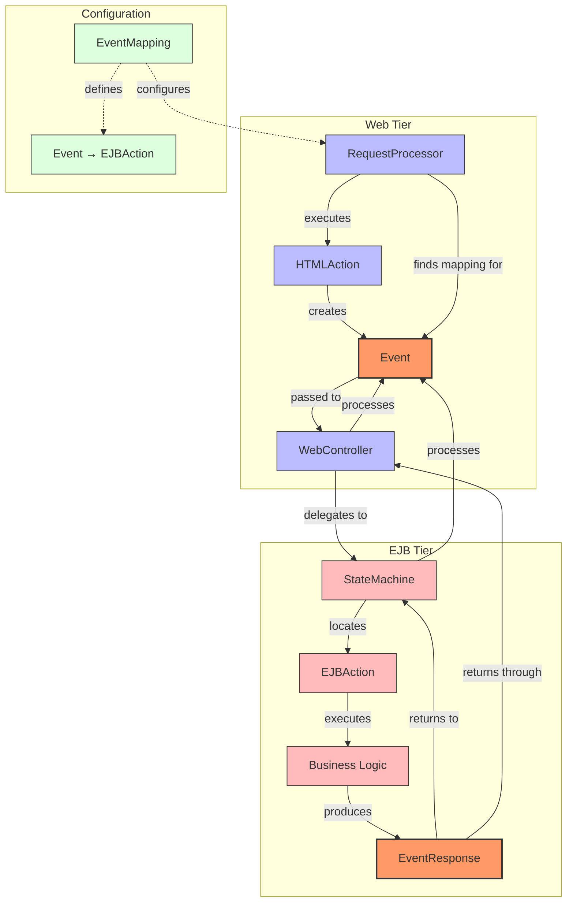

# MVC Controller Framework in Java Pet Store 1.3.2

## Introduction to MVC in Java Pet Store

The Model-View-Controller (MVC) pattern is a cornerstone of the Java Pet Store 1.3.2 reference application's architecture. As a demonstration of J2EE best practices, Pet Store implements a sophisticated MVC framework that separates business logic (Model), presentation (View), and request handling (Controller) concerns. This separation enables a modular, maintainable application structure that became a blueprint for enterprise Java applications of the era.

The implementation follows a tiered approach where the web tier contains JSP views and servlet controllers, while the business tier houses EJB components that implement the model. The controller framework specifically provides a robust infrastructure for handling HTTP requests, processing user actions, managing application flow, and coordinating with the business tier. This approach was revolutionary at the time, as it demonstrated how to build scalable web applications with clean separation of concerns before frameworks like Struts and Spring became mainstream.

The Pet Store's MVC implementation is particularly notable for its event-driven architecture, where user actions generate events that flow through the system, allowing for loose coupling between components. This design enables the application to be extended and modified with minimal impact on existing code, a critical requirement for enterprise applications.

## Web Application Framework (WAF) Architecture

The Web Application Framework (WAF) component forms the foundation of the MVC implementation in Java Pet Store 1.3.2. It provides a structured approach to web application development by enforcing clear separation between presentation, control flow, and business logic.

The WAF is organized in a layered architecture:

1. **Presentation Layer**: Consists of JSP pages and custom tag libraries that render the user interface. This layer is strictly concerned with displaying data and capturing user input.

2. **Controller Layer**: Comprises several key components:
   - A front controller servlet (MainServlet) that intercepts all requests
   - Request processors that translate HTTP requests into application events
   - Action handlers that execute specific business operations
   - Flow managers that control navigation between screens
   - Event handlers that process business events

3. **Integration Layer**: Provides bridges between the web tier and EJB tier through:
   - WebController implementations that delegate to EJB controllers
   - Component managers that handle service location and resource management
   - Event translators that convert web events to business events

4. **Configuration Layer**: Uses XML-based configuration to define:
   - URL-to-action mappings
   - Event-to-EJB action mappings
   - Exception-to-screen mappings

The WAF's architecture employs several design patterns including Front Controller, Command, Service Locator, and Intercepting Filter. It uses a declarative approach to configuration, allowing application behavior to be modified without code changes. The framework also provides infrastructure for internationalization, state management, and exception handling.

This layered design with clear abstractions enables developers to focus on application-specific logic rather than infrastructure concerns. The WAF serves as both the controller framework for the Pet Store application and a reusable component for other J2EE applications, demonstrating the blueprint nature of the reference implementation.

## MVC Controller Framework Components



The MVC Controller Framework in Java Pet Store consists of several interconnected components that work together to process requests, manage application flow, and coordinate between the web tier and EJB tier. The diagram illustrates the key components and their relationships.

At the heart of the framework is the `MainServlet`, which serves as the front controller intercepting all client requests. It delegates request processing to the `RequestProcessor`, which determines the appropriate action to execute based on URL mappings defined in configuration files. The `RequestProcessor` creates and executes `HTMLAction` implementations that encapsulate specific application behaviors.

Actions produce `Event` objects that represent user intentions or system state changes. These events are passed to `WebController` implementations, which bridge the web tier and EJB tier. The `WebController` delegates to the EJB tier's `StateMachine`, which processes events by finding and executing the appropriate `EJBAction` based on `EventMapping` configurations.

This component architecture enables a clean separation between HTTP request handling, application logic, and navigation control, while providing a flexible, configurable framework for building web applications.

## Front Controller Pattern Implementation

The Java Pet Store 1.3.2 implements the Front Controller pattern through the `MainServlet` class, which serves as the central entry point for all HTTP requests in the web application. This implementation provides a unified approach to request handling, centralizing control logic that would otherwise be scattered across multiple components.

The `MainServlet` intercepts all requests with URL patterns ending in `.do` (for actions) and delegates them to appropriate handlers. This centralization offers several key benefits:

1. **Centralized URL Mapping**: The servlet loads URL mappings from an XML configuration file (`mappings.xml`) during initialization, storing them in a HashMap for efficient lookup. This approach allows for declarative definition of application flow without hardcoding navigation logic.

2. **Request Processing Pipeline**: The servlet implements a consistent processing sequence for all requests:
   - Setting the user's locale (with fallback to a configurable default)
   - Delegating to the RequestProcessor to handle business logic
   - Using the ScreenFlowManager to determine the next view
   - Handling exceptions with appropriate error screens

3. **Lifecycle Management**: The servlet manages the lifecycle of key framework components like RequestProcessor and ScreenFlowManager, creating them during initialization and making them available to the entire application through the ServletContext.

4. **Exception Handling**: The servlet provides centralized exception handling, mapping different exception types to appropriate error screens based on configuration. This ensures consistent error handling throughout the application.

5. **Thread Safety**: The implementation carefully manages shared resources to ensure thread safety in a multi-user environment.

The `MainServlet` uses lazy initialization for its components, creating them only when needed and caching them for future use. This approach improves performance while ensuring resources are properly initialized before use.

By implementing the Front Controller pattern, the Pet Store application achieves a clean separation between request handling, business logic processing, and view selection, making the application more maintainable and extensible.

## Request Processing Pipeline

The request processing pipeline in Java Pet Store's MVC framework represents a sophisticated sequence of operations that transform an HTTP request into business operations and ultimately into a response. This pipeline implements a chain of responsibility pattern where each component handles a specific aspect of request processing.

The pipeline begins when a client request reaches the `MainServlet`, which serves as the entry point for all application interactions. From there, the request flows through several distinct phases:

1. **Request Interception**: The `MainServlet` intercepts all requests matching the configured URL patterns (typically ending with `.do`). It establishes the user's locale and prepares the request for processing.

2. **Request Analysis**: The `RequestProcessor` examines the request URL to determine which action should handle it. It extracts the URL pattern from the full request URI and looks up the corresponding `URLMapping` in its configuration.

3. **Action Execution**: Once the appropriate `HTMLAction` implementation is identified, it's instantiated (or retrieved from cache) and executed through a three-phase lifecycle:
   - `doStart()`: Performs pre-processing tasks like validation
   - `perform()`: Executes the core business logic and generates an `Event`
   - `doEnd()`: Handles post-processing tasks like setting request attributes

4. **Event Processing**: If the action generates an event, the `RequestProcessor` retrieves the appropriate `EventMapping` and sets the EJB action class name on the event. It then passes the event to the `WebController` for processing.

5. **Business Logic Execution**: The `WebController` delegates the event to the EJB tier through the `StateMachine`, which locates and executes the appropriate `EJBAction`. This action performs business operations and may return an `EventResponse`.

6. **Response Preparation**: The `HTMLAction.doEnd()` method receives the `EventResponse` and can use it to prepare data for the view, typically by setting request attributes.

7. **View Selection**: The `ScreenFlowManager` determines the next screen to display based on the current state, the executed action, and any flow handlers configured for the URL.

8. **View Rendering**: The selected JSP or template is rendered, completing the request-response cycle.

Throughout this pipeline, various cross-cutting concerns are addressed, including locale management, exception handling, and state management. The pipeline's modular design allows for customization at multiple points, enabling application-specific behavior while maintaining a consistent processing structure.

## Request Processing Sequence



The sequence diagram illustrates the complete flow of a request through the Java Pet Store MVC controller framework, from initial HTTP request to final response. This process demonstrates the sophisticated event-driven architecture that enables loose coupling between components.

When a client request arrives, the `MainServlet` first ensures the user's locale is set, then delegates to the `RequestProcessor`. The processor parses the URL to identify the appropriate action based on configured URL mappings. If an action is found, it's instantiated and executed through its lifecycle methods.

The action's `perform()` method may generate an `Event` representing a user intention or system state change. If an event is produced, the processor finds the corresponding `EventMapping` and passes the event to the `WebController`, which bridges the web and EJB tiers.

The controller delegates to the `StateMachine` in the EJB tier, which locates and executes the appropriate `EJBAction`. This action performs business operations and may return an `EventResponse` containing results or status information. The response flows back through the chain to the `HTMLAction`, which can use it to prepare data for the view.

After request processing completes, the `MainServlet` invokes the `ScreenFlowManager` to determine the next screen to display. The manager processes any configured flow handlers and forwards to the target view, which renders the response to the client.

This sequence demonstrates several key architectural patterns:
- Chain of responsibility for request processing
- Command pattern for encapsulating actions
- Strategy pattern for flexible event handling
- Front controller for centralized request management

The framework's event-driven design enables components to communicate without direct dependencies, enhancing modularity and maintainability.

## Action and Event Mechanism

The Action and Event mechanism forms the core of the Java Pet Store's command pattern implementation, providing a flexible and extensible approach to handling user interactions and system state changes. This mechanism decouples request handling from business logic execution, allowing each to evolve independently.

At the web tier, the `HTMLAction` interface defines the contract for classes that process HTTP requests. Actions implement a clear lifecycle with distinct phases:

1. **Initialization**: The `setServletContext()` method provides access to application resources.
2. **Pre-processing**: The `doStart()` method prepares for action execution, often performing validation.
3. **Execution**: The `perform()` method contains the core logic, translating HTTP parameters into domain-specific events.
4. **Post-processing**: The `doEnd()` method handles cleanup and prepares data for the view.

The `HTMLActionSupport` abstract class provides a default implementation of this interface, allowing developers to focus on the specific behavior needed for each action. Concrete implementations like `CartHTMLAction`, `CustomerHTMLAction`, and `OrderHTMLAction` encapsulate the logic for specific application functions.

Events serve as the communication mechanism between the web tier and business tier. The `Event` interface defines the contract for all events, with `EventSupport` providing a base implementation. Events are serializable objects that carry information about user intentions or system state changes. They include:

1. **Data payload**: Information needed to execute the business operation.
2. **Event name**: A logical identifier used for routing.
3. **EJB action class name**: The fully qualified name of the class that will process the event.

The framework uses a registry approach to map events to their handlers. The `EventMapping` class associates event class names with EJB action class names, allowing the system to dynamically locate and instantiate the appropriate handler for each event.

In the EJB tier, the `EJBAction` interface defines the contract for classes that process events. Like their web tier counterparts, EJB actions have a lifecycle with initialization, execution, and cleanup phases. The `StateMachine` component manages this lifecycle, locating the appropriate action for each event and executing it.

This action and event mechanism provides several benefits:
- **Loose coupling**: Web tier and EJB tier components communicate without direct dependencies.
- **Extensibility**: New actions and events can be added without modifying existing code.
- **Reusability**: Common behavior can be extracted into base classes or shared actions.
- **Testability**: Actions can be tested in isolation from the web container.

The mechanism's design reflects the sophisticated architecture of the Java Pet Store, demonstrating best practices for enterprise application development in the J2EE platform.

## Event Handling Architecture



The event handling architecture in Java Pet Store's MVC framework implements a sophisticated mechanism for propagating user actions and system events across application tiers. This diagram illustrates how events flow from the web tier to the EJB tier and back, enabling loose coupling between presentation and business logic.

In the web tier, `HTMLAction` implementations process HTTP requests and create appropriate `Event` objects representing user intentions. These events are standardized data carriers that encapsulate all information needed to perform a business operation. The `RequestProcessor` identifies the correct event mapping from configuration and passes the event to a `WebController` implementation.

The `WebController` serves as a bridge between tiers, delegating the event to the `StateMachine` in the EJB tier. This delegation typically occurs through local EJB interfaces, providing transaction management and security benefits while maintaining the separation of concerns.

Within the EJB tier, the `StateMachine` uses the event's class name or a configured mapping to locate the appropriate `EJBAction` implementation. The action executes business logic, often interacting with entity beans, data access objects, or other business components. Upon completion, it may produce an `EventResponse` containing results or status information.

The `EventResponse` travels back through the same chain—from `EJBAction` to `StateMachine` to `WebController` and finally to the original `HTMLAction`. This bidirectional flow enables the web tier to update its state based on business operations without direct knowledge of the business tier's implementation details.

Configuration plays a crucial role in this architecture. `EventMapping` objects, typically loaded from XML files, define the relationships between event classes and their handlers. This declarative approach allows the application to be reconfigured without code changes.

Key benefits of this event handling architecture include:

1. **Decoupling**: Presentation and business logic evolve independently
2. **Extensibility**: New events and handlers can be added with minimal impact
3. **Testability**: Components can be tested in isolation
4. **Flexibility**: Event routing can be reconfigured without code changes

This architecture demonstrates the sophisticated design principles employed in the Java Pet Store reference implementation, providing a blueprint for enterprise application development.

## URL and Event Mappings

The Java Pet Store's MVC controller framework implements a flexible, XML-based configuration system for mapping URLs to actions and events to EJB actions. This declarative approach separates the routing logic from the application code, enabling changes to application behavior without modifying or recompiling source files.

The configuration is primarily defined in the `mappings.xml` file, which contains two main sections:

1. **URL Mappings**: These define how incoming HTTP requests are routed to appropriate handlers. Each mapping associates a URL pattern with:
   - A screen path for rendering the response
   - An HTML action class that processes the request
   - Optional flow handlers for complex navigation logic

2. **Event Mappings**: These define how events generated by the web tier are processed in the EJB tier. Each mapping associates an event class name with an EJB action class name.

The framework loads these mappings during initialization and stores them in HashMaps for efficient lookup during request processing. The `URLMappingsXmlDAO` class handles the parsing of the XML configuration file.

When a request arrives, the `RequestProcessor` extracts the URL pattern from the request URI and looks up the corresponding `URLMapping`. If found, it instantiates the specified HTML action class and executes it. The action may generate an `Event` representing a user intention or system state change.

If an event is generated, the processor looks up the corresponding `EventMapping` based on the event's class name. It then sets the EJB action class name on the event before passing it to the `WebController` for processing in the EJB tier.

This configuration system offers several advantages:

1. **Flexibility**: Application flow can be modified by changing the XML configuration without touching code.
2. **Centralization**: All routing logic is defined in one place, making it easier to understand and maintain.
3. **Extensibility**: New URL patterns and event types can be added without modifying existing code.
4. **Separation of concerns**: Developers can focus on implementing actions and event handlers without worrying about how they're wired together.

The system also supports exception mapping, which associates exception types with error screens. This ensures consistent error handling throughout the application.

Here's a simplified example of the mapping configuration:

```xml
<url-mapping>
  <url>cart.do</url>
  <screen>cart.screen</screen>
  <web-action>com.sun.j2ee.blueprints.petstore.controller.web.actions.CartHTMLAction</web-action>
</url-mapping>

<event-mapping>
  <event-class>com.sun.j2ee.blueprints.petstore.controller.events.CartEvent</event-class>
  <ejb-action>com.sun.j2ee.blueprints.petstore.controller.ejb.actions.CartEJBAction</ejb-action>
</event-mapping>
```

This configuration-driven approach exemplifies the Java Pet Store's commitment to flexible, maintainable architecture and remains a relevant pattern in modern web application development.

## State Management in the Controller

The Java Pet Store's MVC controller framework implements a sophisticated state management system that operates across multiple tiers and scopes. This system ensures that application state is properly maintained throughout the user's session while avoiding common pitfalls like excessive server-side state or inappropriate state sharing between users.

At the core of the state management approach is the `StateMachine` class in the EJB tier. Despite its name, this component doesn't implement a traditional finite state machine but rather serves as a repository for application state and a coordinator for event processing. The `StateMachine` maintains an `attributeMap` that stores key-value pairs representing the current state of the user's interaction with the system.

State is managed at several levels:

1. **Request Scope**: Temporary data needed only for the current request is stored as request attributes. The controller framework provides mechanisms for actions to set and retrieve these attributes.

2. **Session Scope**: User-specific data that persists across requests is stored in the HTTP session or in the stateful session beans of the EJB tier. The `WebController` and `EJBControllerLocal` components maintain this state.

3. **Application Scope**: Shared data accessible to all users is stored in the `ServletContext`. The controller framework initializes this data during startup.

4. **Client-Side State**: The framework includes a `ClientStateFlowHandler` that can serialize and deserialize state to and from the client, enabling stateless operation when appropriate.

Several key components facilitate state management:

- **ComponentManager**: Manages the lifecycle of controller components and provides access to them throughout the application.

- **ScreenFlowManager**: Tracks the user's navigation path and maintains state needed for screen transitions.

- **FlowHandler**: Processes state transitions between screens, potentially modifying state based on business rules.

- **URLMapping**: Associates URLs with state information needed for processing requests.

The framework also provides mechanisms for handling state during exceptional conditions:

1. **Exception Mapping**: Associates exception types with error screens, preserving state when errors occur.

2. **Session Timeout Handling**: Gracefully handles session expiration by redirecting to appropriate screens.

3. **Transaction Management**: Ensures state consistency by coordinating with the EJB container's transaction manager.

A notable feature is the framework's support for locale-specific state. The `ChangeLocaleHTMLAction` and `ChangeLocaleEJBAction` classes work together to maintain the user's locale preference across requests and even across session boundaries.

The state management system demonstrates the sophisticated design of the Java Pet Store application, balancing the need for stateful operation with the scalability requirements of enterprise applications. By carefully managing state at appropriate scopes and providing clear mechanisms for state transitions, the framework enables complex application behavior while maintaining maintainability.

## Controller Integration with EJB Tier

The Java Pet Store's MVC controller framework implements a sophisticated integration between the web tier controllers and the EJB tier business logic. This integration enables a clean separation of concerns while providing a seamless flow of data and events between tiers.

At the heart of this integration is the `WebController` interface and its implementations, particularly `DefaultWebController` and `ShoppingWebController`. These classes serve as proxies that delegate web tier events to the EJB tier for processing. They implement a synchronization mechanism to prevent concurrent access to stateful session beans, which could lead to inconsistent state.

The integration follows a well-defined pattern:

1. **Component Discovery**: The web tier uses a `ComponentManager` (typically `PetstoreComponentManager`) to locate and retrieve EJB controller references. This manager implements the Service Locator pattern, abstracting the complexities of JNDI lookups and EJB creation.

2. **Event Delegation**: When an `HTMLAction` generates an `Event`, the `RequestProcessor` passes it to the appropriate `WebController`. The controller then delegates the event to an `EJBControllerLocal` instance in the EJB tier.

3. **Business Logic Execution**: In the EJB tier, the `StateMachine` processes the event by locating and executing the appropriate `EJBAction`. This action performs business operations, often interacting with entity beans or other business components.

4. **Response Propagation**: Any `EventResponse` generated by the EJB tier flows back through the same chain to the web tier, where it can influence view selection or provide data for rendering.

The integration is configured through several mechanisms:

- **web.xml**: Defines EJB references and environment entries that specify the implementation classes for controllers and component managers.

- **mappings.xml**: Associates event classes with EJB action classes, enabling dynamic discovery of business logic components.

- **ejb-jar.xml**: Configures the EJB components, including their transaction attributes and security settings.

This architecture provides several benefits:

1. **Separation of Concerns**: Web tier components focus on HTTP request handling and view preparation, while EJB tier components focus on business logic.

2. **Transaction Management**: Business operations execute within the EJB container's transaction context, ensuring data consistency.

3. **Security**: EJB method invocations can leverage the container's security infrastructure for authorization.

4. **Scalability**: The stateless nature of most interactions enables efficient resource utilization and clustering.

The integration also handles resource lifecycle management. The `WebController.destroy()` method ensures that stateful session beans are properly removed when no longer needed, preventing resource leaks.

This sophisticated integration demonstrates the Java Pet Store's commitment to J2EE best practices, providing a blueprint for enterprise applications that require clean separation between presentation and business logic while maintaining a cohesive overall architecture.

## Extensibility and Customization

The Java Pet Store's MVC controller framework is designed with extensibility and customization as core principles, enabling developers to adapt and enhance the framework without modifying its internal structure. This design philosophy reflects the application's role as a reference implementation that demonstrates best practices for enterprise application development.

The framework provides multiple extension points and customization mechanisms:

1. **Interface-Based Design**: Core components are defined by interfaces (`WebController`, `HTMLAction`, `EJBAction`, `Event`, etc.), allowing alternative implementations to be provided without changing dependent components. This approach enables the substitution of specialized behavior while maintaining the overall architecture.

2. **Abstract Base Classes**: The framework provides abstract base classes (`HTMLActionSupport`, `EJBActionSupport`, `EventSupport`) that implement common functionality, allowing developers to extend them and override only the methods needed for custom behavior. This reduces boilerplate code and ensures consistent behavior across extensions.

3. **XML Configuration**: The URL and event mappings are defined in external XML files, enabling changes to application flow without modifying code. This declarative approach allows for customization of:
   - URL-to-action mappings
   - Event-to-EJB action mappings
   - Exception-to-screen mappings
   - Flow handler sequences

4. **Component Manager Pattern**: The framework uses a component manager to locate and create controller components. This implementation can be replaced by configuring the `ComponentManager` environment entry in `web.xml`, allowing for custom service location strategies.

5. **Flow Handlers**: The screen flow can be customized by implementing the `FlowHandler` interface and configuring handlers in the URL mappings. These handlers can modify the flow based on application state or user roles.

6. **Event System**: The event-driven architecture allows new event types to be added by extending `EventSupport` and creating corresponding action classes. This enables the addition of new functionality without modifying existing components.

7. **Pluggable WebController**: The framework allows different `WebController` implementations to be configured, enabling customization of how web tier events are processed and delegated to the EJB tier.

8. **Template System**: The view rendering uses a template system that can be customized through configuration parameters in `web.xml`, allowing for changes to the presentation layer without affecting the controller logic.

The framework also demonstrates several design patterns that enhance extensibility:

- **Chain of Responsibility**: Flow handlers and actions form chains that can be extended with new members.
- **Strategy**: Different strategies for URL mapping, event handling, and view selection can be plugged in.
- **Command**: Actions encapsulate behavior that can be extended or replaced.
- **Factory**: Component managers and processors create components based on configuration, allowing for customization of the creation process.

These extensibility mechanisms make the Java Pet Store's controller framework not just a demonstration of MVC architecture, but a flexible foundation for building custom enterprise applications. By following these patterns, developers can extend the framework to meet specific requirements while maintaining the benefits of the overall architecture.

[Generated by the Sage AI expert workbench: 2025-03-29 21:37:00  https://sage-tech.ai/workbench]: #