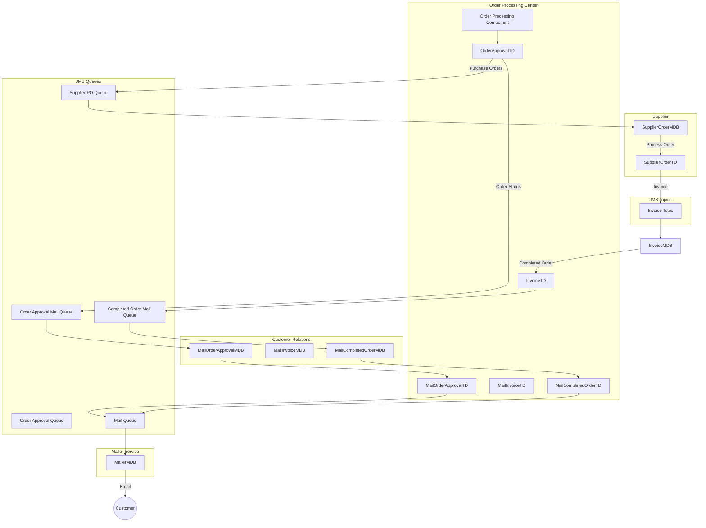
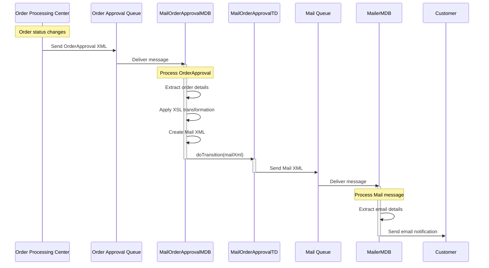
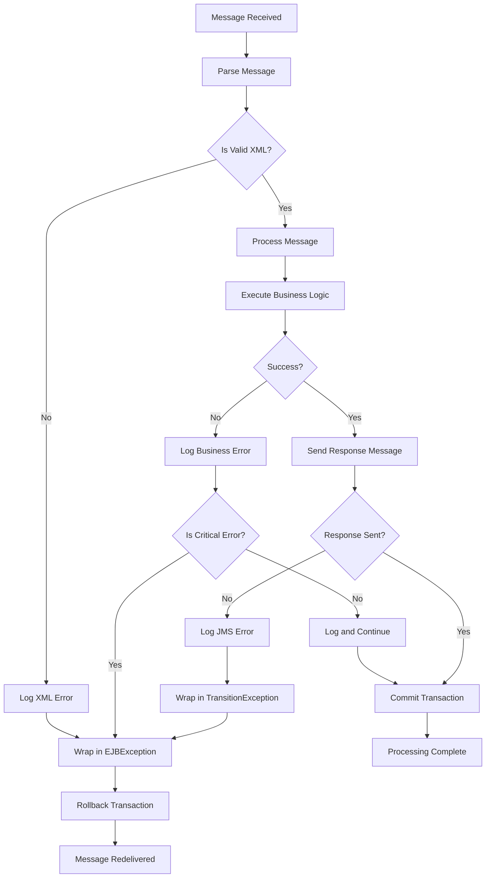

# Message Queue Management in Java Pet Store 1.3.2

## Introduction to Message Queue Management in Java Pet Store

Java Pet Store 1.3.2 implements a sophisticated asynchronous messaging architecture using Java Message Service (JMS) to decouple components and enable reliable communication between distributed system parts. This approach allows the application to handle high-volume operations like order processing, inventory management, and customer notifications without requiring synchronous communication between components.

The messaging infrastructure serves as the backbone for the application's event-driven architecture, enabling loosely coupled components to communicate effectively while maintaining system resilience. By leveraging JMS, Java Pet Store achieves several critical architectural goals:

1. **Component Decoupling**: The Order Processing Center (OPC), Supplier, and Customer Relations components operate independently, communicating only through well-defined message formats.
2. **Asynchronous Processing**: Time-consuming operations like order fulfillment and email notifications occur asynchronously, improving system responsiveness.
3. **Reliable Communication**: JMS provides guaranteed message delivery, ensuring critical business events aren't lost even during system failures.
4. **Scalability**: Components can be scaled independently based on processing requirements without affecting other parts of the system.

The implementation uses both point-to-point messaging (queues) and publish-subscribe messaging (topics) patterns to address different communication scenarios, with a sophisticated framework of message-driven beans, transition delegates, and service locators managing the messaging infrastructure.

## Message-Driven Bean Architecture

Java Pet Store 1.3.2 employs Message-Driven Beans (MDBs) as the primary mechanism for processing asynchronous messages. MDBs function as JMS message consumers that automatically execute business logic when messages arrive in their associated queues or topics.

The MDB architecture in Java Pet Store follows a consistent pattern across different components:

1. **Lifecycle Management**: Each MDB implements the `MessageDrivenBean` and `MessageListener` interfaces, providing methods like `ejbCreate()`, `setMessageDrivenContext()`, and `ejbRemove()` to manage the bean's lifecycle within the container.

2. **Resource Initialization**: During `ejbCreate()`, MDBs use the `ServiceLocator` pattern to obtain references to required resources such as EJB homes, JMS destinations, and configuration parameters. This initialization happens once per bean instance, optimizing resource usage.

3. **Message Processing**: The `onMessage(Message)` method serves as the entry point for message processing, extracting the message content (typically XML) and delegating to business logic methods.

4. **Transaction Management**: MDBs leverage container-managed transactions, with transaction attributes defined in deployment descriptors. Most MDBs use the `Required` transaction attribute to ensure atomic processing of messages.

5. **Exception Handling**: Exceptions are typically wrapped in `EJBException` to maintain the EJB contract while preserving the original error information for debugging.

A key architectural pattern evident in the MDB implementation is the separation of concerns:
- Message reception and extraction in `onMessage()`
- Business logic processing in `doWork()` methods
- Workflow progression in `doTransition()` methods

This separation allows for clean, maintainable code while facilitating unit testing of the business logic independent of the messaging infrastructure.

## Message Queue Flow Architecture



The message flow architecture in Java Pet Store demonstrates a sophisticated event-driven system where order processing events trigger cascading message flows through various components. When an order is placed, it flows through the Order Processing Center, which sends purchase orders to suppliers and notifications to customers. Suppliers process orders and publish invoices to a topic, which are consumed by the Invoice MDB. As orders are completed, notifications flow through dedicated queues to the Customer Relations component, which formats and sends emails through the Mailer Service.

This architecture enables parallel processing of different aspects of order fulfillment while maintaining loose coupling between components. The use of both queues and topics allows for appropriate message distribution patterns based on the specific communication needs.

## Queue vs Topic Implementation

Java Pet Store 1.3.2 strategically employs both point-to-point messaging (queues) and publish-subscribe messaging (topics) to address different communication scenarios within the application.

### Point-to-Point Messaging (Queues)

Queues are predominantly used for guaranteed delivery of messages to a single consumer. This pattern ensures that each message is processed exactly once by a single component, making it ideal for task distribution and workflow progression. In Java Pet Store, queues are implemented in several key areas:

1. **Order Processing Workflow**: Queues like `OrderApprovalQueue` and `PurchaseOrderQueue` ensure that each order is processed exactly once by the appropriate component.

2. **Email Notification Requests**: Queues such as `OrderApprovalMailQueue`, `CompletedOrderMailQueue`, and `MailQueue` guarantee that each notification request is delivered to exactly one email processing component.

The implementation of queue-based messaging is evident in classes like `QueueHelper`, which encapsulates the JMS operations for sending messages to queues:

```java
public void sendMessage(String xmlMessage) throws JMSException {
  QueueConnection qConnect = null;
  QueueSession session = null;
  QueueSender qSender = null;

  try {
    qConnect = qFactory.createQueueConnection();
    session = qConnect.createQueueSession(true, 0);
    qSender = session.createSender(q);
    TextMessage jmsMsg = session.createTextMessage();
    jmsMsg.setText(xmlMessage);
    qSender.send(jmsMsg);
  } finally {
    try {
      if(qConnect != null) {
        qConnect.close();
      }
    } catch(Exception e) {
      System.err.println("OPC.QueueHelper GOT EXCEPTION closing connection" + e);
    }
  }
}
```

### Publish-Subscribe Messaging (Topics)

Topics are used when a message needs to be broadcast to multiple consumers. This pattern allows multiple components to receive and process the same message independently. In Java Pet Store, topics are used primarily for:

1. **Invoice Distribution**: The `InvoiceTopic` allows multiple components to receive invoice information simultaneously, enabling parallel processing of invoice-related tasks.

The implementation of topic-based messaging is handled by the `TopicSender` class:

```java
public void sendMessage(String xmlMessage) throws JMSException {
  TopicConnection topicConnect  = null;
  TopicSession pubSession       = null;
  TopicPublisher topicPublisher = null;

  try {
    topicConnect = topicFactory.createTopicConnection();
    pubSession = topicConnect.createTopicSession(false, Session.AUTO_ACKNOWLEDGE);
    topicPublisher = pubSession.createPublisher(topic);
    TextMessage jmsMsg = pubSession.createTextMessage();
    jmsMsg.setText(xmlMessage);
    topicPublisher.publish(jmsMsg);
  } finally {
    if( topicConnect != null )
      topicConnect.close();
  }
}
```

The strategic choice between queues and topics reflects a deep understanding of the different communication patterns required by the application. Queues provide reliable, ordered processing of messages by a single consumer, while topics enable event broadcasting to multiple interested parties. This hybrid approach allows Java Pet Store to achieve both reliable workflow progression and efficient event notification.

## TransitionDelegate Pattern

The TransitionDelegate pattern is a core architectural element in Java Pet Store's messaging infrastructure, providing an abstraction layer for message sending operations and enabling flexible workflow management. This pattern decouples the business logic of state transitions from the mechanics of message delivery, allowing for greater flexibility and maintainability.

At its core, the TransitionDelegate pattern consists of:

1. **TransitionDelegate Interface**: Defines a contract with `setup()` and `doTransition()` methods that all transition delegates must implement.

2. **TransitionInfo Class**: Encapsulates the data needed for a transition, including XML messages and message batches.

3. **Concrete TransitionDelegate Implementations**: Classes like `MailOrderApprovalTransitionDelegate`, `InvoiceTD`, and `SupplierOrderTD` that implement the interface for specific transition scenarios.

The pattern is particularly valuable in the context of order processing, where different types of transitions (order approval, invoice generation, email notification) require different message destinations and formats. By abstracting these details behind the TransitionDelegate interface, the core business logic can focus on determining when transitions should occur rather than how they are implemented.

A key benefit of this pattern is its extensibility. New transition types can be added by creating new TransitionDelegate implementations without modifying existing code. Additionally, the pattern supports both synchronous and asynchronous transitions, allowing for flexible workflow design.

The TransitionDelegate pattern also facilitates testing by allowing mock implementations to be substituted during unit tests, isolating the business logic from the messaging infrastructure.

## TransitionDelegate Class Hierarchy

```mermaid
classDiagram
    class TransitionDelegate {
        <<interface>>
        +setup() throws TransitionException
        +doTransition(TransitionInfo) throws TransitionException
    }
    
    class TransitionInfo {
        -String xmlMessage
        -Collection xmlMessageBatch
        +getXMLMessage() String
        +getXMLMessageBatch() Collection
    }
    
    class QueueHelper {
        -Queue q
        -QueueConnectionFactory qFactory
        +QueueHelper(QueueConnectionFactory, Queue)
        +sendMessage(String) throws JMSException
    }
    
    class TopicSender {
        -TopicConnectionFactory topicFactory
        -Topic topic
        +TopicSender(TopicConnectionFactory, Topic)
        +sendMessage(String) throws JMSException
    }
    
    class MailOrderApprovalTransitionDelegate {
        -QueueHelper mailHelper
        -Queue q
        -QueueConnectionFactory qFactory
        +setup() throws TransitionException
        +doTransition(TransitionInfo) throws TransitionException
    }
    
    class MailInvoiceTransitionDelegate {
        -QueueHelper mailHelper
        -Queue q
        -QueueConnectionFactory qFactory
        +setup() throws TransitionException
        +doTransition(TransitionInfo) throws TransitionException
    }
    
    class MailCompletedOrderTD {
        -QueueHelper mailHelper
        -Queue q
        -QueueConnectionFactory qFactory
        +setup() throws TransitionException
        +doTransition(TransitionInfo) throws TransitionException
    }
    
    class InvoiceTD {
        -Queue q
        -QueueConnectionFactory qFactory
        -QueueHelper queueHelper
        +setup() throws TransitionException
        +doTransition(TransitionInfo) throws TransitionException
    }
    
    class OrderApprovalTD {
        -QueueConnectionFactory qFactory
        -Queue mailQueue
        -Queue supplierPoQueue
        -QueueHelper supplierQueueHelper
        -QueueHelper mailQueueHelper
        +setup() throws TransitionException
        +doTransition(TransitionInfo) throws TransitionException
        -sendMail(String) throws JMSException
    }
    
    class PurchaseOrderTD {
        -Queue q
        -QueueConnectionFactory qFactory
        -QueueHelper queueHelper
        +setup() throws TransitionException
        +doTransition(TransitionInfo) throws TransitionException
    }
    
    class SupplierOrderTD {
        -TopicConnectionFactory topicFactory
        -Topic topic
        -TopicSender invoiceTopicSender
        +setup() throws TransitionException
        +doTransition(TransitionInfo) throws TransitionException
    }
    
    TransitionDelegate <|.. MailOrderApprovalTransitionDelegate
    TransitionDelegate <|.. MailInvoiceTransitionDelegate
    TransitionDelegate <|.. MailCompletedOrderTD
    TransitionDelegate <|.. InvoiceTD
    TransitionDelegate <|.. OrderApprovalTD
    TransitionDelegate <|.. PurchaseOrderTD
    TransitionDelegate <|.. SupplierOrderTD
    
    MailOrderApprovalTransitionDelegate --> QueueHelper
    MailInvoiceTransitionDelegate --> QueueHelper
    MailCompletedOrderTD --> QueueHelper
    InvoiceTD --> QueueHelper
    OrderApprovalTD --> QueueHelper
    PurchaseOrderTD --> QueueHelper
    SupplierOrderTD --> TopicSender
```



The TransitionDelegate class hierarchy illustrates the implementation of the Strategy pattern for message sending operations in Java Pet Store. The `TransitionDelegate` interface defines the contract that all concrete delegates must implement, while the `TransitionInfo` class encapsulates the data needed for transitions.

Most transition delegates use the `QueueHelper` class to send messages to JMS queues, while the `SupplierOrderTD` uses the `TopicSender` for publishing messages to topics. This distinction reflects the different communication patterns required by different parts of the application.

The concrete implementations are specialized for specific transition scenarios:
- Email notification transitions (`MailOrderApprovalTransitionDelegate`, `MailInvoiceTransitionDelegate`, `MailCompletedOrderTD`)
- Order processing transitions (`InvoiceTD`, `OrderApprovalTD`, `PurchaseOrderTD`)
- Supplier communication (`SupplierOrderTD`)

Each implementation encapsulates the specific knowledge of which JMS destinations to use and how to format messages for those destinations, allowing the business logic to remain focused on when transitions should occur rather than how they are implemented.

## Resource Management and Connection Handling

Java Pet Store 1.3.2 implements a robust approach to JMS resource management and connection handling, ensuring efficient use of system resources and proper cleanup to prevent resource leaks. The application follows several best practices in this area:

### Connection Lifecycle Management

JMS connections are expensive resources that should be created, used, and closed in a controlled manner. Java Pet Store consistently follows a pattern of:

1. **Late Creation**: Connections are created only when needed, immediately before sending a message.
2. **Prompt Closure**: Connections are closed as soon as the messaging operation is complete.
3. **Exception Safety**: Try-finally blocks ensure connections are closed even if exceptions occur.

This pattern is evident in both the `QueueHelper` and `TopicSender` classes:

```java
public void sendMessage(String xmlMessage) throws JMSException {
  QueueConnection qConnect = null;
  QueueSession session = null;
  QueueSender qSender = null;

  try {
    qConnect = qFactory.createQueueConnection();
    session = qConnect.createQueueSession(true, 0);
    qSender = session.createSender(q);
    TextMessage jmsMsg = session.createTextMessage();
    jmsMsg.setText(xmlMessage);
    qSender.send(jmsMsg);
  } finally {
    try {
      if(qConnect != null) {
        qConnect.close();
      }
    } catch(Exception e) {
      System.err.println("OPC.QueueHelper GOT EXCEPTION closing connection" + e);
    }
  }
}
```

### Session Configuration

JMS sessions are configured with appropriate transaction and acknowledgment modes based on the specific requirements of each messaging scenario:

1. **Transactional Sessions**: Most queue operations use transactional sessions (`createQueueSession(true, 0)`) to ensure atomic message delivery.
2. **Auto-Acknowledge Sessions**: Topic operations typically use non-transactional sessions with auto-acknowledgment (`createTopicSession(false, Session.AUTO_ACKNOWLEDGE)`).

### Factory and Destination Reuse

While connections are created and closed for each message, the application reuses connection factories and destinations, which are obtained once during initialization:

```java
public void setup() throws TransitionException {
  try {
    ServiceLocator serviceLocator = new ServiceLocator();
    qFactory = serviceLocator.getQueueConnectionFactory(JNDINames.QUEUE_CONNECTION_FACTORY);
    q = serviceLocator.getQueue(JNDINames.ORDER_APPROVAL_MDB_QUEUE);
    queueHelper = new QueueHelper(qFactory, q);
  } catch(ServiceLocatorException se) {
    throw new TransitionException(se);
  }
}
```

### Error Handling

The application implements comprehensive error handling for JMS operations:

1. **JMSException Wrapping**: JMS exceptions are wrapped in application-specific exceptions like `TransitionException` to maintain the application's exception hierarchy.
2. **Silent Cleanup**: Exceptions during connection closure are logged but not propagated, ensuring that cleanup errors don't mask the original exception.
3. **Resource Nullity Checks**: Resources are checked for null before operations are attempted, preventing NullPointerExceptions.

This disciplined approach to resource management ensures that the messaging infrastructure operates efficiently and reliably, even under high load or error conditions.

## Service Locator Integration

Java Pet Store 1.3.2 employs the Service Locator pattern extensively to obtain JMS resources, reducing direct JNDI lookup code and promoting loose coupling between components. This pattern centralizes the complexity of resource lookup and caching, providing a clean, consistent interface for accessing JMS connection factories, queues, and topics.

### Service Locator Implementation

The `ServiceLocator` class serves as a facade for JNDI lookups, offering methods for retrieving various types of resources:

```java
// Obtaining a queue connection factory
qFactory = serviceLocator.getQueueConnectionFactory(JNDINames.QUEUE_CONNECTION_FACTORY);

// Obtaining a queue
q = serviceLocator.getQueue(JNDINames.MAIL_SENDER_QUEUE);

// Obtaining a topic connection factory
topicFactory = servicelocator.getTopicConnectionFactory(JNDINames.TOPIC_CONNECTION_FACTORY);

// Obtaining a topic
topic = servicelocator.getTopic(JNDINames.INVOICE_MDB_TOPIC);
```

### Benefits in JMS Resource Management

The integration of Service Locator with JMS resource management provides several key benefits:

1. **Reduced Boilerplate Code**: Components don't need to include repetitive JNDI lookup code, making them more concise and focused on business logic.

2. **Centralized Error Handling**: JNDI lookup exceptions are handled consistently by the ServiceLocator, which wraps them in ServiceLocatorException.

3. **Resource Caching**: The ServiceLocator can cache resources, reducing the overhead of repeated lookups.

4. **Abstraction of JNDI Details**: Components are shielded from the specifics of JNDI names and lookup mechanics, which are encapsulated in the ServiceLocator.

5. **Testability**: Components can be tested with mock ServiceLocator implementations that provide test doubles instead of actual JMS resources.

### Integration with TransitionDelegate Pattern

The Service Locator pattern integrates seamlessly with the TransitionDelegate pattern, with most TransitionDelegate implementations using ServiceLocator in their setup() methods:

```java
public void setup() throws TransitionException {
  try {
    ServiceLocator serviceLocator = new ServiceLocator();
    qFactory = serviceLocator.getQueueConnectionFactory(JNDINames.QUEUE_CONNECTION_FACTORY);
    q = serviceLocator.getQueue(JNDINames.MAIL_SENDER_QUEUE);
    mailHelper = new QueueHelper(qFactory, q);
  } catch (ServiceLocatorException se) {
    throw new TransitionException(se);
  }
}
```

### Configuration Management

Beyond JMS resources, the ServiceLocator also provides access to configuration parameters, allowing components to adapt their behavior based on deployment settings:

```java
sendConfirmationMail = serviceLocator.getBoolean(JNDINames.SEND_CONFIRMATION_MAIL);
entityCatalogURL = serviceLocator.getUrl(JNDINames.XML_ENTITY_CATALOG_URL);
validateXmlInvoice = serviceLocator.getBoolean(JNDINames.XML_VALIDATION_INVOICE);
```

This integration of Service Locator with JMS resource management exemplifies the application's commitment to clean, maintainable code through the use of established design patterns.

## Email Notification Workflow



The email notification workflow in Java Pet Store demonstrates how the system uses message queues to decouple the order processing logic from customer communication. When an order status changes in the Order Processing Center, it triggers a sequence of asynchronous messages that ultimately result in an email notification to the customer.

The workflow begins when the Order Processing Center sends an OrderApproval XML document to the Order Approval Queue. This document contains information about one or more orders and their current status. The MailOrderApprovalMDB consumes this message and processes it by:

1. Extracting the order details from the XML document
2. Retrieving additional information about the order from the PurchaseOrder EJB
3. Applying an XSL transformation to convert the order data into HTML email content
4. Creating a Mail XML document containing the recipient address, subject, and formatted content
5. Calling the MailOrderApprovalTransitionDelegate to forward the mail message

The transition delegate sends the Mail XML to the Mail Queue, which is monitored by the MailerMDB. When the message arrives, the MailerMDB:

1. Extracts the email details (recipient, subject, content) from the XML
2. Uses the JavaMail API to send the email to the customer

This workflow demonstrates several key architectural principles:
- **Separation of concerns**: Order processing logic is separate from notification logic
- **Asynchronous processing**: Email sending doesn't block order processing
- **Transformation pipeline**: Data flows through multiple transformations (order data → XML → HTML)
- **Loose coupling**: Components communicate only through well-defined message formats

The same pattern is used for other types of notifications, such as invoice emails and completed order notifications, with different MDBs and transition delegates handling the specific requirements of each notification type.

## XML Message Transformation

Java Pet Store 1.3.2 employs XML as the primary payload format for messages exchanged between components, with XSL transformations converting data between different representations. This approach provides a flexible, standards-based mechanism for data exchange that decouples components and enables rich formatting of customer communications.

### XML as Message Format

XML documents serve as the lingua franca for inter-component communication in Java Pet Store. Each message type has a corresponding XML schema that defines its structure:

1. **OrderApproval**: Contains information about order status changes
2. **Invoice**: Details items shipped, quantities, and prices
3. **Mail**: Specifies recipient, subject, and content for email messages

These XML documents are serialized to strings for transmission via JMS:

```java
Mail mailMsg = new Mail(emailAddress, subject, message);
String xmlMail = mailMsg.toXML();
```

And deserialized upon receipt:

```java
TextMessage textMessage = (TextMessage)recvMsg;
String xmlMailMessage = textMessage.getText();
Mail recMail = Mail.fromXML(xmlMailMessage);
```

### XSL Transformation for Email Content

A key use of XML transformation is in generating formatted email content for customer notifications. The application uses XSL stylesheets to transform order data into HTML email content:

```java
private static final String ORDER_APPROVAL_STYLE_SHEET =
            "/com/sun/j2ee/blueprints/opc/rsrc/xsl/OrderApproval.xsl";
```

The transformation process is encapsulated in the `MailContentXDE` class, which applies the appropriate stylesheet to the XML document:

```java
mailContentXDE.setDocument(new DOMSource(co.toDOM()));
mailContentXDE.setLocale(LocaleUtil.getLocaleFromString(po.getPoLocale()));
String message = mailContentXDE.getDocumentAsString();
```

This approach offers several advantages:

1. **Separation of Content and Presentation**: The order data structure is separate from its presentation format, allowing each to evolve independently.

2. **Internationalization Support**: Different XSL stylesheets can be used for different locales, enabling localized email content.

3. **Reusable Transformation Logic**: The same transformation mechanism is used across different notification types, promoting code reuse.

4. **Declarative Formatting**: Email formatting is defined declaratively in XSL rather than programmatically in Java, making it easier to modify without code changes.

### XML Document Exchange (XDE) Pattern

The application employs an XML Document Exchange (XDE) pattern, with specialized classes for handling different types of XML documents:

```java
invoiceXDE = new TPAInvoiceXDE(entityCatalogURL, validateXmlInvoice,
                        serviceLocator.getBoolean(JNDINames.XML_XSD_VALIDATION));
```

These XDE classes provide methods for validating, transforming, and extracting data from XML documents, encapsulating the complexity of XML processing and providing a clean interface for business components.

The XML message transformation approach in Java Pet Store demonstrates a sophisticated understanding of XML technologies and their application in enterprise systems, providing a flexible, maintainable mechanism for data exchange between loosely coupled components.

## Transaction Management in Messaging

Java Pet Store 1.3.2 implements a comprehensive transaction management strategy for its messaging layer to ensure message delivery reliability and data consistency. The application leverages container-managed transactions (CMT) for Message-Driven Beans while implementing custom transaction handling for message senders.

### Container-Managed Transactions for MDBs

Message-Driven Beans in Java Pet Store use container-managed transactions, with transaction attributes specified in deployment descriptors:

```xml
<container-transaction>
  <method>
    <ejb-name>MailerMDB</ejb-name>
    <method-name>onMessage</method-name>
    <method-params>
      <method-param>javax.jms.Message</method-param>
    </method-params>
  </method>
  <trans-attribute>Required</trans-attribute>
</container-transaction>
```

The `Required` transaction attribute ensures that message processing occurs within a transaction, either joining an existing transaction or starting a new one. This guarantees that:

1. Message consumption is atomic with message processing
2. Database updates made during message processing are part of the same transaction
3. If processing fails, the message is not acknowledged and will be redelivered

### Transactional Sessions for Message Senders

When sending messages, Java Pet Store explicitly creates transactional JMS sessions:

```java
qConnect = qFactory.createQueueConnection();
session = qConnect.createQueueSession(true, 0);
```

The first parameter (`true`) indicates that the session should be transactional, while the second parameter (`0`) is ignored for transactional sessions. This ensures that message sending operations are atomic, with all messages in a batch either committed or rolled back together.

### Transaction Boundaries

The application carefully manages transaction boundaries to balance reliability with performance:

1. **Message Reception**: Each MDB's `onMessage()` method represents a transaction boundary, with the container managing the transaction.

2. **Message Sending**: Each call to `sendMessage()` in `QueueHelper` or `TopicSender` represents a separate transaction, ensuring that sending failures don't affect the processing transaction.

3. **Batch Processing**: When processing collections of messages, such as in `OrderApprovalTD`, each message is sent in its own transaction to prevent a single failure from affecting the entire batch.

### Error Handling and Recovery

The transaction management strategy includes robust error handling:

1. **Exception Propagation**: Exceptions during message processing are typically wrapped in `EJBException` and propagated, causing the transaction to roll back and the message to be redelivered.

2. **Silent Failures**: In some cases, like email sending, exceptions are caught and logged but not propagated, allowing the transaction to commit even if a non-critical operation fails.

3. **Resource Cleanup**: Resources are properly closed in finally blocks, ensuring they're released regardless of transaction outcome.

This sophisticated transaction management approach ensures that the messaging layer maintains data consistency even in the face of system failures, network issues, or processing errors, contributing to the overall reliability of the Java Pet Store application.

## Message Processing Exception Handling



Java Pet Store implements a sophisticated exception handling strategy for message processing to maintain system reliability while providing useful diagnostic information. The flowchart illustrates how different types of exceptions are handled during the message processing lifecycle.

When a message is received, the system first attempts to parse it as XML. If parsing fails due to malformed XML or schema validation errors, the exception is logged and wrapped in an EJBException, causing the transaction to roll back and the message to be redelivered. This approach ensures that temporary system issues don't result in message loss.

During business logic execution, different types of errors are handled according to their severity:

1. **Critical Errors**: Exceptions that indicate fundamental problems (like database access failures) are wrapped in EJBException, causing transaction rollback and message redelivery.

2. **Non-Critical Errors**: Some exceptions, particularly those related to external systems like mail servers, are caught, logged, and suppressed to prevent them from blocking the entire workflow. For example, in MailerMDB:

```java
try {
  // Mail sending logic
} catch (MailerAppException me) {
  // Ignore since user probably forgot to set up mail server
}
```

When sending response messages, JMS exceptions are wrapped in TransitionException and then in EJBException, providing a clear exception hierarchy that preserves the original error information:

```java
try {
  queueHelper.sendMessage(xmlPO);
} catch(JMSException je) {
  throw new TransitionException(je);
}
```

This exception handling strategy balances several important concerns:

1. **Reliability**: Critical errors cause message redelivery, preventing data loss
2. **Resilience**: Non-critical errors are handled gracefully, allowing the system to continue functioning
3. **Diagnostics**: Original exceptions are preserved in the exception chain, aiding troubleshooting
4. **Separation of Concerns**: Each layer wraps exceptions in its own exception types, maintaining clean interfaces

The result is a robust messaging system that can recover from many types of failures while providing clear information about what went wrong when recovery isn't possible.

[Generated by the Sage AI expert workbench: 2025-03-29 21:37:00  https://sage-tech.ai/workbench]: #