# Model Component Framework in Java Pet Store 1.3.2

## Introduction to the Model Component Framework

The Model Component Framework in Java Pet Store 1.3.2 provides a standardized approach for representing and transferring data between application tiers in this J2EE reference implementation. This framework establishes a consistent pattern for creating model objects that encapsulate business data, enabling seamless communication between the presentation layer, business logic layer, and data access layer. By implementing a uniform model component architecture, the Pet Store application achieves clear separation of concerns, improves maintainability, and facilitates the transfer of data across distributed components. The framework emphasizes serializable objects with well-defined properties and accessor methods, allowing these components to be marshalled across network boundaries and between JVM instances while maintaining data integrity and providing a consistent programming model throughout the application.

## Core Characteristics of Model Components

Analysis of the Java Pet Store model components reveals several consistent design patterns and characteristics that define the framework. First, all model components implement the `java.io.Serializable` interface, enabling them to be converted to byte streams for network transmission between distributed components and for persistence. Second, they strictly adhere to JavaBean patterns, providing private fields with public getter methods and often including no-argument constructors specifically designed for web tier usage. The components generally follow immutable object patterns, with properties initialized through constructors and accessed through getter methods without corresponding setters, promoting thread safety and preventing unintended state changes. Additionally, the model components implement standardized accessor methods with consistent naming conventions (get/is prefixes), enabling reflection-based access by frameworks. The components also include proper `toString()` implementations for debugging and logging purposes. This consistent approach creates a cohesive framework where components can be reliably used across application tiers with predictable behavior.

## Model Component Class Hierarchy

```mermaid
classDiagram
    class Serializable {
        <<interface>>
    }
    
    class ModelComponent {
        <<abstract>>
        +getters()
        +toString()
    }
    
    class Category {
        -String id
        -String name
        -String description
        +Category()
        +Category(id, name, description)
        +getId() String
        +getName() String
        +getDescription() String
        +toString() String
    }
    
    class Product {
        -String id
        -String name
        -String description
        +Product()
        +Product(id, name, description)
        +getId() String
        +getName() String
        +getDescription() String
        +toString() String
    }
    
    class Item {
        -String category
        -String productId
        -String productName
        -String itemId
        -String description
        -String attribute1-5
        -double listPrice
        -double unitCost
        -String imageLocation
        +Item(category, productId, productName, itemId, imageLocation, description, attribute1-5, listPrice, unitCost)
        +getCategory() String
        +getProductId() String
        +getProductName() String
        +getAttribute() String
        +getAttribute(index) String
        +getDescription() String
        +getItemId() String
        +getUnitCost() double
        +getListCost() double
        +getImageLocation() String
    }
    
    class Page {
        -List objects
        -int start
        -boolean hasNext
        +Page(List, start, hasNext)
        +getList() List
        +isNextPageAvailable() boolean
        +isPreviousPageAvailable() boolean
        +getStartOfNextPage() int
        +getStartOfPreviousPage() int
        +getSize() int
    }
    
    class ShoppingCartModel {
        -Collection items
        +ShoppingCartModel()
        +ShoppingCartModel(items)
        +getSize() int
        +getCart() Collection
        +getItems() Iterator
        +getTotalCost() double
        +copy(ShoppingCartModel) void
    }
    
    class CartItem {
        -String itemId
        -String productId
        -String category
        -String name
        -String attribute
        -int quantity
        -double unitCost
        +CartItem(itemId, productId, category, name, attribute, quantity, unitCost)
        +getCategory() String
        +getItemId() String
        +getProductId() String
        +getName() String
        +getAttribute() String
        +getQuantity() int
        +getUnitCost() double
        +getTotalCost() double
    }
    
    class ProfileInfo {
        -String defaultPreferredLanguage
        -String defaultFavoriteCategory
        -boolean defaultMyListPreference
        -boolean defaultBannerPreference
        +ProfileInfo(defaultPreferredLanguage, defaultFavoriteCategory, defaultMyListPreference, defaultBannerPreference)
        +getPreferredLanguage() String
        +getFavoriteCategory() String
        +getBannerPreference() boolean
        +getMyListPreference() boolean
        +toString() String
    }
    
    class OrderDetails {
        -String orderId
        -String userId
        -String orderDate
        -float orderValue
        -String orderStatus
        +OrderDetails(orderId, userId, orderDate, orderValue, orderStatus)
        +getOrderId() String
        +getUserId() String
        +getOrderDate() String
        +getOrderValue() float
        +getOrderStatus() String
    }
    
    Serializable <|-- ModelComponent
    ModelComponent <|-- Category
    ModelComponent <|-- Product
    ModelComponent <|-- Item
    ModelComponent <|-- Page
    ModelComponent <|-- ShoppingCartModel
    ModelComponent <|-- CartItem
    ModelComponent <|-- ProfileInfo
    ModelComponent <|-- OrderDetails
```

The diagram illustrates the model component class hierarchy in Java Pet Store 1.3.2. All model components implement the Serializable interface, enabling them to be transferred between application tiers. The abstract ModelComponent represents the common characteristics shared by all concrete model classes. The hierarchy shows the primary entity models (Category, Product, Item) that form the catalog structure, utility models like Page for pagination, and data transfer objects like ProfileInfo and OrderDetails. The ShoppingCartModel and CartItem classes demonstrate composition relationships where the cart contains multiple items. This structure demonstrates how the framework provides a consistent approach to modeling business data while allowing specialization for different domain concepts.

## Entity Model Components

The Java Pet Store application's core entity model components form a hierarchical structure that represents the catalog's fundamental data organization. At the top level, the `Category` class represents broad classifications of pets (such as birds, cats, dogs) with simple properties including an ID, name, and description. Each category contains multiple `Product` instances, which represent specific types of pets within a category (e.g., "Amazon Parrot" within the "Birds" category). Products share a similar structure to categories, with ID, name, and description properties. At the most granular level, the `Item` class represents specific inventory items within a product category, containing detailed information including references to its parent category and product, item-specific attributes, pricing information (listPrice, unitCost), and image location. This three-tier hierarchy (Category → Product → Item) forms the backbone of the catalog's data structure, with each component implementing the Serializable interface to enable transfer between application tiers. All entity models follow consistent patterns with immutable properties, getter methods, and optional no-argument constructors for web tier usage. The Item class is notably more complex than the others, with thirteen properties and specialized accessor methods like `getAttribute(int index)` that provide indexed access to multiple attributes.

## Entity Relationship Diagram

This entity relationship diagram illustrates the hierarchical structure of the product catalog in the Java Pet Store application. At the top level, the CATEGORY entity represents the broadest classification of pets (like birds, cats, dogs), identified by a unique ID and containing descriptive information. Each category can contain multiple products, shown by the one-to-many relationship between CATEGORY and PRODUCT. The PRODUCT entity represents specific types of pets within a category (such as "Amazon Parrot" within "Birds"), also with unique identification and descriptive attributes. At the most granular level, the ITEM entity represents specific inventory items available for purchase, with foreign key relationships to both its parent category and product. Items contain detailed information including pricing, multiple attributes for variant characteristics, and image references. This three-tier hierarchy enables efficient browsing and searching of the catalog, with increasingly specific information available as users navigate from categories to products to individual items. The relationships form a classic hierarchical data model that supports the e-commerce functionality of the application.

## Utility Model Components

The Java Pet Store application includes several utility model components that provide supporting functionality for data presentation, pagination, and organization. The most prominent example is the `Page` class, which implements a sophisticated pagination mechanism for browsing catalog results. This component encapsulates a collection of objects along with metadata about the current page position and navigation capabilities. The Page class stores a list of objects representing the current page's content, the starting index within the overall result set, and a boolean flag indicating whether more pages exist. It provides methods to check if next or previous pages are available (`isNextPageAvailable()`, `isPreviousPageAvailable()`), retrieve the starting indices of adjacent pages (`getStartOfNextPage()`, `getStartOfPreviousPage()`), and get the current page size (`getSize()`). The class includes an `EMPTY_PAGE` constant representing a page with no results, useful for error conditions or empty searches. Interestingly, the Page class contains commented code showing its evolution from a size-based pagination approach to a simpler boolean flag approach for determining if more pages exist, demonstrating the framework's refinement over time. This utility component abstracts pagination complexity from the rest of the application, providing a clean interface for navigating large result sets across the application's user interface.

## State Representation with Constants

The Java Pet Store application employs a standardized approach to state representation through the use of constant definitions in dedicated classes like `OrderStatusNames`. These classes serve as centralized repositories for status values, ensuring consistent state tracking across components. In the supplier purchase order subsystem, the `OrderStatusNames` class defines four key states: `PENDING` (for orders placed but not yet approved), `APPROVED` (for orders that have been approved), `DENIED` (for rejected orders), and `COMPLETED` (for fulfilled orders). Similarly, in the process manager component, an expanded set of states includes `SHIPPED_PART` to represent partially fulfilled orders. The class documentation explicitly defines the typical order lifecycle: orders start as pending, then either move to approved and eventually completed, or are denied. This approach provides several benefits: it eliminates magic strings throughout the codebase, centralizes state definitions for easier maintenance, documents valid state transitions, and ensures consistent terminology across application tiers. By using these constant definitions, the application maintains data integrity when transferring order status information between components and provides clear semantics for the business process flow.

## Order Status State Transitions

The diagram illustrates the possible state transitions for orders in the Java Pet Store system, as defined by the OrderStatusNames classes in both the supplier purchase order and process manager components. All orders begin in the PENDING state when initially placed in the system. From there, an order can transition to either APPROVED (when accepted by an administrator) or DENIED (when rejected). If approved, an order can either move directly to COMPLETED (when all items are shipped at once) or to an intermediate SHIPPED_PART state (when only some items have been shipped). Orders in the SHIPPED_PART state eventually transition to COMPLETED when all remaining items are shipped. Both DENIED and COMPLETED are terminal states, representing the end of the order lifecycle. This state machine enforces business rules about valid order progressions and prevents invalid transitions (such as moving directly from PENDING to COMPLETED or from DENIED back to PENDING). The standardized state names ensure consistent status tracking across different components of the application, from the order processing system to the supplier integration modules.

## Data Transfer Objects

The Java Pet Store application employs a variety of Data Transfer Objects (DTOs) to facilitate efficient data transfer between application tiers. These specialized model components package related data into serializable objects that can be transmitted across network boundaries with minimal overhead. The `ProfileInfo` class exemplifies this pattern by encapsulating customer preferences including preferred language, favorite category, and boolean flags for MyList and banner display preferences. This compact DTO enables the customer profile EJB to efficiently return user preference data to the web tier without exposing implementation details or requiring multiple remote calls. Similarly, the `OrderDetails` class serves as a lightweight representation of order information for the admin client, containing only essential fields like order ID, user ID, order date, monetary value, and status. The `ShoppingCartModel` represents a more complex DTO that contains a collection of `CartItem` objects and provides methods to access aggregated information like total cost. These DTOs follow consistent patterns: they implement Serializable, contain primarily immutable data, provide getter methods but typically no setters, and include appropriate constructors. By using these specialized transfer objects, the application minimizes network traffic between tiers, reduces coupling between components, and provides clear contracts for data exchange that hide implementation details of the underlying business objects.

## Model Component Serialization Flow

The diagram illustrates how model components are serialized and transferred between application tiers in the Java Pet Store architecture. In the EJB tier, entity beans and business logic components create and populate model objects like Category, Product, Item, ProfileInfo, OrderDetails, and ShoppingCartModel. These model components implement the Serializable interface, allowing them to be converted to byte streams. When a web tier component (servlet) makes a request to an EJB, the populated model components are serialized and transferred across the network boundary. On the web tier, these components are deserialized back into Java objects. The servlets then make these model components available to JSP pages, which use data binding to access the component properties and render HTML for the web browser. For the admin client application, model components like OrderDetails are serialized and transferred directly to the client application, which deserializes them for display in the UI. This serialization flow enables the application to maintain a consistent data model across distributed tiers while minimizing network overhead by transferring only the necessary data in compact, well-defined objects. The model components serve as the common currency of data exchange throughout the application architecture.

## Client-Side Model Components

The Java Pet Store admin application extends the model component framework to the client side, implementing specialized model classes that adapt server-side data for presentation in rich client interfaces. The `DataSource` class serves as the central hub for client-side model components, managing several table and chart models that provide structured data representations for UI components. The `OrdersViewTableModel` and `OrdersApproveTableModel` extend `DefaultTableModel` to present order data in tabular format, with the latter adding editing capabilities for order approval workflows. These table models implement data mapping between the raw order objects and the column-based structure required by Swing tables. Similarly, the abstract `ChartModel` class and its concrete implementations (`PieChartModel` and `BarChartModel`) provide data structures optimized for visualization components. These client-side models maintain the core principles of the server-side model component framework: they encapsulate data with well-defined accessor methods, implement change notification through the observer pattern (using `SwingPropertyChangeSupport`), and provide clear separation between data and presentation concerns. The models handle data transformation tasks like date formatting, numeric calculations, and filtering, allowing the UI components to focus solely on visualization. This extension of the model component framework to the client tier demonstrates the architecture's flexibility and its ability to provide consistent patterns across all application layers.

## Design Patterns in the Model Framework

The Model Component Framework in Java Pet Store 1.3.2 employs several established design patterns to create a robust and flexible architecture. The Value Object pattern (also known as Data Transfer Object) is extensively used throughout the framework, with classes like `Category`, `Product`, and `Item` serving as immutable data containers that encapsulate related attributes. These value objects reduce network overhead by batching related data into a single transferable unit. The framework also implements the Data Transfer Object pattern specifically for cross-tier communication, with classes like `ProfileInfo` and `OrderDetails` providing lightweight representations of business entities optimized for network transfer. The Observer pattern is employed for change notification, particularly in client-side models that use `SwingPropertyChangeSupport` to notify UI components of data changes. The Factory Method pattern appears in several components that create and initialize model objects, abstracting the instantiation process. The Template Method pattern is evident in abstract classes like `ChartModel`, which defines the skeleton of operations while allowing subclasses to override specific steps. The Composite pattern is used in the relationship between `ShoppingCartModel` and `CartItem`, where the cart acts as a container for multiple items while providing aggregate operations like total cost calculation. The Immutable Object pattern is consistently applied to model components, making them thread-safe and preventing unintended state changes. Finally, the Facade pattern is employed in classes like `DataSource` that provide a simplified interface to complex subsystems. These design patterns work together to create a cohesive framework that promotes maintainability, flexibility, and clear separation of concerns.

[Generated by the Sage AI expert workbench: 2025-03-29 21:37:00  https://sage-tech.ai/workbench]: #