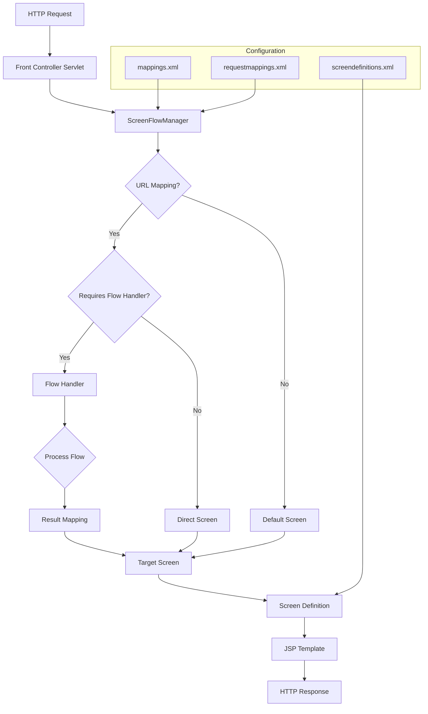
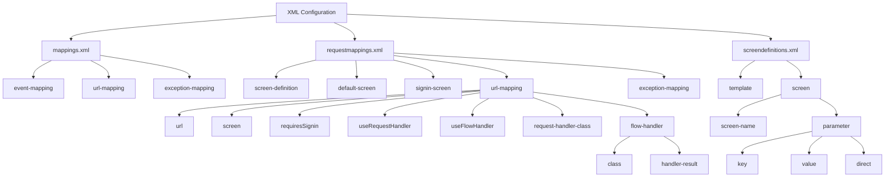
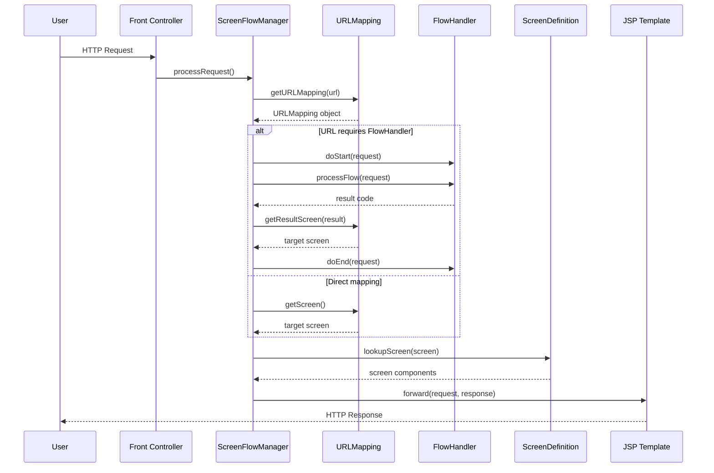
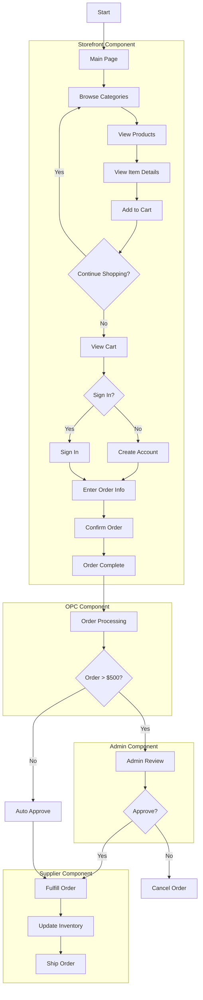

# Screen Flow Navigation in Java Pet Store 1.3.2

## Introduction to Screen Flow Navigation in Java Pet Store

The Java Pet Store 1.3.2 implements a sophisticated screen flow navigation system that serves as the backbone of user interaction across the application. This navigation framework provides a structured approach to managing transitions between different screens, handling user actions, and maintaining application state throughout the user journey. The navigation system is designed to be both declarative and extensible, allowing developers to define navigation paths through XML configuration while also supporting dynamic navigation decisions through Java code.

At its core, the screen flow navigation in Java Pet Store separates the concerns of URL mapping, screen definition, and navigation logic. This separation enables the application to maintain a consistent user experience across its multiple components (Storefront, Admin, Supplier) while allowing each component to implement its own specific navigation requirements. The framework handles both simple screen-to-screen transitions and complex workflows that may involve multiple steps, conditional logic, and error handling.

## Architecture of the Navigation Framework

The Web Application Framework (WAF) component of Java Pet Store implements a controller-based navigation architecture that follows the Front Controller and Command patterns. The navigation framework consists of several key components that work together to process user requests and determine the appropriate screens to display:

1. **ScreenFlowManager**: The central component that orchestrates the navigation process. It loads URL mappings from configuration files, determines which screen to display based on request URLs, and handles navigation flow including exception management.

2. **URLMapping**: Represents a mapping between a URL pattern and its corresponding action, flow handler, and target screen. It stores information about whether a URL represents an action, requires a flow handler, and maintains mappings between action results and target screens.

3. **FlowHandler**: An interface that defines the contract for components that implement navigation logic. Flow handlers can make dynamic decisions about which screen to display next based on application state and user actions.

4. **XML Configuration Files**: The framework uses several XML files (mappings.xml, requestmappings.xml, screendefinitions.xml) to define URL mappings, screen definitions, and navigation paths in a declarative manner.

5. **WebKeys**: A utility class that defines constants used for storing and retrieving navigation-related data across different scopes of the web tier.

The navigation process begins when a user request is received by the front controller servlet, which delegates to the ScreenFlowManager to determine the appropriate screen to display. The ScreenFlowManager consults its URL mappings to find a match for the requested URL, then either forwards directly to the mapped screen or invokes a flow handler to make a dynamic navigation decision.

## Screen Flow Navigation Architecture



The architecture diagram illustrates how a user request flows through the navigation system. When a request arrives, the Front Controller Servlet passes it to the ScreenFlowManager, which consults URL mappings defined in configuration files. If a matching URL is found, the system determines whether a flow handler is required. Flow handlers implement dynamic navigation logic, processing the request and returning a result code that maps to a target screen. The target screen is then resolved to a screen definition, which specifies the JSP template and components to render. Finally, the assembled page is returned as the HTTP response.

This architecture provides several benefits:

1. **Separation of concerns**: Navigation logic is separated from presentation and business logic
2. **Configurability**: Navigation paths can be modified through XML configuration without changing code
3. **Extensibility**: Custom flow handlers can implement complex navigation requirements
4. **Consistency**: A unified approach to navigation across different application components

## Configuration-Based Navigation with XML

Java Pet Store's navigation system relies heavily on XML configuration files to define the relationships between URLs, actions, flow handlers, and screens. This declarative approach allows developers to modify navigation paths without changing Java code, making the application more maintainable and adaptable.

Three primary XML files govern the navigation system:

1. **mappings.xml**: Defines the base URL mappings and event-to-action relationships at the WAF level. This file establishes the foundation of the navigation framework.

2. **requestmappings.xml**: Specifies detailed URL-to-screen mappings, including which URLs require authentication, which flow handlers to use, and how to map flow handler results to target screens.

3. **screendefinitions.xml**: Defines the composition of each screen, including which JSP components to use for different parts of the page (header, body, footer, etc.).

The `requestmappings.xml` file is particularly important for navigation, as it defines the paths users can take through the application. Each URL mapping can specify:

- The target screen to display
- Whether the URL requires user authentication
- Which request handler class to use for processing the request
- Which flow handler class to use for navigation decisions
- Mappings between flow handler results and target screens

For example, the following excerpt from `requestmappings.xml` defines the navigation for the sign-in process:

```xml
<url-mapping url="/verifysignin" screen="SIGN_IN_SUCCESS" useRequestHandler="true" useFlowHandler="true">
    <request-handler-class>com.sun.j2ee.blueprints.petstore.control.web.handlers.SigninHandler</request-handler-class>
    <flow-handler class="com.sun.j2ee.blueprints.petstore.control.web.handlers.SigninFlowHandler">
        <handler-result result="2" screen="SIGN_IN_ERROR"/>
        <handler-result result="1" screen="SIGN_IN_SUCCESS"/>
    </flow-handler> 
</url-mapping>
```

This configuration specifies that when a user submits the sign-in form, the SigninHandler processes the request, and the SigninFlowHandler determines which screen to display next. If the flow handler returns a result of "1" (successful sign-in), the user is directed to the SIGN_IN_SUCCESS screen; if it returns "2" (failed sign-in), the user is directed to the SIGN_IN_ERROR screen.

## XML Configuration Structure



The diagram illustrates the hierarchical structure of the XML configuration files that define the screen flow navigation in Java Pet Store. The three main configuration files work together to create a complete navigation system:

- **mappings.xml** defines the core event and URL mappings at the WAF level
- **requestmappings.xml** defines detailed URL mappings with flow handlers and result screens
- **screendefinitions.xml** defines the composition of each screen

This configuration structure enables a clear separation between navigation logic and screen presentation. The URL mappings in requestmappings.xml determine which screens to display based on user actions, while the screen definitions in screendefinitions.xml determine how those screens are rendered. This separation makes it easier to modify either the navigation flow or the screen presentation without affecting the other.

## Flow Handlers and Dynamic Navigation

While the XML configuration provides a declarative way to define navigation paths, Java Pet Store also supports dynamic navigation decisions through the FlowHandler interface. Flow handlers are Java classes that implement navigation logic that is too complex to express in XML configuration alone.

The FlowHandler interface defines three methods:

```java
public void doStart(HttpServletRequest request);
public String processFlow(HttpServletRequest request) throws FlowHandlerException;
public void doEnd(HttpServletRequest request);
```

The key method is `processFlow()`, which examines the current request and application state to determine which screen should be displayed next. The method returns a string result that is mapped to a target screen through the XML configuration.

Flow handlers enable sophisticated navigation scenarios such as:

1. **Conditional navigation**: Directing users to different screens based on their input or application state
2. **Multi-step workflows**: Managing sequences of screens that form a cohesive process
3. **Error handling**: Redirecting users to appropriate error screens when problems occur
4. **State preservation**: Returning users to their previous location after completing a task

For example, the `CreateUserFlowHandler` class implements navigation logic for redirecting users after they create a new account:

```java
public String processFlow(HttpServletRequest request) throws FlowHandlerException {
    String forwardScreen = (String)request.getSession().getAttribute(SignOnFilter.ORIGINAL_URL);
    if (forwardScreen.equals("customer.do")) {
        return "MAIN_SCREEN";
    }
    return forwardScreen;
}
```

This handler checks if the user was attempting to access the customer screen before creating an account. If so, it redirects them to the main screen; otherwise, it returns them to their original destination.

## Flow Handler Processing Sequence



The sequence diagram illustrates how a request flows through the navigation system when a flow handler is involved. When a request arrives at the front controller, it delegates to the ScreenFlowManager to process the request. The ScreenFlowManager looks up the URL mapping for the requested URL and determines whether a flow handler is required.

If a flow handler is required, the ScreenFlowManager instantiates the flow handler class and calls its methods in sequence:

1. `doStart()` is called to initialize the flow handler
2. `processFlow()` is called to determine the navigation result
3. The result is mapped to a target screen using the URL mapping's result mappings
4. `doEnd()` is called to perform any cleanup operations

The ScreenFlowManager then looks up the screen definition for the target screen, which specifies the JSP components to use for rendering the page. Finally, the request is forwarded to the JSP template, which generates the HTTP response sent back to the user.

This sequence demonstrates how the navigation framework separates the concerns of request processing, navigation logic, and screen rendering, allowing each component to focus on its specific responsibility.

## Multi-Component Navigation

One of the key strengths of Java Pet Store's navigation framework is its ability to maintain consistent navigation patterns across multiple application components. The application consists of four main components:

1. **Storefront**: The web interface for customers to browse products and place orders
2. **Order Processing Center (OPC)**: The backend system for processing orders
3. **Admin**: The interface for administrators to approve or deny orders
4. **Supplier**: The interface for managing inventory

Each component has its own set of screens and navigation paths, but they all use the same underlying navigation framework. This consistency makes it easier for developers to understand and maintain the application, and it provides a seamless experience for users who interact with multiple components.

The navigation framework supports multi-component navigation through several mechanisms:

1. **Component-specific URL mappings**: Each component has its own set of URL mappings defined in its configuration files
2. **Shared navigation infrastructure**: All components use the same ScreenFlowManager and FlowHandler interfaces
3. **Cross-component navigation**: Flow handlers can redirect users between components when necessary

For example, when a customer places an order in the Storefront component, the order is sent to the OPC for processing. If the order exceeds $500, it requires administrator approval through the Admin component. Once approved, the order is sent to the Supplier component for fulfillment. This cross-component workflow is managed by the navigation framework, which ensures that each step in the process directs users to the appropriate screens.

## User Journey Map



The diagram illustrates typical user journeys through the Java Pet Store application, showing how users navigate across different components to complete tasks. The journey begins in the Storefront component, where users browse products, add items to their cart, and place orders. Depending on the order amount, processing may involve the Admin component for approval. Finally, the Supplier component handles order fulfillment and inventory management.

This visualization demonstrates how the navigation framework supports complex workflows that span multiple application components while maintaining a consistent user experience. The framework's ability to handle both simple screen-to-screen transitions and complex multi-step processes makes it a powerful tool for building enterprise applications with sophisticated navigation requirements.

## Exception Handling in Navigation

Java Pet Store's navigation framework includes a robust exception handling mechanism that maps exceptions to appropriate error screens. This ensures that users receive meaningful feedback when errors occur and can continue their journey through the application.

The exception handling system is configured through the `<exception-mapping>` elements in the XML configuration files. Each mapping associates an exception class with a target screen to display when that exception occurs. For example:

```xml
<exception-mapping exception-class="com.sun.j2ee.blueprints.petstore.control.exceptions.SigninFailedException" screen="SIGN_IN_ERROR"/>
<exception-mapping exception-class="com.sun.j2ee.blueprints.petstore.control.exceptions.DuplicateAccountException" screen="DUPLICATE_ACCOUNT"/>
<exception-mapping exception-class="com.sun.j2ee.blueprints.petstore.control.exceptions.GeneralFailureException" screen="ERROR"/>
```

When an exception occurs during request processing, the ScreenFlowManager catches the exception and looks for a matching exception mapping. If a match is found, the user is redirected to the corresponding error screen. The framework uses Java's class hierarchy to find the most specific match for an exception, allowing it to handle both specific and general error cases.

The ScreenFlowManager's `getExceptionScreen()` method implements this logic:

```java
public String getExceptionScreen(Throwable e) {
    Iterator it = exceptionMappings.keySet().iterator();
    while (it.hasNext()) {
        String exceptionName = (String)it.next();
        Class targetExceptionClass = null;
        try {
            targetExceptionClass = this.getClass().getClassLoader().loadClass(exceptionName);
        } catch (ClassNotFoundException cnfe) {
            System.err.println("ScreenFlowManager: Could not load exception " + exceptionName);
        }
        // check if the exception is a sub class of matches the exception
        if ((targetExceptionClass != null) &&
            targetExceptionClass.isAssignableFrom(e.getClass())) {
            return "/" + (String)exceptionMappings.get(exceptionName);
        }
    }
    return null;
}
```

This method iterates through the exception mappings and uses the `isAssignableFrom()` method to check if the thrown exception is an instance of each mapped exception class. This allows the framework to match not only exact exception types but also their subclasses, providing a flexible and extensible error handling system.

## Internationalization Support in Navigation

Java Pet Store demonstrates a comprehensive approach to internationalization (i18n) in its navigation framework. The application supports multiple languages through localized screen definitions, allowing users to navigate the application in their preferred language.

The internationalization support in the navigation system is implemented through several mechanisms:

1. **Language-specific screen definition files**: The application includes separate screen definition files for different languages, such as `screendefinitions.xml` for English and `ja/screendefinitions.xml` for Japanese.

2. **Locale-based screen selection**: The ScreenFlowManager selects the appropriate screen definition file based on the user's locale, which is stored in the session.

3. **Configurable language switching**: Users can change their language preference through a dedicated language selection interface, which updates the locale in the session and reloads the appropriate screen definitions.

The `requestmappings.xml` file configures the language-specific screen definitions:

```xml
<screen-definition url="/WEB-INF/xml/screendefinitions.xml" language="en_US"/> 
<screen-definition url="/WEB-INF/xml/ja/screendefinitions.xml" language="ja_JP"/> 
```

When a user changes their language preference, the application updates the locale in the session and reloads the screen definitions for that locale. This ensures that all subsequent navigation uses the appropriate localized screens.

The internationalization support extends beyond just screen text to include:

1. **Localized error messages**: Error screens display messages in the user's preferred language
2. **Localized navigation paths**: The same URL mappings work across all supported languages
3. **Consistent layout across languages**: The template-based approach ensures consistent layout regardless of language

This comprehensive approach to internationalization ensures that users can navigate the application effectively in their preferred language, enhancing the application's usability for a global audience.

## Best Practices and Lessons from Pet Store Navigation

The Java Pet Store's navigation framework demonstrates several best practices for building flexible, maintainable web applications:

1. **Separation of concerns**: The framework clearly separates navigation logic (flow handlers), URL mapping (XML configuration), and screen presentation (JSP templates). This separation makes it easier to modify one aspect of the application without affecting others.

2. **Declarative configuration**: By defining navigation paths in XML rather than code, the framework makes it easier to understand and modify the application's navigation structure without changing Java code.

3. **Extensible architecture**: The FlowHandler interface provides a clean extension point for implementing custom navigation logic, allowing developers to handle complex navigation scenarios without modifying the framework itself.

4. **Consistent error handling**: The exception mapping system ensures that errors are handled consistently across the application, providing users with appropriate feedback when problems occur.

5. **Internationalization support**: The framework's support for localized screen definitions demonstrates how to build applications that can be used by a global audience.

6. **Template-based presentation**: The screen definition system uses a template-based approach to ensure consistent layout and styling across the application.

7. **Component-based design**: The application's division into separate components (Storefront, Admin, Supplier) with consistent navigation patterns demonstrates how to build modular applications that can be developed and maintained by different teams.

These best practices remain relevant for modern web applications, even as technology has evolved. While contemporary applications might use different technologies (such as React, Angular, or Vue.js for the frontend), the underlying principles of separation of concerns, declarative configuration, and extensible architecture are still valuable.

Modern applications can learn from Java Pet Store's approach by:

1. **Implementing a clear navigation architecture**: Define a consistent approach to navigation that separates routing logic from UI components.

2. **Using declarative routing**: Modern frameworks like React Router or Angular Router provide declarative ways to define navigation paths.

3. **Supporting dynamic navigation**: Implement navigation guards or middleware that can make dynamic navigation decisions based on application state.

4. **Handling errors consistently**: Define a systematic approach to error handling that provides users with appropriate feedback.

5. **Supporting internationalization**: Design the navigation system to support multiple languages from the beginning.

By applying these lessons from Java Pet Store's navigation framework, modern applications can achieve the same level of flexibility, maintainability, and user experience that made the Pet Store demo a valuable reference implementation for enterprise Java applications.

[Generated by the Sage AI expert workbench: 2025-03-29 21:37:00  https://sage-tech.ai/workbench]: #