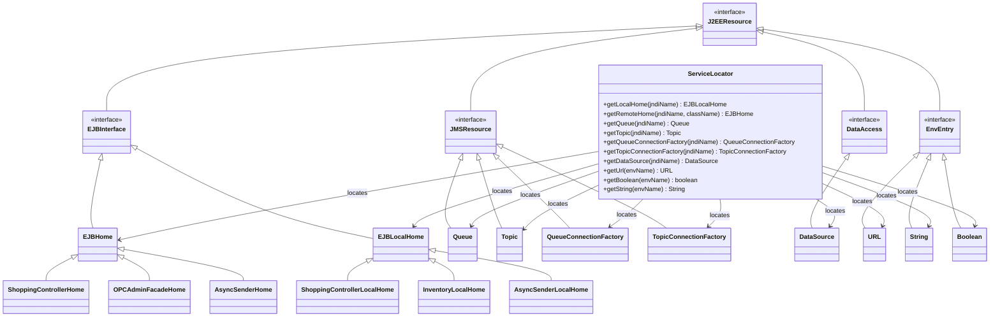

# Service Locator Pattern in Java Pet Store 1.3.2

## Introduction to the Service Locator Pattern

The Service Locator pattern is a core J2EE design pattern implemented in the Java Pet Store 1.3.2 application to centralize and abstract the complexity of resource lookups. In enterprise applications, components frequently need to locate and access various distributed services such as EJBs, JMS resources, data sources, and environment entries. Direct JNDI lookups in client code create tight coupling, reduce maintainability, and introduce redundant error handling. The Service Locator pattern addresses these issues by providing a centralized mechanism that encapsulates the complexities of service location and caching.

In Java Pet Store 1.3.2, the pattern is implemented through dedicated classes that handle the intricacies of JNDI lookups, resource type conversion, and exception management. This implementation follows the J2EE Blueprints best practices, offering a unified approach to resource access across the application tiers. By abstracting the lookup mechanism, the pattern shields client code from the underlying JNDI API complexities and connection management details, allowing developers to focus on business logic rather than infrastructure concerns.

## Core Components of the Service Locator

The Service Locator implementation in Java Pet Store 1.3.2 consists of several key components working together to provide efficient resource lookup services:

1. **ServiceLocator Classes**: Two primary implementations exist - one for the web tier (`com.sun.j2ee.blueprints.servicelocator.web.ServiceLocator`) and another for the EJB tier (`com.sun.j2ee.blueprints.servicelocator.ejb.ServiceLocator`). Both provide methods to locate various J2EE resources but differ in their caching strategies.

2. **InitialContext Management**: Each ServiceLocator maintains an instance of `javax.naming.InitialContext` that serves as the entry point for all JNDI lookups. This encapsulation prevents clients from having to create and manage their own contexts.

3. **Resource Cache**: The web tier implementation employs a thread-safe cache (`Collections.synchronizedMap(new HashMap())`) to store references to previously looked-up resources, significantly improving performance by avoiding redundant JNDI lookups.

4. **Type-Safe Narrowing**: For remote EJB homes, the ServiceLocator handles the necessary type conversion using `PortableRemoteObject.narrow()`, ensuring proper type safety across different JVMs.

5. **ServiceLocatorException**: A custom exception class that wraps lower-level exceptions (like `NamingException`) to provide a unified exception handling approach. It includes methods to access the original exception and recursively find the root cause.

6. **JNDINames Classes**: Various utility classes throughout the application that centralize the JNDI name constants, ensuring consistency and providing a single point of maintenance for resource paths.

7. **Singleton Implementation**: The web tier ServiceLocator uses a singleton pattern with static initialization to ensure a single instance is shared across the application, optimizing resource usage.

The core strength of this implementation lies in its ability to abstract away the complexities of resource lookup while providing a consistent interface for client code. The pattern effectively decouples service consumers from the underlying JNDI API and resource location mechanisms.

## Service Locator Pattern Structure


The diagram illustrates the structure of the Service Locator pattern in Java Pet Store. At its core is the ServiceLocator interface defining resource lookup methods. Two concrete implementations exist: WebServiceLocator (with caching) and EJBServiceLocator. Both use InitialContext for JNDI lookups and handle exceptions through ServiceLocatorException. Client components depend on the ServiceLocator abstraction and use JNDINames constants to specify which resources to locate. This structure centralizes resource lookup logic, provides caching capabilities in the web tier, and offers consistent error handling across the application.

## Web Tier vs. EJB Tier Implementation

The Java Pet Store application implements two distinct versions of the Service Locator pattern, each tailored to the specific needs and constraints of its respective tier:

### Web Tier Implementation

The web tier implementation (`com.sun.j2ee.blueprints.servicelocator.web.ServiceLocator`) is designed with the following characteristics:

1. **Singleton Pattern**: Implements a strict singleton pattern using static initialization to ensure only one instance exists across the entire web application, reducing resource consumption.

2. **Resource Caching**: Employs an aggressive caching strategy with a thread-safe map (`Collections.synchronizedMap(new HashMap())`) to store references to previously looked-up resources, significantly improving performance in the stateless HTTP request environment.

3. **Thread Safety**: Carefully designed for the multi-threaded web container environment, using synchronized collections and immutable references.

4. **Comprehensive Resource Support**: Provides methods for all common J2EE resources including EJB homes (both local and remote), JMS destinations, connection factories, data sources, and environment entries.

### EJB Tier Implementation

The EJB tier implementation (`com.sun.j2ee.blueprints.servicelocator.ejb.ServiceLocator`) has different characteristics:

1. **No Singleton Pattern**: Does not implement the singleton pattern, allowing multiple instances to be created as needed within the EJB container.

2. **No Caching**: Deliberately omits caching functionality, as EJBs typically have their own lifecycle and caching mechanisms managed by the container.

3. **Simplified Design**: Offers a more streamlined implementation focused on immediate lookups rather than cached access.

4. **Same Interface**: Despite implementation differences, provides the same method signatures as the web tier version, ensuring consistent usage patterns across the application.

### Key Differences

The primary differences between the two implementations reflect the distinct characteristics and requirements of their respective tiers:

1. **Resource Management**: The web tier implementation optimizes for repeated lookups in a request-response environment, while the EJB tier implementation defers to the container's resource management.

2. **Instance Management**: The web tier enforces a single instance through the singleton pattern, while the EJB tier allows for multiple instances.

3. **Performance Optimization**: The web tier implementation prioritizes performance through caching, while the EJB tier implementation prioritizes simplicity and integration with container services.

4. **Memory Footprint**: The web tier implementation maintains a potentially large cache of resources, while the EJB tier implementation has a minimal memory footprint.

These differences demonstrate how the Service Locator pattern can be adapted to different architectural contexts while maintaining a consistent interface for client code.

## Service Locator Sequence Flow


This sequence diagram illustrates the typical flow of a resource lookup through the Service Locator pattern in Java Pet Store. When a client requests a resource (in this example, an EJB home interface), the flow differs based on whether the web tier or EJB tier implementation is used.

In the web tier implementation, the ServiceLocator first checks its internal cache for the requested resource. If found, it's returned immediately, avoiding the costly JNDI lookup. If not found, the ServiceLocator performs a JNDI lookup through InitialContext, narrows the result to the appropriate type, stores it in the cache for future use, and returns it to the client.

The EJB tier implementation follows a simpler path, directly performing the JNDI lookup without checking or updating any cache. In both cases, any exceptions that occur during the lookup process are wrapped in a ServiceLocatorException before being propagated to the client, providing a consistent error handling mechanism.

This sequence demonstrates how the Service Locator pattern centralizes the complexity of resource location while providing performance optimization through caching in environments where it's beneficial.

## Resource Caching Strategy

The web tier implementation of the Service Locator pattern in Java Pet Store 1.3.2 employs a sophisticated caching strategy to optimize performance by minimizing expensive JNDI lookups. This caching mechanism is a critical feature that distinguishes it from the EJB tier implementation and significantly contributes to the application's overall efficiency.

The caching strategy is implemented through a synchronized Map that stores references to previously looked-up resources using their JNDI names as keys:

```java
cache = Collections.synchronizedMap(new HashMap());
```

This approach offers several important benefits:

1. **Lookup Optimization**: JNDI lookups are relatively expensive operations that involve network communication with the naming service. By caching resource references after the first lookup, subsequent requests for the same resource can be served directly from memory, avoiding the overhead of repeated JNDI operations.

2. **Thread Safety**: The use of `Collections.synchronizedMap()` ensures that the cache is thread-safe, allowing concurrent access from multiple threads in the web container without risking data corruption or inconsistency.

3. **Resource Reuse**: Many J2EE resources, such as EJB home interfaces and connection factories, are designed to be reused across multiple operations. The caching strategy aligns with this design principle by maintaining persistent references to these resources.

4. **Lazy Loading**: Resources are only looked up and cached when they are first requested, implementing a form of lazy loading that conserves memory by only caching resources that are actually used.

The caching logic follows a consistent pattern across all resource types:

```java
if (cache.containsKey(jndiName)) {
    resource = (ResourceType) cache.get(jndiName);
} else {
    resource = (ResourceType) ic.lookup(jndiName);
    cache.put(jndiName, resource);
}
```

This pattern is applied to various resource types including EJB local homes, EJB remote homes, JMS queues, JMS topics, connection factories, and data sources. However, for simpler environment entries like URLs, strings, and booleans, caching is not applied since these lookups are typically less expensive and the values may change during the application's lifecycle.

It's worth noting that the caching strategy assumes that the resources being cached have a lifecycle that extends beyond individual requests and are thread-safe for concurrent access. This assumption holds true for most J2EE resources but might require reconsideration in specific scenarios where resources have shorter lifecycles or thread safety concerns.

The absence of caching in the EJB tier implementation is a deliberate design decision, recognizing that EJBs operate in a different context where the container already provides efficient resource management and the benefits of caching might be outweighed by the additional complexity and potential for resource leaks.

## Error Handling with ServiceLocatorException

The Java Pet Store's Service Locator pattern implements a robust error handling mechanism centered around the `ServiceLocatorException` class. This approach provides a consistent way to manage and propagate exceptions that occur during resource lookups, abstracting the underlying JNDI and J2EE infrastructure exceptions from client code.

The `ServiceLocatorException` class extends Java's standard `Exception` class and adds functionality to wrap lower-level exceptions:

```java
public class ServiceLocatorException extends Exception {
  private Exception exception;
  
  // Constructors and methods...
}
```

Key aspects of this error handling approach include:

1. **Exception Wrapping**: The class can wrap another exception, preserving the original exception chain while providing a consistent interface to client code. This is implemented through three constructors that accept different combinations of message strings and exception objects.

2. **Root Cause Analysis**: The `getRootCause()` method implements recursive traversal through nested exceptions to find the ultimate cause of a failure:

   ```java
   public Exception getRootCause() {
     if (exception instanceof ServiceLocatorException) {
       return ((ServiceLocatorException) exception).getRootCause();
     }
     return exception == null ? this : exception;
   }
   ```

   This is particularly valuable in diagnosing problems in complex enterprise applications where exceptions may be wrapped multiple times as they propagate through layers.

3. **Consistent Error Reporting**: The `toString()` method is overridden to delegate to the wrapped exception when appropriate, ensuring that error messages maintain their original context and detail:

   ```java
   public String toString() {
     if (exception instanceof ServiceLocatorException) {
       return ((ServiceLocatorException) exception).toString();
     }
     return exception == null ? super.toString() : exception.toString();
   }
   ```

4. **Unified Exception Handling in Service Locator**: Both web and EJB tier implementations of the Service Locator consistently wrap lower-level exceptions in `ServiceLocatorException` instances before propagating them to clients:

   ```java
   try {
     // JNDI lookup or other operation
   } catch (NamingException ne) {
     throw new ServiceLocatorException(ne);
   } catch (Exception e) {
     throw new ServiceLocatorException(e);
   }
   ```

   This pattern is applied consistently across all resource lookup methods, providing a uniform exception handling approach.

5. **Abstraction of Infrastructure Details**: By wrapping infrastructure-specific exceptions like `NamingException`, the Service Locator shields client code from the details of the underlying JNDI implementation, promoting loose coupling and making the code more maintainable.

This error handling strategy exemplifies good practices in enterprise application development by providing meaningful, consistent error reporting while preserving the original exception context. It allows client code to handle service location failures in a uniform way without needing to understand the intricacies of JNDI or other J2EE infrastructure APIs.

## Service Locator in Pet Store Architecture


The Service Locator pattern plays a pivotal role in the Java Pet Store architecture, serving as a critical infrastructure component that connects the application's various tiers. This architectural diagram illustrates how the Service Locator fits within the broader Pet Store application structure.

In the Pet Store architecture, the Service Locator pattern acts as a bridge between the presentation tier (JSPs and servlets) and the business logic tier (EJBs). The pattern is implemented in two variants to address the specific needs of each tier:

1. **Web Tier Integration**: The `WebServiceLocator` provides web components with access to EJB homes, JMS resources, and other J2EE services. It's used extensively by the `ComponentManager` and `WebController` classes to locate and instantiate the necessary business components. The web tier implementation includes caching to optimize performance in the request-response environment.

2. **EJB Tier Integration**: The `EJBServiceLocator` serves a similar purpose within the EJB tier, allowing business components to locate other EJBs, JMS resources, and data sources. This implementation is streamlined without caching, as the EJB container already provides efficient resource management.

3. **Resource Access Abstraction**: Both Service Locator implementations abstract the complexities of JNDI lookups and resource type conversion, providing a clean interface for accessing various J2EE resources. This abstraction is particularly valuable in the Pet Store application, which utilizes a wide range of J2EE services including EJBs, JMS, and JDBC.

4. **Centralized Configuration**: The `JNDINames` utility classes provide centralized configuration of resource paths, ensuring consistency across the application and facilitating deployment in different environments.

5. **Component Manager Integration**: The Service Locator pattern is tightly integrated with the `ComponentManager`, which extends its functionality to provide session-scoped access to controllers and other services. This integration demonstrates how the pattern can be combined with other J2EE patterns to create a comprehensive application architecture.

The Service Locator pattern contributes significantly to the Pet Store architecture's modularity, maintainability, and performance. By centralizing resource lookup logic and providing caching where appropriate, it reduces code duplication and improves response times. The pattern's consistent exception handling also enhances the application's robustness by providing a uniform approach to managing resource lookup failures.

## Singleton Implementation Approach

The singleton implementation approach in the Java Pet Store's Service Locator pattern is a critical design decision that ensures efficient resource utilization while providing centralized access to J2EE resources. This approach is particularly evident in the web tier implementation (`com.sun.j2ee.blueprints.servicelocator.web.ServiceLocator`), which employs a classic singleton pattern with some J2EE-specific considerations.

The singleton pattern is implemented through a combination of private constructor, static instance variable, and static initialization block:

```java
private static ServiceLocator me;

static {
  try {
    me = new ServiceLocator();
  } catch(ServiceLocatorException se) {
    System.err.println(se);
    se.printStackTrace(System.err);
  }
}

private ServiceLocator() throws ServiceLocatorException {
  try {
    ic = new InitialContext();
    cache = Collections.synchronizedMap(new HashMap());
  } catch (NamingException ne) {
    throw new ServiceLocatorException(ne);
  } catch (Exception e) {
    throw new ServiceLocatorException(e);
  }
}

static public ServiceLocator getInstance() {
  return me;
}
```

This implementation offers several important characteristics:

1. **Early Initialization**: The singleton instance is created during class loading through the static initialization block, ensuring that any initialization errors are detected early in the application lifecycle. This approach is known as "eager initialization" and is appropriate for a service that will be used throughout the application's lifetime.

2. **Exception Handling During Initialization**: The static initialization block catches and logs any exceptions that occur during singleton creation, preventing these exceptions from disrupting the class loading process while still providing visibility into initialization failures.

3. **Thread Safety**: The implementation is inherently thread-safe for singleton access due to the guarantees provided by the Java class loading mechanism. The static initialization block is executed by the JVM in a thread-safe manner, ensuring that only one instance of the ServiceLocator is ever created.

4. **Resource Initialization**: The private constructor initializes the InitialContext and the synchronized cache map, ensuring that these resources are ready for use when the singleton instance is accessed.

5. **Simple Access Method**: The `getInstance()` method provides a clean, consistent way to access the singleton instance throughout the application without exposing the details of how the instance is created or managed.

This singleton approach offers several benefits in the context of the Service Locator pattern:

- **Resource Conservation**: Creating and maintaining JNDI contexts and connection pools can be resource-intensive. The singleton pattern ensures these resources are shared efficiently across the application.

- **Centralized Caching**: The singleton provides a natural place to implement a centralized cache of looked-up resources, improving performance by avoiding redundant JNDI lookups.

- **Consistent Configuration**: Having a single instance ensures that all components use the same configuration and access patterns for resource lookups.

- **Simplified Client Code**: Clients can easily access the Service Locator through the static `getInstance()` method without needing to manage its lifecycle or pass references between components.

It's worth noting that the EJB tier implementation does not use the singleton pattern, reflecting the different resource management needs and lifecycle considerations in that tier. This contrast demonstrates how the same pattern can be adapted to different architectural contexts while maintaining its core purpose of centralizing and abstracting resource lookups.

## Integration with Component Manager

The Service Locator pattern in Java Pet Store 1.3.2 is tightly integrated with the Component Manager, creating a powerful combination that manages both resource location and component lifecycle. This integration demonstrates how design patterns can be combined to address complex architectural requirements in enterprise applications.

The Component Manager in Java Pet Store is implemented primarily through the `DefaultComponentManager` class and its extension `PetstoreComponentManager`. These classes serve as factories and registries for controllers and other components, managing their creation, initialization, and session-scoped storage. The integration with the Service Locator pattern occurs at several key points:

1. **Service Locator as a Component Manager Dependency**:
   The Component Manager depends on the Service Locator to obtain references to EJBs and other resources:

   ```java
   protected ServiceLocator sl = null;

   public DefaultComponentManager() {
       sl = ServiceLocator.getInstance();
   }
   ```

   This dependency injection approach allows the Component Manager to leverage the Service Locator's resource location and caching capabilities without reimplementing them.

2. **Controller Instantiation and Configuration**:
   The Component Manager uses the Service Locator to obtain configuration information for controller instantiation:

   ```java
   String wccClassName = sl.getString(JNDINames.DEFAULT_WEB_CONTROLLER);
   wcc = (WebController) Beans.instantiate(this.getClass().getClassLoader(), wccClassName);
   ```

   This approach allows the controller class to be configured externally through JNDI environment entries, enhancing the application's flexibility and configurability.

3. **EJB Controller Access**:
   The Component Manager provides access to EJB controllers by using the Service Locator to obtain their home interfaces:

   ```java
   EJBControllerLocalHome home = (EJBControllerLocalHome)sl.getLocalHome(JNDINames.EJB_CONTROLLER_EJBHOME);
   ccEjb = home.create();
   ```

   This integration simplifies client code by providing a unified interface for accessing both web and EJB tier controllers.

4. **Session-Scoped Component Management**:
   While the Service Locator provides application-wide resource location, the Component Manager extends this concept to session-scoped component management:

   ```java
   public void sessionCreated(HttpSessionEvent se) {
       HttpSession session = se.getSession();
       sl = ServiceLocator.getInstance();
       session.setAttribute(WebKeys.COMPONENT_MANAGER, this);
   }
   ```

   This combination allows the application to manage both global resources (through the Service Locator) and session-specific components (through the Component Manager).

5. **Pet Store-Specific Extensions**:
   The `PetstoreComponentManager` extends this integration to provide access to domain-specific components:

   ```java
   public ShoppingCartLocal getShoppingCart(HttpSession session) {
       ShoppingControllerLocal scEjb = getShoppingController(session);
       ShoppingClientFacadeLocal scf = scEjb.getShoppingClientFacade();
       return scf.getShoppingCart();
   }
   ```

   These methods use the Service Locator indirectly (through the EJB controller) to provide access to business-specific components like shopping carts and customer profiles.

This integration demonstrates several architectural best practices:

- **Separation of Concerns**: The Service Locator focuses on resource location and caching, while the Component Manager focuses on component lifecycle and session management.
- **Pattern Composition**: By combining the Service Locator and Factory patterns, the application achieves both efficient resource lookup and flexible component creation.
- **Layered Architecture**: The integration supports a clean separation between web components, controllers, and EJB services.
- **Consistent Resource Access**: All components access J2EE resources through the same Service Locator interface, ensuring consistent error handling and caching behavior.

This integration exemplifies how the Service Locator pattern can be embedded within a larger architectural framework to provide comprehensive resource and component management in enterprise applications.

## Resource Type Hierarchy



The Service Locator pattern in Java Pet Store 1.3.2 manages a diverse hierarchy of resource types, providing specialized lookup methods for each category. This diagram illustrates the different types of resources managed by the Service Locator and their relationships.

At the top of the hierarchy are J2EE resources, which can be broadly categorized into four main groups:

1. **EJB Interfaces**: The Service Locator provides methods to locate both remote (`EJBHome`) and local (`EJBLocalHome`) EJB home interfaces. These interfaces serve as factories for EJB instances and are critical for accessing business logic components. The Pet Store application includes several specific implementations such as `ShoppingControllerHome`, `OPCAdminFacadeHome`, and `InventoryLocalHome`.

2. **JMS Resources**: For messaging functionality, the Service Locator manages four types of JMS resources:
   - `Queue` destinations for point-to-point messaging
   - `Topic` destinations for publish-subscribe messaging
   - `QueueConnectionFactory` for creating connections to queues
   - `TopicConnectionFactory` for creating connections to topics

   These resources enable asynchronous communication between components, such as order processing and inventory updates.

3. **Data Access Resources**: The Service Locator provides access to `DataSource` objects, which serve as factories for JDBC connections. These resources are essential for database access throughout the application.

4. **Environment Entries**: The Service Locator can retrieve various types of environment entries from JNDI, including:
   - `URL` objects for external resource references
   - `String` values for configuration parameters
   - `Boolean` flags for feature toggles and configuration options

The Service Locator provides specialized methods for each resource type, handling the appropriate type casting and narrowing operations. For example:

- `getLocalHome(jndiName)` returns an `EJBLocalHome` interface
- `getRemoteHome(jndiName, className)` returns an `EJBHome` interface, using `PortableRemoteObject.narrow()` for type safety
- `getQueue(jndiName)` returns a JMS `Queue` destination
- `getDataSource(jndiName)` returns a JDBC `DataSource`

This type-specific approach offers several advantages:

1. **Type Safety**: Clients receive properly typed objects without having to perform explicit casting or narrowing.
2. **Specialized Handling**: Each resource type can be handled according to its specific requirements (e.g., remote EJB homes require narrowing).
3. **Consistent Interface**: Despite the diversity of resource types, clients interact with a consistent set of methods.
4. **Selective Caching**: The web tier implementation can apply caching selectively based on resource type characteristics.

The resource type hierarchy demonstrates how the Service Locator pattern can provide a unified interface for accessing diverse J2EE resources while respecting their specific requirements and characteristics. This approach simplifies client code while ensuring proper handling of each resource type.

## Benefits and Tradeoffs

The Service Locator pattern as implemented in Java Pet Store 1.3.2 offers significant benefits but also comes with certain tradeoffs that architects should consider when evaluating its applicability to their own enterprise applications.

### Benefits

1. **Centralized Resource Lookup Logic**: The pattern centralizes all JNDI lookup code in dedicated classes, eliminating duplication across the application and providing a single point for maintenance and optimization.

2. **Abstraction of JNDI Complexity**: By hiding the details of JNDI lookups, context creation, and exception handling, the pattern simplifies client code and reduces the learning curve for developers unfamiliar with JNDI.

3. **Performance Optimization**: The web tier implementation's caching strategy significantly improves performance by avoiding redundant JNDI lookups, which can be relatively expensive operations in terms of time and resources.

4. **Consistent Error Handling**: The `ServiceLocatorException` provides a uniform approach to handling and reporting lookup failures, improving error diagnostics and application robustness.

5. **Flexible Resource Configuration**: By separating resource lookup from resource usage, the pattern facilitates configuration changes without modifying business logic code, supporting the principle of configuration over coding.

6. **Support for Different Tiers**: The dual implementations (web and EJB) demonstrate how the pattern can be adapted to different architectural contexts while maintaining a consistent interface.

7. **Integration with Other Patterns**: As demonstrated by its integration with the Component Manager, the Service Locator pattern works well in combination with other J2EE patterns to create comprehensive architectural solutions.

### Tradeoffs

1. **Hidden Dependencies**: Services accessed through the Service Locator are not explicitly declared in component interfaces or constructors, potentially making dependencies less visible and complicating unit testing.

2. **Singleton Limitations**: The singleton implementation in the web tier, while efficient, introduces global state that can complicate testing and potentially create subtle threading issues in certain scenarios.

3. **Caching Complexity**: The caching strategy, while beneficial for performance, introduces additional complexity and potential staleness issues if resources are modified externally during the application's lifecycle.

4. **Abstraction Leakage**: Despite the abstraction, clients still need to know the JNDI names of resources they want to access, and these names are often scattered throughout the application code.

5. **Dependency on JNDI**: The pattern is tightly coupled to JNDI as the underlying lookup mechanism, which may limit its adaptability to non-J2EE environments or newer dependency injection frameworks.

6. **Testing Challenges**: Components that use the Service Locator can be harder to test in isolation since they depend on the availability of the resources being located.

7. **Evolution Path**: As Java EE evolved, this pattern was gradually superseded by dependency injection frameworks like CDI (Contexts and Dependency Injection), which offer more flexible and testable approaches to resource management.

### Modern Context

In contemporary Java EE (now Jakarta EE) applications, many of the responsibilities handled by the Service Locator pattern have been absorbed by dependency injection frameworks and container services. CDI, Spring, and other frameworks provide more declarative approaches to resource injection that address many of the tradeoffs mentioned above.

However, understanding the Service Locator pattern remains valuable for several reasons:

1. **Legacy System Maintenance**: Many production systems still use this pattern and require ongoing maintenance.

2. **Architectural Principles**: The pattern embodies important principles like separation of concerns and centralization of cross-cutting functionality.

3. **Pattern Evolution**: Seeing how this pattern evolved into modern dependency injection approaches provides insight into software architecture evolution.

4. **Specialized Use Cases**: There are still scenarios where programmatic lookup of resources (as opposed to declarative injection) is necessary or advantageous.

The Service Locator pattern in Java Pet Store 1.3.2 represents a well-designed solution to the resource location challenges of its era, and its implementation offers valuable lessons for contemporary enterprise architects, even as newer technologies have emerged to address the same concerns in different ways.

[Generated by the Sage AI expert workbench: 2025-03-09 12:38:50  https://sage-tech.ai/workbench]: #