# Service Registry in Java Pet Store 1.3.2

## Introduction to Service Registry in Java Pet Store

The Java Pet Store 1.3.2 implements a service registry pattern through a systematic approach to JNDI (Java Naming and Directory Interface) naming conventions. This implementation enables component discovery and integration across the distributed application architecture. Rather than hardcoding service locations or using direct dependencies between components, Java Pet Store employs JNDI as a service registry mechanism, allowing components to dynamically discover and interact with one another at runtime. This approach creates a loosely coupled system where components can be modified, replaced, or scaled independently without requiring changes to dependent components. The service registry pattern is particularly important in a distributed enterprise application like Pet Store, which spans multiple tiers and includes various services such as EJBs, data sources, JMS resources, and configuration parameters.

## The JNDINames Pattern

A consistent pattern emerges across the Java Pet Store codebase where each component contains a dedicated `JNDINames` utility class that centralizes JNDI lookup names. This pattern appears in virtually every major component of the application, including the catalog, shopping cart, purchase order, supplier, and OPC (Order Processing Center) modules. Each `JNDINames` class follows a similar structure:

1. A private constructor to prevent instantiation, enforcing the class's role as a static utility
2. Public static final String constants that define JNDI paths for various resources
3. Clear documentation indicating that changes to these constants must be synchronized with deployment descriptors

This approach provides several benefits:
- It eliminates string literals scattered throughout the code
- It ensures consistency in naming conventions
- It centralizes the maintenance of JNDI paths
- It documents the dependencies between components
- It creates a single point of change when JNDI paths need to be modified

The pattern is remarkably consistent across all components, indicating a deliberate architectural decision to standardize service discovery throughout the application.

## JNDINames Class Structure


The JNDINames class structure follows a consistent pattern across all components in the Java Pet Store application. The private constructor is a deliberate design choice to prevent instantiation, as these classes serve purely as containers for constants. This approach aligns with best practices for utility classes that don't maintain state.

The constants defined in each JNDINames class must be synchronized with the corresponding entries in deployment descriptors (web.xml, ejb-jar.xml, etc.). This synchronization is critical - if a constant in JNDINames is changed without updating the deployment descriptor, or vice versa, the application will fail at runtime when attempting to look up the resource. This tight coupling between code and configuration is a limitation of the J2EE 1.3 platform that Java Pet Store was built on, as more modern frameworks provide mechanisms to automatically synchronize these references.

## Resource Categorization in Service Registry

The Java Pet Store application organizes its JNDI names by resource types, creating a logical structure within the service registry. This categorization is evident in the constants defined in the various JNDINames classes across different components. The primary resource categories include:

1. **EJB References**: Used to locate Enterprise JavaBeans, these references typically follow the pattern `java:comp/env/ejb/[BeanName]`. Examples include `CATALOG_EJBHOME`, `SHOPPING_CART_EJBHOME`, and `PURCHASE_ORDER_EJB`.

2. **Data Sources**: Database connection pools are referenced with names like `java:comp/env/jdbc/[DatabaseName]`, such as `CATALOG_DATASOURCE`.

3. **JMS Resources**: Message-oriented middleware components use names like `java:comp/env/jms/[ResourceName]`. Examples include `QUEUE_CONNECTION_FACTORY` and `INVOICE_MDB_TOPIC`.

4. **Environment Parameters**: Configuration settings are stored with names like `java:comp/env/param/[ParameterName]`. Examples include `CATALOG_DAO_CLASS` and `SEND_CONFIRMATION_MAIL`.

5. **URL References**: External resource locations use names like `java:comp/env/url/[ResourceName]`, such as `XML_ENTITY_CATALOG_URL`.

This categorization creates a namespace hierarchy within the JNDI registry, making it easier to understand the purpose of each resource and maintain the system. The consistent naming conventions also facilitate documentation and knowledge transfer among development teams.

## Service Registry Resource Types


The diagram above illustrates the hierarchical organization of resources within the JNDI service registry of Java Pet Store. This structure demonstrates how the application categorizes different types of services and resources, creating a logical namespace that makes the system more maintainable.

The `java:comp/env/` prefix is a J2EE standard that indicates a component-specific environment entry. This namespace isolation ensures that different components can use similar resource names without conflict. The subsequent path segments indicate the resource type (ejb, jdbc, jms, param, url) and specific resource name.

This hierarchical organization provides several benefits:
1. It creates a clear separation between different types of resources
2. It makes the purpose of each resource immediately apparent from its path
3. It allows for consistent naming conventions across the application
4. It facilitates resource management in the application server

The consistent use of this naming structure across all components of Java Pet Store demonstrates a well-thought-out architectural approach to service registry design.

## EJB Component Registration

Enterprise JavaBeans (EJBs) form the core business logic components of the Java Pet Store application, and their registration in the service registry is particularly important for the application's functionality. The EJB registration pattern follows a consistent approach across different components:

1. Each EJB is registered with a JNDI name that follows the pattern `java:comp/env/ejb/[BeanName]`
2. The registration is defined in the EJB's deployment descriptor (ejb-jar.xml)
3. The corresponding JNDI name is stored as a constant in the component's JNDINames class
4. Client components use these constants to look up and access the EJB services

For example, in the ShoppingCart component, the EJB is registered with the name `java:comp/env/ejb/ShoppingCart`. In the Catalog component, the EJB is registered as `java:comp/env/ejb/Catalog`. The PurchaseOrder component registers its EJB as `java:comp/env/ejb/PurchaseOrder`.

This consistent naming convention makes it easy to understand the purpose of each EJB and its relationship to the component it belongs to. It also simplifies the process of looking up EJBs from client components, as developers can easily identify the JNDI name to use based on the EJB they need to access.

The registration process also includes the mapping of the logical JNDI name (e.g., `java:comp/env/ejb/Catalog`) to the physical JNDI name (e.g., `ejb/CatalogEJB`) in the deployment descriptor. This indirection allows the application to use consistent logical names internally while accommodating different physical naming requirements in various deployment environments.

## EJB Lookup Process Flow


The sequence diagram above illustrates how components use JNDINames constants to look up and access EJB services at runtime. This process is fundamental to the service registry pattern implemented in Java Pet Store.

When a client component needs to access an EJB service, it first obtains the appropriate JNDI name from the JNDINames class. This constant is then used to perform a JNDI lookup, which returns the EJB's home interface. The client can then use this home interface to create or find an instance of the EJB and invoke its business methods.

This lookup process provides several important benefits:
1. It decouples the client from the physical location of the EJB
2. It allows the EJB to be relocated or reimplemented without changing client code
3. It enables the application server to manage EJB lifecycle and pooling
4. It facilitates security and transaction management through container services

The consistent use of JNDINames constants throughout this process ensures that all components use the same JNDI names, reducing the risk of lookup failures due to naming inconsistencies.

## JMS Resource Registration

Java Pet Store 1.3.2 makes extensive use of Java Message Service (JMS) for asynchronous communication between components, particularly in the AsyncSender and Supplier modules. JMS resources such as topic connection factories, queue connection factories, topics, and queues are registered in the service registry to enable components to discover and connect to these messaging endpoints.

In the AsyncSender component, we see the registration of a queue connection factory and a message queue:

```java
public static final String QUEUE_CONNECTION_FACTORY =
                        "java:comp/env/jms/QueueConnectionFactory";
public static final String ASYNC_SENDER_QUEUE =
                              "java:comp/env/jms/AsyncSenderQueue";
```

Similarly, in the Supplier component, we find the registration of a topic connection factory and an invoice topic:

```java
public static final String TOPIC_CONNECTION_FACTORY =
               "java:comp/env/jms/TopicConnectionFactory";
public static final String INVOICE_MDB_TOPIC =
                     "java:comp/env/jms/opc/InvoiceTopic";
```

These JMS resources are defined in the application's deployment descriptors and mapped to physical JMS resources in the application server. The JNDINames constants provide a consistent way for components to look up these resources at runtime.

The use of JMS resources in the service registry enables loosely coupled, asynchronous communication between components. For example, the OPC component can send an invoice to the Supplier component without knowing its implementation details or even whether it's currently available. This decoupling is particularly valuable in a distributed application like Java Pet Store, where components may be deployed across multiple servers or even in different data centers.

## Configuration Parameters in Service Registry

Java Pet Store leverages the service registry not only for component discovery but also for application configuration. By exposing configuration parameters through the JNDI registry, the application enables deployment-time configuration without requiring code changes.

The catalog component demonstrates this approach with several configuration parameters:

```java
public static final String USE_CATALOG_EJB =
    "java:comp/env/ejb/catalog/useCatalogEJB";
public static final String CATALOG_DAO_CLASS =
    "java:comp/env/param/CatalogDAOClass";
public static final String CATALOG_DAO_SQL_URL =
    "java:comp/env/url/CatalogDAOSQLURL";
```

These parameters control aspects such as whether to use the Catalog EJB directly or through a facade, which DAO implementation class to use, and the SQL URL for database access.

Similarly, the OPC component uses configuration parameters to control email notifications:

```java
public static final String SEND_CONFIRMATION_MAIL =
                 "java:comp/env/param/SendConfirmationMail";
public static final String SEND_APPROVAL_MAIL =
                    "java:comp/env/param/SendApprovalMail";
public static final String SEND_COMPLETED_ORDER_MAIL =
              "java:comp/env/param/SendCompletedOrderMail";
```

These parameters determine whether to send email notifications for different order events.

The use of JNDI for configuration parameters provides several advantages:
1. It centralizes configuration in the deployment descriptors
2. It allows different configurations for different deployment environments
3. It enables runtime changes to configuration without recompiling code
4. It provides a consistent mechanism for accessing configuration across the application

This approach to configuration management through the service registry demonstrates the flexibility and power of the JNDI-based service registry pattern in Java Pet Store.

## Component Dependencies via Service Registry

```mermaid
graph TD
    A[PetStore Web UI] --> B[ShoppingClientFacade]
    A --> C[SignOn]
    B --> D[ShoppingCart]
    B --> E[Catalog]
    B --> F[Customer]
    D --> G[PurchaseOrder]
    G --> H[ContactInfo]
    G --> I[CreditCard]
    G --> J[LineItem]
    G --> K[AsyncSender]
    K --> L[OPC]
    L --> M[Supplier]
    
    classDef component fill:#f9f,stroke:#333,stroke-width:2px;
    class A,B,C,D,E,F,G,H,I,J,K,L,M component;
    
    linkStyle 0,1,2,3,4,5,6,7,8,9,10,11 stroke:#0f0,stroke-width:2px;
```



The diagram above illustrates how different application components depend on each other through service registry lookups. Each arrow represents a dependency that is resolved through JNDI lookups using the constants defined in JNDINames classes.

This network of dependencies highlights the decoupling effect of the service registry pattern. Components don't have direct compile-time dependencies on each other; instead, they depend on the service registry to provide the appropriate implementation at runtime. This decoupling enables several important architectural benefits:

1. **Flexibility**: Components can be replaced or reimplemented without affecting their clients
2. **Scalability**: Multiple instances of a component can be deployed and load-balanced
3. **Testability**: Mock implementations can be registered for testing purposes
4. **Evolution**: The system can evolve over time with minimal disruption

For example, the ShoppingClientFacade depends on the ShoppingCart, Catalog, and Customer components, but it doesn't have direct compile-time dependencies on their implementations. Instead, it looks up these components through the service registry using the JNDI names defined in its JNDINames class. This allows the implementations of these components to change without requiring changes to the ShoppingClientFacade.

Similarly, the AsyncSender component enables asynchronous communication between the PetStore and OPC components without creating direct dependencies between them. This loose coupling is particularly valuable in a distributed application like Java Pet Store, where components may be deployed across multiple servers or even in different data centers.

## Deployment Descriptor Synchronization

A critical aspect of Java Pet Store's service registry implementation is the synchronization between JNDINames constants and deployment descriptors. This relationship is explicitly mentioned in the documentation of each JNDINames class:

```java
/**
 * This class is the central location to store the internal
 * JNDI names of various entities. Any change here should
 * also be reflected in the deployment descriptors.
 */
```

This synchronization is necessary because the JNDI names defined in the JNDINames classes are used by components to look up resources, while the deployment descriptors define how these logical names are mapped to physical resources in the application server. If these two sources of information become out of sync, the application will fail at runtime when attempting to look up resources.

For example, if the CATALOG_EJBHOME constant in the catalog component's JNDINames class is changed from "java:comp/env/ejb/Catalog" to "java:comp/env/ejb/CatalogService", but the corresponding <ejb-ref> element in the deployment descriptor is not updated, any component that tries to look up the Catalog EJB will fail with a NamingException.

This tight coupling between code and configuration is a limitation of the J2EE 1.3 platform that Java Pet Store was built on. More modern frameworks provide mechanisms to automatically synchronize these references or to generate deployment descriptors from code annotations.

Despite this limitation, the centralization of JNDI names in JNDINames classes makes it easier to maintain this synchronization, as there is a single point of reference for all JNDI names used in the code. When a deployment descriptor needs to be updated, the corresponding JNDINames class provides a complete list of the JNDI names that need to be defined.

## Benefits and Limitations of the Service Registry Approach

The service registry approach implemented in Java Pet Store 1.3.2 through JNDI naming conventions offers several significant benefits:

1. **Loose Coupling**: Components depend on the service registry rather than directly on each other, reducing compile-time dependencies and enabling more flexible system evolution.

2. **Centralized Management**: JNDI names are centralized in JNDINames classes, making it easier to understand and maintain the system's component dependencies.

3. **Runtime Flexibility**: Services can be relocated or reimplemented without changing client code, as long as they maintain the same JNDI name.

4. **Configuration Externalization**: Application configuration can be managed through deployment descriptors rather than hardcoded in the application.

5. **Standardization**: The approach follows J2EE standards, making it familiar to developers experienced with enterprise Java development.

However, the approach also has several limitations:

1. **Manual Synchronization**: JNDI names must be manually synchronized between JNDINames classes and deployment descriptors, creating a potential source of runtime errors.

2. **Verbose Configuration**: The deployment descriptors required for this approach can become large and complex, making them difficult to maintain.

3. **Limited Type Safety**: JNDI lookups return Object references that must be cast to the appropriate type, which can lead to ClassCastExceptions at runtime.

4. **Performance Overhead**: JNDI lookups add a performance overhead compared to direct method calls or dependency injection.

5. **Limited Testing Support**: Testing components that depend on JNDI lookups requires setting up a JNDI environment, which can complicate unit testing.

Despite these limitations, the service registry approach was a best practice for enterprise Java applications at the time Java Pet Store 1.3.2 was developed. Modern Java frameworks like Spring and Java EE/Jakarta EE have addressed many of these limitations through features like dependency injection, annotation-based configuration, and improved testing support. However, the fundamental concept of a service registry remains valuable, and many modern service discovery mechanisms in microservices architectures build on the same principles demonstrated in Java Pet Store's JNDI-based service registry.

[Generated by the Sage AI expert workbench: 2025-03-29 21:37:00  https://sage-tech.ai/workbench]: #