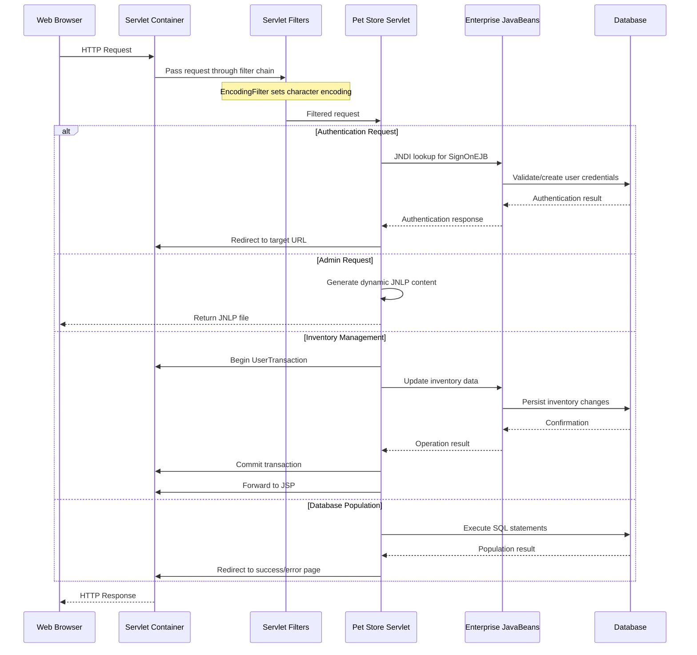
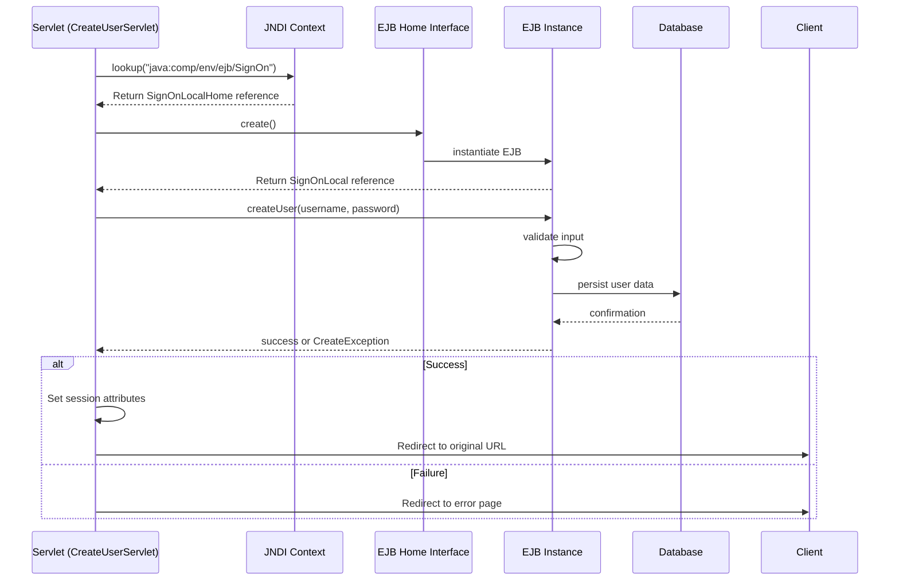
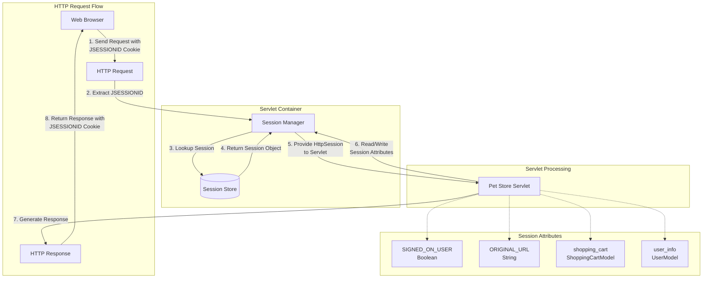
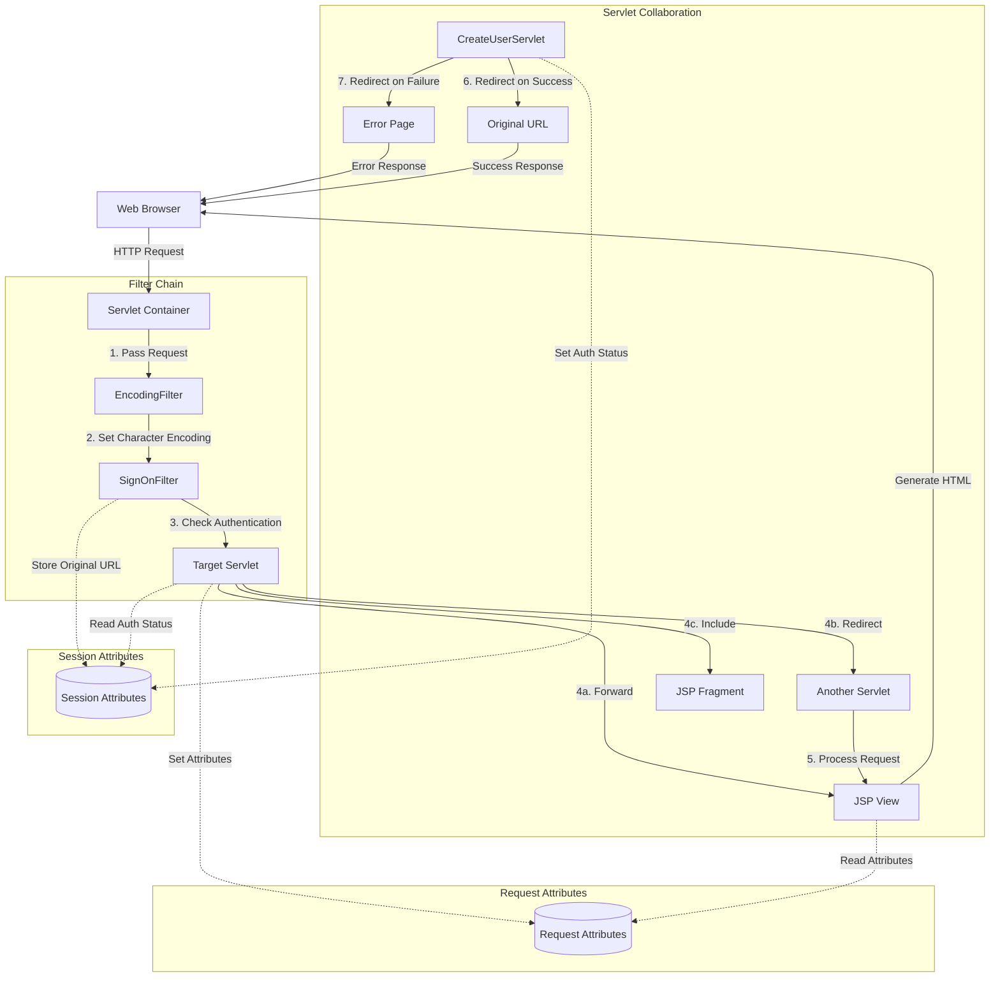

# Servlet Processing in Java Pet Store

## Introduction to Servlet Processing in Java Pet Store

The Java Pet Store application exemplifies a sophisticated implementation of the servlet processing model, serving as the backbone for HTTP request handling within this J2EE reference application. The servlet architecture in Pet Store demonstrates the classic Model-View-Controller (MVC) pattern, where servlets function as controllers that process incoming HTTP requests, interact with the business tier through EJBs, and coordinate the response generation typically delegated to JSP views.

The application's servlet implementation showcases several advanced patterns and techniques. Request processing follows a well-defined lifecycle, beginning with optional filter-based preprocessing, followed by servlet-based business logic execution, and concluding with response generation. This separation of concerns allows for modular development and maintenance of the application's web tier.

Pet Store's servlet implementation demonstrates how to properly manage resources within a J2EE container, including proper acquisition and release of database connections, EJB references, and transaction contexts. The code reveals careful attention to thread safety considerations, as servlets in Pet Store are designed to be thread-safe by avoiding instance variables that store request-specific state.

The application also implements sophisticated session management techniques, using HTTP sessions to maintain user state across requests while ensuring proper synchronization and cleanup. This approach enables the application to maintain user context while avoiding memory leaks and ensuring scalability in a clustered environment.

## Servlet Request Processing Flow



The diagram illustrates the comprehensive request processing flow in the Java Pet Store application. The process begins when a client sends an HTTP request to the servlet container, which first passes the request through a chain of filters like EncodingFilter that perform preprocessing operations such as setting character encoding.

After filter processing, the request reaches the appropriate servlet based on URL mapping. The servlet's behavior branches based on the request type:

1. For authentication requests, CreateUserServlet performs JNDI lookups to obtain EJB references, interacts with the SignOnEJB to validate or create user credentials, and then redirects to the appropriate target URL based on the authentication result.

2. For admin requests, AdminRequestProcessor dynamically generates JNLP content for Java Web Start applications, embedding session information for authentication.

3. For inventory management operations, RcvrRequestProcessor begins a UserTransaction, updates inventory data through EJB calls, processes pending orders, and commits the transaction before forwarding to a JSP view.

4. For database initialization, PopulateServlet executes SQL statements to create and populate database tables, then redirects to a success or error page.

This flow demonstrates how Pet Store implements a robust request processing architecture that separates concerns, manages transactions, and integrates with the EJB tier while maintaining proper resource management throughout the request lifecycle.

## Filter-Based Request Preprocessing

The Java Pet Store application employs servlet filters as a powerful mechanism for preprocessing HTTP requests before they reach the target servlets. The `EncodingFilter` class exemplifies this approach, demonstrating how filters can intercept and modify requests to ensure consistent behavior throughout the application.

`EncodingFilter` implements the `javax.servlet.Filter` interface, providing implementations for the required lifecycle methods: `init()`, `doFilter()`, and `destroy()`. Its primary responsibility is to ensure consistent character encoding for all incoming requests, which is crucial for properly handling internationalized content.

The filter's initialization process retrieves configuration parameters from the deployment descriptor (web.xml), specifically the target character encoding to be applied to all requests. If no encoding is specified, it defaults to ASCII. This configuration-driven approach allows for flexible deployment across different environments without code changes.

```java
public void init(FilterConfig config) throws ServletException {
    this.config = config;
    this.targetEncoding = config.getInitParameter("encoding");
}
```

The core functionality resides in the `doFilter()` method, which intercepts each request before it reaches the servlet:

```java
public void doFilter(ServletRequest srequest, ServletResponse sresponse, FilterChain chain)
    throws IOException, ServletException {
    HttpServletRequest request = (HttpServletRequest)srequest;
    request.setCharacterEncoding(targetEncoding);
    // move on to the next
    chain.doFilter(srequest,sresponse);
}
```

This implementation demonstrates several important filter design principles:
1. It casts the generic ServletRequest to HttpServletRequest to access HTTP-specific functionality
2. It modifies the request by setting the character encoding before passing it down the chain
3. It properly invokes the filter chain to ensure subsequent filters and the target servlet are called

By applying the encoding at the filter level rather than in individual servlets, the application achieves consistent character handling across all components without duplicating code. This approach exemplifies the separation of concerns principle, allowing encoding management to be handled independently from business logic processing.

The filter's destroy method ensures proper cleanup by nullifying references:

```java
public void destroy() {
    config = null;
    targetEncoding = null;
}
```

This implementation of EncodingFilter demonstrates how servlet filters provide a powerful mechanism for cross-cutting concerns in web applications, enabling consistent preprocessing of requests without modifying servlet code.

## Authentication and User Management

The `CreateUserServlet` class in Java Pet Store exemplifies a well-structured approach to handling user registration requests within a J2EE application. This servlet demonstrates the integration between the web tier and the EJB tier for authentication and user management operations.

The servlet's primary responsibility is processing HTTP POST requests containing user registration data. It extracts username and password parameters from the request, interacts with a SignOn EJB to persist the credentials, and then manages the user's session state and navigation flow.

The `doPost()` method serves as the entry point for processing registration requests:

```java
public void doPost(HttpServletRequest request, HttpServletResponse response)
    throws IOException, ServletException {
    // get the user name
    String userName = request.getParameter(SignOnFilter.FORM_USER_NAME);
    // get the password
    String password = request.getParameter(SignOnFilter.FORM_PASSWORD);
    //validate against the registered users
    SignOnLocal signOn = getSignOnEjb();
    try {
        signOn.createUser(userName, password);
        // restore the request attributes and parameters -- maybe later
        // place a true boolean in the session
        String targetURL = (String)request.getSession().getAttribute(SignOnFilter.ORIGINAL_URL);
        // redirect to the original destination
        request.getSession().setAttribute(SignOnFilter.SIGNED_ON_USER, new Boolean(true));
        response.sendRedirect(targetURL);
    } catch (CreateException ce) {
        response.sendRedirect("user_creation_error.jsp");
    }
}
```

This implementation demonstrates several important patterns:

1. **Parameter extraction**: The servlet uses constants defined in `SignOnFilter` for form field names, ensuring consistency between the authentication filter and this servlet.

2. **Session state management**: Upon successful user creation, the servlet stores authentication state in the HTTP session using a Boolean object rather than a primitive type, which is important for proper object storage in the session.

3. **Navigation flow control**: The servlet implements a post-authentication redirect to the originally requested URL (stored in the session by the authentication filter), providing a seamless user experience.

4. **Exception handling**: The servlet catches and handles `CreateException` from the EJB tier, redirecting to an error page rather than exposing technical details to the user.

The servlet also demonstrates proper EJB interaction through the `getSignOnEjb()` method:

```java
private SignOnLocal getSignOnEjb() throws ServletException {
    SignOnLocal signOn = null;
    try {
        InitialContext ic = new InitialContext();
        Object o = ic.lookup("java:comp/env/ejb/SignOn");
        SignOnLocalHome home = (SignOnLocalHome)o;
        signOn = home.create();
    } catch (javax.ejb.CreateException cx) {
        throw new ServletException("Failed to Create SignOn EJB: caught " + cx);
    } catch (javax.naming.NamingException nx) {
        throw new ServletException("Failed to Create SignOn EJB: caught " + nx);
    }
    return signOn;
}
```

This method showcases the standard J2EE pattern for obtaining EJB references through JNDI lookup, properly handling exceptions and converting them to servlet exceptions with meaningful messages. The use of the `java:comp/env` namespace follows J2EE best practices for portable component references.

Overall, `CreateUserServlet` demonstrates how servlets can effectively integrate with the EJB tier while maintaining proper separation of concerns between presentation logic (handled by JSPs), control flow (handled by the servlet), and business logic (delegated to EJBs).

## Servlet to EJB Communication Pattern



The diagram illustrates the communication pattern between servlets and Enterprise JavaBeans (EJBs) in the Java Pet Store application, specifically focusing on the CreateUserServlet's interaction with the SignOn EJB.

This pattern demonstrates a well-structured approach to separating web tier components from business logic and persistence operations. The servlet acts as a client to the EJB, following a standard sequence:

1. **JNDI Lookup**: The servlet first obtains a reference to the EJB home interface through JNDI lookup, using the standardized `java:comp/env` namespace for portable component references. This indirection allows the application to be deployed in different environments without code changes.

2. **EJB Instance Creation**: Using the home interface, the servlet creates or obtains an instance of the EJB. For stateless session beans like SignOnLocal, this typically returns an instance from a pool rather than creating a new object.

3. **Business Method Invocation**: The servlet calls business methods on the EJB, passing data extracted from the HTTP request. In this case, the createUser method receives username and password parameters.

4. **Result Handling**: The servlet processes the result of the EJB operation, either handling success by setting session attributes and redirecting to the target URL, or handling failure by redirecting to an error page.

This pattern provides several architectural benefits:

- **Separation of concerns**: The servlet focuses on HTTP request processing and user interface flow, while the EJB handles business logic and persistence operations.
- **Transaction management**: EJBs can leverage container-managed transactions, relieving the servlet from transaction handling responsibilities.
- **Resource pooling**: The EJB container manages connection pooling and instance pooling, optimizing resource utilization.
- **Security**: EJB method invocations can be secured through declarative security in the deployment descriptor.

The Pet Store implementation demonstrates best practices by properly handling exceptions, managing resources, and following J2EE naming conventions. This architecture allows for scalability and maintainability as the application grows.

## Dynamic Content Generation

The `AdminRequestProcessor` servlet in Java Pet Store demonstrates sophisticated dynamic content generation capabilities, particularly for non-HTML content types. This servlet specializes in generating Java Network Launch Protocol (JNLP) files on-the-fly for Java Web Start applications, showcasing how servlets can produce various content types beyond traditional HTML responses.

The core of this functionality resides in the `buildJNLP()` method, which dynamically constructs an XML document containing the configuration needed for Java Web Start:

```java
protected String buildJNLP(HttpServletRequest req) throws ServletException {
    String serverName = req.getServerName();
    int serverPort = req.getServerPort();
    StringBuffer jnlp = new StringBuffer();
    jnlp.append("<?xml version=\"1.0\" encoding=\"UTF-8\"?>\n");
    jnlp.append("<jnlp codebase=\"http://").append(serverName).append(":").append(serverPort).append("/admin\">\n");
    
    // append appInfo
    jnlp.append("<information>\n").append("<title>Pet Store Admin Rich Client</title>\n");
    jnlp.append("<vendor>J2EE BluePrints</vendor>\n");
    jnlp.append("<description>Example of Java Web Start Enabled Rich Client For a J2EE application</description>\n");
    jnlp.append("<description kind=\"short\"></description>\n");
    jnlp.append("</information>\n");
    
    // append rsrcInfo
    jnlp.append("<resources>\n");
    jnlp.append("<j2se version=\"1.4\"/>\n");
    jnlp.append("<j2se version=\"1.3\"/>\n");
    jnlp.append("<jar href=\"AdminApp.jar\"/>\n");
    jnlp.append("<jar href=\"jaxp.jar\"/>\n");
    jnlp.append("<jar href=\"crimson.jar\"/>\n");
    jnlp.append("</resources>\n");
    
    // append appDesc
    jnlp.append("<application-desc main-class=\"com.sun.j2ee.blueprints.admin.client.PetStoreAdminClient\">\n");
    jnlp.append("<argument>com.sun.j2ee.blueprints.admin.client.HttpPostPetStoreProxy</argument>\n");
    jnlp.append("<argument>").append(serverName).append("</argument>\n");
    jnlp.append("<argument>").append(serverPort).append("</argument>\n");
    jnlp.append("<argument>").append(req.getSession().getId()).append("</argument>\n");
    
    jnlp.append("</application-desc>\n</jnlp>\n");
    return(jnlp.toString());
}
```

This implementation demonstrates several important techniques:

1. **Dynamic server information**: The servlet extracts server name and port from the request object, ensuring the JNLP file contains correct connection information regardless of the deployment environment.

2. **Content customization**: The JNLP content is tailored to the specific user session by embedding the session ID as a command-line argument to the Java Web Start application. This enables the rich client to authenticate back to the server using the existing session.

3. **XML generation**: Rather than using an XML API, the servlet employs direct string concatenation for performance reasons, carefully constructing a well-formed XML document.

The servlet's `doPost()` method demonstrates how to set the appropriate content type and deliver the dynamically generated content:

```java
public void doPost(HttpServletRequest req, HttpServletResponse resp)
throws IOException, ServletException {
    String curScreen = req.getParameter("currentScreen");
    if (curScreen == null) {
        return;
    }
    curScreen = curScreen.trim();
    if(curScreen.equals("logout")) {
        getServletConfig().getServletContext().getRequestDispatcher("/logout.jsp").forward(req, resp);
    }
    if(curScreen.equals("manageorders")) {
        resp.setContentType("application/x-java-jnlp-file");
        ServletOutputStream out = resp.getOutputStream();
        out.println(buildJNLP(req));
        out.flush();
        out.close();
    }
}
```

This method showcases:

1. **Content type setting**: The servlet explicitly sets the MIME type to "application/x-java-jnlp-file", ensuring browsers handle the response correctly.

2. **Output stream management**: The servlet obtains the output stream directly rather than using a writer, which is appropriate for binary or XML content. It also properly flushes and closes the stream.

3. **Conditional processing**: Based on the "currentScreen" parameter, the servlet either forwards to a JSP or generates dynamic JNLP content, demonstrating how a single servlet can handle multiple related functions.

This implementation of dynamic content generation exemplifies how servlets can go beyond simple HTML generation to produce specialized content types for rich client applications, while maintaining proper HTTP protocol handling and resource management.

## Session Management in Servlets



The diagram illustrates the session management architecture employed by servlets in the Java Pet Store application. Session management is a critical aspect of web applications that need to maintain state across multiple HTTP requests from the same user.

In the Pet Store application, session management follows a well-defined flow:

1. **Session Identification**: When a client makes an HTTP request, it includes a JSESSIONID cookie if a session has been previously established. For new users, no cookie is present.

2. **Session Retrieval**: The servlet container's session manager extracts the JSESSIONID from the request and uses it to look up the corresponding session object in the session store.

3. **Session Creation**: If no valid session exists, the container creates a new session and assigns a unique JSESSIONID.

4. **Session Access in Servlets**: The container provides the HttpSession object to servlets through the request.getSession() method. Pet Store servlets use this to retrieve and store user-specific data.

5. **Session Attribute Management**: The application stores various attributes in the session:
    - Authentication state (SIGNED_ON_USER): A Boolean object indicating whether the user is authenticated
    - Original URL (ORIGINAL_URL): The URL the user was attempting to access before authentication
    - Shopping cart (shopping_cart): The user's current shopping selections
    - User information (user_info): Personal details and preferences

6. **Session Timeout Handling**: The application configures session timeout in web.xml, balancing between user convenience and server resource utilization.

7. **Session Invalidation**: When users log out or complete their transactions, servlets like CreateUserServlet may invalidate the session to free resources and ensure security.

The Pet Store implementation demonstrates several best practices:

- Using object wrappers (Boolean) rather than primitives for session attributes
- Storing only serializable objects in the session to support distributed environments
- Using session attributes judiciously to minimize memory usage
- Invalidating sessions when appropriate to release resources

This architecture allows the application to maintain user state effectively while ensuring scalability in clustered environments and security for user data.

## Transaction Management in Servlets

The `RcvrRequestProcessor` servlet in Java Pet Store demonstrates sophisticated transaction management techniques for ensuring data integrity during complex database operations. This servlet handles inventory management requests, including updating inventory quantities and processing pending purchase orders, which require coordinated updates across multiple database tables.

The servlet employs container-managed transactions through the Java Transaction API (JTA), specifically using the `UserTransaction` interface to explicitly demarcate transaction boundaries:

```java
if(curScreen.equals("updateinventory")) {
  UserTransaction ut = null;
  try {
    InitialContext ic = new InitialContext();
    ut = (UserTransaction) ic.lookup(JNDINames.USER_TRANSACTION);
    ut.begin();        // start the xaction.
    updateInventory(req);
    Collection invoices = procPO.processPendingPO();
    sendInvoices(invoices);
    ut.commit();        // end xaction
    getServletConfig().getServletContext().getRequestDispatcher("/back.jsp").forward(req, resp);
  } catch (FinderException fe) {
    fe.printStackTrace();
  } catch (NamingException ne) {
    ne.printStackTrace();
  } catch (NotSupportedException nse) {
    nse.printStackTrace();
  } catch (IllegalStateException re) {
    re.printStackTrace();
  } catch (RollbackException re) {
    re.printStackTrace();
  } catch (HeuristicMixedException hme) {
    hme.printStackTrace();
  } catch (HeuristicRollbackException hre) {
    hre.printStackTrace();
  } catch (SystemException se) {
    se.printStackTrace();
  }
}
```

This implementation demonstrates several important transaction management patterns:

1. **Explicit Transaction Demarcation**: The servlet obtains a `UserTransaction` reference through JNDI lookup and explicitly calls `begin()` and `commit()` to define the transaction boundaries. This approach gives the servlet fine-grained control over when the transaction starts and ends.

2. **Atomic Operations**: Multiple related operations are grouped within a single transaction, ensuring they either all succeed or all fail together. In this case, inventory updates, purchase order processing, and invoice sending are treated as a single atomic unit of work.

3. **Exception Handling**: The code includes comprehensive exception handling for various transaction-related exceptions, including `NotSupportedException`, `RollbackException`, `HeuristicMixedException`, and `HeuristicRollbackException`. This ensures that transaction failures are properly detected and reported.

4. **Resource Management**: The transaction is properly committed after successful completion of all operations, ensuring that database resources are released promptly.

The servlet delegates the actual inventory update logic to the `updateInventory()` method, which iterates through form parameters to identify inventory items and their new quantities:

```java
private void updateInventory(HttpServletRequest req) {
  String itemId;
  InventoryLocal inventory;

  try {
    Enumeration e = req.getParameterNames();
    while ((e != null) && e.hasMoreElements()) {
      String param = ((String)e.nextElement()).trim();
      if ((param != null) && param.startsWith("item_")) {
        // get the item id number from the parameter
        itemId = param.substring("item_".length(),param.length());
        if(itemId != null) {
          String newQty = req.getParameter("qty_" + itemId);
          if((newQty == null) || (newQty.length() <= 0))
            continue;
          Integer qty = new Integer(newQty);
          if(qty.intValue() >= 0 ) {
            inventory = inventoryHomeRef.findByPrimaryKey(itemId);
            inventory.setQuantity(qty.intValue());
          }
        }
      }
    }
  } catch (FinderException ne) {
    ne.printStackTrace();
  }
}
```

This method demonstrates how to extract and process form data within a transaction context, ensuring that all inventory updates are part of the same transaction.

The servlet also shows integration with the EJB tier through the `procPO.processPendingPO()` call, which processes pending purchase orders within the same transaction context. This ensures that inventory updates and purchase order processing are coordinated, preventing scenarios where inventory is updated but purchase orders are not processed, or vice versa.

Overall, `RcvrRequestProcessor` exemplifies how servlets can manage complex transactions spanning multiple operations and tiers, ensuring data integrity while providing proper error handling and resource management.

## Servlet Collaboration Patterns



The diagram illustrates the sophisticated collaboration patterns between servlets and filters in the Java Pet Store application. These patterns enable modular request processing, separation of concerns, and flexible navigation flows.

The request processing begins with a chain of filters that preprocess the request before it reaches the target servlet:

1. **Filter Chain Processing**:
    - EncodingFilter sets the character encoding for consistent internationalization
    - SignOnFilter checks authentication status and potentially redirects to login
    - Additional filters may perform logging, compression, or other preprocessing

2. **Request Dispatching Mechanisms**:
    - **Forward**: Servlets use RequestDispatcher.forward() to transfer control to JSPs for rendering views while preserving the original URL in the browser
    - **Redirect**: Servlets use response.sendRedirect() to instruct the browser to make a new request to a different URL, as seen in CreateUserServlet redirecting to the original URL after successful authentication
    - **Include**: Servlets can include fragments of content from other resources while maintaining control of the overall response

3. **Data Sharing Mechanisms**:
    - **Request Attributes**: Servlets store data in request attributes for JSPs to access during rendering
    - **Session Attributes**: Authentication state, shopping carts, and user preferences are stored in session for persistence across requests
    - **ServletContext Attributes**: Application-wide data is shared through the servlet context

4. **Authentication Flow Collaboration**:
    - SignOnFilter stores the originally requested URL in the session
    - CreateUserServlet processes registration and redirects back to the original URL
    - Target servlets check authentication status before processing protected operations

5. **Error Handling Collaboration**:
    - Servlets detect error conditions and redirect to appropriate error pages
    - Error information can be passed through request attributes or as URL parameters

This collaborative architecture provides several benefits:

- **Separation of concerns**: Filters handle cross-cutting concerns, servlets manage control flow, and JSPs render views
- **Reusability**: Common preprocessing logic is centralized in filters
- **Flexibility**: Multiple navigation patterns (forward, redirect, include) support different use cases
- **Maintainability**: Modular components with clear responsibilities simplify maintenance

The Pet Store implementation demonstrates how these collaboration patterns can be effectively combined to create a robust, maintainable web application architecture.

## Database Initialization through Servlets

The `PopulateServlet` class in Java Pet Store demonstrates a sophisticated approach to database initialization through servlets. This administrative servlet is responsible for creating and populating database tables with sample data, showcasing how servlets can perform system initialization tasks beyond typical request processing.

The servlet implements a comprehensive initialization process that includes parsing XML configuration files, executing SQL statements, and coordinating multiple data population components. Its design follows a modular approach, separating SQL statement management, data parsing, and database operations into distinct responsibilities.

The initialization process begins in the servlet's `init()` method, which loads SQL statements from an XML configuration file:

```java
public void init(ServletConfig config) throws javax.servlet.ServletException {
  super.init(config);
  try {
    SAXParserFactory parserFactory = SAXParserFactory.newInstance();
    parserFactory.setValidating(true);
    parserFactory.setNamespaceAware(true);
    String database = config.getInitParameter(DATABASE_PARAM);
    if (database == null) {
      database = DEFAULT_DATABASE;
    }
    populateDataPath = config.getInitParameter(POPULATE_DATA_PATH_PARAM);
    if (populateDataPath == null) {
      populateDataPath = DEFAULT_POPULATE_DATA_PATH;
    }
    String populateSQLPath = config.getInitParameter(POPULATE_SQL_PATH_PARAM);
    if (populateSQLPath == null) {
      populateSQLPath = DEFAULT_POPULATE_SQL_PATH;
    }
    loadSQLStatements(parserFactory.newSAXParser(), database,
                      new InputSource(getResource(populateSQLPath)));
  } catch (Exception exception) {
    throw new ServletException(exception);
  }
}
```

This method demonstrates several important initialization patterns:
1. Configuration through servlet initialization parameters with sensible defaults
2. XML parsing using SAX for efficient processing of potentially large configuration files
3. Resource loading through the servlet context to handle different deployment environments

The core database population logic resides in the `populate()` method, which orchestrates the process:

```java
private boolean populate(boolean forcefully) throws PopulateException {
  XMLReader reader = null;
  try {
    SAXParserFactory parserFactory = SAXParserFactory.newInstance();
    parserFactory.setValidating(true);
    parserFactory.setNamespaceAware(true);
    reader = parserFactory.newSAXParser().getXMLReader();
  } catch (Exception exception) {
    throw new PopulateException(exception);
  }
  Connection connection = null;
  boolean alreadyPopulated = false;
  try {
    connection = getConnection();
    CatalogPopulator catalogPopulator = new CatalogPopulator(sqlStatements);
    CustomerPopulator customerPopulator = new CustomerPopulator();
    UserPopulator userPopulator = new UserPopulator();
    if (!forcefully) {
      try {
        alreadyPopulated = catalogPopulator.check(connection) && 
                          customerPopulator.check() && 
                          userPopulator.check();
      } catch (PopulateException exception) {}
    }
    if (forcefully || !alreadyPopulated) {
      catalogPopulator.dropTables(connection);
      catalogPopulator.createTables(connection);
      try {
        catalogPopulator.setup(customerPopulator.setup(userPopulator.setup(reader)), connection)
          .parse(new InputSource(getResource(populateDataPath)));
      } catch (Exception exception) {
        throw new PopulateException(exception);
      }
    }
  } finally {
    try {
      if (connection != null) {
        connection.close();
      }
    } catch (Exception exception) {}
  }
  return forcefully || !alreadyPopulated;
}
```

This implementation demonstrates several advanced patterns:

1. **Chain of Responsibility**: The method creates a chain of populator objects (CatalogPopulator, CustomerPopulator, UserPopulator) that each handle a specific aspect of data population.

2. **Idempotent Operation**: The method checks if the database is already populated before proceeding, making it safe to call multiple times.

3. **Resource Management**: The method properly acquires and releases database connections using try-finally blocks.

4. **Conditional Execution**: The "forcefully" parameter allows administrators to choose between checking for existing data or unconditionally repopulating the database.

The servlet's `doPost()` method handles the HTTP request aspects of database population:

```java
public void doPost(HttpServletRequest request, HttpServletResponse response) throws IOException, ServletException {
  String successPageURL = request.getParameter(SUCCESS_PAGE_URL_PARAM);
  String errorPageURL = request.getParameter(ERROR_PAGE_URL_PARAM);
  String forcefully = request.getParameter(FORCEFULLY_MODE_PARAM);
  String refererURL = request.getHeader(REFERER_HEADER);
  // kill the Servlet Session because all EJB Refs are no longer valid
  request.getSession().invalidate();
  try {
    populate(forcefully != null && Boolean.valueOf(forcefully).booleanValue());
  } catch(PopulateException exception) {
    System.err.println(exception.getRootCause().getMessage());
    if (errorPageURL == null) {
      throw new ServletException("Populate exception occured :" + exception.getMessage(), exception.getRootCause());
    } else {
      redirect(request, response, errorPageURL);
    }
  }
  if (successPageURL != null) {
    redirect(request, response, successPageURL);
  } else if (refererURL != null) {
    redirect(request, response, refererURL);
  }
}
```

This method demonstrates important considerations for administrative servlets:

1. **Session Invalidation**: The servlet invalidates the session to ensure that any EJB references that might become invalid after database repopulation are cleared.

2. **Parameterized Navigation**: The method accepts parameters for success and error page URLs, allowing flexible integration into different administrative workflows.

3. **Fallback Navigation**: If no success page is specified, the servlet redirects to the referring URL, providing a sensible default behavior.

Overall, `PopulateServlet` exemplifies how servlets can be used for administrative and initialization tasks beyond typical request processing, providing a web-accessible interface for database setup while following best practices for resource management, error handling, and modular design.

## Best Practices in Servlet Implementation

The Java Pet Store application demonstrates numerous best practices in servlet implementation that remain relevant for both modern and legacy J2EE applications. Through analysis of the provided servlet code, several key design patterns and implementation techniques emerge as exemplars of robust enterprise application development.

**Service Locator Pattern**
The application consistently employs the Service Locator pattern to abstract JNDI lookups and resource acquisition. This is evident in the RcvrRequestProcessor servlet:

```java
ServiceLocator serviceLocator = ServiceLocator.getInstance();
inventoryHomeRef = (InventoryLocalHome)
    serviceLocator.getLocalHome(JNDINames.INV_EJB);
```

This pattern centralizes resource lookup logic, simplifies error handling, and improves performance through caching of lookup results. By isolating JNDI dependencies, the application becomes more maintainable and testable.

**Separation of Concerns**
The servlets in Pet Store demonstrate clear separation of concerns, with each servlet having a well-defined responsibility:
- CreateUserServlet handles user registration
- EncodingFilter manages character encoding
- AdminRequestProcessor generates JNLP files
- RcvrRequestProcessor manages inventory
- PopulateServlet initializes the database

This separation extends to the internal structure of servlets, where request processing, business logic invocation, and response generation are distinct operations.

**Proper Resource Management**
The application consistently demonstrates proper resource acquisition and release, particularly for database connections and output streams:

```java
try {
    connection = getConnection();
    // Use connection
} finally {
    try {
        if (connection != null) {
            connection.close();
        }
    } catch (Exception exception) {}
}
```

This pattern ensures that resources are properly released even in error conditions, preventing resource leaks that could degrade application performance over time.

**Transaction Management**
RcvrRequestProcessor demonstrates proper transaction demarcation using JTA's UserTransaction:

```java
UserTransaction ut = (UserTransaction) ic.lookup(JNDINames.USER_TRANSACTION);
ut.begin();
// Perform transactional operations
ut.commit();
```

This approach ensures data integrity for operations that span multiple database updates, while properly handling transaction-related exceptions.

**Filter Chain Preprocessing**
The application uses servlet filters for cross-cutting concerns like character encoding, demonstrating how to implement preprocessing logic that applies to multiple servlets without code duplication.

**Session Management**
The servlets demonstrate careful session management, including:
- Storing only necessary data in the session
- Using object wrappers rather than primitives
- Invalidating sessions when appropriate
- Using session attributes for authentication state

**Error Handling and Navigation**
The application implements consistent error handling patterns, including:
- Converting technical exceptions to user-friendly messages
- Using redirect for navigation after POST operations (Post-Redirect-Get pattern)
- Providing configurable success and error pages

**Parameterized Configuration**
Servlets like PopulateServlet use initialization parameters from web.xml for configuration:

```java
String database = config.getInitParameter(DATABASE_PARAM);
if (database == null) {
    database = DEFAULT_DATABASE;
}
```

This approach allows for deployment-specific configuration without code changes.

**XML Processing**
The application demonstrates efficient XML processing techniques, particularly in PopulateServlet's SAX parser implementation, which is appropriate for processing large XML files without excessive memory consumption.

**Dynamic Content Generation**
AdminRequestProcessor shows how to generate non-HTML content types with proper MIME type setting:

```java
resp.setContentType("application/x-java-jnlp-file");
ServletOutputStream out = resp.getOutputStream();
out.println(buildJNLP(req));
```

These best practices collectively form a comprehensive approach to servlet implementation that balances performance, maintainability, and robustness. While some aspects of the implementation reflect the J2EE 1.3 era (such as explicit EJB lookups rather than dependency injection), the core principles remain relevant for modern Java web applications.

[Generated by the Sage AI expert workbench: 2025-03-09 21:37:52  https://sage-tech.ai/workbench]: #