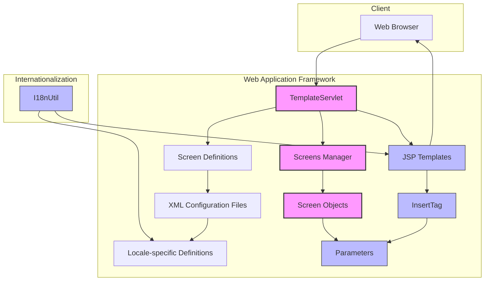
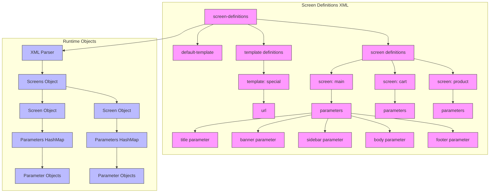
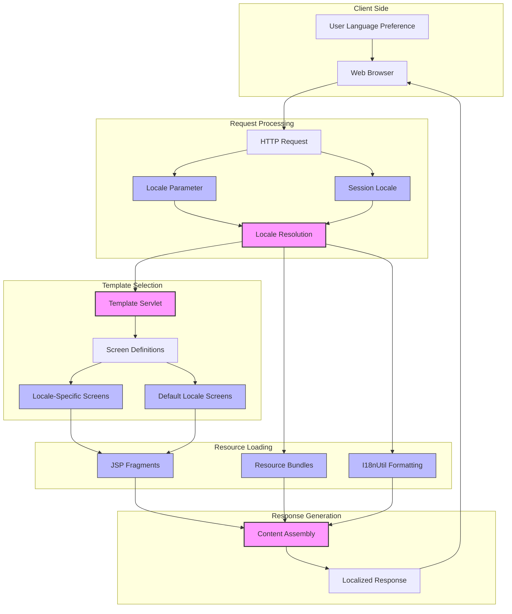
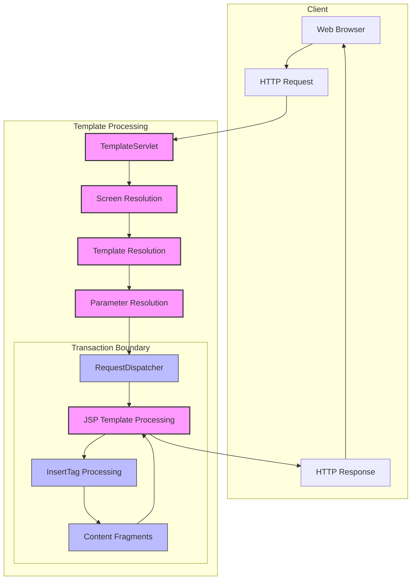

# View Templating System in Java Pet Store 1.3.2

## Introduction to the View Templating System

The Java Pet Store's view templating system represents a sophisticated approach to web application development that effectively separates presentation logic from content. This architectural pattern enables developers to create modular and maintainable web interfaces while supporting internationalization requirements. The system is built around a core set of components that work together to define screen layouts, manage parameters, and render dynamic content. By abstracting the presentation layer through templates, the Pet Store application achieves a high degree of flexibility, allowing different views to share common layouts while varying their content. This separation of concerns facilitates easier maintenance, enables consistent styling across the application, and provides robust support for multiple languages through locale-specific screen definitions.

## Architecture and Core Components

The view templating system's architecture is built on three primary components: Screen, Parameter, and Screens classes. The Screen class represents a single view in the application, containing a name, an optional template reference, and a collection of parameters stored in a HashMap. Each Parameter object encapsulates a key-value pair along with a boolean flag indicating whether the value should be used directly (as literal text) or indirectly (as a reference to another resource). The Screens class serves as a container and manager for multiple Screen objects, maintaining mappings between screen names and their definitions, as well as between template names and their URLs. This class also provides a default template fallback mechanism when a specific template is not defined for a screen. Together, these components form a flexible foundation that allows the application to define and manage screen layouts and content in a structured manner. The TemplateServlet acts as the controller in this architecture, processing HTTP requests, determining the appropriate screen and template, and handling the rendering process with transaction management support.

## View Templating System Architecture

The diagram illustrates the architecture of the view templating system in Java Pet Store. At its core, the TemplateServlet processes incoming HTTP requests and determines which screen definition to use based on the URL and locale information. The Screens Manager maintains collections of Screen objects, each containing Parameters that define the content for different parts of the page. JSP templates use the InsertTag custom tag to dynamically include content based on these parameters. The system supports internationalization through locale-specific screen definition XML files and the I18nUtil class, which provides formatting utilities for different locales. This architecture enables a clean separation between the controller logic, view templates, and content fragments, making the application more maintainable and flexible.

## Template Servlet Implementation

The TemplateServlet class serves as the central controller for the view templating system, orchestrating the process of handling HTTP requests and rendering appropriate responses. Upon initialization, it loads screen definitions from XML configuration files for each supported locale, storing them in a HashMap keyed by language code. When processing a request, the servlet extracts the screen name from the URL path and determines the appropriate locale based on user preferences or request parameters. It then retrieves the corresponding Screen object and its template URL from the Screens collection. The servlet implements sophisticated state management capabilities, including caching previous screen attributes and parameters to support navigation history. This feature allows users to return to previous screens with their state intact. The servlet also wraps template rendering within UserTransaction boundaries to optimize local EJB access performance. Error handling is implemented throughout the process, with appropriate fallback mechanisms when screen definitions or templates cannot be found. The TemplateServlet effectively bridges the gap between HTTP requests and the templating system, ensuring that the correct content is rendered with the appropriate layout for each user interaction.

## Screen Definition XML Configuration

The screen definition XML files form the backbone of the view templating system's configuration. These files define the structure and content of each screen in the application using a declarative approach. Each file begins with a `<screen-definitions>` root element that specifies a default template path to be used when screens don't define their own template. Individual templates can be defined with unique names and associated URLs, allowing for specialized layouts for different purposes. The core of these files consists of `<screen>` elements, each with a unique name attribute that identifies a particular view in the application. Within each screen definition, multiple `<parameter>` elements specify the content fragments that will populate different regions of the template. Each parameter has a key (identifying its purpose in the template), a value (pointing to a JSP file or containing literal text), and a direct attribute (indicating whether the value should be used directly or as a resource reference). The system supports internationalization through locale-specific definition files (e.g., screendefinitions_en_US.xml, screendefinitions_ja_JP.xml), allowing different language versions to use different JSP fragments while maintaining consistent screen structures. This XML-based approach provides a clean separation between the definition of screen layouts and their implementation in JSP files.

## Screen Definition Structure

The diagram illustrates the structure of screen definitions in the Java Pet Store templating system. Screen definitions are organized in XML files that define both the overall structure and specific content for each screen in the application. The root element `<screen-definitions>` contains a default template declaration that serves as the fallback layout for all screens. Individual templates can be defined with unique names and URLs for specialized layouts. The bulk of the configuration consists of screen definitions, each with a unique name and a set of parameters. These parameters map specific regions of the template (like banner, sidebar, body, and footer) to content fragments, typically JSP files. At runtime, the XML is parsed into a hierarchy of Java objects: a Screens object containing multiple Screen objects, each with a HashMap of Parameter objects. This structure allows the templating system to efficiently retrieve the appropriate template and content fragments for any requested screen. The separation between definition and implementation enables easy maintenance and localization, as different language versions can use the same screen structure with different content files.

## Custom JSP Tags for Content Insertion

The InsertTag class is a pivotal component of the view templating system that enables dynamic content insertion into templates based on screen parameters. This custom JSP tag serves as the bridge between the template JSP files and the content fragments they need to incorporate. When a template includes the `<bp:insert>` tag with a parameter attribute, the InsertTag retrieves the corresponding Parameter object from the current Screen definition stored in the request. It then examines the Parameter's "direct" flag to determine how to process its value. If the flag is true, the tag directly outputs the parameter's value as text to the response stream. If false, the tag treats the value as a path to another JSP resource and uses RequestDispatcher to include that resource's rendered content in the current page. This mechanism provides remarkable flexibility, allowing templates to incorporate both literal text and dynamically generated content from other JSP files. The tag's implementation is optimized for performance, flushing any buffered content before processing and handling exceptions gracefully. By abstracting the content insertion process, InsertTag enables clean separation between the structural template and the specific content fragments it displays, making the system more maintainable and adaptable to different presentation requirements.

## Internationalization and Localization Support

The view templating system incorporates robust internationalization and localization support through a multi-layered approach. At its foundation, the system uses locale-specific screen definition XML files (e.g., screendefinitions_en_US.xml, screendefinitions_ja_JP.xml) that define different content fragments for each supported language. The TemplateServlet determines the appropriate locale from user preferences or explicit language selection parameters and loads the corresponding screen definitions. For formatting and text processing, the system leverages the I18nUtil class, which provides specialized methods for currency formatting, number formatting, and text manipulation with locale awareness. This utility class handles precision control for numeric displays, Japanese character encoding conversion, and locale-specific word boundary detection for keyword parsing. The templating system also supports resource bundles through properties files (e.g., petstore.properties, petstore_de.properties) that contain localized strings for UI elements. These resources are organized by functional area and include translations for action names, button labels, error messages, and other text elements. The combination of locale-specific screen definitions, specialized formatting utilities, and resource bundles enables the Pet Store application to present a fully localized user experience across multiple languages while maintaining consistent functionality and structure.

## Internationalization Flow

The diagram illustrates the internationalization flow in the Java Pet Store templating system. When a request arrives, the system first determines the appropriate locale through a multi-step resolution process: it checks for an explicit locale parameter in the request, falls back to a stored locale in the session, and defaults to the system's default locale if neither is available. The TemplateServlet then uses this locale information to select the appropriate screen definitions from locale-specific XML files. If definitions for the requested screen aren't available in the selected locale, the system falls back to the default locale's definitions. Once the screen definition is resolved, the system loads the appropriate JSP fragments, which may be locale-specific (stored in language-specific directories like /ja/ for Japanese) or shared across locales. During content rendering, the system uses ResourceBundles to retrieve localized text strings and the I18nUtil class to format numbers, currencies, and dates according to locale-specific patterns. This comprehensive approach ensures that users receive a fully localized experience, with appropriate language, formatting, and cultural adaptations throughout the interface.

## UI Component Integration

The view templating system seamlessly integrates with specialized UI components to create rich, interactive interfaces across both web and Swing environments. In the web interface, the templating system incorporates custom components like charts, tables, and panels through JSP fragments referenced in screen definitions. These components leverage the Parameter mechanism to receive configuration data and content from the templating system. For example, the BannerHelper class dynamically selects appropriate banner images based on the current product category, while custom renderers in table components apply conditional formatting based on data values. The system also supports more complex visualization components like the PieChartPanel and BarChartPanel, which render graphical representations of sales data with interactive tooltips. In the Swing-based admin client, UI components follow similar patterns but are implemented using Swing's component architecture. The TableSorter class enhances JTable with sorting capabilities, while specialized panels like OrdersApprovePanel and OrdersViewPanel provide task-specific interfaces with consistent styling. Both environments benefit from the templating system's separation of concerns, allowing UI components to focus on presentation while receiving their content and configuration from the templating framework. This integration strategy enables a consistent user experience across different interfaces while maintaining the modularity and maintainability of the codebase.

## Previous Screen State Management

The view templating system implements a sophisticated mechanism for caching and restoring previous screen states, enabling seamless navigation flows with preserved context. This functionality is primarily managed by the TemplateServlet, which can be configured to cache both request parameters and request attributes for each screen visited. When a user navigates to a new screen, the servlet stores the current screen's state (including parameters and attributes) in the session under special keys (WebKeys.PREVIOUS_SCREEN, WebKeys.PREVIOUS_REQUEST_PARAMETERS, and WebKeys.PREVIOUS_REQUEST_ATTRIBUTES). The system provides a special "PREVIOUS" screen identifier that, when requested, triggers the restoration of the previously cached state. This restoration process involves retrieving the previous screen name and repopulating the current request with the cached parameters and attributes. The caching behavior is configurable through servlet initialization parameters (cache_previous_screen_attributes and cache_previous_screen_parameters), allowing application developers to balance memory usage against navigation convenience. This state management capability is particularly valuable for multi-step processes where users may need to navigate back to previous screens without losing their input or context. It also supports common web patterns like form validation with error feedback, where users return to a form with both their original input and error messages preserved.

## Template Processing Sequence

The diagram illustrates the sequence of operations that occur when processing a request through the Java Pet Store templating system. When a request arrives from the browser, the TemplateServlet first extracts the screen name from the URL path and determines the appropriate locale based on user preferences or explicit parameters. It then resolves the Screen object corresponding to the requested screen name, falling back to the default locale if necessary. Once the Screen is identified, the servlet resolves the template URL associated with that screen, either from the screen's specific template or the default template. The servlet then prepares the request by adding the Screen object as an attribute and begins a transaction boundary for efficient EJB access. Within this boundary, the RequestDispatcher forwards the request to the JSP template. As the template processes, it encounters InsertTag instances (`<bp:insert>` tags) that dynamically include content based on the Screen's parameters. Each parameter may represent either direct text to be included or a path to another JSP fragment that needs to be processed and included. These content fragments may themselves contain additional tags and dynamic content. Once all content is assembled, the completed response is returned to the browser. This sequence demonstrates how the templating system separates the concerns of content selection, layout definition, and dynamic content generation while maintaining a cohesive process flow.

[Generated by the Sage AI expert workbench: 2025-03-29 21:37:00  https://sage-tech.ai/workbench]: #