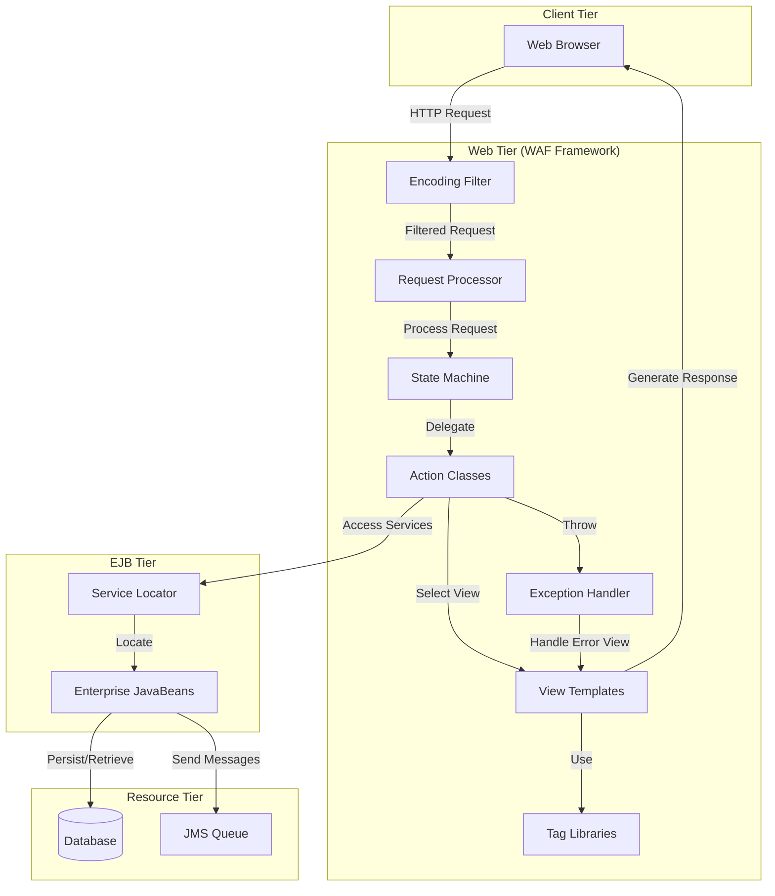
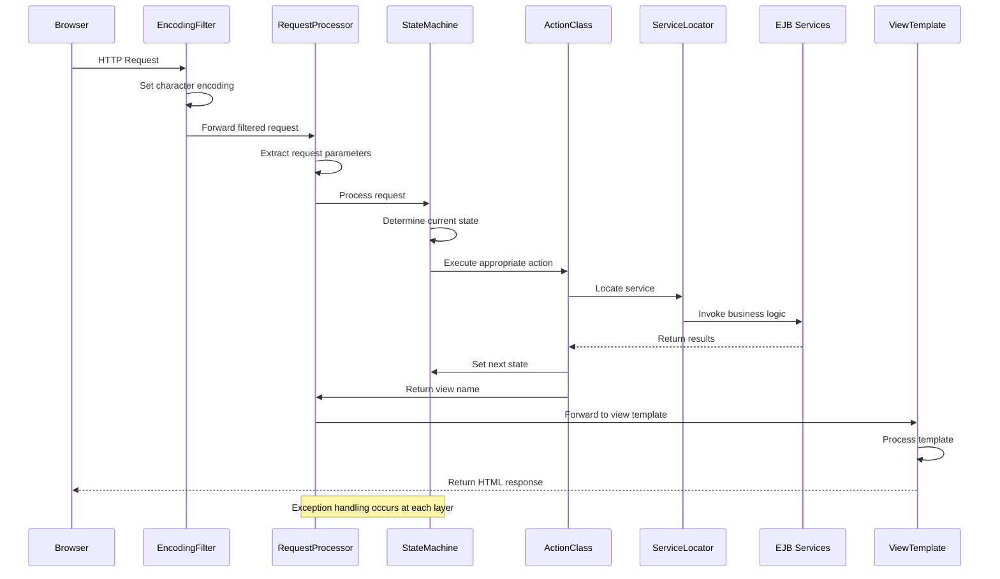
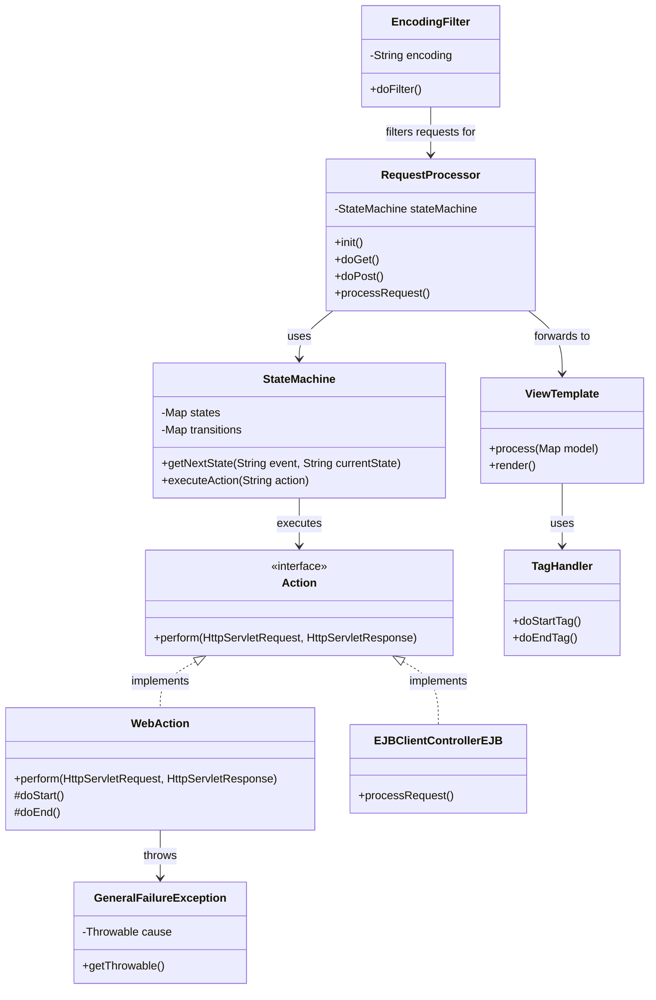
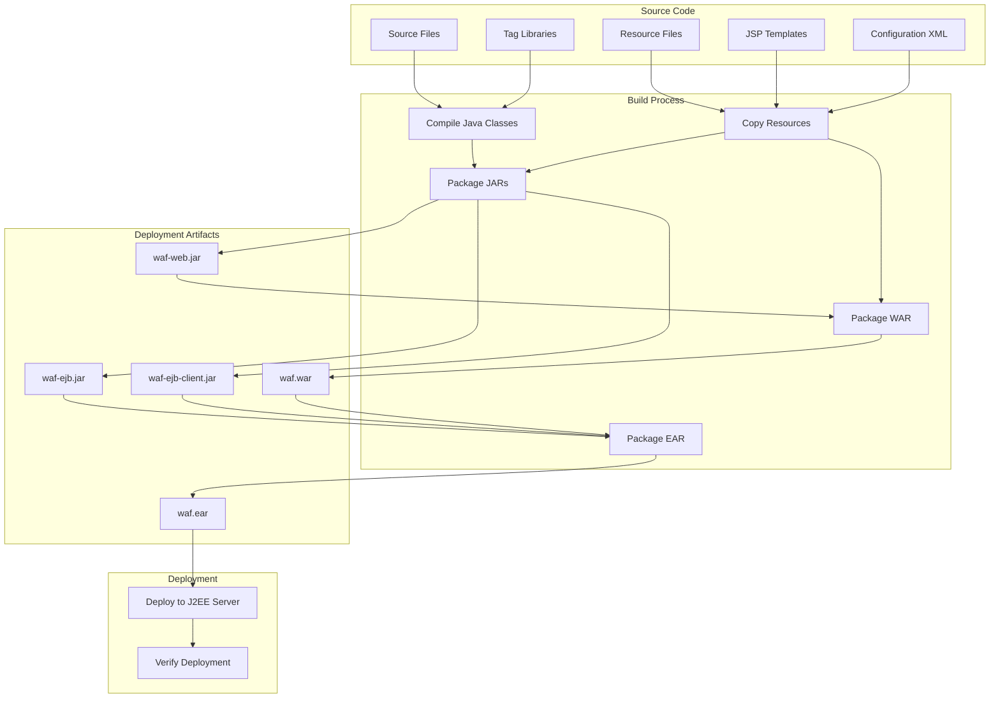

# Web Application Framework (WAF) in Java Pet Store 1.3.2

## Introduction to the Web Application Framework (WAF)

The Web Application Framework (WAF) in Java Pet Store 1.3.2 serves as a foundational architecture for building structured J2EE web applications following the Model-View-Controller (MVC) pattern. Designed as a reusable component, WAF provides a consistent approach to handling HTTP requests, processing business logic, and rendering dynamic content. The framework abstracts the complexities of servlet-based web development by offering standardized mechanisms for request handling, view templating, internationalization, and exception management.

WAF implements a front controller pattern where centralized request processors route incoming HTTP requests to appropriate action handlers, maintaining a clean separation between presentation logic and business processing. This architecture promotes code reusability, maintainability, and a clear division of responsibilities among development teams. The framework's modular design allows for independent development and testing of controllers, views, and business components, while providing integration points with other Pet Store subsystems like the admin and supplier applications.

## WAF Architecture Overview

The WAF architecture diagram illustrates the key components of the framework and their relationships. At the entry point, the Encoding Filter processes incoming HTTP requests to handle character encoding issues, particularly important for internationalization. The Request Processor serves as the front controller, receiving filtered requests and delegating them to the State Machine, which determines the appropriate Action Class to handle the request based on the current application state.

Action Classes contain the business logic for processing requests and interact with the EJB tier through the Service Locator pattern. After processing, they select the appropriate View Template for rendering the response. View Templates leverage custom Tag Libraries to generate dynamic HTML content. Throughout this flow, the Exception Handler manages errors, directing them to appropriate error views. This architecture provides a clean separation of concerns while maintaining a cohesive request processing pipeline.

## Controller Components

The controller layer in WAF forms the backbone of the request processing architecture, implementing a sophisticated front controller pattern. At its core is the RequestProcessor, which serves as the entry point for all HTTP requests. This servlet-based component receives incoming requests, extracts parameters, and manages the overall request lifecycle.

The RequestProcessor delegates to a StateMachine component, which maintains the application's navigational state and determines which actions should be executed based on the current state and incoming request. This state-based approach allows for complex workflows while maintaining clean separation between navigation logic and business processing.

Action handlers, implemented as discrete classes, encapsulate specific business logic operations. These handlers follow a command pattern, with each action performing a specific task and determining the next view to be rendered. The controller framework supports both web-based actions for synchronous processing and EJB-based actions for operations requiring transactional integrity.

A key strength of WAF's controller architecture is its extensibility. The framework provides base classes that can be extended to create application-specific controllers and actions. This inheritance-based approach ensures consistent behavior across the application while allowing for customization. The controller components also integrate with WAF's exception handling framework, with the GeneralFailureException serving as the base for web-specific runtime exceptions.

## Request Processing Flow

This sequence diagram illustrates the complete request processing flow in the WAF framework, from initial HTTP request to final HTML response. The process begins when a browser sends an HTTP request, which first passes through the EncodingFilter. This filter ensures proper character encoding is set, which is crucial for internationalization support.

The filtered request then reaches the RequestProcessor servlet, which extracts parameters and delegates processing to the StateMachine. The StateMachine determines the current application state and identifies the appropriate ActionClass to handle the request. The ActionClass contains the business logic and uses the ServiceLocator pattern to access EJB services.

After the business logic executes, the ActionClass sets the next application state and returns a logical view name to the RequestProcessor. The RequestProcessor then forwards the request to the appropriate ViewTemplate, which processes the template and generates the HTML response sent back to the browser.

Throughout this flow, exception handling occurs at each layer, with exceptions propagating up the stack until they're caught and handled appropriately. This comprehensive request processing architecture provides a robust foundation for building complex web applications with clear separation of concerns.

## View Templates and Rendering

The WAF templating system provides a sophisticated mechanism for generating dynamic web content while maintaining a clean separation between presentation and business logic. At its core, the templating system leverages JavaServer Pages (JSP) technology but extends it with a structured approach to template organization and processing.

Templates in WAF are organized hierarchically, with master templates defining the overall page structure and content templates focusing on specific functional areas. This approach promotes reuse and consistency across the application's user interface. The framework implements a template composition pattern, where multiple template fragments can be assembled into a complete page at runtime.

The template processing flow begins when the controller selects a logical view name. The WAF framework maps this logical name to a physical JSP template through a configurable view resolver. During rendering, templates have access to the request, session, and application contexts, allowing them to retrieve data placed there by controller components.

WAF's templating system supports dynamic content generation through expression evaluation, conditional rendering, and iterative processing. Templates can access data from various sources, including JavaBeans placed in the request by controllers, session attributes, and application-scoped resources. The framework also provides mechanisms for handling template inclusion and forwarding, enabling modular template composition.

A key feature of the WAF templating system is its integration with the framework's internationalization support. Templates can access localized resources through resource bundles, ensuring that the user interface adapts to different languages and regional settings. This integration is seamless, with the framework automatically selecting the appropriate resource bundle based on the user's locale.

## Custom Tag Libraries

The WAF framework includes a comprehensive set of custom JSP tag libraries that significantly simplify view development and promote the creation of reusable presentation components. These tag libraries extend the standard JSP tag functionality to provide higher-level abstractions specifically tailored for enterprise web applications.

The core tag library includes tags for conditional processing, iteration, and URL manipulation. Conditional tags enable template authors to include or exclude content based on runtime conditions, such as user roles or application state. Iteration tags provide efficient mechanisms for processing collections of data, such as search results or catalog items. URL manipulation tags handle the complexities of URL construction, including session tracking and parameter encoding.

Form handling tags simplify the creation and processing of HTML forms. These tags automatically populate form fields from model objects, handle form submission, and provide client-side validation capabilities. The form tags integrate with the WAF controller framework, streamlining the implementation of form-based workflows.

Layout tags support the implementation of consistent page structures across the application. These tags manage the inclusion of headers, footers, navigation elements, and content areas, enabling template authors to focus on specific content rather than repeating structural elements. The layout system supports nested layouts, allowing for complex page compositions.

Internationalization tags facilitate the display of localized content. These tags access resource bundles based on the user's locale, format dates, numbers, and currency values according to regional conventions, and handle bidirectional text rendering for languages like Arabic and Hebrew.

Security tags control access to content based on user authentication and authorization. These tags can show or hide elements based on user roles, ensuring that sensitive functionality is only exposed to authorized users.

By leveraging these custom tag libraries, developers can create sophisticated, dynamic web interfaces with minimal custom code, accelerating development and improving maintainability.

## Component Relationships

This class diagram illustrates the key relationships between WAF components. At the center is the RequestProcessor, which serves as the entry point for HTTP requests and coordinates the overall request processing flow. The RequestProcessor uses a StateMachine to determine which Action to execute based on the current state and incoming request.

The Action interface defines the contract for all action handlers, with WebAction providing a concrete implementation for web-tier processing and EJBClientControllerEJB supporting EJB-based actions. After action execution, the RequestProcessor forwards to the appropriate ViewTemplate for rendering.

ViewTemplates use TagHandlers from custom tag libraries to generate dynamic content. Throughout the processing flow, components may throw GeneralFailureException (or its subclasses) to signal error conditions. The EncodingFilter sits at the front of the request processing pipeline, ensuring proper character encoding before requests reach the RequestProcessor.

This architecture demonstrates clear separation of concerns with well-defined interfaces between components. The relationships follow established design patterns like Front Controller (RequestProcessor), Command (Action), and Template Method (WebAction), creating a flexible and extensible framework for web application development.

## Exception Handling Framework

The WAF exception handling framework provides a comprehensive approach to managing errors that occur during request processing. At its foundation is the GeneralFailureException class, which serves as the base for all web runtime exceptions in the framework. This class extends RuntimeException and implements Serializable, allowing exception objects to be passed between JVM instances or persisted when necessary.

GeneralFailureException provides two key constructors: one accepting only an error message string and another accepting both a message and a Throwable object. This design allows exceptions to wrap lower-level exceptions, preserving the original error context while adding application-specific information. The getThrowable() method returns a formatted message containing the nested exception's message, facilitating detailed error reporting.

The exception handling framework integrates with the controller components through a structured approach to error processing. When exceptions occur during action execution, they propagate up the call stack until they reach the RequestProcessor, which implements centralized exception handling logic. The processor can map specific exception types to appropriate error views, ensuring consistent error presentation.

For unrecoverable errors, the framework provides mechanisms to log detailed diagnostic information while presenting user-friendly error messages. This separation between internal error details and user-facing messages is crucial for both security and usability. The framework also supports different error handling strategies based on the deployment environment, with more detailed information available in development environments and sanitized messages in production.

The exception framework extends beyond the web tier to handle errors that originate in the business tier. EJB-specific exceptions are wrapped in appropriate WAF exceptions before being presented to the user, ensuring consistent error handling regardless of where the error originates. This approach simplifies error management across the application's tiers and provides a unified experience for end users.

## Internationalization Support

The WAF framework provides robust internationalization support, enabling applications to adapt to different languages, regional settings, and cultural conventions. At the infrastructure level, the EncodingFilter component plays a crucial role by ensuring proper character encoding for HTTP requests and responses. This filter intercepts all incoming requests, sets the appropriate character encoding (typically UTF-8), and ensures that multilingual content is correctly processed throughout the request lifecycle.

Resource bundles form the core of WAF's localization strategy. The framework uses Java's ResourceBundle mechanism to store locale-specific strings and resources. These bundles are organized hierarchically, with fallback mechanisms that default to more general locales when specific translations are unavailable. The framework automatically selects the appropriate resource bundle based on the user's locale, which can be determined from browser settings, user preferences, or explicit selection.

The view templating system integrates seamlessly with internationalization support. Templates can access localized resources through expression language or custom tags, separating translatable content from presentation logic. This approach simplifies the localization process, as translators can focus on resource files without modifying application code.

Date, time, number, and currency formatting is handled through locale-aware formatters. These components ensure that values are presented according to regional conventions, such as date formats (MM/DD/YYYY vs. DD/MM/YYYY), decimal separators (period vs. comma), and currency symbols.

For complex localization requirements, the framework supports message formatting with parameter substitution. This capability allows for grammatically correct sentences in different languages, where word order and inflection may vary based on parameters like gender, number, or case.

The internationalization architecture also addresses bidirectional text rendering for languages like Arabic and Hebrew, which read from right to left. The framework ensures proper text direction handling in both the user interface and data processing components.

## Build and Deployment Process

The WAF build and deployment process follows a structured approach to transform source code into deployable J2EE components. The process begins with source files, including Java classes, resource files, JSP templates, tag libraries, and XML configuration files. These are processed through a multi-stage build pipeline managed by Apache Ant.

The first stage compiles Java source files into class files, including controller components, tag handlers, and utility classes. Simultaneously, resource files, JSP templates, and configuration XML are copied to appropriate locations in the build directory structure.

The compiled classes and resources are then packaged into several JAR files with specific purposes: waf-web.jar contains web-tier components including controllers and tag libraries, waf-ejb.jar contains EJB components, and waf-ejb-client.jar contains client-side interfaces for EJB access. The build process also incorporates third-party dependencies like the Base64 encoder/decoder.

These JAR files, along with JSP templates and web configuration files, are packaged into waf.war, which represents the web application component. Finally, all components are assembled into waf.ear, the Enterprise Archive that serves as the complete deployable unit.

Deployment leverages the J2EE deployment tool, which is invoked programmatically through Ant to deploy the EAR to the J2EE server. The process includes verification steps to ensure successful deployment.

This sophisticated build and deployment pipeline ensures consistent packaging of WAF components and simplifies the deployment process across different environments.

## Integration with Application Components

The WAF framework serves as the foundation for multiple application components within the Java Pet Store, including the main storefront, admin interface, and supplier applications. Each of these components leverages WAF's architecture while implementing domain-specific functionality.

In the admin application, WAF provides the web infrastructure for managing the pet store catalog, inventory, and orders. The admin interface extends WAF's controller framework with specialized action handlers for administrative operations. It also leverages WAF's view templating system for rendering administrative interfaces, with custom components like the StatusBar providing application-specific UI elements.

The supplier application demonstrates WAF's flexibility in supporting different interaction patterns. This application processes incoming orders and updates inventory, requiring both synchronous web interfaces and asynchronous message processing. WAF's architecture accommodates these requirements through its controller framework and integration with JMS components.

Integration between WAF and application components occurs at multiple levels. At the code level, application-specific controllers extend WAF base classes, inheriting common functionality while adding specialized behavior. View templates follow WAF conventions but incorporate application-specific content and styling. The exception handling framework is extended with domain-specific exceptions that preserve WAF's consistent error management approach.

Configuration integration is achieved through XML descriptors that define application-specific navigation rules, action mappings, and view resolutions. These configurations extend WAF's core functionality without modifying the framework itself, demonstrating the framework's extensibility.

Data exchange between WAF and application components follows established patterns, with controllers placing model objects in the request or session scope for access by view templates. This approach maintains clean separation between presentation and business logic while enabling rich data display.

The build and deployment process integrates WAF components with application-specific artifacts, creating cohesive deployable units. This integration ensures that framework updates can be propagated consistently across all application components, simplifying maintenance and evolution.

## Best Practices and Design Patterns

The WAF framework exemplifies several key design patterns and best practices for J2EE web development. At its architectural core, WAF implements the Model-View-Controller (MVC) pattern, providing clear separation between business logic, presentation, and control flow. This separation enhances maintainability, testability, and the ability to evolve each layer independently.

The Front Controller pattern is evident in the RequestProcessor, which centralizes request handling and provides a single entry point for HTTP requests. This approach ensures consistent processing, security enforcement, and logging across the application. The Command pattern appears in the Action interface and its implementations, encapsulating request handling logic in discrete, reusable components.

WAF leverages the Template Method pattern in its base controller classes, defining the skeleton of request processing while allowing subclasses to override specific steps. This promotes code reuse while enabling customization. The Singleton pattern, demonstrated in components like StatusBar, ensures that certain objects have only one instance throughout the application lifecycle.

The Service Locator pattern decouples service consumers from service implementation details, simplifying access to EJB components and other resources. This pattern enhances maintainability by centralizing resource lookup logic and providing a consistent interface for service access.

Best practices evident in WAF include:

1. **Layered Architecture**: Clear separation between presentation, control, business, and data access layers.

2. **Exception Handling**: Comprehensive exception management with appropriate propagation, logging, and user feedback.

3. **Internationalization by Design**: Built-in support for multiple languages and regional settings from the ground up.

4. **Configuration over Convention**: Externalized configuration through XML descriptors rather than hard-coded behavior.

5. **Component-Based Development**: Modular design with well-defined interfaces between components.

6. **Consistent Build and Deployment**: Standardized processes for building and deploying application components.

7. **Separation of Concerns**: Each component has a single, well-defined responsibility.

These patterns and practices make WAF a robust foundation for enterprise web applications, demonstrating J2EE best practices while providing practical solutions to common web development challenges.

[Generated by the Sage AI expert workbench: 2025-03-29 21:37:00  https://sage-tech.ai/workbench]: #