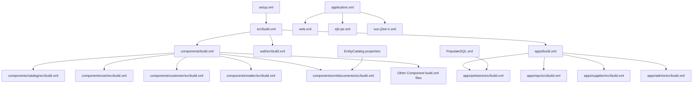
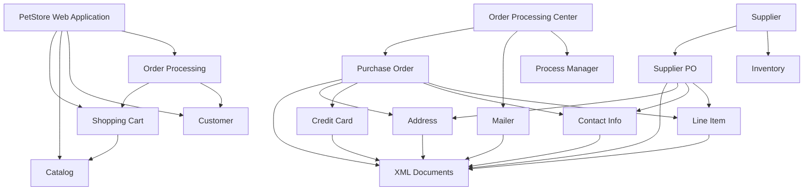
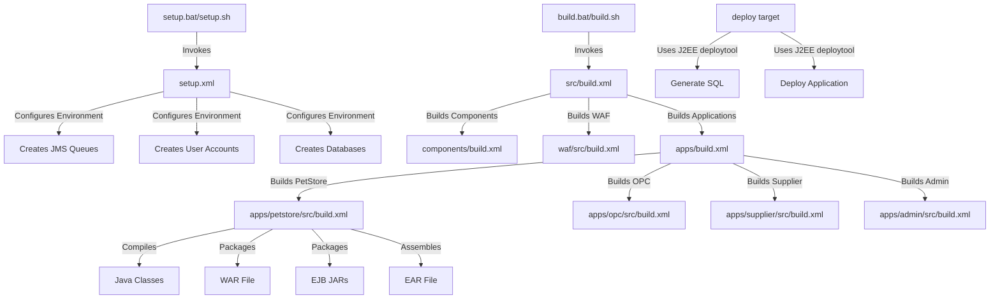
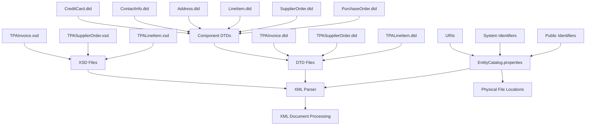

# XML Configuration Management in Java Pet Store 1.3.2

## Introduction to XML Configuration in Java Pet Store

The Java Pet Store 1.3.2 application extensively leverages XML configuration to manage deployment, build processes, and component relationships. This approach reflects the J2EE 1.3 era's best practices, where XML was the primary mechanism for configuring enterprise applications. Throughout the codebase, XML is used to define application structure, component dependencies, deployment settings, and build processes. The application uses multiple types of XML configuration files including J2EE deployment descriptors (application.xml, web.xml, ejb-jar.xml), server-specific configuration files (sun-j2ee-ri.xml), Ant build scripts (build.xml), and custom XML files for database operations (PopulateSQL.xml). This comprehensive XML configuration approach provides flexibility, allowing the application to be deployed across different environments and database platforms while maintaining a consistent architecture.

## Build System Configuration with Ant

Java Pet Store 1.3.2 employs Apache Ant 1.4.1 as its primary build tool, using XML-based build scripts to define the entire build process. The build system is organized hierarchically, with a top-level build.xml file that delegates to component-specific build files. This structure enables both building the entire application and individual components.

The build configuration uses property files (build.properties) alongside XML to separate environment-specific settings from build logic. Key aspects of the Ant configuration include:

1. **Hierarchical Build Structure**: The top-level build.xml delegates to component-specific build files in directories like components/catalog/src/build.xml and apps/petstore/src/build.xml.

2. **Property Management**: Environment-specific settings are externalized in build.properties files, which define server connection parameters, script suffixes for cross-platform compatibility, and compilation options.

3. **Component Dependencies**: Each component's build.xml defines dependencies on other components, ensuring they are built in the correct order.

4. **Cross-Platform Support**: The build scripts use platform-specific script suffixes (.bat for Windows, no suffix for Unix) defined in properties files to ensure cross-platform compatibility.

5. **Target Organization**: Common targets like 'core', 'clean', 'deploy', and 'docs' are consistently implemented across components, providing a uniform build interface.

The build system serves as the foundation for compiling, packaging, and deploying the application, with XML configuration defining each step of the process.

## XML Configuration Hierarchy



The XML configuration in Java Pet Store follows a hierarchical structure that reflects both the build process and the application's runtime configuration. At the top level, setup.xml initializes the environment, while src/build.xml orchestrates the overall build process. This delegates to component-specific build files organized by functional area. 

The deployment descriptors follow a similar hierarchy, with application.xml defining the overall application structure, which references web.xml for web components and ejb-jar.xml for EJB components. Server-specific configurations are handled by sun-j2ee-ri.xml files. The EntityCatalog.properties file maps XML schemas and DTDs to their physical locations, supporting the XML document processing in the xmldocuments component. Database configuration is managed through PopulateSQL.xml, which contains database-specific SQL statements.

This hierarchical approach allows for modular development and deployment, with each component maintaining its own configuration while integrating into the larger application structure.

## J2EE Deployment Descriptors

Java Pet Store 1.3.2 relies heavily on J2EE deployment descriptors to define its application structure, components, and their relationships. These XML files conform to the J2EE 1.3 specifications and include:

1. **application.xml**: This is the main deployment descriptor for each application module (PetStore, OPC, Supplier, Admin). It defines the module structure, including:
   - EJB modules with their JAR file locations
   - Web modules with their WAR file locations and context roots
   - Security roles applicable to the application

2. **web.xml**: These descriptors configure the web components of each application module, defining:
   - Servlets and their mappings
   - Filters for encoding and authentication
   - Session configuration
   - Security constraints and authentication methods
   - EJB references connecting web components to EJBs
   - Resource references for database connections
   - Environment entries for application configuration

3. **ejb-jar.xml**: These files define the Enterprise JavaBeans in each module, specifying:
   - Session beans, entity beans, and message-driven beans
   - Container-managed persistence fields and relationships
   - Transaction attributes
   - Security roles
   - Environment entries for bean configuration

The deployment descriptors provide a declarative approach to application configuration, allowing the application server to understand the structure and requirements of the application without requiring code changes. This separation of configuration from code was a cornerstone of J2EE development, enabling the same application to be deployed in different environments with only configuration changes.

## Server-Specific Configuration

The Java Pet Store 1.3.2 application uses sun-j2ee-ri.xml files to provide J2EE Reference Implementation specific settings for deployment. These XML files complement the standard J2EE deployment descriptors by adding server-specific configuration details that are not covered by the J2EE specification.

Key aspects of these server-specific configurations include:

1. **JNDI Mappings**: The sun-j2ee-ri.xml files map logical EJB references from web.xml and ejb-jar.xml to actual JNDI names in the application server. For example:
   ```xml
   <ejb-ref>
     <ejb-ref-name>ejb/ClientController</ejb-ref-name>
     <jndi-name>ejb/waf/waf/ClientController</jndi-name>
   </ejb-ref>
   ```

2. **Resource References**: Database connections, JMS queues, and other resources are mapped to their JNDI implementations:
   ```xml
   <resource-ref>
     <res-ref-name>jdbc/PetstoreDB</res-ref-name>
     <jndi-name>jdbc/Petstore</jndi-name>
   </resource-ref>
   ```

3. **CMP Database Mappings**: For Container-Managed Persistence entity beans, these files define SQL statements for database operations:
   ```xml
   <sql-statement>
     <operation>loadRow</operation>
     <sql>SELECT "categoryId", "itemId" FROM "LineItemEJBTable" WHERE "__PMPrimaryKey" = ?</sql>
   </sql-statement>
   ```

4. **Security Role Mappings**: They map J2EE security roles to server-specific principals and groups:
   ```xml
   <rolemapping>
     <role name="administrator">
       <principals>
         <principal><name>jps_admin</name></principal>
       </principals>
       <groups>
         <group name="administrator_group" />
       </groups>
     </role>
   </rolemapping>
   ```

These server-specific configurations allow the application to leverage features of the J2EE Reference Implementation while maintaining portability through the standard deployment descriptors. They provide the bridge between the abstract J2EE component model and the concrete implementation in the application server.

## Component Dependency Management



The XML configuration in Java Pet Store 1.3.2 manages complex dependencies between components through various mechanisms. The diagram above illustrates the key component relationships that are defined and managed through XML configuration.

The component dependencies are primarily managed through:

1. **Build Dependencies**: Component build.xml files define dependencies on other components, ensuring they are built in the correct order. For example, the cart component depends on catalog, and the supplier component depends on supplierpo.

2. **EJB References**: In web.xml and ejb-jar.xml files, EJB references define dependencies between components:
   ```xml
   <ejb-local-ref>
     <ejb-ref-name>ejb/ShoppingCart</ejb-ref-name>
     <local>com.sun.j2ee.blueprints.cart.ejb.ShoppingCartLocal</local>
     <ejb-link>ShoppingCartEJB</ejb-link>
   </ejb-local-ref>
   ```

3. **JAR Manifests**: Component JAR files use manifest files to declare dependencies:
   ```
   Manifest-Version: 1.0
   Class-Path: xmldocuments.jar
   ```

4. **EAR Assembly**: The application.xml files define which modules are included in each application, establishing the high-level component structure.

This XML-based dependency management ensures that components are built, packaged, and deployed in the correct order, with all necessary references properly resolved. It allows the application to be modular while maintaining the integrity of component relationships.

## Database Configuration Abstraction

Java Pet Store 1.3.2 uses XML configuration to achieve database portability through files like PopulateSQL.xml. This approach allows the application to work with different database systems without code changes, by defining database-specific SQL statements in XML.

The PopulateSQL.xml file is a prime example of this abstraction, containing SQL statements for different database types:

```xml
<PopulateSQL>
  <DatabaseStatements database="cloudscape">
    <TableStatements table="category">
      <CheckStatement>
        select * from category
      </CheckStatement>
      <CreateStatement>
        create table category (catid char(10) not null,
          constraint pk_category primary key (catid))
      </CreateStatement>
      <InsertStatement>
        insert into category values (?)
      </InsertStatement>
      <DropStatement>
        drop table category
      </DropStatement>
    </TableStatements>
    <!-- More table statements -->
  </DatabaseStatements>
  
  <DatabaseStatements database="oracle">
    <!-- Oracle-specific SQL statements -->
  </DatabaseStatements>
</PopulateSQL>
```

This XML structure allows the application to:

1. **Support Multiple Databases**: By including SQL statements for different database types (Cloudscape, Oracle) in the same file.

2. **Abstract Database Operations**: Defining standard operations (check, create, insert, drop) that are implemented differently for each database.

3. **Parameterize SQL**: Using placeholders (?) in SQL statements that are replaced with actual values at runtime.

4. **Maintain Schema Consistency**: Ensuring that the same database schema is created regardless of the underlying database system.

The database type is configured through environment entries in web.xml:

```xml
<env-entry>
  <env-entry-name>param/DatabaseName</env-entry-name>
  <env-entry-value>cloudscape</env-entry-value>
  <env-entry-type>java.lang.String</env-entry-type>
</env-entry>
```

This XML-based database configuration abstraction allows the Pet Store application to be deployed on different database systems without code changes, simply by selecting the appropriate database type in the configuration.

## Build Process Flow



The build process for Java Pet Store 1.3.2 is orchestrated through a series of XML-based Ant scripts that are invoked by shell or batch scripts. The flow begins with environment setup and proceeds through component compilation, packaging, and deployment.

1. **Environment Setup**:
   - The process begins with setup.bat/setup.sh invoking setup.xml
   - setup.xml configures the J2EE environment by creating JMS queues, user accounts, and databases
   - This prepares the environment for application deployment

2. **Build Initialization**:
   - build.bat/build.sh scripts invoke src/build.xml with the appropriate target
   - build.xml loads properties from build.properties and user-specific properties
   - It establishes classpaths and environment variables needed for the build

3. **Component Building**:
   - The build process follows a hierarchical structure:
     - src/build.xml delegates to components/build.xml, waf/src/build.xml, and apps/build.xml
     - Each of these further delegates to component-specific build files
   - Components are built in dependency order, ensuring prerequisites are built first

4. **Application Assembly**:
   - For each application (PetStore, OPC, Supplier, Admin):
     - Java classes are compiled
     - EJB JAR files are created with appropriate deployment descriptors
     - WAR files are assembled with web resources and client libraries
     - EAR files are created containing all necessary modules

5. **Deployment**:
   - The deploy target uses the J2EE deploytool to:
     - Generate SQL for database tables based on CMP entity beans
     - Deploy the application to the J2EE server
   - The undeploy target removes applications from the server

This XML-driven build process provides a consistent, repeatable way to build and deploy the application across different environments, with configuration properties allowing for customization without changing the build scripts themselves.

## Environment-Specific Configuration

Java Pet Store 1.3.2 uses a combination of build.properties files and environment variables alongside XML configuration to customize deployment for different environments. This approach separates environment-specific settings from the application code and build logic, making it easier to deploy the application in different environments.

Key aspects of environment-specific configuration include:

1. **Property Files**:
   - The main src/build.properties file defines default settings:
     ```properties
     j2ee.server.name=localhost
     j2ee.server.port=8000
     javac.debug=off
     ```
   - User-specific overrides can be placed in ${user.home}/petstore.properties
   - These properties are loaded by Ant build scripts and used throughout the build process

2. **Environment Variables**:
   - JAVA_HOME and J2EE_HOME environment variables must be set before building
   - Setup scripts (setup.bat/setup.sh) check for these variables and provide meaningful error messages if they're missing
   - The PATH variable is also used to locate Java if JAVA_HOME isn't set

3. **Platform-Specific Settings**:
   - Script suffixes are configured based on the platform:
     ```properties
     # Unix
     j2ee-script-suffix=
     jwsdp-script-suffix=.sh
     
     # Windows
     #j2ee-script-suffix=.bat
     #jwsdp-script-suffix=.bat
     ```
   - These settings are used to invoke the correct scripts for the platform

4. **Database Configuration**:
   - The database type is configured through environment entries in web.xml:
     ```xml
     <env-entry>
       <env-entry-name>param/DatabaseName</env-entry-name>
       <env-entry-value>cloudscape</env-entry-value>
       <env-entry-type>java.lang.String</env-entry-type>
     </env-entry>
     ```
   - SQL statements for different database types are defined in PopulateSQL.xml

5. **Server-Specific Configuration**:
   - sun-j2ee-ri.xml files provide J2EE Reference Implementation specific settings
   - These can be customized for different server environments

This approach to environment-specific configuration allows the Pet Store application to be deployed in development, testing, and production environments with minimal changes to the application itself. The XML configuration files provide the structure, while properties files and environment variables provide the environment-specific values.

## Internationalization Support

Java Pet Store 1.3.2 implements internationalization (i18n) support through a combination of XML configuration and resource files. The application supports multiple languages including English, Japanese, and Chinese, with a flexible architecture that allows adding more languages.

The internationalization approach includes:

1. **Locale-Specific Resource Organization**:
   - Resource files are organized in locale-specific directories
   - For example, JSP pages are organized as:
     - `/docroot/index.jsp` (default/English)
     - `/docroot/ja/index.jsp` (Japanese)
     - `/docroot/zh/index.jsp` (Chinese)

2. **Database Content Localization**:
   - The database schema includes locale-specific tables for content:
     ```xml
     <TableStatements table="category_details">
       <CreateStatement>
         create table category_details (catid char(10) not null,
           name varchar(80) not null, image varchar(255) null,
           descn varchar(255) null, locale char(10) not null,
           constraint pk_category_details primary key (catid, locale),
           constraint fk_category_details_1 foreign key (catid)
           references category (catid))
       </CreateStatement>
     </TableStatements>
     ```
   - This allows storing product information in multiple languages

3. **Character Encoding Configuration**:
   - The EncodingFilter is configured in web.xml to ensure proper character handling:
     ```xml
     <filter>
       <filter-name>EncodingFilter</filter-name>
       <filter-class>com.sun.j2ee.blueprints.encodingfilter.web.EncodingFilter</filter-class>
       <init-param>
         <param-name>encoding</param-name>
         <param-value>UTF-8</param-value>
       </init-param>
     </filter>
     ```

4. **Documentation Localization**:
   - Documentation is provided in multiple languages:
     - `/docs/configuring.html` (English)
     - `/docs/ja/configuring.html` (Japanese)
     - `/docs/zh/configuring.html` (Chinese)

5. **Adding New Languages**:
   - The documentation provides instructions for adding new languages:
     - Create locale-specific JSP directories
     - Add locale-specific catalog data to the database
     - Create locale-specific resource bundles

This XML-driven internationalization approach allows the Pet Store application to serve users in multiple languages while maintaining a consistent codebase. The separation of locale-specific resources from the application logic makes it easier to add support for new languages without changing the core application.

## Security Configuration

Java Pet Store 1.3.2 implements security through XML configuration in deployment descriptors, defining security constraints, role mappings, and authentication mechanisms. This declarative approach to security allows for consistent enforcement of access controls across the application.

Key aspects of the security configuration include:

1. **Security Roles**:
   - Defined at the application level in application.xml:
     ```xml
     <security-role>
       <role-name>administrator</role-name>
     </security-role>
     ```
   - Used in web.xml and ejb-jar.xml to restrict access to resources

2. **Web Security Constraints**:
   - Defined in web.xml to protect specific URL patterns:
     ```xml
     <security-constraint>
       <web-resource-collection>
         <web-resource-name>MySecureBit0</web-resource-name>
         <url-pattern>/AdminRequestProcessor</url-pattern>
         <http-method>GET</http-method>
         <http-method>POST</http-method>
       </web-resource-collection>
       <auth-constraint>
         <role-name>administrator</role-name>
       </auth-constraint>
       <user-data-constraint>
         <transport-guarantee>NONE</transport-guarantee>
       </user-data-constraint>
     </security-constraint>
     ```

3. **Authentication Configuration**:
   - Form-based authentication is configured in web.xml:
     ```xml
     <login-config>
       <auth-method>FORM</auth-method>
       <realm-name>default</realm-name>
       <form-login-config>
         <form-login-page>/login.jsp</form-login-page>
         <form-error-page>/error.jsp</form-error-page>
       </form-login-config>
     </login-config>
     ```

4. **Role Mapping**:
   - Server-specific role mappings in sun-j2ee-ri.xml:
     ```xml
     <rolemapping>
       <role name="administrator">
         <principals>
           <principal>
             <name>jps_admin</name>
           </principal>
         </principals>
         <groups>
           <group name="administrator_group" />
         </groups>
       </role>
     </rolemapping>
     ```

5. **EJB Security**:
   - Method permissions in ejb-jar.xml restrict access to EJB methods:
     ```xml
     <method-permission>
       <role-name>administrator</role-name>
       <method>
         <ejb-name>OPCAdminFacadeEJB</ejb-name>
         <method-name>*</method-name>
       </method>
     </method-permission>
     ```

6. **SignOnFilter**:
   - Custom authentication filter configured in web.xml:
     ```xml
     <filter>
       <filter-name>SignOnFilter</filter-name>
       <filter-class>com.sun.j2ee.blueprints.signon.web.SignOnFilter</filter-class>
     </filter>
     ```

The SignOnDAO class parses XML configuration to extract security constraints and protected resources, building a security model that can be enforced at runtime. This XML-driven security configuration provides a flexible, declarative approach to securing the application, allowing security policies to be modified without changing application code.

## XML Schema Management



Java Pet Store 1.3.2 employs a sophisticated XML schema management system to handle the various XML documents used throughout the application. The EntityCatalog.properties file serves as the central registry that maps XML schema identifiers to their physical locations in the system.

The EntityCatalog.properties file contains mappings in three main categories:

1. **Old DTDs**: Legacy document type definitions used in earlier versions:
   ```properties
   -//Sun\ Microsystems,\ Inc.\ -\ J2EE\ Blueprints\ Group//DTD\ Invoice\ 1.0//EN: /schemas/Invoice.dtd
   -//Sun\ Microsystems,\ Inc.\ -\ J2EE\ Blueprints\ Group//DTD\ Purchase\ Order\ 1.0//EN: /schemas/PurchaseOrder.dtd
   ```

2. **TPA DTDs and XSDs**: Trading Partner Agreement schemas in both DTD and XSD formats:
   ```properties
   -//Sun\ Microsystems,\ Inc.\ -\ J2EE\ Blueprints\ Group//DTD\ TPA-LineItem\ 1.0//EN: /com/sun/j2ee/blueprints/xmldocuments/rsrc/schemas/TPALineItem.dtd
   http\://blueprints.j2ee.sun.com/TPALineItem: /com/sun/j2ee/blueprints/xmldocuments/rsrc/schemas/TPALineItem.xsd
   ```

3. **Component/Composite DTDs**: Modular schemas for reusable components:
   ```properties
   -//Sun\ Microsystems,\ Inc.\ -\ J2EE\ Blueprints\ Group//DTD\ LineItem\ 1.1//EN: /com/sun/j2ee/blueprints/lineitem/rsrc/schemas/LineItem.dtd
   -//Sun\ Microsystems,\ Inc.\ -\ J2EE\ Blueprints\ Group//DTD\ Address\ 1.1//EN: /com/sun/j2ee/blueprints/address/rsrc/schemas/Address.dtd
   ```

This catalog system provides several benefits:

1. **Location Independence**: XML documents can reference schemas using public identifiers or URIs without knowing their physical location.

2. **Version Management**: Different versions of schemas can be maintained and referenced appropriately.

3. **Offline Processing**: External schemas can be cached locally, allowing processing without network access.

4. **Format Flexibility**: Both DTD and XSD formats are supported, allowing for gradual migration.

The XML schema management system is used by the XMLDocuments component, which handles XML document processing for purchase orders, supplier orders, invoices, and other business documents. This component uses JAXP (Java API for XML Processing) to parse and validate XML documents against the schemas registered in the EntityCatalog.

This approach to XML schema management ensures consistent validation and processing of XML documents throughout the application, while providing flexibility to evolve the schemas over time.

[Generated by the Sage AI expert workbench: 2025-03-29 21:37:00  https://sage-tech.ai/workbench]: #