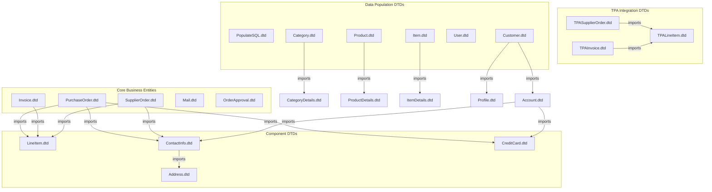
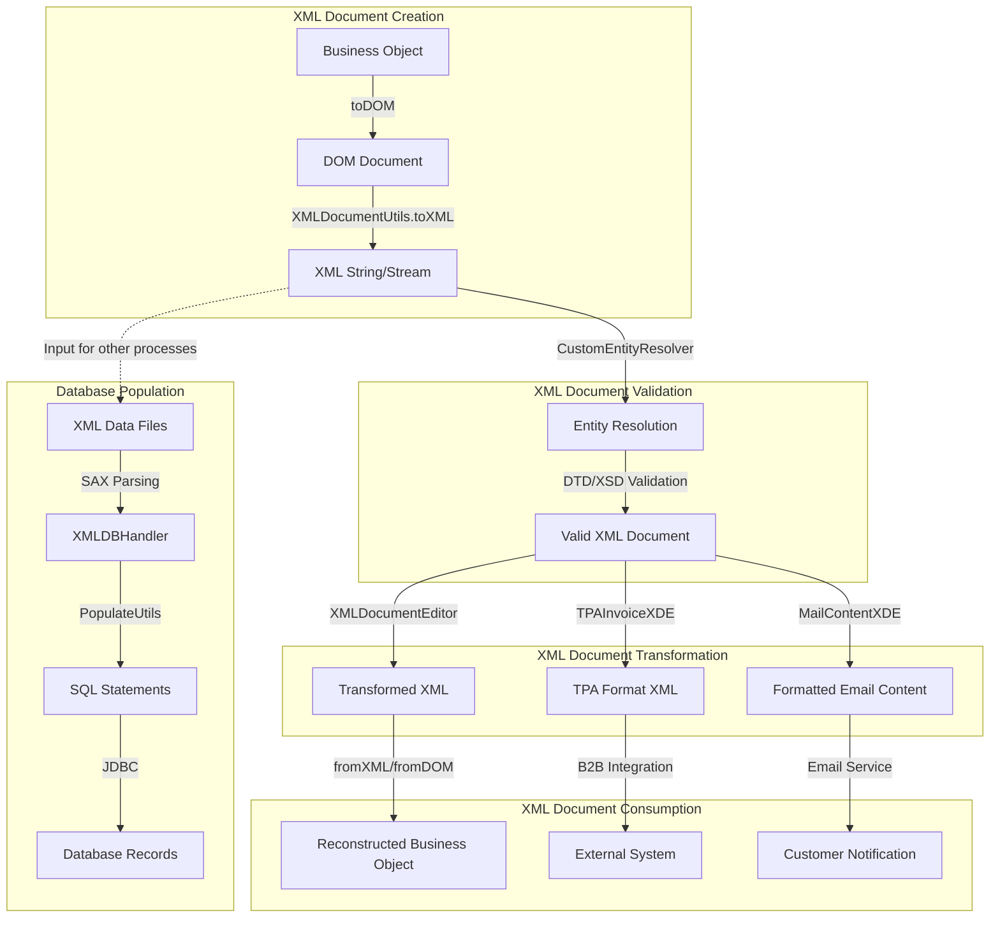
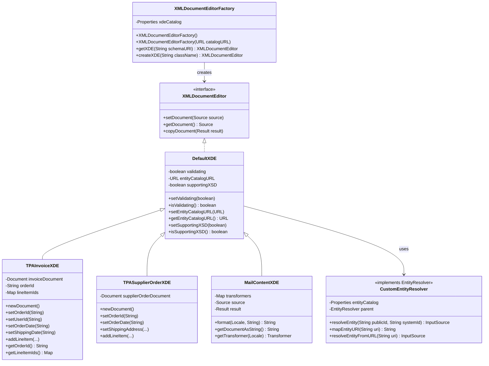
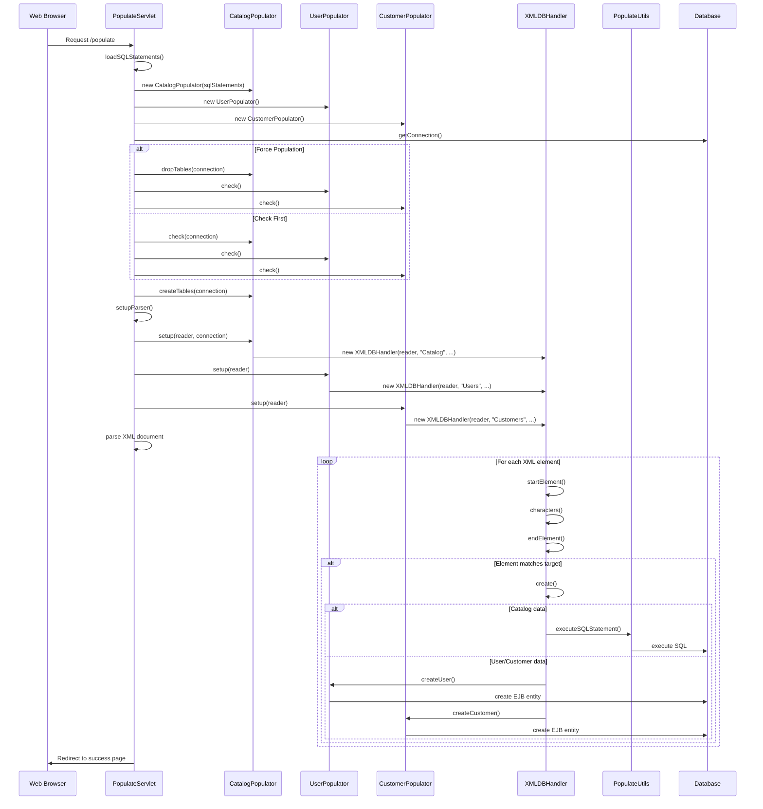

# XML Document Processing in Java Pet Store

## Overview of XML Document Processing in Java Pet Store

The Java Pet Store application extensively leverages XML document processing as a fundamental architectural component for data representation, exchange, and persistence. XML serves as the lingua franca throughout the application, enabling structured data interchange between various components while maintaining flexibility and supporting internationalization. The application implements a comprehensive XML processing framework that includes DTD-based schema validation, DOM and SAX parsing, entity resolution, and transformation capabilities. This framework allows business objects to be serialized to XML for persistence and communication, and deserialized back into Java objects when needed. The XMLDocumentUtils class provides core functionality for parsing, validating, and transforming XML documents, while specialized classes like XMLDocumentEditor and CustomEntityResolver handle specific aspects of XML processing. The application's modular design separates XML schema definitions (DTDs) from processing logic, promoting maintainability and reusability across the system.

## DTD-Based Schema Definitions

The Java Pet Store application employs Document Type Definitions (DTDs) as the primary mechanism for defining structured data formats across its various business domains. These DTDs establish the grammar and constraints for XML documents representing key business entities such as orders, invoices, customer information, and product catalogs.

The DTD architecture follows a modular design pattern where common elements are defined in separate files and imported using external entity references. For example, the PurchaseOrder.dtd imports ContactInfo.dtd, LineItem.dtd, and CreditCard.dtd to create a complete schema definition. This approach promotes reusability and maintainability by avoiding duplication of element definitions.

Each business entity has its own dedicated DTD that precisely defines its structure. For instance, LineItem.dtd specifies that a line item must contain CategoryId, ProductId, ItemId, LineNum, Quantity, and UnitPrice elements. Similarly, ContactInfo.dtd requires FamilyName, GivenName, Address, Email, and Phone elements, with Address being imported from a separate DTD.

The application also supports internationalization through locale attributes in its DTDs. The PurchaseOrder.dtd and Invoice.dtd both include a locale attribute with a default value of "en_US", allowing for language-specific processing of documents.

For business-to-business integration, the application includes specialized Trading Partner Agreement (TPA) DTDs that define namespaced XML formats for exchanging data with external systems. These TPA DTDs (TPALineItem.dtd, TPASupplierOrder.dtd, and TPAInvoice.dtd) use XML namespaces to avoid element name collisions and support both DTD and XSD validation approaches.

The DTD-based schema system is complemented by an entity catalog mechanism that maps public identifiers to local resources, enabling efficient resolution of external entities without requiring network access.

## XML Schema Hierarchy



The diagram illustrates the hierarchical relationships between DTD schemas in the Java Pet Store application. At the top level are core business entities like PurchaseOrder, Invoice, and SupplierOrder that represent complete business documents. These import component DTDs such as LineItem, ContactInfo, and CreditCard, which define reusable elements across multiple business entities. The TPA Integration DTDs provide specialized formats for business-to-business integration, while the Data Population DTDs support initializing the application's database with sample data. This modular design promotes reusability and maintainability by allowing common elements to be defined once and referenced in multiple schemas.

## XML Serialization and Deserialization

The Java Pet Store application implements a sophisticated XML serialization and deserialization system that enables seamless conversion between Java business objects and their XML representations. This system is crucial for data persistence, inter-component communication, and integration with external systems.

At the core of this functionality are the toXML/fromXML and toDOM/fromDOM method pairs implemented by business entity classes such as PurchaseOrder, LineItem, ContactInfo, and CreditCard. These methods handle the bidirectional transformation between object state and XML representation, ensuring that all business data can be properly externalized and reconstructed.

The serialization process typically follows these steps:
1. A business object's toDOM method creates a DOM document or node representing its state
2. Child objects are recursively serialized through their own toDOM methods
3. The resulting DOM structure is transformed into the desired output format (String, Result, etc.)
4. Optional validation against DTDs or XML schemas ensures the generated XML is valid

For deserialization, the process is reversed:
1. XML input (from String, InputStream, etc.) is parsed into a DOM structure
2. The static fromDOM factory method extracts data from the DOM to create a new object
3. Child elements are recursively processed to reconstruct nested objects
4. Validation can be applied during parsing to ensure the XML conforms to the expected schema

The XMLDocumentUtils class provides essential infrastructure for these operations, including methods for DOM creation, node manipulation, and transformation. It also handles technical concerns such as entity resolution, validation, and error handling.

The application supports both DOM and SAX parsing approaches. DOM is primarily used for business objects where the complete document structure needs to be manipulated, while SAX is employed for efficiency in scenarios like database population where streaming processing is more appropriate.

A notable feature is the support for different validation mechanisms. The application can validate against DTDs using traditional DOCTYPE declarations or against XML Schema (XSD) using namespace-based validation. This flexibility allows the system to work with both legacy and modern XML validation approaches.

The serialization system also incorporates internationalization support through locale attributes, enabling language-specific processing of XML documents. This is particularly evident in the PurchaseOrder and Invoice classes, which maintain locale information during serialization and deserialization.

## XML Document Processing Flow



This flowchart illustrates the complete lifecycle of XML documents in the Java Pet Store application. The process begins with the creation of XML documents from business objects using toDOM and toXML methods. These documents then undergo validation through entity resolution and schema validation against DTDs or XSDs. The validated documents can be transformed using various XMLDocumentEditor implementations for different purposes, such as converting to TPA formats for B2B integration or formatting email content. The transformed documents are then consumed by reconstructing business objects, sending to external systems, or delivering customer notifications. Additionally, XML data files are used to populate the database through SAX parsing, XMLDBHandler processing, and SQL statement execution. This comprehensive flow demonstrates how XML serves as the central data exchange format throughout the application's architecture.

## Entity Resolution and Catalog Management

The Java Pet Store application implements a sophisticated entity resolution and catalog management system to efficiently handle DTD and schema references in XML documents. This system is crucial for ensuring that XML processing can occur without requiring network access to retrieve external entities, improving both performance and reliability.

At the heart of this system is the CustomEntityResolver class, which implements the SAX EntityResolver interface. This class intercepts requests for external entities (DTDs, schemas) and resolves them to local resources rather than attempting to fetch them from external URLs. The resolver uses a properties-based catalog mapping system that associates public identifiers or system identifiers with local resource paths.

The entity catalog is defined in EntityCatalog.properties files located in strategic places throughout the application. These catalogs contain mappings for both legacy DTDs and newer component/composite DTDs. For example:

```
-//Sun\ Microsystems,\ Inc.\ -\ J2EE\ Blueprints\ Group//DTD\ LineItem\ 1.1//EN: /com/sun/j2ee/blueprints/lineitem/rsrc/schemas/LineItem.dtd
http\://blueprints.j2ee.sun.com/TPALineItem: /schemas/com/sun/j2ee/blueprints/xmldocuments/rsrc/schemas/TPALineItem.xsd
```

The CustomEntityResolver implements a multi-strategy approach to entity resolution:
1. First, it attempts to resolve the entity using the catalog mappings
2. If that fails, it tries to access the entity as a URL (for testing purposes)
3. Finally, it attempts to load the entity as a resource from the classpath
4. If all strategies fail, it returns null to let the parser use its default resolution mechanism

The resolver also supports chaining to a parent resolver, allowing for hierarchical resolution strategies. This is particularly useful in complex applications where different components may have their own entity resolution requirements.

The XMLDocumentUtils class integrates with this entity resolution system, providing methods that automatically configure parsers with the appropriate entity resolver. This integration ensures consistent entity resolution throughout the application.

For Trading Partner Agreement (TPA) integration, specialized entity catalogs are provided that map both DTD public identifiers and XML Schema namespace URIs to local resources. This dual approach supports both validation mechanisms, allowing the application to work with partners using either DTD or XSD validation.

The entity resolution system is complemented by the application's modular DTD design, where common elements are defined in separate DTDs and imported using external entity references. This design promotes reusability but requires efficient entity resolution to avoid performance issues.

## XML Document Editors and Transformers

The Java Pet Store application implements a flexible XML document editing and transformation framework centered around the XMLDocumentEditor interface. This framework provides a standardized approach to manipulating XML documents for various purposes throughout the application, from data transformation to content formatting.

The XMLDocumentEditor interface defines core methods for document manipulation:
- `setDocument(Source source)`: Loads an XML document from a source
- `getDocument()`: Retrieves the current document as a Source
- `copyDocument(Result result)`: Copies the document to a specified result

The interface includes a nested DefaultXDE implementation class that provides basic functionality and serves as a foundation for concrete implementations. This default implementation manages validation settings, entity catalog URLs, and XML Schema support flags, providing consistent behavior across all document editors.

Several specialized implementations extend this framework for specific business needs:

1. **TPAInvoiceXDE**: Transforms invoice documents into Trading Partner Agreement format for B2B integration. It extracts order IDs and line item quantities from invoice XML documents and supports both DTD and XSD validation approaches.

2. **TPASupplierOrderXDE**: Handles supplier order documents in TPA format, providing methods to set order details like ID, date, shipping address, and line items. It works with TPALineItemUtils to create properly formatted line item elements.

3. **MailContentXDE**: Applies XSL stylesheets to XML documents to format email content. It manages transformers for different locales, caching them for reuse, and provides methods to retrieve formatted output in various encodings.

The XMLDocumentEditorFactory class complements this framework by providing a factory pattern for creating XMLDocumentEditor instances based on schema URIs. It maintains a catalog of schema-to-editor mappings loaded from a URL and instantiates editors through reflection.

This editor framework is particularly valuable for the application's B2B integration capabilities, where XML documents must be transformed between internal formats and standardized external formats. The TPA-specific editors ensure that documents conform to agreed-upon formats for exchange with trading partners.

The transformation capabilities are enhanced by the application's use of XSLT stylesheets, which are managed through properties files like SupplierOrderStyleSheetCatalog.properties. These catalogs map document types to appropriate stylesheets, allowing for flexible document transformation based on content type.

## XML Document Editor Class Hierarchy



The diagram illustrates the class hierarchy of XML document editors in the Java Pet Store application. At the top is the XMLDocumentEditor interface, which defines the core methods for document manipulation. The DefaultXDE class provides a basic implementation with validation and entity catalog support. Specialized editors extend this base class for specific purposes: TPAInvoiceXDE handles invoice documents for B2B integration, TPASupplierOrderXDE manages supplier orders in TPA format, and MailContentXDE applies XSL transformations for email content formatting. The XMLDocumentEditorFactory creates appropriate editor instances based on schema URIs, while the CustomEntityResolver handles entity resolution for DTDs and schemas. This hierarchical design promotes code reuse while allowing specialized behavior for different document types and transformation needs.

## Trading Partner Agreement (TPA) XML Processing

The Java Pet Store application implements a sophisticated Trading Partner Agreement (TPA) XML processing system to facilitate business-to-business (B2B) integration. This system enables standardized communication with supplier systems through well-defined XML formats that adhere to agreed-upon schemas.

The TPA XML processing is built around three key document types, each with its own DTD and corresponding processing classes:

1. **TPALineItem**: Represents individual items in orders and invoices. Unlike the internal LineItem format, the TPA version uses an empty element with attributes rather than nested elements, optimizing for transmission efficiency. The TPALineItemUtils class provides utility methods for creating properly formatted line item elements with appropriate namespaces.

2. **TPASupplierOrder**: Encapsulates orders sent to suppliers, including order identification, shipping information, and line items. The TPASupplierOrderXDE class handles the creation and manipulation of these documents, providing methods to set order details and add line items.

3. **TPAInvoice**: Represents invoices received from suppliers, containing order references and line items. The TPAInvoiceXDE class parses these documents to extract order IDs and line item quantities for processing within the system.

All TPA documents use XML namespaces to prevent element name collisions, with fixed namespace URIs like "http://blueprints.j2ee.sun.com/TPASupplierOrder". This namespace-aware approach allows for clear distinction between internal and external document formats.

The TPA system supports both DTD and XML Schema (XSD) validation approaches, allowing flexibility when integrating with partners using different validation technologies. The SupplierOrderStyleSheetCatalog.properties file maps document types to appropriate stylesheets and indicates XSD support status for each format.

For document transformation, the application uses XSLT stylesheets to convert between internal and TPA formats. These transformations are managed through the XMLDocumentEditor framework, which provides a consistent interface for document manipulation regardless of the underlying format.

Entity resolution for TPA documents is handled through specialized entity catalogs that map both DTD public identifiers and XML Schema namespace URIs to local resources. This approach ensures that validation can occur without requiring network access to retrieve external entities.

The supplier application component leverages this TPA system to process incoming orders and generate invoices in the standardized format. The TPASupplierOrderXDE class in the supplier.orderfulfillment.ejb package parses incoming orders and transforms them into internal SupplierOrder objects for processing.

This comprehensive TPA XML processing system demonstrates the application's capability to handle complex B2B integration scenarios through standardized XML document exchange.

## Database Population from XML

The Java Pet Store application employs a sophisticated XML-driven approach to populate its database with initial data. This system leverages SAX parsing for efficient processing of large XML documents and transforms the parsed data into database records through a combination of direct SQL execution and EJB entity creation.

The database population process begins with the PopulateServlet, which serves as the entry point for initializing the database. This servlet loads an XML configuration file containing SQL statements for creating tables and then processes the main data file (Populate-UTF8.xml) to insert sample data.

The Populate-UTF8.xml file contains a comprehensive set of sample data including users, customers, categories, products, and items. This data is structured according to DTDs defined in the dtds directory, ensuring consistency and validity. The file includes multilingual content with translations in English, Japanese, and Chinese, demonstrating the application's internationalization capabilities.

For processing the XML data, the application uses a chain of specialized populators:

1. **CatalogPopulator**: Orchestrates the population of the product catalog, delegating to CategoryPopulator, ProductPopulator, and ItemPopulator.

2. **CustomerPopulator**: Handles customer data, working with AccountPopulator and ProfilePopulator for related information.

3. **UserPopulator**: Manages user account creation.

Each populator implements a similar pattern:
- A setup() method that configures an XMLFilter for processing specific XML elements
- Methods for checking if data already exists, creating tables, and dropping tables
- Logic for converting XML data into database records

The XMLDBHandler class serves as the foundation for XML parsing, extending XMLFilterImpl to process XML elements and extract values into a context map. It tracks parsing state and provides methods for value extraction and database operations.

For database operations, two approaches are used:
1. **SQL-based**: Direct SQL execution for catalog data (categories, products, items) using prepared statements
2. **EJB-based**: Entity bean creation for user and customer data through EJB local interfaces

The PopulateUtils class provides utility methods for executing SQL statements and handling database connections. It supports both actual database insertion and SQL statement printing for debugging purposes.

The system includes idempotency checks to prevent duplicate data insertion and supports forced repopulation when needed. Error handling is implemented throughout the process to ensure robustness, with graceful degradation when non-critical operations fail.

This XML-driven database population approach demonstrates the application's commitment to using XML as a central data format, providing a flexible and maintainable way to initialize the system with sample data.

## XML to Database Population Process



This sequence diagram illustrates the process of populating the database from XML data in the Java Pet Store application. The process begins when a client requests the populate servlet, which initializes the necessary populators (CatalogPopulator, UserPopulator, CustomerPopulator) and establishes a database connection. The servlet then checks if data already exists or forces repopulation based on parameters, and creates tables if needed. It sets up an XML parser with appropriate handlers for different sections of the XML document. As the XML is parsed, XMLDBHandler processes each element, extracting values and triggering creation operations when target elements are found. For catalog data (categories, products, items), SQL statements are executed directly against the database. For user and customer data, EJB entities are created through their respective home interfaces. This approach efficiently transforms the structured XML data into database records while maintaining referential integrity and supporting both SQL-based and EJB-based persistence mechanisms.

## Internationalization Support in XML Documents

The Java Pet Store application implements comprehensive internationalization support within its XML document processing framework, enabling multilingual content representation and locale-specific handling throughout the system. This internationalization capability is crucial for supporting a global customer base and demonstrating best practices for localized e-commerce applications.

At the schema level, key DTDs incorporate locale attributes to identify the language and region of document content. For example, the PurchaseOrder.dtd and Invoice.dtd both include a locale attribute with a default value of "en_US":

```xml
<!ATTLIST PurchaseOrder
    locale CDATA "en_US"
>
```

Similarly, product and category information DTDs (ProductDetails.dtd, CategoryDetails.dtd, ItemDetails.dtd) require an xml:lang attribute to specify the language of content:

```xml
<!ATTLIST ProductDetails
    xml:lang NMTOKEN #REQUIRED
>
```

The application's sample data in Populate-UTF8.xml leverages this internationalization infrastructure by providing multilingual content for categories, products, and items in English, Japanese, and Chinese. Each entity includes multiple language variants with appropriate translations and localized pricing, demonstrating how the system can present different content based on the user's locale.

For XML document processing, the XMLDocumentUtils class provides locale-aware functionality through methods that parse and format locale strings, extract locale information from XML documents, and apply locale-specific transformations. The class includes utility methods like parseLocale() and getLocale() to handle the language_country_variant format used in locale attributes.

The MailContentXDE class exemplifies locale-aware document transformation by applying different XSL stylesheets based on the document's locale. It constructs resource paths incorporating locale information to load the appropriate stylesheet:

```java
String resourceName = baseResourceName + "_" + locale.toString() + ".xsl";
```

If a locale-specific stylesheet is not found, the system falls back to more general variants (language only, or default), ensuring robustness while still providing localization when available.

Character encoding is carefully managed throughout the XML processing pipeline. The application uses UTF-8 as its primary encoding for XML documents, as seen in the Populate-UTF8.xml declaration:

```xml
<?xml version="1.0" encoding="UTF-8" ?>
```

For languages with special character requirements, appropriate character encodings are specified in the HTML files. Japanese content uses EUC-JP encoding, while Chinese content uses GB2312:

```html
<meta http-equiv="Content-Type" content="text/html; charset=euc-jp">
<meta http-equiv="Content-Type" content="text/html; charset=gb2312">
```

The XMLDocumentUtils class provides methods to control output encoding during XML serialization, ensuring that documents are properly encoded for their intended use.

This comprehensive internationalization support in XML document processing demonstrates the application's commitment to global accessibility and provides a reference implementation for building multilingual e-commerce systems.

[Generated by the Sage AI expert workbench: 2025-03-29 21:37:00  https://sage-tech.ai/workbench]: #