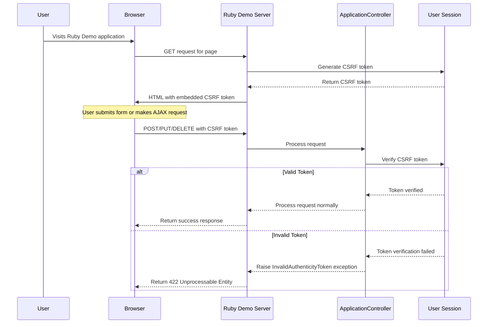
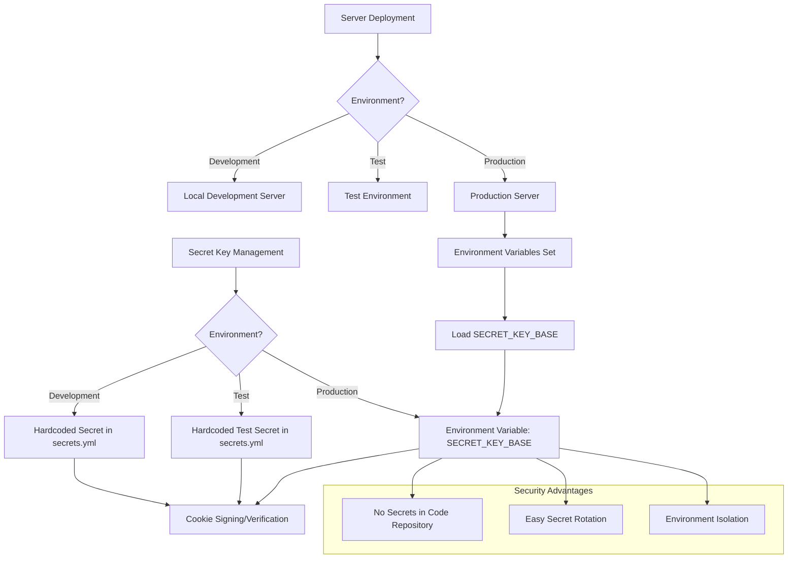
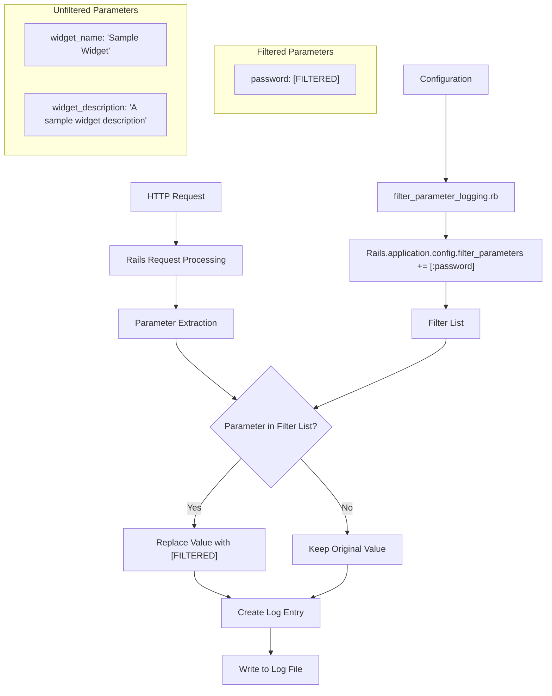
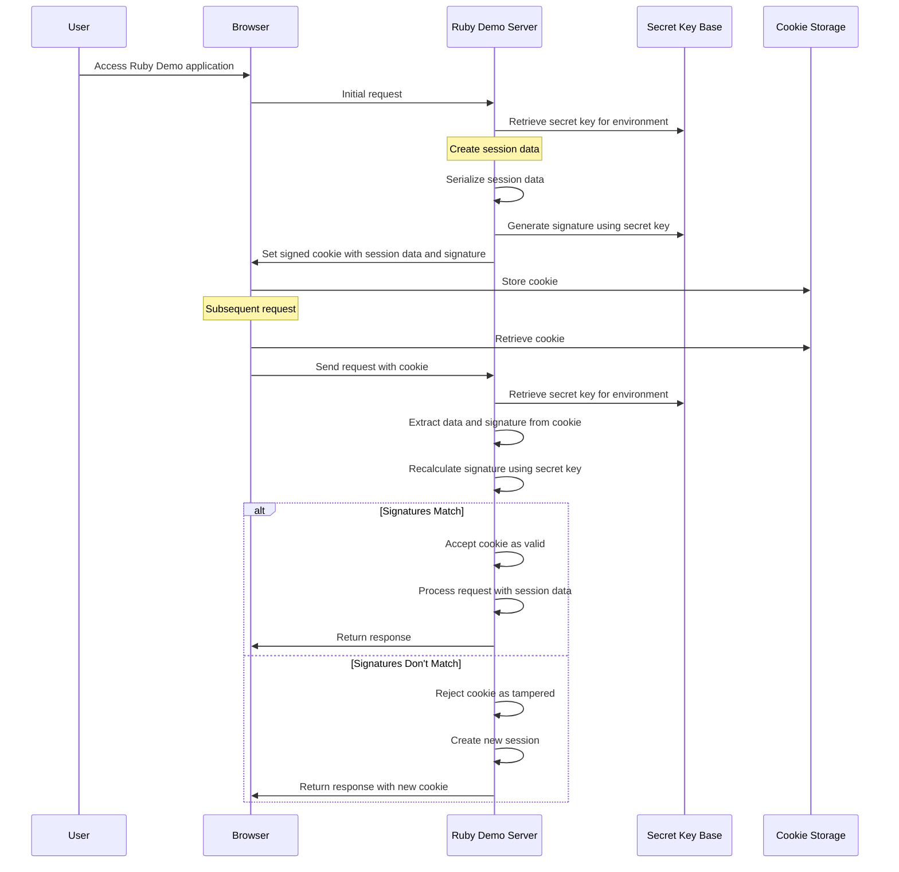

# Authentication & Security in Ruby Demo

## Overview of Security in Ruby Demo

The Ruby Demo application implements several key security mechanisms to protect its widget management functionality and user data. At its core, the application leverages Rails' built-in security features to establish a robust security posture. The security architecture is built around three primary components: CSRF protection through the ApplicationController, secret key management for cookie signing and verification, and parameter filtering to prevent sensitive data exposure in logs. These components work together to create a defense-in-depth approach that protects the application from common web vulnerabilities while maintaining the integrity of user sessions and data. The security architecture is designed to be environment-aware, with different configurations for development, testing, and production environments to balance security needs with developer productivity.

## CSRF Protection Implementation

The Ruby Demo application implements Cross-Site Request Forgery (CSRF) protection through the ApplicationController, which serves as the base controller for all other controllers in the application. This protection is enabled by the `protect_from_forgery with: :exception` directive, which instructs Rails to verify the authenticity of requests that could potentially modify data (such as POST, PUT, PATCH, and DELETE requests). 

When a form is rendered in the application, Rails automatically includes a hidden field containing a CSRF token. For AJAX requests, this token is included in the HTTP headers. When a request is received, Rails verifies that the token in the request matches the token stored in the user's session. If the tokens don't match, Rails raises an `ActionController::InvalidAuthenticityToken` exception, preventing the potentially malicious request from being processed.

This implementation follows Rails' security best practices by using the `:exception` strategy rather than the more lenient `:null_session` option, which would simply nullify the session rather than raising an exception. By raising an exception, the application ensures that unverified requests are completely rejected, providing stronger protection against CSRF attacks that could otherwise manipulate widget data or user sessions.

## CSRF Protection Flow

The diagram above illustrates the CSRF protection flow in the Ruby Demo application. When a user first visits the application, the server generates a unique CSRF token and stores it in the user's session. This token is then embedded in all forms and JavaScript-initiated requests. When the user submits a form or makes an AJAX request that could modify data, the browser sends the CSRF token along with the request. The ApplicationController verifies this token against the one stored in the user's session. If the tokens match, the request is processed normally. If they don't match, an exception is raised, and the request is rejected with a 422 Unprocessable Entity status code. This mechanism effectively prevents attackers from tricking users into submitting unauthorized requests to the application, protecting the widget management functionality from CSRF attacks.

## Secret Key Management

The Ruby Demo application implements a robust approach to secret key management through its `secrets.yml` configuration file. This file defines the secret keys used for verifying the integrity of signed cookies and other security-related functions. The application employs environment-specific strategies for managing these secrets.

For development and test environments, the application uses predefined secret keys that are stored directly in the configuration file. These keys are long (over 30 characters) and randomly generated, making them resistant to dictionary attacks. While including these keys in the repository is acceptable for non-production environments to facilitate development and testing, the application takes a different approach for production.

In the production environment, the application follows security best practices by retrieving the secret key from environment variables (`ENV["SECRET_KEY_BASE"]`) rather than hardcoding it in the configuration file. This approach ensures that production secrets are not stored in the repository, reducing the risk of unauthorized access. It also allows for easy rotation of secrets without code changes and enables secure deployment across different production environments.

The comments in the configuration file provide valuable guidance for developers, emphasizing the importance of keeping these secrets private and suggesting the use of the `rake secret` command to generate secure random keys when needed. This comprehensive approach to secret key management demonstrates a security-conscious design that balances development convenience with production security requirements.

## Environment-Based Secret Key Architecture

The diagram illustrates how the Ruby Demo application manages secret keys differently across development, test, and production environments. In development and test environments, hardcoded secrets are used for convenience, while production environments retrieve secrets from environment variables. This architecture provides several security advantages:

1. **Repository Security**: Production secrets are never committed to the code repository, preventing accidental exposure through source code access.

2. **Secret Rotation**: Environment variables can be updated without code changes, allowing for easy rotation of secrets when needed.

3. **Environment Isolation**: Each environment has its own secret key, ensuring that compromised development or test keys don't affect production security.

4. **Deployment Flexibility**: The use of environment variables in production allows for secure deployment across different hosting environments and services.

This environment-based approach to secret key management demonstrates a thoughtful security architecture that addresses both developer productivity and production security requirements, providing a solid foundation for protecting the widget management functionality in the Ruby Demo application.

## Sensitive Data Protection in Logs

The Ruby Demo application implements parameter filtering to prevent sensitive data from appearing in log files. This is configured in the `filter_parameter_logging.rb` initializer file, which adds the `:password` parameter to Rails' filter list. When requests containing password fields are logged, their values are automatically replaced with `[FILTERED]` in the log output, preventing accidental exposure of user credentials.

This protection is particularly important for maintaining the confidentiality of user authentication data. Without parameter filtering, passwords could be inadvertently exposed in various log files, including application logs, web server logs, and error reports. Such exposure could lead to credential theft and unauthorized access to the widget management functionality.

The current implementation focuses specifically on password protection, which addresses the most critical sensitive data point. However, the application could benefit from expanding this filtering to include other potentially sensitive parameters related to widget management or user data. The parameter filtering mechanism is a key component of the application's defense-in-depth strategy, working alongside CSRF protection and secret key management to create a comprehensive security posture.

## Parameter Filtering Process

The diagram illustrates how Rails processes and filters sensitive parameters before writing to log files in the Ruby Demo application. When an HTTP request is received, Rails extracts the parameters and checks each one against the configured filter list. If a parameter name matches an entry in the filter list (currently only `:password`), its value is replaced with `[FILTERED]` before being written to the log file.

This process ensures that sensitive data like passwords never appears in log files, even if logging is set to debug level or if an exception occurs during request processing. The filtering happens early in the request lifecycle, ensuring comprehensive protection across all logging points in the application.

The current implementation in Ruby Demo only filters password parameters, leaving other potentially sensitive data unprotected. As shown in the diagram, widget-related parameters like names and descriptions are not filtered. While these may not be as sensitive as passwords, expanding the filter list could provide additional protection for any sensitive business data related to widget management.

## Security Best Practices in Ruby Demo

The Ruby Demo application implements several security best practices that align with industry standards for web application security. These practices form a cohesive security strategy that protects both the application's functionality and its users' data.

First, the application follows the principle of defense in depth by implementing multiple security controls that work together. CSRF protection prevents unauthorized state-changing requests, secret key management ensures the integrity of signed cookies, and parameter filtering prevents sensitive data exposure in logs. Each of these controls addresses a different aspect of application security.

Second, the application employs environment-specific security configurations. Development and test environments use hardcoded secrets for convenience, while production environments use environment variables. This approach balances developer productivity with production security requirements, ensuring that sensitive data is properly protected in production without hindering development.

Third, the application leverages Rails' built-in security features rather than implementing custom solutions. By using `protect_from_forgery` for CSRF protection and Rails' parameter filtering mechanism, the application benefits from well-tested, community-reviewed security implementations. This approach reduces the risk of security vulnerabilities that might arise from custom security code.

Finally, the application's configuration files include helpful comments that guide developers toward secure practices, such as generating strong random keys and keeping production secrets out of the repository. These comments serve as documentation and education, promoting a security-conscious development culture.

While these practices provide a solid foundation, there are opportunities for enhancement, such as expanding parameter filtering to cover more sensitive data types and implementing additional authentication mechanisms to protect the widget management functionality.

## Cookie Security and Integrity

The Ruby Demo application uses Rails' cookie-based session management, which relies on signed cookies to maintain session state while ensuring integrity. The secret key defined in `secrets.yml` plays a crucial role in this process, as it's used to sign cookies before they're sent to the client and verify their integrity when they're returned.

When a cookie is created, Rails uses the secret key to generate a signature that's appended to the cookie value. This signature is a cryptographic hash that depends on both the cookie's content and the secret key. When a request is received with a signed cookie, Rails recalculates the signature using the stored secret key and compares it to the signature in the cookie. If they match, the cookie is considered valid; if not, the cookie is rejected.

This mechanism protects against cookie tampering, as any modification to the cookie content would invalidate the signature. Without knowledge of the secret key, an attacker cannot generate a valid signature for a modified cookie. This protection is essential for maintaining the integrity of user sessions and preventing session hijacking or privilege escalation attacks.

The application's approach to secret key management enhances cookie security by using environment-specific keys and retrieving production keys from environment variables. This approach ensures that even if development or test keys are exposed, production cookies remain secure. Additionally, the application's configuration notes that changing the secret key will invalidate all existing signed cookies, which is important to consider when rotating keys for security purposes.

## Cookie Signing and Verification Workflow

The diagram illustrates the process of cookie signing during creation and verification during subsequent requests in the Ruby Demo application. When a user first accesses the application, the server creates session data, serializes it, and generates a cryptographic signature using the environment-specific secret key. This signed cookie is then sent to the browser and stored.

On subsequent requests, the browser sends the cookie back to the server. The server extracts the data and signature from the cookie, then recalculates the signature using the same secret key. If the calculated signature matches the one in the cookie, the server accepts the cookie as valid and processes the request with the session data. If the signatures don't match, indicating potential tampering, the server rejects the cookie and creates a new session.

This workflow ensures the integrity of session data, protecting against unauthorized modifications that could lead to session hijacking or privilege escalation. The use of environment-specific secret keys, particularly the use of environment variables in production, enhances this protection by ensuring that production cookies are signed with a key that's not stored in the code repository.

The cookie signing and verification process is transparent to users but provides critical security for the widget management functionality, ensuring that user sessions remain secure and that unauthorized users cannot gain access to protected features by manipulating cookies.

## Security Considerations for Widget Management

The security measures implemented in the Ruby Demo application provide comprehensive protection for its core widget management functionality. CSRF protection ensures that only legitimate requests from authorized users can create, update, or delete widgets, preventing malicious websites from tricking users into performing unwanted actions. This is particularly important for maintaining the integrity of the widget inventory and preventing unauthorized modifications.

Cookie security and integrity, enforced through signed cookies and careful secret key management, protect user sessions and ensure that authentication states cannot be forged. This prevents unauthorized access to the widget management interface and ensures that users can only access and modify widgets they are authorized to manage.

Parameter filtering, while currently limited to password protection, lays the groundwork for protecting sensitive widget data in logs. As the application evolves, this filtering could be expanded to include proprietary widget information or other business-sensitive data that should not be exposed in log files.

The environment-specific security configurations ensure that while development and testing can proceed efficiently, production deployments maintain the highest level of security. This is crucial for protecting real-world widget data and ensuring that the production environment is resistant to attacks.

Together, these security measures create a defense-in-depth approach that protects the widget management functionality from various attack vectors. However, the application could benefit from additional security layers, such as role-based access control for widget management and input validation to prevent injection attacks in widget data fields.

## Security Enhancement Recommendations

While the Ruby Demo application implements several important security measures, there are opportunities for enhancing its security posture to provide even stronger protection for the widget management functionality:

1. **Expand Parameter Filtering**: The current implementation only filters password parameters from logs. This could be expanded to include other sensitive data related to widget management, such as proprietary widget specifications, internal pricing information, or user-specific widget configurations. Adding these parameters to the filter list would prevent accidental exposure of business-sensitive data in log files.

2. **Implement Authentication and Authorization**: The application would benefit from a robust authentication system to verify user identities and an authorization system to control access to widget management functions. This could be implemented using a gem like Devise for authentication and CanCanCan or Pundit for authorization, allowing fine-grained control over who can create, view, update, or delete widgets.

3. **Add Content Security Policy**: Implementing a Content Security Policy would provide protection against cross-site scripting (XSS) attacks that could compromise widget data or user sessions. This could be configured in the application's headers to restrict the sources of executable scripts, stylesheets, and other resources.

4. **Enable HTTP Strict Transport Security**: For production deployments, enabling HSTS would ensure that all communications between users and the application occur over HTTPS, protecting against man-in-the-middle attacks and cookie hijacking that could compromise widget management sessions.

5. **Implement Rate Limiting**: Adding rate limiting for authentication attempts and API endpoints would protect against brute force attacks and denial of service attempts targeting the widget management functionality.

6. **Enhance Secret Management**: While the application already uses environment variables for production secrets, this approach could be enhanced by integrating with a dedicated secret management service like HashiCorp Vault or AWS Secrets Manager, providing additional security features like secret rotation and access auditing.

7. **Add Security Headers**: Implementing additional security headers like X-Content-Type-Options, X-Frame-Options, and X-XSS-Protection would provide defense in depth against various browser-based attacks.

8. **Implement Input Validation**: Adding comprehensive input validation for all widget-related fields would prevent injection attacks and ensure data integrity in the widget management system.

These enhancements would build upon the existing security foundation to create a more robust and comprehensive security posture for the Ruby Demo application, ensuring that its widget management functionality remains protected against evolving threats.

[Generated by the Sage AI expert workbench: 2025-03-29 18:36:01  https://sage-tech.ai/workbench]: #