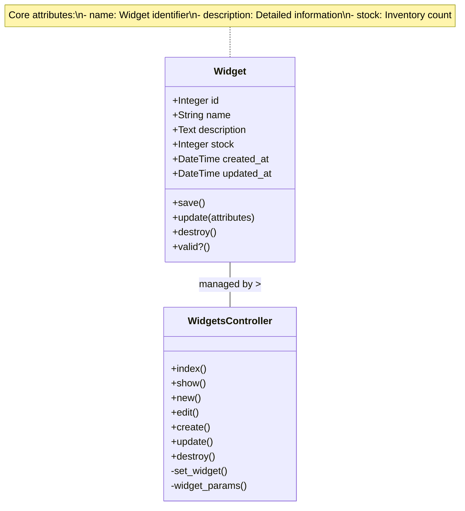
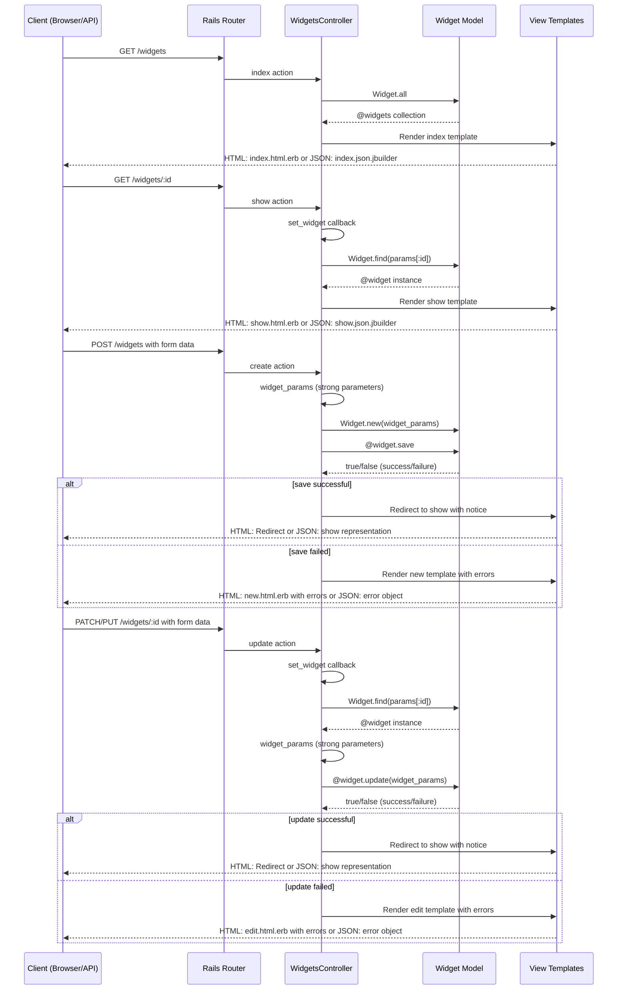
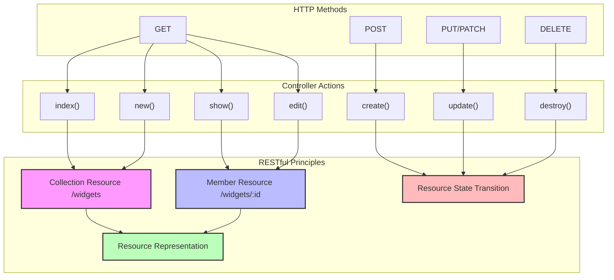

# Widget Management CRUD Operations Analysis

## Introduction to Widget Management

The Ruby Demo application exemplifies a canonical implementation of RESTful resource handling through its widget management functionality. The application follows the standard Rails convention of organizing CRUD (Create, Read, Update, Delete) operations around a resource-oriented architecture. The `WidgetsController` serves as the central coordinator for all widget-related operations, implementing the seven standard RESTful actions that map cleanly to HTTP verbs.

This widget management system demonstrates several key aspects of modern web application design: separation of concerns through the MVC pattern, content negotiation to support both HTML and JSON responses, strong parameter protection against mass assignment vulnerabilities, and consistent user feedback through flash notices. The implementation showcases how Rails conventions facilitate rapid development of secure, maintainable resource management interfaces while adhering to RESTful principles.

## Widget CRUD Flow Diagram

```mermaid
flowchart TD
    Client[Client Browser/API Consumer]
    
    subgraph "Widget Lifecycle"
        Create[Create Widget]
        Read[Read Widget]
        Update[Update Widget]
        Delete[Delete Widget]
    end
    
    subgraph "Controller Actions"
        New["new()"]
        CreateAction["create()"]
        Index["index()"]
        Show["show()"]
        Edit["edit()"]
        UpdateAction["update()"]
        Destroy["destroy()"]
    end
    
    subgraph "Model Layer"
        Validation["Widget Validation"]
        DB[(Database)]
    end
    
    Client -->|GET /widgets/new| New
    New -->|Render form| Client
    Client -->|POST /widgets| CreateAction
    CreateAction -->|widget_params| Validation
    Validation -->|Valid?| DB
    CreateAction -->|redirect_to @widget| Client
    
    Client -->|GET /widgets| Index
    Index -->|@widgets = Widget.all| DB
    Index -->|Render list| Client
    
    Client -->|GET /widgets/:id| Show
    Show -->|"@widget = Widget.find(params[:id])"| DB
    Show -->|Render details| Client
    
    Client -->|GET /widgets/:id/edit| Edit
    Edit -->|"@widget = Widget.find(params[:id])"| DB
    Edit -->|Render form| Client
    
    Client -->|PATCH/PUT /widgets/:id| UpdateAction
    UpdateAction -->|widget_params| Validation
    Validation -->|Valid?| DB
    UpdateAction -->|redirect_to @widget| Client
    
    Client -->|DELETE /widgets/:id| Destroy
    Destroy -->|@widget.destroy| DB
    Destroy -->|redirect_to widgets_url| Client
    
    style Create fill:#f9f,stroke:#333,stroke-width:2px
    style Read fill:#bbf,stroke:#333,stroke-width:2px
    style Update fill:#bfb,stroke:#333,stroke-width:2px
    style Delete fill:#fbb,stroke:#333,stroke-width:2px
```

The diagram illustrates the complete widget lifecycle in the Ruby Demo application. Each CRUD operation follows a specific flow through the controller actions. The create flow begins with the `new` action rendering a form, followed by the `create` action processing the form submission, validating the input, and persisting the widget to the database. Read operations are handled by either the `index` action for listing all widgets or the `show` action for displaying a specific widget. Update operations start with the `edit` action rendering a pre-populated form, followed by the `update` action processing changes. Finally, the delete operation is managed by the `destroy` action, which removes the widget from the database and redirects to the index page. Throughout these flows, the controller maintains proper separation of concerns, delegating data persistence to the model layer while managing HTTP interactions and responses.

## Widget Listing Implementation

The widget listing functionality, implemented in the `index` action of the `WidgetsController`, represents a straightforward but essential component of the application's CRUD operations. The implementation follows Rails' convention-over-configuration principle with a minimalist approach:

```ruby
def index
  @widgets = Widget.all
end
```

This concise implementation retrieves all widget records from the database without pagination, filtering, or sorting logic. While suitable for demonstration purposes or applications with limited data, a production implementation would likely incorporate these features to handle larger datasets efficiently. The action assigns the collection to the `@widgets` instance variable, making it available to the corresponding view template.

The absence of explicit format handling in this action indicates reliance on Rails' implicit content negotiation. When a client requests HTML format (default for browser requests), Rails renders the `index.html.erb` view. For JSON requests, it renders `index.json.jbuilder` or a similar template, converting the widget collection to a serialized representation. This dual-format support enables the same controller action to serve both the web interface and potential API consumers, demonstrating the RESTful principle of resource representation independence.

## Widget Detail View

The `show` action in the `WidgetsController` exemplifies Rails' elegance in handling resource detail views. The implementation is remarkably concise:

```ruby
def show
end
```

This seemingly empty method leverages the `before_action :set_widget` callback defined in the controller, which populates the `@widget` instance variable for actions including `show`. The callback executes:

```ruby
def set_widget
  @widget = Widget.find(params[:id])
end
```

This pattern demonstrates several architectural strengths: it follows DRY (Don't Repeat Yourself) principles by centralizing the widget retrieval logic, implements proper error handling through Rails' implicit raising of `ActiveRecord::RecordNotFound` when a widget isn't found, and maintains a clean separation between resource identification and presentation logic.

The action supports both HTML and JSON formats without explicit format handling code, relying on Rails' convention-based view resolution. For HTML requests, it renders `show.html.erb`, while JSON requests trigger rendering of `show.json.jbuilder` or equivalent. This implicit content negotiation enables the application to serve both human users and API consumers with the same controller action, exemplifying the RESTful principle of representation independence.

## Widget Data Structure



The Widget data structure forms the core model of the widget management functionality. As shown in the diagram, the Widget model encapsulates three primary business attributes: `name` (a string that serves as the widget's identifier), `description` (text providing detailed information about the widget), and `stock` (an integer representing the available inventory count). Additionally, the model includes standard Rails timestamps (`created_at` and `updated_at`) that track the widget's lifecycle.

The model interacts with the `WidgetsController`, which orchestrates all CRUD operations through its seven RESTful actions. This relationship exemplifies the Model-View-Controller pattern, where the controller mediates between the data model and the presentation layer. The Widget model likely includes validation logic (through the `valid?()` method) to ensure data integrity, though specific validation rules are not visible in the provided code.

The simplicity of this data structure makes it an excellent demonstration case for RESTful resource management, as it contains enough attributes to be meaningful while remaining straightforward enough to clearly illustrate the CRUD patterns without domain-specific complexity.

## Creating New Widgets

The widget creation process in the Ruby Demo application follows the standard Rails two-step pattern, separating the form presentation from the data persistence logic. The `new` action prepares an empty widget instance for form building:

```ruby
def new
  @widget = Widget.new
end
```

This action initializes a new, unsaved Widget object and makes it available to the view template, which uses it to build a form with the appropriate fields and submission path.

The actual creation occurs in the `create` action:

```ruby
def create
  @widget = Widget.new(widget_params)

  respond_to do |format|
    if @widget.save
      format.html { redirect_to @widget, notice: 'Widget was successfully created.' }
      format.json { render :show, status: :created, location: @widget }
    else
      format.html { render :new }
      format.json { render json: @widget.errors, status: :unprocessable_entity }
    end
  end
end
```

This implementation demonstrates several key patterns: it uses strong parameters (`widget_params`) to protect against mass assignment vulnerabilities, implements conditional logic based on the success of the save operation, provides appropriate feedback through flash notices, and handles different response formats with format-specific behavior. For successful creations, HTML requests redirect to the widget's show page with a success notice, while JSON requests receive a 201 Created status code with the widget representation. For validation failures, HTML requests re-render the form with error messages, while JSON requests receive a 422 Unprocessable Entity status with serialized error details.

This dual-path approach ensures proper feedback regardless of whether the request comes from a browser or an API client, maintaining a consistent resource lifecycle while accommodating different interaction patterns.

## Editing Existing Widgets

The widget editing functionality follows Rails' conventional two-step pattern for updating resources. The `edit` action prepares for modification by retrieving the widget to be edited:

```ruby
def edit
end
```

Similar to the `show` action, this seemingly empty method relies on the `before_action :set_widget` callback to populate the `@widget` instance variable. The view template then uses this instance to build a pre-populated form with the current widget attributes.

The actual update logic resides in the `update` action:

```ruby
def update
  respond_to do |format|
    if @widget.update(widget_params)
      format.html { redirect_to @widget, notice: 'Widget was successfully updated.' }
      format.json { render :show, status: :ok, location: @widget }
    else
      format.html { render :edit }
      format.json { render json: @widget.errors, status: :unprocessable_entity }
    end
  end
end
```

This implementation demonstrates several architectural strengths: it leverages ActiveRecord's `update` method to handle attribute assignment and persistence in a single call, implements conditional logic based on the success of the update operation, provides appropriate feedback through flash notices, and handles different response formats with format-specific behavior.

For successful updates, HTML requests redirect to the widget's show page with a success notice, while JSON requests receive a 200 OK status with the updated widget representation. For validation failures, HTML requests re-render the edit form with error messages, while JSON requests receive a 422 Unprocessable Entity status with serialized error details.

This pattern ensures that both human users and API consumers receive appropriate feedback and follow a consistent resource lifecycle, regardless of the interface they're using to interact with the application.

## Controller-View Interaction



The diagram illustrates the interaction patterns between the `WidgetsController` and the view layer across different CRUD operations. For each operation, the controller orchestrates the flow between the client request, model interactions, and view rendering, with distinct patterns for different response formats.

The controller maintains a clear separation of concerns: it handles HTTP request processing, delegates data operations to the model, and selects appropriate views for rendering responses. The `respond_to` blocks implement content negotiation, allowing the same controller actions to serve both HTML and JSON formats with format-appropriate behaviors.

For HTML responses, the controller typically renders view templates (for GET requests and failed validations) or issues redirects with flash notices (for successful POST/PUT/DELETE operations). For JSON responses, it renders serialized representations of resources or error details with appropriate HTTP status codes.

This dual-format support enables the controller to serve both the web interface and API consumers without duplicating logic, demonstrating the RESTful principle of representation independence. The consistent use of instance variables (`@widget`, `@widgets`) for passing data to views follows Rails conventions and maintains a clean boundary between controller and view responsibilities.

## Widget Removal Process

The widget deletion functionality is implemented in the `destroy` action of the `WidgetsController`:

```ruby
def destroy
  @widget.destroy
  respond_to do |format|
    format.html { redirect_to widgets_url, notice: 'Widget was successfully destroyed.' }
    format.json { head :no_content }
  end
end
```

This implementation demonstrates several key architectural patterns. First, it relies on the `before_action :set_widget` callback to retrieve the widget to be deleted, ensuring the resource exists before attempting deletion. The action then delegates the actual deletion to the model's `destroy` method, which handles any necessary cleanup operations and database interactions.

The controller implements format-specific responses using a `respond_to` block. For HTML requests, it redirects to the widgets index page with a success notice, providing clear feedback to the user. For JSON requests, it returns a 204 No Content status code with no response body, following REST API conventions for successful deletion operations.

Notably absent from this implementation is an explicit confirmation mechanism within the controller action itself. In a typical Rails application, the confirmation would be handled on the client side through JavaScript or a confirmation dialog in the view template. This separation keeps the controller focused on resource manipulation rather than UI concerns.

The action also doesn't implement any authorization checks, suggesting that widget deletion is available to all users. In a production application, this would typically be augmented with authentication and authorization checks to restrict deletion capabilities to appropriate users.

## Security Protection in CRUD Operations

The `WidgetsController` implements a fundamental security measure through the use of strong parameters, a Rails feature designed to prevent mass assignment vulnerabilities. This protection is encapsulated in the private `widget_params` method:

```ruby
def widget_params
  params.require(:widget).permit(:name, :description, :stock)
end
```

This implementation demonstrates the principle of whitelisting parameters rather than blacklisting them, an approach that follows the security principle of "deny by default." The method explicitly specifies which attributes (`name`, `description`, and `stock`) are permitted for mass assignment, preventing attackers from injecting unexpected attributes that could compromise the application's security or data integrity.

The `params.require(:widget)` portion ensures that the parameters contain a `widget` key, raising an `ActionController::ParameterMissing` exception if it's absent. This prevents malformed requests from bypassing the parameter filtering.

This strong parameters implementation is consistently applied across the `create` and `update` actions, ensuring that the same security protections apply to all operations that modify widget data. The private visibility of the method enforces encapsulation, preventing it from being called as an action.

While this implementation provides basic protection against mass assignment vulnerabilities, it represents just one layer of a comprehensive security strategy. A production application would typically complement this with additional security measures such as authentication, authorization, CSRF protection, and input validation, creating a defense-in-depth approach to application security.

## RESTful Resource Actions Mapping



The diagram illustrates how the seven standard controller actions in the `WidgetsController` map to HTTP methods and RESTful principles. This mapping follows Rails conventions for resource routing and demonstrates the alignment between the controller's implementation and REST architectural principles.

The controller actions are divided into two categories based on the resources they target: collection actions (`index`, `new`, `create`) that operate on the entire widget collection, and member actions (`show`, `edit`, `update`, `destroy`) that operate on specific widget instances identified by ID.

The HTTP methods are mapped to controller actions according to their semantic meaning: GET for retrieving resources (`index`, `show`, `new`, `edit`), POST for creating resources (`create`), PUT/PATCH for updating resources (`update`), and DELETE for removing resources (`destroy`).

This mapping demonstrates several RESTful principles:
- Resource identification through URIs (`/widgets` for the collection, `/widgets/:id` for members)
- Manipulation of resources through representations (HTML forms and JSON)
- Self-descriptive messages using standard HTTP methods and status codes
- Hypermedia as the engine of application state (HATEOAS) through links and form actions

The controller's implementation adheres to these principles while leveraging Rails conventions to minimize boilerplate code, resulting in a clean, maintainable implementation of RESTful resource management.

## Content Negotiation and Response Formats

The `WidgetsController` implements sophisticated content negotiation through Rails' `respond_to` blocks, enabling it to serve both HTML and JSON formats from the same controller actions. This approach is evident in the `create`, `update`, and `destroy` actions:

```ruby
respond_to do |format|
  if @widget.save
    format.html { redirect_to @widget, notice: 'Widget was successfully created.' }
    format.json { render :show, status: :created, location: @widget }
  else
    format.html { render :new }
    format.json { render json: @widget.errors, status: :unprocessable_entity }
  end
end
```

This implementation demonstrates several key architectural patterns. First, it uses the same controller action to handle both web interface and API requests, promoting code reuse and ensuring consistent business logic across formats. Second, it provides format-specific responses tailored to the needs of different clients: HTML responses focus on user experience with redirects and flash notices, while JSON responses follow API conventions with appropriate status codes and serialized representations.

For successful operations, HTML responses typically redirect to a resource view with a success notice, while JSON responses render the resource representation with a corresponding status code (201 Created for new resources, 200 OK for updates). For failed operations, HTML responses re-render the form with validation errors, while JSON responses return a 422 Unprocessable Entity status with serialized error details.

The `index` and `show` actions don't contain explicit `respond_to` blocks, relying instead on Rails' implicit content negotiation based on the request's Accept header or format extension. This convention-based approach further streamlines the controller code while maintaining format flexibility.

This dual-format support enables the application to serve as both a traditional web application and a RESTful API without duplicating controller logic, demonstrating the RESTful principle of representation independence.

[Generated by the Sage AI expert workbench: 2025-03-29 18:36:01  https://sage-tech.ai/workbench]: #