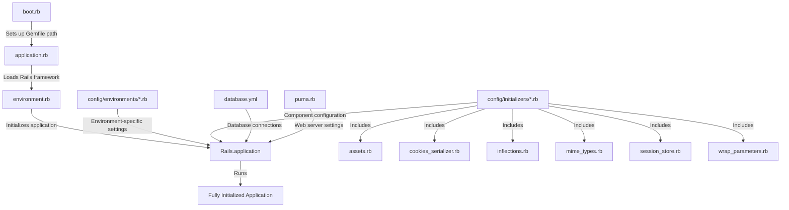
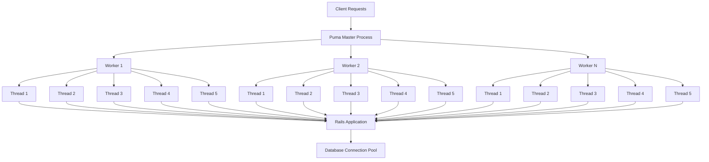
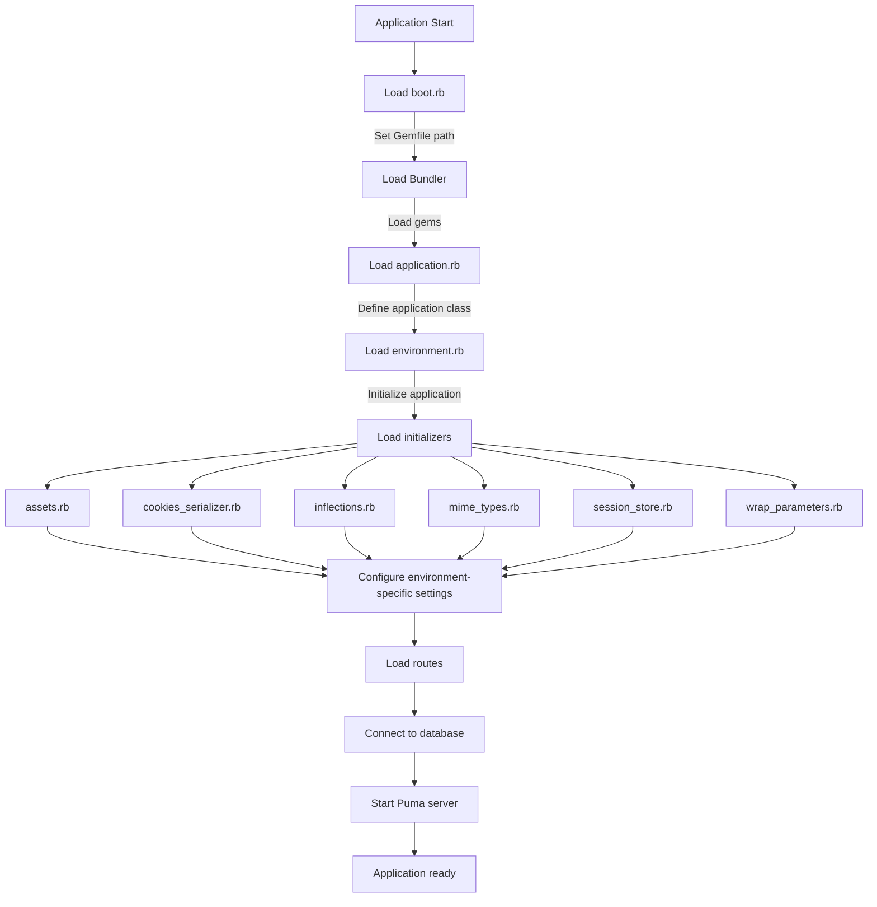
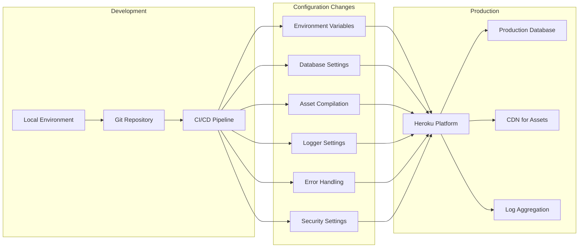

# Ruby Demo: Configuration & Setup

## Project Overview and Setup

The Ruby Demo is a Rails application designed to showcase widget management functionality. It provides a comprehensive example of how to build a web application using Ruby on Rails 4.2.0, with a focus on CRUD operations for widgets presented through a web interface. The application is structured following Rails conventions and demonstrates best practices for configuration and deployment.

The development environment requires Ruby, the PostgreSQL database system, and the Heroku Toolbelt for deployment. The application can be set up locally by cloning the repository, installing dependencies with Bundler, creating and migrating the database, and starting the server with Foreman. The application is designed to be easily deployable to Heroku, with appropriate configuration for production environments.

Key components of the setup include PostgreSQL for data persistence, Puma as the web server, and various frontend tools like SCSS, CoffeeScript, jQuery, and Turbolinks. The application follows the standard Rails MVC architecture and uses the asset pipeline for managing frontend assets.

## Application Configuration Structure

The Ruby Demo application follows the standard Rails configuration structure, with configuration files organized in the `config` directory. The core configuration files define how the application behaves across different environments.

The `environment.rb` file serves as the entry point for loading the Rails application environment. It requires the `application.rb` file and initializes the Rails application with `Rails.application.initialize!`. This file is kept minimal by design, delegating most configuration to other files.

The `application.rb` file defines the main application module `RubyGettingStarted` and inherits from `Rails::Application`. It requires the Rails framework and all gems listed in the Gemfile through Bundler. This file contains commented configuration options for time zones and internationalization settings, serving as the central configuration point for the application.

The `boot.rb` file initializes the application environment by setting up the Gemfile path and loading dependencies. It sets the `BUNDLE_GEMFILE` environment variable and requires 'bundler/setup' if the Gemfile exists, configuring Ruby's load paths to use the specified gems.

The application also includes several initializers in the `config/initializers` directory that configure specific aspects of the application, such as MIME types, session storage, parameter wrapping, asset pipeline settings, cookie serialization, and language inflection rules.

## Rails Configuration File Hierarchy



The Rails configuration file hierarchy follows a specific loading order that ensures dependencies are properly resolved. The process begins with `boot.rb`, which sets up the Gemfile path and loads the necessary gems. This file is responsible for the initial environment setup before any Rails-specific code is loaded.

Next, `application.rb` loads the Rails framework and defines the application module. It serves as the central configuration point, requiring all necessary Rails components and setting up the application class that inherits from `Rails::Application`.

The `environment.rb` file then initializes the Rails application by calling `Rails.application.initialize!`. This triggers the loading of environment-specific configurations from `config/environments/*.rb` and all initializers from `config/initializers/*.rb`.

The initializers configure specific components of the application, such as asset pipeline settings, cookie serialization, MIME types, and parameter wrapping. These files are loaded alphabetically, allowing for dependencies between initializers.

Database connections are configured through `database.yml`, while the web server settings are defined in `puma.rb`. These configurations are applied during the application initialization process.

This hierarchical structure ensures that all components are properly configured before the application starts handling requests, providing a clean separation of concerns and making it easier to manage different aspects of the application configuration.

## Database Configuration

The Ruby Demo application uses PostgreSQL as its database system, configured through the `database.yml` file. This file defines connection settings for three environments: development, test, and production.

The configuration uses YAML anchors with the `&default` pattern to define reusable configuration blocks, promoting DRY (Don't Repeat Yourself) principles. Common settings across all environments include:

- PostgreSQL adapter (`adapter: postgresql`)
- Unicode encoding (`encoding: unicode`)
- Connection pooling with 5 connections (`pool: 5`)

For the development environment, the database is named `ruby-getting-started_development`. The configuration includes commented options for customizing the username, password, host, port, schema search path, and log levels, providing developers with guidance on how to adjust these settings if needed.

The test environment uses a separate database named `ruby-getting-started_test` to ensure isolation between development and testing data. It explicitly configures the host as `postgres` and the username as `postgres`, which is particularly useful for CI/CD integration.

The production environment follows security best practices by retrieving sensitive information from environment variables rather than hardcoding them in the configuration file. The database password is obtained from the `RUBY-GETTING-STARTED_DATABASE_PASSWORD` environment variable using ERB syntax: `<%= ENV['RUBY-GETTING-STARTED_DATABASE_PASSWORD'] %>`. The file also includes detailed comments about using the `DATABASE_URL` environment variable, which is commonly provided by platform services like Heroku.

This configuration demonstrates a production-ready approach to database management, with proper separation between environments and secure handling of credentials.

## Web Server Configuration

The Ruby Demo application uses Puma as its web server, configured through the `puma.rb` file. Puma is a modern concurrent HTTP 1.1 server for Ruby applications, known for its performance and scalability through a thread-based architecture.

The configuration leverages environment variables with sensible defaults to make the setup adaptable across different environments:

- Worker processes: Controlled by `WEB_CONCURRENCY` environment variable (default: 2)
- Thread count: Controlled by `MAX_THREADS` environment variable (default: 5)
- Port: Controlled by `PORT` environment variable (default: 3000)
- Environment: Controlled by `RACK_ENV` environment variable (default: 'development')

The configuration enables `preload_app!`, which loads the application code before forking worker processes. This approach improves memory efficiency by sharing the application code across worker processes.

For proper database handling, the configuration implements the `on_worker_boot` hook to establish database connections for each worker process. This is particularly important for Rails 4.1+ applications to ensure that each worker has its own database connection pool.

The configuration is optimized for deployment on Heroku, as indicated by the reference to Heroku's documentation in the comments, but remains flexible enough for other deployment environments.

## Server Architecture



The Ruby Demo application uses Puma's clustered mode architecture to efficiently handle concurrent requests. This architecture consists of a master process that manages multiple worker processes, each containing multiple threads.

When a client request arrives, it is first received by the Puma master process, which distributes it to one of the available worker processes. By default, the application is configured to use 2 worker processes (controlled by the `WEB_CONCURRENCY` environment variable), but this can be adjusted based on the server's resources.

Each worker process is a separate OS process that runs a copy of the application code. Thanks to the `preload_app!` setting, the application code is loaded once by the master process before forking the workers, which improves memory efficiency. Each worker process maintains its own set of threads, with a default of 5 threads per worker (controlled by the `MAX_THREADS` environment variable).

The threads within each worker process handle the actual processing of requests. This multi-threaded approach allows a single worker to handle multiple requests concurrently, maximizing CPU utilization. Each thread processes a request through the Rails application stack and may need to access the database.

Database connections are managed through a connection pool, with the pool size matching the thread count (5 by default). The `on_worker_boot` hook ensures that each worker process establishes its own database connection pool, preventing connection sharing issues between workers.

This architecture provides a good balance between concurrency and resource utilization. The worker processes provide isolation and stability (a crash in one worker doesn't affect others), while the threads provide efficient concurrency within each worker. The configuration can be easily tuned by adjusting the number of workers and threads based on the available CPU cores and memory.

## Asset Pipeline Setup

The Ruby Demo application uses the Rails asset pipeline for managing frontend assets, configured through the `config/initializers/assets.rb` file. The asset pipeline provides a framework to concatenate, minify, and compress JavaScript and CSS assets, improving load times and reducing bandwidth usage.

The configuration sets the asset version to '1.0' using `Rails.application.config.assets.version = '1.0'`. This version string is used for cache busting when assets change, ensuring that clients receive the latest versions of assets rather than cached ones.

By default, the asset pipeline precompiles `application.js`, `application.css`, and all non-JS/CSS files in the `app/assets` folder. The configuration includes commented code showing how to extend asset precompilation for additional files using the `Rails.application.config.assets.precompile` setting.

The application uses several frontend tools managed through the asset pipeline:
- SCSS for CSS preprocessing (`sass-rails` gem)
- CoffeeScript for JavaScript preprocessing (`coffee-rails` gem)
- Uglifier for JavaScript compression (`uglifier` gem)
- jQuery as the JavaScript library (`jquery-rails` gem)
- Turbolinks for faster page loading (`turbolinks` gem)

These tools are integrated into the asset pipeline through their respective gems, which are specified in the Gemfile. The asset pipeline automatically processes these files during precompilation, converting SCSS to CSS and CoffeeScript to JavaScript, and then minifying and compressing the results.

In development mode, assets are served individually and compiled on-demand, making it easier to debug issues. In production mode, assets are precompiled during deployment, resulting in fewer and optimized files for better performance.

## Session and Cookie Management

The Ruby Demo application configures session and cookie management through two initializer files: `session_store.rb` and `cookies_serializer.rb`.

The session storage mechanism is configured in `session_store.rb` with the line `Rails.application.config.session_store :cookie_store, key: '_ruby-getting-started_session'`. This sets up cookie-based session storage, where all session data is stored in the client's browser rather than on the server. The `key` parameter specifies the name of the cookie that will store the session data.

Cookie-based session storage offers several advantages:
- No server-side storage requirements, reducing server load
- Automatic scaling across multiple servers without shared storage
- Simplified deployment with no need for session synchronization

However, it also has limitations:
- Limited storage capacity (typically 4KB per cookie)
- All session data is sent with every request, increasing bandwidth usage
- Session data is stored on the client, requiring careful security considerations

The cookie serialization format is configured in `cookies_serializer.rb` with the line `Rails.application.config.action_dispatch.cookies_serializer = :json`. This determines how cookie values are serialized before being stored in the browser and deserialized when read back.

Using JSON serialization provides a balance between security and compatibility:
- Better security than the older Marshal serialization, which could potentially execute arbitrary code
- Good interoperability with JavaScript and other web technologies
- Readable format for debugging purposes
- Support for common data types like strings, numbers, arrays, and hashes

The application doesn't explicitly configure cookie security options like `secure`, `httponly`, or `same_site` in these files, which means it relies on Rails defaults. In modern Rails versions, cookies are typically secure by default, but in Rails 4.2.0 (used by this application), additional security settings might be necessary for production environments.

## Application Initialization Flow



The Ruby Demo application follows a structured initialization flow that ensures all components are properly loaded and configured before the application starts handling requests.

1. **Boot Process**: Initialization begins with `boot.rb`, which sets up the Gemfile path using `ENV['BUNDLE_GEMFILE']` and loads Bundler with `require 'bundler/setup'`. This configures Ruby's load paths to use the gems specified in the Gemfile.

2. **Application Definition**: Next, `application.rb` is loaded, which requires the Rails framework with `require 'rails/all'` and loads all gems using `Bundler.require(*Rails.groups)`. It defines the top-level module `RubyGettingStarted` and the `Application` class that inherits from `Rails::Application`.

3. **Environment Loading**: The `environment.rb` file then initializes the Rails application by calling `Rails.application.initialize!`. This triggers the Rails initialization process, which loads various components in a specific order.

4. **Initializers**: All files in the `config/initializers` directory are loaded alphabetically. These include:
   - `assets.rb`: Configures the asset pipeline
   - `cookies_serializer.rb`: Sets the cookie serialization format to JSON
   - `inflections.rb`: Provides options for custom inflection rules
   - `mime_types.rb`: Allows registration of custom MIME types
   - `session_store.rb`: Configures cookie-based session storage
   - `wrap_parameters.rb`: Sets up parameter wrapping for JSON requests

5. **Environment-Specific Configuration**: Settings from the appropriate environment file (`development.rb`, `test.rb`, or `production.rb`) are loaded based on the current environment.

6. **Routes Loading**: The application's routes are loaded from `config/routes.rb`, defining the URL structure and controller mappings.

7. **Database Connection**: The application establishes connections to the database based on the settings in `database.yml`.

8. **Server Startup**: Finally, the Puma web server is started with the configuration from `puma.rb`, including worker processes and thread pools.

This initialization flow ensures that all dependencies are properly resolved and all components are configured before the application starts handling requests. The process is designed to be deterministic and repeatable, providing a stable foundation for the application.

## Dependency Management

The Ruby Demo application manages its dependencies through the Gemfile and Gemfile.lock files, using Bundler as the dependency manager. This approach ensures consistent gem versions across different environments and developers.

The Gemfile specifies Rails 4.2.0 as the core framework and includes several key dependencies:

1. **Database Adapter**:
   - `pg`: PostgreSQL adapter, indicating a production-ready database choice rather than the simpler SQLite

2. **Asset Processing**:
   - `sass-rails`: SCSS preprocessing for stylesheets
   - `uglifier`: JavaScript compression
   - `coffee-rails`: CoffeeScript support for JavaScript assets
   - `jquery-rails`: jQuery integration
   - `turbolinks`: Faster page loading

3. **API and Documentation**:
   - `jbuilder`: JSON API building
   - `sdoc`: Documentation generation

4. **Development Tools**:
   - `spring`: Application preloader for faster development

5. **Production Requirements**:
   - `rails_12factor`: Heroku deployment support
   - `puma`: Modern concurrent web server

The Gemfile also includes several commented-out gems that could be uncommented if needed:
   - `bcrypt`: Authentication support
   - `capistrano-rails`: Deployment automation
   - `debugger`: Debugging tools

The Gemfile.lock file locks all these dependencies and their transitive dependencies to specific versions, ensuring that everyone installing the application gets identical gem versions. This file is automatically generated by Bundler and should be committed to version control to ensure consistency.

The dependency structure shows a focus on production readiness, with choices like PostgreSQL and Puma indicating that the application is designed for deployment rather than just local development. The inclusion of `rails_12factor` specifically points to Heroku as the intended deployment platform.

## Initializers and Parameter Handling

The Ruby Demo application uses several initializers to configure specific aspects of the Rails framework. These initializers are located in the `config/initializers` directory and are loaded during application initialization.

### MIME Types Configuration

The `mime_types.rb` initializer provides a mechanism for registering custom MIME types. While the file contains only commented-out example code, it demonstrates how to register a new MIME type using the `Mime::Type.register` method:

```ruby
# Mime::Type.register "text/richtext", :rtf
```

This would register the `.rtf` extension as the `text/richtext` MIME type, allowing the application to respond to requests for RTF files appropriately. The commented nature of this code indicates that the application doesn't currently use any custom MIME types beyond Rails defaults.

### Inflection Rules

The `inflections.rb` initializer allows customization of how Rails handles word pluralization and singularization. The file contains commented examples showing how to define plural, singular, irregular, and uncountable word forms:

```ruby
# ActiveSupport::Inflector.inflections(:en) do |inflect|
#   inflect.plural /^(ox)$/i, '\1en'
#   inflect.singular /^(ox)en/i, '\1'
#   inflect.irregular 'person', 'people'
#   inflect.uncountable %w( fish sheep )
# end
```

These rules would be applied when Rails automatically converts between singular and plural forms, such as when generating model and controller names. The file also shows how to define acronyms, which affects how Rails handles camelCase and snake_case conversions.

### Parameter Wrapping

The `wrap_parameters.rb` initializer configures how parameters from JSON requests are wrapped into a nested hash. The configuration enables parameter wrapping for JSON format:

```ruby
ActiveSupport.on_load(:action_controller) do
  wrap_parameters format: [:json] if respond_to?(:wrap_parameters)
end
```

This means that when a JSON request is made to a controller action, the parameters are automatically wrapped in a hash with the controller's name as the key. For example, a request to `UsersController` with parameters `{"name": "John"}` would be transformed to `{"user": {"name": "John"}}`. This standardizes parameter handling across different request formats.

The file also includes commented code for enabling root elements in JSON for ActiveRecord objects, which would affect how models are serialized to JSON.

These initializers provide fine-grained control over various aspects of the Rails framework, allowing the application to customize behavior without modifying the core framework code. They represent an important part of the application's configuration, affecting how it handles requests, processes data, and interacts with external systems.

## Development to Production Pipeline



The Ruby Demo application's journey from development to production involves several configuration changes and deployment steps. The application is designed to be deployed on Heroku, as evidenced by the inclusion of the `rails_12factor` gem and references to Heroku in the documentation.

### Development Environment

In the development environment, developers work locally with their own PostgreSQL database instance. The application uses environment-specific settings from `config/environments/development.rb` (not shown in the provided files but referenced in comments). Key development features typically include:

- Detailed error pages with debugging information
- Code reloading for faster development cycles
- Asset compilation on-demand
- Local database with development data

### Configuration Changes for Production

When moving to production, several configuration changes occur:

1. **Environment Variables**: Sensitive information like database credentials and security keys are stored as environment variables rather than in configuration files. The `database.yml` file demonstrates this approach by retrieving the database password from `ENV['RUBY-GETTING-STARTED_DATABASE_PASSWORD']`.

2. **Database Settings**: Production database configuration uses different connection parameters, potentially including connection pooling optimizations and read replicas for scaling.

3. **Asset Compilation**: Assets are precompiled during deployment rather than on-demand. The `assets.rb` initializer sets the asset version for cache busting.

4. **Web Server Configuration**: The Puma server is configured with multiple worker processes and threads for handling concurrent requests, as defined in `puma.rb`.

5. **Error Handling**: Detailed error pages are replaced with user-friendly error pages, and exceptions are logged for monitoring.

6. **Security Settings**: Additional security measures are enabled, such as forcing SSL connections and setting secure cookie flags.

### Deployment Process

The deployment process to Heroku, as outlined in the README, involves:

1. Creating a Heroku application: `heroku create`
2. Pushing code to Heroku: `git push heroku master`
3. Running database migrations: `heroku run rake db:migrate`
4. Opening the application: `heroku open`

Heroku automatically detects the Ruby on Rails application and sets up the appropriate buildpacks. It also provides environment variables like `DATABASE_URL` that the application can use for database connections.

### Production Environment

In production, the application runs on Heroku's platform with:

- PostgreSQL database provided by Heroku Postgres or another database service
- Assets served through Heroku's CDN or a separate CDN service
- Logs aggregated and available through Heroku's logging system
- Multiple Puma workers and threads handling requests
- Environment-specific settings from `config/environments/production.rb`

This pipeline ensures that the application runs efficiently in development while being secure and scalable in production. The configuration files are designed to adapt to different environments through environment variables and conditional settings, making the transition from development to production smooth and reliable.

[Generated by the Sage AI expert workbench: 2025-03-29 18:36:01  https://sage-tech.ai/workbench]: #