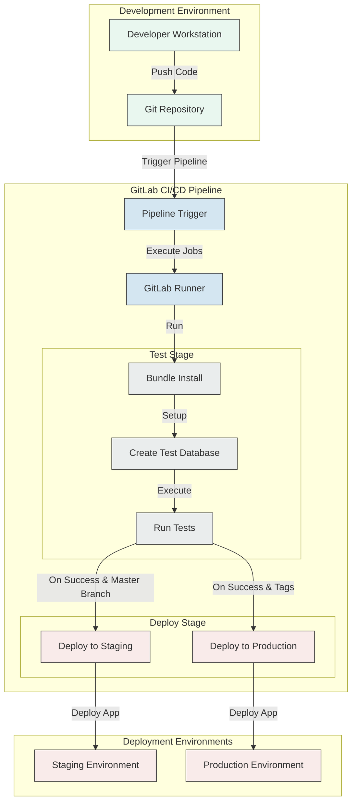
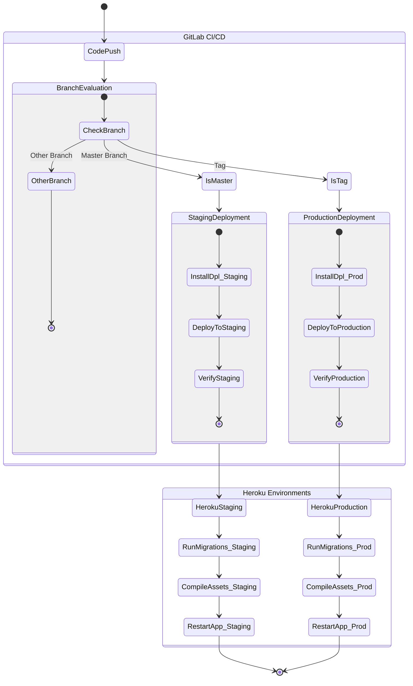
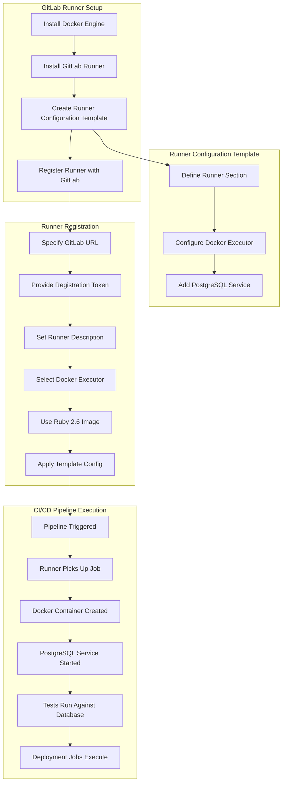

# Ruby Demo Deployment Guide

## Introduction to Deployment

Deployment is a critical aspect of the Ruby Demo application's lifecycle, ensuring that the widget management functionality is properly delivered to end users. A structured deployment process is essential for maintaining application integrity, managing version control, and providing a seamless user experience. For the Ruby Demo application, deployment encompasses not only the transfer of code to production servers but also the configuration of environments, database migrations, and asset compilation. The widget management functionality, which forms the core of the application, requires careful handling during deployment to ensure that CRUD operations continue to function correctly across different environments. This guide outlines a comprehensive approach to deploying the Ruby Demo application, with particular attention to GitLab CI/CD integration and Heroku deployment strategies.

## Environment Setup Requirements

Before deploying the Ruby Demo application, several environment configurations must be in place. The application requires Ruby 2.6 or later, as specified in the GitLab CI/CD configuration. Rails version compatibility should be verified according to the application's Gemfile. PostgreSQL is used as the database system, and proper database configuration is essential for each environment (development, test, staging, and production). Node.js is also required for asset compilation during the deployment process. Environment variables must be configured for database connections, API keys, and other sensitive information. Additionally, the deployment environment should have the necessary gems installed, particularly the 'dpl' gem with Heroku support for automated deployments. Ensuring these prerequisites are met will facilitate a smooth deployment process for the widget management functionality.

## Deployment Pipeline Architecture

### CI/CD Pipeline Flow for Ruby Demo Application

The diagram illustrates the complete CI/CD pipeline for the Ruby Demo application, showing how code progresses from development through testing to production environments. The process begins in the development environment where developers commit and push code to the Git repository. This triggers the GitLab CI/CD pipeline, which executes on a GitLab Runner configured with Docker and PostgreSQL services.

The pipeline consists of two main stages: Test and Deploy. In the Test stage, the application's dependencies are installed, a test database is created, and all tests are executed to verify the widget management functionality. Upon successful testing, the Deploy stage is activated based on specific conditions: pushes to the master branch trigger deployment to the staging environment, while tags trigger deployment to production.

The deployment process utilizes the 'dpl' gem to interact with Heroku's API, using secure API keys stored as CI/CD variables. This architecture ensures that only properly tested code reaches the staging environment, and only tagged releases (indicating production readiness) are deployed to the production environment, maintaining the integrity of the widget management system throughout the deployment lifecycle.

## GitLab CI/CD Configuration

The `.gitlab-ci.yml` file is the cornerstone of the Ruby Demo application's automated deployment process. This configuration defines three key jobs: test, staging, and production deployment. The test job installs necessary dependencies (including Node.js), sets up the application with bundle install, creates a test database, and runs the test suite to ensure widget functionality works correctly. The staging deployment job is configured to run only when changes are pushed to the master branch, using the 'dpl' gem to deploy to a designated Heroku staging application via the Heroku API. Similarly, the production deployment job is triggered exclusively by tags, deploying to the production Heroku application. Both deployment jobs rely on API keys stored as CI/CD variables (`HEROKU_STAGING_API_KEY` and `HEROKU_PRODUCTION_API_KEY`), ensuring secure credential management. This structured approach creates a clear progression from testing to staging to production, with appropriate gates at each stage to maintain application quality and stability.

## Security Configuration for Deployment

Securing the deployment process for the Ruby Demo application is paramount to protect both the application and its data. API keys, particularly the Heroku API keys used for deployment, should be stored as CI/CD variables in GitLab's secure variable storage rather than being hardcoded in configuration files. For the Ruby Demo application, two separate keys are maintained: one for staging and one for production, limiting the potential impact if either key is compromised. Environment variables containing sensitive information such as database credentials should be configured directly in the deployment platform (Heroku) rather than in the application code. When setting up these variables, consider using Heroku's config vars feature, which encrypts the values at rest. Additionally, ensure that the Rails master key and credentials are properly managed and not exposed in the repository. For the widget management functionality, any API endpoints should be secured with appropriate authentication mechanisms, and user input validation should be implemented to prevent security vulnerabilities. Regular security audits of the deployment pipeline and dependencies should be conducted to identify and address potential vulnerabilities.

## Heroku Deployment Workflow

### Heroku Deployment Process Based on Branch/Tag Triggers

The diagram visualizes the step-by-step workflow for deploying the Ruby Demo application to different Heroku environments based on branch or tag triggers. When code is pushed to the repository, the GitLab CI/CD pipeline evaluates the branch or tag to determine the appropriate deployment path.

For pushes to the master branch, the pipeline initiates the staging deployment process. This involves installing the 'dpl' gem, deploying the application to the designated Heroku staging environment using the stored API key, and verifying the deployment. The Heroku platform then takes over, running database migrations, compiling assets (including CSS and JavaScript for the widget interface), and restarting the application.

When a tag is created, indicating a release-ready version, the pipeline follows the production deployment path. Similar to staging, it installs the necessary deployment tools and deploys to the production Heroku environment. The production environment then undergoes the same post-deployment processes as staging.

This workflow ensures that the widget management functionality is properly tested in staging before reaching production, and that only explicitly tagged versions are deployed to the production environment. The separation of environments and deployment triggers provides a robust and controlled deployment process that maintains the integrity of the Ruby Demo application across all environments.

## Database Configuration for Deployment

Proper database configuration is essential for successful deployment of the Ruby Demo application across different environments. For each environment (development, test, staging, production), the database connection parameters should be configured through environment variables rather than hardcoded values. In the Heroku deployment context, the `DATABASE_URL` environment variable is automatically provided and should be used by the application's database.yml file. During deployment, database migrations must be run to ensure the schema is up-to-date. The GitLab CI/CD pipeline handles this for the test environment with the `bundle exec rake db:create RAILS_ENV=test` command, while Heroku automatically runs migrations during deployment with the `release: bundle exec rake db:migrate` command in the Procfile. For production deployments, consider using a migration strategy that minimizes downtime, such as running migrations that add columns or tables before deploying code that uses them. Data integrity for widget records should be maintained during migrations, with appropriate backup strategies in place before major schema changes. Additionally, seed data for widgets can be provided through the `db:seed` task, which should be environment-aware to avoid populating production with test data.

## Asset Configuration and Frontend Resources

Managing frontend assets during deployment is crucial for ensuring the Ruby Demo application's widget management interface renders correctly. In a Rails application, assets like CSS, JavaScript, and images are processed through the asset pipeline or Webpacker, depending on the application's configuration. During deployment to Heroku, assets are automatically precompiled as part of the build process, but this behavior can be customized through the `assets:precompile` Rake task. For the widget management functionality, ensure that all JavaScript interactions (such as form validations or dynamic content loading) are properly bundled and minified. CSS styles for widget display should be organized in a way that facilitates maintenance and reduces load times. Consider implementing a content delivery network (CDN) for serving static assets in production to improve performance. For environment-specific frontend configurations, use the Rails environment variables to conditionally load different resources. Additionally, ensure that image assets for widgets are optimized for web delivery to reduce page load times. When updating the frontend, be mindful of browser caching by implementing cache-busting techniques such as fingerprinting, which Rails handles automatically through the asset pipeline.

## GitLab Runner Setup

### GitLab Runner Configuration with Docker and PostgreSQL

The diagram illustrates the configuration process for setting up GitLab Runners with Docker and PostgreSQL services, which are essential for testing and deploying the Ruby Demo application. The setup begins with installing Docker Engine, followed by the GitLab Runner installation.

A key component of this setup is the creation of a runner configuration template that defines the Docker executor and includes PostgreSQL as a service. This template is specified in TOML format and includes the necessary configuration to make PostgreSQL available to the CI/CD jobs. The template is then used during runner registration, where the GitLab URL, registration token, runner description, and Docker image (ruby:2.6) are specified.

When a CI/CD pipeline is triggered, the registered runner picks up the job and creates a Docker container based on the specified Ruby image. The PostgreSQL service is started alongside this container, allowing the application's tests to run against a real database instance. This setup ensures that database interactions, particularly those related to widget management functionality, are properly tested in an environment that closely resembles production.

The PostgreSQL service is configured to be accessible via the hostname "postgres" with the username "postgres" and no password, as specified in the documentation. This configuration allows the application's database.yml to be set up to connect to this service during test execution, ensuring comprehensive testing of the widget management features before deployment to staging or production environments.

## Testing in the Deployment Pipeline

Automated testing is a critical component of the Ruby Demo application's deployment pipeline, ensuring that the widget management functionality works correctly before reaching users. The GitLab CI/CD configuration includes a dedicated test job that runs before any deployment occurs. This job sets up the necessary environment by installing Node.js (required for asset compilation), installing Ruby dependencies via Bundler, creating a test database, and executing the test suite with `bundle exec rake test`. The test suite should include unit tests for widget models, controller tests for widget CRUD operations, and integration tests that verify the complete widget management workflow. Test coverage should be monitored to ensure critical paths are adequately tested. The PostgreSQL service provided by the GitLab Runner configuration allows tests to run against a real database, ensuring that database interactions are properly verified. Failed tests prevent deployment to both staging and production environments, maintaining a quality gate that protects users from broken functionality. Consider implementing additional test types such as system tests with headless browsers to verify the widget management interface, and performance tests to ensure the application meets response time requirements under load.

## Monitoring and Post-Deployment Verification

After deploying the Ruby Demo application, it's essential to verify the deployment's success and monitor the application's health. Immediately following deployment, perform smoke tests to ensure basic functionality is working, particularly the widget management features. These tests should verify that widgets can be created, read, updated, and deleted through the web interface. For Heroku deployments, utilize the Heroku CLI or dashboard to check application logs for any errors during startup or initial user interactions. Set up application performance monitoring using services like New Relic or Heroku's built-in metrics to track response times, error rates, and resource utilization. Implement health check endpoints that can be monitored by external services to verify the application's availability. Database performance should be monitored closely, especially after migrations that might affect widget data access patterns. Consider implementing feature flags for new functionality, allowing you to disable problematic features without redeployment. Establish alerting thresholds for critical metrics to receive notifications when the application's health deteriorates. Finally, maintain a deployment log that records each deployment's version, date, and any issues encountered, facilitating troubleshooting and providing historical context for application behavior.

## Deployment Troubleshooting Guide

When encountering issues during deployment of the Ruby Demo application, a systematic approach to troubleshooting can help identify and resolve problems quickly. For CI/CD pipeline errors, first check the GitLab CI/CD job logs for specific error messages. Common issues include missing dependencies, failed tests, or configuration errors in the `.gitlab-ci.yml` file. If the pipeline fails during the test stage, examine the test output to identify which tests are failing and why, particularly those related to widget functionality. For Heroku-specific deployment issues, use `heroku logs --tail --app your-app-name` to view real-time logs. Common Heroku deployment problems include buildpack detection failures, dependency resolution issues, or database migration errors. If the application deploys but crashes on startup, check for environment variable misconfiguration or missing required services. Database-related issues often manifest as migration failures or connection errors; verify that the database URL is correctly configured and that migrations are compatible with the current database state. For asset compilation failures, ensure that all required Node.js packages are properly specified and that the asset compilation process is configured correctly. If deployment succeeds but widget management features aren't working, check for JavaScript errors in the browser console, API endpoint issues, or permission problems. Finally, if a deployment introduces regression issues, consider rolling back to the previous version using Heroku's rollback feature while investigating the root cause.

[Generated by the Sage AI expert workbench: 2025-03-29 18:36:01  https://sage-tech.ai/workbench]: #