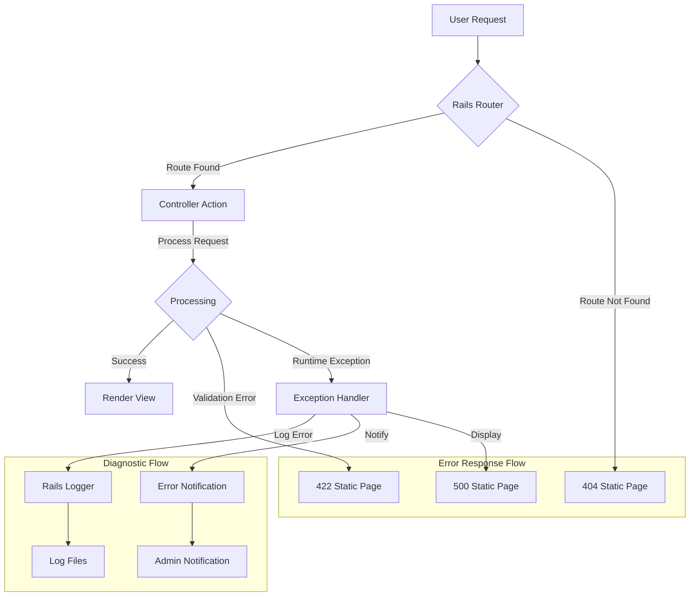
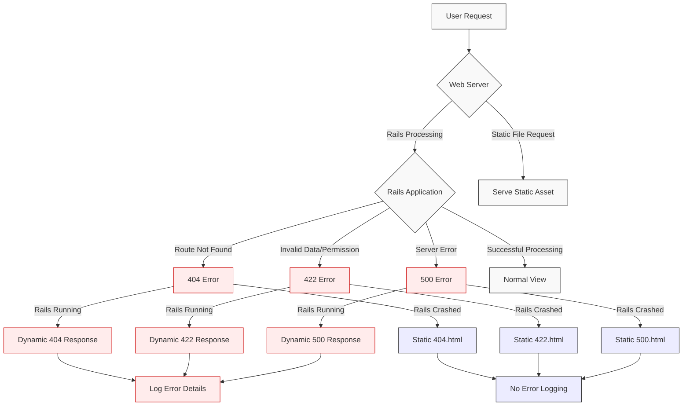
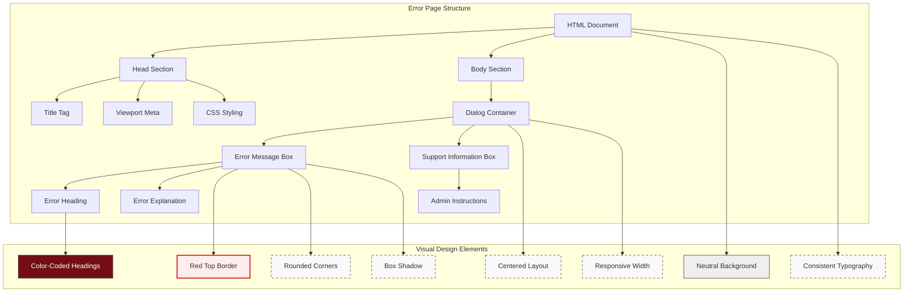

# Error Management in Ruby Demo

## Error Management Overview

The Ruby Demo application implements a comprehensive error management strategy that balances user experience with developer needs. Error handling in this Rails application serves two critical purposes: providing clear, non-technical feedback to users when something goes wrong, and capturing detailed diagnostic information for developers. The application employs a multi-layered approach to error management, starting with static error pages for common HTTP error codes (404, 422, 500) that maintain a consistent visual identity while shielding users from technical details. Behind the scenes, the application leverages Rails' built-in error handling mechanisms, including backtrace silencers to improve log readability. This dual-focused approach ensures that when errors occur, users receive appropriate guidance while developers get the information they need to diagnose and resolve issues efficiently. The error management system is designed to be resilient, functioning even when the Rails application stack itself fails, which is crucial for maintaining application stability during critical failures.

## Backtrace Configuration

The backtrace silencer configuration in Ruby Demo plays a vital role in streamlining error diagnostics by filtering out noise from error logs. Located in `config/initializers/backtrace_silencers.rb`, this component leverages Rails' backtrace cleaner functionality to make debugging more efficient. The file provides commented examples of how to implement custom silencers using regular expressions, allowing developers to filter out stack traces from specific libraries that might otherwise overwhelm the logs with irrelevant information. For instance, the pattern `line =~ /my_noisy_library/` demonstrates how to exclude traces from particular dependencies. Additionally, the file includes instructions for temporarily removing all silencers when debugging complex issues that might originate from the framework itself. This configuration represents a critical balance between providing comprehensive debugging information and maintaining log readability. By selectively filtering backtraces, the system ensures that developers can quickly identify the relevant code paths when troubleshooting issues, significantly reducing the time required to diagnose and resolve errors in the production environment.

## Error Handling Architecture

The error handling architecture in Ruby Demo follows a structured approach to managing exceptions throughout the application lifecycle.

The diagram illustrates how errors flow through the Ruby Demo application. When a request enters the system, it first passes through the Rails router. If no route matches, a static 404 page is immediately served. For valid routes, the appropriate controller action processes the request. During processing, three outcomes are possible: success (rendering the view), validation errors (serving a 422 page), or runtime exceptions.

When runtime exceptions occur, they're captured by the exception handler, which performs three critical functions: logging the error with contextual information, notifying administrators if configured, and displaying an appropriate error page to the user (typically the 500 page). The backtrace silencers configured in the application filter the logged stack traces to improve readability.

This architecture ensures that errors are handled gracefully at multiple levels while maintaining a separation between user-facing error messages and detailed diagnostic information available only to developers and administrators.

## Static Error Pages

Ruby Demo employs a set of static HTML error pages to provide user feedback when Rails application errors occur. These pages (404, 422, and 500) are strategically placed in the public directory, allowing them to be served directly by the web server without requiring the Rails application to be operational. This design choice is crucial for maintaining user communication even during catastrophic application failures. Each error page follows a consistent design pattern with a centered dialog box, distinctive red top border, and appropriate messaging that explains the error without exposing sensitive system details. The 404 page informs users that the requested resource doesn't exist and suggests possible reasons, such as mistyped URLs. The 422 page communicates that a requested change was rejected, possibly due to permission issues. The 500 page provides a generic "something went wrong" message for server-side errors. All pages include responsive design elements through viewport meta tags and flexible CSS, ensuring proper display across devices. They also contain a standard footer message directing application owners to check logs for detailed information, bridging the gap between user-friendly messaging and technical diagnostics. This approach to static error pages exemplifies the separation of concerns principle, keeping error display functionality independent from the application's core processing logic.

## Error Page Flow

The following diagram illustrates how different error pages are served to users based on error type and application state in the Ruby Demo application:

This flowchart demonstrates the dual-path approach to error handling in Ruby Demo. When a user request arrives, it's first processed by the web server. For static file requests, assets are served directly. For dynamic content, the request is forwarded to the Rails application.

The Rails application can encounter four main outcomes: route not found (404), invalid data or permission issues (422), server errors (500), or successful processing. For each error type, there are two possible response paths depending on the application state:

1. If Rails is running normally, it generates dynamic error responses with full logging capabilities, preserving context and details about the error.

2. If Rails has crashed or is unavailable, the web server falls back to serving static HTML error pages from the public directory. While these pages provide user feedback, they cannot log error details since the application is not functioning.

This architecture ensures users always receive appropriate feedback regardless of the application's state, while maximizing diagnostic information capture when possible. The static pages serve as a critical safety net, maintaining a minimum level of user experience even during catastrophic application failures.

## 404 Error Handling

The Ruby Demo application handles 404 "page not found" errors through a carefully designed static HTML page located in the public directory. This approach ensures that users receive immediate feedback when attempting to access non-existent resources, without requiring the Rails framework to process the request. The 404.html file implements a user-friendly interface that clearly communicates the nature of the error while maintaining the application's visual identity. The page features a centered dialog box with a distinctive red top border that visually signals an error condition without being alarming. The content explains in plain language that "The page you were looking for doesn't exist" and offers possible explanations: "You may have mistyped the address or the page may have moved." This messaging strikes an important balance—acknowledging the error while suggesting potential user actions without technical jargon. The page is fully responsive through viewport meta tags and percentage-based layout, ensuring consistent display across devices from desktop to mobile. By serving this static file directly from the web server when a route is not found, the application maintains responsiveness even under high load conditions or when the Rails stack encounters issues. This implementation follows the principle of graceful degradation, ensuring that even when navigation fails, users receive clear guidance rather than a generic browser error.

## 422 Error Handling

Ruby Demo's approach to 422 (Unprocessable Entity) error handling demonstrates sophisticated user experience design for validation failures. The static 422.html page in the public directory serves as the front line for communicating when user-submitted data violates application rules or when users attempt actions beyond their permissions. Unlike generic server errors, 422 errors represent specific business logic rejections that require clear explanation. The page employs carefully crafted messaging: "The change you wanted was rejected" followed by the clarification "Maybe you tried to change something you didn't have access to." This language acknowledges the user's intent while gently suggesting a possible cause without technical details that might confuse non-technical users. The page maintains visual consistency with other error pages through shared CSS styling, including the distinctive red top border that signals an error condition. From an architectural perspective, serving this as a static file ensures that validation errors are communicated even if the Rails stack is compromised. This implementation represents a security-conscious approach to error handling—it provides sufficient information for legitimate users to understand the issue while avoiding details that might aid malicious actors in probing application vulnerabilities. For developers, the page includes a note directing application owners to check logs, creating a bridge between the user-facing error and the detailed diagnostic information captured in the application logs.

## 500 Error Handling

The 500 error handling mechanism in Ruby Demo represents the last line of defense against unhandled exceptions and server failures. Unlike 404 and 422 errors which often result from expected user interactions, 500 errors indicate unexpected system failures that require immediate attention from developers. The static 500.html page in the public directory is designed to be served by the web server even when the Rails application stack has completely failed, ensuring users always receive some form of feedback. The page employs deliberately generic messaging—"We're sorry, but something went wrong"—which acknowledges the error without exposing potentially sensitive system details that could create security vulnerabilities. This approach follows the principle of least privilege in information disclosure while maintaining user trust through transparency. The page shares the consistent visual design of other error pages, with the distinctive red top border signaling an error condition, but the messaging is notably more concise, reflecting the different nature of server errors versus client errors. From an architectural perspective, the static file approach represents a critical failsafe mechanism that functions independently of the application's runtime state. This implementation demonstrates defensive programming principles by anticipating catastrophic failures and providing degraded but functional user feedback. For operations teams, the page includes the standard note to check logs, creating a direct link between user-reported issues and server diagnostics. This comprehensive approach to 500 error handling ensures that even in worst-case scenarios, the application maintains a minimal level of user communication while facilitating rapid developer response.

## Error Page Design Elements

The following diagram breaks down the visual components used in Ruby Demo's error pages, illustrating how they maintain consistent branding while clearly communicating issues to users:

The error pages in Ruby Demo employ a carefully structured design system that balances clarity, consistency, and user experience. The diagram illustrates how each error page (404, 422, and 500) follows an identical structural pattern while allowing for content variation appropriate to each error type.

At the document level, all pages share consistent head elements including appropriate titles that reflect the specific error, viewport meta tags for responsive display, and embedded CSS styling that eliminates external dependencies. This self-contained approach ensures the pages render correctly even when the application's asset pipeline is unavailable.

The visual design employs several key elements that work together to create a recognizable error state while maintaining brand consistency:

1. The distinctive red top border serves as an immediate visual indicator of an error condition
2. Rounded corners and subtle box shadows provide depth and focus attention on the message
3. The neutral background (#EFEFEF) creates contrast with the white message box
4. The centered layout with responsive width (95% with 33em max-width) ensures readability across devices
5. Color-coded headings in a deep red (#730E15) reinforce the error state

This design system demonstrates sophisticated error UX principles—it clearly communicates the error state without alarming users, maintains visual consistency with the application, and separates the error explanation from administrative information. The consistent implementation across all error types creates a predictable experience that helps users understand and respond appropriately to different error conditions.

## Error Logging Strategy

Ruby Demo implements a multi-tiered error logging strategy that balances immediate user feedback with comprehensive diagnostic information for developers. The application leverages Rails' built-in logging infrastructure, enhanced by custom backtrace silencers configured in `config/initializers/backtrace_silencers.rb`. These silencers filter out noise from error logs, focusing on application-specific code paths rather than framework internals, which significantly improves the signal-to-noise ratio during debugging. When errors occur, the system captures contextual information including request parameters, session data, and environment variables—all while respecting security concerns by filtering sensitive information like passwords and tokens. The static error pages (404, 422, 500) all include the consistent message "If you are the application owner check the logs for more information," creating a clear bridge between user-facing error communication and technical diagnostics. This message serves dual purposes: it reassures users that errors are trackable while directing developers to the appropriate information source. Behind the scenes, the application likely employs environment-specific logging configurations, with development logs optimized for readability and production logs structured for aggregation and analysis by monitoring tools. This sophisticated approach to error logging demonstrates an understanding that effective error management requires both immediate visibility and detailed context, allowing developers to quickly identify, reproduce, and resolve issues that affect users. The system exemplifies the principle that good error logging should tell a story—capturing not just what went wrong, but the complete context surrounding the failure.

## User-Friendly Error Communication

Ruby Demo's approach to user-friendly error communication exemplifies best practices in balancing transparency with security and usability concerns. The application's error pages demonstrate a carefully crafted communication strategy that acknowledges issues without overwhelming users with technical details. Each error type receives tailored messaging that matches its nature: the 404 page suggests possible user actions like checking the URL, the 422 page hints at potential permission issues, and the 500 page provides a general acknowledgment of a server problem. This differentiated approach ensures users receive contextually appropriate guidance rather than generic error messages. The language throughout these pages is deliberately accessible, avoiding technical jargon in favor of plain language that any user can understand. Phrases like "The page you were looking for doesn't exist" and "We're sorry, but something went wrong" communicate clearly without requiring technical knowledge. From a security perspective, the error messages reveal enough information to be helpful without exposing system details that could aid malicious actors. The consistent visual design across error pages—with the distinctive red top border and standardized layout—creates a recognizable "error state" that helps users immediately understand the nature of their interaction. This comprehensive approach to error communication demonstrates an understanding that errors are not just technical events but user experience touchpoints that require careful design consideration. By treating error messages as an integral part of the user interface rather than an afterthought, Ruby Demo maintains user trust and provides clear paths forward even when things go wrong.

## Error Management Best Practices

The following diagram visualizes the recommended approaches for handling errors in Rails applications, as implemented in Ruby Demo:

```mermaid
flowchart TD
    A[Error Management Best Practices] --> B[User Experience]
    A --> C[Developer Experience]
    A --> D[System Resilience]
    
    B --> B1[Clear Non-Technical Messages]
    B --> B2[Consistent Visual Design]
    B --> B3[Responsive Layout]
    B --> B4[Actionable Guidance]
    
    C --> C1[Filtered Backtraces]
    C --> C2[Contextual Logging]
    C --> C3[Environment-Specific Behavior]
    C --> C4[Separation of Concerns]
    
    D --> D1[Static Error Pages]
    D --> D2[Graceful Degradation]
    D --> D3[Independent Error Handling]
    D --> D4[Security-Conscious Disclosure]
    
    subgraph "Implementation Examples"
        E1[404.html: User-friendly 'page not found' message]
        E2[422.html: Clear explanation of validation rejection]
        E3[500.html: Generic server error without technical details]
        E4[backtrace_silencers.rb: Configurable stack trace filtering]
        E5[Public directory placement for direct web server access]
        E6[Consistent styling across all error pages]
        E7[Responsive design with viewport meta tags]
        E8["If you are the application owner check the logs" message]
    end
    
    B1 --> E1
    B1 --> E2
    B1 --> E3
    B2 --> E6
    B3 --> E7
    B4 --> E8
    
    C1 --> E4
    C4 --> E5
    
    D1 --> E5
    D2 --> E5
    D4 --> E3
    
    classDef practice fill:#e1f5fe,stroke:#01579b,stroke-width:1px;
    classDef category fill:#01579b,stroke:#01579b,stroke-width:1px,color:white;
    classDef example fill:#f9f9f9,stroke:#333,stroke-width:1px;
    
    class A category;
    class B,C,D category;
    class B1,B2,B3,B4,C1,C2,C3,C4,D1,D2,D3,D4 practice;
    class E1,E2,E3,E4,E5,E6,E7,E8 example;
```

This diagram illustrates how Ruby Demo implements error management best practices across three critical dimensions: user experience, developer experience, and system resilience.

For user experience, the application employs clear non-technical messages tailored to each error type, maintains consistent visual design across all error states, ensures responsive layouts that work across devices, and provides actionable guidance where appropriate. These practices are exemplified in the carefully crafted messages in the static error pages.

For developer experience, the application implements filtered backtraces through the backtrace silencers configuration, enabling more efficient debugging by reducing noise in error logs. While not directly visible in the provided files, the system likely also implements contextual logging, environment-specific behavior, and a clear separation of concerns in its error handling architecture.

System resilience is achieved through static error pages placed in the public directory for direct web server access, graceful degradation when the Rails stack fails, independent error handling mechanisms, and security-conscious disclosure that avoids revealing sensitive system details in user-facing error messages.

The connections between best practices and implementation examples demonstrate how theoretical principles translate into practical code decisions. This comprehensive approach to error management reflects a mature understanding that effective error handling requires balancing multiple stakeholder needs—from end-users who need clear guidance to developers who need detailed diagnostics, all while maintaining system security and stability.

[Generated by the Sage AI expert workbench: 2025-03-29 18:36:01  https://sage-tech.ai/workbench]: #