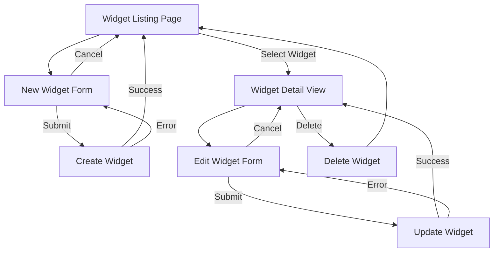
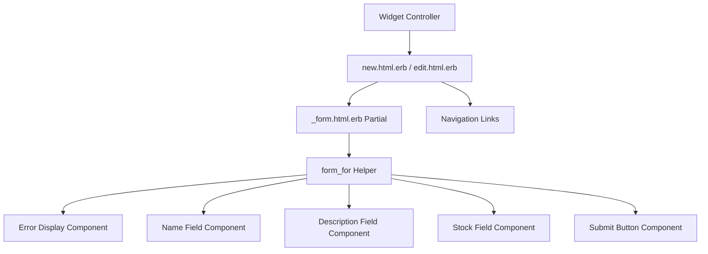
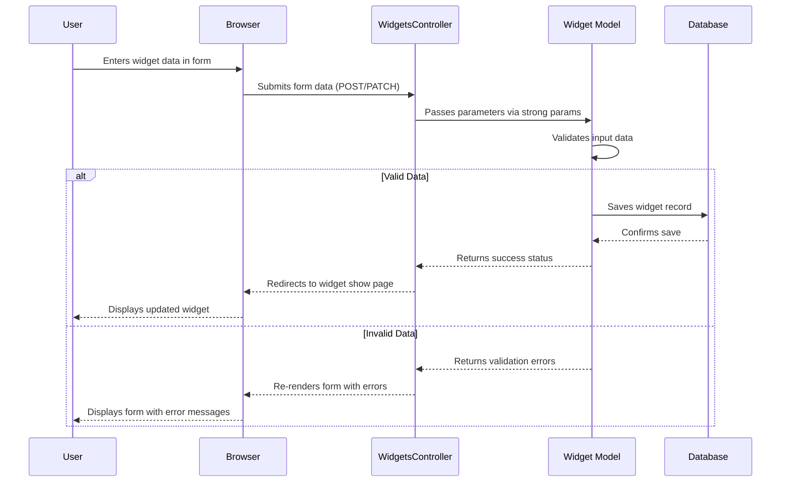
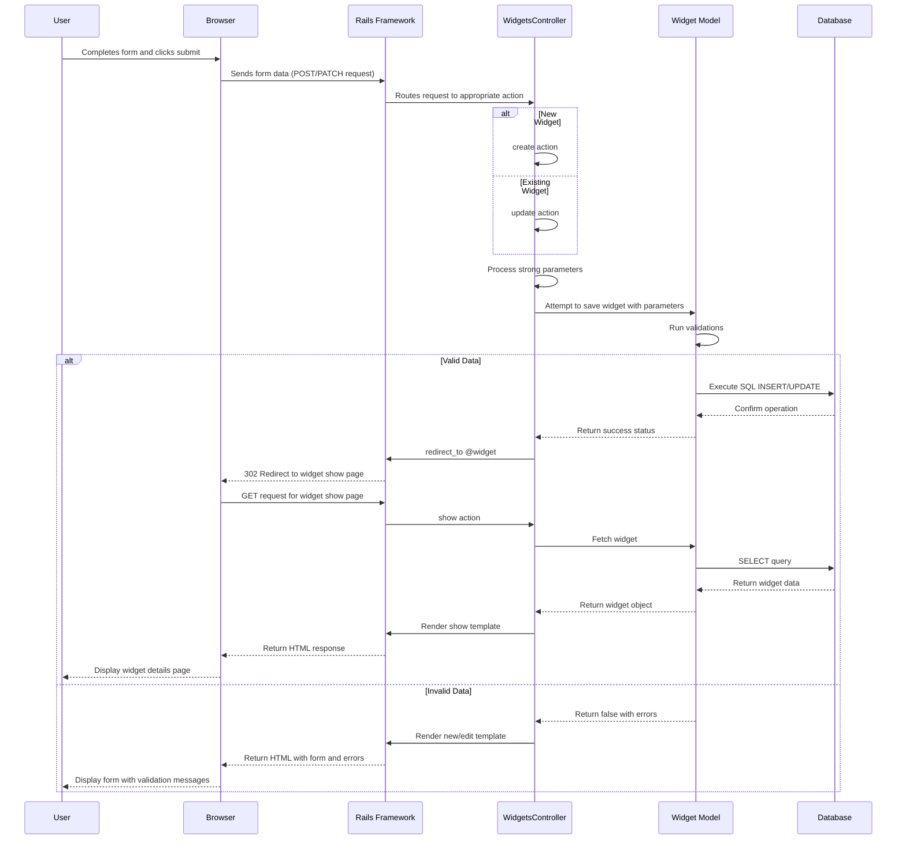

# Widget Management Forms in Ruby Demo

## Introduction to Widget Management Forms

The Ruby Demo application showcases a comprehensive widget management system built on Ruby on Rails, with forms serving as the primary interface for data interaction. These forms represent the core of the application's CRUD (Create, Read, Update, Delete) functionality, enabling users to efficiently manage widget resources. The form-based interface is strategically designed to provide a consistent user experience while handling the essential operations of creating new widgets, viewing existing ones, modifying their properties, and navigating between different management screens. The application leverages Rails' form helpers and partial templates to create a modular, maintainable interface that enforces data validation while providing clear feedback to users. This approach demonstrates best practices in web application design by separating concerns between data entry, processing logic, and presentation, while maintaining a cohesive user experience throughout the widget management workflow.

## Widget Management Workflow

The diagram above illustrates the complete widget management workflow in the Ruby Demo application. Users typically begin at the Widget Listing page, which serves as the central hub for widget management. From there, they can choose to create a new widget, which takes them to the New Widget form. Upon submission, the form either creates the widget and returns to the listing page, or displays validation errors that must be addressed.

When users select a specific widget from the listing, they navigate to the Widget Detail view, which presents comprehensive information about the selected widget. From this view, users can choose to edit the widget, leading them to the Edit Widget form. The edit form, which shares the same partial template as the new widget form, handles updates to existing widgets. After submission, users are either returned to the detail view upon success or shown validation errors if the input is invalid.

The workflow also supports widget deletion from the detail view, which returns users to the listing page after confirmation. Throughout the interface, cancel options allow users to abandon form operations and return to the previous screen, ensuring a flexible and user-friendly navigation experience.

## Form Structure and Components

The widget management forms in the Ruby Demo application are structured with a clear, logical organization that facilitates efficient data entry while maintaining a consistent user experience. Each form is built around three primary input fields that capture the essential attributes of a widget: name (implemented as a text field for short, identifying information), description (implemented as a text area for longer, detailed content), and stock (implemented as a number field to ensure numeric input for inventory tracking). These fields are wrapped in container divs with the "field" class, providing consistent styling and spacing throughout the interface.

The form structure follows a vertical layout pattern, with each field presented in sequence, accompanied by its label and appropriate input element. This approach creates a natural flow for data entry, guiding users through the process in a logical order. The form's submit button is contained within an "actions" div, visually separating it from the input fields and making the submission point clear to users. The form leverages Rails' form_for helper, which automatically handles the appropriate HTTP method and action URL based on whether the widget is new or existing, simplifying the implementation while ensuring proper RESTful behavior. This structure strikes an effective balance between simplicity and functionality, providing users with a straightforward interface for widget data entry while accommodating the application's data validation and processing requirements.

## Widget Form Component Hierarchy

The diagram above illustrates the component hierarchy of the widget management forms in the Ruby Demo application. This architecture demonstrates a thoughtful implementation of Rails' partial rendering system to promote code reuse and maintainability.

At the top level, the Widget Controller renders either the new.html.erb or edit.html.erb template depending on the requested action. Both of these view templates serve as lightweight containers that provide context-specific elements like appropriate headings ("New widget" or "Editing widget") and navigation links tailored to each context. 

The core of the form functionality is encapsulated in the _form.html.erb partial, which is rendered by both the new and edit templates. This partial contains the form_for helper that automatically adapts to the context, generating the appropriate form action and HTTP method based on whether @widget is a new or existing record.

Within the form partial, several logical components handle specific aspects of the form:
- The error display component shows validation errors when present
- Individual field components for name, description, and stock, each with appropriate labels and input types
- A submit button component that adapts its label based on the context

This component hierarchy demonstrates the DRY (Don't Repeat Yourself) principle by centralizing the form implementation in a single partial while allowing the parent templates to provide context-specific elements. This approach simplifies maintenance and ensures consistency across the widget creation and editing interfaces.

## Form Validation and Error Handling

The Ruby Demo application implements a robust form validation and error handling system that provides clear feedback to users when their input doesn't meet the required criteria. The validation logic is primarily defined in the Widget model (not shown in the provided files), which likely includes validations for presence, format, or numerical constraints on the widget attributes. When validation fails during form submission, the application leverages Rails' built-in error handling mechanisms to collect and display these errors in a user-friendly manner.

The error display implementation in the _form.html.erb partial demonstrates a thoughtful approach to error communication. When errors are present (@widget.errors.any?), the form renders a dedicated "error_explanation" div that prominently displays the number of errors using Rails' pluralize helper to ensure grammatically correct messaging. This is followed by an itemized list of specific error messages, each providing clear guidance on what needs to be corrected. This approach follows best practices in form design by placing error messages at the top of the form where they're immediately visible, while also providing specific, actionable feedback rather than generic error messages.

The error handling system works in tandem with the controller's response to invalid submissions, which re-renders the form with the user's input preserved and error messages displayed. This allows users to correct their mistakes without losing their work, creating a more forgiving and user-friendly experience. The combination of model-level validations and view-level error display creates a comprehensive system that maintains data integrity while guiding users toward successful form completion.

## Creating New Widgets

The new widget creation process in the Ruby Demo application is designed with simplicity and user guidance in mind. The interface begins with the new.html.erb template, which provides a clean, focused environment for data entry. The page is headed with a clear "New widget" title that immediately communicates the purpose of the interface to users. The form itself, rendered via the shared _form partial, presents three essential input fields for capturing widget attributes: name, description, and stock level. These fields are arranged in a logical sequence that guides users through the process of defining a new widget, from its basic identifier (name) to its detailed characteristics (description) and finally its inventory information (stock).

The form's design emphasizes clarity and ease of use, with each field clearly labeled and appropriately sized for its content type. The text field for name accommodates short identifiers, while the text area for description provides ample space for more detailed information. The number field for stock ensures that only numeric input is accepted for inventory tracking. The submit button at the bottom of the form is automatically labeled "Create Widget" by Rails' form helpers, providing clear action messaging to users.

Navigation is thoughtfully integrated into the interface, with a "Back" link allowing users to return to the widgets index page without creating a new widget. This creates a non-destructive escape route that preserves user agency throughout the process. The entire interface is wrapped in a container div that provides consistent styling and alignment with the rest of the application. This approach to new widget creation balances simplicity with functionality, providing users with a straightforward path to adding new items to the system while maintaining the application's data integrity requirements.

## Editing Existing Widgets

The widget editing functionality in the Ruby Demo application demonstrates effective reuse of form components while providing context-specific behavior appropriate for modifying existing data. The edit.html.erb template serves as a specialized container that establishes the editing context with a clear "Editing widget" heading, immediately communicating the purpose of the interface to users. The template then leverages the same _form partial used for widget creation, showcasing Rails' strength in component reuse while maintaining distinct user experiences for different operations.

When rendered in the editing context, the form is pre-populated with the existing widget's data, allowing users to see and modify the current values rather than starting from scratch. This approach respects users' time and reduces the potential for error by requiring them to change only what needs updating. The form_for helper in the partial automatically detects that it's working with an existing record and configures itself accordingly, setting the form's action to the update path and using the PATCH HTTP method as per RESTful conventions.

The editing interface provides enhanced navigation options compared to the creation form, with links to both view the current widget ("Show") and return to the widget listing ("Back"). This acknowledges that editing occurs within a broader context of widget management and provides users with natural pathways to related actions. Upon submission, the form either updates the widget and redirects to the show view upon success, or re-renders with validation errors if the input is invalid. This editing implementation demonstrates how Rails' conventions and partial rendering system can create specialized interfaces for different operations while maintaining code efficiency through strategic component reuse.

## Form Data Flow

The diagram above illustrates the complete data flow process for widget form submission in the Ruby Demo application. This sequence captures both the successful path and error handling scenarios that occur during form processing.

When a user interacts with either the new or edit widget form, they enter data into the provided fields (name, description, and stock). Upon submission, the browser sends this data to the WidgetsController via either a POST request (for new widgets) or a PATCH request (for updates to existing widgets).

The controller processes this incoming data through Rails' strong parameters mechanism, which filters the parameters to allow only the expected attributes. These sanitized parameters are then passed to the Widget model, which performs validation checks against the defined business rules.

If the data passes validation, the model saves the record to the database and returns a success status to the controller. The controller then redirects the browser to the widget's show page, completing the successful submission flow and providing the user with immediate feedback that their action was completed.

However, if validation fails, the model returns the validation errors to the controller. Instead of redirecting, the controller re-renders the form template with the current widget object that now contains error information. The form partial detects these errors and displays appropriate messages at the top of the form, while preserving the user's input in the form fields. This allows the user to correct the issues without losing their work.

This bidirectional flow of data ensures data integrity while providing a responsive user experience with clear feedback at each stage of the process.

## Navigation Structure in Form Interfaces

The Ruby Demo application implements a thoughtful navigation structure within its form interfaces, creating a cohesive user experience throughout the widget management process. The navigation elements are strategically placed to provide clear pathways between related screens while maintaining context awareness. In both the new and edit form views, navigation links are positioned at the bottom of the form, providing a logical next step after users have reviewed or interacted with the form content.

The navigation structure demonstrates context sensitivity, with links tailored to each specific view. The new widget form includes a single "Back" link that returns users to the widgets index, acknowledging that new widget creation typically begins from the listing page. The edit form expands on this with both "Show" and "Back" links, recognizing that editing often occurs after viewing a widget's details and users may want to return to either the specific widget view or the broader listing.

These navigation links are implemented using Rails' link_to helper, which generates semantic HTML anchors with appropriate URLs based on the application's routing configuration. The links are separated by a vertical bar (|) in the edit view, providing a subtle visual separator that maintains a clean, uncluttered interface while clearly delineating the different navigation options.

The consistent placement and styling of these navigation elements creates a predictable interface pattern that users can quickly learn and rely upon. This approach to navigation structure demonstrates an understanding of user flow through the application, providing intuitive pathways between related screens while maintaining the distinct context of each view. The result is a seamless experience that allows users to move confidently between different aspects of widget management without confusion or disorientation.

## Visual Styling of Form Elements

The Ruby Demo application employs a deliberate approach to visual styling of form elements, creating a consistent and accessible interface for widget management. The styling strategy begins with structural containment, as evidenced by the wrapping of both the new and edit templates in container divs. This container-based approach ensures proper alignment, spacing, and responsive behavior across different screen sizes, providing a solid foundation for the form elements within.

Within the forms themselves, the application uses a class-based styling system to create visual consistency. Each input field is wrapped in a div with the "field" class, creating uniform spacing and alignment between form elements. This approach separates the styling concerns from the functional HTML, allowing for centralized style definitions in the application's CSS files that can be consistently applied across multiple forms.

The form elements follow a vertical layout pattern with clear visual hierarchy. Labels are positioned above their corresponding input fields with a line break in between, creating a natural reading flow and ensuring that the relationship between labels and inputs is immediately clear. Input fields are sized appropriately for their content type, with the text field for name being more compact than the expanded text area for description, providing visual cues about the expected input length.

The submit button is visually separated from the input fields by being wrapped in an "actions" div, creating a clear delineation between data entry and form submission. Navigation links at the bottom of the forms are styled as standard hyperlinks, maintaining their familiar appearance and behavior while providing clear pathways to related screens.

This approach to visual styling demonstrates a balance between functional clarity and aesthetic consistency. By using structural containers, semantic class names, and thoughtful element positioning, the application creates a form interface that is both visually cohesive and intuitively usable, enhancing the overall user experience of the widget management system.

## Form Submission Process

The diagram above illustrates the detailed sequence of events that occur during the form submission process in the Ruby Demo application's widget management system. This comprehensive view reveals the sophisticated interplay between frontend and backend components during data processing.

When a user submits a widget form, the browser sends either a POST request (for new widgets) or a PATCH request (for updates) to the server. The Rails routing system directs this request to the appropriate controller action based on the URL and HTTP method.

Within the controller, the request is processed through several critical steps. First, the parameters are filtered through Rails' strong parameters mechanism, which acts as a whitelist to prevent mass assignment vulnerabilities. The controller then attempts to save the widget with these sanitized parameters.

The Widget model plays a central role in the submission process by running validations against the incoming data. These validations enforce business rules such as required fields, format constraints, or numerical ranges. If the data passes validation, the model executes the appropriate SQL command (INSERT for new records, UPDATE for existing ones) through the database adapter.

Upon successful database operation, the controller initiates a redirect to the widget's show page, resulting in a new request cycle where the browser fetches and displays the updated widget details. This pattern follows the Post/Redirect/Get convention, which prevents form resubmission issues and provides users with immediate feedback on their successful action.

If validation fails, however, the model returns a false status along with error information. The controller then re-renders the form template rather than redirecting, preserving the user's input and displaying validation messages. This approach allows users to correct their input without losing their work or context.

This sophisticated submission process demonstrates how Rails' convention-over-configuration philosophy creates a robust, secure, and user-friendly data handling system with minimal explicit code in the application.

## Rails Form Helpers and Their Benefits

The Ruby Demo application makes strategic use of Rails form helpers to create a robust and maintainable form interface for widget management. At the core of this implementation is the form_for helper, which provides numerous benefits that simplify development while enhancing functionality. This helper automatically determines the appropriate form action URL and HTTP method based on whether the @widget object is a new record or an existing one, eliminating the need for conditional logic in the view templates and ensuring adherence to RESTful conventions without explicit configuration.

The form helpers extend beyond basic form generation to provide sophisticated input handling. Field-specific helpers like text_field, text_area, and number_field generate appropriate HTML5 input elements with the correct types, names, and IDs, ensuring proper data binding and browser validation. These helpers automatically maintain state between form submissions, preserving user input when validation errors occur and pre-populating fields when editing existing records.

Error handling is another area where Rails form helpers excel. The application leverages Rails' error reporting system to collect validation failures and present them to users in a clear, actionable format. The pluralize helper demonstrates attention to detail by ensuring grammatically correct error messaging based on the count of validation failures.

The submit helper further showcases the adaptive nature of Rails' form system by automatically generating appropriate button text based on the context—"Create Widget" for new records and "Update Widget" for existing ones—without requiring explicit conditional logic in the view.

By leveraging these form helpers, the Ruby Demo application achieves several key benefits: reduced boilerplate code, consistent adherence to web standards and RESTful conventions, automatic adaptation to different contexts, and built-in security features like CSRF protection. This approach demonstrates how Rails' "convention over configuration" philosophy can create sophisticated, maintainable form interfaces with minimal explicit code, allowing developers to focus on application-specific requirements rather than reimplementing standard form handling patterns.

[Generated by the Sage AI expert workbench: 2025-03-29 18:36:01  https://sage-tech.ai/workbench]: #