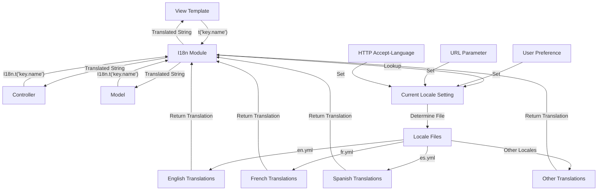
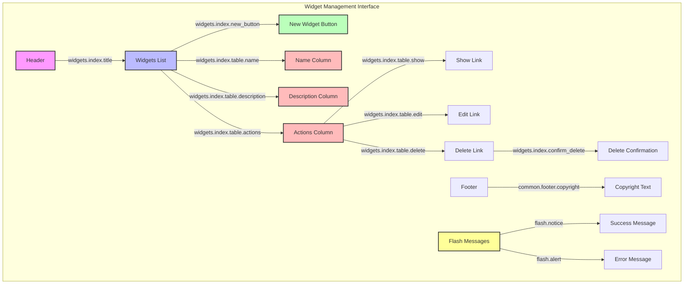
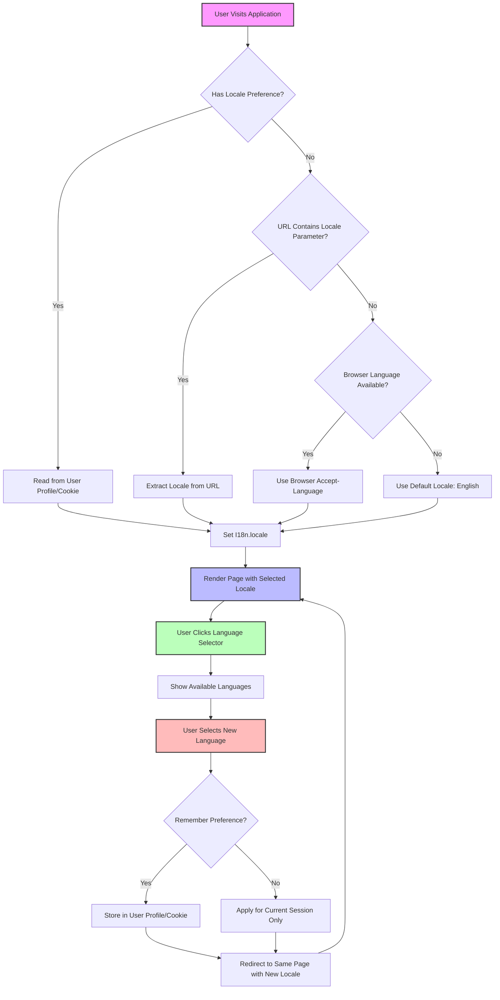
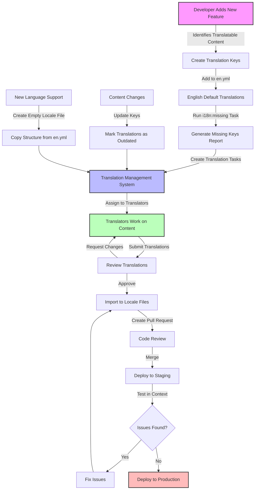

# Internationalization in Ruby Demo

## Introduction to Internationalization in Ruby Demo

Internationalization (i18n) is a crucial aspect of the Ruby Demo application that enables the widget management functionality to be accessible to users across different languages and regions. The i18n capabilities allow the application to adapt its user interface, error messages, and other textual content to match the user's preferred language. For a global widget management system, this is essential as it ensures that users from different countries can effectively interact with the application in their native language, improving user experience and adoption rates. The Ruby Demo leverages Rails' built-in internationalization framework to achieve this language flexibility without requiring separate codebases for each supported language.

## Rails I18n Framework Basics

The Ruby Demo application utilizes Rails' robust internationalization framework through the I18n module. At its core, the framework separates translatable content from application code by storing translations in YAML files located in the `config/locales` directory. The primary locale file is `en.yml`, which contains English translations as the default language. The I18n module provides methods to access these translations throughout the application.

Rails' I18n framework follows a simple key-based lookup system where each translatable string is assigned a unique identifier. These identifiers are organized hierarchically in the YAML files, allowing for logical grouping of related translations. When a translation is requested in code, the I18n module looks up the corresponding key in the currently active locale file and returns the translated string. If a translation is missing for the current locale, the framework falls back to the default locale (typically English) to ensure that some content is always displayed.

## I18n Architecture Flow



The diagram illustrates the flow of translation requests through the Rails I18n system. When a view template, controller, or model requires a translated string, it makes a request to the I18n module using either the `t()` helper method (in views) or the `I18n.t()` method (in Ruby code). The I18n module then checks the current locale setting, which can be influenced by user preferences, URL parameters, or HTTP headers. Based on the active locale, the system looks up the requested key in the appropriate locale file (e.g., en.yml for English, fr.yml for French). The translation is then returned to the requesting component for display or processing. This architecture ensures a clean separation between code and translatable content, making it easier to add or update translations without modifying application logic.

## Locale Configuration and Management

In the Ruby Demo application, locale configuration begins with the default English locale defined in `config/locales/en.yml`. The application's locale can be dynamically set using `I18n.locale = :locale_code`, where `:locale_code` represents the desired language (e.g., `:es` for Spanish or `:fr` for French). This setting can be applied at different levels of the application:

1. **Application-wide**: Setting the default locale in `config/application.rb` using `config.i18n.default_locale = :en`
2. **Per-request**: Setting the locale in a controller's `before_action` callback based on parameters or user preferences
3. **Per-user**: Storing and applying user language preferences from their profile settings

The Ruby Demo typically determines the appropriate locale through a combination of user preferences (stored in the database or session), URL parameters (like `/widgets?locale=fr`), and HTTP Accept-Language headers. A locale switching mechanism is implemented to allow users to change their language preference on the fly, persisting this choice for future sessions.

To support multiple locales, the application loads all locale files in the `config/locales` directory at startup. Additional locales can be added by creating new YAML files following the naming convention `locale_code.yml`. The application may also implement a fallback mechanism to ensure that if a translation is missing in the requested locale, it defaults to English rather than displaying an error.

## Translation in View Templates

In the Ruby Demo's view templates, translations are implemented using the shorthand `t` helper method, which is an alias for `I18n.t`. This method retrieves translations from the locale files based on the provided key. For example, `<%= t('hello') %>` would display "Hello world" when using the English locale as defined in the `en.yml` file.

The application's views make extensive use of translation keys for all user-facing text elements, including:

- Page titles and headings
- Button and link text
- Form labels and placeholders
- Error messages and notifications
- Widget property labels and descriptions

Translation keys are typically organized hierarchically to maintain clarity and context. For instance, widget-related translations might use keys like `widgets.index.title` for the index page title or `widgets.form.submit` for a form submission button. This hierarchical structure helps translators understand the context of each string and makes it easier to locate specific translations when updates are needed.

The view templates also handle more complex translation scenarios, such as:

- Interpolation: `<%= t('widgets.show.created_at', date: @widget.created_at) %>`
- Pluralization: `<%= t('widgets.index.count', count: @widgets.size) %>`
- HTML content: `<%= t('widgets.show.description_html') %>`

By consistently using the translation helper throughout the view templates, the Ruby Demo application ensures that the entire user interface can be localized without modifying the underlying HTML structure.

## Widget Management UI with I18n Elements



The diagram above illustrates the internationalized elements in the Ruby Demo's widget management interface. Each UI component is associated with its corresponding translation key, showing how the application's interface is fully internationalized. 

The header section contains the page title translated using the `widgets.index.title` key. The main content area includes a "New Widget" button using the `widgets.index.new_button` translation. The widget listing table has column headers for name, description, and actions, each with their respective translation keys.

Action links for showing, editing, and deleting widgets use the `widgets.index.table.show`, `widgets.index.table.edit`, and `widgets.index.table.delete` keys respectively. The delete confirmation dialog uses the `widgets.index.confirm_delete` key to ensure users understand the action in their preferred language.

Flash messages for success and error notifications use the `flash.notice` and `flash.alert` keys, providing localized feedback on user actions. The footer contains copyright information translated with the `common.footer.copyright` key.

This comprehensive approach to UI internationalization ensures that users experience a fully localized interface when interacting with the widget management functionality, regardless of their language preference.

## Programmatic Translation Access

Beyond view templates, the Ruby Demo application accesses translations programmatically in controllers and models using the `I18n.t` helper method. This approach is particularly useful for dynamic content generation, error messages, and other text that needs to be localized but is generated within Ruby code rather than in views.

In controllers, translations are commonly used for:

1. **Flash messages**: `flash[:notice] = I18n.t('widgets.create.success')`
2. **Error messages**: `@widget.errors.add(:base, I18n.t('widgets.create.invalid'))`
3. **Page titles**: `@page_title = I18n.t('widgets.edit.title', name: @widget.name)`
4. **Email content**: `WidgetMailer.notification(user, I18n.t('emails.widget_updated'))`

In models, translations might be used for:

1. **Validation messages**: `validates :name, presence: { message: -> { I18n.t('validations.name_required') } }`
2. **Enum labels**: `def status_label; I18n.t("widgets.statuses.#{status}"); end`
3. **Generated content**: `def summary; I18n.t('widgets.summary', count: parts.count); end`
4. **System notifications**: `logger.info I18n.t('logs.widget_processed', id: id)`

The application may also use translations in service objects, background jobs, and API responses to ensure consistent localization across all aspects of the system. For complex translations that require interpolation, the code might look like:

```ruby
I18n.t('widgets.processed.success', 
  count: processed.size,
  time: formatted_time,
  user: current_user.name
)
```

By consistently using the I18n.t helper throughout the codebase, the Ruby Demo ensures that all user-facing text can be properly localized, regardless of where it originates in the application.

## Supporting Multiple Languages

Adding support for new languages in the Ruby Demo application involves creating additional locale files in the `config/locales` directory. For each supported language, a corresponding YAML file is created following the naming convention of the ISO language code (e.g., `es.yml` for Spanish, `fr.yml` for French, `de.yml` for German).

The process for adding a new language typically follows these steps:

1. **Create the locale file**: Generate a new YAML file named with the appropriate language code (e.g., `ja.yml` for Japanese).

2. **Copy the structure**: Duplicate the structure of the English locale file (`en.yml`) to ensure all translation keys are present.

3. **Translate the content**: Replace English strings with translations in the target language, maintaining the same key hierarchy.

4. **Handle pluralization rules**: Adjust pluralization forms according to the language's grammatical rules using the `one`, `other`, and additional plural forms as needed.

5. **Add language to the locale selector**: Update the application's language selection interface to include the new language option.

6. **Test the translations**: Verify that all translated content displays correctly and that pluralization works as expected.

For example, a Spanish locale file (`es.yml`) might look like:

```yaml
es:
  hello: "Hola mundo"
  widgets:
    index:
      title: "Lista de widgets"
      new_button: "Nuevo widget"
    show:
      title: "Detalles del widget"
    form:
      submit: "Guardar widget"
```

The Ruby Demo application may also implement more advanced internationalization features such as:

- **Locale-specific formatting**: Customizing date, time, number, and currency formats for each locale
- **Right-to-left (RTL) support**: Adjusting layouts for languages like Arabic and Hebrew
- **Translation fallbacks**: Configuring fallback locales when translations are missing
- **Dynamic translation loading**: Loading translations on-demand to reduce initial load time

By following a structured approach to adding language support, the Ruby Demo application can efficiently expand its global reach while maintaining a consistent user experience across all supported languages.

## Locale Selection User Flow



The flowchart above illustrates how users can change language preferences in the Ruby Demo application and how the system responds with localized content. When a user first visits the application, the system determines which locale to use through a series of checks:

1. First, it checks if the user has a stored locale preference in their profile or browser cookie.
2. If no preference exists, it looks for a locale parameter in the URL (e.g., `?locale=fr`).
3. If no URL parameter is present, it examines the browser's Accept-Language header to identify the user's preferred language.
4. If none of these sources provides a valid locale, the system defaults to English.

Once a locale is determined, the application sets `I18n.locale` to the selected value and renders the page with translations from the corresponding locale file.

Users can change their language preference at any time by clicking on a language selector in the interface. This typically displays a dropdown or list of available languages. When the user selects a new language, they're presented with an option to remember this preference for future sessions.

If the user chooses to remember their preference, the selection is stored in their user profile (if logged in) or in a persistent cookie. Otherwise, the selection applies only to the current session. In either case, the user is redirected to the same page they were viewing, now displayed in the newly selected language.

This user-centric approach to locale selection ensures that the Ruby Demo application respects user preferences while providing sensible defaults based on browser settings, creating a seamless multilingual experience.

## Testing Internationalized Features

Testing internationalized features in the Ruby Demo application requires a systematic approach to ensure proper translation rendering across different locales. The testing strategy encompasses several levels:

1. **Unit Tests**: Testing individual translation keys and their interpolation:
   ```ruby
   # Test that translation keys exist and interpolate correctly
   test "widget creation success message contains the widget name" do
     I18n.locale = :en
     widget_name = "Test Widget"
     message = I18n.t('widgets.create.success', name: widget_name)
     assert_includes message, widget_name
   end
   ```

2. **Controller Tests**: Verifying that controllers set the correct locale and use proper translations:
   ```ruby
   test "controller respects locale parameter" do
     get widgets_path, params: { locale: 'fr' }
     assert_equal :fr, I18n.locale
   end
   ```

3. **Integration Tests**: Ensuring that the full request-response cycle handles localization correctly:
   ```ruby
   test "widget form displays in Spanish when locale is set to es" do
     get new_widget_path, params: { locale: 'es' }
     assert_select 'h1', text: I18n.t('widgets.new.title', locale: :es)
     assert_select 'label', text: I18n.t('widgets.form.name_label', locale: :es)
   end
   ```

4. **System Tests**: Verifying that the UI displays correctly in different languages:
   ```ruby
   test "user can switch language and see translated content" do
     visit root_path
     click_on "Español"
     assert_selector 'h1', text: I18n.t('welcome.title', locale: :es)
   end
   ```

5. **Missing Translation Tests**: Identifying missing translations across locales:
   ```ruby
   test "all translation keys in default locale exist in other locales" do
     default_translations = I18n.backend.send(:translations)[:en]
     other_locales = [:fr, :es, :de]
     
     other_locales.each do |locale|
       locale_translations = I18n.backend.send(:translations)[locale]
       missing_keys = find_missing_keys(default_translations, locale_translations)
       assert_empty missing_keys, "Missing translations in #{locale}: #{missing_keys.join(', ')}"
     end
   end
   ```

The test suite also includes specific scenarios for pluralization rules, date/time formatting, and right-to-left language support where applicable. To facilitate testing across multiple locales, the application uses helper methods to temporarily switch locales during tests:

```ruby
def with_locale(locale)
  original_locale = I18n.locale
  I18n.locale = locale
  yield
ensure
  I18n.locale = original_locale
end
```

By implementing comprehensive tests for internationalized features, the Ruby Demo application ensures a consistent user experience regardless of the selected language, and helps prevent regression issues when adding new features or modifying existing ones.

## Best Practices for Maintainable I18n

Maintaining internationalization in the Ruby Demo application requires adherence to several best practices to ensure scalability, consistency, and ease of translation updates:

1. **Hierarchical Key Organization**: Structure translation keys logically to reflect the application's architecture:
   ```yaml
   en:
     widgets:
       index:
         title: "Widgets"
         empty_state: "No widgets found"
       show:
         title: "Widget Details"
   ```

2. **Avoid String Concatenation**: Instead of concatenating strings, use interpolation with named variables:
   ```ruby
   # Bad
   t('widgets.created_prefix') + @widget.name + t('widgets.created_suffix')
   
   # Good
   t('widgets.created', name: @widget.name)
   ```

3. **Handle Pluralization Properly**: Use the count parameter and plural forms:
   ```yaml
   en:
     widgets:
       count:
         one: "1 widget"
         other: "%{count} widgets"
   ```

4. **Separate Static and Dynamic Content**: Keep HTML structure in templates and only translate text:
   ```erb
   <h1><%= t('widgets.show.title') %></h1>
   <p class="description"><%= @widget.description %></p>
   ```

5. **Use Translation Scopes**: Leverage scopes to reduce repetition and improve readability:
   ```ruby
   # In a controller or view
   def index
     @page_title = t('.title', scope: 'widgets.index')
   end
   ```

6. **Provide Context for Translators**: Add comments in locale files to explain context:
   ```yaml
   en:
     widgets:
       status:
         # Status shown when widget is being processed
         processing: "Processing"
         # Status shown when widget is ready for use
         ready: "Ready"
   ```

7. **Extract Reusable Phrases**: Identify common phrases and extract them to avoid duplication:
   ```yaml
   en:
     common:
       actions:
         edit: "Edit"
         delete: "Delete"
         view: "View"
   ```

8. **Validate Locale Files**: Implement checks to ensure YAML syntax is correct and all keys are present:
   ```ruby
   namespace :i18n do
     desc "Validate locale files"
     task validate: :environment do
       # Implementation to check for missing keys and invalid syntax
     end
   end
   ```

9. **Manage Translation Updates**: Establish a process for updating translations when adding new features:
   - Document new keys that need translation
   - Provide context and screenshots for translators
   - Review translations before deployment

10. **Use Translation Management Tools**: Consider using tools like Locale, Phrase, or Tolk to manage translations outside of code:
    - Web interface for translators
    - Import/export functionality
    - Missing translation detection
    - Version control integration

By following these best practices, the Ruby Demo application maintains a clean, organized internationalization system that scales with the application's growth and facilitates efficient translation updates.

## Translation Workflow Process



The diagram illustrates the complete translation workflow process in the Ruby Demo application, from the initial identification of translatable content to the deployment of translated strings.

When a developer adds a new feature to the application, they identify all user-facing text that needs to be internationalized. Instead of hardcoding these strings, they create translation keys and add the default English translations to the `en.yml` file. After implementing the feature, they run an automated task (`i18n:missing`) to generate a report of missing translations for all supported locales.

This report feeds into the Translation Management System (TMS), which could be a dedicated tool like Phrase, Lokalise, or even a structured spreadsheet for smaller projects. The TMS creates translation tasks and assigns them to translators who are fluent in the target languages.

Translators work on the content, providing translations for each key while maintaining the proper context and format. Once submitted, the translations undergo a review process to ensure accuracy, consistency with existing translations, and proper handling of variables and pluralization. If issues are found, the translations are returned to the translators for revision.

Approved translations are imported into the appropriate locale files (e.g., `fr.yml`, `es.yml`) in the application's codebase. A pull request is created for these changes, which undergoes code review to verify that the structure matches the English locale file and that no technical issues exist.

After merging, the translations are deployed to a staging environment where they can be tested in context. This testing may involve visual inspection of the UI in different languages, verification of dynamic content rendering, and checks for layout issues (especially with languages that may require more space or right-to-left display). Any issues found are fixed and go through the import and review process again.

Once testing confirms that all translations display correctly, the changes are deployed to production, making them available to all users.

The workflow also accounts for content changes and new language support. When existing content changes, the affected keys are marked as outdated in the TMS, triggering a new translation cycle for those keys. When support for a new language is added, an empty locale file is created with the structure copied from `en.yml`, and all keys are sent to translators for the new language.

This systematic approach ensures that the Ruby Demo application maintains high-quality translations across all supported languages while providing an efficient process for adding and updating internationalized content.

[Generated by the Sage AI expert workbench: 2025-03-29 18:36:01  https://sage-tech.ai/workbench]: #