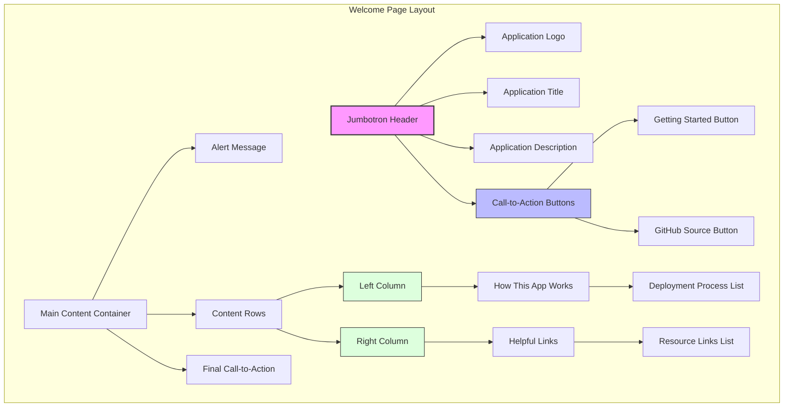
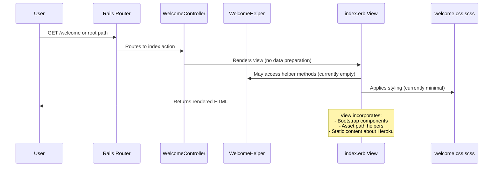
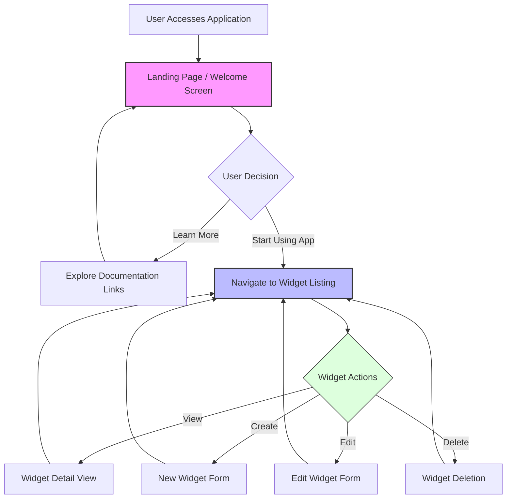

# Landing & Welcome in Ruby Demo

## Introduction to Ruby Demo's Welcome Interface

The Ruby Demo application provides a carefully designed entry point through its welcome interface, serving as the gateway to the widget management system. This interface is implemented through a minimalist controller architecture coupled with a rich, informative view template. The welcome interface serves multiple purposes: orienting new users to the application's capabilities, providing educational resources about the underlying technology stack (particularly Ruby on Rails and Heroku deployment), and creating clear pathways to the core widget management functionality. The landing page establishes the application's identity through consistent branding elements and a clean, Bootstrap-powered layout that emphasizes usability. By examining the controller, view template, styling, and helper components, we can understand how this entry point has been architected to provide an effective onboarding experience while maintaining the separation of concerns that characterizes well-structured Rails applications.

## Welcome Page Structure

The welcome page structure diagram illustrates the hierarchical organization of the Ruby Demo's landing interface. The page begins with a prominent jumbotron component that establishes the application's identity through the logo, title ("Getting Started with Ruby on Heroku"), and a concise description of the application's purpose. This section is designed to immediately orient users and set expectations about the application's functionality.

The jumbotron contains two strategically placed call-to-action buttons that direct users to either the Heroku documentation (for learning) or the GitHub repository (for code exploration). Below the jumbotron, the content is organized into a container with an informational alert, followed by a two-column layout that balances educational content about the application's deployment process with practical resources for further exploration. This structure follows established web design patterns for landing pages, prioritizing clarity and progressive disclosure of information while maintaining visual hierarchy through Bootstrap's responsive grid system.

## Welcome Controller Architecture

The WelcomeController exemplifies the principle of simplicity in Rails controller design. As seen in the source code, it inherits from ApplicationController and defines only an empty `index` method that responds to GET requests at the `/welcome` route. This minimalist approach aligns with Rails' "convention over configuration" philosophy—the controller doesn't need to prepare any specific data because the welcome page is primarily static content. The absence of complex logic in the controller keeps the codebase maintainable and follows the single responsibility principle by delegating content presentation entirely to the view layer. This architecture allows the welcome controller to serve as a clean entry point to the application without unnecessary coupling to business logic or data access concerns. Should the welcome page eventually require dynamic content (such as recent widget activity or user-specific information), the controller's design allows for easy extension while maintaining separation of concerns.

## Getting Started Experience

The welcome page in Ruby Demo has been meticulously crafted to provide a comprehensive "Getting Started" experience for new users. The page serves as both an introduction to the application itself and an educational resource about the underlying technology stack. The prominent placement of the "Getting Started with Ruby" button in the jumbotron immediately directs users to Heroku's documentation, while the GitHub source button provides access to the codebase for those interested in the implementation details. The page's content is strategically organized to explain the deployment process, with a step-by-step breakdown of how the application works with Heroku's platform—from dependency management via the Gemfile to dyno execution and scaling options. The right column complements this with curated links to relevant Heroku resources, creating a self-contained onboarding experience. The repeated emphasis on following the Getting Started guide, even for experienced developers, demonstrates a thoughtful approach to user education that recognizes the importance of platform-specific knowledge. This design pattern effectively bridges the gap between the application's widget management functionality and the technical infrastructure that supports it.

## MVC Flow for Landing Page

The MVC flow diagram illustrates how Ruby Demo's landing page is processed within the Rails framework. When a user requests the welcome page (either through the `/welcome` route or the application's root path), the Rails router directs the request to the `index` action in the WelcomeController. Unlike controllers that handle complex data operations, this controller performs no data preparation and simply triggers the rendering of the associated view template.

The view template (`index.erb`) is then processed, potentially accessing methods from the WelcomeHelper module (though currently empty) and applying styles defined in `welcome.css.scss`. The view incorporates Bootstrap components for responsive layout and uses Rails asset helpers to correctly reference static assets like the application logo. This separation of responsibilities—with the controller handling request flow, the view managing presentation, and the helper providing view-specific utilities—exemplifies Rails' implementation of the MVC architectural pattern, even in this relatively simple landing page context.

## Visual Styling of the Welcome Interface

The welcome interface's visual styling in Ruby Demo demonstrates a pragmatic approach to frontend design within a Rails application. The dedicated `welcome.css.scss` file, while currently empty except for explanatory comments, establishes a foundation for component-specific styling using Sass's enhanced CSS capabilities. This follows Rails' asset pipeline conventions, where controller-specific styles are automatically included in the compiled application stylesheet. The actual visual presentation of the welcome page relies primarily on Bootstrap's framework, as evidenced by the extensive use of Bootstrap classes in the view template—from the prominent "jumbotron" header to the responsive grid system ("col-md-6") and styled buttons ("btn btn-lg btn-primary"). This approach leverages Bootstrap's responsive design capabilities while maintaining the option to add custom styling as the application evolves. The inclusion of Glyphicons for visual cues (like the flash icon for the Getting Started button) adds subtle visual enhancement without overwhelming the interface. This styling strategy balances development efficiency with visual appeal, creating a professional appearance without requiring extensive custom CSS development.

## Integration with Widget Management

The welcome page serves as a strategic gateway to Ruby Demo's core widget management functionality. While the landing page itself doesn't directly expose widget-related features, it establishes the contextual framework within which users will interact with the widget system. The welcome interface implicitly prepares users for the widget management experience by introducing the application's purpose and technology stack. Although there are no explicit links to widget listing or creation interfaces in the current implementation, the landing page architecture allows for easy addition of such navigation elements—perhaps as prominent calls-to-action once users have oriented themselves to the application. The separation between the welcome controller and the widget-specific controllers maintains clean architectural boundaries while allowing for integration at the navigation level. This approach follows the principle of progressive disclosure, where users first understand the application's context before engaging with its specific functional capabilities. As the application evolves, the welcome page could be enhanced to showcase featured widgets or provide direct entry points to common widget management tasks, creating a more seamless transition from introduction to active use.

## User Journey from Landing to Widget Features

This flowchart illustrates the typical user journey from the Ruby Demo's landing page to its widget management features. The journey begins when a user accesses the application and is presented with the welcome screen, which serves as the decision point for further interaction.

From the landing page, users have two primary paths: they can either explore the educational resources provided (such as Heroku documentation and deployment guides) or proceed to the application's core functionality. When choosing to use the application, users navigate to the widget listing page, which becomes the central hub for widget management operations.

From the widget listing, users can branch into specific widget actions: viewing detailed information about a particular widget, creating new widgets through a form interface, editing existing widgets, or deleting widgets. After completing any of these actions, users typically return to the widget listing for further management tasks.

This user flow demonstrates how the landing page serves as both an educational resource and a gateway to the application's primary functionality, with the widget listing acting as the operational center for the application's core features.

## Helper Functions for Welcome Views

The WelcomeHelper module in Ruby Demo represents an architectural element with untapped potential. Currently implemented as an empty module, it adheres to Rails conventions by providing a dedicated namespace for view helper methods specific to the welcome interface. This design pattern follows the principle of separation of concerns, isolating view-specific logic from both the controller and the view template itself. While the current implementation doesn't define any helper methods, the module's presence establishes a foundation for future enhancements to the welcome page's functionality. Potential extensions could include methods for dynamically generating welcome messages based on user context, formatting timestamps for deployment information, conditionally displaying different resources based on user experience level, or integrating with the widget management system to display statistics or featured widgets. The module could also implement A/B testing functionality for different welcome page variants or provide internationalization support for welcome content. By maintaining this dedicated helper module, the application preserves architectural clarity while allowing for incremental enhancement of the welcome experience without cluttering the view template with complex logic.

## Heroku Integration Features

The welcome page of Ruby Demo places significant emphasis on Heroku integration, positioning the application not just as a widget management tool but as an educational resource for Heroku deployment practices. The page meticulously explains the Heroku deployment workflow, from code submission to dependency resolution via the Gemfile and dyno execution. This educational approach serves multiple purposes: it orients users to the platform infrastructure supporting the application, provides a technical context for understanding application behavior, and creates a bridge between application functionality and operational concerns. The inclusion of multiple links to Heroku resources—including the platform homepage, developer center, and specific guides for Ruby and Rails deployment—creates a comprehensive reference library embedded within the application itself. The page also highlights Heroku-specific features like add-on services and scaling capabilities, demonstrating how the application architecture leverages platform capabilities. This integration approach reflects a sophisticated understanding of modern web application development, where application functionality and deployment infrastructure are increasingly interconnected concerns. By explicitly addressing this relationship in the welcome interface, Ruby Demo establishes itself as both a functional tool and a reference implementation for Heroku-based Ruby applications.

[Generated by the Sage AI expert workbench: 2025-03-29 18:36:01  https://sage-tech.ai/workbench]: #