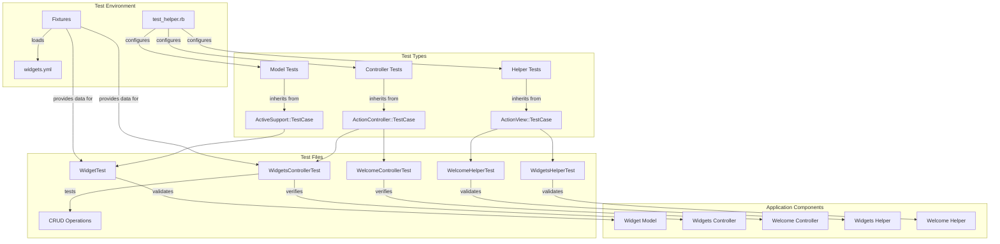
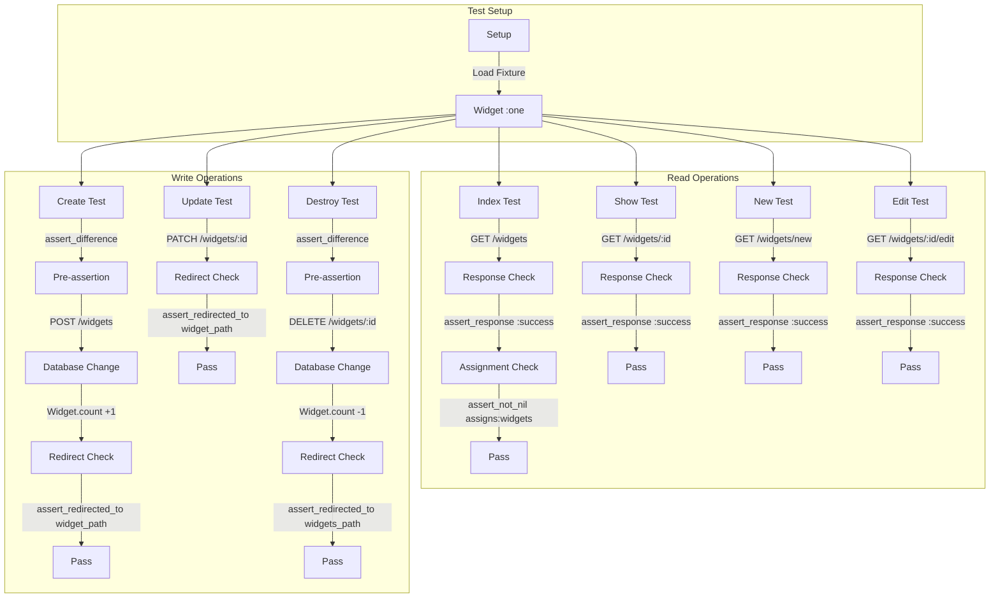
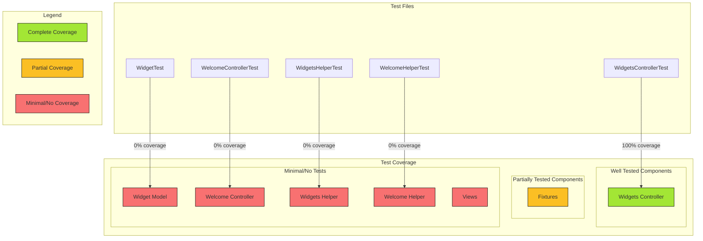

# Testing in Ruby Demo: A Comprehensive Analysis

## Introduction to Testing in Ruby Demo

The Ruby Demo application exemplifies a structured approach to testing in a Rails environment, focusing on widget management functionality and web interfaces. The testing framework is designed to validate all aspects of the application, from model validations to controller actions and view helpers. This comprehensive testing strategy ensures that the widget management functionality—the core of the application—operates correctly across all CRUD operations while maintaining a clean separation of concerns. The testing approach follows Rails conventions, leveraging built-in testing tools and fixtures to create a reliable test suite that can be executed as part of a continuous integration pipeline. By examining the testing structure, we gain insights into how the application's components interact and how quality is maintained through automated verification of functionality.

## Test Environment Configuration

The test environment in Ruby Demo is configured through the `test_helper.rb` file, which serves as the foundation for all tests in the application. This file sets the Rails environment to 'test' using a conditional assignment operator (`ENV['RAILS_ENV'] ||= 'test'`), ensuring tests run in isolation from development or production environments. The helper loads the Rails application environment and includes the necessary test support from Rails via `require 'rails/test_help'`.

The `ActiveSupport::TestCase` class is extended to provide a base class for all model tests, automatically loading all fixtures from the `test/fixtures` directory through the `fixtures :all` directive. This approach ensures consistent test data is available across all test cases. The class also provides a placeholder for adding custom helper methods that would be available to all test cases, allowing for shared testing functionality. The structure follows Rails conventions, making it easy for developers familiar with the framework to understand and extend the testing suite as the application grows.

## Testing Architecture Overview

The testing architecture in Ruby Demo follows a hierarchical structure that mirrors the application's components. At the foundation is the test environment configuration, which provides the necessary setup for all test types. The diagram illustrates how different test classes inherit from Rails' built-in test case classes, creating a specialized testing framework for each component type.

Model tests validate the business logic and data integrity of the Widget model, while controller tests verify the proper functioning of CRUD operations through the Widgets and Welcome controllers. Helper tests ensure that view support functionality works correctly. All tests rely on fixtures for consistent test data, particularly the widgets.yml fixture that defines sample widget records.

This architecture demonstrates a comprehensive approach to testing, covering all layers of the application from data models to user interface components. The structure ensures that each component is tested in isolation while still verifying their integration within the larger system.

## Test Data Management with Fixtures

The Ruby Demo application employs fixtures as a primary mechanism for test data management, with `widgets.yml` serving as a key example of this approach. Fixtures provide a consistent, predictable dataset that can be referenced across all test cases, ensuring that tests are reliable and repeatable.

The `widgets.yml` fixture defines two widget records, named "one" and "two," each with identical attributes: a name of "MyString," a description of "MyText," and a stock value of 1. This simplistic structure is intentional, providing just enough data to test the basic functionality of the Widget model and its associated controllers and views.

Fixtures are automatically loaded by the `fixtures :all` directive in the `test_helper.rb` file, making them available to all test cases. Within test methods, fixtures can be accessed using a method named after the fixture, as demonstrated in the `WidgetsControllerTest` where `@widget = widgets(:one)` retrieves the first widget fixture.

This approach to test data management offers several advantages:
1. Consistency across test runs, eliminating variability in test results
2. Simplicity in test setup, reducing boilerplate code
3. Clear separation between test data and test logic
4. Easy reference to predefined objects without complex factory setup

While the current fixture implementation is minimal, it could be expanded to include edge cases, different data types, or validation scenarios as the application's testing needs grow.

## Controller Testing Strategy

The controller testing strategy in Ruby Demo is exemplified by the comprehensive `WidgetsControllerTest` implementation. This test class methodically verifies each CRUD operation provided by the `WidgetsController`, ensuring that all actions respond appropriately and manipulate data correctly.

The test suite begins with a `setup` method that initializes a test widget from fixtures, providing a consistent starting point for all test cases. Each controller action is then tested with a dedicated test method that verifies:

1. **Proper HTTP responses**: Using `assert_response :success` to confirm successful requests or `assert_redirected_to` to verify proper redirects after form submissions
2. **Correct instance variable assignment**: Using `assert_not_nil assigns(:widgets)` to ensure controllers properly populate variables for views
3. **Database state changes**: Using `assert_difference('Widget.count')` to verify that create and destroy actions properly modify the database
4. **Appropriate redirects**: Confirming that after successful operations, users are directed to the appropriate next page

The test for each action is concise yet thorough. For example, the "should create widget" test verifies both that the database record count increases and that the user is redirected to the newly created widget's page. Similarly, the "should destroy widget" test confirms that the record count decreases and that the user is redirected to the index page.

This systematic approach ensures that all controller functionality is verified, providing confidence that the widget management features work as expected from an HTTP request/response perspective. The strategy aligns with Rails testing best practices, focusing on behavior rather than implementation details.

## CRUD Testing Workflow

The CRUD testing workflow in Ruby Demo illustrates a systematic approach to verifying all widget management operations. The diagram shows how each CRUD operation is tested through specific controller actions, with appropriate assertions to verify both the HTTP response and the effect on application state.

The workflow begins with test setup, loading a widget fixture that serves as the basis for all tests. Read operations (Index, Show, New, Edit) are tested by making HTTP GET requests and verifying successful responses. For Index, there's an additional check to ensure the controller properly assigns widgets for the view.

Write operations (Create, Update, Destroy) follow a more complex pattern. Create and Destroy tests use `assert_difference` to verify database changes before and after the action. All write operations check for proper redirects after completion, ensuring users are guided to the appropriate next page.

This comprehensive testing workflow ensures that all aspects of widget management are verified, from displaying lists and forms to creating, modifying, and removing records. The structured approach makes it clear what each test is verifying and provides confidence that the CRUD functionality works as expected.

## Model Testing Framework

The model testing framework in Ruby Demo is represented by the `WidgetTest` class, which inherits from `ActiveSupport::TestCase`. While the current implementation is minimal—containing only commented-out placeholder code—it establishes the foundation for comprehensive model testing.

In a fully implemented state, the `WidgetTest` would validate several aspects of the Widget model:

1. **Validations**: Tests would verify that widgets with invalid attributes (missing names, negative stock values, etc.) fail validation, while valid widgets pass.

2. **Business Logic**: Any custom methods or calculations performed by the Widget model would be tested to ensure they produce correct results.

3. **Associations**: If the Widget model had relationships with other models, tests would verify these associations work correctly.

4. **Callbacks**: Any before_save, after_create, or other lifecycle callbacks would be tested to ensure they execute properly.

The current skeleton structure follows Rails conventions by inheriting from `ActiveSupport::TestCase`, which provides access to assertions, fixtures, and other testing utilities. The commented line `# test "the truth" do` demonstrates the preferred syntax for defining test cases in Rails, using descriptive strings to name tests.

While not currently implemented, a robust model testing framework would be crucial for ensuring data integrity and business rule enforcement in the application. As the Widget model evolves with additional validations and business logic, corresponding tests would be added to this framework to maintain code quality and prevent regressions.

## View Helper Testing

The Ruby Demo application includes test files for both `WelcomeHelperTest` and `WidgetsHelperTest`, establishing a framework for testing view helpers. While both test classes are currently minimal implementations with no specific test methods, they provide the structure for testing helper methods that support the application's views.

View helper tests inherit from `ActionView::TestCase`, which provides specialized assertions and utilities for testing helper methods. These tests would typically verify:

1. **HTML generation**: Ensuring helpers generate correct HTML markup
2. **Conditional logic**: Verifying helpers display different content based on conditions
3. **Formatting**: Testing that data is properly formatted for display
4. **Complex calculations**: Validating any calculations performed for display purposes

For example, if the `WidgetsHelper` included a method to format widget stock levels with color coding (red for low stock, green for adequate stock), the corresponding test would verify that the correct CSS classes are applied based on different stock values.

The empty implementation suggests that either:
1. The helper modules currently contain no methods requiring tests
2. Helper testing is planned but not yet implemented
3. The application follows a minimal testing approach for view-related code

As the application evolves and view helpers gain more functionality, these test classes would be populated with specific test methods to ensure the helpers continue to function correctly. This approach maintains separation of concerns by isolating view-specific logic in helpers and verifying that logic independently from controllers and models.

## Test Coverage Map

The test coverage map provides a visual representation of testing thoroughness across the Ruby Demo application. It reveals a significant imbalance in test coverage, with the Widgets Controller being the only component with comprehensive testing.

The Widgets Controller benefits from complete coverage through the `WidgetsControllerTest` class, which tests all CRUD operations with appropriate assertions. This ensures that the core functionality of widget management is well-verified from a controller perspective.

Fixtures have partial coverage—while they exist and provide basic test data, they could be expanded to include more diverse scenarios and edge cases. The current implementation provides only identical widgets, which may not exercise all validation rules or business logic.

Several components have minimal or no effective test coverage:

1. **Widget Model**: Despite having a test file (`WidgetTest`), it contains no actual tests, leaving model validations and business logic unverified.

2. **Welcome Controller**: The `WelcomeControllerTest` exists but has no implemented tests, leaving the landing page functionality unverified.

3. **Helper Classes**: Both `WidgetsHelperTest` and `WelcomeHelperTest` are empty implementations, providing no coverage for view support functionality.

4. **Views**: There are no dedicated view tests, leaving the presentation layer entirely unverified.

This coverage map highlights areas requiring immediate attention to improve the application's test suite. Prioritizing model tests would be particularly valuable, as they verify the core business rules and data integrity constraints. Following that, implementing the welcome controller tests and helper tests would round out the coverage to ensure all application layers are properly verified.

## Welcome Controller Testing

The welcome functionality testing approach in Ruby Demo is represented by the `WelcomeControllerTest` class, which inherits from `ActionController::TestCase`. Currently, this test file exists as a skeleton with no implemented tests, containing only a commented-out placeholder test. This minimal implementation suggests that welcome page functionality testing is planned but not yet prioritized.

A fully implemented `WelcomeControllerTest` would typically verify several aspects of the landing page functionality:

1. **Page Rendering**: Tests would confirm that the welcome page renders successfully with a 200 HTTP status code.

2. **Content Verification**: Assertions would check for the presence of key elements like headings, introductory text, or calls to action.

3. **Navigation Links**: Tests would verify that important navigation links to other parts of the application (particularly the widgets section) are present and correctly formed.

4. **Dynamic Content**: If the welcome page displays dynamic content (like featured widgets or statistics), tests would verify this content is correctly retrieved and displayed.

The current implementation follows Rails conventions by inheriting from `ActionController::TestCase`, which provides access to controller-specific assertions and testing utilities. The commented line `# test "the truth" do` demonstrates the preferred syntax for defining test cases.

As the welcome functionality is likely the entry point for users into the application, implementing these tests would be valuable for ensuring a positive first impression. The welcome page testing would complement the more comprehensive widgets controller testing, providing end-to-end coverage of the user journey from landing page to widget management.

## Testing Best Practices in Ruby Demo

The Ruby Demo application demonstrates several testing best practices, while also highlighting opportunities for improvement in its testing approach. The existing test suite showcases the following positive patterns:

1. **Separation of Test Types**: Tests are organized by type (controllers, models, helpers) and inherit from appropriate base classes, maintaining clear separation of concerns.

2. **Fixture Usage**: Test data is managed through fixtures, providing consistent data across test runs and reducing test setup complexity.

3. **Comprehensive Controller Testing**: The `WidgetsControllerTest` thoroughly tests all CRUD operations, verifying both HTTP responses and database state changes.

4. **Assertion Variety**: Tests use a range of assertions including `assert_response`, `assert_redirected_to`, `assert_not_nil`, and `assert_difference`, providing thorough verification of different aspects of functionality.

5. **Test Helper Structure**: The `test_helper.rb` file establishes a foundation for all tests, with hooks for adding shared functionality.

However, several best practices are not fully implemented:

1. **Complete Coverage**: Many components have test files but no actual test implementations, leaving significant functionality unverified.

2. **Model Validation Testing**: The absence of model tests means that data validation rules are not explicitly verified.

3. **Edge Case Testing**: The minimal fixture data doesn't exercise boundary conditions or error scenarios.

4. **View Testing**: There's no explicit testing of view templates or rendered output.

To fully embrace testing best practices, the Ruby Demo application should:

1. Implement the skeleton test files with actual tests
2. Add model tests focusing on validations and business logic
3. Expand fixtures to include edge cases and invalid data scenarios
4. Consider adding system tests for end-to-end verification
5. Implement view tests or integration tests that verify rendered content

By addressing these gaps, the application would achieve a more comprehensive test suite that provides confidence in all aspects of functionality.

## Test-Driven Development Process

```mermaid
flowchart TD
    subgraph "TDD Cycle for New Widget Feature"
        direction TB
        
        W[Write Failing Test] --> R[Run Test]
        R --> |Red| I[Implement Feature]
        I --> RR[Run Test Again]
        RR --> |Green| Refactor
        Refactor --> W
    end
    
    subgraph "Example: Add Widget Rating Feature"
        MT[1. Add Model Test] --> |"test 'should validate rating range'"| MF[Model Test Fails]
        MF --> MV[2. Add Validation to Model]
        MV --> MP[Model Test Passes]
        
        MP --> CT[3. Add Controller Test]
        CT --> |"test 'should save rating'"| CF[Controller Test Fails]
        CF --> CA[4. Update Controller Action]
        CA --> CP[Controller Test Passes]
        
        CP --> VT[5. Add View Test]
        VT --> |"test 'should display rating'"| VF[View Test Fails]
        VF --> VI[6. Implement View Element]
        VI --> VP[View Test Passes]
        
        VP --> RT[7. Refactor Tests]
        RT --> RC[8. Refactor Code]
    end
    
    subgraph "Implementation Steps"
        M1["1. Add test for rating validation (1-5 stars)"]
        M2["2. Add rating column and validation"]
        C1["3. Add test for rating in controller params"]
        C2["4. Update controller to handle rating"]
        V1["5. Add test for rating display in view"]
        V2["6. Add rating display to widget views"]
        R1["7. DRY up test code"]
        R2["8. Optimize implementation"]
    end
    
    M1 --> M2
    M2 --> C1
    C1 --> C2
    C2 --> V1
    V1 --> V2
    V2 --> R1
    R1 --> R2
```

The Test-Driven Development (TDD) process illustrated above demonstrates how the Ruby Demo application could be extended with new features using a test-first approach. The diagram shows both the general TDD cycle and a specific example of adding a widget rating feature.

In the TDD cycle, development begins by writing a failing test that defines the expected behavior. After confirming the test fails (Red), the developer implements just enough code to make the test pass (Green). Once the test passes, the code is refactored to improve design while maintaining passing tests. This cycle repeats for each aspect of the feature.

The example walks through adding a widget rating feature:

1. **Model Layer**: The process begins with a test verifying that ratings must be within a valid range (1-5 stars). After the test fails, the developer adds a rating column and validation to the Widget model.

2. **Controller Layer**: Next, tests are added to verify that the controller properly handles rating parameters. The controller actions are then updated to process and store ratings.

3. **View Layer**: Tests are written to verify that ratings are displayed correctly in the view. The view templates are then updated to show the rating information.

4. **Refactoring**: Finally, both test code and implementation are refactored to eliminate duplication and improve design.

This TDD approach ensures that all new functionality is fully tested and that tests drive the design of the code. For the Ruby Demo application, adopting this process would address the current gaps in test coverage while ensuring that new features are developed with testing as a primary consideration. The process also naturally leads to more modular, maintainable code by focusing on one small piece of functionality at a time.

[Generated by the Sage AI expert workbench: 2025-03-29 18:36:01  https://sage-tech.ai/workbench]: #