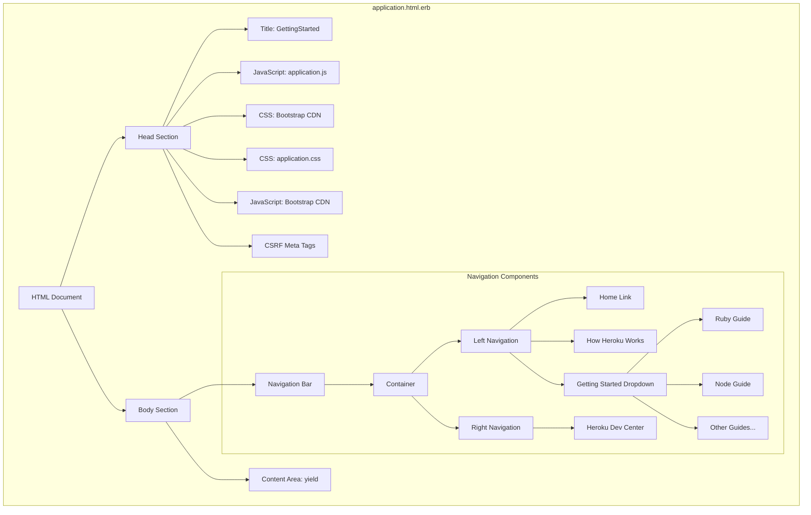
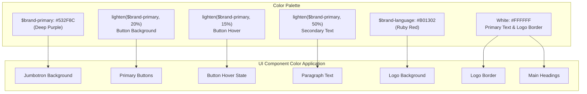
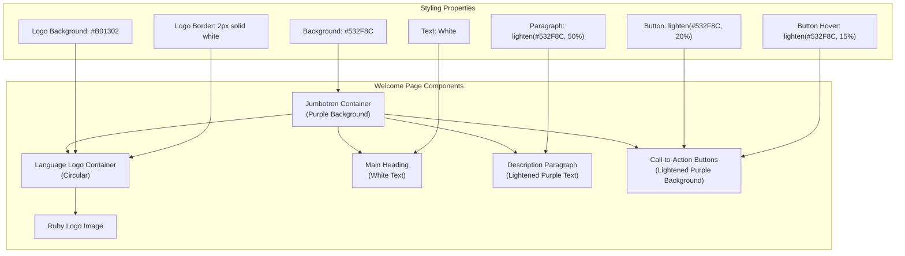
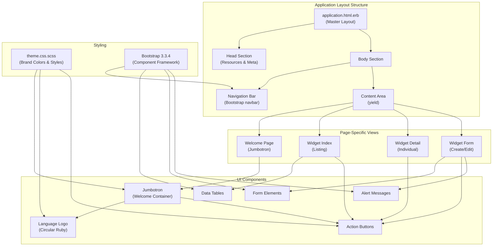

# Ruby Demo Application UI Analysis

## Application Layout Structure

The Ruby Demo application employs a well-structured layout template that establishes a consistent UI framework across all pages. The primary layout is defined in `application.html.erb`, which serves as the master template for the entire application. This template implements a standard HTML5 document structure with proper head and body sections. The layout incorporates both local application assets and CDN-hosted Bootstrap 3.3.4 resources, ensuring reliable styling and JavaScript functionality while minimizing local asset management. The template's structure follows responsive design principles through Bootstrap's grid system, allowing content to adapt to various viewport sizes. The layout template strategically separates navigation elements from the main content area using Bootstrap's navbar component, with the main content injected via Rails' `yield` helper. This separation of concerns allows individual view templates to focus solely on their specific content while inheriting the consistent navigation and structural elements defined in the master layout.

## Page Layout Components

The diagram illustrates the hierarchical structure of the application's layout components. The main HTML document is divided into head and body sections. The head section contains essential resources including application JavaScript with Turbolinks tracking, Bootstrap CSS from CDN, application-specific stylesheets, Bootstrap JavaScript, and CSRF protection meta tags. The body section contains two primary components: the navigation bar and the content area where page-specific content is injected through Rails' yield mechanism.

The navigation bar is structured with Bootstrap's navbar component, featuring left-aligned navigation elements (home link, Heroku information, and a dropdown menu with various getting started guides) and right-aligned elements (Heroku Dev Center link). This organization creates a clear visual hierarchy and ensures users can easily navigate through the application while maintaining access to relevant Heroku resources.

## Navigation System Design

The Ruby Demo application implements a sophisticated navigation system using Bootstrap's navbar component, providing users with intuitive access to both application features and external Heroku resources. The navigation bar is configured as `navbar-default navbar-static-top navbar-inverse`, establishing a dark-themed, fixed-position header that remains accessible throughout the user experience. The navigation structure is divided into logical sections: primary navigation on the left and supplementary links on the right, creating visual balance and functional organization. 

The left navigation section includes a home link marked with the glyphicon-home icon for immediate application access, a link to Heroku's documentation about its architecture, and a comprehensive dropdown menu. This dropdown is particularly noteworthy as it implements a hierarchical navigation pattern, organizing multiple getting-started guides by programming language and special use cases. The dropdown is triggered by a toggle element with appropriate ARIA attributes (`role="button"`, `aria-expanded="false"`) to ensure accessibility compliance. The menu items are logically grouped with a divider separating standard language guides from specialized integration guides.

The right-aligned navigation element provides a persistent link to the Heroku Dev Center, ensuring that comprehensive documentation is always one click away. Each navigation element incorporates appropriate glyphicon icons, enhancing visual recognition and providing subtle cues about the link destinations. This thoughtful navigation design balances simplicity with comprehensive access to resources, ensuring users can efficiently move through the application while maintaining contextual awareness.

## Visual Branding Elements

The Ruby Demo application establishes a distinct visual identity through carefully crafted branding elements defined in the `theme.css.scss` file. The application's color scheme is anchored by two primary SCSS variables: `$brand-primary` (a rich purple shade #532F8C) and `$brand-language` (a bold ruby red #B01302), which create a distinctive and complementary palette. These colors are strategically applied throughout the interface to create visual cohesion and reinforce the application's identity. Typography leverages Bootstrap's default font stack, providing clean readability while maintaining cross-platform compatibility.

The jumbotron component serves as the primary canvas for brand expression, featuring the `$brand-primary` background with white text for maximum contrast and readability. Descriptive text is rendered in a lighter shade (created programmatically using SCSS's `lighten()` function at 50% lightness) to create visual hierarchy while maintaining the color theme. Interactive elements like buttons are styled with lighter variations of the primary brand color, with hover states defined at 15% lightness to provide subtle but noticeable feedback during user interaction.

The Ruby language logo is presented as a circular element with precise dimensions (100px × 100px), featuring the distinctive ruby red background and a 2px white border that creates visual separation from the purple jumbotron background. This circular treatment of the logo creates a focal point that immediately communicates the application's Ruby foundation. The combination of these carefully considered visual elements creates a cohesive and professional appearance that balances technical credibility with visual appeal.

## Color Scheme and Brand Identity

The diagram illustrates the Ruby Demo application's color scheme and how these colors are applied to different UI components. The color palette is built around two key brand colors: a deep purple (`$brand-primary: #532F8C`) that serves as the primary application color and a ruby red (`$brand-language: #B01302`) that represents the Ruby programming language.

These base colors are extended through SCSS color functions to create a harmonious palette. The primary purple is lightened by 20% to create button backgrounds, lightened by 15% for button hover states, and lightened by 50% for secondary text elements. This programmatic approach ensures color consistency while providing appropriate contrast for different UI elements.

The application of these colors to UI components creates a cohesive visual identity. The jumbotron background uses the primary purple, creating a bold canvas for the welcome content. The Ruby logo features the ruby red background with a white border for contrast against the purple jumbotron. Text elements use white for primary headings and lightened purple for paragraphs, ensuring readability while maintaining the brand aesthetic. This thoughtful color application reinforces the Ruby identity while creating a professional and visually appealing interface.

## Welcome Screen Implementation

The Ruby Demo application features a carefully designed welcome screen implemented through Bootstrap's jumbotron component, which serves as the primary landing experience for users. The jumbotron is styled with the application's brand primary color (#532F8C) as its background, creating an immediate visual impact and establishing the application's color identity. At the center of the welcome screen is the circular Ruby logo, rendered with the distinctive ruby red background (#B01302) and a 2px white border. This logo implementation uses CSS border-radius and overflow handling to create a perfect circle with dimensions of 100px × 100px, ensuring the Ruby emblem is prominently displayed.

The welcome screen's typography is structured to create a clear visual hierarchy, with white headings for maximum contrast against the purple background, and lighter-colored paragraph text (created by lightening the primary color by 50%) for supporting content. The descriptive text is constrained to 75% maximum width and centered with auto margins, creating balanced whitespace and improving readability. Call-to-action buttons are styled with a lighter shade of the primary color, with hover states defined to provide interactive feedback. The jumbotron's bottom padding (80px) creates ample breathing room that enhances the visual impact of the welcome content.

The implementation includes a subtle but important positioning adjustment (`margin-top: -20px`) when the jumbotron appears after the navbar, eliminating unnecessary spacing and creating a more cohesive visual connection between the navigation and welcome content. This attention to detail in the welcome screen implementation creates an engaging entry point that clearly communicates the application's Ruby identity while providing an aesthetically pleasing user experience.

## Welcome Page Structure

The diagram illustrates the structure and styling of the Ruby Demo application's welcome page. The welcome page is built around a jumbotron component that serves as the container for all welcome content. At the top of the jumbotron is the circular language logo container, which features the Ruby logo against a ruby red background (#B01302) with a white border for visual definition.

Below the logo, the welcome page presents a main heading in white text for maximum contrast against the purple background. This is followed by a description paragraph styled with a lighter shade of purple (created by lightening the primary color by 50%), which improves readability while maintaining the color theme. The description is constrained to 75% of the container width and centered with auto margins, creating balanced whitespace.

At the bottom of the jumbotron are call-to-action buttons styled with a lighter shade of the primary purple color, with defined hover states that darken slightly to provide visual feedback during interaction. The entire jumbotron has significant bottom padding (80px) to create a spacious, visually appealing welcome area.

This structured approach to the welcome page creates a clear visual hierarchy that guides users through the content while reinforcing the application's Ruby identity through consistent color application and prominent logo placement.

## Responsive Design Approach

The Ruby Demo application implements a comprehensive responsive design approach that ensures optimal user experience across devices of varying screen sizes. The foundation of this approach is the integration of Bootstrap 3.3.4, loaded from a CDN to ensure reliable delivery and potential browser caching benefits. Bootstrap's responsive grid system is leveraged throughout the application, automatically adapting layouts based on viewport dimensions without requiring separate mobile-specific templates.

The navigation system exemplifies this responsive approach through the `navbar-static-top` class, which ensures the navigation bar remains accessible while scrolling on smaller devices. The navbar is configured to collapse into a hamburger menu on mobile devices, preserving access to all navigation options while optimizing screen real estate. Dropdown menus are implemented with appropriate Bootstrap data attributes (`data-toggle="dropdown"`) to ensure touch compatibility on mobile devices.

Content elements like the jumbotron are styled with relative units and percentage-based constraints. For example, descriptive text is limited to 75% width with auto margins, allowing it to scale proportionally across different screen sizes while maintaining readability. The Ruby logo is defined with fixed dimensions (100px × 100px) to maintain its circular appearance, but the containing elements use flexible sizing to ensure proper alignment regardless of viewport width.

The application's stylesheet leverages SCSS's nesting capabilities to create contextual styling that maintains parent-child relationships when rendered at different screen sizes. While the provided code doesn't include explicit media queries, the Bootstrap integration provides breakpoint-based adaptations that ensure the interface remains functional and visually coherent from mobile phones to desktop displays. This approach to responsive design demonstrates a pragmatic balance between custom styling and framework utilization.

## Widget Management Interface

The Ruby Demo application provides a streamlined widget management interface that enables users to perform CRUD operations through intuitive UI components. While the specific widget templates aren't included in the provided files, the application's structure suggests a conventional Rails approach to resource management with dedicated views for listing, creation, editing, and deletion operations. The widget management interface likely inherits the application's consistent layout structure defined in `application.html.erb`, ensuring navigation and branding elements remain accessible throughout the widget workflow.

The interface presumably follows Bootstrap's component patterns, utilizing cards or panels for individual widget display, forms with validation feedback for creation and editing operations, and modal dialogs or confirmation patterns for destructive actions like deletion. The application's color scheme, defined in `theme.css.scss`, would be applied consistently to widget management components, with primary actions highlighted using the application's brand colors.

For data presentation, the interface likely employs Bootstrap's responsive table component for the widget listing view, ensuring proper data alignment and readability across device sizes. Form elements for widget creation and editing would leverage Bootstrap's form controls with appropriate validation states and feedback mechanisms. The interface would maintain visual consistency with the welcome screen through shared color variables and styling patterns, creating a cohesive experience as users transition from the landing page to active widget management.

## User Interface Component Hierarchy

This diagram illustrates the hierarchical structure of UI components in the Ruby Demo application. At the top level is the master layout defined in `application.html.erb`, which contains the head section with resources and meta tags, and the body section with the navigation bar and content area. The content area uses Rails' yield mechanism to inject page-specific views.

These page-specific views include the welcome page with its jumbotron component, and various widget management views (index, show, and form). Each view incorporates appropriate UI components: the welcome page features the jumbotron with the Ruby logo and action buttons; the widget index view includes data tables and action buttons; the widget detail view displays individual widget information with action buttons; and the widget form view contains form elements, buttons, and alert messages for validation feedback.

The styling layer shows how `theme.css.scss` provides custom styling for brand-specific elements like the jumbotron, logo, and buttons, while Bootstrap 3.3.4 provides the underlying component framework for the navbar, tables, forms, and alerts. This hierarchical approach creates a modular UI architecture where components can be maintained independently while ensuring visual and functional consistency throughout the application.

## Frontend Security Implementation

The Ruby Demo application implements several critical frontend security measures to protect against common web vulnerabilities. Most notably, the application incorporates Rails' built-in Cross-Site Request Forgery (CSRF) protection through the `csrf_meta_tags` helper in the layout template. This helper generates meta tags containing unique tokens that are automatically included in all forms and AJAX requests, ensuring that only legitimate requests originating from the application itself are processed by the server. This protection is essential for preventing CSRF attacks where malicious sites could trick authenticated users into performing unwanted actions.

The application's asset loading strategy also contributes to security by using the `data-turbolinks-track` attribute for both JavaScript and CSS assets. This ensures that when application assets are updated, Turbolinks will force a full page refresh rather than performing its standard partial replacement, preventing potential inconsistencies between cached frontend code and server-side changes. For external resources, the application uses CDN-hosted Bootstrap assets over HTTPS, mitigating the risk of man-in-the-middle attacks that could inject malicious code.

While not explicitly shown in the provided code, the application likely leverages Rails' automatic HTML escaping in view templates to prevent Cross-Site Scripting (XSS) attacks. The consistent use of Bootstrap components also provides some inherent protection against certain UI-based attacks by implementing well-tested, standardized interface elements rather than custom implementations that might contain security flaws. These frontend security measures work in concert with Rails' server-side protections to create a defense-in-depth approach to application security.

## Getting Started Resources

The Ruby Demo application thoughtfully incorporates an extensive collection of Heroku documentation resources directly into its navigation interface, providing users with immediate access to relevant learning materials. The navigation bar features a dedicated dropdown menu labeled "Getting Started Guides" that organizes Heroku's onboarding documentation by programming language and use case. This implementation demonstrates a developer-centric approach to user experience, acknowledging that users of this demo application are likely to need additional resources for deploying their own applications to Heroku.

The resources are logically organized, beginning with Ruby-specific guides (appropriate for the Ruby Demo context) and extending to other popular languages including Node.js, PHP, Python, Java, Clojure, and Scala. A visual divider separates these language-specific guides from specialized integration guides covering Heroku Connect and Windows-specific Ruby deployment. This organization allows users to quickly locate relevant documentation based on their technology stack and deployment requirements.

Each resource link points directly to the corresponding article in the Heroku Dev Center, ensuring users access the most current documentation. Additionally, the navigation bar includes standalone links to broader Heroku resources, including "How Heroku Works" for platform understanding and the Heroku Dev Center for comprehensive documentation access. This integration of educational resources directly into the application interface demonstrates a commitment to user success beyond the immediate demo functionality, providing a clear path for users to extend their knowledge and apply the demonstrated concepts in their own projects.

[Generated by the Sage AI expert workbench: 2025-03-29 18:36:01  https://sage-tech.ai/workbench]: #