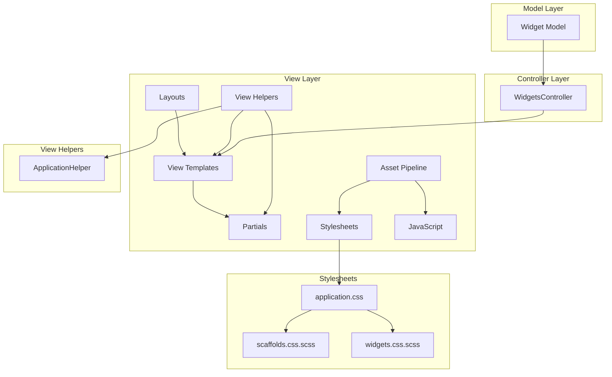
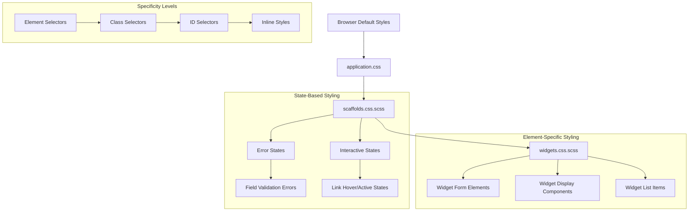
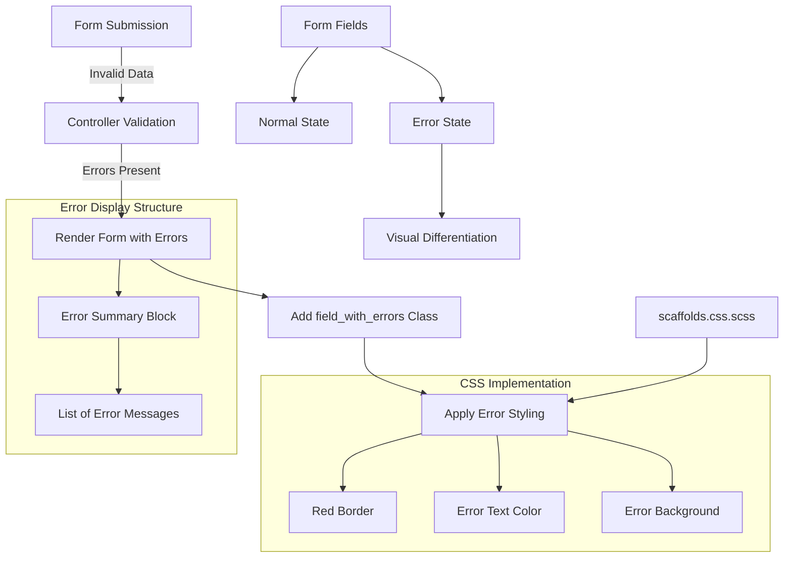
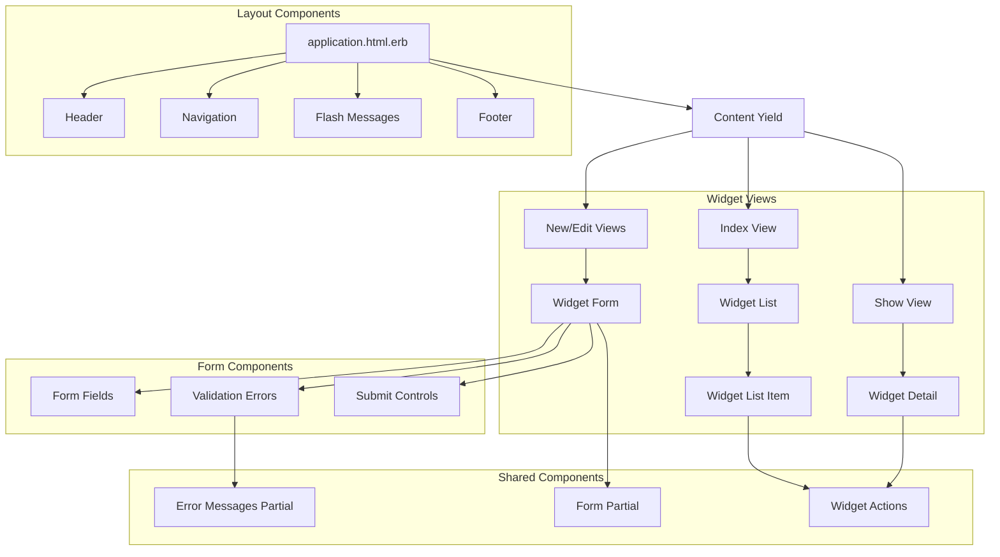

# View Layer Analysis of Ruby Demo Application

## Introduction to the View Layer

The Ruby Demo application implements a standard Rails MVC architecture with a view layer that handles the presentation of widget management functionality. The view layer serves as the interface between users and the application's core functionality, translating data from the model layer into HTML, CSS, and JavaScript that browsers can render. In this application, the view layer is primarily concerned with presenting widgets in various contexts - listing them, showing details, and providing forms for creation and editing. The architecture follows Rails conventions with a clear separation between templates, stylesheets, and helper methods. The view components are organized to maintain consistency across the application while allowing for specific styling and behavior for widget-related interfaces. This organization enables a clean separation of concerns where presentation logic remains distinct from business logic, making the application more maintainable and extensible.

## View Layer Architecture

The diagram illustrates the architecture of the Ruby Demo application's view layer and its integration with the broader MVC pattern. At the top level, layouts define the overall structure of the application's pages, which contain view templates for specific actions. These templates may include partials for reusable UI components. The Asset Pipeline manages stylesheets and JavaScript, with application.css serving as the manifest that includes both scaffolds.css.scss (providing base styling) and widgets.css.scss (for widget-specific styling). View helpers, particularly ApplicationHelper, provide reusable methods that can be called from any template or partial. The view layer connects to the controller layer, which processes user requests and prepares data from the model layer for presentation. This architecture ensures a clean separation of concerns while maintaining the flexibility needed for a dynamic web interface.

## Asset Pipeline Organization

The Ruby Demo application leverages Rails' asset pipeline to organize and manage frontend assets efficiently. At the core of this organization is the `application.css` manifest file, which serves as the central point for including all CSS resources. This file uses two key directives: `require_tree .` which automatically includes all CSS/SCSS files in the current directory hierarchy, and `require_self` which ensures that styles defined directly in the manifest file take precedence over other included styles.

The asset pipeline provides several advantages for the application. First, it automatically compiles SCSS files into standard CSS, allowing developers to use advanced features like variables and nesting. Second, it concatenates multiple stylesheets into a single file for production, reducing HTTP requests and improving page load times. Third, it handles asset fingerprinting for cache busting when files change.

The application's stylesheets are organized following Rails conventions, with controller-specific styles separated into their own files (like `widgets.css.scss`), while application-wide styles are maintained in `scaffolds.css.scss`. This organization allows developers to easily locate and modify styles for specific components without affecting the entire application, while still maintaining a consistent visual language through the shared base styles.

## Scaffold-Generated Styling

The `scaffolds.css.scss` file provides the foundational styling for the Ruby Demo application, generated automatically by Rails' scaffold generator. This file establishes a consistent visual baseline across the application with carefully considered defaults for typography, spacing, and interactive elements. The stylesheet defines a clean, readable typography system with font families (Verdana, Helvetica, Arial) and base font sizes that ensure content legibility across different devices and browsers.

The file implements a comprehensive link styling system with distinct visual states (default, visited, hover, and active) that provide clear feedback to users during interaction. Error notifications are styled with attention-grabbing red backgrounds and borders, ensuring users can quickly identify validation issues when working with forms. Form elements receive specific styling attention, with field validation errors highlighted through red borders and text.

This scaffold-generated styling serves multiple technical purposes: it provides immediate visual structure without requiring custom design work, it implements accessibility best practices through clear visual feedback mechanisms, and it establishes a consistent styling foundation that can be extended or overridden as the application evolves. While minimal, these styles effectively support the application's core widget management functionality by ensuring that interfaces are usable and information is clearly presented.

## CSS Inheritance Structure

The diagram illustrates the CSS inheritance structure in the Ruby Demo application, showing how styles cascade from browser defaults through application-wide styles to component-specific styling. At the foundation are browser default styles, which are then overridden by styles defined in application.css. The scaffolds.css.scss file provides the base application styling, establishing typography, spacing, and form element appearance. Widget-specific styles in widgets.css.scss inherit from and can override these base styles.

The inheritance structure is further organized into element-specific styling for different widget components and state-based styling for error and interactive states. The diagram also shows the specificity hierarchy that determines which styles take precedence when conflicts arise. This structured approach ensures visual consistency while allowing for component-specific customization, making the stylesheet system both maintainable and flexible. The empty widgets.css.scss file is positioned to receive custom widget styling that would override more general styles when needed.

## Widget-Specific Styling

The `widgets.css.scss` file in the Ruby Demo application is currently empty aside from comments, indicating it's a placeholder for future widget-specific styling. This organization follows Rails conventions for controller-specific stylesheets, where visual styling related to a particular resource is isolated in its own file. The comments in the file explicitly state that styles defined here "will automatically be included in application.css," highlighting the integration with the Rails asset pipeline.

This separation of widget-specific styling from application-wide styles represents a thoughtful architectural decision. By isolating widget-related CSS, the application maintains cleaner stylesheets with better separation of concerns. Developers can modify widget appearance without risking unintended side effects on other parts of the application. The file supports SCSS syntax (as indicated by the comment "You can use Sass (SCSS) here: http://sass-lang.com/"), enabling developers to leverage variables, nesting, and mixins for more maintainable styling code.

While currently empty, this file would typically contain styles for widget listing tables, detail views, form layouts, and any widget-specific UI components. The absence of content suggests that the application is either relying entirely on the scaffold-generated styles for widget presentation, or that widget-specific styling is planned for future development. This approach allows the application to start with a functional interface while preserving a clear path for visual refinement as requirements evolve.

## View Helpers Framework

The ApplicationHelper module in the Ruby Demo application serves as the foundation for view helper methods that can be used across the entire application. Though currently empty, this module follows Rails conventions for organizing reusable view logic. The module's presence, even in its empty state, indicates architectural foresight in providing a dedicated location for view-related helper methods that transcend individual controllers or views.

In a more developed state, this module would typically contain methods that abstract common view patterns, format data for display, generate complex HTML structures, or encapsulate conditional display logic. For the widget management functionality, potential helper methods might include formatters for widget attributes, generators for consistent action links (edit, delete, etc.), or methods to standardize form presentation.

The ApplicationHelper's integration into the Rails helper system means that any methods defined here are automatically available in all view templates without explicit inclusion. This reduces code duplication and promotes consistency across the application's interface. The empty state of this helper suggests that the current widget management functionality is straightforward enough to be handled by Rails' built-in helper methods and view conventions, though the framework is in place to add custom helper methods as the application's complexity grows.

## Form Validation Visual Feedback

The diagram illustrates how the Ruby Demo application implements visual feedback for form validation errors. When a form is submitted with invalid data, the controller's validation process identifies errors and re-renders the form. Rails automatically wraps fields with errors in a `div` with the class `field_with_errors`, which is targeted by the CSS in scaffolds.css.scss.

The styling implementation provides clear visual cues through red borders around invalid fields and red text for error messages. An error summary block at the top of the form lists all validation issues. This approach follows web usability best practices by providing immediate, visible feedback that helps users identify and correct input problems.

The scaffolds.css.scss file defines these error styles with specific selectors that target both the error containers and the error messages themselves. This visual feedback system creates a consistent error handling experience across all forms in the application, including the widget creation and editing forms. The implementation balances attention-grabbing styling with a clean interface that doesn't overwhelm users, making form correction intuitive and efficient.

## Responsive Design Considerations

The Ruby Demo application's view layer demonstrates a minimalist approach to responsive design. The scaffolds.css.scss file establishes basic styling that works across different viewport sizes without explicit media queries or responsive breakpoints. This approach relies on the inherent flexibility of the browser's default rendering behavior, where text elements naturally flow and resize based on the available space.

The application uses relative units for text sizing and container widths where appropriate, allowing content to adapt to different screen sizes without fixed dimensions that might break on smaller devices. The form elements receive specific padding and margin values that provide adequate touch targets on mobile devices while maintaining a clean appearance on desktop screens.

However, the absence of explicit responsive design techniques like media queries, flexible grid systems, or mobile-first approaches suggests that comprehensive responsive behavior wasn't a primary focus in the initial implementation. The application would likely benefit from additional responsive enhancements if mobile usage becomes a priority. These might include:

1. Media queries to adjust layouts at common breakpoints
2. A flexible grid system for more complex widget listings
3. Touch-optimized controls for mobile users
4. Viewport meta tags to ensure proper scaling on mobile devices

The current implementation provides a functional interface across devices but leaves room for optimization in a future iteration that might prioritize mobile user experience. This approach is pragmatic for an initial version, allowing the application to focus on core functionality while deferring more sophisticated responsive design to later development phases.

## View Layer Extension Points

The Ruby Demo application's view layer provides several well-defined extension points that allow developers to enhance and customize the user interface without modifying core application code. These extension points follow Rails conventions and best practices for maintaining separation of concerns while enabling flexible customization.

For custom styling, the application.css manifest uses the asset pipeline's require directives, allowing developers to add new stylesheets that will be automatically included. The empty widgets.css.scss file serves as a clear entry point for widget-specific styling that won't interfere with application-wide styles. Developers can also override scaffold styles by defining more specific selectors in their custom stylesheets.

JavaScript enhancements can be added through the asset pipeline's JavaScript manifest system, enabling progressive enhancement of the widget management interface with client-side validation, dynamic content loading, or interactive features. The application's HTML structure provides appropriate hooks (like data attributes and semantic class names) for JavaScript to target.

The ApplicationHelper module, though currently empty, provides a dedicated location for adding view helper methods that can generate complex HTML structures, format data consistently, or encapsulate conditional display logic. Developers can extend this module with custom helpers that are automatically available across all views.

For more substantial customization, Rails' partial rendering system allows developers to override specific view components by placing files with matching names in the appropriate directories. This enables targeted replacement of specific interface elements without duplicating entire views.

These extension points collectively provide a flexible framework for evolving the widget management interface to meet changing requirements while maintaining the application's architectural integrity and following Rails conventions for view layer organization.

## User Interface Component Hierarchy

The diagram illustrates the hierarchical structure of UI components in the Ruby Demo application's widget management interface. At the top level is the application layout (application.html.erb), which provides the common structure for all pages including header, navigation, flash message display, and footer. The content yield area within this layout is populated by specific view templates based on the current action.

For widget management, the interface consists of three primary view types: index (listing all widgets), show (displaying a single widget's details), and form views (for creating and editing widgets). Each of these views is composed of smaller, more specialized components. The widget list view contains list items for each widget, the detail view presents a widget's attributes, and the form views include field inputs, validation error displays, and submission controls.

Shared components like error message partials and form partials promote consistency and reduce duplication across the interface. Widget actions (such as edit, delete, and back links) appear in multiple contexts but maintain consistent styling and behavior.

This component hierarchy follows Rails conventions for view organization while providing a modular structure that separates concerns and promotes reusability. The organization allows developers to understand and modify specific parts of the interface without affecting the entire application, supporting both maintenance and extension of the widget management functionality.

[Generated by the Sage AI expert workbench: 2025-03-29 18:36:01  https://sage-tech.ai/workbench]: #