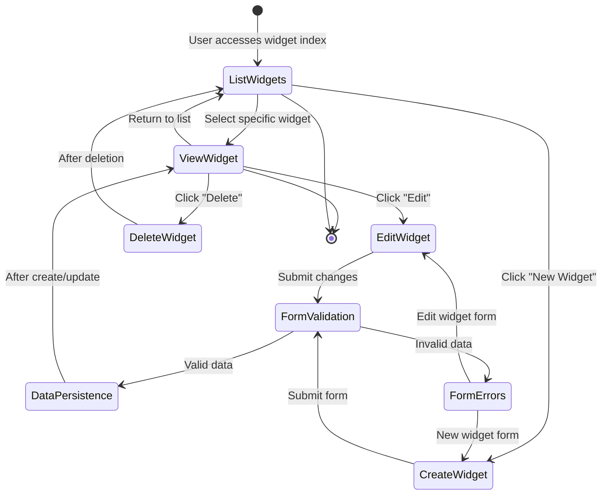

# Ruby Demo Web Application Analysis

## Application Architecture Overview

The Ruby Demo web application is built on the Ruby on Rails framework, following its conventional MVC (Model-View-Controller) architecture. The application's primary purpose is to provide comprehensive widget management functionality through a web interface. It leverages Rails' convention-over-configuration philosophy to streamline development while maintaining a clean separation of concerns across architectural layers. The application implements standard CRUD (Create, Read, Update, Delete) operations for widgets, with a welcome page serving as the entry point. The architecture follows Rails' RESTful design principles, with resource-oriented routing and appropriate HTTP verb mappings to controller actions. The frontend leverages the Rails asset pipeline for JavaScript dependency management, ensuring efficient delivery of client-side resources while maintaining a responsive user experience.

## Application Layer Structure

The diagram illustrates the layered architecture of the Ruby Demo application. The presentation layer handles all user interface concerns, including view templates and frontend assets managed through the Rails asset pipeline. The application layer contains controllers that process requests, routing configuration that maps URLs to controller actions, and helpers that assist with view rendering. The data layer manages widget persistence through models that interact with the database. This separation of concerns promotes maintainability while allowing data to flow seamlessly from user input through to storage and back to display.

## Navigation and Routing

The application's routing structure, defined in routes.rb, establishes a clear URL hierarchy that maps directly to controller actions. At its core, the routing configuration implements two primary paths: a RESTful resource route for widgets and a root route directing to the welcome page. The widget resource route (`resources :widgets`) automatically generates the seven standard RESTful routes (index, show, new, create, edit, update, destroy) that form the backbone of the widget management functionality. This convention-based approach ensures consistent URL patterns across the application while minimizing configuration overhead. The root route (`root 'welcome#index'`) defines the application's entry point, directing users to the welcome page upon initial access. This routing structure exemplifies Rails' emphasis on RESTful design principles, creating a logical and predictable URL structure that aligns with standard HTTP verbs and resource-oriented architecture.

## URL Routing Flow

This flowchart illustrates how the Ruby Demo application processes incoming HTTP requests through its routing system. When a request arrives, the router first determines whether it's targeting the root path or a widget resource. Root path requests are directed to the Welcome controller's index action, which renders the application's landing page. Widget resource requests are further analyzed based on the HTTP verb and path to determine the appropriate controller action. The diagram shows the complete lifecycle of widget management operations, from listing (GET /widgets) through creation (POST /widgets), viewing (GET /widgets/:id), editing (PATCH/PUT /widgets/:id), and deletion (DELETE /widgets/:id). Each path follows Rails' RESTful conventions, ensuring a consistent and predictable request handling flow throughout the application.

## Frontend Asset Management

The Ruby Demo application employs Rails' asset pipeline for efficient management of frontend dependencies. The central configuration for JavaScript assets resides in application.js, which serves as a manifest file for the entire application. This manifest leverages Sprockets directives to include essential libraries that power the application's interactive features. Core dependencies include jQuery for DOM manipulation and AJAX functionality, jQuery UJS (Unobtrusive JavaScript) for handling Rails-specific features like CSRF protection and data-attribute driven behaviors, and Turbolinks for improving perceived performance by replacing full page loads with partial updates. The `require_tree .` directive ensures that all JavaScript files in the directory structure are automatically included, eliminating the need for manual inclusion of new scripts. This approach centralizes dependency management while allowing for modular organization of custom JavaScript code. The asset pipeline further optimizes delivery by concatenating and minifying these assets in production environments, reducing load times and improving the overall user experience.

## Welcome Page Implementation

The welcome page serves as the application's landing page and primary entry point, providing users with an introduction to the Ruby Demo application and its widget management capabilities. Implemented through the WelcomeController's index action, this page is configured as the root route in routes.rb, making it the default destination when accessing the application. The welcome page likely provides contextual information about the application's purpose and functionality, potentially including explanatory text about widget management and direct navigation links to key widget operations such as listing existing widgets or creating new ones. This implementation follows the common pattern of providing a clear entry point that orients users to the application's capabilities before they engage with specific functional areas. The welcome page may also incorporate branding elements and visual styling consistent with the overall application design, establishing a cohesive user experience from the moment users access the system.

## Widget Resource Lifecycle

This diagram illustrates the complete lifecycle of widget resources within the Ruby Demo application. The process typically begins with users accessing the widget index page, which displays a list of existing widgets. From there, users can either view details of a specific widget, create a new widget, or return to other parts of the application. When viewing a widget's details, users have options to edit the widget, delete it, or return to the listing. Both creation and editing workflows involve form submission, which triggers validation. Valid submissions result in data persistence (creation or update), while invalid submissions return users to the form with appropriate error messages. After successful creation or update operations, users are typically redirected to the widget's detail view, while deletion operations return users to the widget listing. This comprehensive lifecycle implements the full CRUD spectrum for widget management, providing users with a complete set of operations for working with widget resources.

## User Interface Components

The Ruby Demo application's user interface is composed of several key components that facilitate widget management. For widget creation and editing, the application implements form-based interfaces that capture essential widget attributes. These forms likely include appropriate input fields for each widget property, validation feedback mechanisms, and submission controls. Form layouts are designed for clarity and usability, potentially incorporating responsive design principles to accommodate various device sizes. For widget display, the interface includes both list views that present multiple widgets in a condensed format and detail views that show comprehensive information about individual widgets. The list view likely implements pagination for efficient handling of large widget collections and includes sorting or filtering capabilities to help users locate specific widgets. Navigation elements provide intuitive movement between these various interface components, with clear pathways for transitioning between listing, viewing, creating, and editing operations. Throughout these components, the interface maintains consistent visual styling and interaction patterns, ensuring users can easily understand and efficiently use the widget management functionality.

## Page Layout Structure

The diagram represents the structural organization of the Ruby Demo application's page layouts. At the highest level, all pages share a common application layout that includes a header/navigation bar, main content area, and footer. This consistent outer structure provides navigational context and branding across the application. Within this framework, specific page types implement layouts appropriate to their function. The widget index page organizes content into a listing table with pagination controls and a prominent button for creating new widgets. Detail pages focus on presenting comprehensive information about individual widgets, with action buttons for editing and deletion, plus navigation back to the listing. Form pages, used for both creation and editing, structure content around input fields with associated validation messages and action buttons for submission or cancellation. This hierarchical layout structure ensures consistent user experience while adapting to the specific requirements of each page type, creating an interface that is both cohesive and functionally appropriate for each context within the widget management workflow.

## Data Flow Architecture

The Ruby Demo application implements a comprehensive data flow architecture that efficiently moves widget information through the system. The flow begins with user input via forms, where widget attributes are captured through appropriately typed input fields. Upon form submission, this data travels to the server as HTTP POST or PATCH/PUT requests, depending on whether the operation is creation or update. The WidgetsController receives these requests and processes the incoming parameters, applying any necessary transformations or validations. Valid data is then persisted to the database through the Widget model, which encapsulates the data structure and business rules. For read operations, the flow reverses: controllers retrieve widget data from the database via model queries, transform it as needed for presentation, and pass it to view templates for rendering. The views then generate HTML that is returned to the client browser for display. Throughout this process, the application maintains data integrity through validation at both client and server levels, ensuring that only valid widget information enters the system. This bidirectional flow—from user input to storage and back to display—forms the core of the application's data handling capabilities, enabling the complete widget management functionality.

## Frontend Integration Strategy

The Ruby Demo application employs a strategic approach to frontend integration that balances functionality, performance, and maintainability. At its foundation is the Rails asset pipeline, which manages JavaScript and CSS assets through a centralized manifest system. The application.js manifest incorporates essential libraries like jQuery for DOM manipulation and AJAX functionality, jQuery UJS for Rails-specific JavaScript behaviors, and Turbolinks for optimizing page transitions. These core libraries provide the foundation for interactive features throughout the widget management interface. The application likely implements unobtrusive JavaScript patterns, attaching behaviors to DOM elements through data attributes rather than inline scripts, promoting clean separation between structure and behavior. For styling, the application maintains consistent visual presentation across all pages through shared CSS assets, potentially leveraging responsive design techniques to ensure usability across device sizes. The integration strategy emphasizes progressive enhancement, ensuring that core functionality remains accessible even when JavaScript is disabled while adding interactive enhancements when available. This approach creates a responsive and interactive user experience while maintaining the maintainability benefits of clear separation between frontend and backend concerns.

[Generated by the Sage AI expert workbench: 2025-03-29 18:36:01  https://sage-tech.ai/workbench]: #