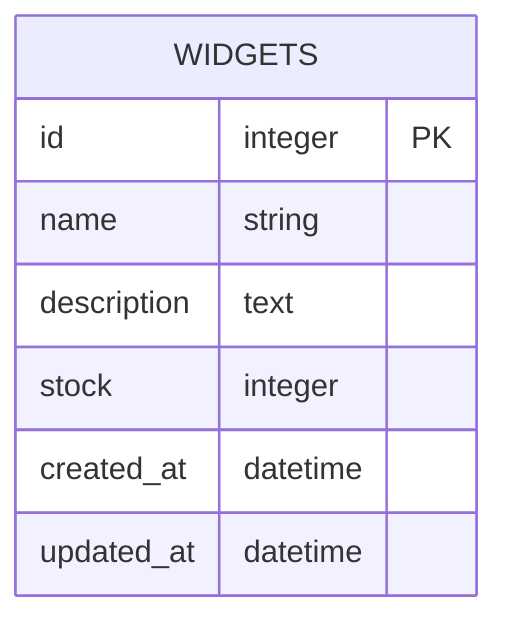
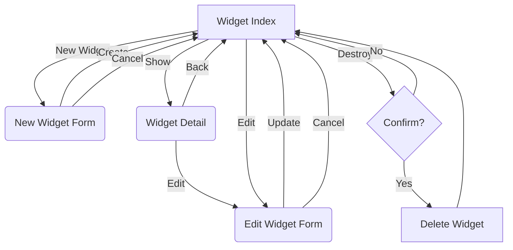
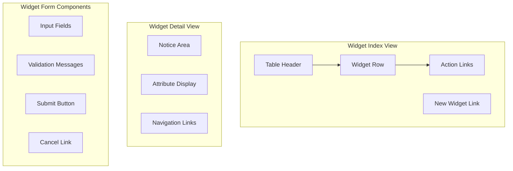
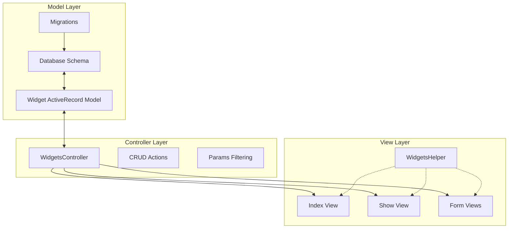

# Widget Management in Ruby Demo

## Widget Overview

The Ruby Demo application showcases a comprehensive widget management system built on Ruby on Rails. At its core, the application provides a complete set of CRUD (Create, Read, Update, Delete) operations for managing widgets, which are the primary business entities in the system. The widget functionality is implemented following Rails conventions, leveraging the framework's built-in features for object-relational mapping, routing, and view rendering. The system allows users to create widgets with specific attributes, view them in both list and detail formats, modify their properties, and remove them when necessary. This widget management functionality demonstrates Rails' capability to rapidly develop web applications with database persistence, following the MVC (Model-View-Controller) architectural pattern.

## Widget Data Structure

The widget data structure is elegantly simple yet functionally complete. The schema defines a `widgets` table in PostgreSQL with columns that capture essential information about each widget. The `name` field (string type) provides a concise identifier, while the `description` field (text type) allows for more detailed information about the widget's purpose or characteristics. The `stock` field (integer type) tracks inventory quantities. Rails automatically includes `id` as the primary key and timestamps (`created_at` and `updated_at`) to track record creation and modification. This structure provides a solid foundation for widget management while maintaining simplicity in the data model.

## Widget Model Architecture

The Widget model in the Ruby Demo application exemplifies Rails' "convention over configuration" philosophy through its minimalist implementation. Despite consisting of just a single line of code (`class Widget < ActiveRecord::Base; end`), the Widget class inherits a rich set of functionality from ActiveRecord::Base. This inheritance provides a comprehensive object-relational mapping (ORM) layer that connects the model to its corresponding database table (`widgets`). Through this relationship, each Widget instance represents a row in the database, with attributes that map directly to table columns.

The ActiveRecord implementation automatically provides methods for CRUD operations, data validation, associations with other models, and complex querying capabilities. The Widget model serves as a perfect example of how Rails enables developers to focus on business logic rather than boilerplate code. While not explicitly defined in the model file, the Widget class inherits attribute accessors for `name`, `description`, and `stock` from the database schema, allowing these properties to be read and written through object instances without additional code.

## Widget Listing Implementation

The widget listing functionality is implemented through a clean, tabular interface that presents all widgets in the system. The implementation uses an ERB template (`index.html.erb`) that iterates through the `@widgets` collection provided by the controller. For each widget, the view displays the core attributes: name, description, and stock level, organizing them in a Bootstrap-styled table for consistent presentation and responsive design.

The listing view goes beyond simple data display by incorporating action links that enable users to interact with individual widgets directly from the list. Each row includes links to show the widget's details, edit its properties, or delete it entirely. The deletion action incorporates a confirmation dialog using Rails' `data-confirm` attribute to prevent accidental removals. The view also provides a "New Widget" link at the bottom, enabling users to create additional widgets. This implementation follows RESTful design principles, with each action corresponding to a specific HTTP verb and route in the application. The clean separation between data presentation and action links makes the interface intuitive while maintaining a clear path to all CRUD operations.

## Widget Management Workflow

The widget management workflow in the Ruby Demo application follows a standard CRUD pattern with intuitive navigation between different operations. Users begin at the Widget Index page, which serves as the central hub for all widget management activities. From here, they can create new widgets through a dedicated form, view details of existing widgets, edit widget properties, or delete widgets after confirmation. 

The workflow is designed to be non-linear, allowing users to navigate efficiently between different operations. For example, users can access the edit form directly from either the index page or the detail view, and can return to the index from any other screen. This flexibility ensures that users can complete their intended tasks with minimal navigation steps while maintaining a clear mental model of the application structure. The confirmation step for deletion prevents accidental data loss, adding a layer of safety to the workflow without significantly disrupting the user experience.

## Widget Detail View

The widget detail view provides a focused presentation of an individual widget's attributes in a clean, structured format. Implemented in the `show.html.erb` template, this view displays the widget's name, description, and stock level with appropriate labeling to clearly identify each piece of information. The detail view serves as both an information display and a navigation hub for widget-specific operations.

At the top of the view, a notice area (`
<%= notice %>`) captures system messages related to the widget, such as confirmation of successful updates. This integration with Rails' flash message system ensures that users receive appropriate feedback after performing actions. The view also includes navigation links that enable users to edit the current widget or return to the widget listing page, maintaining a consistent navigation pattern throughout the application. The detail view's container-based layout ensures proper spacing and alignment of content, contributing to a clean user interface that focuses attention on the widget's information while providing clear paths to related actions.

## Widget UI Components

The Ruby Demo application employs a consistent set of UI components across its widget management interfaces. The widget listing view centers around a Bootstrap-styled table component that organizes widget data in rows and columns with appropriate headers. Each row contains both data cells and action links styled as clickable text. The detail view uses labeled paragraphs to present individual widget attributes in a vertically stacked layout, with navigation links positioned at the bottom.

Form components for creating and editing widgets (though not explicitly shown in the provided code) would typically include text inputs for the name and description fields, a numeric input for stock quantity, validation message areas, and action buttons for submission and cancellation. Throughout the interface, the application maintains consistent styling through Bootstrap's container classes and standard HTML elements, creating a cohesive user experience. The UI components are designed for clarity and efficiency, focusing on presenting widget information and actions without unnecessary complexity or distraction.

## Widget Support Infrastructure

The widget functionality in the Ruby Demo application is supported by a lightweight infrastructure that follows Rails conventions. The `WidgetsHelper` module, though currently empty, represents a key component of this infrastructure. In the Rails framework, helper modules provide a dedicated location for view-specific logic that can be reused across multiple templates. While the current implementation doesn't include any helper methods, the module's presence establishes a foundation for future enhancements.

As the application evolves, the `WidgetsHelper` module could be expanded to include methods for formatting widget data (e.g., colorizing stock levels based on thresholds), generating specialized HTML structures, or implementing complex conditional display logic. This separation of concerns keeps the view templates clean and focused on presentation while moving reusable logic to the helper. Beyond the helper module, the widget functionality is supported by Rails' built-in infrastructure, including the routing system that maps URLs to controller actions, the asset pipeline for managing JavaScript and CSS resources, and the ActiveRecord ORM layer that handles database interactions. This comprehensive support infrastructure enables the widget management features to operate efficiently while maintaining clean separation between different aspects of the application.

## Database Migration and Schema Evolution

The widget data structure in the Ruby Demo application is established and maintained through Rails' migration system, which provides a version-controlled approach to database schema management. The initial schema is defined in the `CreateWidgets` migration class, which creates the `widgets` table with columns for name, description, stock, and timestamps. This migration represents the first step in the schema's evolution and is tracked with a timestamp-based version identifier (20140707111715).

The migration system allows for incremental changes to the database schema over time, with each change captured in a separate migration file. As the application evolves, new migrations could be added to modify the widget structure, such as adding new columns, changing data types, or creating indexes for performance optimization. The `schema.rb` file serves as the authoritative representation of the current database structure, generated automatically based on the applied migrations. This approach to schema evolution ensures that all environments (development, testing, production) maintain consistent database structures and provides a clear history of how the data model has changed over time. The migration-based approach also facilitates collaboration among developers by minimizing conflicts when making schema changes and providing a mechanism to roll back problematic modifications if necessary.

## Widget MVC Architecture

The widget management functionality in the Ruby Demo application exemplifies Rails' implementation of the Model-View-Controller (MVC) architectural pattern. The Model layer consists of the Widget ActiveRecord class that encapsulates data access logic and business rules, connecting to the database schema defined through migrations. The View layer includes multiple ERB templates for different aspects of widget management (index, show, forms) along with the WidgetsHelper module that can provide view-specific logic.

The Controller layer, though not explicitly shown in the provided code, would typically include a WidgetsController that handles HTTP requests, interacts with the Widget model to perform CRUD operations, and renders the appropriate views with the necessary data. The diagram illustrates how these components interact: the controller communicates with the model to retrieve and manipulate data, then passes that data to the views for rendering. The helper module supports the views with additional functionality, while the migrations establish the database structure that the model interacts with. This clean separation of concerns enables modular development, testing, and maintenance of the widget management feature while following Rails conventions for predictable code organization.

## Data Display Patterns

The Ruby Demo application employs consistent data display patterns across its widget management interfaces. In the index view, widgets are presented in a tabular format that emphasizes scanning efficiency, with each row representing a complete widget entity and columns organizing the attributes consistently. This pattern facilitates quick comparison between multiple widgets and provides a compact overview of the available inventory.

The detail view adopts a different pattern, using a vertical layout with labeled fields that emphasizes comprehensive information about a single widget. This pattern allocates more space to each attribute, allowing for longer descriptions and more detailed presentation. Both views maintain consistent labeling for widget attributes, using the same terminology ("Name", "Description", "Stock") to reinforce the mental model of the widget entity.

The application also follows consistent patterns for action links, placing them at logical positions within each view: at the row level for actions specific to individual widgets in the index view, and at the bottom of the page for navigation in the detail view. These patterns create a predictable interface that users can quickly learn and efficiently navigate. The consistent use of Bootstrap's container class across views ensures proper spacing and alignment, contributing to a cohesive visual experience throughout the widget management functionality.

## Future Widget Enhancements

The current implementation of widget management in the Ruby Demo application provides a solid foundation that can be extended in several directions. One potential enhancement would be to add categorization capabilities, allowing widgets to be organized into groups with shared characteristics. This could be implemented through a Category model with a one-to-many relationship to widgets, enabling filtered views and more structured navigation.

Another valuable enhancement would be to implement inventory management features beyond the basic stock tracking currently in place. This could include stock thresholds with alerts, historical tracking of inventory changes, and forecasting capabilities based on usage patterns. The empty WidgetsHelper module presents an opportunity to implement formatting methods that could visually indicate stock levels (e.g., using color coding to highlight low stock items) or to format descriptions with rich text capabilities.

The user interface could be enhanced with AJAX-based interactions to enable in-place editing of widget properties, drag-and-drop reordering of widgets in the list view, or dynamic filtering and sorting capabilities. Additionally, implementing a search function would improve usability as the widget inventory grows. From a data perspective, adding validation rules to the Widget model would ensure data integrity, while implementing soft deletion would provide recovery options for accidentally deleted widgets. These enhancements would build upon the existing architecture while extending the functionality to meet more sophisticated widget management requirements.

[Generated by the Sage AI expert workbench: 2025-03-29 18:36:01  https://sage-tech.ai/workbench]: #