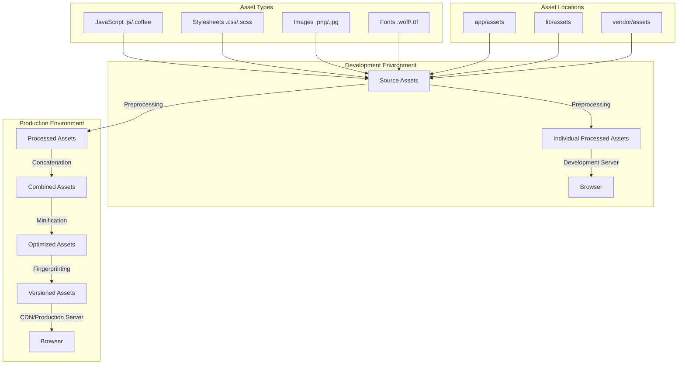
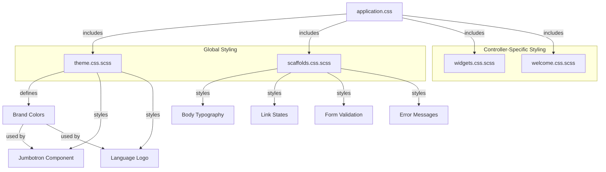
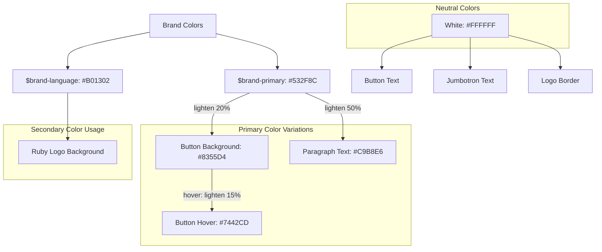
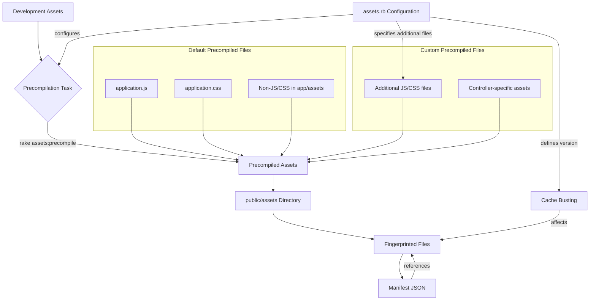

# Asset Management in Ruby Demo

## Introduction to Asset Management in Rails

The Rails Asset Pipeline is a framework that provides a robust solution for organizing, preprocessing, and optimizing frontend assets in Ruby on Rails applications. In the Ruby Demo application, we see a classic implementation of the Asset Pipeline, which serves three primary purposes: asset concatenation, asset minification, and transparent preprocessing of higher-level languages like SCSS and CoffeeScript.

The Asset Pipeline in Ruby Demo follows Rails conventions by organizing assets into three main directories: `app/assets` (application-specific assets), `lib/assets` (shared library code), and `vendor/assets` (third-party assets). The examined files reveal a standard implementation where JavaScript and CSS assets are managed through manifest files (`application.js` and `application.css`) that serve as entry points for asset compilation.

The pipeline uses Sprockets, a Ruby library for managing and serving web assets, to handle the preprocessing, concatenation, and minification of these assets. In production environments, this results in fewer HTTP requests (improving load times) and smaller file sizes (reducing bandwidth usage). The Ruby Demo application leverages these benefits while maintaining a clean separation of concerns through controller-specific stylesheets and a theme-based approach to visual styling.

## Rails Asset Pipeline Architecture



The diagram illustrates how assets flow through the Rails Asset Pipeline from development to production. In development, assets are preprocessed individually and served directly to improve debugging. In production, assets undergo a more comprehensive process:

1. **Preprocessing**: Converting higher-level languages (SCSS to CSS, CoffeeScript to JavaScript)
2. **Concatenation**: Combining multiple files into single files to reduce HTTP requests
3. **Minification**: Removing whitespace, comments, and shortening variable names
4. **Fingerprinting**: Adding a hash to filenames for cache busting

The Ruby Demo application follows this standard flow, with assets organized by type and location according to Rails conventions. The configuration in `assets.rb` sets the version for cache invalidation, while manifest files like `application.js` and `application.css` control which assets are included in the final compiled output.

## JavaScript Asset Organization

The JavaScript organization in Ruby Demo follows a straightforward approach centered around the manifest file `application.js`. This file serves as the primary entry point for all JavaScript in the application, using Sprockets directives to include essential libraries and organize dependencies.

The manifest begins with standard inclusions of core libraries:
```javascript
//= require jquery
//= require jquery_ujs
//= require turbolinks
```

These directives ensure that jQuery, jQuery UJS (for Rails-specific JavaScript functionality like AJAX form submissions and data-confirm dialogs), and Turbolinks (for faster page loads) are available throughout the application.

The manifest concludes with the `require_tree .` directive, which automatically includes all JavaScript files in the current directory and its subdirectories. This approach simplifies asset management by eliminating the need to manually include each new JavaScript file, but it also means that load order is not guaranteed for files included via this directive.

The Ruby Demo application appears to have a minimal JavaScript footprint, relying primarily on the included libraries rather than custom JavaScript. This is a common approach for smaller Rails applications where the focus is on server-side rendering with light client-side enhancements. For more complex applications, a more structured approach to JavaScript organization might be warranted, potentially using module bundlers like Webpack (which has become the standard in more recent Rails versions via Webpacker and now importmaps).

## CSS/SCSS Asset Structure

The CSS/SCSS asset structure in Ruby Demo follows a modular approach that leverages the power of Sass (SCSS) for enhanced stylesheet organization. The application uses a combination of global styling, theme-specific styling, and controller-specific stylesheets to maintain separation of concerns while ensuring a consistent visual experience.

The `application.css` manifest serves as the entry point for all stylesheets, using the `require_tree .` directive to include all CSS/SCSS files in the stylesheets directory. The manifest also includes the `require_self` directive, which ensures that any styles defined directly in the manifest file take precedence over those included via other directives.

Controller-specific stylesheets (`widgets.css.scss` and `welcome.css.scss`) are currently empty but provide a structure for organizing styles based on their functional area. This approach helps maintain cleaner code by grouping related styles together and preventing a single, monolithic stylesheet from becoming unwieldy.

The `scaffolds.css.scss` file provides default styling for Rails-generated views, including basic typography, link styling, and form validation error handling. This ensures a consistent baseline appearance across the application.

The `theme.css.scss` file establishes the application's visual identity through SCSS variables for brand colors and styling for key components like the jumbotron. By centralizing theme-related styles and leveraging SCSS variables, the application can maintain visual consistency and make global style changes more efficiently.

This structure demonstrates a thoughtful approach to CSS organization that balances the benefits of modularization with the practical needs of a small to medium-sized Rails application.

## CSS Asset Hierarchy



The diagram illustrates the hierarchical relationship between the CSS assets in the Ruby Demo application. At the top level, `application.css` serves as the manifest that includes all other stylesheets through the `require_tree .` directive. This creates a flat inclusion structure where all stylesheets are compiled into a single file.

The stylesheets are conceptually divided into global styling (theme and scaffolds) and controller-specific styling (widgets and welcome). The global styling establishes the visual foundation of the application, while controller-specific stylesheets allow for targeted styling of particular views and components.

The theme stylesheet defines brand colors as SCSS variables (`$brand-primary` and `$brand-language`), which are then used to style components like the jumbotron and language logo. This approach ensures color consistency throughout the application and makes it easy to update the color scheme by changing just the variable definitions.

The scaffolds stylesheet provides baseline styling for common elements like typography, links, and forms, including specific styles for form validation errors. This ensures a consistent appearance for Rails-generated views and provides visual feedback for user interactions.

The controller-specific stylesheets are currently empty but provide a structure for adding styles that are only relevant to specific controllers, promoting better organization and maintainability as the application grows.

## Theme Implementation with SCSS

The Ruby Demo application implements a cohesive visual theme through the strategic use of SCSS features in `theme.css.scss`. This approach demonstrates how SCSS can enhance CSS with variables, nesting, and color functions to create a maintainable and consistent design system.

At the foundation of the theme are two SCSS variables that define the brand colors:
```scss
$brand-primary: #532F8C;    // A deep purple color
$brand-language: #B01302;   // A ruby red color
```

These variables serve as the basis for the application's color scheme and are referenced throughout the stylesheet to ensure consistency. By centralizing these color definitions, the application can easily update its color scheme by changing just these two variables.

The theme makes extensive use of SCSS nesting to create logical groupings of related styles. For example, the jumbotron component's styles are nested within a `.jumbotron` selector, making the relationship between these styles immediately clear:

```scss
.jumbotron {
  background: $brand-primary;
  color: white;
  padding-bottom: 80px;

  .btn-primary { ... }
  p { ... }
  .lang-logo { ... }
}
```

SCSS color functions like `lighten()` are used to create variations of the brand colors for different elements and states:

```scss
.btn-primary {
  background: lighten($brand-primary, 20%);
  border-color: lighten($brand-primary, 20%);
  &:hover {
    background: lighten($brand-primary, 15%);
  }
}

p {
  color: lighten($brand-primary, 50%);
  // ...
}
```

This approach creates a harmonious color palette derived from the primary brand color, ensuring visual consistency while providing sufficient contrast for different UI elements. The use of percentage-based lightening also ensures that the relationship between colors is maintained even if the base color changes.

The theme also demonstrates thoughtful design for specific components like the language logo, which uses CSS properties like `border-radius`, `overflow`, and precise dimensions to create a circular Ruby logo with a white border.

Overall, the theme implementation showcases how SCSS can be leveraged to create a maintainable and visually cohesive design system with minimal code.

## Theme Color System



The diagram visualizes the color system implemented in the Ruby Demo application's theme. At its core are two brand colors that define the application's visual identity:

1. **$brand-primary (#532F8C)**: A deep purple that serves as the primary brand color and is used for the jumbotron background
2. **$brand-language (#B01302)**: A ruby red that represents the Ruby programming language and is used for the language logo

The system leverages SCSS color functions to create a cohesive palette of related colors:

- The primary button background color is created by lightening the primary brand color by 20% (#8355D4)
- The button hover state uses a slightly darker shade, lightening the primary color by only 15% (#7442CD)
- Paragraph text within the jumbotron uses a much lighter variation, lightening the primary color by 50% (#C9B8E6)

This approach creates a harmonious color palette where all colors are mathematically related to the base brand colors. The use of SCSS's `lighten()` function ensures that if the brand colors change, all derived colors will adjust proportionally, maintaining the same visual relationships.

White (#FFFFFF) is used as a neutral color for text and borders, providing sufficient contrast against both the primary and secondary brand colors.

This color system demonstrates a thoughtful approach to creating a consistent visual identity with minimal color definitions, leveraging SCSS's capabilities to derive related colors programmatically.

## Scaffold-Generated Styling

The `scaffolds.css.scss` file in Ruby Demo provides default styling for Rails-generated views, creating a consistent foundation for the application's user interface. This stylesheet addresses fundamental visual elements that are common across scaffold-generated pages, including typography, link styling, and form validation feedback.

The stylesheet establishes basic typography with a font stack that prioritizes system fonts:
```scss
body {
  background-color: #fff;
  color: #333;
  font-family: verdana, arial, helvetica, sans-serif;
  font-size: 13px;
  line-height: 18px;
}
```

It defines comprehensive link styling for different states, ensuring users receive appropriate visual feedback:
```scss
a {
  color: #000;
  &:visited {
    color: #666;
  }
  &:hover {
    color: #fff;
    background-color: #000;
  }
}
```

One of the most important aspects of the scaffold styling is its handling of form validation errors. Rails automatically wraps form fields with validation errors in a `div` with the class `field_with_errors`. The scaffold stylesheet targets this class to provide visual feedback:
```scss
.field_with_errors {
  padding: 2px;
  background-color: red;
  display: table;
}
```

This creates a red background around fields with errors, making it immediately obvious to users which fields need attention. The `display: table` property ensures that the error highlighting doesn't break the layout.

The stylesheet also provides styling for error explanation messages:
```scss
#error_explanation {
  width: 450px;
  border: 2px solid red;
  padding: 7px;
  padding-bottom: 0;
  margin-bottom: 20px;
  background-color: #f0f0f0;
  
  h2 {
    text-align: left;
    font-weight: bold;
    padding: 5px 5px 5px 15px;
    font-size: 12px;
    margin: -7px;
    margin-bottom: 0px;
    background-color: #c00;
    color: #fff;
  }
  
  ul li {
    font-size: 12px;
    list-style: square;
  }
}
```

This creates a prominent error message box with a red border, light gray background, and a red header, containing a list of validation errors.

While the scaffold styling is functional rather than aesthetically sophisticated, it provides essential visual feedback for users interacting with forms and establishes a consistent baseline appearance across the application. In a production application, these styles would typically be extended or replaced with more polished designs as the UI evolves.

## Asset Configuration and Versioning

The Ruby Demo application configures its asset pipeline through the `assets.rb` initializer file, which establishes key settings for asset versioning and precompilation. This configuration is essential for optimizing asset delivery in production environments.

The most critical setting in this file is the asset version:
```ruby
Rails.application.config.assets.version = '1.0'
```

This version string is used for cache busting, ensuring that browsers load fresh assets when they change instead of serving stale cached versions. When assets are modified, changing this version string forces clients to download the updated files rather than using cached copies. This is particularly important for production deployments where aggressive caching is common.

The initializer also includes commented code that demonstrates how to extend asset precompilation beyond the default files:
```ruby
# Precompile additional assets.
# application.js, application.css, and all non-JS/CSS in app/assets folder are already added.
# Rails.application.config.assets.precompile += %w( search.js )
```

By default, Rails precompiles `application.js`, `application.css`, and all non-JavaScript/CSS files in the app/assets folder. This configuration can be extended to include additional files that need precompilation, such as controller-specific JavaScript or CSS files that aren't included in the main manifests.

While not explicitly configured in this file, the asset pipeline in production also handles:

1. **Fingerprinting**: Adding a hash of the file content to filenames (e.g., `application-908e25f4bf641868d8683022a5b62f54.css`) to enable far-future Expires headers
2. **Compression**: Applying gzip compression to reduce file sizes
3. **CDN compatibility**: Configuring asset hosts for serving assets from content delivery networks

The Ruby Demo application uses a standard asset configuration that follows Rails conventions. For more complex applications, this file might include additional settings such as custom compression options, CDN configuration, or specific precompilation lists tailored to the application's needs.

## Asset Precompilation Process



The diagram illustrates the asset precompilation process in Rails, which transforms development assets into optimized production assets. This process is critical for performance in production environments.

When the `rake assets:precompile` task is run (typically during deployment), Rails processes all assets according to the configuration in `assets.rb` and generates optimized files in the `public/assets` directory. By default, this includes:

1. **application.js**: The main JavaScript manifest and all files it requires
2. **application.css**: The main CSS manifest and all files it requires
3. **All non-JS/CSS files in app/assets**: Images, fonts, and other static assets

The precompilation process performs several optimizations:

- **Preprocessing**: Converting SCSS to CSS, CoffeeScript to JavaScript
- **Concatenation**: Combining multiple files referenced in manifests into single files
- **Minification**: Removing whitespace, comments, and shortening variable names
- **Fingerprinting**: Adding a content hash to filenames for cache busting

The output includes fingerprinted files (e.g., `application-1d8dc30f6dcd.css`) and a manifest JSON file that maps logical paths to fingerprinted paths. This manifest allows Rails helper methods like `stylesheet_link_tag` and `javascript_include_tag` to reference the correct fingerprinted files.

The asset version set in `assets.rb` (`'1.0'` in Ruby Demo) is incorporated into the fingerprint calculation, ensuring that changing the version forces all clients to download fresh assets.

For custom assets not included by default, the `assets.rb` file can be modified to add specific files to the precompilation list:

```ruby
Rails.application.config.assets.precompile += %w( search.js admin.css )
```

In the Ruby Demo application, the precompilation process follows the default Rails behavior, with no custom files explicitly added to the precompilation list. This is appropriate for a small application where all JavaScript and CSS is included through the main manifest files.

## Controller-Specific Asset Organization

The Ruby Demo application employs a controller-specific approach to organizing its stylesheets, as evidenced by the presence of `widgets.css.scss` and `welcome.css.scss` files. This organization strategy aligns with Rails conventions and offers several advantages for code maintainability and organization.

Each controller-specific stylesheet is intended to contain styles that are only relevant to views rendered by that particular controller. For example, `widgets.css.scss` would contain styles specific to the widgets listing, form, and detail views, while `welcome.css.scss` would style the application's landing page and other welcome controller views.

This approach provides several benefits:

1. **Separation of concerns**: Styles are logically grouped based on their functional area, making it easier to locate and modify specific styles.

2. **Reduced cognitive load**: Developers working on a specific feature only need to focus on the relevant stylesheet, rather than navigating a large, monolithic CSS file.

3. **Parallel development**: Multiple developers can work on different areas of the application without creating CSS conflicts.

4. **Improved performance potential**: While not implemented in Ruby Demo, this organization makes it possible to load only the CSS needed for specific pages, reducing unnecessary downloads.

In the Ruby Demo application, both controller-specific stylesheets are currently empty except for comments, suggesting that the application's styling needs are currently met by the global styles in `theme.css.scss` and `scaffolds.css.scss`. However, the structure is in place to accommodate more specific styling as the application grows.

The comments in these files explain that they will "automatically be included in application.css" through the `require_tree .` directive in the manifest file. This means that in the current implementation, all styles are still concatenated into a single file during asset compilation, regardless of which controller is being used.

For larger applications, this approach could be extended by explicitly requiring controller-specific stylesheets only on relevant pages, rather than including all stylesheets on every page. This would require modifying the asset precompilation configuration and using controller-specific layout files or content_for blocks.

## Best Practices and Future Improvements

The Ruby Demo application implements a solid foundation for asset management using the traditional Rails Asset Pipeline. However, there are several best practices and modern approaches that could enhance its asset management strategy:

### Immediate Improvements

1. **Explicit Manifest Declarations**: Replace `require_tree .` with explicit requires for each file to ensure precise control over load order and inclusion. This prevents unexpected behavior when new files are added.

2. **Asset Organization by Function**: Consider organizing assets by function (buttons, forms, layout) rather than just by controller, which can lead to more reusable components.

3. **SCSS Architecture**: Implement a more structured SCSS architecture like ITCSS (Inverted Triangle CSS) or SMACSS to improve maintainability as the application grows.

4. **Variable Extraction**: Move color variables and other theme settings to a dedicated `_variables.scss` partial that can be imported where needed, creating a single source of truth.

5. **Asset Compression**: Configure additional compression options in production to further reduce file sizes.

### Modern Alternatives

1. **Webpack Integration**: Consider migrating to Webpacker (Rails 5.1+) or importmaps (Rails 7+) for more modern JavaScript management, including ES6 module support and better tree-shaking.

2. **CSS Modules or Utility-First CSS**: Explore CSS Modules for component-scoped styles or utility-first frameworks like Tailwind CSS for more maintainable styling approaches.

3. **HTTP/2 Optimization**: With HTTP/2, the concatenation benefit of the Asset Pipeline is less important. Consider strategies that optimize for HTTP/2's parallel loading capabilities.

4. **Critical CSS**: Implement critical CSS extraction to improve perceived performance by inlining critical styles in the head and deferring non-critical styles.

5. **Service Worker Integration**: Add service workers for asset caching and offline capabilities, enhancing the user experience.

### Performance Enhancements

1. **Lazy Loading**: Implement lazy loading for non-critical assets, especially for below-the-fold content.

2. **Image Optimization Pipeline**: Add automatic image optimization to the asset pipeline using tools like image_optim.

3. **CDN Integration**: Configure a CDN for asset delivery to reduce latency and improve load times.

4. **Differential Serving**: Serve modern JavaScript to modern browsers and transpiled code to older browsers to reduce bundle sizes for most users.

5. **Asset Auditing**: Implement regular asset auditing to identify and remove unused CSS and JavaScript.

While the current implementation is appropriate for a small demonstration application, these improvements would make the asset management approach more scalable and performant as the application grows. The choice between enhancing the traditional Asset Pipeline and adopting more modern alternatives should be based on the specific needs and constraints of the project, including team familiarity, deployment environment, and performance requirements.

[Generated by the Sage AI expert workbench: 2025-03-29 18:36:01  https://sage-tech.ai/workbench]: #