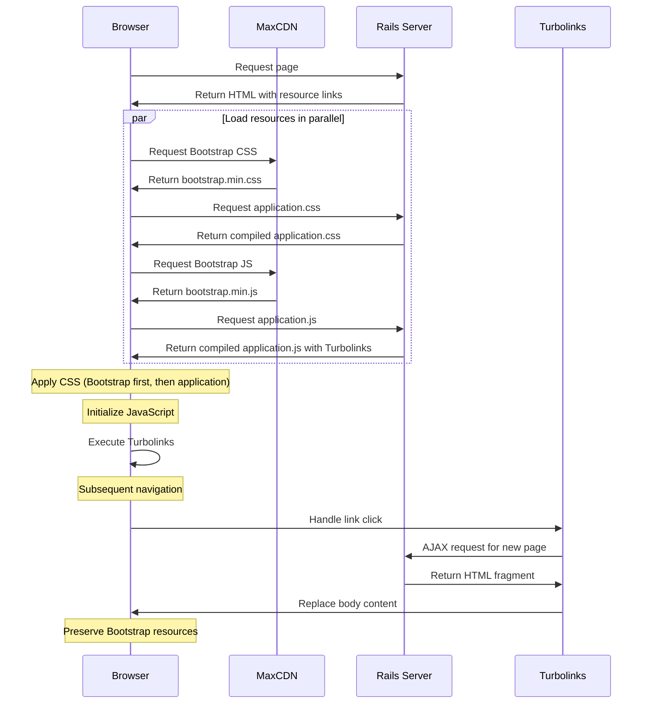
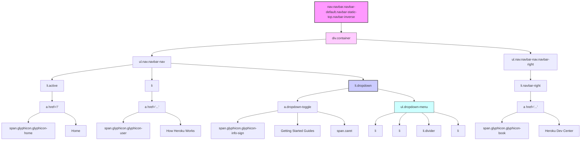
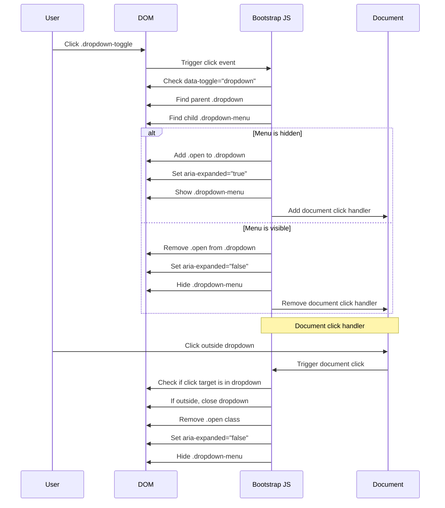
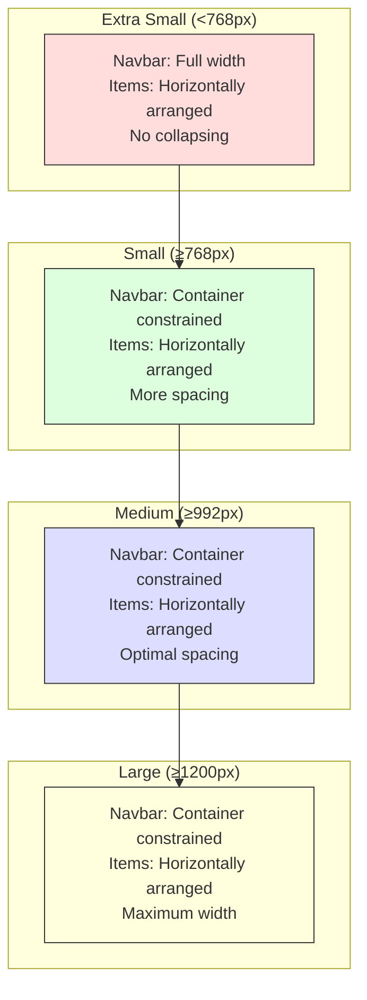

# Bootstrap Integration Analysis in Ruby Demo

## Bootstrap Integration in Ruby Demo

The Ruby Demo application demonstrates a strategic approach to integrating Bootstrap, leveraging its comprehensive UI framework to enhance the application's presentation layer. The implementation uses Bootstrap 3.3.4, loaded via Content Delivery Network (CDN) resources, which provides a robust foundation for responsive design without requiring local storage of the framework files. This approach allows the application to benefit from Bootstrap's grid system, component library, and JavaScript utilities while maintaining a clean separation between application-specific assets and the third-party framework.

The integration is accomplished through direct inclusion of Bootstrap's CSS and JavaScript files in the application layout template, establishing a global availability of Bootstrap features across all views. This architectural decision enables consistent styling and interactive behaviors throughout the application while minimizing the maintenance overhead associated with framework updates.

## CDN vs. Local Bootstrap Resources

The Ruby Demo application employs a hybrid approach to resource management, loading Bootstrap resources from a CDN while maintaining application-specific assets locally. This strategic decision offers several notable advantages:

```ruby
<%= stylesheet_link_tag  '//maxcdn.bootstrapcdn.com/bootstrap/3.3.4/css/bootstrap.min.css' %>
<%= stylesheet_link_tag    'application', media: 'all', 'data-turbolinks-track' => true %>
<%= javascript_include_tag  '//maxcdn.bootstrapcdn.com/bootstrap/3.3.4/js/bootstrap.min.js' %>
```

**Benefits:**
1. **Performance optimization** - CDN delivery typically provides faster load times through geographically distributed edge servers and parallel loading from a separate domain
2. **Caching efficiency** - Users may already have Bootstrap cached from other sites using the same CDN version
3. **Reduced server load** - Offloading large framework files to external servers reduces bandwidth consumption
4. **Simplified deployment** - No need to include Bootstrap in the application's asset pipeline

**Potential drawbacks:**
1. **External dependency** - Application functionality becomes dependent on third-party service availability
2. **Version lock-in** - The specific CDN URL hardcodes Bootstrap version 3.3.4
3. **Offline limitations** - The application requires internet connectivity to load properly
4. **Security considerations** - Using protocol-relative URLs (`//maxcdn...`) may create mixed content issues if the application is served over HTTPS

The application mitigates some of these concerns by loading application-specific assets through Rails' asset pipeline with Turbolinks tracking enabled, ensuring that custom styles and behaviors are properly maintained across page transitions while still benefiting from CDN-delivered Bootstrap resources.

## Bootstrap Resource Loading Flow

The following diagram illustrates how Bootstrap resources are loaded in relation to application assets and Turbolinks:



The resource loading flow demonstrates how the application prioritizes Bootstrap's CSS before application-specific styles, ensuring that custom styles can override Bootstrap defaults when necessary. Similarly, Bootstrap's JavaScript is loaded before application scripts to ensure that jQuery plugins and components are available to application code. Turbolinks integration preserves these resources during page transitions, avoiding unnecessary reloading of the Bootstrap framework and improving perceived performance.

## Navbar Implementation with Bootstrap

The Ruby Demo application implements a sophisticated navigation bar using Bootstrap's navbar component system. The implementation follows Bootstrap 3's conventional structure with appropriate class combinations to achieve a responsive, fixed-position navigation interface:

```ruby
<nav class="navbar navbar-default navbar-static-top navbar-inverse">
  <div class="container">
    <ul class="nav navbar-nav">
      <!-- Navigation items -->
    </ul>
    <ul class="nav navbar-nav navbar-right">
      <!-- Right-aligned navigation items -->
    </ul>
  </div>
</nav>
```

The navbar implementation leverages several key Bootstrap classes:
- `navbar-default` establishes the base styling for the navigation component
- `navbar-static-top` positions the navbar at the top of the viewport without scrolling
- `navbar-inverse` applies a dark color scheme for better contrast
- `container` centers the navbar content and applies responsive width constraints
- `navbar-nav` formats list items as horizontal navigation elements
- `navbar-right` right-aligns specific navigation elements

Each navigation item incorporates Bootstrap's Glyphicon icons for visual enhancement, maintaining consistent visual language throughout the interface. The navbar does not implement a collapsible menu for mobile viewports, which could be considered a limitation for extremely small screen sizes, though the relatively compact navigation structure mitigates this concern.

## Bootstrap Navbar Component Hierarchy

The following diagram illustrates the hierarchical structure of the Bootstrap navbar implementation:



This component hierarchy demonstrates Bootstrap's approach to semantic markup, where nested elements with specific class combinations create complex UI components. The navbar structure follows a consistent pattern of container > navigation lists > list items > links/content, with special treatment for the dropdown component that introduces additional layers of hierarchy. This structure enables Bootstrap's JavaScript components to target specific elements for interactive behaviors while maintaining clean separation between structure and presentation.

## Dropdown Menu Implementation

The Bootstrap dropdown component in the Ruby Demo application is implemented as part of the navbar, providing access to a collection of "Getting Started Guides" through a toggle-activated menu:

```ruby
<li class="dropdown">
  <a href="#" class="dropdown-toggle" data-toggle="dropdown" role="button" aria-expanded="false">
    <span class="glyphicon glyphicon-info-sign"></span> Getting Started Guides <span class="caret"></span>
  </a>
  <ul class="dropdown-menu" role="menu">
    <li><a href="...">Getting Started with Ruby on Heroku</a></li>
    <!-- Additional menu items -->
    <li class="divider"></li>
    <!-- More menu items -->
  </ul>
</li>
```

The implementation leverages Bootstrap's declarative approach to JavaScript behaviors through data attributes:
- `data-toggle="dropdown"` instructs Bootstrap's JavaScript to initialize dropdown functionality on this element
- `role="button"` enhances accessibility by indicating the interactive nature of the element
- `aria-expanded="false"` provides accessibility information about the dropdown's initial state
- `role="menu"` on the dropdown container improves screen reader compatibility

The dropdown menu includes a visual divider (`<li class="divider"></li>`) to group related items, demonstrating Bootstrap's support for semantic organization within dropdown components. The inclusion of the `caret` span element adds a visual indicator that the element triggers a dropdown, following UI convention for improved usability.

## Dropdown Interaction Flow

The following sequence diagram illustrates how Bootstrap's JavaScript handles dropdown interactions:



This interaction flow demonstrates Bootstrap's event delegation pattern, where a single click handler manages the dropdown state. The implementation uses CSS classes to control visibility and ARIA attributes to maintain accessibility. When a dropdown is opened, Bootstrap attaches a document-level click handler to detect clicks outside the dropdown component, providing a natural way to dismiss the menu. This pattern efficiently manages DOM events while maintaining a responsive user experience.

## Bootstrap and Turbolinks Integration

The Ruby Demo application combines Bootstrap's JavaScript components with Rails' Turbolinks navigation system, creating a potential integration challenge that requires careful consideration. Turbolinks accelerates page transitions by replacing only the body content rather than performing full page reloads, which can interfere with Bootstrap's initialization of JavaScript components.

The application addresses this integration through several key approaches:

1. **Proper resource ordering**: Bootstrap's JavaScript is loaded before application scripts, ensuring availability during initialization
2. **Turbolinks tracking**: Application assets use the `data-turbolinks-track` attribute to ensure proper reloading when assets change
3. **Global layout template**: Bootstrap components are defined in the application layout, ensuring they persist across Turbolinks navigations

However, this integration may still present challenges:

1. **Event binding**: Bootstrap components initialized on page load may not be properly bound after Turbolinks navigation
2. **Dynamic content**: Components added to the DOM after initial page load require manual initialization
3. **State preservation**: Interactive state (like open dropdowns) is not preserved during Turbolinks navigation

A more robust solution would involve implementing event listeners for Turbolinks navigation events (`turbolinks:load`) to reinitialize Bootstrap components as needed:

```javascript
document.addEventListener("turbolinks:load", function() {
  // Reinitialize Bootstrap components that require JavaScript
  $('[data-toggle="dropdown"]').dropdown();
  // Other component initializations as needed
});
```

This pattern ensures that Bootstrap components remain functional across Turbolinks page transitions, maintaining a seamless user experience while benefiting from both frameworks.

## Responsive Design Patterns

The Ruby Demo application leverages Bootstrap's responsive design capabilities through strategic class usage and component selection. The primary responsive pattern is implemented through the navbar component, which adapts to different viewport sizes through Bootstrap's built-in responsive behaviors.

Key responsive design patterns in the application include:

1. **Container-based layout**: The `.container` class provides responsive width constraints that adapt to viewport size
2. **Navbar component**: The navbar implementation includes classes that control its behavior across breakpoints
3. **Icon-based navigation**: Glyphicons provide compact visual indicators that maintain clarity at smaller sizes

The application does not explicitly implement Bootstrap's grid system for content layout, suggesting that the widget management interface may rely on simpler layout structures or application-specific styling. Additionally, the navbar does not implement the collapsible pattern (`.navbar-collapse` and `.navbar-toggle`) typically used for mobile viewports, indicating that the navigation is expected to remain horizontal across all device sizes.

For a more comprehensive responsive implementation, the application could benefit from:

1. **Grid system utilization**: Implementing `.row` and `.col-*` classes for flexible content layouts
2. **Responsive utility classes**: Using `.visible-*` and `.hidden-*` classes to control element visibility across breakpoints
3. **Collapsible navigation**: Adding mobile-friendly navigation toggle for very small viewports

## Responsive Breakpoints Visualization

The following diagram visualizes how the application's layout adapts across Bootstrap's standard breakpoints:



This visualization demonstrates how the application's navbar component adapts across Bootstrap's standard breakpoints. The primary adaptation occurs through the `.container` class, which constrains the width of the navbar content according to Bootstrap's predefined breakpoint widths:

- Extra Small (<768px): Full width (container expands to 100%)
- Small (≥768px): Container width of 750px
- Medium (≥992px): Container width of 970px
- Large (≥1200px): Container width of 1170px

The consistent horizontal arrangement of navigation items across all breakpoints suggests that the application prioritizes a simplified navigation structure that works across device sizes without requiring complex responsive adaptations.

## Bootstrap Glyphicons Usage

The Ruby Demo application makes strategic use of Bootstrap's Glyphicon set to enhance navigation elements with visual indicators. Glyphicons are implemented as span elements with appropriate classes, following Bootstrap's recommended pattern:

```ruby
<span class="glyphicon glyphicon-home"></span> Home
<span class="glyphicon glyphicon-user"></span> How Heroku Works
<span class="glyphicon glyphicon-info-sign"></span> Getting Started Guides
<span class="glyphicon glyphicon-book"></span> Heroku Dev Center
```

This implementation demonstrates several best practices:

1. **Semantic icon selection**: Each icon visually represents the content it accompanies (home, user, info, book)
2. **Consistent implementation**: All navigation items follow the same pattern of icon + text
3. **Accessibility consideration**: Icons are paired with text labels rather than used alone
4. **Visual hierarchy**: Icons provide additional visual cues without dominating the interface

The application leverages Glyphicons as complementary visual elements rather than primary interactive components, enhancing usability through familiar visual patterns. This approach aligns with Bootstrap's design philosophy of providing meaningful visual cues that support rather than replace textual content.

## Bootstrap Version Considerations

The Ruby Demo application specifically uses Bootstrap 3.3.4, which has several implications for the application's architecture and future maintenance:

```ruby
<%= stylesheet_link_tag  '//maxcdn.bootstrapcdn.com/bootstrap/3.3.4/css/bootstrap.min.css' %>
<%= javascript_include_tag  '//maxcdn.bootstrapcdn.com/bootstrap/3.3.4/js/bootstrap.min.js' %>
```

**Version-specific considerations:**

1. **Legacy framework**: Bootstrap 3.3.4 was released in April 2015 and represents a mature but aging version of the framework
2. **jQuery dependency**: Bootstrap 3.x requires jQuery as a dependency, which is not explicitly included in the application layout
3. **Glyphicons inclusion**: This version includes Glyphicons directly in the CSS, which are removed in Bootstrap 4+
4. **Browser support**: Bootstrap 3.3.4 supports IE8+, providing broader legacy browser compatibility than newer versions

**Upgrade implications:**

1. **Major structural changes**: Upgrading to Bootstrap 4+ would require significant markup changes (e.g., `.navbar-default` to `.navbar-light`)
2. **Component API changes**: Many components have revised APIs and class names in newer versions
3. **Flexbox adoption**: Bootstrap 4+ uses Flexbox for layout, offering more sophisticated positioning capabilities
4. **Icon system changes**: Bootstrap 4 removed Glyphicons, requiring alternative icon implementation

For modernization, the application could benefit from upgrading to a current Bootstrap version, but this would require comprehensive template updates and testing across all views. The CDN-based approach does simplify version updates by requiring only URL changes rather than asset pipeline modifications, providing a path for incremental modernization if desired.

[Generated by the Sage AI expert workbench: 2025-03-27 21:27:21  https://sage-tech.ai/workbench]: #