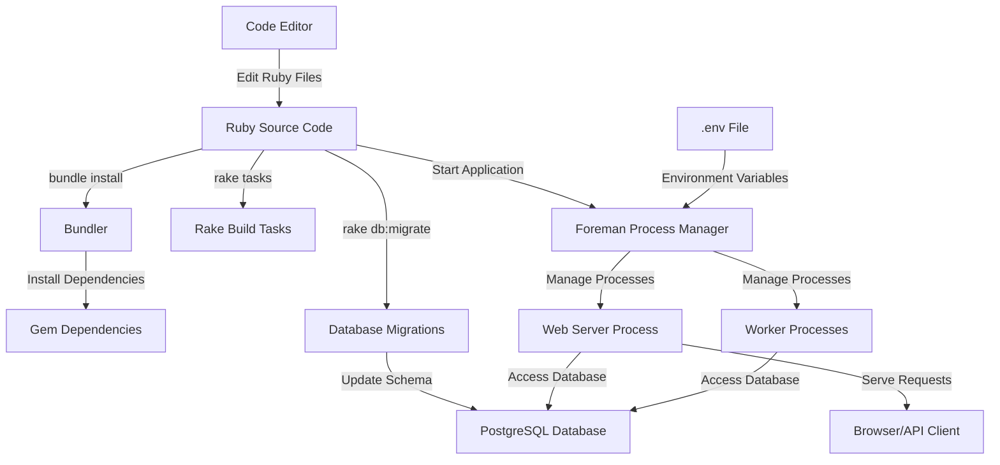
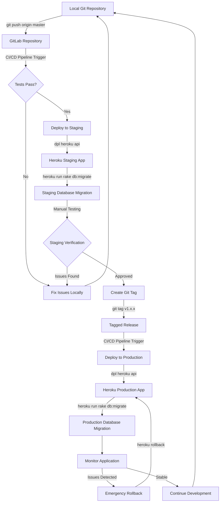
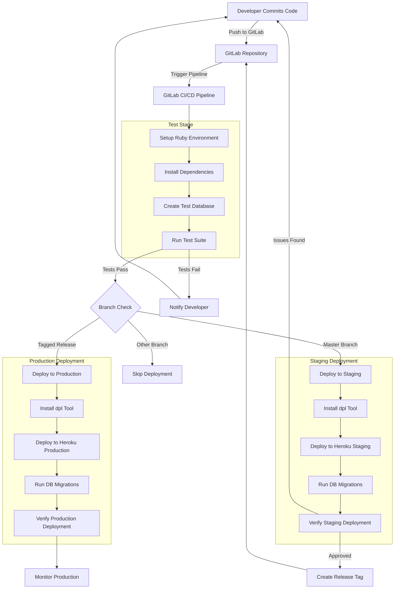
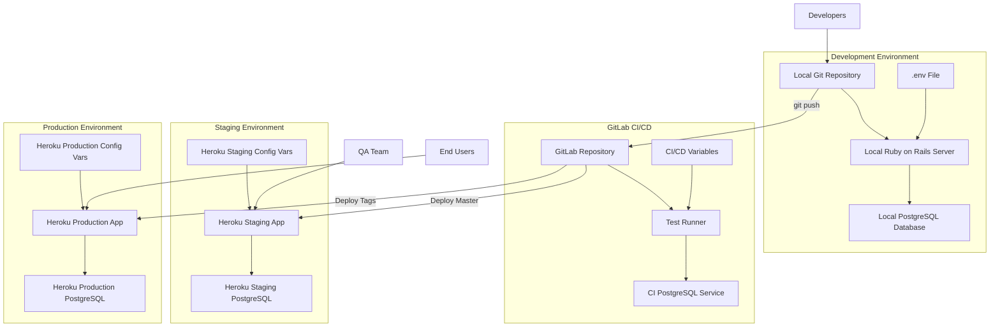

# Ruby Demo's Build & Deployment Architecture

## Introduction to Ruby Demo's Build & Deployment Architecture

The Ruby Demo Rails application employs a modern, multi-environment build and deployment architecture that balances developer productivity with operational reliability. At its core, the system leverages Ruby's ecosystem tools like Bundler for dependency management and Rake for build automation, while incorporating industry-standard CI/CD practices through GitLab's pipeline infrastructure. The deployment strategy follows a git-based workflow targeting Heroku's Platform-as-a-Service, with distinct environments for development, staging, and production. This architecture enables rapid iteration during development while maintaining strict controls for production deployments. The system incorporates process management through Foreman to ensure environment parity, and secures sensitive credentials through GitLab's variable storage mechanism. This comprehensive approach allows the application to move reliably from local development through automated testing and into production with minimal friction.

## Local Development Environment Setup

Setting up the Ruby Demo's local development environment requires several key components to be installed and configured:

1. **Ruby Installation**: 
   - Install Ruby using a version manager like RVM or rbenv (specific version requirements are in the Gemfile)
   - Verify installation with `ruby -v`

2. **Dependency Management with Bundler**:
   - Install Bundler gem: `gem install bundler`
   - Run `bundle install` to install all dependencies specified in the Gemfile
   - Dependencies are installed to a local path for isolation

3. **Database Configuration**:
   - Configure database settings in `config/database.yml`
   - Create the database with `bundle exec rake db:create`
   - Run migrations with `bundle exec rake db:migrate`

4. **Heroku Toolbelt Installation**:
   - Install the Heroku CLI for deployment operations
   - Authenticate with `heroku login`

5. **Process Management Setup**:
   - Install Foreman: `gem install foreman`
   - Configure process types in `Procfile`
   - Start the application with `foreman start web`

6. **Environment Variables**:
   - Set up development environment variables in `.env` file (not committed to version control)
   - Configure any service credentials needed for local development

This setup ensures a consistent development environment that closely mirrors the production configuration, reducing environment-specific issues during deployment.

## Local Development Workflow

The local development workflow for Ruby Demo integrates code editing, dependency management, database operations, and process management into a cohesive system.



The local development workflow centers around the Foreman process manager, which orchestrates the application's components according to the Procfile configuration. Developers edit code in their preferred editor, then use Bundler to manage dependencies whenever the Gemfile changes. Database schema changes are applied through Rake migration tasks, ensuring the local database structure stays in sync with the application code. Foreman loads environment variables from the .env file and starts the necessary processes, including the web server that handles HTTP requests and any background workers. This workflow maintains parity with production environments while providing the rapid feedback loop necessary for efficient development.

## Rake Tasks for Build Automation

Rake tasks form the backbone of build automation in the Ruby Demo application, providing a standardized interface for common operations across development and deployment workflows. The application leverages Rails' built-in Rake tasks and extends them with custom functionality specific to the project's needs.

The primary Rake tasks used in the build and deployment process include:

1. **Database Management Tasks**:
   - `rake db:create` - Creates the database defined in database.yml
   - `rake db:migrate` - Runs pending migrations to update the database schema
   - `rake db:seed` - Populates the database with initial data
   - `rake db:reset` - Drops and recreates the database with fresh schema and seed data

2. **Testing Tasks**:
   - `rake test` - Runs the test suite to verify application functionality
   - `rake test:system` - Executes system/integration tests
   - `rake test:models` - Runs model-specific tests

3. **Asset Pipeline Tasks**:
   - `rake assets:precompile` - Compiles and fingerprints assets for production deployment
   - `rake assets:clean` - Removes old compiled assets

4. **Deployment Tasks**:
   - Custom tasks defined in `lib/tasks` directory with `.rake` extensions
   - Tasks for environment-specific configurations and pre/post-deployment operations

The Rakefile at the project root serves as the entry point for all these tasks, loading the Rails application environment and making the tasks available to the command line. This task-based approach provides a consistent interface for both manual operations and automated CI/CD processes, ensuring that the same reliable procedures are followed regardless of the execution context.

Rake tasks are particularly valuable during deployment, as they encapsulate complex operations like database migrations into simple commands that can be executed remotely on Heroku or other deployment targets, maintaining the application's state across environments.

## Heroku Deployment Strategy

The Ruby Demo application employs a git-based Heroku deployment strategy that leverages Heroku's PaaS capabilities for simplified infrastructure management. This approach allows developers to focus on application code while Heroku handles the underlying runtime environment, scaling, and operational concerns.

The deployment workflow consists of several key steps:

1. **Heroku Application Creation**:
   - One-time setup: `heroku create [app-name]` establishes a new Heroku application
   - Creates both a git remote for deployment and a URL for the application
   - Separate applications are created for staging and production environments

2. **Git-based Deployment**:
   - Code is deployed via git push: `git push heroku master`
   - Heroku automatically detects the Ruby application and installs dependencies
   - The buildpack system identifies and configures the appropriate runtime environment

3. **Post-deployment Operations**:
   - Database migrations are run manually or through CI/CD: `heroku run rake db:migrate`
   - Environment-specific configuration is managed through Heroku Config Vars
   - Application restart if needed: `heroku restart`

4. **Environment Management**:
   - Staging environment receives all master branch updates
   - Production environment is updated only from tagged releases
   - Environment parity is maintained through identical buildpacks and configurations

5. **Add-on Integration**:
   - Database provisioning: `heroku addons:create heroku-postgresql`
   - Other services (Redis, monitoring tools) are added as needed

6. **Release Management**:
   - Heroku maintains release history for easy rollbacks
   - `heroku releases` shows deployment timeline
   - `heroku rollback` reverts to previous known-good state if issues arise

This deployment strategy balances simplicity with robustness, providing a straightforward path to production while maintaining the separation between environments necessary for proper testing and validation. The git-based workflow integrates seamlessly with the development process, allowing for rapid iteration and deployment.

## Heroku Deployment Pipeline

The Heroku deployment pipeline for Ruby Demo provides a structured approach to moving code from development through testing and into production environments.



The Heroku deployment pipeline integrates with GitLab CI/CD to provide automated testing and deployment across environments. The workflow begins with developers pushing code to the GitLab repository, which triggers the CI/CD pipeline. If tests pass, the code is automatically deployed to the staging environment using the `dpl` deployment tool with the Heroku API key stored securely in GitLab CI/CD variables.

After deployment to staging, database migrations are applied and the application undergoes manual verification. If issues are found, developers fix them locally and restart the process. Once the staging deployment is verified, a git tag is created to mark a production release, which triggers deployment to the production environment through the same CI/CD pipeline.

The production deployment follows the same pattern as staging but uses a separate Heroku application and API key. After deployment, the application is monitored for any issues. If problems arise, Heroku's rollback functionality provides a quick path to restore service while fixes are developed.

This pipeline ensures that code is thoroughly tested before reaching production and provides clear separation between environments, with staging serving as a final verification step before production deployment. The git-based workflow with tagging provides clear traceability for all production releases.

## GitLab CI/CD Integration

The Ruby Demo application leverages GitLab CI/CD for automated testing and deployment, creating a streamlined path from code commit to production deployment. This integration eliminates manual steps, reduces human error, and ensures consistent build and deployment processes across all environments.

The GitLab CI/CD configuration is defined in the `.gitlab-ci.yml` file at the project root, which specifies a pipeline with distinct stages for testing and deployment. The pipeline is triggered automatically on code commits and tag creation, with different actions taken based on the branch or tag that triggered the build.

Key components of the GitLab CI/CD integration include:

1. **Docker-based Execution Environment**:
   - Jobs run in a Ruby 2.6 Docker container
   - PostgreSQL service container provides database functionality for tests
   - Dependencies are installed at runtime using Bundler

2. **Test Stage**:
   - Runs on every commit to any branch
   - Installs required system dependencies (Node.js)
   - Creates test database and runs the full test suite
   - Fails the pipeline if any tests fail, preventing deployment of broken code

3. **Deploy Stage**:
   - Uses the `dpl` gem to deploy to Heroku via API
   - Separate jobs for staging and production environments
   - Conditional execution based on branch/tag patterns

4. **Environment-specific Configuration**:
   - Staging deployment triggered on commits to master branch
   - Production deployment triggered only on tagged releases
   - Different Heroku applications and API keys for each environment

5. **Secure Credential Management**:
   - Heroku API keys stored as GitLab CI/CD variables
   - No sensitive information exposed in configuration files

This integration creates a fully automated pipeline where code changes are automatically tested and, if successful, deployed to the appropriate environment based on the branch or tag. The system enforces quality gates through automated testing and provides clear separation between environments, ensuring that only verified code reaches production.

## GitLab CI/CD Pipeline Architecture

The GitLab CI/CD pipeline for Ruby Demo implements a comprehensive workflow that automates testing and deployment across multiple environments.



The GitLab CI/CD pipeline architecture for Ruby Demo implements a comprehensive continuous integration and deployment workflow. The pipeline begins when code is pushed to the GitLab repository, triggering the test stage which runs in a Docker container with Ruby 2.6 and a PostgreSQL service. This stage installs dependencies, creates a test database, and runs the full test suite.

If tests pass, the pipeline proceeds to conditional deployment stages based on the branch or tag that triggered the build. Commits to the master branch trigger deployment to the staging environment, while tagged releases trigger deployment to production. Other branches only run tests without deployment.

Both deployment stages use the `dpl` tool to deploy to Heroku via API, with separate applications and API keys for each environment. After deployment, database migrations are run to ensure schema consistency.

The staging environment serves as a pre-production verification step, where the application can be tested in a production-like setting. Once verified, a release tag can be created to trigger deployment to production.

This architecture enforces a strict progression from development through testing and staging before reaching production, ensuring that only thoroughly tested and verified code is deployed to end users. The automated nature of the pipeline reduces manual intervention, minimizes human error, and provides consistent, repeatable deployments across all environments.

## Environment-Specific Deployments

The Ruby Demo application implements a sophisticated environment-specific deployment strategy that ensures code progresses through appropriate validation stages before reaching production. This approach leverages GitLab CI/CD's conditional job execution capabilities to direct code to the correct environment based on branch and tag patterns.

The deployment strategy is defined in the `.gitlab-ci.yml` file and follows these key principles:

1. **Environment Segregation**:
   - Separate Heroku applications for staging and production environments
   - Distinct API keys and configurations for each environment
   - Environment-specific database instances to prevent data contamination

2. **Branch-Based Deployment Rules**:
   - Master branch commits automatically deploy to staging
   - Tagged releases deploy to production
   - Feature branches only run tests without deployment

3. **Conditional Job Execution**:
   - Staging deployment job includes: `only: - master`
   - Production deployment job includes: `only: - tags`
   - This ensures code follows the proper progression

4. **Progressive Validation**:
   - All code is tested before any deployment
   - Code must pass through staging before production
   - Creates a validation gate between environments

5. **Environment-Specific Configuration**:
   - Different Heroku applications: `gitlab-ci-ruby-test-staging` and `gitlab-ci-ruby-test-prod`
   - Environment variables set differently for each target
   - Database configurations appropriate to each environment's needs

This approach creates a clear promotion path for code changes: development → testing → staging → production. Each step provides additional validation before the code reaches users, with automated deployments to staging providing rapid feedback while restricting production deployments to explicitly tagged releases. This balance of automation and control ensures both agility and stability in the deployment process.

The environment-specific deployment strategy also facilitates proper testing in a production-like environment (staging) before committing to a production release, reducing the risk of unexpected behavior when code reaches end users.

## Secure Credential Management

The Ruby Demo application implements a robust credential management strategy that secures sensitive information throughout the CI/CD pipeline while maintaining operational efficiency. This approach is centered around GitLab CI/CD variables for storing credentials that are needed during automated processes.

Key aspects of the secure credential management strategy include:

1. **GitLab CI/CD Variables**:
   - Heroku API keys stored as protected variables in GitLab
   - Separate variables for staging and production environments:
     - `HEROKU_STAGING_API_KEY`
     - `HEROKU_PRODUCTION_API_KEY`
   - Variables are injected into the CI/CD environment at runtime
   - Not visible in logs or to unauthorized users

2. **Environment Isolation**:
   - Different credentials for each deployment environment
   - Production credentials have stricter access controls
   - Compromise of staging credentials doesn't affect production

3. **Credential Usage**:
   - API keys accessed directly in deployment scripts:
     ```yaml
     dpl heroku api --app=gitlab-ci-ruby-test-staging --api-key=$HEROKU_STAGING_API_KEY
     ```
   - No credentials stored in repository code
   - No need to decrypt or process credentials during deployment

4. **Access Control**:
   - Credentials accessible only to CI/CD pipeline
   - Not exposed to local development environments
   - Role-based access control for managing CI/CD variables

5. **Credential Rotation**:
   - Process for regular rotation of API keys
   - Update only requires changing GitLab CI/CD variables
   - No code changes needed when rotating credentials

This approach ensures that sensitive credentials are never committed to the repository, visible in logs, or accessible to unauthorized users, while still being available to automated processes that require them. By leveraging GitLab's built-in variable storage and injection mechanism, the system achieves security without sacrificing the automation benefits of CI/CD.

The separation of staging and production credentials further enhances security by limiting the potential impact of credential compromise and enabling more granular access control based on environment sensitivity.

## Multi-Environment Architecture

The Ruby Demo application employs a multi-environment architecture that provides isolation between development, staging, and production while maintaining consistency across environments.



The multi-environment architecture for Ruby Demo creates a clear separation between development, testing, staging, and production environments while maintaining consistency in application behavior across all environments. This architecture ensures that code changes can be thoroughly validated before reaching end users.

In the development environment, developers work with local instances of the application and database, with environment variables stored in a .env file. Code is pushed to the GitLab repository, which triggers the CI/CD pipeline running tests in an isolated environment with its own PostgreSQL service.

Successful builds on the master branch are automatically deployed to the staging environment on Heroku, which has its own dedicated PostgreSQL database and configuration variables. This environment mirrors production and serves as a final validation step for QA testing.

Tagged releases trigger deployment to the production environment, which is completely isolated from staging with its own Heroku application, database, and configuration. This isolation prevents any staging activities from affecting production data or performance.

Each environment has appropriate access controls: developers have access to development and can trigger CI/CD, QA teams have access to staging for verification, and end users interact only with the production environment. Configuration variables are managed separately for each environment, allowing environment-specific settings without code changes.

This architecture provides a balance between consistency (same application code across environments) and isolation (separate databases and configurations), enabling thorough testing while protecting production stability and data integrity.

## Docker-Based Testing Environment

The Ruby Demo application leverages Docker containers within GitLab CI/CD to create consistent, isolated testing environments that accurately reproduce the application's runtime conditions. This approach ensures reliable test results and eliminates "works on my machine" issues by standardizing the testing environment across all pipeline runs.

The Docker-based testing environment consists of several key components:

1. **Base Ruby Container**:
   - Uses the official `ruby:2.6` Docker image
   - Provides consistent Ruby runtime environment
   - Includes all necessary system dependencies for Ruby gems

2. **PostgreSQL Service Integration**:
   - Runs PostgreSQL as a linked service container
   - Configured through GitLab Runner template:
     ```toml
     [[runners.docker.services]]
     name = "postgres:latest"
     ```
   - Accessible to tests via hostname `postgres`
   - Provides isolated database for each test run

3. **Environment Configuration**:
   - Test-specific environment variables set in CI configuration
   - Database connection parameters for the PostgreSQL service
   - Test mode settings to ensure proper test execution

4. **Dependency Management**:
   - Installs Node.js for JavaScript runtime support
   - Uses Bundler to install gem dependencies
   - Caches dependencies with `--path /cache` for faster builds

5. **Test Execution Process**:
   - Creates test database with `bundle exec rake db:create RAILS_ENV=test`
   - Runs full test suite with `bundle exec rake test`
   - Reports results back to GitLab CI/CD

The Docker-based approach provides several advantages for testing:

- **Consistency**: Every test run uses identical environment configuration
- **Isolation**: Tests don't interfere with each other or depend on external services
- **Reproducibility**: Test failures can be reproduced locally using the same Docker configuration
- **Parallelism**: Multiple test jobs can run simultaneously without conflict

This testing environment is defined in the `.gitlab-ci.yml` file and managed by GitLab Runners, which handle container creation, service linking, and test execution. The configuration ensures that tests run in an environment that closely resembles production, increasing confidence that passing tests indicate production-ready code.

[Generated by the Sage AI expert workbench: 2025-03-29 18:36:01  https://sage-tech.ai/workbench]: #