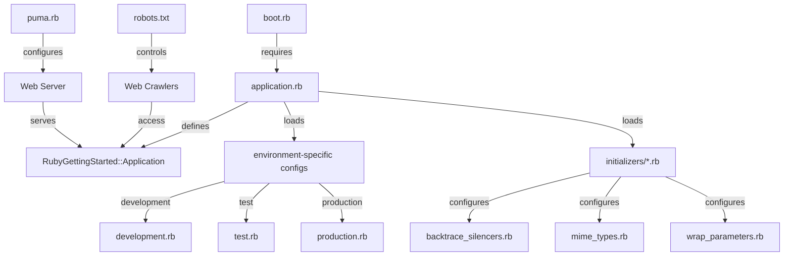
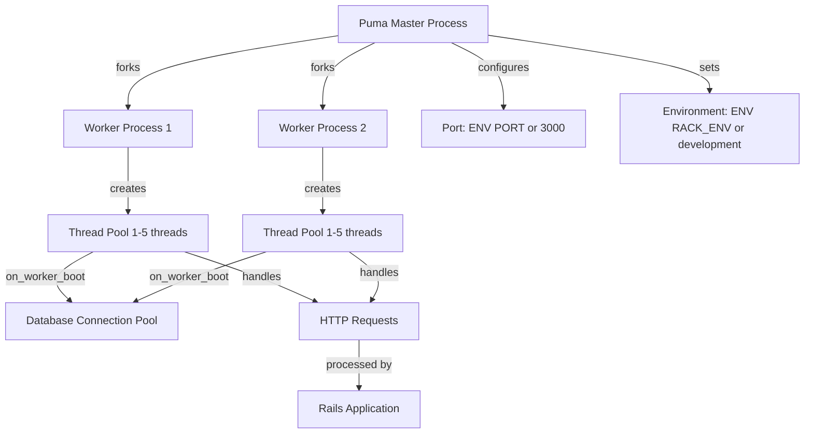
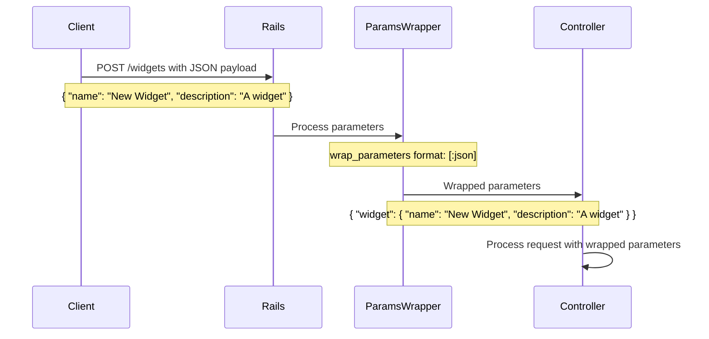
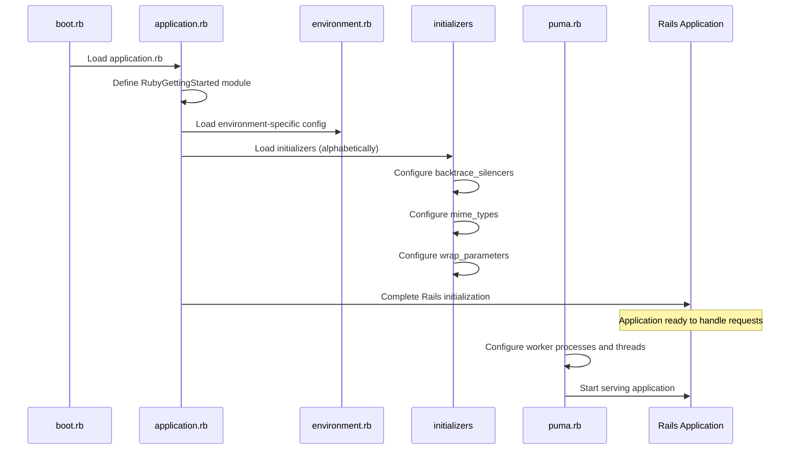

# Configuration in Ruby Demo

## Configuration Overview in Ruby Demo

The Ruby Demo Rails application employs a layered configuration architecture that follows Rails conventions while providing flexibility for different deployment environments. Configuration in this application is organized hierarchically, with core settings defined in the application.rb file and environment-specific overrides in separate files. This approach allows the application to maintain consistent behavior across development, testing, and production environments while accommodating the unique requirements of each. The configuration system leverages environment variables extensively, providing deployment flexibility without code changes. Ruby Demo's configuration architecture demonstrates a clean separation of concerns, with specialized initializers handling discrete aspects of the application's behavior, from error reporting to parameter handling and MIME type registration.

## Application Configuration Structure

The application.rb file serves as the central configuration point for the Ruby Demo application. It defines the top-level module `RubyGettingStarted` that encapsulates the entire Rails application and establishes the inheritance hierarchy through `Application < Rails::Application`. This file loads all required gems using Bundler.require with Rails.groups, ensuring that environment-specific gems are only loaded when needed. While the file contains commented configuration options for time zones and internationalization settings, it primarily delegates to environment-specific files (development.rb, test.rb, production.rb) that override these defaults as needed. This separation allows the application to maintain a clean core configuration while adapting to different deployment contexts. The structure follows Rails' "convention over configuration" principle, with sensible defaults that can be overridden when necessary.

## Rails Configuration Hierarchy

The diagram illustrates the configuration hierarchy in Ruby Demo, showing how configuration flows from the boot process through various specialized files. The boot.rb file initiates the process by requiring application.rb, which defines the core application module and loads environment-specific configurations. These environment files customize the application behavior for different contexts (development, test, production). Initializers provide specialized configuration for specific components like error handling and parameter processing. External to the Rails configuration but still part of the overall system, puma.rb configures the web server that hosts the application, while robots.txt controls how web crawlers interact with it. This hierarchical approach ensures that configuration is properly layered, with more specific settings overriding general ones as needed.

## Environment Variables and Configuration

Ruby Demo makes extensive use of environment variables to create a flexible configuration that adapts to different deployment environments without code changes. This approach follows the principles outlined in the Twelve-Factor App methodology, which recommends storing configuration in the environment rather than in code. The application uses environment variables with fallback values to ensure sensible defaults while allowing for customization. For example, in puma.rb, the server configuration uses `workers Integer(ENV['WEB_CONCURRENCY'] || 2)` to set the number of worker processes based on an environment variable, with a default of 2 if the variable is not set. Similarly, thread counts, port settings, and the application environment are all configured through environment variables (`MAX_THREADS`, `PORT`, `RACK_ENV`). This pattern appears throughout the application's configuration, making it highly adaptable to different hosting environments while maintaining consistent behavior when deployed with default settings.

## Puma Web Server Configuration

The puma.rb file implements a sophisticated configuration for the Puma web server that balances performance, resource utilization, and reliability. It configures a concurrency model using both processes and threads, with the number of worker processes controlled by the `WEB_CONCURRENCY` environment variable (defaulting to 2) and thread counts set by `MAX_THREADS` (defaulting to 5). The configuration enables `preload_app!`, which loads the application code before forking worker processes, improving memory efficiency by sharing the application code across workers. The file also implements the critical `on_worker_boot` hook that establishes database connections for each worker process, preventing connection pool issues in multi-process deployments. Port and environment settings are similarly configurable through environment variables, making the server adaptable to different deployment scenarios. This configuration demonstrates an understanding of Puma's architecture and how to optimize it for a Rails application with database connections.

## Puma Server Architecture

The diagram illustrates Puma's architecture as configured in Ruby Demo. The Puma master process forks multiple worker processes (defaulting to 2 as specified by `WEB_CONCURRENCY`), each handling a portion of incoming traffic. Each worker process maintains its own thread pool (with 1-5 threads as specified by `MAX_THREADS`), allowing for concurrent request processing within each process. When a worker boots, it establishes its own database connection pool through the `on_worker_boot` hook, ensuring proper connection management. All workers listen on the same port (defaulting to 3000) and run in the same environment (defaulting to development). This multi-process, multi-threaded architecture provides scalability through process isolation combined with the efficiency of thread-based concurrency, while the preloading of the application code (`preload_app!`) reduces memory overhead by sharing the application code across worker processes.

## Initializers: Purpose and Loading Sequence

Rails initializers in Ruby Demo serve as specialized configuration components that load during the application boot sequence to set up specific aspects of the application's behavior. These initializers are automatically loaded alphabetically from the config/initializers directory when the application starts. In Ruby Demo, we see several standard Rails initializers: backtrace_silencers.rb configures error trace filtering, mime_types.rb registers custom content types, and wrap_parameters.rb standardizes JSON parameter handling. Each initializer focuses on a specific concern, following the single responsibility principle. The initializers run after the framework and gem initialization but before the application routes are loaded, allowing them to modify framework behavior before the application begins handling requests. This sequencing ensures that all configuration is properly established before the application becomes active. The comment "Be sure to restart your server when you modify this file" at the top of each initializer emphasizes that these settings are only applied during application boot, not dynamically at runtime.

## Error Handling Configuration

The backtrace_silencers.rb initializer configures how Ruby Demo filters and presents error backtraces, an important aspect of the application's error handling strategy. While the file contains only commented examples in its current state, it demonstrates two key capabilities: adding custom silencers to filter out noise from error traces and removing all silencers when debugging framework issues. The silencer mechanism uses regular expressions to identify and filter out stack frames from specific libraries that would otherwise clutter error reports. For example, the commented line `Rails.backtrace_cleaner.add_silencer { |line| line =~ /my_noisy_library/ }` shows how to filter out frames from a hypothetical noisy library. This configuration enhances the debugging experience by focusing error traces on application code rather than framework internals, making it easier to identify the root cause of issues. The ability to remove all silencers temporarily (`Rails.backtrace_cleaner.remove_silencers!`) provides a way to see the complete stack trace when investigating problems that might originate in framework code.

## Request Parameter Flow

The diagram visualizes how parameters flow through Ruby Demo when processing JSON requests, with a focus on the wrap_parameters.rb configuration. When a client sends a JSON request to the application, the raw parameters arrive as a flat structure. The ActionController::ParamsWrapper middleware, configured in wrap_parameters.rb, intercepts these parameters and wraps them in a nested hash using the controller's name as the key. This transformation happens automatically for JSON requests due to the configuration `wrap_parameters format: [:json]`. The wrapping process standardizes parameter handling across different request formats, making controller code more consistent by ensuring that parameters from JSON requests have the same structure as those from form submissions. This configuration is conditionally applied only if the controller responds to the wrap_parameters method, providing flexibility for controllers that need different parameter handling. The commented section about root elements in JSON for ActiveRecord objects shows an additional configuration option that could be enabled to further customize JSON parameter handling.

## MIME Type Configuration

The mime_types.rb initializer enables Ruby Demo to register and handle custom content types beyond the standard formats supported by Rails. Although the file currently contains only a commented example (`Mime::Type.register "text/richtext", :rtf`), it demonstrates the mechanism for extending the application's content type capabilities. This configuration is particularly important for applications that need to serve specialized formats or interact with external systems using non-standard content types. When uncommented and customized, this code would register new MIME types with Rails, allowing controllers to respond to requests for these formats using the `respond_to` block pattern. For example, after registering the RTF format, a controller could include `format.rtf { render rtf: @widget }` to serve rich text format documents. This extensibility mechanism is part of Rails' content negotiation system, which allows a single resource to be represented in multiple formats based on client preferences. The mime_types.rb file serves as a central location for these custom format registrations, keeping them separate from application logic.

## Web Crawler Configuration

The robots.txt file in Ruby Demo's public directory controls how search engines and other web crawlers interact with the application. In its current state, the file contains only commented examples and no active directives, meaning all crawlers are permitted to access all areas of the site. This configuration is appropriate for a public-facing application where content discoverability is desired. The commented example shows how to completely block all crawlers using the `User-agent: *` and `Disallow: /` directives, which would be useful for staging environments or private applications. The robots.txt file follows a standard format recognized by all major search engines and crawlers, providing a simple but effective way to control site indexing. While this file is technically separate from the Rails configuration system, it represents an important aspect of the application's public interface configuration. For production deployments, this file would typically be customized to allow indexing of public content while protecting sensitive or duplicate content paths from being indexed.

## Configuration Loading Timeline

This sequential diagram illustrates the timeline of configuration loading during the Ruby Demo application's boot process. The sequence begins with boot.rb, which loads application.rb to define the core application structure and the RubyGettingStarted module. Next, environment-specific configurations are loaded based on the current RAILS_ENV setting. The initializers are then loaded in alphabetical order, with each one configuring a specific aspect of the application: backtrace_silencers.rb sets up error trace filtering, mime_types.rb registers custom content types, and wrap_parameters.rb configures JSON parameter handling. After all initializers complete, Rails finalization occurs, making the application ready to handle requests. Finally, when the application is started with Puma, the puma.rb configuration takes effect, setting up worker processes and thread pools before beginning to serve the application. This ordered loading ensures that all configuration components are properly initialized before the application begins handling user requests, with more specific configurations building upon the foundation established by earlier ones.

[Generated by the Sage AI expert workbench: 2025-03-29 18:36:01  https://sage-tech.ai/workbench]: #