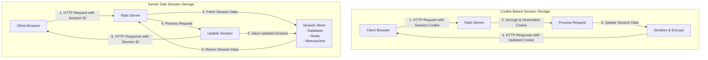
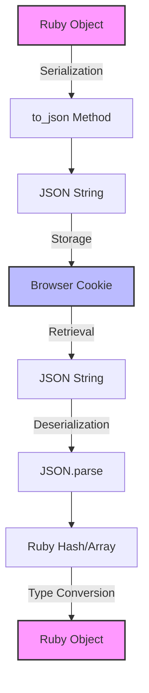
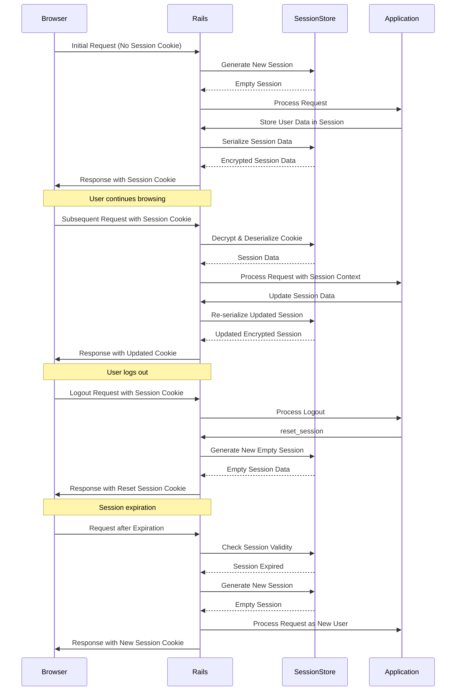
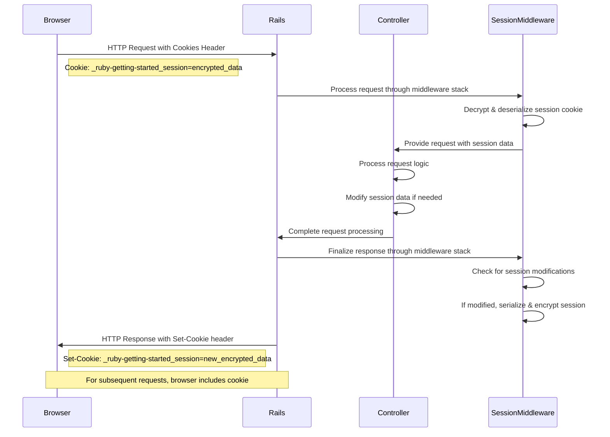

# Cookie & Session Management in Ruby on Rails

## Introduction to Cookies and Sessions in Ruby on Rails

HTTP is inherently stateless, meaning each request to a web server is processed independently, with no knowledge of previous requests. This presents a challenge for web applications that need to maintain user state across multiple interactions. Ruby on Rails addresses this challenge through its robust cookie and session management system.

Cookies are small pieces of data stored in the client's browser that can be accessed by the server on subsequent requests. Sessions, on the other hand, provide a way to store user-specific data across multiple requests, creating the illusion of continuity in an otherwise stateless protocol. Rails abstracts much of the complexity involved in managing cookies and sessions, providing developers with a clean API for maintaining state.

In Rails, sessions are typically implemented using cookies, though alternative storage mechanisms exist. The session is essentially a hash-like object that persists between requests, allowing developers to store user authentication status, preferences, shopping cart contents, and other stateful data. Rails handles the serialization, encryption, and transport of this data automatically, making it straightforward to maintain state in your application.

## Cookie-Based Session Storage Configuration

The Ruby Demo application configures its session storage mechanism in the `session_store.rb` initializer file. This configuration is critical as it determines how user session data is maintained across requests. The application uses cookie-based session storage, as evidenced by the following configuration:

```ruby
Rails.application.config.session_store :cookie_store, key: '_ruby-getting-started_session'
```

This configuration specifies that session data should be stored directly in cookies on the client side rather than in a server-side store. The `:cookie_store` symbol indicates the storage mechanism, while the `key` parameter defines the name of the cookie that will hold the session data. In this case, the cookie is named `'_ruby-getting-started_session'`.

Cookie-based session storage offers several advantages, including simplicity and scalability. Since all session data is stored on the client side, the server remains stateless, eliminating the need for session synchronization across multiple server instances. This makes horizontal scaling more straightforward, as any server can process any request without needing access to a centralized session store.

However, this approach also has limitations, including size constraints (cookies are limited to 4KB in most browsers) and potential security implications, as the session data travels with every request.

## Cookie vs. Server-Side Session Storage



The diagram above illustrates the fundamental difference between cookie-based and server-side session storage approaches. In cookie-based storage, all session data is serialized, encrypted, and sent back and forth between the client and server with each request. This eliminates the need for server-side storage but increases the payload size of each HTTP request and response.

In contrast, server-side session storage keeps only a session identifier in the cookie, with the actual session data stored on the server in a database, cache store like Redis or Memcached, or other persistent storage. This approach reduces the HTTP payload size but requires additional infrastructure to maintain and synchronize session data across multiple server instances.

The choice between these approaches involves trade-offs in terms of scalability, security, and performance. Cookie-based storage simplifies deployment and scaling but limits session size and potentially exposes more data to the client. Server-side storage offers greater flexibility in session size and better security isolation but adds complexity to the infrastructure.

## JSON Cookie Serialization

The Ruby Demo application configures JSON as its cookie serialization format through the `cookies_serializer.rb` initializer:

```ruby
Rails.application.config.action_dispatch.cookies_serializer = :json
```

This configuration determines how Ruby objects are transformed before being stored in cookies and how they're reconstructed when retrieved. By setting the serializer to `:json`, the application ensures that cookie values are serialized to JSON format rather than using Ruby's native Marshal serialization or other alternatives.

JSON serialization offers several advantages over other formats. Unlike Marshal, which is Ruby-specific, JSON is a widely adopted standard that can be read by many programming languages and platforms. This interoperability is particularly valuable in heterogeneous environments where cookies might need to be processed by non-Ruby systems.

Additionally, JSON serialization provides better security characteristics than Marshal. Marshal can deserialize arbitrary Ruby objects, potentially leading to remote code execution vulnerabilities if cookie data is tampered with. JSON, being a data-only format, limits deserialization to simple data structures like hashes, arrays, and primitive types, reducing the attack surface.

The trade-off is that JSON cannot directly serialize complex Ruby objects like ActiveRecord instances or custom classes. These must be converted to simpler structures before serialization and reconstructed after deserialization, which may require additional application logic.

## Cookie Serialization Process



The diagram above illustrates the serialization and deserialization process for cookie data in Rails when using JSON serialization. When a Ruby object needs to be stored in a cookie, it first goes through the serialization process:

1. The Ruby object (which could be a hash, array, or other structure) is converted to a JSON-compatible format
2. The `to_json` method is called on this structure, producing a JSON string
3. This string is then stored in the browser cookie, potentially after encryption if the cookie is signed or encrypted

When retrieving the data:

1. The JSON string is extracted from the cookie
2. It's parsed using `JSON.parse` to create Ruby hashes and arrays
3. These basic structures may then be converted back to more complex Ruby objects if necessary

This process ensures that complex Ruby data structures can be safely stored in cookies and reconstructed later, while maintaining the security and interoperability benefits of JSON. The serialization process is handled automatically by Rails, making it transparent to application code that reads from or writes to the session.

## Security Implications of Cookie-Based Sessions

Cookie-based session storage, as implemented in the Ruby Demo application, presents several security considerations that architects and developers must address. While convenient, this approach stores all session data on the client side, which introduces specific vulnerabilities and limitations.

First, cookie size constraints (typically 4KB per cookie) limit the amount of data that can be stored in a session. Exceeding this limit can lead to unpredictable behavior, including session data truncation or complete session loss. Applications must carefully manage session data volume and consider alternative storage mechanisms for larger datasets.

Second, since session data travels with every HTTP request, sensitive information stored in sessions increases the risk of exposure. Even with encryption, the data is still physically present on the client machine and in transit with every request. This increases the attack surface and potential impact of successful attacks like man-in-the-middle interceptions.

Rails mitigates many of these risks through its built-in security features. By default, session cookies are encrypted and signed to prevent tampering and unauthorized reading. The `secret_key_base` configuration in `secrets.yml` or environment variables provides the cryptographic foundation for these protections. Regular rotation of this key enhances security but requires careful handling of existing sessions.

Cross-site request forgery (CSRF) protection is another critical security measure that works in conjunction with sessions. Rails automatically includes CSRF tokens in forms and validates them on submission, preventing attackers from tricking users into submitting unauthorized requests.

To further enhance security, applications should:
- Set appropriate cookie flags like `secure` (HTTPS only) and `HttpOnly` (inaccessible to JavaScript)
- Consider implementing SameSite cookie restrictions to prevent CSRF attacks
- Limit session lifetime through expiration settings
- Store only necessary data in sessions, keeping sensitive information in server-side databases
- Implement session fixation protections by regenerating session IDs after authentication

## Session Data Lifecycle

The lifecycle of session data in a Rails application follows a predictable pattern from creation through use and eventual expiration. Understanding this lifecycle is crucial for properly managing user state and implementing features like authentication and user preferences.

Sessions are typically created upon a user's first interaction with the application. Rails automatically generates a unique session ID and initializes an empty session hash. This occurs transparently to the application code, which can immediately begin storing data in the session.

During subsequent requests, Rails identifies returning users by their session cookie, deserializes the session data, and makes it available to the application through the `session` hash-like object. Controllers and other components can read from and write to this object, with changes automatically persisted back to the cookie at the end of the request cycle.

Session data persists until explicitly deleted or until it expires. In cookie-based sessions, expiration can be controlled through the `:expire_after` option in the session store configuration. Without an explicit expiration, sessions typically last until the browser is closed (for session cookies) or until a far-future date (for persistent cookies).

Applications can explicitly manipulate the session lifecycle through methods like `reset_session`, which generates a new session ID and clears all existing session data. This is commonly used after authentication to prevent session fixation attacks, or during logout to terminate a user's session.

It's important to note that in cookie-based sessions, "destroying" a session on the server doesn't actually remove the cookie from the user's browser—it merely creates a new, empty session. The browser will continue to send the old cookie until it expires naturally or is overwritten.

## Session Data Lifecycle



This sequence diagram illustrates the complete lifecycle of a session in a Rails application using cookie-based storage. It shows the key interactions between the browser, Rails framework, session store mechanism, and application code during session creation, use, explicit termination (logout), and expiration.

The diagram highlights how session data persists across multiple requests through the exchange of cookies, and how Rails handles various session events transparently to the application. Understanding this flow is essential for implementing proper authentication flows, managing user state, and ensuring secure session handling in Rails applications.

## Performance Considerations

Cookie-based session storage, as configured in the Ruby Demo application, has specific performance implications that architects should consider. While this approach simplifies deployment by eliminating the need for separate session storage infrastructure, it introduces other performance considerations.

The most significant impact is on network bandwidth and latency. Since session cookies are sent with every request to the application, larger session data increases the size of every HTTP request header. This can be particularly impactful for applications with frequent AJAX calls or API requests, where the overhead becomes multiplicative. Modern web applications often make dozens of requests per page load, each carrying the full session cookie payload.

Browser limitations on cookie size (typically 4KB) can also affect performance if sessions approach this limit. When cookies exceed the size limit, browsers may truncate data or reject cookies entirely, leading to session loss and degraded user experience. Applications must carefully monitor session size and implement mechanisms to prevent excessive growth.

Serialization and deserialization of session data also consume CPU resources on both the server and client sides. While JSON serialization (as configured in `cookies_serializer.rb`) is relatively efficient compared to alternatives like Marshal, it still adds processing overhead to every request. This overhead scales with the complexity and size of the session data.

To optimize performance with cookie-based sessions:

1. Minimize session data size by storing only essential information
2. Consider moving larger data structures to server-side storage (database or cache)
3. Implement session data cleanup routines to remove stale or unnecessary data
4. Monitor cookie sizes in production to detect problematic growth
5. For applications with very high performance requirements, consider alternative session storage mechanisms like Redis or Memcached

For most applications, the convenience and simplicity of cookie-based sessions outweigh these performance considerations. However, high-traffic applications or those with complex session requirements may benefit from more sophisticated approaches.

## Cross-Domain Considerations

Managing cookies and sessions across multiple domains or subdomains presents unique challenges that require careful architectural consideration. The Ruby Demo application's cookie-based session configuration interacts with browser security mechanisms that restrict cookie access across different origins.

By default, cookies are bound to the specific domain that set them, following the same-origin policy that browsers enforce. This means that a session cookie set by `example.com` will not be available to `other-example.com`, even if both domains are controlled by the same organization. This restriction is a fundamental security feature that prevents cross-site request forgery and information leakage.

For applications that span multiple subdomains (e.g., `app.example.com` and `api.example.com`), Rails allows configuring the session domain parameter to enable cookie sharing:

```ruby
Rails.application.config.session_store :cookie_store, 
  key: '_ruby-getting-started_session', 
  domain: :all  # Or '.example.com' for more control
```

Setting `domain: :all` allows the cookie to be accessible across all subdomains of the top-level domain, while specifying a specific domain like `.example.com` provides more precise control. However, this approach still doesn't allow sharing across entirely different top-level domains.

For truly cross-domain scenarios, such as interactions between `example.com` and `example-api.com`, alternative approaches are necessary:

1. **Cross-Origin Resource Sharing (CORS)**: Configure servers to include appropriate CORS headers, allowing controlled cross-origin requests
2. **Token-based authentication**: Use JWT or similar tokens passed in request headers rather than relying on cookies
3. **Server-side session synchronization**: Implement custom logic to synchronize session state between different domains
4. **Single Sign-On (SSO)** solutions: Implement OAuth, SAML, or similar protocols for authentication across domains

It's worth noting that modern browser security features like SameSite cookie restrictions (which default to `Lax` in most browsers) further limit cross-site cookie transmission. These restrictions help prevent CSRF attacks but may interfere with legitimate cross-origin functionality if not properly addressed through explicit cookie configuration.

## Request-Response Cycle with Cookies



This sequence diagram illustrates the HTTP request-response cycle with cookie-based sessions in a Rails application. It shows how cookies are transmitted between the browser and server, and how the Rails middleware processes them to maintain session state.

When a browser makes a request to a Rails application, it automatically includes any relevant cookies in the HTTP headers. The Rails session middleware intercepts this request, extracts the session cookie (in this case, `_ruby-getting-started_session`), and decrypts and deserializes its contents to reconstruct the session data.

This session data is then made available to controllers and other components through the `session` object. During request processing, the application can read from and write to this object as needed.

After the controller completes its work, the response passes back through the middleware stack. The session middleware checks if the session data was modified during request processing. If so, it serializes the updated data, encrypts it, and includes it in the response as a `Set-Cookie` header.

The browser receives this header and updates its stored cookie accordingly. On subsequent requests, it automatically includes the updated cookie, continuing the session.

This cycle demonstrates how Rails maintains the illusion of statefulness in the stateless HTTP protocol through the exchange of cookies. The encryption and serialization processes happen transparently to application code, allowing developers to work with session data as a simple hash-like object.

## Best Practices for Cookie and Session Management

Based on the configuration observed in the Ruby Demo application and industry standards, the following best practices should be considered for cookie and session management in Rails applications:

1. **Security-First Configuration**
   - Always use encrypted cookies for sessions (Rails default)
   - Set `secure: true` to restrict cookies to HTTPS connections
   - Use `HttpOnly: true` to prevent JavaScript access to session cookies
   - Configure appropriate `SameSite` attributes (typically `Lax` or `Strict`)
   - Regularly rotate encryption keys using Rails' built-in key rotation mechanisms

2. **Session Data Management**
   - Store minimal data in sessions to reduce cookie size and exposure risk
   - Avoid storing sensitive information like passwords or PII in sessions
   - Implement session timeout for security-sensitive applications
   - Use `reset_session` after authentication state changes to prevent session fixation
   - Consider server-side session storage for applications with large session data requirements

3. **Performance Optimization**
   - Monitor cookie sizes in production to prevent exceeding browser limits
   - Implement cleanup routines to remove unnecessary session data
   - For high-traffic applications, consider Redis or database-backed sessions
   - Use JSON serialization (as configured in the demo) for better performance and security

4. **Cross-Domain Considerations**
   - Carefully configure cookie domains when sharing sessions across subdomains
   - For true cross-domain functionality, implement token-based authentication or SSO
   - Ensure CORS configurations align with cookie settings for API interactions

5. **Testing and Monitoring**
   - Include session management in security testing protocols
   - Monitor for unusual session patterns that might indicate attacks
   - Test session behavior across different browsers and devices
   - Verify session expiration and cleanup mechanisms work as expected

6. **Compliance and Privacy**
   - Ensure cookie usage complies with relevant regulations (GDPR, CCPA, etc.)
   - Implement appropriate cookie consent mechanisms where required
   - Document session data usage in privacy policies
   - Provide mechanisms for users to clear their session data

By following these best practices, applications can maintain secure, efficient, and reliable session management while providing a seamless user experience. The Ruby Demo application's configuration provides a solid foundation with its use of encrypted cookie-based sessions and JSON serialization, though production applications would benefit from additional hardening based on their specific security and performance requirements.

[Generated by the Sage AI expert workbench: 2025-03-29 18:36:01  https://sage-tech.ai/workbench]: #