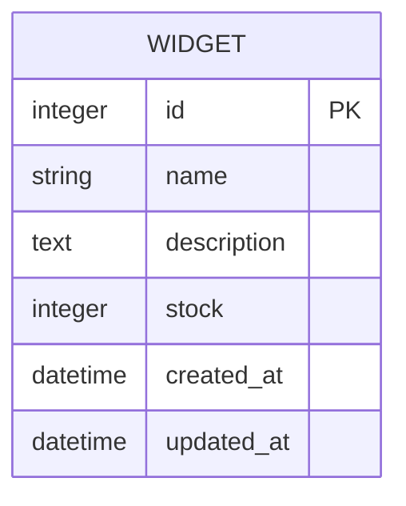
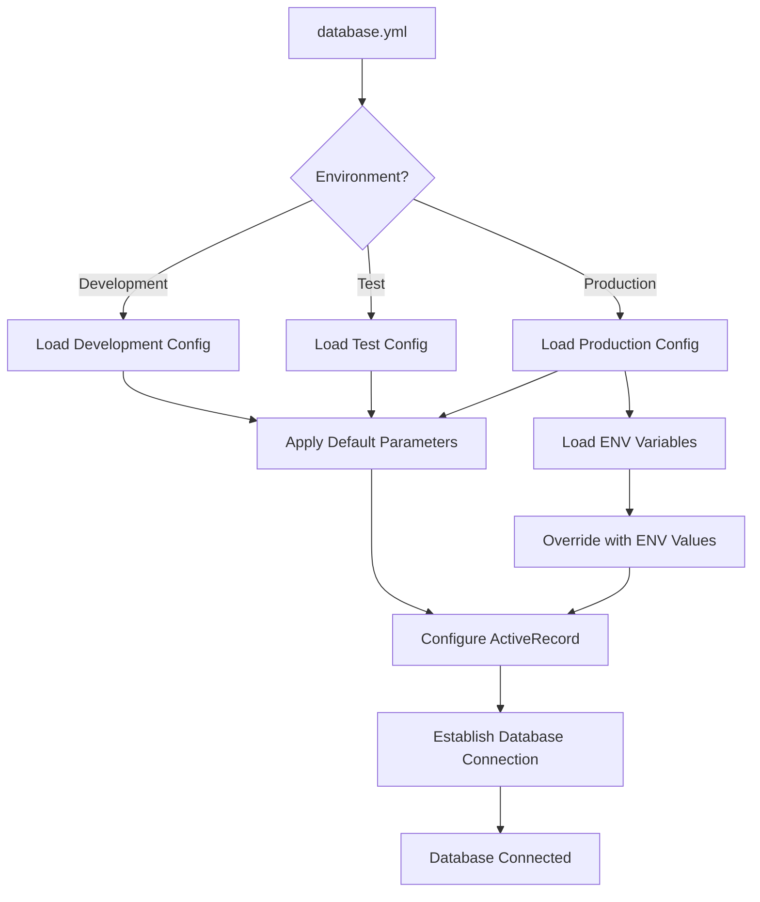
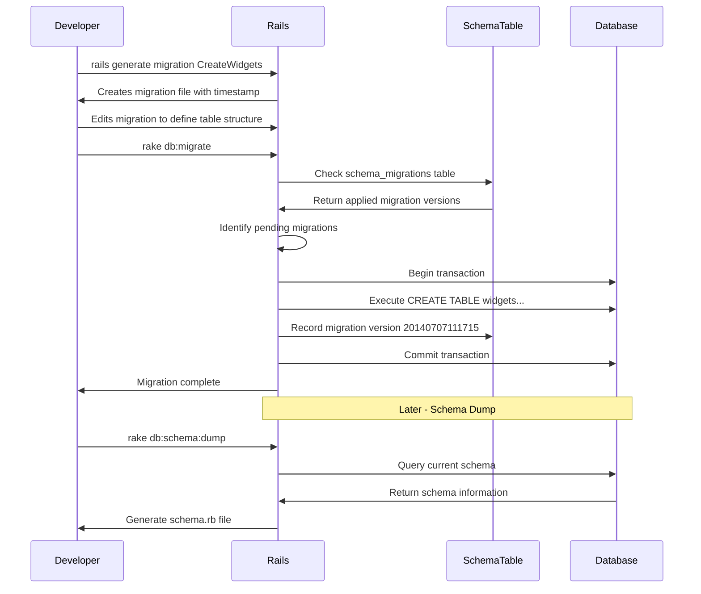
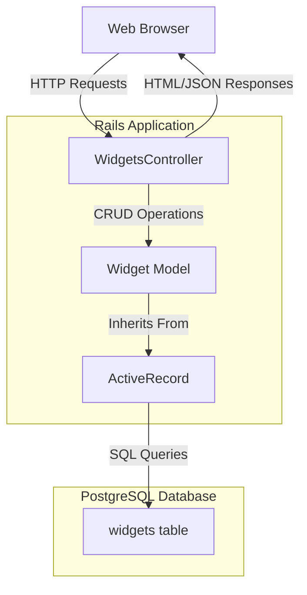

# PostgreSQL Database Architecture in Ruby Demo

## PostgreSQL Database Architecture in Ruby Demo

The Ruby Demo application implements a PostgreSQL database architecture as the foundation for its widget management functionality. The database serves as the persistent storage layer for widget entities, enabling CRUD operations through a well-structured Rails application. PostgreSQL was chosen as the database management system, providing robust relational database capabilities with advanced features like complex queries, transactions, and data integrity constraints.

The database architecture follows Rails conventions with a clear separation between the schema definition, migration scripts, and model classes. The core of this architecture is the `widgets` table, which stores essential information about each widget including name, description, and stock quantity. This table is defined through migrations and represented in the application through the Widget ActiveRecord model.

The PostgreSQL implementation leverages several key features of the database system:

1. **Extension support**: The schema explicitly enables PostgreSQL extensions as needed
2. **Strong data typing**: Columns are defined with appropriate data types (string, text, integer)
3. **Timestamp tracking**: Automatic creation and update timestamps are included
4. **Connection pooling**: Configured in database.yml to optimize database connections

This architecture provides a solid foundation for the widget management functionality while maintaining flexibility for future enhancements through additional migrations.

## ActiveRecord ORM Implementation

The Ruby Demo application employs ActiveRecord as its Object-Relational Mapping (ORM) layer, creating a seamless bridge between the object-oriented Ruby code and the relational PostgreSQL database. This implementation follows the "convention over configuration" principle that Rails is known for, minimizing the amount of explicit code required to interact with the database.

The Widget model (`app/models/widget.rb`) exemplifies the power of ActiveRecord's minimalist approach. Despite containing only a single line of code (`class Widget < ActiveRecord::Base; end`), it inherits a comprehensive set of capabilities:

1. **Automatic mapping**: The class maps to the `widgets` table without explicit configuration
2. **CRUD operations**: Methods like `create`, `find`, `update`, and `destroy` are available
3. **Query interface**: Complex queries can be constructed using methods like `where`, `order`, and `limit`
4. **Relationship management**: Though not used in this simple example, ActiveRecord provides association methods
5. **Validation capabilities**: Data integrity can be enforced at the model level

The ORM implementation abstracts away the complexities of SQL generation, parameter binding, and result set processing. This allows developers to work with Ruby objects throughout the application while ActiveRecord handles the translation to and from SQL queries. For example, creating a new widget is as simple as `Widget.create(name: "Example", description: "A sample widget", stock: 10)` rather than constructing and executing a SQL INSERT statement.

The schema information from the database is automatically reflected in the Widget model at runtime, making the attributes accessible as Ruby object properties without explicit property definitions. This introspection-based approach reduces code duplication and ensures the model stays in sync with the database schema.

## Widget Data Model

The Widget data model represents the core entity in the Ruby Demo application, defining the structure for storing widget information in the PostgreSQL database.



The diagram illustrates the Widget entity structure as defined in the database schema. Each widget has the following attributes:

- **id**: An auto-incrementing primary key that uniquely identifies each widget
- **name**: A string field storing the widget's name or title
- **description**: A text field allowing for longer, detailed descriptions of the widget
- **stock**: An integer representing the quantity of widgets available in inventory
- **created_at**: A timestamp automatically set when a widget record is created
- **updated_at**: A timestamp automatically updated whenever a widget record is modified

This data model is implemented through the `create_widgets` migration and reflected in the `schema.rb` file. The structure supports the basic widget management functionality while providing timestamp fields for auditing purposes. The model is intentionally simple for demonstration purposes but could be extended with additional attributes or relationships to other entities as the application grows.

The PostgreSQL database enforces appropriate data types for each field, ensuring data integrity at the database level. The ActiveRecord ORM then maps these database columns to Ruby object attributes, allowing seamless interaction with widget data throughout the application.

## Database Configuration Across Environments

The Ruby Demo application implements a sophisticated database configuration strategy that adapts to different environments while maintaining consistent connection behavior. This approach is defined in the `database.yml` file, which uses YAML's inheritance capabilities to minimize redundancy while customizing settings for each environment.

The configuration follows a three-tier environment structure:

1. **Development Environment**: Configured for local development with sensible defaults. The database name is set to `ruby-getting-started_development`, and connection parameters like host and port can be easily customized. This environment prioritizes developer convenience and debugging capabilities.

2. **Test Environment**: Specifically tuned for automated testing with a separate database (`ruby-getting-started_test`). Notable differences include explicit host (`postgres`) and username (`postgres`) settings to support CI/CD integration. This environment is designed to be completely isolated from development data and is recreated from scratch during test runs.

3. **Production Environment**: Optimized for security and performance in deployed scenarios. Sensitive information like the database password is retrieved from environment variables (`ENV['RUBY-GETTING-STARTED_DATABASE_PASSWORD']`) rather than being hardcoded. This environment is configured to support higher loads with appropriate connection pool settings.

The configuration leverages YAML anchors and references (using `&default` and `<<: *default`) to define common settings once and inherit them across environments. This DRY approach ensures consistency for parameters like adapter type (`postgresql`), encoding (`unicode`), and connection pool size (`5`).

Additional PostgreSQL-specific options are documented in comments, providing guidance for advanced configuration scenarios such as schema search paths and log levels. The file also includes comprehensive instructions for setting up PostgreSQL connections across different operating systems and deployment platforms.

This environment-specific configuration approach allows the application to seamlessly transition between development, testing, and production contexts without code changes, following the principles of twelve-factor app methodology for configuration management.

## Database Environment Configuration Flow

The following diagram illustrates how database configuration parameters are loaded and applied across different application environments in the Ruby Demo application.



The configuration flow begins with the `database.yml` file, which serves as the central repository for all database connection parameters. When the application starts, Rails determines the current environment (development, test, or production) and loads the corresponding section from the configuration file.

Each environment inherits common parameters from the default configuration block, ensuring consistency across environments. These parameters include the adapter type (PostgreSQL), encoding settings, and connection pool size.

For the production environment, an additional step occurs where environment variables are loaded and used to override sensitive configuration values like database passwords. This security practice prevents credentials from being stored in the codebase.

Once all configuration parameters are resolved, Rails configures the ActiveRecord ORM with these settings. ActiveRecord then establishes the actual database connection using the PostgreSQL adapter.

The connection process includes several internal steps:
1. Parameter validation
2. Driver initialization
3. Connection attempt with retry logic
4. Connection pool setup
5. Schema verification

This configuration flow ensures that the application connects to the appropriate database with the correct parameters for each environment while maintaining security best practices for credential management.

## Database Migration Strategy

The Ruby Demo application employs Rails migrations as a version control system for database schema changes. This approach treats database schema as code, allowing for systematic evolution of the data structure while maintaining consistency across environments and team members.

The migration strategy centers around discrete, versioned migration files that represent incremental changes to the database schema. Each migration is timestamped (e.g., `20140707111715_create_widgets.rb`), providing a chronological order for execution and a unique identifier for tracking applied migrations.

The `CreateWidgets` migration exemplifies this approach by defining both the structure for the new `widgets` table and implicitly providing the means to revert the change if needed. The migration uses Rails' DSL (Domain Specific Language) to express database operations in Ruby code rather than raw SQL:

```ruby
def change
  create_table :widgets do |t|
    t.string :name
    t.text :description
    t.integer :stock
    t.timestamps
  end
end
```

This `change` method is bidirectional - Rails can automatically determine how to reverse the operation when rolling back. For more complex scenarios, separate `up` and `down` methods would be defined to explicitly control the migration and rollback processes.

The migration strategy provides several key benefits:

1. **Version control**: Each schema change is tracked and versioned
2. **Team synchronization**: Developers can apply the same changes in sequence
3. **Environment parity**: Development, test, and production environments follow the same schema evolution
4. **Rollback capability**: Changes can be undone if problems are discovered
5. **Database agnosticism**: Migrations use database-agnostic Ruby code that Rails translates to appropriate SQL

Rails tracks applied migrations in a special `schema_migrations` table, storing the version number of each executed migration. This allows the framework to determine which migrations need to be applied when updating an existing database.

For the Ruby Demo application, this migration strategy provides a solid foundation for evolving the database schema as requirements change, while maintaining a clear history of how the structure developed over time.

## Migration Lifecycle

The following sequence diagram illustrates the lifecycle of database migrations in the Ruby Demo application, showing how they are created, executed, and tracked.



The migration lifecycle begins when a developer generates a new migration using the Rails generator. This creates a timestamped Ruby file with a skeleton migration class. The developer then defines the schema changes within this file, such as creating the widgets table with specific columns.

When the migration is executed via `rake db:migrate`, Rails first checks the `schema_migrations` table to determine which migrations have already been applied. It identifies pending migrations by comparing the files in the `db/migrate` directory with the recorded versions.

For each pending migration, Rails:
1. Begins a database transaction for safety
2. Executes the migration's `change` method (or `up` method for older migrations)
3. Records the migration version in the `schema_migrations` table
4. Commits the transaction

This process ensures that migrations are applied exactly once and in the correct order. If an error occurs during migration, the transaction is rolled back, leaving the database in its previous state.

After migrations are applied, Rails can generate a schema dump (`schema.rb`) that represents the current state of the database. This file serves as the authoritative definition of the database structure and can be used to recreate the schema without running individual migrations.

The migration lifecycle also supports rollbacks (`rake db:rollback`), which reverse the most recent migration by calling its `down` method or reversing the `change` method. This allows developers to correct mistakes or make adjustments to recent schema changes.

## Seed Data Implementation

The Ruby Demo application implements a database seeding approach that enables populating the database with initial or sample data. This functionality is centered around the `db/seeds.rb` file, which serves as a central script for defining seed records that should be created when setting up a fresh environment.

While the current implementation of `seeds.rb` in the Ruby Demo is minimal and contains only commented examples, it establishes the pattern for how seed data should be structured. The file demonstrates two approaches to creating seed data:

1. **Batch creation** with an array of hashes:
   ```ruby
   cities = City.create([{ name: 'Chicago' }, { name: 'Copenhagen' }])
   ```

2. **Individual creation** with associations:
   ```ruby
   Mayor.create(name: 'Emanuel', city: cities.first)
   ```

These examples illustrate how seed data can include not just standalone records but also related entities with proper associations.

For the Widget model, a practical implementation might look like:

```ruby
Widget.create([
  { name: 'Basic Widget', description: 'A simple widget for demonstration', stock: 100 },
  { name: 'Advanced Widget', description: 'A more complex widget with additional features', stock: 50 },
  { name: 'Premium Widget', description: 'Our top-of-the-line widget offering', stock: 25 }
])
```

The seeding mechanism is designed to be idempotent, meaning it should be safe to run multiple times without creating duplicate data. This is typically achieved by either checking for existing records before creation or by using the `find_or_create_by` method.

Seed data serves several important purposes in the application lifecycle:

1. **Development environment setup**: Provides realistic data for developers to work with
2. **Testing**: Creates a known baseline state for manual testing
3. **Demonstration**: Populates the application with examples for showcasing functionality
4. **Production initialization**: Establishes required reference data in production environments

The seed data is loaded using the `rake db:seed` command, which executes the `seeds.rb` file. It can also be run as part of a complete database setup using `rake db:setup`, which creates the database, loads the schema, and runs the seeds in sequence.

## Security Considerations in Database Configuration

The Ruby Demo application implements several security best practices in its database configuration, particularly focusing on the protection of sensitive credentials. The approach differs significantly between development and production environments, with production implementing stricter security measures.

The most notable security practice is the use of environment variables for sensitive information in production. Rather than hardcoding database credentials in the configuration file, the application retrieves the database password from an environment variable:

```ruby
password: <%= ENV['RUBY-GETTING-STARTED_DATABASE_PASSWORD'] %>
```

This approach offers several security advantages:

1. **Separation of configuration from code**: Sensitive information is not stored in version control
2. **Environment-specific secrets**: Different credentials can be used across environments
3. **Reduced exposure**: Credentials are not visible in configuration files that might be accessed by multiple developers
4. **Compliance support**: Helps meet security requirements that mandate credential isolation

The configuration file also includes detailed comments explaining the security implications of storing credentials in source code and provides guidance on proper credential management:

```
# As with config/secrets.yml, you never want to store sensitive information,
# like your database password, in your source code. If your source code is
# ever seen by anyone, they now have access to your database.
```

For deployment platforms like Heroku, the application supports using a complete database URL through the `DATABASE_URL` environment variable, which encapsulates all connection parameters in a single secure variable.

The development and test environments use simpler configuration approaches, with the option to specify credentials directly in the configuration file. This trade-off acknowledges the different security requirements between production and development contexts, prioritizing developer convenience in non-production environments.

Additional security considerations in the database configuration include:

1. **Connection pooling**: Properly configured to prevent connection exhaustion attacks
2. **Minimal privileges**: The configuration supports using role-based database users with appropriate permission levels
3. **Host restrictions**: The ability to specify connection hosts, allowing for network-level security controls

These security practices align with industry standards for protecting database credentials and connections, particularly in production environments where data protection is critical.

## Database Interaction Architecture

The following diagram illustrates the relationship between controllers, the Widget model, and the PostgreSQL database in the Ruby Demo application architecture.



The database interaction architecture follows a classic Model-View-Controller (MVC) pattern with ActiveRecord serving as the ORM layer between the application code and the PostgreSQL database.

At the core of this architecture is the Widget model, which inherits from ActiveRecord::Base. Despite its minimal implementation (just one line of code), this model provides a rich set of capabilities for interacting with the database:

1. **Data Access**: The model translates Ruby method calls into SQL queries
2. **Data Manipulation**: Create, read, update, and delete operations are handled through model methods
3. **Query Building**: Complex queries can be constructed using chainable methods
4. **Type Conversion**: Database types are automatically converted to appropriate Ruby types

When a request arrives at the WidgetsController, it uses the Widget model to perform the necessary database operations. For example, a request to list all widgets might trigger `Widget.all()`, which ActiveRecord translates into `SELECT * FROM widgets` and executes against the PostgreSQL database.

The architecture maintains a clear separation of concerns:
- Controllers handle HTTP requests and responses
- Models encapsulate business logic and data access
- ActiveRecord manages database connections and SQL generation
- PostgreSQL executes queries and stores persistent data

This separation provides several benefits:
- **Maintainability**: Changes to database structure only require updates to migrations, not to controllers
- **Testability**: Models can be tested independently of the web interface
- **Security**: ActiveRecord helps prevent SQL injection by parameterizing queries
- **Performance**: Connection pooling and query optimization are handled by ActiveRecord

The database interaction architecture is designed to be both developer-friendly and efficient, abstracting away the complexities of direct database access while maintaining flexibility for complex data operations when needed.

## Schema Management and Evolution

The Ruby Demo application employs a robust approach to schema management centered around the `schema.rb` file. This file serves as the authoritative source for the database structure and plays a crucial role in maintaining database consistency across environments.

The `schema.rb` file is automatically generated by Rails based on the current state of the database after migrations have been applied. It contains a complete representation of the database schema expressed in Ruby code:

```ruby
ActiveRecord::Schema.define(version: 20140707111715) do
  enable_extension "plpgsql"

  create_table "widgets", force: true do |t|
    t.string   "name"
    t.text     "description"
    t.integer  "stock"
    t.datetime "created_at"
    t.datetime "updated_at"
  end
end
```

This representation includes several key elements:
1. **Schema version**: The timestamp of the most recently applied migration
2. **Database extensions**: PostgreSQL-specific extensions that are enabled
3. **Table definitions**: Complete structure of all tables including columns and types
4. **Indexes**: Any database indexes defined on the tables (though none are present in this example)

The schema management approach follows a "migrations for changes, schema for state" philosophy. While migrations track the evolutionary path of the database structure, the schema file captures the current end state. This dual approach provides both historical context and a definitive current reference.

When setting up a new environment or instance of the application, developers have two options:
1. **Run all migrations sequentially** (`rake db:migrate`): This applies each change in order, following the historical evolution
2. **Load the schema directly** (`rake db:schema:load`): This creates the database structure in one operation based on the schema.rb file

The latter approach is significantly faster and more reliable for setting up new environments, as it avoids potential issues with complex migration sequences. As noted in the schema.rb file comments:

> If you need to create the application database on another system, you should be using db:schema:load, not running all the migrations from scratch. The latter is a flawed and unsustainable approach (the more migrations you'll amass, the slower it'll run and the greater likelihood for issues).

The schema file is designed to be database-agnostic, using Ruby code rather than raw SQL. This allows the same schema definition to work across different database systems, although the Ruby Demo application is specifically configured for PostgreSQL.

For schema evolution, the application follows Rails conventions:
1. Generate a new migration for each structural change
2. Apply the migration to update the database
3. Allow Rails to regenerate the schema.rb file to reflect the new state
4. Commit both the migration and updated schema to version control

This disciplined approach ensures that the database schema evolves in a controlled, versioned manner while maintaining a clear and authoritative reference for the current structure.

[Generated by the Sage AI expert workbench: 2025-03-29 18:36:01  https://sage-tech.ai/workbench]: #