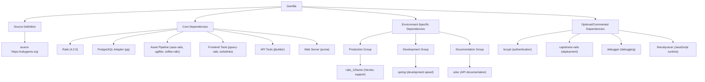
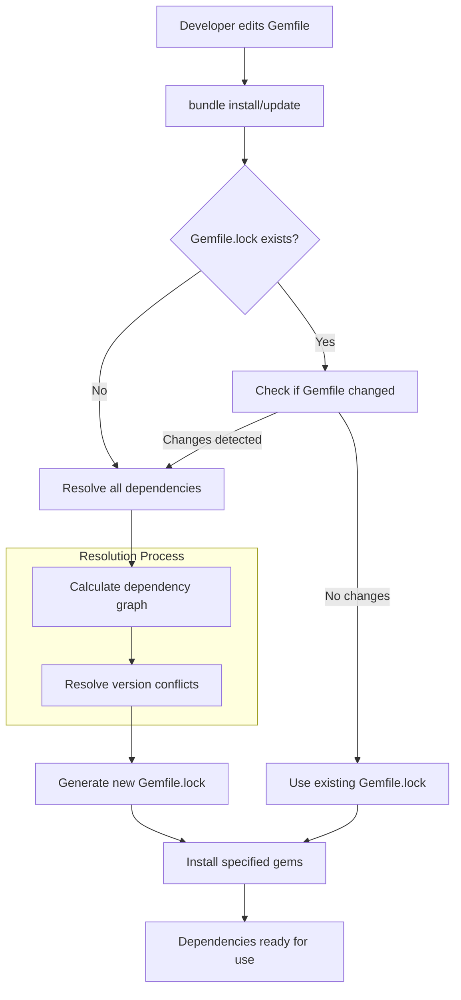
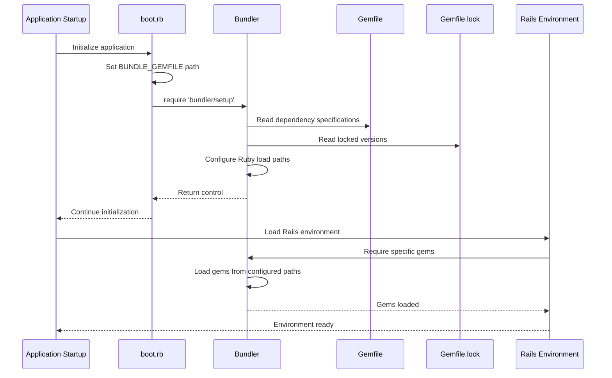
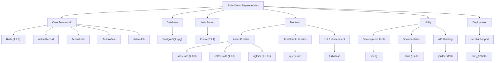

# Dependency Management in Ruby Demo

## Introduction to Bundler in Ruby Applications

Bundler represents the cornerstone of dependency management in modern Ruby applications, serving as the de facto standard for managing gem dependencies. In the context of the Ruby Demo application, Bundler provides a robust mechanism for specifying, installing, and loading the exact gems required by the application. This ensures consistent behavior across different environments—development, testing, and production.

At its core, Bundler solves the "dependency hell" problem by creating an isolated environment where gems with specific versions can coexist without conflict. It achieves this through a two-file system: the Gemfile, which declares dependencies with optional version constraints, and the Gemfile.lock, which records the exact versions that satisfy these constraints. This approach ensures that the same gem versions are used consistently, regardless of where the application is deployed.

In Ruby Demo, Bundler's integration begins at the application's boot process, where boot.rb establishes the path to the Gemfile and loads the bundler/setup module. This critical step configures Ruby's load paths to include only the gems specified in the Gemfile, effectively isolating the application from system-wide gems that might cause conflicts or unexpected behavior.

## The Gemfile: Declaring Dependencies

The Gemfile in Ruby Demo serves as the authoritative declaration of all gem dependencies required by the application. It employs a domain-specific language (DSL) that allows for precise specification of gems, their version constraints, and the environments in which they should be loaded.

The Ruby Demo Gemfile begins with the source directive pointing to RubyGems.org, the central repository for Ruby gems. It then specifies Rails 4.2.0 as the core framework, establishing the foundation upon which the application is built. The choice of PostgreSQL as the database adapter (`gem 'pg'`) indicates a production-oriented approach, eschewing the development-friendly SQLite in favor of a more robust solution.

The Gemfile organizes dependencies into logical groups. Core dependencies like Rails, PostgreSQL, and Puma are specified at the top level, making them available in all environments. Environment-specific gems are grouped accordingly—for instance, the `rails_12factor` gem is explicitly limited to the production environment, as it's specifically required for Heroku deployments but unnecessary elsewhere. Similarly, development tools like Spring are confined to the development environment to avoid bloating the production deployment.

The Gemfile also contains commented-out gems like bcrypt and Capistrano, suggesting potential future functionality or deployment strategies that have been considered but not yet implemented. This practice provides a roadmap for future development while keeping the current dependency set lean.

## Gemfile Structure and Organization



The diagram above illustrates the hierarchical organization of the Ruby Demo's Gemfile. The structure follows best practices by clearly separating core dependencies from environment-specific ones. This organization facilitates maintenance and ensures that gems are only loaded when needed.

Core dependencies form the foundation of the application, including the Rails framework, database adapter, and essential frontend tools. These gems are loaded in all environments as they're fundamental to the application's functionality.

Environment-specific dependencies are grouped to optimize the application for different contexts. For example, the rails_12factor gem is only needed in production (specifically for Heroku deployment), while Spring is only useful during development to speed up the development cycle.

The commented-out gems represent optional functionality that could be enabled if needed. This approach keeps the dependency list lean while documenting potential extensions. For instance, bcrypt could be uncommented when implementing authentication features, and Capistrano could be enabled when setting up automated deployment processes.

## The Gemfile.lock: Ensuring Consistency

The Gemfile.lock file in Ruby Demo serves as a critical component in ensuring dependency consistency across all environments. While the Gemfile specifies what gems the application requires with potentially flexible version constraints, the Gemfile.lock records the exact versions of all gems—both direct dependencies and their transitive dependencies—that were resolved during the initial bundle installation.

This locked dependency state provides several key benefits. First, it guarantees that every developer working on the project uses identical gem versions, eliminating the "works on my machine" problem. Second, it ensures that staging and production environments mirror the development environment exactly, reducing environment-specific bugs. Third, it provides a historical record of the dependency state, allowing for forensic analysis if issues arise.

In Ruby Demo's Gemfile.lock, we see Rails 4.2.0 specified with all of its component gems (actionmailer, actionpack, etc.) locked to their corresponding versions. The PostgreSQL adapter is locked to version 0.17.1, and Puma to 2.9.1. Even transitive dependencies like nokogiri (1.6.6.2) and loofah (2.0.2) are precisely specified, ensuring that every installation of the application uses these exact versions.

When a developer runs `bundle install` on a project with an existing Gemfile.lock, Bundler will install the exact versions specified in the lock file, regardless of newer versions that might be available. This behavior can only be overridden explicitly with commands like `bundle update`, which recalculates the dependency graph and updates the lock file accordingly.

The Gemfile.lock should always be committed to version control to ensure this consistency across all environments and developers. This practice is followed in Ruby Demo, where the Gemfile.lock is tracked alongside the application code.

## Dependency Resolution Process



The diagram above illustrates Bundler's dependency resolution process, which transforms the high-level specifications in the Gemfile into the concrete, version-locked dependency tree recorded in Gemfile.lock.

When a developer runs `bundle install` for the first time or after modifying the Gemfile, Bundler initiates a complex resolution process. It begins by parsing the Gemfile to understand the direct dependencies and their constraints. Then, it recursively examines each gem's own dependencies, building a complete dependency graph.

The resolution algorithm attempts to find a set of gem versions that satisfies all constraints simultaneously. This is a non-trivial problem, especially with complex applications that have hundreds of transitive dependencies. Bundler employs a backtracking algorithm that tries different version combinations until it finds a valid solution or determines that no solution exists.

Once a valid set of gem versions is determined, Bundler generates the Gemfile.lock file, recording the exact version of every gem in the dependency tree. This includes not only the gems explicitly mentioned in the Gemfile but also all of their dependencies, creating a complete snapshot of the application's dependency state.

In subsequent runs, if the Gemfile hasn't changed and the Gemfile.lock exists, Bundler will simply use the locked versions without performing the expensive resolution process again. This optimization significantly speeds up the installation process in established projects.

## Boot Process and Dependency Loading

The boot.rb file in Ruby Demo plays a pivotal role in initializing the application's dependency environment. This small but critical file serves as the entry point for configuring Bundler before the Rails framework itself is loaded.

The boot process begins by setting the `BUNDLE_GEMFILE` environment variable to point to the application's Gemfile. This is done using a conditional assignment operator (`||=`), which only sets the variable if it's not already defined. This approach allows for flexibility in deployment scenarios where the Gemfile path might need to be customized.

```ruby
ENV['BUNDLE_GEMFILE'] ||= File.expand_path('../../Gemfile', __FILE__)
```

Once the Gemfile path is established, boot.rb conditionally requires 'bundler/setup' if the Gemfile exists. This step is crucial as it modifies Ruby's load path to include only the gems specified in the Gemfile, effectively isolating the application from system-wide gems.

```ruby
require 'bundler/setup' if File.exist?(ENV['BUNDLE_GEMFILE'])
```

The `bundler/setup` module doesn't actually load any gems; it only configures the load paths. The actual loading of gems happens later in the boot process, typically through explicit `require` statements or through Rails' autoloading mechanisms.

This two-phase approach—configuring load paths first, then loading gems as needed—provides several advantages. It allows for fine-grained control over which gems are loaded and when, reducing memory usage and startup time. It also ensures that the correct versions of gems are loaded, even if conflicting versions are installed system-wide.

In production environments, this process is often optimized further by preloading all gems during application startup, reducing the overhead of dynamically loading gems during request processing.

## Application Boot Sequence



This sequence diagram illustrates the boot process of the Ruby Demo application, focusing on how dependencies are loaded during startup. The process begins when the application is initiated, typically through a command like `rails server` or when the application receives its first request in a production environment.

The boot.rb file is one of the first files executed in this process. It sets the `BUNDLE_GEMFILE` environment variable to point to the application's Gemfile, establishing where Bundler should look for dependency specifications.

Next, boot.rb requires the 'bundler/setup' module, which initiates Bundler's configuration process. Bundler reads both the Gemfile (to understand what gems are needed) and the Gemfile.lock (to determine the exact versions to use). It then configures Ruby's load paths to include only the specified gems at their locked versions.

After Bundler has configured the load paths, control returns to the application startup process, which proceeds to load the Rails environment. As various parts of Rails are initialized, they require specific gems as needed. Thanks to Bundler's earlier configuration of the load paths, these require statements load the correct versions of each gem.

This lazy-loading approach is efficient, as gems are only loaded when they're actually needed. However, in production environments, many Rails applications use eager loading to preload all gems during startup, trading a longer startup time for faster request processing.

The entire process ensures that the application runs with a consistent set of dependencies, exactly matching the versions specified in the Gemfile.lock, regardless of what other gems might be installed on the system.

## Environment-Specific Dependencies

Ruby Demo employs a sophisticated approach to managing dependencies across different environments—development, test, and production—ensuring that each environment has precisely the gems it needs without unnecessary bloat.

In the development environment, Ruby Demo includes tools that enhance the developer experience. The Spring gem, for instance, is specified exclusively for development:

```ruby
gem 'spring', group: :development
```

Spring speeds up development by keeping the application running in the background, eliminating the need to restart the server after each code change. This significantly improves the development workflow but would be unnecessary and potentially harmful in production.

For production, Ruby Demo includes the rails_12factor gem:

```ruby
gem 'rails_12factor', group: :production
```

This gem is specifically required for Heroku deployments, as it configures the application to work with Heroku's architecture by serving static assets and routing logs to stdout. Including it only in production ensures that these behaviors don't affect development or testing environments.

Documentation tools are similarly isolated:

```ruby
gem 'sdoc', '~> 0.4.0', group: :doc
```

The sdoc gem generates API documentation but is only needed when explicitly generating docs, not during normal application operation in any environment.

This environment-specific approach extends to database configurations as well. While the pg gem (PostgreSQL adapter) is used across all environments in Ruby Demo, many Rails applications use SQLite for development and testing while using PostgreSQL only in production. This pattern allows developers to work without setting up a full PostgreSQL server locally.

Ruby Demo's approach to environment-specific dependencies demonstrates a mature understanding of the different requirements across the application lifecycle. By loading only what's needed in each context, it optimizes for both developer productivity and production performance.

## Core Application Dependencies

Ruby Demo's functionality is built upon a carefully selected set of core dependencies that provide the foundation for its widget management capabilities. These dependencies can be categorized into several functional areas:

1. **Framework**: Rails 4.2.0 serves as the application's backbone, providing the MVC architecture, routing, ORM, and numerous utilities that power the application's core functionality. The specific version choice (4.2.0) indicates a balance between stability and modern features, though it's worth noting this version is now outdated.

2. **Database Connectivity**: The PostgreSQL adapter (`pg` gem) enables the application to interact with PostgreSQL databases. This choice reflects a production-oriented mindset, as PostgreSQL offers advanced features, reliability, and scalability compared to alternatives like SQLite.

3. **Web Server**: Puma (version 2.9.1) provides the HTTP server that handles incoming requests. As a concurrent server, Puma can handle multiple requests simultaneously through a thread pool, making it well-suited for production deployments where request throughput is important.

4. **Asset Pipeline**: Several gems manage the application's frontend assets:
   - `sass-rails` for SCSS preprocessing
   - `coffee-rails` for CoffeeScript compilation
   - `uglifier` for JavaScript minification
   - `jquery-rails` for jQuery integration

5. **User Experience Enhancement**: Turbolinks speeds up page loads by replacing only the body content when navigating between pages, rather than performing full page reloads. This creates a more responsive user experience, particularly important for a widget management application where users may navigate between many widgets.

6. **API Support**: Jbuilder facilitates JSON generation for APIs, suggesting that Ruby Demo may expose widget data through RESTful endpoints in addition to the web interface.

7. **Heroku Deployment**: The `rails_12factor` gem configures the application for Heroku's platform, handling static asset serving and log routing. This indicates that Ruby Demo is designed for cloud deployment, specifically on Heroku's PaaS offering.

These core dependencies work in concert to provide the complete functionality of the Ruby Demo application. The selection reflects a balance between development convenience, production readiness, and deployment flexibility, with particular attention to cloud deployment scenarios.

## Dependency Categorization



This hierarchical diagram categorizes Ruby Demo's dependencies by their functional purpose within the application. The organization reveals the architectural decisions and priorities embedded in the dependency choices.

At the top level, dependencies are grouped into six major categories: Core Framework, Database, Web Server, Frontend, Utility, and Deployment. This categorization helps in understanding the role each gem plays in the overall application architecture.

The Core Framework category is dominated by Rails and its component libraries, which provide the fundamental structure and functionality of the application. The specific version (4.2.0) represents a deliberate choice that affects compatibility with other gems.

The Database category contains only the PostgreSQL adapter, reflecting a focused approach to database connectivity. This simplicity contrasts with applications that might support multiple database backends.

The Frontend category is further subdivided into Asset Pipeline, JavaScript Libraries, and UX Enhancement. This detailed breakdown highlights the importance of frontend technologies in the Ruby Demo application, with multiple gems dedicated to asset processing and user experience optimization.

The Utility category encompasses tools that support development, documentation, and API building but aren't directly part of the application's runtime functionality. These gems enhance the development process and extend the application's capabilities.

Finally, the Deployment category contains the rails_12factor gem, which specifically supports deployment to Heroku. This indicates a clear deployment strategy for the application, optimized for Heroku's platform-as-a-service offering.

This categorization provides a comprehensive view of how dependencies contribute to different aspects of the Ruby Demo application, revealing both the technical architecture and the operational considerations that influenced its design.

## Transitive Dependencies and Version Constraints

In the Ruby Demo application, as with any modern Ruby application, the management of transitive dependencies—dependencies of dependencies—is a critical aspect of ensuring stability and security. The Gemfile.lock reveals a complex web of interdependencies, with direct dependencies like Rails bringing in dozens of transitive dependencies.

Version constraints in the Gemfile play a crucial role in balancing stability against currency. Ruby Demo employs several types of constraints:

1. **Exact Version Constraints**: For Rails, an exact version (4.2.0) is specified, ensuring complete stability but potentially missing security updates:
   ```ruby
   gem 'rails', '4.2.0'
   ```

2. **Pessimistic Version Constraints**: For gems like sass-rails and jbuilder, the "twiddle-wakka" operator (~>) is used, allowing patch-level updates but not minor or major version changes:
   ```ruby
   gem 'sass-rails', '~> 4.0.3'
   gem 'jbuilder', '~> 2.0'
   ```
   This approach strikes a balance between stability and security, allowing bug fixes but avoiding potentially breaking changes.

3. **Minimum Version Constraints**: For uglifier, only a minimum version is specified, allowing any version at or above that minimum:
   ```ruby
   gem 'uglifier', '>= 1.3.0'
   ```
   This approach prioritizes getting security updates but risks compatibility issues if the gem introduces breaking changes.

4. **Unconstrained Dependencies**: Some gems like pg and turbolinks have no version constraints, allowing Bundler to select any compatible version. This maximizes flexibility but can lead to unexpected behavior if a new version introduces breaking changes.

Bundler resolves this complex dependency graph by finding a set of gem versions that satisfies all constraints simultaneously. When conflicts arise—for instance, if two gems depend on different versions of a shared dependency—Bundler attempts to find a version that satisfies both constraints or raises an error if no solution exists.

The resulting Gemfile.lock records the exact versions of all gems, both direct and transitive, that were resolved during bundle installation. This locked state ensures that all environments use identical gem versions, preventing the "works on my machine" problem and providing a stable foundation for development, testing, and production.

In Ruby Demo, this resolution process has successfully navigated the complex dependencies of Rails 4.2.0 and its ecosystem, producing a stable set of gem versions that work together harmoniously. However, the age of some dependencies (particularly Rails 4.2.0 itself) suggests that security updates may be needed, highlighting the ongoing nature of dependency management.

## Dependency Management Best Practices

Effective dependency management is crucial for maintaining the health, security, and performance of Ruby applications. Based on the analysis of Ruby Demo, several best practices emerge that are applicable to Ruby applications in general:

1. **Regular Security Audits**: Ruby Demo uses Rails 4.2.0, which is now outdated and potentially vulnerable. Regularly running tools like `bundle audit` can identify security vulnerabilities in dependencies. When vulnerabilities are found, dependencies should be promptly updated or patched.

2. **Strategic Version Constraints**: Different types of version constraints serve different purposes:
   - Use exact versions (`gem 'rails', '4.2.0'`) for core dependencies where stability is paramount
   - Use pessimistic constraints (`gem 'sass-rails', '~> 4.0.3'`) for most gems to allow patch-level updates
   - Use minimum version constraints (`gem 'uglifier', '>= 1.3.0'`) only for well-maintained gems with strong backward compatibility

3. **Environment-Specific Grouping**: Follow Ruby Demo's practice of grouping gems by environment to minimize the dependency footprint in each context:
   ```ruby
   gem 'spring', group: :development
   gem 'rails_12factor', group: :production
   ```

4. **Dependency Pruning**: Regularly review dependencies and remove unused ones. Each dependency increases the application's attack surface and can slow down bundle installation and application boot time.

5. **Gemfile Organization**: Structure the Gemfile logically, with core dependencies at the top, followed by functional groups, and environment-specific gems. Add comments to explain non-obvious dependencies or version constraints.

6. **Lock File Maintenance**: Always commit the Gemfile.lock to version control to ensure consistency across environments. When updating dependencies, update them deliberately with `bundle update [gem]` rather than removing the lock file.

7. **Transitive Dependency Awareness**: Be mindful of the full dependency tree, not just direct dependencies. Tools like `bundle viz` can visualize the complete dependency graph, helping identify potential bloat or security concerns.

8. **Deployment Considerations**: Include deployment-specific gems like `rails_12factor` only in the environments where they're needed, and be explicit about their purpose through comments or documentation.

9. **Version Upgrade Strategy**: Develop a strategy for major version upgrades of core dependencies like Rails. These upgrades often require significant refactoring and should be planned carefully, with comprehensive testing to catch compatibility issues.

10. **Dependency Isolation**: Use tools like RVM, rbenv, or Docker to isolate project dependencies, preventing system-wide gem installations from interfering with specific project requirements.

By following these best practices, Ruby applications can maintain a healthy balance between staying current with security updates and maintaining stability, while keeping the dependency footprint manageable and well-organized.

[Generated by the Sage AI expert workbench: 2025-03-29 18:36:01  https://sage-tech.ai/workbench]: #