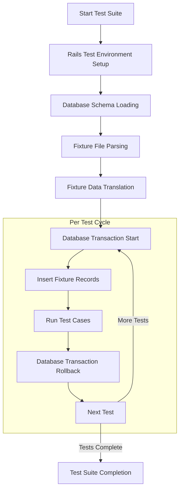
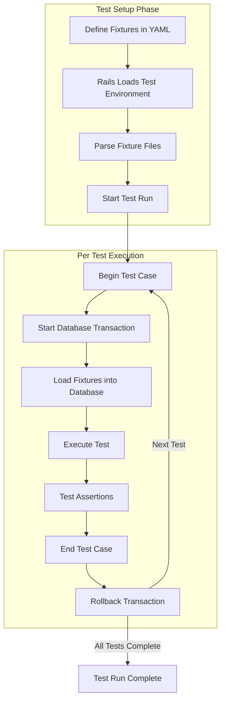
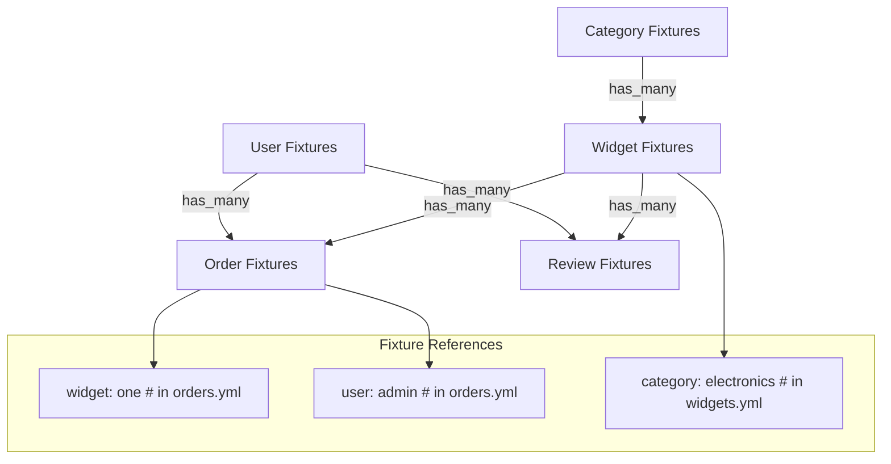

# Fixtures & Test Data in Rails Applications

## Introduction to Fixtures in Rails Testing

Fixtures are a fundamental component of the testing infrastructure in Ruby on Rails applications. They provide a mechanism for defining consistent, reusable test data that can be loaded into the test database before test execution. Fixtures serve as a baseline state for your application during testing, ensuring that tests run against a known, predictable dataset rather than relying on production data or generating random data for each test run.

In the Rails testing ecosystem, fixtures are YAML files that define records to be inserted into your test database. Each fixture file corresponds to a specific model in your application, and the data defined within these files is automatically translated into database records when your tests run. This approach ensures data consistency across test runs and simplifies the process of setting up test scenarios.

Fixtures are particularly valuable for integration and system tests where multiple components of your application need to interact with a consistent dataset. They provide a foundation for verifying that your application's behavior remains correct as you develop and refactor your code.

## Structure of YAML Fixtures

Rails fixtures are structured as YAML (YAML Ain't Markup Language) files, which offer a human-readable format for defining structured data. Each fixture file is named after the table it populates, using the pluralized form of the model name (e.g., `widgets.yml` for the `Widget` model).

Within a fixture file, each record is defined with a unique identifier (label) followed by a set of attribute-value pairs. The label serves as both a reference point for accessing the fixture in tests and as the basis for generating primary keys in the database.

For example, in the `widgets.yml` file:

```yaml
one:
  name: MyString
  description: MyText
  stock: 1

two:
  name: MyString
  description: MyText
  stock: 1
```

Here, `one` and `two` are labels for two distinct widget records. Each record has three attributes: `name`, `description`, and `stock`, with their respective values.

The YAML syntax allows for several advanced features:

1. **ERB embedding**: You can embed Ruby code using ERB tags (`<%= %>`) to generate dynamic values.
2. **YAML anchors and aliases**: For reusing common attribute sets across multiple records.
3. **References to other fixtures**: Using the `model_name(label)` syntax to establish associations.

Naming conventions are important in fixtures. By default, Rails uses the fixture label to generate a primary key value using a hash function. However, you can explicitly set the primary key by including it as an attribute.

## Fixture Loading Process



The fixture loading process is a critical part of the Rails test execution cycle. When you run your tests, Rails follows a systematic approach to ensure your test data is properly loaded and isolated between test runs.

First, Rails sets up the test environment and loads the database schema into your test database. It then parses all fixture files in your `test/fixtures` directory, translating the YAML definitions into model instances. Before each test, Rails starts a database transaction and inserts the fixture records into the database tables. This transaction provides isolation between tests, ensuring that changes made during one test don't affect others.

After each test completes, Rails rolls back the transaction, effectively resetting the database to its pre-test state. This transactional approach is efficient because it avoids the need to physically delete and re-insert records between tests, which would be much slower.

The fixture loading mechanism is highly optimized in Rails, using techniques like connection caching and bulk inserts to minimize the performance impact of setting up test data.

## Widget Fixtures Analysis

The `widgets.yml` fixture file in the Ruby Demo application provides test data for the Widget model. Let's analyze its structure and content:

```yaml
one:
  name: MyString
  description: MyText
  stock: 1

two:
  name: MyString
  description: MyText
  stock: 1
```

This fixture file defines two widget records, labeled `one` and `two`. Both records have identical attributes:
- `name`: A string value "MyString"
- `description`: A text value "MyText"
- `stock`: An integer value 1

The simplicity of this fixture suggests that the Widget model has a straightforward schema with these three fields. The identical values across both records indicate that the tests using these fixtures are likely focused on functionality rather than data-specific behavior.

This approach is common when the specific values of the attributes don't matter for the tests, only that the records exist. However, for more sophisticated testing scenarios, you might want to create fixtures with varied data to test different conditions and edge cases.

The absence of associations in these fixtures suggests that either the Widget model doesn't have relationships with other models, or those relationships aren't relevant to the tests using these fixtures.

## Widget Model and Fixture Relationship

```mermaid
erDiagram
    WIDGET_MODEL {
        integer id PK
        string name
        text description
        integer stock
        datetime created_at
        datetime updated_at
    }
    
    WIDGETS_FIXTURE {
        string label "one/two"
        string name "MyString"
        text description "MyText"
        integer stock 1
    }
    
    DATABASE_TABLE {
        integer id PK
        string name
        text description
        integer stock
        datetime created_at
        datetime updated_at
    }
    
    WIDGETS_FIXTURE --|> WIDGET_MODEL : "defines test data for"
    WIDGET_MODEL --|> DATABASE_TABLE : "maps to"
    WIDGETS_FIXTURE ..> DATABASE_TABLE : "populates during tests"
```

The diagram illustrates the relationship between the Widget model, its fixture data, and the underlying database table. The Widget model in the Ruby Demo application defines the structure and behavior of widgets, including validations, associations, and business logic.

The widgets fixture provides predefined test data that conforms to the Widget model's schema. When tests run, Rails loads this fixture data into the widgets table in the test database, creating records that can be used by the tests.

The Widget model likely includes attributes beyond those explicitly defined in the fixture. Rails automatically manages attributes like `id`, `created_at`, and `updated_at`, so they don't need to be specified in the fixture unless you want to override their default values.

The fixture data maps directly to the database columns, with Rails handling the type conversion between the YAML representation and the appropriate database types. For example, the `stock: 1` in the YAML file is converted to an integer in the database.

This tight integration between the model, fixture, and database table ensures that your test data accurately reflects your application's domain model, providing a reliable foundation for testing.

## Accessing Fixtures in Tests

Fixtures are automatically available in your test cases through Rails' fixture API. You can access fixture records using the fixture label as a method name on the model's fixture collection.

For example, to access the widget fixtures in a test:

```ruby
class WidgetTest < ActiveSupport::TestCase
  test "widget attributes" do
    # Access the 'one' fixture
    widget = widgets(:one)
    
    assert_equal "MyString", widget.name
    assert_equal "MyText", widget.description
    assert_equal 1, widget.stock
  end
end
```

Rails provides several methods for working with fixtures:

1. **Direct access by label**: `widgets(:one)` returns the Widget instance for the fixture labeled "one".
2. **Access all fixtures**: `widgets` returns an array of all Widget instances from the fixtures.
3. **Dynamic finders**: Methods like `find_by_name` work with fixture data just as they would with regular model instances.

Fixture identifiers (labels) are converted to primary key values using a hashing algorithm, ensuring consistency across test runs. You can also explicitly set the primary key in your fixtures if needed.

When working with associations, you can reference fixtures from other models:

```ruby
# In a hypothetical orders.yml
pending:
  widget: one  # References widgets(:one)
  quantity: 5
```

This creates a relationship between the `pending` order and the `one` widget, establishing the foreign key relationship in the database.

## Fixture Data Strategies

When designing fixtures for your Rails application, you can adopt different strategies depending on your testing needs:

1. **Minimal Fixtures**: Define only the essential records needed for basic functionality testing. This approach keeps your test suite lean and focused, making it easier to understand the purpose of each fixture. The `widgets.yml` file in the Ruby Demo application follows this strategy with just two simple records.

2. **Comprehensive Fixtures**: Create a rich dataset that covers various scenarios and edge cases. This approach is useful for integration tests and features that depend on specific data conditions.

3. **Domain-Specific Fixtures**: Organize fixtures around specific business domains or user stories, creating sets of related records that represent realistic scenarios.

4. **State-Based Fixtures**: Define fixtures that represent different states of your models (e.g., "active", "archived", "pending") to test state-dependent behavior.

The choice of strategy depends on several factors:

- **Test Isolation**: Minimal fixtures promote better test isolation, as tests are less likely to depend on unrelated data.
- **Test Readability**: Fixtures should make your tests more readable by clearly representing the test scenario.
- **Maintenance Burden**: More extensive fixtures require more maintenance when your schema changes.
- **Test Performance**: Loading large fixture sets can slow down your test suite.

For the Ruby Demo application, the minimal approach used in `widgets.yml` is appropriate for a simple demonstration application, focusing on the basic functionality without unnecessary complexity.

## Test Data Lifecycle



The test data lifecycle in Rails follows a well-defined process that ensures test isolation and consistency. This diagram illustrates how fixture data moves through the testing process from definition to use in tests.

The process begins with defining fixtures in YAML files. When you run your tests, Rails loads the test environment and parses all fixture files. Before each test case, Rails starts a database transaction and loads the fixture data into the test database. The test then executes, making assertions against the fixture data.

After the test completes, Rails rolls back the transaction, effectively resetting the database to its pre-test state. This ensures that each test runs against the same baseline data, regardless of what changes previous tests might have made.

This transactional approach to test data management is efficient and ensures test isolation. However, it's important to note that some features, like database triggers or certain types of database-level constraints, might not work as expected within transactions. In such cases, you might need to use alternative strategies, such as database cleaner gems, to manage your test data.

The lifecycle ensures that your fixtures provide a consistent starting point for each test, making your tests more reliable and easier to reason about.

## Fixtures vs. Factories

When providing test data for Rails applications, developers often choose between fixtures and factories (commonly implemented using gems like FactoryBot). Each approach has distinct advantages and trade-offs:

**Fixtures:**
- **Pros:**
  - Fast performance due to bulk loading
  - Built into Rails with no additional dependencies
  - Consistent data across test runs
  - Simple syntax for basic use cases
  - Loaded once per test suite, reducing database operations
- **Cons:**
  - Less flexible for creating variations of objects
  - Can be difficult to maintain as schemas evolve
  - May lead to test interdependencies if not carefully managed
  - Limited support for dynamic data generation

**Factories:**
- **Pros:**
  - Highly flexible for creating object variations
  - Dynamic attribute generation (sequences, faker data)
  - Explicit creation in tests makes dependencies clear
  - Better support for complex object graphs and associations
  - Easier to maintain as schemas evolve
- **Cons:**
  - Slower performance due to individual object creation
  - Additional dependency on external gems
  - Can lead to slower tests if overused
  - Requires more code to set up

The Ruby Demo application uses fixtures, which is appropriate for a simple demonstration application. For larger, more complex applications, a hybrid approach often works best:

- Use fixtures for reference data and commonly used objects
- Use factories for test-specific variations and complex scenarios
- Consider using factories that build on top of fixture data

The choice between fixtures and factories should be guided by your specific testing needs, the complexity of your domain model, and your performance requirements.

## Best Practices for Fixture Management

To maintain an effective and maintainable fixture strategy in your Rails application, consider these best practices:

1. **Keep fixtures minimal**: Include only the attributes necessary for your tests. This reduces maintenance burden and makes tests more focused.

2. **Use meaningful labels**: Choose fixture labels that clearly describe the record's purpose or characteristics, making tests more readable.

3. **Organize fixtures logically**: Group related fixtures together and use comments to explain their purpose when necessary.

4. **Avoid fixture interdependencies**: Design fixtures to be as independent as possible to prevent cascading failures when one fixture changes.

5. **Use ERB for dynamic values**: Leverage ERB embedding for generating dynamic data like dates or sequences:
   ```yaml
   recent_widget:
     name: Recent Widget
     created_at: <%= 1.day.ago.to_s(:db) %>
   ```

6. **Maintain consistency with validations**: Ensure fixture data satisfies model validations to avoid unexpected test failures.

7. **Version fixtures with your code**: Treat fixtures as first-class code artifacts that should be reviewed, refactored, and maintained alongside your application code.

8. **Use factories for complex scenarios**: Consider supplementing fixtures with factories for tests that require complex or highly variable data.

9. **Document fixture assumptions**: Add comments to explain non-obvious relationships or constraints in your fixture data.

10. **Regularly audit fixtures**: Periodically review fixtures to remove unused records and ensure they still align with your application's domain model.

For the Ruby Demo application, the `widgets.yml` fixture follows several of these best practices by keeping the data minimal and focused on the essential attributes of the Widget model.

## Fixture Dependencies and Associations



Managing associations between models is a critical aspect of fixture design. Rails provides a straightforward syntax for expressing these relationships in your fixtures.

When models have associations, you need to ensure that your fixtures properly reflect these relationships. For example, if a Widget belongs to a Category and has many Orders, your fixtures should establish these connections.

To reference another fixture in an association:

```yaml
# In widgets.yml
widget_one:
  name: Premium Widget
  description: High-quality widget
  stock: 10
  category: electronics  # References categories(:electronics)

# In orders.yml
new_order:
  widget: widget_one  # References widgets(:widget_one)
  quantity: 2
  user: admin  # References users(:admin)
```

Rails automatically resolves these references and sets up the appropriate foreign keys in the database.

For more complex associations:

1. **Many-to-many relationships**: Use join table fixtures to establish connections between models.
2. **Polymorphic associations**: Specify both the foreign key and the polymorphic type.
3. **Self-referential associations**: Reference other fixtures of the same type.

When designing fixtures with associations, consider the following:

- **Load order**: Fixtures are loaded in alphabetical order by table name, which can affect associations.
- **Circular dependencies**: Be cautious with circular references, as they can cause loading issues.
- **Foreign key constraints**: Ensure your fixtures satisfy any foreign key constraints in your database.

By carefully managing associations in your fixtures, you can create a test dataset that accurately reflects the relationships in your domain model, enabling more comprehensive testing of your application's behavior.

## Conclusion: Effective Test Data Management

Fixtures play a crucial role in the testing strategy of Ruby on Rails applications, providing a foundation of consistent test data that enables reliable and repeatable tests. As demonstrated in the Ruby Demo application's `widgets.yml` file, even simple fixture definitions can support effective testing of model behavior and application functionality.

Key takeaways for effective test data management include:

1. **Balance simplicity and comprehensiveness**: Design fixtures that provide enough data to test your application thoroughly without becoming unwieldy or difficult to maintain.

2. **Treat fixtures as first-class code**: Apply the same quality standards, review processes, and refactoring practices to your fixtures as you do to your application code.

3. **Choose the right tool for the job**: Understand when fixtures are appropriate and when other approaches like factories might better serve your testing needs.

4. **Maintain test isolation**: Design your fixture strategy to ensure that tests remain independent and don't rely on side effects from other tests.

5. **Evolve your approach**: As your application grows in complexity, be prepared to evolve your test data strategy, potentially incorporating multiple approaches to address different testing scenarios.

For the Ruby Demo application, the simple widget fixtures provide a solid foundation for testing the basic CRUD functionality of widget management. As the application evolves, the fixture strategy might need to expand to include more varied data and complex relationships, but the principles of effective test data management remain the same.

By following these practices, you can ensure that your test data supports rather than hinders your testing efforts, contributing to a robust and maintainable test suite that provides confidence in your application's behavior.

[Generated by the Sage AI expert workbench: 2025-03-29 18:36:01  https://sage-tech.ai/workbench]: #