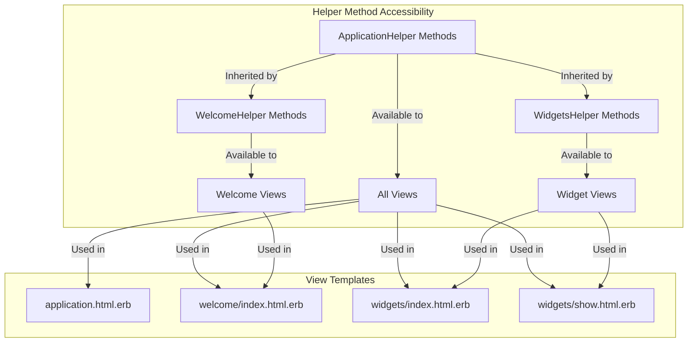
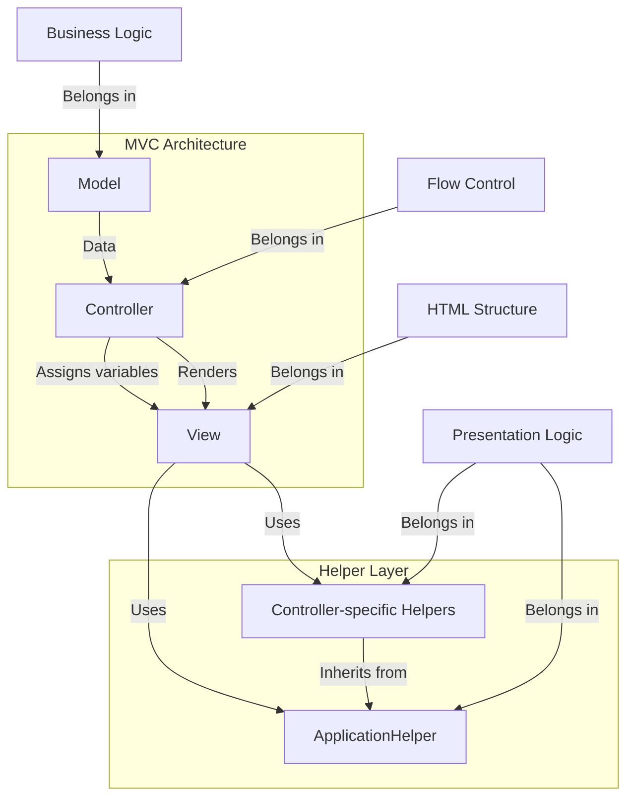
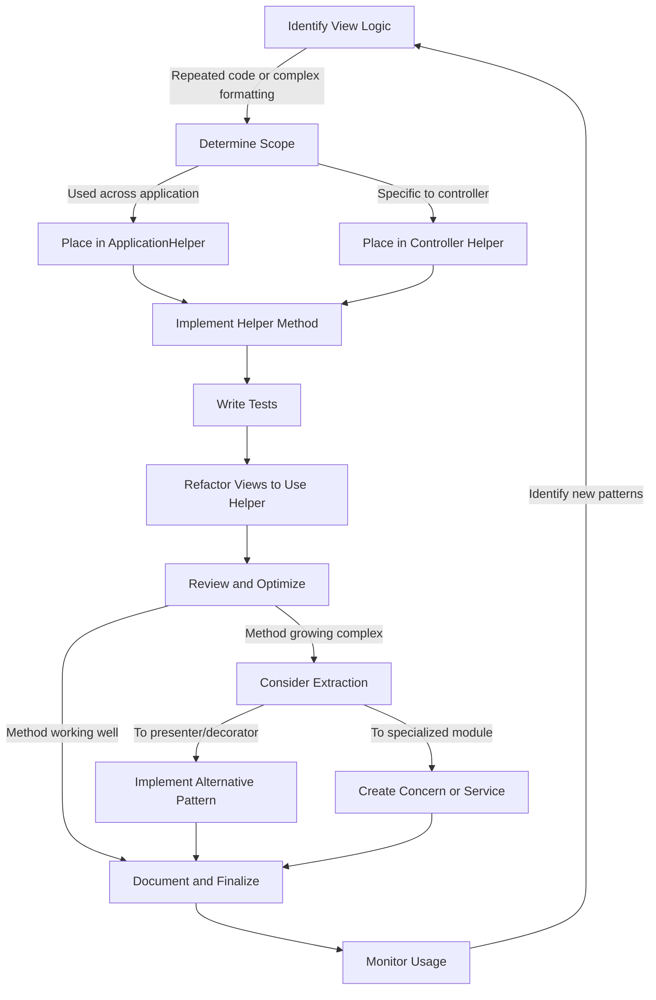

# Helper Modules in Ruby on Rails

## Introduction to Helper Modules in Rails

Helper modules in Ruby on Rails serve as a crucial architectural component designed to encapsulate view-specific logic. These modules act as a bridge between controllers and views, providing a clean separation of concerns by extracting complex presentation logic from view templates. By housing reusable methods that handle formatting, conditional display logic, and HTML generation, helper modules ensure that view templates remain focused on presentation structure rather than complex logic. This separation enhances maintainability by preventing views from becoming cluttered with Ruby code, making them more readable and easier to modify. Helper modules represent Rails' commitment to the DRY (Don't Repeat Yourself) principle, allowing developers to define view-related functionality once and reuse it across multiple views, thereby promoting consistency throughout the application's interface.

## Helper Module Hierarchy in Rails

```mermaid
classDiagram
    class ActionView::Helpers {
        <<Rails Core>>
        +various built-in helpers
    }
    class ApplicationHelper {
        +application_wide_methods()
    }
    class WelcomeHelper {
        +welcome_specific_methods()
    }
    class WidgetsHelper {
        +widgets_specific_methods()
    }
    
    ActionView::Helpers <|-- ApplicationHelper
    ApplicationHelper <|-- WelcomeHelper
    ApplicationHelper <|-- WidgetsHelper
```

The diagram illustrates the inheritance structure of helper modules in a Rails application. At the top level, Rails provides `ActionView::Helpers` which contains numerous built-in helper methods for common tasks. The application's `ApplicationHelper` inherits from these core helpers, extending the functionality available to all views. Controller-specific helpers like `WelcomeHelper` and `WidgetsHelper` then inherit from `ApplicationHelper`, creating a hierarchical structure that allows for both shared and specialized helper methods. This architecture ensures that helper methods defined in parent modules are available to all child modules, while allowing for controller-specific functionality to be isolated in the appropriate helper.

## ApplicationHelper: The Base Helper

ApplicationHelper serves as the foundational helper module in a Rails application, providing a centralized location for defining methods that need to be accessible across all views. In the Ruby Demo application, we see that `ApplicationHelper` is currently empty, but its architectural significance remains intact. This module inherits from Rails' core helper modules and makes their functionality available throughout the application. When developers identify view logic that needs to be shared across multiple controllers, ApplicationHelper is the appropriate place to define such methods. Common examples include formatting dates, generating page titles, handling flash messages, or creating reusable UI components. By centralizing these methods in ApplicationHelper, developers ensure consistency across the application and avoid duplicating code in controller-specific helpers. The module's application-wide scope makes it an essential tool for maintaining a DRY codebase while keeping views clean and focused on presentation.

## Controller-Specific Helpers

Controller-specific helpers like `WelcomeHelper` and `WidgetsHelper` in the Ruby Demo application represent a strategic approach to organizing view-related functionality. These modules are automatically generated by Rails when controllers are created, establishing a one-to-one relationship between controllers and their corresponding helper modules. While both helper modules in the demo application are currently empty, they serve as designated containers for methods that will specifically support views rendered by their respective controllers. For instance, `WidgetsHelper` would be the appropriate location for methods that format widget data, generate widget-specific UI components, or handle conditional display logic unique to widget views. Similarly, `WelcomeHelper` would contain methods exclusively relevant to welcome pages. This controller-specific organization promotes a modular architecture where helper methods are logically grouped based on their functional domain, making the codebase more navigable and maintainable. It also prevents ApplicationHelper from becoming bloated with feature-specific methods, adhering to the principle of separation of concerns.

## Helper Method Accessibility Scope



This diagram illustrates the accessibility scope of helper methods within a Rails application. Methods defined in `ApplicationHelper` are globally accessible to all views throughout the application, including layouts like `application.html.erb` and view templates across all controllers. In contrast, methods defined in controller-specific helpers like `WelcomeHelper` and `WidgetsHelper` are automatically available only to views rendered by their corresponding controllers. This scoping mechanism creates a natural hierarchy where general-purpose methods reside in `ApplicationHelper` while specialized methods are contained within their relevant controller helpers. The inheritance relationship ensures that controller-specific views can access both their dedicated helper methods and the application-wide methods, providing a clean organization that aligns with Rails' convention-over-configuration philosophy while preventing namespace pollution across different functional areas of the application.

## Empty Helper Modules: Purpose and Practice

The presence of empty helper modules like `WelcomeHelper` and `WidgetsHelper` in the Ruby Demo application exemplifies a deliberate Rails convention rather than an oversight. Rails automatically generates these empty modules during controller creation to establish a consistent architectural pattern, anticipating future view-specific logic needs. This practice aligns with the framework's "convention over configuration" philosophy, ensuring that when helper methods become necessary, they have a predetermined home that follows established naming conventions. Maintaining these empty modules, even when initially devoid of functionality, serves several strategic purposes: they preserve the application's structural integrity, provide clear extension points for future development, and maintain consistency with Rails' expected directory structure. Additionally, they serve as documentation of the application's architecture, signaling to developers where view-specific logic should be placed when needed. As applications evolve, these initially empty modules often become populated with methods that handle increasingly complex view requirements, validating Rails' forward-thinking approach to application structure.

## Best Practices for Helper Methods

When implementing helper methods in Rails applications, several best practices should guide development decisions to maintain code quality and architectural integrity. First, helper methods should remain strictly focused on view-related concerns, avoiding business logic that belongs in models or service objects. They should be designed with reusability in mind, accepting parameters that allow them to be flexible across different contexts. Helper methods should be kept small and focused on a single responsibility, making them easier to test and maintain. Naming conventions should clearly indicate the method's purpose, using descriptive verbs that reflect the transformation or formatting being performed. Documentation is essential, particularly for complex helpers that may not be immediately intuitive to other developers. When helper methods begin to grow in complexity or number within a specific domain, consider extracting them into dedicated modules or even custom view components for better organization. Regularly review helper methods to identify opportunities for refactoring, particularly when similar functionality appears across different helpers. Finally, be mindful of performance implications, especially for helpers that may be called repeatedly within collection rendering or that perform expensive operations.

## MVC Architecture with Helpers



This diagram illustrates how helper modules integrate into the traditional Model-View-Controller architecture in Rails applications. While models encapsulate business logic and data access, controllers handle request processing and flow control, and views define the HTML structure, helper modules occupy a specialized position supporting the view layer. They serve as an intermediate layer that processes data for presentation without cluttering view templates with complex Ruby code. Helper modules maintain a clear separation of concerns by housing presentation logic that would otherwise complicate view templates. This architectural arrangement ensures that views remain focused on structure and layout while complex formatting, conditional display logic, and HTML generation are abstracted into helper methods. The diagram also emphasizes that helpers should not contain business logic (which belongs in models) or flow control (which belongs in controllers), reinforcing their specific role in the presentation layer of the application.

## Testing Helper Methods

Testing helper methods effectively requires a strategic approach that acknowledges their unique position in the Rails architecture. Since helpers are modules that get included in view contexts, testing them directly involves creating a test environment that mimics this inclusion. Rails provides the `ActionView::TestCase` class specifically for this purpose, allowing developers to test helper methods in isolation while maintaining access to the view context they require. When testing helpers, focus on verifying the transformation or formatting they perform rather than their integration with specific views. Test cases should cover various input scenarios, including edge cases and potential nil values, to ensure robust behavior. For helpers that generate HTML, assert against the expected structure using CSS selectors or regex patterns rather than exact string matching, which can be brittle. Consider using fixtures or factories to provide realistic data for testing complex formatting scenarios. Integration tests can complement unit tests by verifying that helper methods produce the expected output when rendered within actual views. For helpers that interact with request objects or session data, ensure the test environment properly simulates these contexts. Finally, maintain test isolation by stubbing external dependencies and focusing each test on a single behavior of the helper method.

## Common Helper Method Patterns

Helper methods in Rails applications commonly follow several established patterns that address recurring view-related challenges. Formatters transform raw data into human-readable formats, such as converting timestamps into localized date strings, formatting currency values with appropriate symbols, or truncating text with ellipses for display in constrained spaces. HTML generators create complex markup structures from simpler inputs, like converting Markdown to HTML, building form elements dynamically, or generating consistent UI components like cards or alerts. Conditional display helpers encapsulate logic that determines whether certain elements should be shown based on application state, user permissions, or data characteristics. Link and button generators create consistent navigation elements throughout the application, often incorporating authorization checks. Collection formatters transform arrays or other collections into appropriate display formats, such as comma-separated lists or bulleted items. Asset helpers manage the inclusion of images, stylesheets, or JavaScript with appropriate paths and attributes. Status indicators convert abstract states into visual representations using appropriate colors, icons, or labels. These patterns represent proven solutions to common view-related challenges and provide a framework for organizing helper methods in a consistent, maintainable way.

## Alternatives to Helper Modules

While helper modules are a core part of Rails' architecture, several alternative approaches have emerged to address their limitations in complex applications. View Components, popularized by GitHub's ViewComponent library, offer a more object-oriented approach to view fragments, encapsulating both logic and templates in testable, reusable classes with clearly defined interfaces and lifecycle hooks. Decorators, implemented through gems like Draper, wrap model objects to add presentation-specific methods without polluting the model layer, providing a cleaner separation between business and presentation logic. Presenters serve as dedicated objects that prepare data for display, often taking a model and controller context as input and exposing methods specifically designed for view consumption. Partial objects combine a partial template with a dedicated Ruby object that provides the necessary methods, creating a cohesive unit. Service objects can extract complex view-related operations that might otherwise bloat helper modules. Each alternative offers different trade-offs in terms of complexity, testability, and organization. The choice between these approaches depends on application size, team preferences, and specific requirements. In large applications, a hybrid approach often emerges, using helpers for simple formatting tasks while employing more structured alternatives for complex UI components.

## Helper Method Implementation Workflow



This workflow diagram outlines the process of identifying, implementing, and refining helper methods in a Rails application. The process begins with identifying view logic that is either repeated across multiple templates or contains complex formatting that clutters the view. Once identified, developers must determine the appropriate scope for the helper method—whether it should be available application-wide in `ApplicationHelper` or limited to a specific controller's helper module. After implementing the helper method with a clear, descriptive name and focused functionality, comprehensive tests should be written to verify its behavior across various scenarios. Views are then refactored to use the new helper, followed by a review phase to ensure the implementation is optimal and addresses all requirements. If the helper method grows too complex, developers should consider extracting it to more specialized patterns like presenters, decorators, or service objects. Otherwise, the method should be properly documented and finalized. Ongoing monitoring of helper usage throughout the application can reveal new patterns or opportunities for further abstraction, creating a continuous improvement cycle that maintains code quality and architectural integrity.

[Generated by the Sage AI expert workbench: 2025-03-29 18:36:01  https://sage-tech.ai/workbench]: #