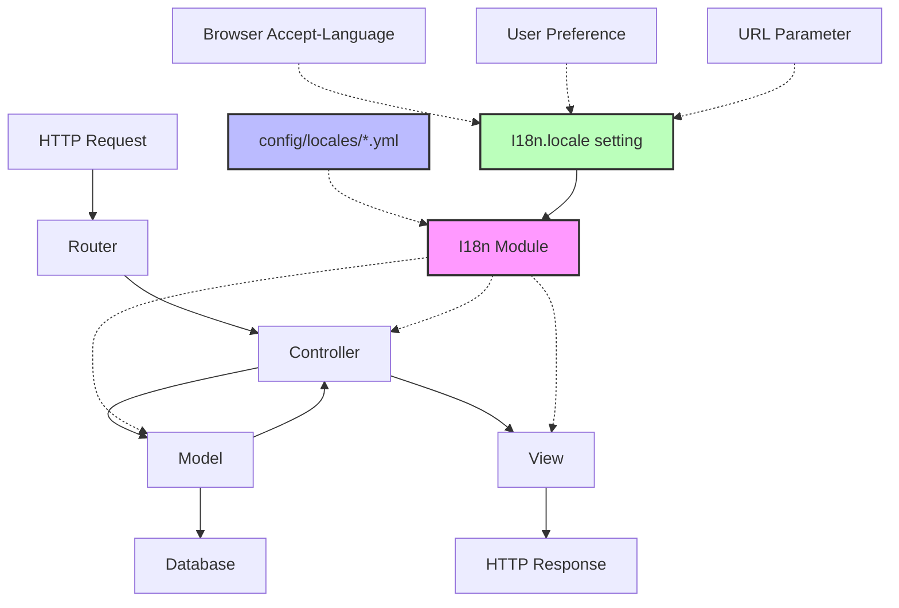
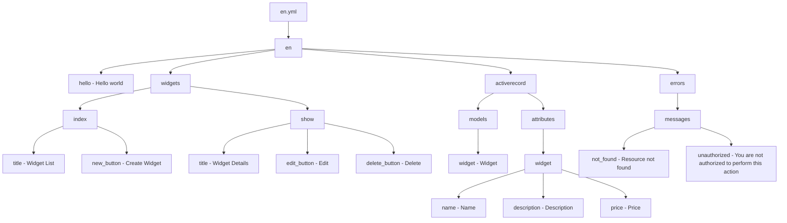
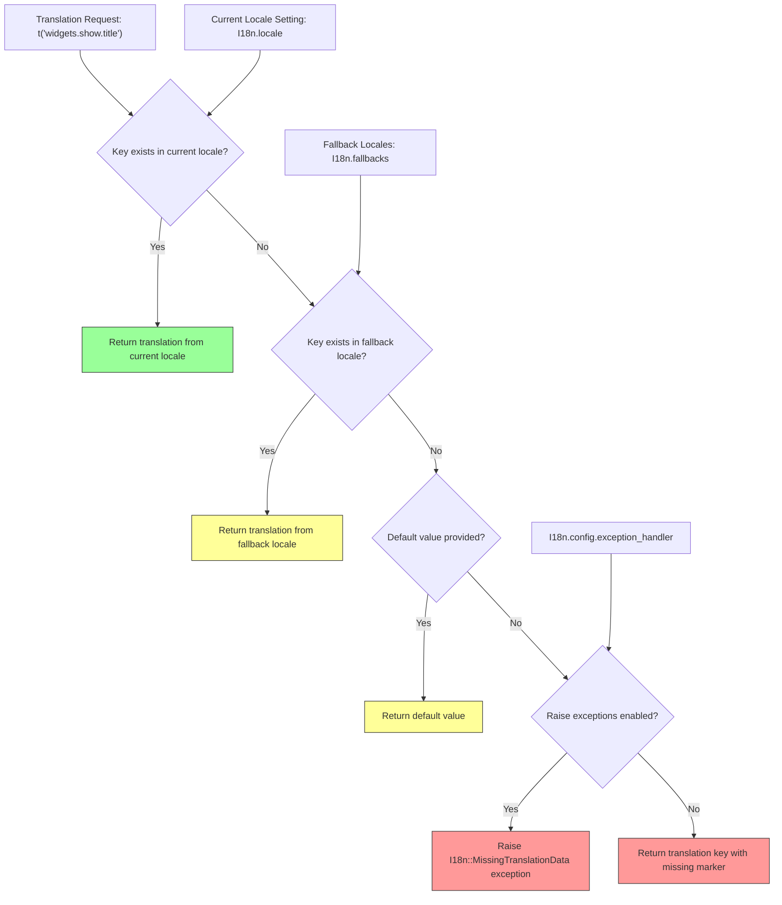
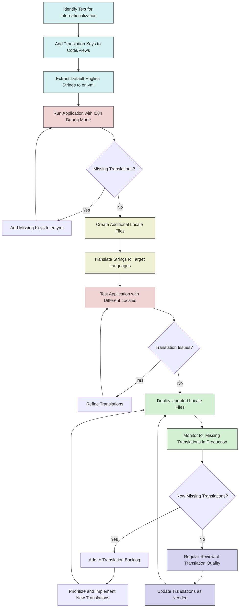

# Internationalization in Ruby Demo

## Introduction to Internationalization in Ruby Demo

Internationalization (I18n) in the Ruby Demo Rails application provides a framework for supporting multiple languages and locales. This critical cross-cutting concern enables the application to adapt its user interface to different languages, date formats, number formats, and other locale-specific requirements without changing the application's core logic. In the Ruby Demo, I18n functionality is implemented through Rails' built-in internationalization framework, which separates translatable content from application code. This separation allows the application to be easily localized for different markets and user bases, enhancing its global reach and accessibility. The implementation follows Rails conventions, with locale files stored in the config/locales directory, beginning with a basic English locale configuration.

## Rails I18n Framework Basics

The Ruby Demo application leverages Rails' robust I18n framework, which provides a simple yet powerful mechanism for internationalizing applications. At its core, the framework consists of two main components: the I18n module, which provides translation and localization methods, and the locale files, which contain the actual translations. 

In Ruby Demo, the I18n framework is implemented through the config/locales directory, which contains YAML files for each supported locale. The application starts with an `en.yml` file for English translations, following Rails' convention of using two-letter ISO language codes as file names. The I18n module provides methods like `I18n.t` for accessing translations and `I18n.l` for localizing dates and times. These methods automatically use the current locale setting to determine which translations to display. The framework also supports interpolation, pluralization, and custom formatting options, making it flexible enough to handle complex localization requirements.

## I18n Architecture in Rails

The internationalization framework is deeply integrated into the Rails MVC architecture, influencing how content is processed and displayed throughout the application lifecycle.



The diagram illustrates how the I18n framework integrates with the Rails MVC architecture. When a request is processed, the I18n module provides translation services to controllers, models, and views based on the current locale setting. The locale can be determined from various sources including browser settings, user preferences, or URL parameters. Translation strings are loaded from YAML files in the config/locales directory, with the appropriate file selected based on the active locale. This architecture ensures that internationalization concerns are properly separated from application logic while still being accessible throughout the request processing flow.

## Locale Configuration Files

The Ruby Demo application uses YAML-based locale files to store translations, with `en.yml` serving as the primary locale file for English content. These files follow a hierarchical structure that organizes translations into logical namespaces, making them easier to manage as the application grows.

In the `en.yml` file, translations are organized under the top-level locale key (`en:`), followed by nested keys that provide context for each translation. This hierarchical structure helps avoid naming conflicts and makes it clear where each translation is used in the application. For example, model attributes might be organized under `en.activerecord.attributes.[model_name]`, while view-specific text might use keys like `en.widgets.index.title`.

The structure also supports interpolation using placeholders like `%{name}`, which are replaced with dynamic values when the translation is rendered. This allows for flexible sentence construction while maintaining proper grammar and syntax in each language. The Ruby Demo's locale files are designed to be maintainable and scalable, with comments explaining the purpose of key sections and providing guidance for translators.

## Locale File Structure

The hierarchical structure of locale files is crucial for organizing translations in a maintainable way, especially as the application grows to support more features and languages.



This diagram represents a typical structure for the `en.yml` locale file in the Ruby Demo application. The hierarchy starts with the locale code (`en`) and branches into different sections for various parts of the application. The structure includes translations for model names and attributes under the `activerecord` namespace, view-specific text under feature namespaces like `widgets`, and error messages under the `errors` namespace. This organization makes it easier to locate specific translations and maintain consistency across the application. When adding new features or modifying existing ones, developers can follow this established pattern to ensure that internationalization is properly implemented.

## Accessing Translations in Ruby Code

In the Ruby Demo application, translations are accessed in Ruby code (controllers, models, services, etc.) using the `I18n.t` helper method. This method takes a translation key as its first argument and looks up the corresponding value in the locale files based on the current locale setting.

For example, to access the "hello" translation defined in `en.yml`, the code would use:

```ruby
I18n.t 'hello'  # Returns "Hello world" when locale is set to :en
```

For more complex translations, the method supports interpolation of variables:

```ruby
I18n.t 'widgets.created', name: @widget.name  # Returns "Widget 'Sprocket' was successfully created"
```

The `I18n.t` method also accepts options that modify its behavior:

- `:scope` - Provides a namespace prefix for the translation key
- `:default` - Fallback value if the translation is missing
- `:locale` - Explicitly specify a locale different from the current one

For example:

```ruby
I18n.t :title, scope: [:widgets, :show], default: 'Widget Details'
```

This approach allows Ruby code to remain locale-agnostic while still providing localized text to users. By centralizing all translatable strings in locale files, the application maintains a clean separation between code and content, making it easier to add support for new languages without modifying application logic.

## Translations in View Templates

In the view templates of Ruby Demo, translations are implemented using the shorthand `t` helper method, which is an alias for `I18n.t`. This concise syntax keeps view templates clean and readable while still providing full access to the application's internationalization capabilities.

For example, a simple translation in an ERB template might look like:

```erb
<h1><%= t('widgets.index.title') %></h1>
```

For translations with interpolated values:

```erb
<p><%= t('widgets.show.created_by', user: @widget.user.name) %></p>
```

The view layer also supports more complex translation scenarios, such as pluralization:

```erb
<p><%= t('widgets.index.count', count: @widgets.size) %></p>
```

Where the locale file might contain:

```yaml
en:
  widgets:
    index:
      count:
        zero: "No widgets found"
        one: "1 widget found"
        other: "%{count} widgets found"
```

Form labels and error messages can be automatically translated by leveraging Rails' built-in integration between the I18n framework and form helpers:

```erb
<%= form_for @widget do |f| %>
  <%= f.label :name %>  # Automatically uses activerecord.attributes.widget.name
  <%= f.text_field :name %>
<% end %>
```

This tight integration between the view layer and the I18n framework ensures that the user interface can be completely localized without requiring changes to the view templates themselves when adding support for new languages.

## Translation Lookup Flow

The process of resolving translation keys to their corresponding values involves several steps and fallback mechanisms to ensure the best possible user experience even when translations are incomplete.



This flowchart illustrates the process that occurs when a translation is requested using the `t` helper method. First, the system checks if the requested key exists in the current locale's translation files. If found, that translation is returned immediately. If not, the system checks fallback locales (typically including the default locale, usually English). If the key exists in a fallback locale, that translation is used instead.

If no translation is found in any locale, the system checks if a default value was provided with the translation request. If so, that default value is returned. Otherwise, the behavior depends on the configuration: either an exception is raised (typically in development to catch missing translations early) or a specially formatted version of the key is returned (often in production to avoid breaking the application).

This lookup flow ensures that the application degrades gracefully when translations are incomplete, while still providing tools to identify and fix missing translations during development.

## Dynamic Locale Switching

The Ruby Demo application implements several techniques for dynamically changing the application locale based on user preferences, URL parameters, or browser settings. This flexibility allows users to experience the application in their preferred language without requiring separate deployments for each locale.

The primary mechanism for setting the locale is through the `I18n.locale=` method, which can be called at various points in the request lifecycle:

```ruby
# Setting locale based on a URL parameter
def set_locale
  I18n.locale = params[:locale] if params[:locale].present?
end
```

For persistence across requests, the application can store the locale preference in the user's session or profile:

```ruby
# Setting locale from user preferences
def set_locale
  I18n.locale = current_user.preferred_locale if user_signed_in?
end
```

The application can also detect the user's preferred language from browser settings:

```ruby
# Setting locale based on Accept-Language header
def set_locale
  I18n.locale = extract_locale_from_accept_language_header
  # Fall back to default locale if the requested locale is not available
  I18n.locale = I18n.default_locale unless I18n.available_locales.include?(I18n.locale)
end

private
def extract_locale_from_accept_language_header
  request.env['HTTP_ACCEPT_LANGUAGE'].scan(/^[a-z]{2}/).first
end
```

To ensure that the locale setting is applied consistently, these methods are typically implemented in the `ApplicationController` and called using a `before_action` callback:

```ruby
class ApplicationController < ActionController::Base
  before_action :set_locale
  
  # ...locale setting methods...
end
```

This approach allows the Ruby Demo application to adapt to the user's language preferences automatically while still providing manual override options for users who prefer a different language than their browser's default.

## Handling Missing Translations

The Ruby Demo application implements several strategies for gracefully handling missing translations, ensuring a smooth user experience even when internationalization is incomplete. These approaches balance the need for robustness in production with the ability to identify and fix translation issues during development.

In development environments, the application is configured to raise exceptions for missing translations, making it immediately obvious when a translation key is missing:

```ruby
# config/environments/development.rb
config.action_view.raise_on_missing_translations = true
```

For production environments, the application uses fallback mechanisms to provide a degraded but functional experience:

1. **Default Values**: Translation calls can include default values that are used when the requested translation is missing:
   ```ruby
   t('widgets.show.edit_button', default: 'Edit')
   ```

2. **Fallback Locales**: The application configures locale fallbacks so that if a translation is missing in the current locale, it falls back to a more complete locale:
   ```ruby
   # config/initializers/i18n.rb
   require 'i18n/backend/fallbacks'
   I18n::Backend::Simple.include(I18n::Backend::Fallbacks)
   I18n.fallbacks.map(fr: :en, es: :en)
   ```

3. **Custom Exception Handler**: A custom exception handler can be implemented to log missing translations while returning a reasonable fallback:
   ```ruby
   # config/initializers/i18n.rb
   I18n.exception_handler = proc do |exception, locale, key, options|
     if exception.is_a?(I18n::MissingTranslation)
       Rails.logger.error "Missing translation: #{locale}.#{key}"
       key.split('.').last.humanize
     else
       raise exception
     end
   end
   ```

4. **Translation Monitoring**: The application can implement monitoring to track missing translations in production, allowing them to be identified and added in future releases:
   ```ruby
   # A simplified example of tracking missing translations
   module I18n
     def self.missing_translations
       @missing_translations ||= Set.new
     end
   end
   
   I18n.exception_handler = proc do |exception, locale, key, options|
     if exception.is_a?(I18n::MissingTranslation)
       I18n.missing_translations << "#{locale}.#{key}"
       # Return a fallback value
     else
       raise exception
     end
   end
   ```

These strategies ensure that the Ruby Demo application remains functional even when translations are incomplete, while still providing mechanisms to identify and address translation gaps over time.

## Internationalization Workflow

The internationalization workflow in Ruby Demo encompasses the entire process from adding new text to the application through to its translation and display in multiple languages.



This workflow diagram illustrates the end-to-end process of internationalization in the Ruby Demo application. The process begins with identifying text that needs to be internationalized, followed by replacing hardcoded strings with translation keys in the code and views. Default English strings are extracted to the `en.yml` file, and the application is run in I18n debug mode to catch any missing translations.

Once the English locale file is complete, additional locale files are created for target languages, and the strings are translated. The application is then tested with different locales to ensure that all translations display correctly. After addressing any translation issues, the updated locale files are deployed to production.

In production, the application monitors for missing translations, which are added to a translation backlog for future implementation. Regular reviews of translation quality ensure that the internationalized content remains accurate and appropriate for each supported locale.

This systematic approach ensures that internationalization is an ongoing process rather than a one-time effort, allowing the Ruby Demo application to maintain high-quality translations across all supported languages as the application evolves.

## Best Practices and Future Enhancements

The Ruby Demo application has implemented a solid foundation for internationalization, but there are several best practices and potential enhancements that could further improve its multilingual capabilities:

1. **Separation of Concerns**: Continue to maintain clear separation between code and translatable content. Avoid hardcoding strings in Ruby code or view templates, and instead use translation keys consistently.

2. **Contextual Keys**: Organize translation keys hierarchically to provide context for translators. For example, use `en.widgets.form.submit` rather than `en.submit` to clarify where and how the string is used.

3. **Translation Management System**: Consider implementing a dedicated translation management system (TMS) like Phrase, Lokalise, or Tolgee to streamline the translation workflow, especially as the number of supported languages grows.

4. **Pluralization Support**: Leverage Rails' built-in pluralization support for all countable items, ensuring grammatical correctness across languages with different pluralization rules:

   ```yaml
   en:
     widgets:
       count:
         zero: "No widgets"
         one: "1 widget"
         other: "%{count} widgets"
   ```

5. **Date and Number Formatting**: Enhance the application to properly format dates, times, currencies, and numbers according to locale conventions using `I18n.l` and related helpers.

6. **Right-to-Left (RTL) Support**: Add support for RTL languages like Arabic and Hebrew by implementing directional CSS and ensuring the UI adapts appropriately.

7. **Content Translation**: Extend internationalization beyond UI elements to include dynamic content like blog posts or product descriptions, possibly using a content management system with translation capabilities.

8. **Automated Testing**: Implement automated tests specifically for internationalization, verifying that all user-facing strings are properly translated and that the application functions correctly in all supported locales.

9. **Translation Memory**: Implement translation memory to reuse previously translated strings, improving consistency and reducing translation costs.

10. **Machine Translation Integration**: For rapid initial translations or handling of user-generated content, consider integrating with machine translation APIs while maintaining a human review process.

11. **Locale-Specific Routes**: Implement locale-specific routes (e.g., `/fr/widgets` instead of `/widgets` for French) to improve SEO and user experience.

12. **Performance Optimization**: As the number of translations grows, implement caching strategies to minimize the performance impact of translation lookups.

By following these best practices and implementing these enhancements over time, the Ruby Demo application can evolve into a truly global platform that provides an excellent experience for users regardless of their language or locale preferences.

[Generated by the Sage AI expert workbench: 2025-03-29 18:36:01  https://sage-tech.ai/workbench]: #