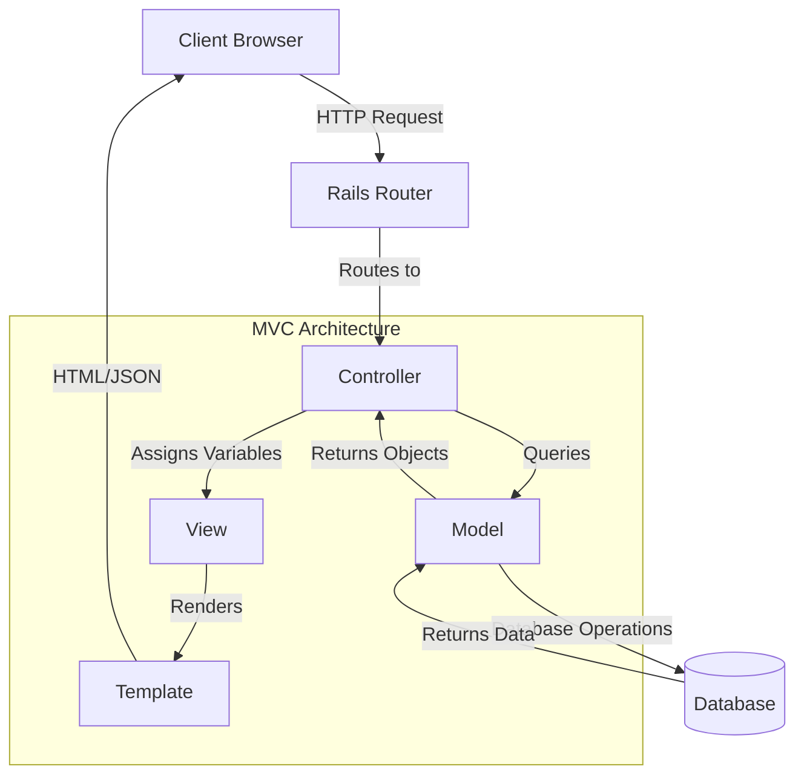
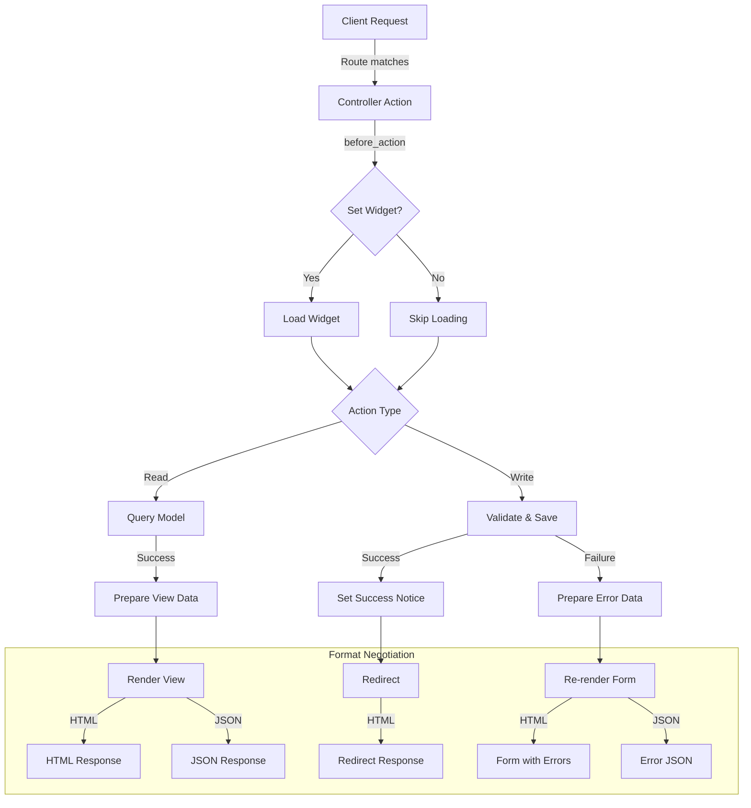
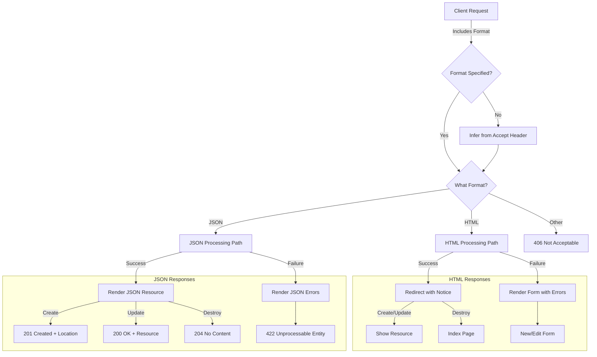
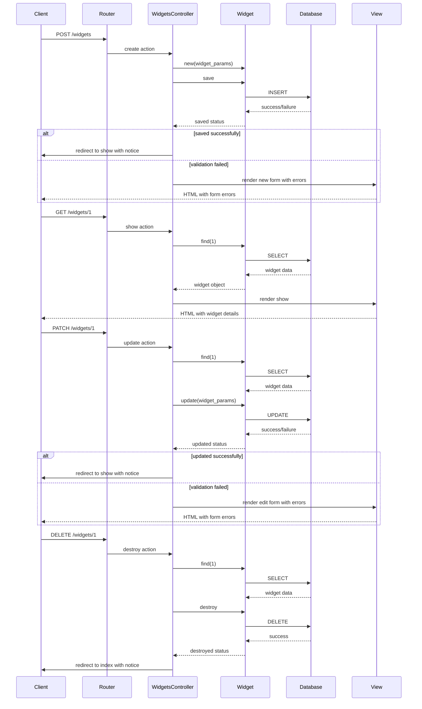

# MVC Components in Ruby Demo

## MVC Architecture Overview

The Model-View-Controller (MVC) architecture is a foundational design pattern in Ruby on Rails that enforces a clear separation of concerns within web applications. In the Ruby Demo application, this pattern is rigorously implemented to ensure maintainability, testability, and scalability. The MVC pattern divides the application into three interconnected components: Models that encapsulate data and business logic, Views that handle presentation and user interface elements, and Controllers that orchestrate the interaction between models and views while processing HTTP requests.

In Rails, this separation is not merely conceptual but structurally enforced through directory organization and class inheritance hierarchies. The Ruby Demo application exemplifies this with its Widget resource management system, where the Widget model manages data persistence and validation, the WidgetsController handles request processing and application flow, and the corresponding views render the appropriate HTML or JSON responses. This architecture enables developers to modify one component without significantly impacting others, facilitating parallel development and reducing coupling between system parts.

## MVC Pattern Flow Diagram

The diagram illustrates the typical flow of data and control in the Ruby Demo application's MVC architecture. When a client sends an HTTP request (e.g., to view widgets), the Rails router determines which controller action should handle it. In our case, the WidgetsController processes the request, interacting with the Widget model to retrieve or manipulate data from the database. The controller then assigns the necessary data to instance variables and selects the appropriate view to render. The view, combined with its template, generates the response (HTML or JSON) that is sent back to the client. This separation allows each component to focus on its specific responsibility while maintaining a clean flow of data through the system.

## Controller Components in Ruby Demo

The controller layer in Ruby Demo consists primarily of two controllers: WelcomeController and WidgetsController. These controllers serve as the intermediaries between the HTTP requests and the application's response, orchestrating the flow of data and control. WelcomeController is minimalist, implementing only an empty index method that serves as the application's entry point, rendering a welcome page without requiring specific data preparation. This approach is common for landing pages where minimal processing is needed.

In contrast, WidgetsController is more complex, handling the complete lifecycle of Widget resources. It inherits from ApplicationController, which likely contains shared functionality for all controllers in the application. WidgetsController exemplifies the Rails convention of having resource-specific controllers that encapsulate all operations related to a particular domain entity. Both controllers follow the Rails convention of responding to specific routes and HTTP verbs, with their actions mapping directly to view templates in the application's view directory structure.

## RESTful Resource Controllers

The WidgetsController in Ruby Demo exemplifies Rails' implementation of RESTful principles through its seven standard actions. The index action retrieves all widgets for listing, while show retrieves and displays a specific widget identified by its ID. The new and edit actions prepare for data creation and modification by instantiating objects and rendering forms. The create action processes form submissions to create new widgets, validating input and persisting data to the database. Similarly, update modifies existing records based on form submissions. Finally, destroy removes widgets from the system.

Each action adheres to RESTful conventions by mapping to specific HTTP verbs and routes: GET for index, show, new, and edit; POST for create; PATCH/PUT for update; and DELETE for destroy. This standardized approach provides a consistent interface for clients interacting with the widget resource, whether through web forms or API calls. The controller's implementation of these actions demonstrates how Rails encourages adherence to REST principles through its conventions and structure.

## Controller Action Flow

This flowchart depicts how a typical controller action in the Ruby Demo application processes a request, particularly in the WidgetsController. The flow begins when a client request is routed to a specific controller action. Before the action executes, the before_action callback may run to set up common resources, such as loading the widget instance in show, edit, update, and destroy actions.

The action then branches based on whether it's a read operation (index, show) or a write operation (create, update, destroy). Read operations query the model and prepare data for the view, while write operations attempt to validate and save data. Success paths typically set a notice message and redirect (for write operations) or render the appropriate view (for read operations). Failure paths re-render forms with error messages or return error responses in JSON format.

The diagram also illustrates the format negotiation process, where the controller determines whether to respond with HTML or JSON based on the request's Accept header or format parameter. This dual-format capability enables the application to serve both traditional web interfaces and API clients with the same controller actions.

## Controller Callbacks and Filters

The WidgetsController in Ruby Demo employs the before_action callback mechanism to establish consistent behavior across multiple controller actions. Specifically, the `set_widget` method is invoked before the show, edit, update, and destroy actions, ensuring that the @widget instance variable is properly initialized with the correct Widget instance from the database. This approach exemplifies the Don't Repeat Yourself (DRY) principle by centralizing the widget retrieval logic in a single method rather than duplicating it across multiple actions.

Callbacks like before_action serve several critical purposes in Rails controllers. They enforce prerequisite conditions before action execution, establish a consistent state for controller actions, and provide hooks for cross-cutting concerns such as authentication, authorization, and logging. In more complex applications, these callbacks might be chained to implement sophisticated request processing pipelines. The WidgetsController's use of before_action demonstrates a fundamental Rails pattern for maintaining clean, maintainable controller code by abstracting common functionality into discrete, reusable methods.

## Content Negotiation in Controllers

The WidgetsController implements sophisticated content negotiation through the respond_to blocks in its create, update, and destroy actions. This mechanism allows the controller to provide different responses based on the client's requested format, typically HTML for browser-based interactions and JSON for API clients. The implementation follows Rails' convention of format-specific response blocks, where each format has its own handling logic.

For HTML requests, successful operations typically redirect to another page with a flash notice, while failures re-render the form with validation errors. For JSON requests, successful operations return the created or updated resource with appropriate HTTP status codes (201 Created for new resources, 200 OK for updates), while failures return error details with a 422 Unprocessable Entity status. This dual-mode capability enables the controller to serve both traditional web interfaces and programmatic API clients without duplicating business logic. The respond_to pattern exemplifies Rails' "convention over configuration" philosophy by providing a clean, declarative syntax for handling multiple response formats within a single controller action.

## Format Response Decision Tree

This decision tree illustrates the format determination and response generation process in the WidgetsController. When a request arrives, the controller first determines the desired response format, either from an explicit format parameter (like .json in the URL) or from the HTTP Accept header. Based on this determination, the controller follows either the HTML or JSON processing path.

For HTML requests, successful operations result in redirects with flash notices—showing the resource after creation or update, or returning to the index page after deletion. Failed operations re-render the appropriate form with validation errors displayed.

For JSON requests, successful operations return the appropriate HTTP status code and response body: 201 Created with a Location header for new resources, 200 OK with the resource representation for updates, or 204 No Content for deletions. Failed operations return a 422 Unprocessable Entity status with a JSON representation of the validation errors.

This structured approach to format negotiation enables the Ruby Demo application to serve both traditional web interfaces and API clients with consistent business logic but format-appropriate responses, demonstrating the flexibility of Rails controllers in handling diverse client requirements.

## Model Integration in MVC

The WidgetsController demonstrates comprehensive integration with the Widget model, showcasing the controller's role in orchestrating model operations while maintaining separation of concerns. For data retrieval, the controller uses Widget.all in the index action to fetch all widgets and Widget.find(params[:id]) in the set_widget method to retrieve specific instances. For data creation, it instantiates new Widget objects with Widget.new(widget_params), applying the strong parameters pattern to filter input data. For updates, it calls update on existing Widget instances with filtered parameters, and for deletion, it invokes destroy on the widget instance.

Throughout these interactions, the controller delegates data validation and persistence entirely to the model, respecting the principle that models should encapsulate business logic and data integrity rules. The controller concerns itself only with processing the results of these operations, determining the appropriate response based on success or failure. This clean separation ensures that the Widget model remains the authoritative source for widget-related business rules and data manipulation, while the controller focuses on request handling and response formation. The pattern exemplifies Rails' implementation of MVC, where models handle data and business logic, controllers process requests and coordinate responses, and views (implied in the render calls) handle presentation.

## View Rendering Process

In the Ruby Demo application, controllers orchestrate the view rendering process through several mechanisms. For successful read operations (index and show), the controllers implicitly render views that match their action names, relying on Rails conventions to locate the appropriate template. For form-based actions (new and edit), the controllers prepare the necessary instance variables (@widget) before rendering the corresponding templates that contain form elements.

After write operations (create, update, destroy), the controllers employ explicit redirects with flash notices to guide users to appropriate next steps while providing feedback about the operation's success. In failure scenarios, controllers re-render form templates, preserving the user's input and displaying validation errors. Throughout this process, controllers pass data to views through instance variables (prefixed with @), which become available in the view context.

The WidgetsController also demonstrates conditional rendering based on the requested format. For HTML requests, it renders full pages or redirects to other routes. For JSON requests, it renders serialized representations of resources or error messages. This flexibility allows the same controller actions to serve both traditional web interfaces and API clients, with the view rendering strategy determined by the client's needs.

## Widget CRUD Operations

This sequence diagram illustrates the complete lifecycle of a widget through Create, Read, Update, and Delete operations in the Ruby Demo application. Each operation begins with a client request that is routed to the appropriate WidgetsController action.

For creation, the controller instantiates a new Widget with filtered parameters, attempts to save it, and either redirects to the show page upon success or re-renders the form with errors. Reading a widget involves finding it by ID and rendering its details. Updates follow a similar pattern to creation but operate on an existing widget. Deletion involves finding the widget, destroying it, and redirecting to the index page.

Throughout these operations, the diagram shows the clear separation of responsibilities in the MVC pattern: the controller orchestrates the process but delegates data manipulation to the model, which interacts with the database. Views are responsible only for rendering the appropriate response based on the operation's outcome. This separation ensures that each component has a single responsibility, making the system more maintainable and testable.

The diagram also highlights the consistent pattern of controller actions: they retrieve or instantiate model objects, perform operations on them, and then either redirect or render views based on the result, demonstrating the predictable flow of control in Rails applications.

## Security Considerations in Controllers

The WidgetsController implements strong parameters as a critical security measure against mass assignment vulnerabilities. This pattern, introduced in Rails 4, requires explicit whitelisting of parameters that are permitted for mass assignment to model attributes. In the controller, the private widget_params method uses params.require(:widget).permit(:name, :description, :stock) to specify exactly which attributes can be set through user input.

This approach addresses a significant security risk in web applications: without parameter filtering, attackers could potentially set any model attribute by including additional fields in form submissions or API requests. For example, if the Widget model had an admin_flag attribute, an attacker could set this to true by simply including admin_flag=true in their request parameters. Strong parameters prevent this by rejecting any parameters not explicitly permitted.

The implementation in WidgetsController follows Rails best practices by encapsulating the parameter whitelisting in a private method, making it easy to maintain and update as the model evolves. The method first requires that parameters come within a widget namespace (preventing parameter injection from other forms) and then permits only the specific attributes that should be user-modifiable. This defense-in-depth approach exemplifies how Rails controllers can enforce security boundaries while maintaining clean, maintainable code.

[Generated by the Sage AI expert workbench: 2025-03-29 18:36:01  https://sage-tech.ai/workbench]: #