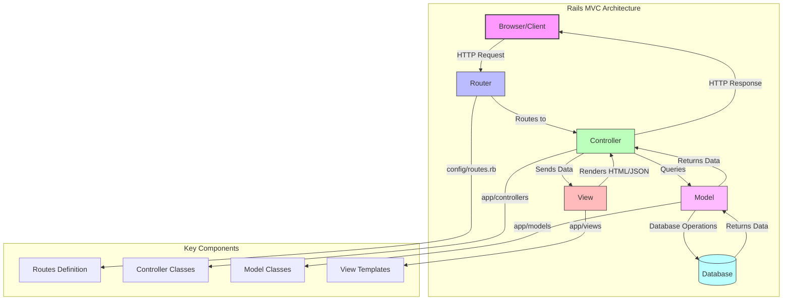
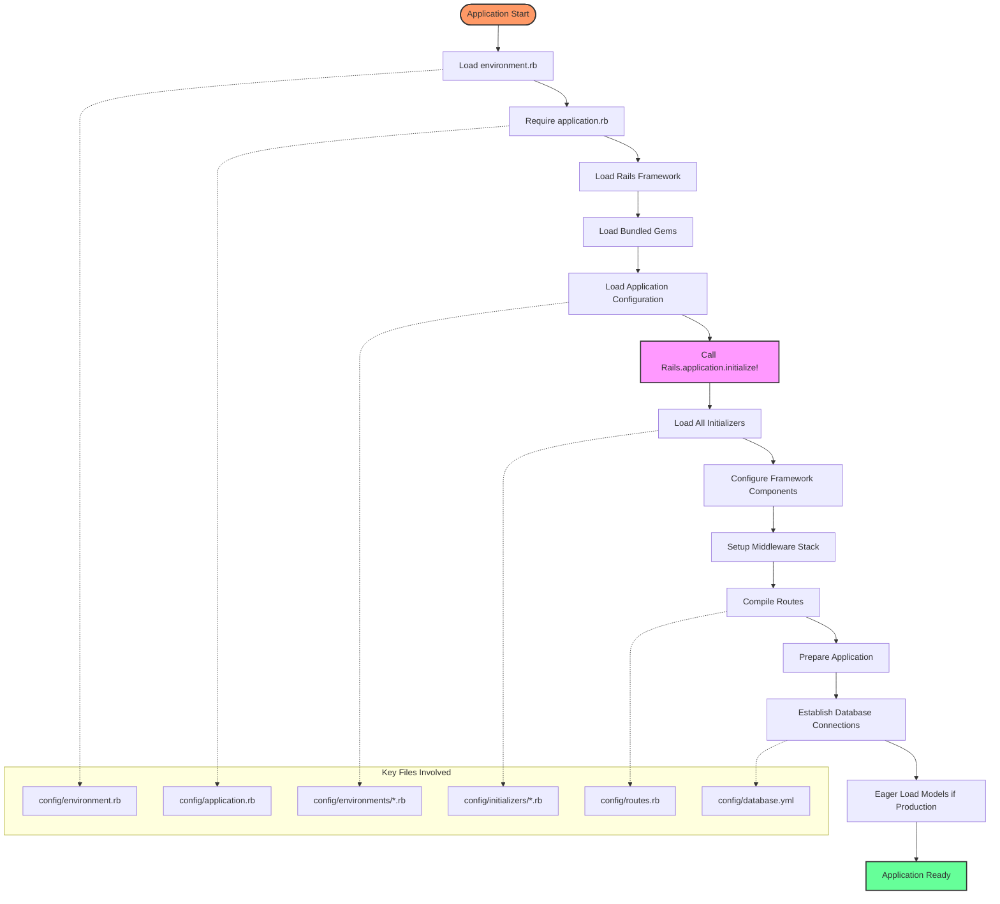
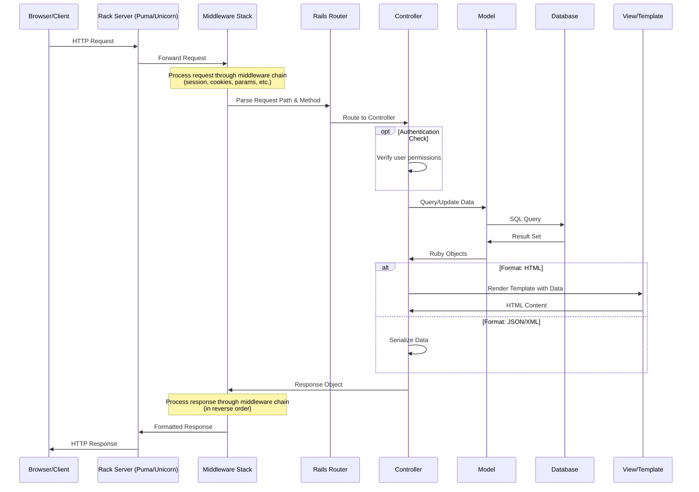

# Rails Framework: A Comprehensive Analysis

## Introduction to Rails Framework

Ruby on Rails, commonly referred to as Rails, is a sophisticated full-stack web application framework built on the Ruby programming language. Since its inception in 2004 by David Heinemeier Hansson, Rails has revolutionized web development by embracing the philosophy of "convention over configuration" and "don't repeat yourself" (DRY). This approach dramatically reduces the cognitive load on developers by establishing sensible defaults and standardized patterns, allowing them to focus on business logic rather than boilerplate code.

Rails provides an integrated solution that handles everything from database interactions to front-end rendering, with a cohesive middleware layer that ties these components together. Its opinionated nature guides developers toward established best practices, while still offering flexibility when needed. The framework's emphasis on beautiful code and developer happiness has influenced numerous other web frameworks across various programming languages.

In modern web development, Rails continues to be relevant by evolving to incorporate contemporary paradigms like API-first design, WebSockets, and JavaScript integration, while maintaining its core principles of productivity and maintainability. Its mature ecosystem includes thousands of gems (Ruby libraries) that extend functionality, a robust testing framework, and built-in security features that protect against common vulnerabilities.

## Rails MVC Architecture



The Rails MVC architecture diagram illustrates the framework's strict adherence to the Model-View-Controller pattern, which provides clear separation of concerns. When a request arrives from a client browser, it first encounters the router, which parses the URL and HTTP verb to determine which controller action should handle the request.

The controller acts as the orchestrator, coordinating between the model and view layers. It receives the request parameters, interacts with models to retrieve or manipulate data, and determines which view should render the response. Controllers in Rails are Ruby classes with methods (actions) that correspond to standard CRUD operations.

Models encapsulate business logic and data access. They interact directly with the database through Active Record, Rails' ORM (Object-Relational Mapping) layer, which abstracts SQL queries into Ruby method calls. Models also handle validations, associations between entities, callbacks, and other domain-specific logic.

Views are responsible for presenting data to the user, typically as HTML (through ERB or HAML templates), JSON, or XML. They receive data from the controller and format it appropriately for the response. Rails' view layer includes helpers, partials, and layouts to promote code reuse and maintain consistency across the application interface.

This architecture ensures that each component has a single responsibility, making the codebase more maintainable and testable. The unidirectional data flow also helps prevent side effects and makes debugging more straightforward.

## Rails Application Bootstrapping

The bootstrapping process of a Rails application is a meticulously orchestrated sequence that transforms a collection of Ruby files into a fully functional web application. At the heart of this process is `environment.rb`, a deceptively simple file that serves as the entry point for the entire application.

When a Rails application starts, whether through a web server like Puma or via the Rails console, the `environment.rb` file is one of the first files loaded. Its primary function is twofold: first, it requires the `application.rb` file, which loads the Rails framework components and application-specific configurations; second, it calls `Rails.application.initialize!` to trigger the initialization process.

The `Rails.application.initialize!` method is particularly significant as it transitions the application from a loading state to a fully initialized state. This method triggers a cascade of operations including:

1. Loading all initializers in the `config/initializers` directory
2. Establishing database connections through ActiveRecord
3. Setting up middleware stack for request processing
4. Compiling routes defined in `config/routes.rb`
5. Loading all application code in the autoload paths
6. Preparing the asset pipeline if applicable

This bootstrapping mechanism exemplifies Rails' emphasis on convention over configuration. By standardizing the initialization process, Rails ensures that all components are loaded in the correct order with appropriate dependencies resolved, without requiring developers to manually orchestrate this complex sequence.

## Configuration and Environment Management

Rails employs a sophisticated multi-environment configuration system that allows applications to behave differently based on their context. The three standard environments—development, test, and production—each serve distinct purposes and have different optimization priorities.

The environment-specific configuration files reside in the `config/environments` directory, with separate files for development, test, and production. These files contain environment-specific settings that override the default configurations defined in `config/application.rb`. For instance, caching is typically disabled in development but enabled in production, while error reporting is verbose in development but streamlined in production.

Rails determines which environment to use through the `RAILS_ENV` environment variable (or `RACK_ENV` as a fallback). This variable is typically set by deployment scripts, test runners, or development servers.

Beyond the three standard environments, Rails allows for custom environments to be defined for specific scenarios like staging or performance testing. These custom environments inherit from the default configuration and can be customized as needed.

The configuration system also supports credential management through the `credentials.yml.enc` file, which stores encrypted sensitive information like API keys and database passwords. This file is decrypted at runtime using a master key, ensuring that sensitive data is not exposed in version control.

Rails 6 introduced the concept of "configurations" as first-class objects, allowing for more structured and type-safe configuration management. This approach provides better error messages when configurations are misused and enables more sophisticated configuration patterns.

Understanding this environment management system is crucial for deploying Rails applications across different contexts while maintaining appropriate security, performance, and debugging capabilities for each environment.

## Rails Initialization Flow



The Rails initialization flow diagram illustrates the sophisticated boot sequence that transforms a collection of Ruby files into a fully operational web application. This process begins when the application starts, typically triggered by a web server or command-line interface.

The initialization sequence starts with loading `environment.rb`, which serves as the entry point. This file requires `application.rb`, which in turn loads the Rails framework components and sets up the application's configuration. During this phase, Rails loads all gems specified in the Gemfile through Bundler, ensuring dependency consistency.

The pivotal moment in the initialization process is the call to `Rails.application.initialize!`, which triggers a cascade of initialization steps. First, Rails loads all initializers from the `config/initializers` directory in alphabetical order. These initializers configure various framework components like ActiveRecord, ActionController, and ActiveSupport.

After initializers are processed, Rails sets up the middleware stack that will process incoming HTTP requests. This includes both framework middleware (like session management and parameter parsing) and application-specific middleware. Next, the router compiles the routes defined in `config/routes.rb` into an efficient routing table.

In the final stages, Rails establishes database connections according to the configuration in `database.yml` and, if in production mode, eager loads application models to avoid runtime loading overhead.

This carefully orchestrated sequence ensures that all components are initialized in the correct order, with dependencies properly resolved. The process exemplifies Rails' philosophy of providing sensible defaults while allowing for customization at specific points in the initialization flow.

## Rails Initializers

Initializers are a critical component of the Rails bootstrapping process, providing a structured mechanism for configuring framework components and application services during startup. Located in the `config/initializers` directory, these Ruby files are executed in alphabetical order after the framework and application are loaded but before the application handles its first request.

The initializer system serves multiple purposes in a Rails application. First, it provides a clean separation between configuration code and application code, making the codebase more maintainable. Second, it ensures that configurations are applied consistently across all application instances. Third, it allows for modular configuration of complex systems without cluttering the main application configuration files.

Common uses for initializers include:

1. Configuring third-party gems and libraries
2. Setting up middleware customizations
3. Extending Rails framework classes with new functionality
4. Establishing connections to external services
5. Defining application constants and configuration values
6. Registering custom formatters, parsers, or renderers

Rails itself uses initializers extensively to configure its own components. For example, the `inflections.rb` initializer allows customization of the pluralization and singularization rules used throughout the framework.

Initializers can also be created dynamically by gems using the `Rails::Railtie` API, which allows library authors to inject their configuration code into the host application's initialization process. This capability is fundamental to Rails' plugin architecture.

When debugging initialization issues, understanding the order of initializer execution is crucial. Rails provides the `rails initializers` command to list all initializers in their execution order, which can be invaluable for diagnosing load-order dependencies.

For performance-critical applications, it's important to keep initializers focused and efficient, as they contribute to the application's startup time. Heavy computations or network operations should generally be deferred until they're needed rather than performed during initialization.

## ActiveSupport Module

ActiveSupport stands as one of Rails' most influential contributions to the Ruby ecosystem—a comprehensive utility library that extends Ruby's core classes with additional methods and functionality. While it's an integral part of Rails, ActiveSupport can also be used independently in non-Rails Ruby applications, demonstrating its versatility and broad utility.

At its core, ActiveSupport provides a rich set of extensions to Ruby's standard library. These extensions include enhanced string manipulation (like `parameterize`, `pluralize`, and `truncate`), advanced array operations (such as `in_groups_of` and `to_sentence`), sophisticated date/time handling (including time zones and relative time calculations), and numerous other utilities that simplify common programming tasks.

Beyond simple utility methods, ActiveSupport introduces several architectural patterns that have become fundamental to Rails development:

1. **Concern Module**: A refined approach to module inclusion that handles dependencies and proper method extension
2. **Callbacks**: A framework for defining hooks that execute before, after, or around method calls
3. **Notifications**: A pub/sub implementation for instrumenting code and observing internal events
4. **Lazy Loading**: Mechanisms for deferring expensive operations until they're actually needed
5. **Inflector**: A sophisticated system for handling linguistic transformations like pluralization

ActiveSupport also provides core infrastructure components like caching abstractions, multibyte string handling, secure message encryption, and internationalization support. These components form the foundation upon which higher-level Rails features are built.

The module's design philosophy emphasizes developer ergonomics and expressiveness, often at the cost of some performance overhead. This tradeoff is generally acceptable in web applications where database and network operations dominate performance considerations, but it's worth considering when using ActiveSupport in performance-critical contexts.

For Rails architects, understanding ActiveSupport is essential not just for leveraging its capabilities, but also for comprehending Rails' internal architecture and extension points. Many of Rails' "magical" behaviors are implemented through ActiveSupport's extension mechanisms, making it a key to demystifying the framework.

## Rails Directory Structure

```mermaid
graph TD
    Root["/"] --> App["/app"]
    Root --> Config["/config"]
    Root --> DB["/db"]
    Root --> Lib["/lib"]
    Root --> Log["/log"]
    Root --> Public["/public"]
    Root --> Test["/test"]
    Root --> Tmp["/tmp"]
    Root --> Vendor["/vendor"]
    
    App --> Models["/app/models"]
    App --> Views["/app/views"]
    App --> Controllers["/app/controllers"]
    App --> Helpers["/app/helpers"]
    App --> Mailers["/app/mailers"]
    App --> Jobs["/app/jobs"]
    App --> Assets["/app/assets"]
    
    Config --> Environments["/config/environments"]
    Config --> Initializers["/config/initializers"]
    Config --> Locales["/config/locales"]
    Config --> ApplicationRb["/config/application.rb"]
    Config --> EnvironmentRb["/config/environment.rb"]
    Config --> RoutesRb["/config/routes.rb"]
    Config --> DatabaseYml["/config/database.yml"]
    
    DB --> Migrate["/db/migrate"]
    DB --> Schema["/db/schema.rb"]
    DB --> Seeds["/db/seeds.rb"]
    
    Initializers --> InflectionsRb["/config/initializers/inflections.rb"]
    
    style Root fill:#f9f,stroke:#333,stroke-width:2px
    style Config fill:#bbf,stroke:#333,stroke-width:2px
    style Initializers fill:#bfb,stroke:#333,stroke-width:2px
    style InflectionsRb fill:#fbb,stroke:#333,stroke-width:2px
    style EnvironmentRb fill:#fbb,stroke:#333,stroke-width:2px
```



The Rails directory structure diagram illustrates the framework's convention-over-configuration philosophy in action. This standardized organization ensures that developers can quickly navigate any Rails application, regardless of its size or complexity.

At the root level, the structure divides into several key directories, each with a specific purpose:

- `/app`: Contains the core application code, subdivided by architectural concerns (models, views, controllers)
- `/config`: Houses all configuration files that define how the application behaves in different environments
- `/db`: Manages database-related files, including migrations, schema definitions, and seed data
- `/lib`: Stores application-specific libraries that don't fit into the standard MVC structure
- `/public`: Contains static files directly accessible to clients, such as error pages and assets
- `/test` (or `/spec`): Holds the application's test suite
- `/tmp`: Provides space for temporary files generated during runtime
- `/vendor`: Contains third-party code that isn't managed by Bundler

Within the `/config` directory, several files play crucial roles in application initialization:

- `environment.rb`: The entry point for application bootstrapping
- `application.rb`: Defines the application class and framework configuration
- `routes.rb`: Maps URLs to controller actions
- `database.yml`: Configures database connections for different environments

The `/config/environments` directory contains environment-specific configurations for development, test, and production contexts, while `/config/initializers` houses scripts that run during application startup to configure various components.

The `/config/initializers/inflections.rb` file specifically allows customization of Rails' linguistic transformation rules, demonstrating how the framework provides extension points for its conventions.

This directory structure not only organizes code logically but also enables Rails' autoloading mechanism, which can locate and load classes without explicit require statements. Understanding this structure is fundamental to effective Rails development and maintenance.

## Inflection System in Rails

The inflection system in Rails, implemented through ActiveSupport::Inflector, represents one of the framework's most sophisticated linguistic processing components. This system handles the transformation of words between singular and plural forms, camelCase and snake_case notations, and other textual manipulations that are essential for Rails' convention-over-configuration approach.

At its core, the Inflector maintains a set of rules for English language transformations, allowing Rails to automatically derive table names from model classes (e.g., `Post` becomes `posts`), foreign key names from associations (e.g., `belongs_to :user` implies a `user_id` column), and controller names from resources (e.g., `posts` routes to `PostsController`). These automatic derivations eliminate the need for explicit mapping declarations in most cases.

The inflection system is built on three types of rules:

1. **Regular expression rules**: Pattern-based transformations for common word forms (e.g., words ending in 'y' typically become 'ies' in plural form)
2. **Irregular rules**: Explicit mappings for words that don't follow standard patterns (e.g., 'person' to 'people')
3. **Uncountable rules**: Words that have the same form in both singular and plural (e.g., 'equipment')

Beyond simple pluralization, the Inflector provides methods for:

- `camelize`: Converting 'first_name' to 'FirstName'
- `underscore`: Converting 'FirstName' to 'first_name'
- `humanize`: Converting 'employee_salary' to 'Employee salary'
- `titleize`: Converting 'man from the boondocks' to 'Man From The Boondocks'
- `parameterize`: Converting 'Donald E. Knuth' to 'donald-e-knuth'
- `tableize`: Converting 'RawScaledScorer' to 'raw_scaled_scorers'
- `classify`: Converting 'raw_scaled_scorers' to 'RawScaledScorer'

The inflection system is also internationalization-aware, supporting language-specific rules through locale-specific inflection definitions. This allows Rails applications to correctly handle word transformations in non-English languages.

For system architects, the Inflector represents an exemplary case of applying linguistic knowledge to solve technical problems, creating a more natural development experience by aligning code with human language patterns.

## Customizing Rails Framework Behavior

Rails' architecture is designed with extensibility as a first-class concern, allowing developers to customize framework behavior without modifying the core codebase. This approach ensures that applications remain upgradeable while still accommodating unique requirements. The `inflections.rb` initializer exemplifies this design philosophy, providing a clean interface for extending Rails' linguistic transformation rules.

When customizing Rails, developers have several mechanisms at their disposal:

1. **Initializers**: Files in `config/initializers` that execute during application boot, ideal for configuring framework components
2. **Application Configuration**: Settings in `config/application.rb` that control framework-wide behaviors
3. **Environment-specific Configuration**: Settings in `config/environments/*.rb` that apply only in specific contexts
4. **Middleware Customization**: Adding, removing, or reordering Rack middleware in the application stack
5. **Engine Integration**: Mounting Rails engines that provide self-contained functionality
6. **Railtie Extensions**: Creating custom Railties that hook into the initialization process
7. **Monkey Patching**: Directly extending or overriding framework classes (a technique to use judiciously)

The `inflections.rb` file specifically allows customization of the ActiveSupport::Inflector by defining new rules for word transformations. For example, a company might add:

```ruby
ActiveSupport::Inflector.inflections(:en) do |inflect|
  inflect.acronym 'API'  # Ensures 'API' remains capitalized in camelCase conversions
  inflect.irregular 'matrix', 'matrices'  # Adds a specific irregular plural form
  inflect.uncountable 'equipment'  # Specifies a word that doesn't change in plural form
end
```

These customizations are loaded early in the initialization process, ensuring they're available throughout the application lifecycle. The locale-specific nature of inflections (`:en` in the example) also supports internationalization requirements.

For enterprise applications, this customization capability is particularly valuable when integrating with legacy systems or domain-specific terminology that doesn't align with Rails' defaults. By isolating these customizations in dedicated files, the codebase remains more maintainable and the intent behind modifications is clearly documented.

## Rails Request-Response Cycle



The Rails request-response cycle diagram illustrates the comprehensive journey of an HTTP request through a Rails application, revealing the framework's layered architecture and separation of concerns.

When a request arrives at the server, it first encounters the Rack server (such as Puma or Unicorn), which provides a standardized interface between web servers and Ruby web frameworks. Rack processes the raw HTTP request and transforms it into a format that Rails can work with.

The request then passes through the middleware stack—a series of components that preprocess the request before it reaches the application logic. This stack typically includes middleware for session management, parameter parsing, cookie handling, and exception handling. Each middleware component can modify the request or response, or trigger side effects like logging.

After preprocessing, the Rails router analyzes the request path and HTTP method to determine which controller action should handle the request. This routing process may also extract parameters from the URL path segments.

The controller action serves as the orchestration point for the request handling. It may perform authentication checks, interact with models to retrieve or manipulate data, and determine the appropriate response format. For database operations, the controller delegates to model classes, which encapsulate business logic and data access through ActiveRecord.

When generating a response, the controller typically renders a view template for HTML responses or serializes data for API responses. The view rendering process combines templates with data to produce the final output.

The completed response then travels back through the middleware stack in reverse order, allowing components to perform post-processing before the response is sent to the client.

This well-defined cycle demonstrates Rails' adherence to the Single Responsibility Principle, with each component handling a specific aspect of request processing. Understanding this flow is essential for diagnosing performance issues, implementing cross-cutting concerns like authentication, and extending the framework's default behavior.

## Rails Conventions and Best Practices

Rails' opinionated approach to web development is embodied in its extensive set of conventions, which collectively form a cohesive design philosophy. These conventions aren't merely stylistic preferences but architectural decisions that promote maintainability, testability, and developer productivity.

The framework's naming conventions establish a consistent relationship between different components. Model class names are singular and CamelCased (`Article`), corresponding to plural, snake_cased table names (`articles`). Controller names are plural and CamelCased (`ArticlesController`), matching plural resource names in routes. These conventions enable Rails' "magic" features like automatic constant loading and resource routing.

The "fat model, skinny controller" principle encourages placing domain logic in models while keeping controllers focused on HTTP concerns. This separation ensures that business rules remain testable and reusable across different interfaces. Models should encapsulate validation, associations, and domain-specific operations, while controllers should primarily handle parameter processing, authorization, and response formatting.

Rails' "convention over configuration" philosophy extends to file organization as well. By placing files in standard locations (`app/models`, `app/controllers`, `app/views`), developers eliminate the need for explicit registration or mapping of components. This approach reduces cognitive load and makes codebases more navigable for new team members.

The framework also promotes the DRY (Don't Repeat Yourself) principle through mechanisms like partials, concerns, and helpers. These tools allow common code patterns to be extracted and reused, reducing duplication and the associated maintenance burden.

For database operations, Rails encourages declarative constraints and validations over imperative checks. By defining validations in models and constraints in migrations, the framework ensures data integrity is maintained consistently across all application interfaces.

Rails' REST conventions guide the design of resource-oriented interfaces with standard actions (`index`, `show`, `new`, `create`, `edit`, `update`, `destroy`) that map cleanly to HTTP methods. This approach produces predictable, consistent APIs that are easier to document and consume.

For experienced architects, these conventions provide a shared vocabulary and structural framework that accelerates development and simplifies maintenance. While Rails allows deviation from these conventions when necessary, doing so should be a deliberate decision with clear benefits that outweigh the loss of convention-based features.

[Generated by the Sage AI expert workbench: 2025-03-29 18:36:01  https://sage-tech.ai/workbench]: #