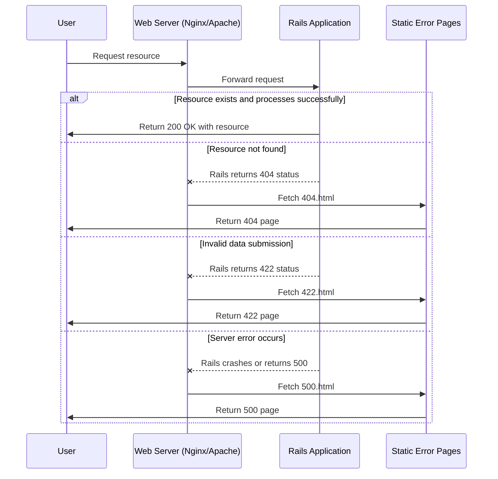
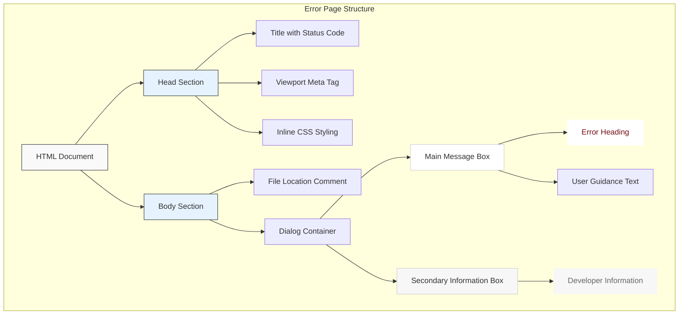
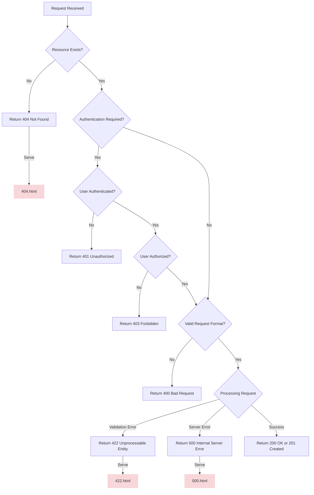

# Response Handling in Ruby Demo

## Overview of Response Handling in Ruby Demo

The Ruby Demo application implements a comprehensive HTTP response handling strategy, particularly focusing on error scenarios that might occur during normal operation. The application follows Rails conventions for error handling, utilizing static HTML pages stored in the public directory to ensure graceful degradation when errors occur. This approach ensures that users receive appropriate feedback even when the Rails application stack encounters critical failures. The error handling system is designed with both user experience and developer troubleshooting in mind, providing clear messaging to end users while also including guidance for application owners to investigate issues through server logs. The implementation follows a minimalist approach with consistent styling across different error scenarios, maintaining visual coherence while communicating different types of failures.

## Static Error Pages Architecture

Ruby Demo follows the standard Rails convention of placing static error pages in the public directory. This architectural decision is crucial for robust error handling because these files are served directly by the web server (e.g., Nginx, Apache) without requiring the Rails application stack to be operational. When catastrophic errors occur that prevent Rails from processing requests, the web server can still access these static files and present them to users. The application includes three primary error pages: 404.html for "Not Found" errors, 422.html for "Unprocessable Entity" errors, and 500.html for "Internal Server Error" scenarios. Each file is completely self-contained with inline CSS, ensuring they can be rendered correctly without external dependencies. This isolation is essential for error pages, as it minimizes potential points of failure when the application is already in a compromised state.

## Error Page Request Flow

The diagram illustrates how HTTP requests flow through the Ruby Demo application's error handling system. When a user makes a request, it first reaches the web server, which forwards it to the Rails application. If the request is valid and can be processed successfully, Rails returns a 200 OK response with the requested resource. However, when errors occur, the flow changes significantly. For 404 (Not Found) errors, Rails signals the web server with a 404 status code, which then bypasses the Rails stack and directly serves the static 404.html file from the public directory. Similarly, for 422 (Unprocessable Entity) errors resulting from invalid form submissions or API requests, the web server serves the static 422.html file. In the most critical case, when the Rails application encounters an internal error or crashes completely, the web server detects the 500 status code (or connection failure) and serves the static 500.html file, ensuring users receive some feedback rather than a browser error page. This architecture provides resilience by decoupling error presentation from application processing.

## 404 Not Found Response Implementation

The 404.html implementation in Ruby Demo provides a user-friendly response when users attempt to access non-existent resources. The page is structured as a complete HTML document with inline CSS styling, ensuring it can be served independently of any application assets. The error message is presented in a dialog-style container with a distinctive red border at the top, providing visual indication of the error state. The content is deliberately concise, with a clear heading stating "The page you were looking for doesn't exist" followed by a brief explanation suggesting possible causes: "You may have mistyped the address or the page may have moved." This messaging strikes a balance between being informative without being overly technical, helping users understand what happened without assigning blame. The page also includes guidance for application owners to check logs for more detailed information, which is valuable for debugging in production environments. The styling is responsive, using percentage-based widths and viewport meta tags to ensure proper display across different device sizes.

## 422 Unprocessable Entity Response

The 422.html page in Ruby Demo handles scenarios where user-submitted data fails validation or processing requirements. This HTTP status code specifically indicates that the server understands the content type and syntax of the request, but cannot process the contained instructions. The implementation features a clean dialog box with the message "The change you wanted was rejected," followed by a suggestion that the user might have attempted to modify something they don't have permission to access. This messaging is carefully crafted to explain the rejection without using technical jargon that might confuse non-technical users. Like other error pages, it maintains the consistent visual language with the red-bordered container and neutral background. The page is particularly important for applications with form submissions or API endpoints where validation failures are common. By providing clear feedback about rejected changes, it helps users understand why their actions weren't successful and potentially guides them toward correct usage. The page also includes the standard note for application owners to check logs, maintaining the pattern established across all error pages.

## 500 Server Error Response Strategy

The 500.html implementation represents the application's last line of defense when server-side errors occur. This page is designed to be served when the Rails application encounters an unhandled exception or other critical failure. The messaging is appropriately apologetic with "We're sorry, but something went wrong," acknowledging the inconvenience to the user without exposing technical details that could potentially reveal security vulnerabilities. Unlike the 404 and 422 pages, the 500 page doesn't attempt to explain possible causes to end users, as server errors are typically not user-actionable and could stem from numerous internal issues. The page maintains the same visual design language as other error pages for consistency, featuring the red-bordered dialog box and clean typography. This consistency helps maintain brand identity even during failure states. The implementation is deliberately minimal, reducing the chance that the error page itself might fail to render. As with other error pages, it includes guidance for application owners to check logs, which is particularly crucial for 500 errors as they often indicate serious application issues requiring immediate attention.

## Error Page Component Structure

The error pages in Ruby Demo share a consistent component structure that creates visual unity across different error scenarios. Each page is built as a complete HTML document with an inline styling approach that ensures independence from external stylesheets. The head section contains a descriptive title that includes the specific HTTP status code, a viewport meta tag for responsive display, and comprehensive CSS definitions that control the page appearance. The body section begins with a comment indicating the file's location in the project structure, which aids developers in quickly locating the file for modifications. The core of each page is a dialog container that's centered on the page with responsive width constraints. This container is divided into two distinct sections: a main message box with a prominent red top border that contains the primary error heading and explanatory text, and a secondary information box with a lighter background that provides guidance for application owners. This consistent structure creates a recognizable pattern across different error scenarios, helping users quickly understand they've encountered an error while the specific messaging communicates the particular nature of the problem. The visual hierarchy emphasizes the error message while maintaining a clean, uncluttered presentation.

## Responsive Design in Error Pages

The error pages in Ruby Demo implement responsive design principles to ensure proper display across various device sizes, from desktop monitors to mobile phones. The implementation uses several key responsive techniques: a viewport meta tag (`width=device-width,initial-scale=1`) that instructs browsers to respect device width and use appropriate scaling, percentage-based widths for the main dialog container (95% width with a maximum width of 33em), and centered positioning with automatic margins. This approach allows the error pages to fluidly adapt to different screen sizes without horizontal scrolling or content overflow issues. The typography is sized using relative units and the container elements use flexible padding defined as percentages, ensuring proper spacing across different device dimensions. The error dialog maintains its visual integrity on smaller screens by scaling proportionally while preserving readability. This responsive implementation is particularly important for error pages, as users might encounter errors on any device type, and receiving clear, properly formatted error information is crucial regardless of the viewing context. The self-contained nature of these pages, with all styling defined inline, ensures that responsive behavior works consistently without external dependencies.

## User Experience Considerations

The error pages in Ruby Demo demonstrate thoughtful user experience design that balances technical accuracy with user-friendly communication. The pages employ several UX best practices: clear, concise headings that immediately communicate the nature of the error; brief explanatory text that avoids technical jargon; and visual design that signals an exception to normal operation without being alarming. The distinctive red border at the top of each dialog provides a consistent visual indicator of an error state, while the overall neutral color scheme and clean typography maintain readability and brand consistency. The messaging is carefully crafted to be informative without being accusatory—for example, the 404 page suggests possible causes like mistyping an address rather than implying user error. Similarly, the 500 page opens with an apology, acknowledging the inconvenience to users. This human-centered approach helps mitigate user frustration during error scenarios. The pages also wisely omit navigation elements or complex recovery options that might introduce additional points of failure, instead keeping the focus on clear communication of the error state. This minimalist approach ensures that users receive essential information about what went wrong, even when the application is in a compromised state.

## HTTP Status Code Decision Tree

This decision tree illustrates how Ruby Demo determines which HTTP status code to return based on different request scenarios, and consequently which error page to serve. When a request is received, the application first checks if the requested resource exists. If not, it returns a 404 Not Found status and serves the 404.html page. If the resource exists but requires authentication, the application verifies the user's credentials. Unauthenticated users receive a 401 Unauthorized response, while authenticated users undergo authorization checks to ensure they have appropriate permissions to access the resource. Failed authorization results in a 403 Forbidden response. For requests that pass these initial checks, the application validates the request format and parameters. Malformed requests trigger a 400 Bad Request response. During request processing, validation errors (such as invalid form submissions) result in a 422 Unprocessable Entity status and the serving of 422.html. If the application encounters an unexpected error during processing, it returns a 500 Internal Server Error and serves the 500.html page. Successful requests receive either a 200 OK or 201 Created response, depending on the operation. This systematic approach ensures appropriate status codes are returned for different error conditions, providing both users and client applications with accurate information about request outcomes.

## Developer Feedback Mechanisms

The error pages in Ruby Demo incorporate specific guidance for application owners and developers to facilitate troubleshooting. Each error page includes the statement "If you are the application owner check the logs for more information," positioned in the secondary information box at the bottom of the dialog. This message serves multiple purposes: it informs regular users that the issue has been logged and can be investigated by the appropriate personnel, while simultaneously directing developers to the application logs where detailed error information would be recorded. This approach maintains the principle of security through obscurity by not exposing technical error details directly in the user interface, while still ensuring that developers have a clear path to diagnostic information. The pages also include HTML comments indicating their file locations (e.g., "This file lives in public/404.html"), which helps developers quickly locate the files for modification when customization is needed. The consistent placement of these developer-oriented elements across all error pages creates a predictable pattern that facilitates maintenance. This dual-audience approach—providing appropriate information for both end users and developers—is a hallmark of well-designed error handling systems, balancing usability with maintainability.

## Best Practices and Future Improvements

While Ruby Demo's error handling system follows many Rails conventions and provides a solid foundation, several enhancements could further improve its effectiveness. First, implementing dynamic error pages through a dedicated ErrorsController would allow for more contextual error information while maintaining the static fallbacks for catastrophic failures. This hybrid approach would provide richer error details when the Rails stack is operational while preserving graceful degradation when it's not. Second, internationalizing error messages would improve accessibility for non-English users, which could be accomplished by moving error text to locale files and implementing language detection. Third, adding structured data markup (such as JSON-LD) to error pages would help search engines better understand error states, potentially improving SEO outcomes during temporary outages. Fourth, implementing more granular error tracking with unique error identifiers displayed to users would facilitate support interactions by allowing helpdesk staff to quickly correlate user-reported issues with specific log entries. Finally, enhancing the pages with conditional navigation options when appropriate (such as a search box on 404 pages) could improve recovery paths for users. These improvements would build upon the existing solid foundation while addressing more sophisticated error handling scenarios and user needs.

[Generated by the Sage AI expert workbench: 2025-03-29 18:36:01  https://sage-tech.ai/workbench]: #