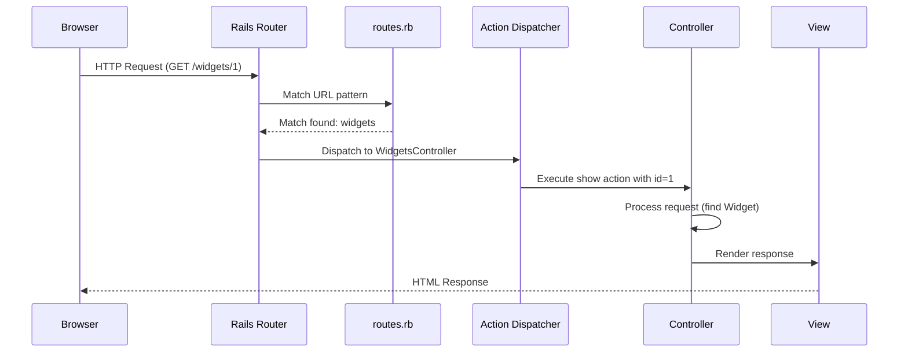
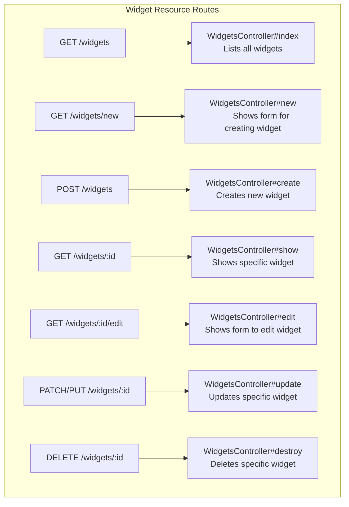
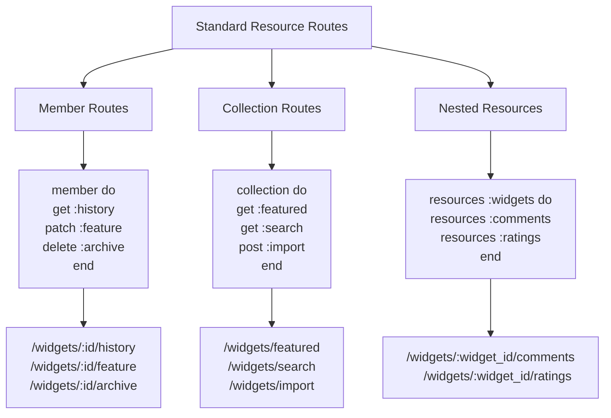
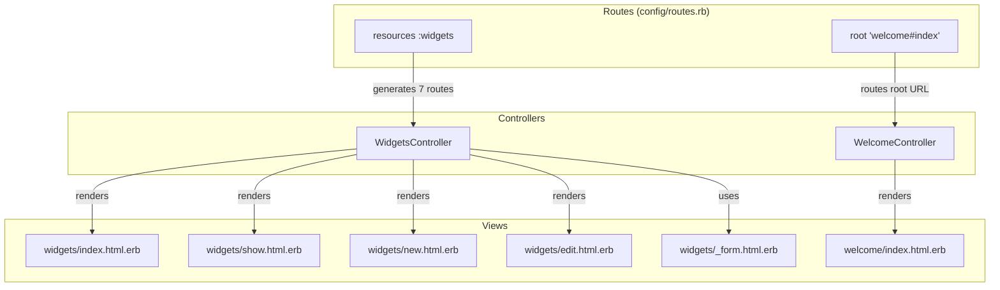

# Ruby on Rails Routing Analysis

## Introduction to Rails Routing

Routing is a fundamental component of the Ruby on Rails framework that serves as the entry point for all HTTP requests to a Rails application. The routing system maps incoming URL requests to specific controller actions, acting as a crucial intermediary in the Model-View-Controller (MVC) architecture. In Rails, routes are defined declaratively in the `config/routes.rb` file, where developers specify the relationship between URL patterns and controller actions.

The routing system performs several critical functions: it parses URL parameters, constructs path and URL helpers for use throughout the application, and enforces RESTful design principles. By centralizing URL definitions, Rails routing provides a single source of truth for an application's URL structure, enabling developers to change routes without modifying controller or view code. This separation of concerns is a key strength of the Rails framework, allowing for more maintainable and adaptable applications.

Rails routing is particularly powerful because it balances convention over configuration with extensive customization options. While it provides sensible defaults through resource-based routing, it also offers fine-grained control through constraints, scopes, and custom route definitions when needed.

## Rails Routing Flow Diagram

The following diagram illustrates how a request flows through the Rails routing system, from the initial browser request to the execution of a controller action:



This diagram demonstrates the request-response cycle in a Rails application. When a browser sends a request to a Rails application, the router first attempts to match the URL against patterns defined in `routes.rb`. Once a match is found, the router determines which controller and action should handle the request, along with any parameters. The Action Dispatcher then instantiates the appropriate controller and invokes the specified action. After the controller processes the request (typically interacting with models), it renders a view which is returned to the browser as the HTTP response. This entire process is governed by the routing configuration, highlighting its central role in Rails applications.

## RESTful Resource Routing in Ruby Demo

The Ruby Demo application employs Rails' resource-based routing through the declaration `resources :widgets` in the routes.rb file. This single line leverages Rails' convention over configuration principle to automatically generate seven standard RESTful routes that map to the CRUD (Create, Read, Update, Delete) operations for the Widget resource.

This approach aligns with REST (Representational State Transfer) architectural principles, where resources are manipulated through standard HTTP verbs. By using resource routing, Ruby Demo gains a consistent, predictable API for widget management without requiring verbose route definitions.

The `resources :widgets` declaration creates routes that follow Rails' resourceful routing conventions, mapping HTTP verbs (GET, POST, PATCH/PUT, DELETE) to controller actions (index, show, new, create, edit, update, destroy). This convention-based approach not only reduces boilerplate code but also encourages adherence to REST principles, resulting in a more maintainable and standardized application structure.

Resource routing also automatically generates named route helpers (like `widgets_path` and `widget_path(id)`) that can be used throughout the application, promoting DRY (Don't Repeat Yourself) code by centralizing URL generation logic. This is particularly valuable as the application evolves, as route changes can be made in a single location without requiring updates to view templates or controllers.

## Widget Resource Routes Mapping

The following table illustrates the seven RESTful routes automatically generated by the `resources :widgets` declaration in Ruby Demo:



This diagram maps each HTTP verb and path combination to its corresponding controller action in the Ruby Demo application. The resource routing system automatically handles parameter extraction, such as the `:id` parameter in routes that target specific widgets. These routes collectively implement a complete RESTful API for widget management.

Each route serves a specific purpose in the CRUD lifecycle: index for listing resources, show for displaying a specific resource, new and create for resource creation, edit and update for resource modification, and destroy for resource deletion. The consistency of this pattern makes the application's behavior predictable and follows web standards, enhancing both developer productivity and API usability.

## Root Route Configuration

The Ruby Demo application defines a root route with the declaration `root 'welcome#index'` in the routes.rb file. This configuration is crucial as it determines what users see when they access the application's base URL (e.g., https://example.com/). In this case, requests to the root path are directed to the `index` action of the `WelcomeController`.

The root route serves as the entry point to the application, providing the first impression to users. By mapping it to the welcome controller's index action, Ruby Demo establishes a dedicated landing page separate from the widget management functionality. This separation of concerns allows the welcome page to focus on introducing the application, while the widgets resource handles the core functionality.

From an architectural perspective, the root route configuration demonstrates Rails' flexibility in URL mapping. While resource routes follow RESTful conventions, the root route can be customized to point to any controller and action that makes sense as an application's homepage. This allows developers to design intuitive user flows without being constrained by resource naming conventions.

## Route Priority and Order

In Rails routing, the order of route declarations in the routes.rb file directly affects their priority during URL matching. Routes defined earlier in the file take precedence over those defined later, which can have significant implications for application behavior.

This priority system is particularly important when routes could potentially overlap. For example, if a static route like `get 'widgets/special'` were defined after `resources :widgets`, the special route would never be matched because the `show` action from the resources declaration (matching `widgets/:id`) would capture the request first, interpreting "special" as an ID.

Ruby Demo's routes.rb file includes a commented note explaining this priority system: "The priority is based upon order of creation: first created -> highest priority." This serves as an important reminder to developers that route order is not merely organizational but functional.

Understanding route priority is essential for proper application behavior. When adding custom routes that might conflict with resource routes, developers must carefully consider their placement in the routes.rb file. Generally, more specific routes should be placed before more general ones to ensure they are matched correctly. This principle becomes increasingly important as an application's routing structure grows in complexity.

## Advanced Routing Options

While Ruby Demo implements basic resource routing, Rails offers numerous advanced routing capabilities that could enhance the application's functionality and organization. These options provide fine-grained control over URL structure, parameter handling, and controller mapping.

Named routes allow developers to create custom URL helpers with the `as:` option. For example, `get 'widgets/featured', to: 'widgets#featured', as: :featured_widgets` would create a `featured_widgets_path` helper. This improves code readability and maintainability by giving meaningful names to routes beyond the standard resource helpers.

Custom member and collection routes extend resource routing to support actions beyond the standard seven. Member routes operate on individual resources (requiring an ID), while collection routes operate on the resource as a whole. For instance, Ruby Demo could add a route to mark a widget as featured with `resources :widgets do; member { patch :feature }; end`, creating a `feature_widget_path(widget)` helper.

Route concerns provide a mechanism for reusing common route patterns across multiple resources. For example, if both widgets and products needed commenting functionality, a concern could define the comment routes once and apply them to both resources, promoting DRY principles.

Constraints allow routes to match based on more than just the URL path. Request parameters, domains, subdomains, and even custom logic can determine whether a route matches. This enables advanced scenarios like multi-tenant applications or feature toggles based on request attributes.

These advanced options demonstrate the flexibility of Rails routing while maintaining its declarative, convention-based approach. As Ruby Demo evolves, these capabilities could be leveraged to support more complex requirements without sacrificing code clarity.

## Route Customization Possibilities

The standard resource routes in Rails provide a solid foundation, but many applications require customization beyond the basic CRUD operations. The following diagram illustrates how resource routes can be extended with member, collection, and nested resource options:



This diagram shows how Ruby Demo could extend its widget resource with additional functionality. Member routes add actions that operate on a specific widget instance, such as viewing its history or marking it as featured. Collection routes add actions that apply to widgets as a group, like searching or displaying featured widgets. Nested resources establish parent-child relationships, allowing for associated resources like comments or ratings to be managed within the context of a specific widget.

These customization options maintain RESTful principles while accommodating application-specific requirements. By following Rails conventions for route customization, Ruby Demo could implement complex functionality while keeping its routing structure organized and predictable. The resulting URLs would clearly communicate resource relationships and action purposes, enhancing API usability for both humans and machines.

## Namespaced Routes

Namespaced routing is a powerful organizational technique in Rails that allows for logical grouping of related controllers and routes. While not implemented in Ruby Demo, namespaces could significantly enhance the application's structure as it grows in complexity.

Namespaces serve multiple purposes in Rails applications. First, they provide URL path prefixing, creating hierarchical URL structures that clearly communicate resource categories. Second, they organize controllers into modules, improving code organization and preventing naming conflicts. For example, an admin namespace would place controllers in the `Admin::` module and prefix routes with `/admin/`.

For Ruby Demo, an administrative interface could be implemented using namespaced routes:

```ruby
namespace :admin do
  resources :widgets
  resources :users
  get 'dashboard', to: 'dashboard#index'
end
```

This would create routes like `/admin/widgets` that map to the `Admin::WidgetsController`, separate from the public widgets controller. This separation enables different authentication requirements, layouts, and functionality for administrative users without duplicating code or complicating the public interface.

API versioning is another common use case for namespaces. As Ruby Demo evolves, it could implement versioned API endpoints:

```ruby
namespace :api do
  namespace :v1 do
    resources :widgets, only: [:index, :show]
  end
end
```

This creates routes like `/api/v1/widgets` that map to `Api::V1::WidgetsController`, allowing for controlled API evolution while maintaining backward compatibility.

Namespaces can also be nested to any depth, enabling complex organizational structures when needed. This scalability makes namespaced routing an essential tool for growing applications like Ruby Demo.

## Route Constraints and Scoping

Route constraints and scopes provide powerful mechanisms for conditionally applying routing rules based on request attributes or organizational needs. While Ruby Demo currently uses a straightforward routing structure, these advanced techniques could enable more sophisticated routing behaviors as the application evolves.

Route constraints filter requests based on properties like subdomains, request formats, or custom logic. For example, Ruby Demo could implement locale-specific routes:

```ruby
scope constraints: { subdomain: 'es' } do
  resources :widgets, controller: 'spanish_widgets'
end
```

This would route requests from the `es` subdomain to a Spanish-specific controller, enabling localization without duplicating route definitions.

Similarly, API versioning could be implemented through constraints:

```ruby
constraints lambda { |req| req.headers['Accept'].include?('version=1') } do
  scope module: 'v1' do
    resources :widgets
  end
end
```

This would route requests with specific headers to version-specific controllers, allowing for API evolution while maintaining a clean URL structure.

Scopes provide a way to apply common options to groups of routes without affecting their namespacing. For instance, Ruby Demo could organize routes by function while keeping them in the same URL namespace:

```ruby
scope :reporting do
  get 'widgets/usage', to: 'reports#widget_usage'
  get 'widgets/performance', to: 'reports#widget_performance'
end
```

This creates URLs like `/reporting/widgets/usage` without requiring a `Reporting::` module for controllers.

Path and module scopes can be used independently, providing flexibility in organizing both URLs and code. As Ruby Demo grows, these techniques would allow its routing structure to evolve without sacrificing clarity or maintainability.

## Ruby Demo Routing Architecture

The following diagram provides a comprehensive view of Ruby Demo's current routing architecture and how it connects to the application's controllers and views:



This diagram illustrates how Ruby Demo's routing configuration connects HTTP requests to the application's controller and view components. The `resources :widgets` declaration generates seven RESTful routes that map to actions in the WidgetsController, which in turn render the appropriate view templates. Similarly, the root route directs the application's homepage to the WelcomeController's index action.

The architecture follows Rails' convention over configuration principle, with predictable relationships between routes, controllers, and views. This consistency makes the application easier to understand and maintain, as developers can quickly determine which components handle specific URLs.

Ruby Demo's routing architecture, while simple, provides a solid foundation for future growth. The clear separation between widget management and the welcome page demonstrates how different functional areas can be organized within the routing system. As the application evolves, this architecture could be extended with namespaces, additional resources, or custom routes while maintaining its logical structure.

## Testing and Debugging Routes

Effective testing and debugging of routes is essential for maintaining a reliable Rails application. For Ruby Demo and similar applications, several techniques and tools are available to ensure routes function as expected.

The `rake routes` command (or `rails routes` in newer versions) is the primary diagnostic tool for inspecting an application's routing table. It displays all defined routes, their HTTP methods, URL patterns, and controller mappings. This output can be filtered using grep to focus on specific routes: `rake routes | grep widgets`. For Ruby Demo, this command would show the seven RESTful widget routes plus the root route.

Route testing should be incorporated into the application's test suite to verify that URLs map to the correct controller actions. Integration tests can ensure the full request cycle works properly, while routing-specific tests can focus on the mapping logic:

```ruby
# In a routing test
assert_routing '/widgets/1', { controller: 'widgets', action: 'show', id: '1' }
```

For debugging route issues, Rails provides detailed logging of the routing process. When a request is received, the development log shows which routes were attempted and which one matched. Setting `config.log_level = :debug` in development.rb enhances this output for troubleshooting complex routing problems.

Named route helpers should be used consistently in views and controllers instead of hardcoded paths. This not only improves maintainability but also helps identify routing issues, as missing or incorrect routes will raise exceptions when the helpers are called.

For applications with complex routing requirements, consider extracting routes into separate files using Ruby's `require` or Rails' `draw` method. While not necessary for Ruby Demo's current scope, this approach improves organization as routing grows more complex.

Regular auditing of routes helps identify unused or redundant routes that might indicate dead code or security vulnerabilities. Tools like the `traceroute` gem can identify controller actions without corresponding routes and vice versa.

By applying these testing and debugging practices, Ruby Demo can maintain a robust routing system that reliably connects user requests to the appropriate application functionality.

[Generated by the Sage AI expert workbench: 2025-03-29 18:36:01  https://sage-tech.ai/workbench]: #