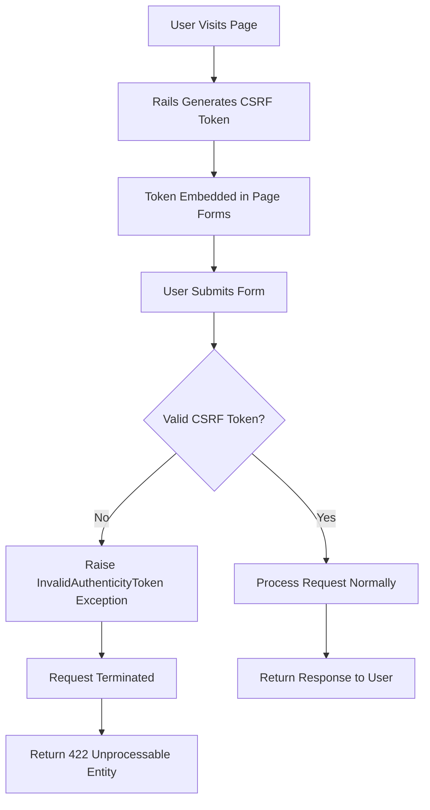
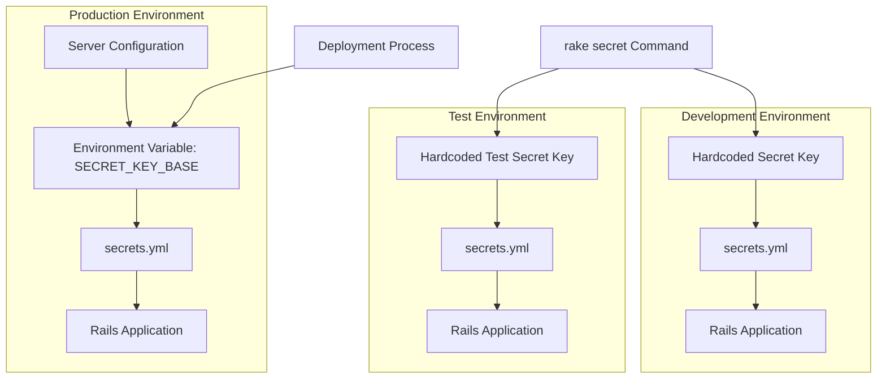
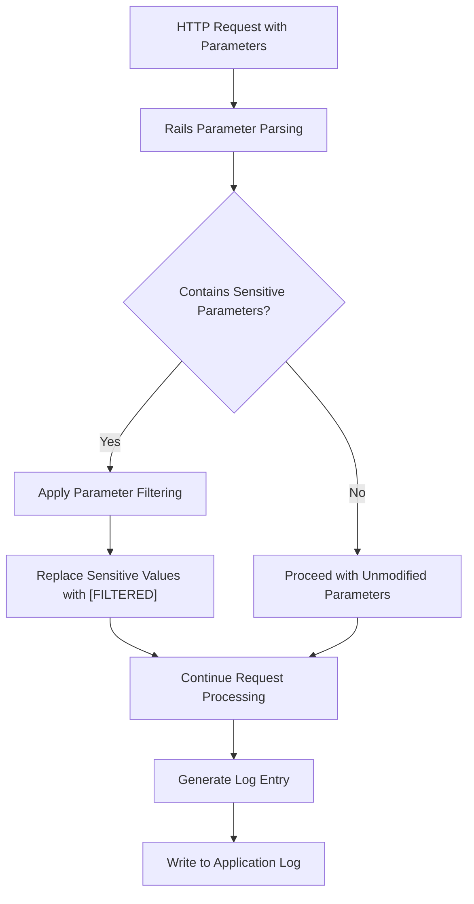
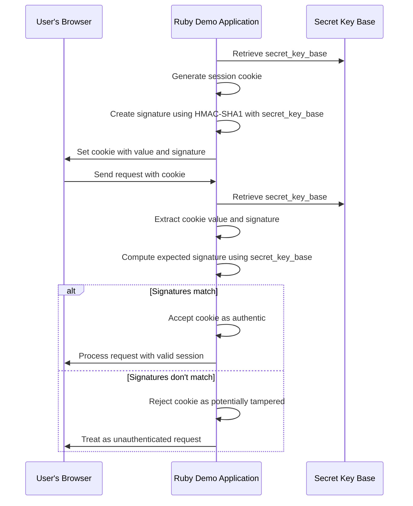

# Security Management in Ruby Demo

## Introduction to Security Management in Ruby Demo

The Ruby Demo application implements several key security measures to protect user data and prevent common web vulnerabilities. As a Rails application focused on widget management, it incorporates standard Rails security features while also implementing custom configurations to enhance its security posture. The application's security architecture addresses multiple concerns including cross-site request forgery (CSRF) protection, secret key management, and sensitive data protection in logs. These measures form a multi-layered defense strategy that aligns with modern web application security best practices. The implementation demonstrates an understanding of the importance of security in web applications, particularly those handling user data and providing CRUD operations through a web interface.

## Cross-Site Request Forgery (CSRF) Protection

The Ruby Demo application implements Cross-Site Request Forgery (CSRF) protection through Rails' built-in security mechanisms. In the ApplicationController, the `protect_from_forgery with: :exception` directive enables CSRF protection for all controllers that inherit from it. This implementation uses the most secure strategy available in Rails by raising an exception when an unverified request is detected.

The exception strategy is particularly important for applications handling sensitive operations, as it completely blocks potentially malicious requests rather than silently nullifying them. When a form is submitted without a valid CSRF token, the application will immediately terminate the request processing and raise an `ActionController::InvalidAuthenticityToken` exception, preventing any unauthorized state-changing operations.

This approach differs from the alternative `:null_session` strategy, which would simply nullify the session rather than raising an exception. The exception strategy provides stronger protection by making the attack attempt more visible and ensuring that no part of the request is processed when CSRF validation fails.

## CSRF Protection Flow

The CSRF protection flow begins when a user visits a page in the Ruby Demo application. Rails automatically generates a unique CSRF token for the user's session and embeds this token in all forms rendered in the page's HTML. When the user submits a form, the token is included in the request.

Upon receiving the request, the Rails application verifies the authenticity of the CSRF token by comparing it with the token stored in the user's session. If the tokens match, the request is considered legitimate and processed normally. However, if the token is missing or invalid, the `protect_from_forgery with: :exception` directive causes Rails to raise an `InvalidAuthenticityToken` exception, immediately terminating the request processing and returning a 422 Unprocessable Entity response to the client.

This mechanism effectively prevents attackers from tricking users into submitting unauthorized requests to the application, as any request without a valid CSRF token (which an attacker cannot easily obtain) will be rejected before any state-changing operations occur.

## Secret Key Management

The Ruby Demo application manages secret keys through the `secrets.yml` configuration file, which defines the secret keys used for verifying the integrity of signed cookies and potentially other security-related functions. The implementation follows Rails conventions by providing environment-specific configurations.

The file contains hardcoded secret keys for development and test environments, which is acceptable for non-production scenarios. These keys are randomly generated strings of sufficient length (over 30 characters) to resist brute force attacks. The file includes comments advising developers to use the `rake secret` command to generate secure random keys, emphasizing the importance of key randomness and length in preventing dictionary attacks.

For the production environment, the application follows security best practices by retrieving the secret key from environment variables rather than hardcoding it in the configuration file. This approach significantly reduces the risk of secret exposure through source code repositories or server configuration files. The comment "Do not keep production secrets in the repository" explicitly warns developers against the security risk of storing production secrets in version control.

## Environment-Based Security Configuration

The Ruby Demo application implements different security configurations based on the environment, following the principle of progressive security hardening as code moves from development to production.

In development and test environments, the application uses hardcoded secret keys in the `secrets.yml` file. This approach simplifies the development process by eliminating the need for environment variable configuration during development and testing. The hardcoded keys are still randomly generated and of sufficient length to provide adequate security for non-production environments.

In contrast, the production environment configuration demonstrates significantly enhanced security measures. The secret key is retrieved from the `SECRET_KEY_BASE` environment variable rather than being hardcoded in the configuration file. This approach aligns with security best practices by:

1. Preventing secret exposure through source code repositories
2. Allowing for secret rotation without code changes
3. Limiting access to production secrets to those with server environment access
4. Enabling different deployment environments to use different secrets

This environment-based configuration strategy reflects a mature understanding of the different security requirements across the application lifecycle, balancing developer convenience in lower environments with strict security controls in production.

## Secret Key Management Across Environments

The diagram illustrates how secret keys are managed differently across the three environments in the Ruby Demo application. In both development and test environments, secret keys are hardcoded directly in the `secrets.yml` file, typically generated using the `rake secret` command to ensure sufficient randomness and length.

In contrast, the production environment retrieves the secret key from the `SECRET_KEY_BASE` environment variable. This variable is typically set during the deployment process or in the server configuration, keeping it separate from the application code. This separation ensures that even if the application code is compromised, the production secret remains protected as long as the server environment is secure.

The environment-specific approach provides appropriate security for each context: convenience during development and testing, where security risks are minimal, and enhanced protection in production, where real user data is at stake. This progressive security model is a common pattern in well-architected Rails applications.

## Sensitive Data Logging Protection

The Ruby Demo application implements protection against sensitive data exposure in logs through parameter filtering. The `filter_parameter_logging.rb` initializer configures Rails to redact sensitive parameters from log files, preventing accidental exposure of confidential information.

The implementation uses Rails' built-in parameter filtering mechanism, adding the `:password` parameter to the list of filtered parameters with the line `Rails.application.config.filter_parameters += [:password]`. When requests containing password fields are logged, their values are replaced with `[FILTERED]` in the log output, ensuring that actual password values never appear in log files.

This security measure is particularly important for preventing accidental exposure of user credentials through log files, which might be accessed by developers, system administrators, or potentially leaked in security incidents. By filtering sensitive parameters at the framework level, the application ensures consistent protection across all controllers and actions without requiring developers to implement filtering logic manually.

However, the current implementation only filters password parameters, which represents a minimal approach to parameter filtering. A more comprehensive security posture would extend filtering to other types of sensitive data such as authentication tokens, credit card numbers, social security numbers, and other personally identifiable information (PII).

## Parameter Filtering Process

The parameter filtering process in the Ruby Demo application begins when an HTTP request containing parameters is received. Rails parses these parameters and checks if any match the list of sensitive parameters defined in `filter_parameter_logging.rb` (currently only `:password`).

When a sensitive parameter is detected, Rails automatically replaces its value with `[FILTERED]` in the parameter hash that will be used for logging purposes. This filtering occurs before any log entries are generated, ensuring that sensitive data never reaches the log files. The original parameter values remain intact for the application to use during request processing.

After parameter filtering is applied, request processing continues normally. When the application generates log entries that include request parameters, the filtered version of the parameters is used, with sensitive values already redacted. These sanitized log entries are then written to the application log file.

This process provides a consistent and automatic mechanism for protecting sensitive data in logs without requiring developers to manually handle parameter redaction. However, the effectiveness of this protection depends on maintaining a comprehensive list of sensitive parameters, which currently appears limited to just passwords in the Ruby Demo application.

## Security Gaps and Improvement Opportunities

Despite implementing several security measures, the Ruby Demo application has notable security gaps that should be addressed. The most significant concern is the limited scope of parameter filtering, which currently only redacts password fields from logs. This leaves other potentially sensitive information vulnerable to exposure in log files. A more comprehensive approach would extend filtering to include:

1. Authentication tokens and session identifiers
2. Personal identifiable information (PII) such as names, addresses, and phone numbers
3. Financial information like credit card numbers and bank account details
4. API keys and other credentials that might appear in requests

Additionally, the application lacks explicit configuration for several important security headers that protect against common web vulnerabilities:
- Content-Security-Policy (CSP) to prevent XSS attacks
- X-Frame-Options to prevent clickjacking
- X-Content-Type-Options to prevent MIME type sniffing
- Strict-Transport-Security (HSTS) to enforce HTTPS

The application would also benefit from implementing:
1. Rate limiting to prevent brute force attacks
2. IP-based throttling for authentication attempts
3. More granular exception handling for security-related errors
4. Comprehensive input validation and sanitization
5. Database-level encryption for sensitive stored data

Another concern is the lack of explicit configuration for secure cookie attributes such as `secure`, `httponly`, and `samesite`, which are essential for protecting cookies from theft and manipulation in modern web environments.

## Cookie Security and Integrity

The Ruby Demo application ensures cookie security and integrity through Rails' built-in cookie signing mechanism, which uses the secret key defined in `secrets.yml`. This mechanism prevents cookie tampering by cryptographically signing cookies with the application's secret key.

When the application creates a cookie, Rails automatically generates a signature using the secret key and appends it to the cookie value. When a request containing the cookie is received, Rails verifies the signature against the current secret key. If the signature is valid, the cookie is accepted; if not, the cookie is rejected as potentially tampered with.

This signing process is particularly important for session cookies, which store user authentication state. Without proper signing, attackers could potentially forge session cookies to impersonate other users. The application's use of a strong, randomly generated secret key (at least 30 characters as recommended in the comments) provides a solid foundation for this security mechanism.

The application also follows best practices by using different secret keys across environments and retrieving the production key from environment variables. This approach allows for key rotation in production without code changes and limits the impact of a potential key compromise in development environments.

## Cookie Signing and Verification Process

The cookie signing and verification process in the Ruby Demo application involves several cryptographic steps to ensure cookie integrity. When the application needs to set a cookie (such as a session cookie), it first retrieves the `secret_key_base` from the configuration. It then generates the cookie value and creates a cryptographic signature using an HMAC-SHA1 algorithm with the secret key. The cookie value and signature are combined and sent to the user's browser.

When the user makes a subsequent request containing the cookie, the application extracts both the cookie value and its signature. It then recalculates what the signature should be using the current `secret_key_base` and compares this expected signature with the one provided in the cookie.

If the signatures match, the application can be confident that the cookie has not been tampered with since it was issued, as only the application with access to the secret key could have generated the valid signature. The request is then processed normally with the authenticated session.

If the signatures don't match, which could happen if the cookie was tampered with or if the secret key was changed, the application rejects the cookie and treats the request as unauthenticated. This verification process provides strong protection against session hijacking and cookie tampering attacks.

## Security Best Practices Implementation

The Ruby Demo application demonstrates several security best practices that align with industry standards for web application security. The implementation of CSRF protection with the exception strategy provides strong defense against cross-site request forgery attacks. The environment-specific secret key management, particularly the use of environment variables for production secrets, follows the principle of keeping sensitive information out of source code repositories.

The application also implements parameter filtering for passwords in logs, which is a basic but important step in preventing sensitive data exposure. The cookie signing mechanism using strong secret keys helps protect against session hijacking and cookie tampering attacks.

However, to further enhance the security posture of the Ruby Demo application, several additional measures should be considered:

1. Expand parameter filtering to cover all types of sensitive information
2. Implement secure HTTP headers through a content security policy
3. Configure cookies with secure attributes (secure, httponly, samesite)
4. Implement rate limiting and account lockout mechanisms
5. Add database-level encryption for sensitive stored data
6. Implement regular secret key rotation procedures
7. Add comprehensive input validation and output encoding
8. Consider implementing two-factor authentication for sensitive operations
9. Establish a security monitoring and incident response plan
10. Conduct regular security assessments and penetration testing

By addressing these recommendations, the Ruby Demo application would achieve a more comprehensive security posture that better protects against the full spectrum of modern web application threats. The current implementation provides a solid foundation, but security is an ongoing process that requires continuous attention and improvement.

[Generated by the Sage AI expert workbench: 2025-03-29 18:36:01  https://sage-tech.ai/workbench]: #